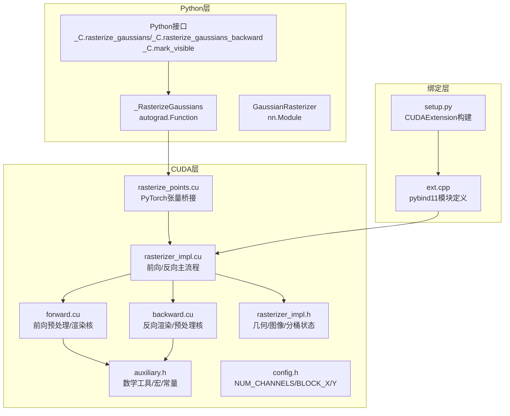
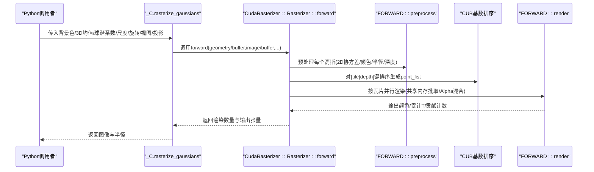
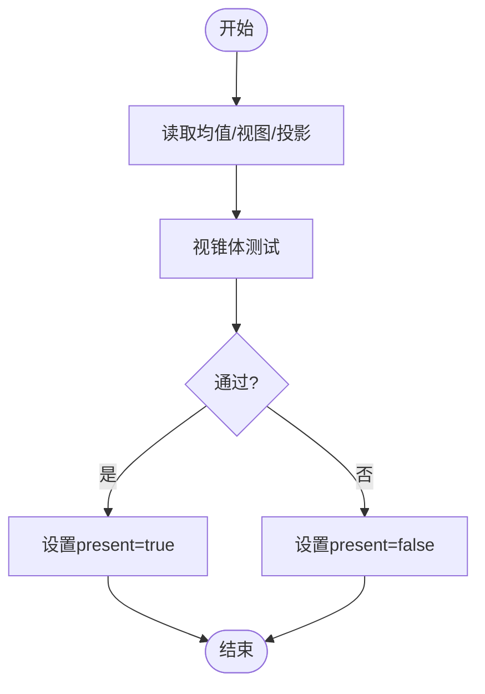
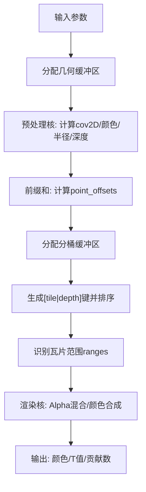
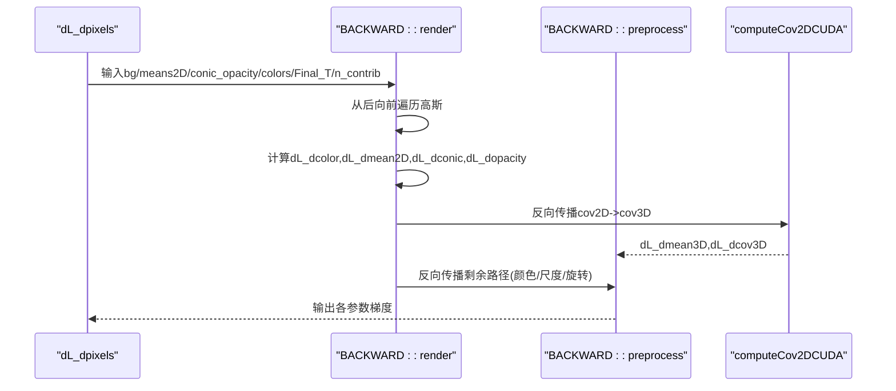
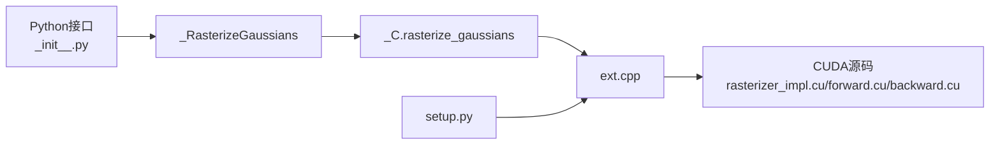

# 3D高斯光栅化器

<cite>
**本文档引用的文件**
- [rasterizer_impl.cu](file://submodules/diff-gaussian-rasterization/cuda_rasterizer/rasterizer_impl.cu)
- [forward.cu](file://submodules/diff-gaussian-rasterization/cuda_rasterizer/forward.cu)
- [backward.cu](file://submodules/diff-gaussian-rasterization/cuda_rasterizer/backward.cu)
- [auxiliary.h](file://submodules/diff-gaussian-rasterization/cuda_rasterizer/auxiliary.h)
- [forward.h](file://submodules/diff-gaussian-rasterization/cuda_rasterizer/forward.h)
- [backward.h](file://submodules/diff-gaussian-rasterization/cuda_rasterizer/backward.h)
- [rasterizer_impl.h](file://submodules/diff-gaussian-rasterization/cuda_rasterizer/rasterizer_impl.h)
- [config.h](file://submodules/diff-gaussian-rasterization/cuda_rasterizer/config.h)
- [rasterize_points.cu](file://submodules/diff-gaussian-rasterization/rasterize_points.cu)
- [rasterize_points.h](file://submodules/diff-gaussian-rasterization/rasterize_points.h)
- [ext.cpp](file://submodules/diff-gaussian-rasterization/ext.cpp)
- [setup.py](file://submodules/diff-gaussian-rasterization/setup.py)
- [__init__.py](file://submodules/diff-gaussian-rasterization/diff_gaussian_rasterization/__init__.py)
</cite>

## 目录
1. [简介](#简介)
2. [项目结构](#项目结构)
3. [核心组件](#核心组件)
4. [架构总览](#架构总览)
5. [详细组件分析](#详细组件分析)
6. [依赖关系分析](#依赖关系分析)
7. [性能考虑](#性能考虑)
8. [故障排查指南](#故障排查指南)
9. [结论](#结论)
10. [附录](#附录)

## 简介
本文件为3D高斯光栅化器的详细技术文档，聚焦于CUDA光栅化器的核心算法实现与工程细节。内容涵盖：
- 高斯函数的数值积分与像素采样策略（EWA椭圆采样）
- 深度缓冲与透明度合成（Alpha混合与T值累积）
- 前向传播与反向传播的CUDA核函数设计（线程块配置、共享内存优化、内存访问模式）
- 可见性标记机制（frustum裁剪）与主渲染流程（rasterize_gaussians）
- 性能优化技巧、内存使用分析与调试方法
- Python接口绑定机制与实际使用示例

## 项目结构
该子模块采用“CUDA内核 + Python绑定 + PyTorch自动微分”三层架构：
- CUDA层：前向/反向核函数、辅助工具与状态管理
- 绑定层：Pybind11/C++扩展，暴露rasterize_gaussians、rasterize_gaussians_backward、mark_visible
- Python层：封装为torch.autograd.Function与nn.Module，便于训练集成



**图表来源**
- [ext.cpp:15-19](file://submodules/diff-gaussian-rasterization/ext.cpp#L15-L19)
- [setup.py:21-29](file://submodules/diff-gaussian-rasterization/setup.py#L21-L29)
- [rasterizer_impl.cu:198-336](file://submodules/diff-gaussian-rasterization/cuda_rasterizer/rasterizer_impl.cu#L198-L336)
- [forward.cu:156-455](file://submodules/diff-gaussian-rasterization/cuda_rasterizer/forward.cu#L156-L455)
- [backward.cu:399-657](file://submodules/diff-gaussian-rasterization/cuda_rasterizer/backward.cu#L399-L657)
- [auxiliary.h:15-175](file://submodules/diff-gaussian-rasterization/cuda_rasterizer/auxiliary.h#L15-L175)
- [config.h:15-19](file://submodules/diff-gaussian-rasterization/cuda_rasterizer/config.h#L15-L19)
- [rasterize_points.cu:35-115](file://submodules/diff-gaussian-rasterization/rasterize_points.cu#L35-L115)
- [rasterizer_impl.h:29-74](file://submodules/diff-gaussian-rasterization/cuda_rasterizer/rasterizer_impl.h#L29-L74)

**章节来源**
- [setup.py:17-34](file://submodules/diff-gaussian-rasterization/setup.py#L17-L34)
- [ext.cpp:15-19](file://submodules/diff-gaussian-rasterization/ext.cpp#L15-L19)

## 核心组件
- 几何状态（GeometryState）：存储每个高斯的深度、裁剪后的半径、2D均值、3D协方差、逆2D协方差+不透明度、颜色、覆盖的瓦片数等，并提供从连续内存切片中分配指针的工具。
- 图像状态（ImageState）：每像素累计alpha（T值）、贡献次数、以及按瓦片划分的渲染范围。
- 分桶状态（BinningState）：按[tile|depth]键排序的高斯索引列表及其键数组，支持CUB基数排序。

这些状态通过统一的内存切片分配器从上层传入的函数式缓冲区中分配，避免重复显存申请，提升吞吐。

**章节来源**
- [rasterizer_impl.h:29-74](file://submodules/diff-gaussian-rasterization/cuda_rasterizer/rasterizer_impl.h#L29-L74)
- [rasterizer_impl.cu:155-194](file://submodules/diff-gaussian-rasterization/cuda_rasterizer/rasterizer_impl.cu#L155-L194)

## 架构总览
CUDA光栅化分为三个阶段：
1) 可见性标记（Frustum裁剪）：快速剔除不可见高斯，减少后续工作量。
2) 预处理与分桶：计算2D协方差、逆协方差与不透明度，生成覆盖矩形与[tile|depth]键，进行基数排序，得到按瓦片分组的高斯序列。
3) 并行渲染：每个瓦片由一个线程块负责，线程在像素级迭代，按深度顺序对高斯进行EWA采样与Alpha混合，输出最终颜色与T值。



**图表来源**
- [rasterize_points.cu:35-115](file://submodules/diff-gaussian-rasterization/rasterize_points.cu#L35-L115)
- [rasterizer_impl.cu:198-336](file://submodules/diff-gaussian-rasterization/cuda_rasterizer/rasterizer_impl.cu#L198-L336)
- [forward.cu:402-455](file://submodules/diff-gaussian-rasterization/cuda_rasterizer/forward.cu#L402-L455)

## 详细组件分析

### mark_visible函数：可见性标记机制
- 输入：3D均值、视图矩阵、投影矩阵
- 算法：对每个高斯执行视锥体测试，若通过则标记为可见；使用辅助函数判断是否在近平面与视锥内
- 输出：布尔张量表示可见性
- 用途：在训练前快速剔除不可见点，降低后续分桶与渲染成本



**图表来源**
- [rasterizer_impl.cu:140-153](file://submodules/diff-gaussian-rasterization/cuda_rasterizer/rasterizer_impl.cu#L140-L153)
- [auxiliary.h:139-164](file://submodules/diff-gaussian-rasterization/cuda_rasterizer/auxiliary.h#L139-L164)

**章节来源**
- [rasterizer_impl.cu:140-153](file://submodules/diff-gaussian-rasterization/cuda_rasterizer/rasterizer_impl.cu#L140-L153)
- [rasterize_points.cu:198-217](file://submodules/diff-gaussian-rasterization/rasterize_points.cu#L198-L217)

### rasterize_gaussians函数：主渲染流程
- 输入：背景色、3D均值、颜色或SH、不透明度、尺度/旋转或3D协方差、视图/投影、相机位置、分辨率、球谐度、是否预过滤、调试开关
- 步骤：
  1) 分配几何状态缓冲区，调用预处理核计算每个高斯的2D均值、深度、逆协方差+不透明度、颜色（若未预计算）、覆盖矩形与瓦片数
  2) 对覆盖矩形数做前缀和，得到每个高斯在全局列表中的偏移
  3) 分配分桶缓冲区，为每个高斯生成[tile|depth]键并复制高斯索引，使用CUB基数排序
  4) 清零图像范围，识别每个瓦片在排序后列表中的起止范围
  5) 调用渲染核，按瓦片并行渲染，输出颜色与累计T值
- 输出：渲染数量、颜色张量、半径张量、几何/分桶/图像缓冲区（供反向传播复用）



**图表来源**
- [rasterizer_impl.cu:198-336](file://submodules/diff-gaussian-rasterization/cuda_rasterizer/rasterizer_impl.cu#L198-L336)
- [forward.cu:402-455](file://submodules/diff-gaussian-rasterization/cuda_rasterizer/forward.cu#L402-L455)

**章节来源**
- [rasterizer_impl.cu:198-336](file://submodules/diff-gaussian-rasterization/cuda_rasterizer/rasterizer_impl.cu#L198-L336)

### 前向传播CUDA核：preprocessCUDA/renderCUDA
- preprocessCUDA：
  - 视锥体剔除
  - 投影到屏幕空间，计算2D协方差（EWA）
  - 计算逆协方差与不透明度，打包为float4
  - 计算覆盖矩形与瓦片数
  - 若未提供预计算颜色，则将SH转换为RGB并记录裁剪标志
- renderCUDA：
  - 每个线程块负责一个瓦片，线程在像素网格内协作
  - 共享内存批量收集高斯数据（ID、2D均值、逆协方差+不透明度）
  - 按深度顺序遍历高斯，计算高斯函数指数项与Alpha，进行Alpha混合
  - 累积颜色与T值，记录最后贡献者以加速早期退出

```mermaid
classDiagram
class PreprocessKernel {
+preprocessCUDA(P,D,M,...)
-视锥体剔除
-计算cov2D/逆协方差+不透明度
-计算覆盖矩形与半径
-SH->RGB(可选)
}
class RenderKernel {
+renderCUDA(W,H,...)
-共享内存批取
-按深度顺序遍历高斯
-EWA采样与Alpha混合
-输出颜色/T值
}
PreprocessKernel --> RenderKernel : "输入 : means2D/conic_opacity/颜色"
```

**图表来源**
- [forward.cu:156-256](file://submodules/diff-gaussian-rasterization/cuda_rasterizer/forward.cu#L156-L256)
- [forward.cu:262-374](file://submodules/diff-gaussian-rasterization/cuda_rasterizer/forward.cu#L262-L374)

**章节来源**
- [forward.cu:156-256](file://submodules/diff-gaussian-rasterization/cuda_rasterizer/forward.cu#L156-L256)
- [forward.cu:262-374](file://submodules/diff-gaussian-rasterization/cuda_rasterizer/forward.cu#L262-L374)

### 反向传播CUDA核：renderCUDA/preprocessCUDA
- renderCUDA（反向渲染）：
  - 从后向前遍历高斯（利用前向保存的最后贡献者信息）
  - 计算每个高斯对像素颜色的梯度，反向传播至颜色、2D均值、逆协方差、不透明度
  - 使用原子加法累积梯度，避免竞争
- preprocessCUDA（反向预处理）：
  - 将2D均值梯度反推回3D均值（投影变换导数）
  - 若使用SH，将颜色梯度反推回SH系数（链式法则与裁剪标志）
  - 若使用尺度/旋转，将3D协方差梯度反推回尺度与旋转（矩阵链式法则）



**图表来源**
- [backward.cu:399-657](file://submodules/diff-gaussian-rasterization/cuda_rasterizer/backward.cu#L399-L657)

**章节来源**
- [backward.cu:399-657](file://submodules/diff-gaussian-rasterization/cuda_rasterizer/backward.cu#L399-L657)

### 数值积分与像素采样策略
- 高斯函数采用EWA（Elliptical Weighted Average）采样，使用2D逆协方差矩阵作为权重张量
- 功率项为二次型形式，结合不透明度与指数衰减，避免数值不稳定
- 通过“最后贡献者”与阈值提前终止，显著减少无效像素的高斯遍历

**章节来源**
- [forward.cu:330-351](file://submodules/diff-gaussian-rasterization/cuda_rasterizer/forward.cu#L330-L351)
- [backward.cu:490-501](file://submodules/diff-gaussian-rasterization/cuda_rasterizer/backward.cu#L490-L501)

### 深度缓冲区管理与透明度合成
- 每像素维护累计透明度T（Final_T），初始为1，每次混合更新为 T *= (1 - alpha)
- 最终颜色为累积颜色加上背景色乘以剩余T
- 贡献计数n_contrib用于反向时从后向前遍历

**章节来源**
- [forward.cu:367-373](file://submodules/diff-gaussian-rasterization/cuda_rasterizer/forward.cu#L367-L373)
- [backward.cu:441-447](file://submodules/diff-gaussian-rasterization/cuda_rasterizer/backward.cu#L441-L447)

### 线程块配置、共享内存优化与内存访问模式
- 线程块大小：BLOCK_X × BLOCK_Y，默认16×16，对应瓦片尺寸
- 共享内存：每个块为每个像素批次缓存ID、2D均值、逆协方差+不透明度，减少全局内存带宽压力
- 内存访问：渲染核采用交错访问模式，先按瓦片范围加载，再在共享内存中按线程索引访问，提高吞吐

**章节来源**
- [config.h:15-19](file://submodules/diff-gaussian-rasterization/cuda_rasterizer/config.h#L15-L19)
- [forward.cu:294-322](file://submodules/diff-gaussian-rasterization/cuda_rasterizer/forward.cu#L294-L322)
- [backward.cu:434-437](file://submodules/diff-gaussian-rasterization/cuda_rasterizer/backward.cu#L434-L437)

## 依赖关系分析
- Python层通过_autograd.Function封装，将前向与反向调用桥接到C++扩展
- C++扩展通过pybind11导出三个C函数：rasterize_gaussians、rasterize_gaussians_backward、mark_visible
- setup.py使用CUDAExtension编译CUDA源码与扩展入口，指定GLM头文件路径



**图表来源**
- [__init__.py:44-156](file://submodules/diff-gaussian-rasterization/diff_gaussian_rasterization/__init__.py#L44-L156)
- [ext.cpp:15-19](file://submodules/diff-gaussian-rasterization/ext.cpp#L15-L19)
- [setup.py:21-29](file://submodules/diff-gaussian-rasterization/setup.py#L21-L29)

**章节来源**
- [__init__.py:44-156](file://submodules/diff-gaussian-rasterization/diff_gaussian_rasterization/__init__.py#L44-L156)
- [ext.cpp:15-19](file://submodules/diff-gaussian-rasterization/ext.cpp#L15-L19)
- [setup.py:21-29](file://submodules/diff-gaussian-rasterization/setup.py#L21-L29)

## 性能考虑
- 瓦片化渲染：将屏幕划分为BLOCK_X×BLOCK_Y瓦片，每个线程块负责一瓦片，天然满足SIMT并行
- 共享内存批取：减少全局内存往返，提高带宽利用率
- 提前终止：基于T值与阈值快速跳过后续高斯，显著降低计算量
- 排序优化：使用CUB基数排序，高效生成按瓦片与深度有序的高斯序列
- 内存布局：几何/图像/分桶状态统一从连续缓冲区分配，减少碎片与分配开销

[本节为通用性能讨论，无需特定文件来源]

## 故障排查指南
- 调试开关：在forward/backward中可通过debug参数触发同步检查，捕获CUDA错误并抛出异常
- 快照保存：Python层在异常时保存当前参数快照，便于定位问题
- 常见问题：
  - 输入维度不匹配：确保means3D为(N,3)，颜色/球谐/尺度/旋转等维度一致
  - 预计算与非预计算参数互斥：颜色与SH二选一，3D协方差与尺度/旋转二选一
  - 近平面裁剪：若启用预过滤且出现异常，检查视锥体测试逻辑

**章节来源**
- [auxiliary.h:166-175](file://submodules/diff-gaussian-rasterization/cuda_rasterizer/auxiliary.h#L166-L175)
- [__init__.py:83-92](file://submodules/diff-gaussian-rasterization/diff_gaussian_rasterization/__init__.py#L83-L92)
- [__init__.py:132-141](file://submodules/diff-gaussian-rasterization/diff_gaussian_rasterization/__init__.py#L132-L141)

## 结论
该3D高斯光栅化器通过高效的CUDA实现，将高斯函数的数值积分、EWA采样与Alpha混合无缝集成到PyTorch训练管线中。其核心优势在于：
- 瓦片化并行与共享内存批取，兼顾吞吐与带宽
- 深度排序与提前终止，显著降低无效计算
- 完整的自动微分链路，支持端到端优化
- 清晰的Python接口与调试机制，便于研究与工程落地

[本节为总结，无需特定文件来源]

## 附录

### Python接口绑定机制与使用示例
- 绑定机制：
  - pybind11导出三个C函数：rasterize_gaussians、rasterize_gaussians_backward、mark_visible
  - setup.py使用CUDAExtension编译所有CUDA源码
- 使用方式：
  - 通过GaussianRasterizer.forward传入3D均值、球谐系数或预计算颜色、不透明度、尺度/旋转或3D协方差、视图/投影矩阵、相机位置等
  - 可选调用markVisible进行可见性标记
  - 自动微分通过_autograd.Function完成，无需手动编写雅可比

**章节来源**
- [ext.cpp:15-19](file://submodules/diff-gaussian-rasterization/ext.cpp#L15-L19)
- [setup.py:21-29](file://submodules/diff-gaussian-rasterization/setup.py#L21-L29)
- [__init__.py:171-222](file://submodules/diff-gaussian-rasterization/diff_gaussian_rasterization/__init__.py#L171-L222)