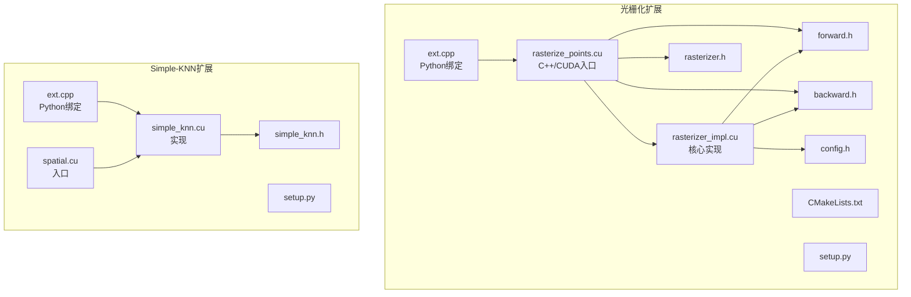
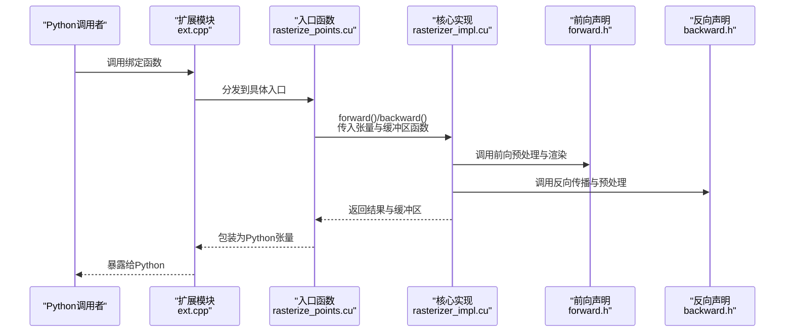
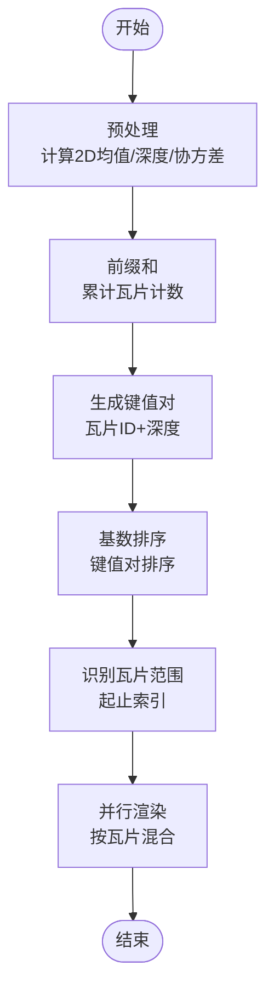
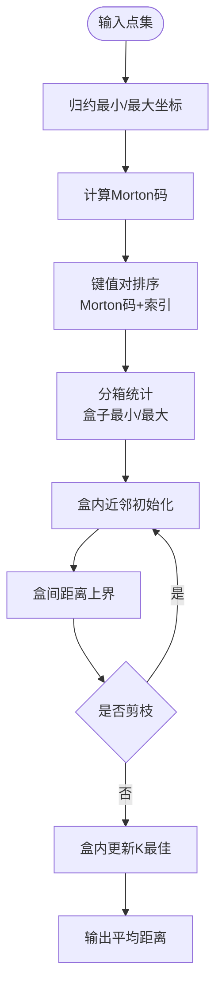
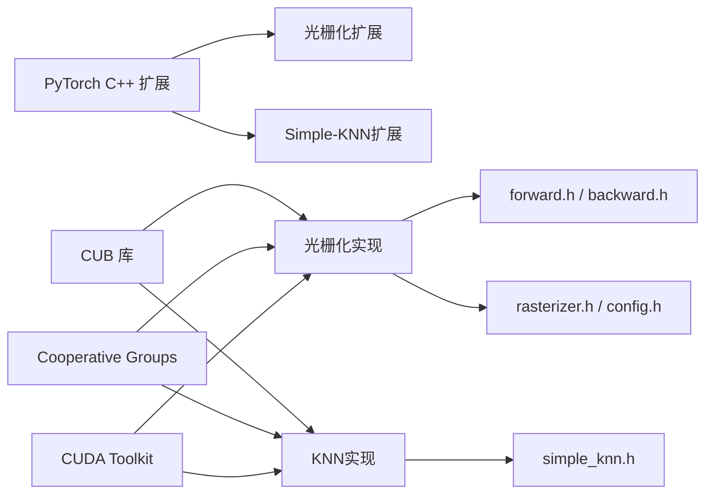

# CUDA扩展模块

<cite>
**本文引用的文件**
- [ext.cpp（光栅化）](file://submodules/diff-gaussian-rasterization/ext.cpp)
- [setup.py（光栅化）](file://submodules/diff-gaussian-rasterization/setup.py)
- [rasterize_points.cu（光栅化入口）](file://submodules/diff-gaussian-rasterization/rasterize_points.cu)
- [rasterize_points.h（光栅化声明）](file://submodules/diff-gaussian-rasterization/rasterize_points.h)
- [rasterizer_impl.cu（光栅化核心实现）](file://submodules/diff-gaussian-rasterization/cuda_rasterizer/rasterizer_impl.cu)
- [rasterizer.h（光栅化类声明）](file://submodules/diff-gaussian-rasterization/cuda_rasterizer/rasterizer.h)
- [forward.h（前向声明）](file://submodules/diff-gaussian-rasterization/cuda_rasterizer/forward.h)
- [backward.h（反向声明）](file://submodules/diff-gaussian-rasterization/cuda_rasterizer/backward.h)
- [config.h（光栅化配置）](file://submodules/diff-gaussian-rasterization/cuda_rasterizer/config.h)
- [CMakeLists.txt（光栅化CMake）](file://submodules/diff-gaussian-rasterization/CMakeLists.txt)
- [ext.cpp（Simple-KNN）](file://submodules/simple-knn/ext.cpp)
- [setup.py（Simple-KNN）](file://submodules/simple-knn/setup.py)
- [simple_knn.cu（Simple-KNN实现）](file://submodules/simple-knn/simple_knn.cu)
- [simple_knn.h（Simple-KNN类声明）](file://submodules/simple-knn/simple_knn.h)
- [spatial.cu（Simple-KNN入口）](file://submodules/simple-knn/spatial.cu)
- [spatial.h（Simple-KNN声明）](file://submodules/simple-knn/spatial.h)
</cite>

## 目录
1. [简介](#简介)
2. [项目结构](#项目结构)
3. [核心组件](#核心组件)
4. [架构总览](#架构总览)
5. [详细组件分析](#详细组件分析)
6. [依赖关系分析](#依赖关系分析)
7. [性能考量](#性能考量)
8. [故障排查指南](#故障排查指南)
9. [结论](#结论)
10. [附录](#附录)

## 简介
本文件面向CUDA扩展模块的技术文档，聚焦两类核心能力：
- 自定义CUDA光栅化器：基于高斯点云的可微分光栅化，包含核函数设计、内存管理、并行计算优化与GPU资源调度。
- Simple-KNN邻域搜索：基于空间索引（Morton码）的CUDA实现，包含空间索引构建、查询优化与性能调优策略。

文档同时提供编译配置、调试方法、性能基准建议以及Python绑定机制与使用注意事项，帮助读者在实际工程中高效集成与优化。

## 项目结构
该仓库包含两个独立的CUDA扩展子模块，均通过PyTorch C++扩展机制对外暴露Python接口：
- diff-gaussian-rasterization：高斯光栅化引擎，提供前向渲染、反向传播与可见性标记。
- simple-knn：邻域搜索模块，提供基于Morton码的空间索引与KNN查询。

图表来源
- [ext.cpp（光栅化）:15-19](file://submodules/diff-gaussian-rasterization/ext.cpp#L15-L19)
- [rasterize_points.cu（光栅化入口）:35-115](file://submodules/diff-gaussian-rasterization/rasterize_points.cu#L35-L115)
- [rasterizer_impl.cu（光栅化核心实现）:196-336](file://submodules/diff-gaussian-rasterization/cuda_rasterizer/rasterizer_impl.cu#L196-L336)
- [forward.h（前向声明）:21-63](file://submodules/diff-gaussian-rasterization/cuda_rasterizer/forward.h#L21-L63)
- [backward.h（反向声明）:21-63](file://submodules/diff-gaussian-rasterization/cuda_rasterizer/backward.h#L21-L63)
- [rasterizer.h（光栅化类声明）:18-85](file://submodules/diff-gaussian-rasterization/cuda_rasterizer/rasterizer.h#L18-L85)
- [config.h（光栅化配置）:15-19](file://submodules/diff-gaussian-rasterization/cuda_rasterizer/config.h#L15-L19)
- [CMakeLists.txt（光栅化CMake）:22-37](file://submodules/diff-gaussian-rasterization/CMakeLists.txt#L22-L37)
- [setup.py（光栅化）:17-34](file://submodules/diff-gaussian-rasterization/setup.py#L17-L34)
- [ext.cpp（Simple-KNN）:15-17](file://submodules/simple-knn/ext.cpp#L15-L17)
- [simple_knn.cu（Simple-KNN实现）:185-221](file://submodules/simple-knn/simple_knn.cu#L185-L221)
- [spatial.cu（Simple-KNN入口）:15-26](file://submodules/simple-knn/spatial.cu#L15-L26)
- [simple_knn.h（Simple-KNN类声明）:15-21](file://submodules/simple-knn/simple_knn.h#L15-L21)
- [setup.py（Simple-KNN）:21-35](file://submodules/simple-knn/setup.py#L21-L35)

章节来源
- [ext.cpp（光栅化）:15-19](file://submodules/diff-gaussian-rasterization/ext.cpp#L15-L19)
- [setup.py（光栅化）:17-34](file://submodules/diff-gaussian-rasterization/setup.py#L17-L34)
- [ext.cpp（Simple-KNN）:15-17](file://submodules/simple-knn/ext.cpp#L15-L17)
- [setup.py（Simple-KNN）:21-35](file://submodules/simple-knn/setup.py#L21-L35)

## 核心组件
- 光栅化扩展（diff-gaussian-rasterization）
  - Python绑定：通过扩展模块导出前向渲染、反向传播与可见性标记接口。
  - 核心流程：预处理（几何与协方差）、键值生成与排序、按瓦片范围并行合成、反向传播梯度回传。
  - 关键数据结构：几何状态、图像状态、分桶状态；使用CUB进行前缀和与排序；线程块大小由配置控制。
- Simple-KNN扩展（simple-knn）
  - Python绑定：导出距离计算接口，内部实现基于Morton码的空间索引与盒内近邻搜索。
  - 核心流程：最小最大值归约得到包围盒，计算Morton码并排序，分箱统计盒边界，盒间/盒内近邻更新，输出平均距离。

章节来源
- [rasterize_points.cu（光栅化入口）:35-115](file://submodules/diff-gaussian-rasterization/rasterize_points.cu#L35-L115)
- [rasterizer_impl.cu（光栅化核心实现）:196-336](file://submodules/diff-gaussian-rasterization/cuda_rasterizer/rasterizer_impl.cu#L196-L336)
- [simple_knn.cu（Simple-KNN实现）:185-221](file://submodules/simple-knn/simple_knn.cu#L185-L221)

## 架构总览
下图展示从Python到CUDA扩展再到核心核函数的调用链路与数据流。

图表来源
- [ext.cpp（光栅化）:15-19](file://submodules/diff-gaussian-rasterization/ext.cpp#L15-L19)
- [rasterize_points.cu（光栅化入口）:35-115](file://submodules/diff-gaussian-rasterization/rasterize_points.cu#L35-L115)
- [rasterizer_impl.cu（光栅化核心实现）:196-336](file://submodules/diff-gaussian-rasterization/cuda_rasterizer/rasterizer_impl.cu#L196-L336)
- [forward.h（前向声明）:21-63](file://submodules/diff-gaussian-rasterization/cuda_rasterizer/forward.h#L21-L63)
- [backward.h（反向声明）:21-63](file://submodules/diff-gaussian-rasterization/cuda_rasterizer/backward.h#L21-L63)

## 详细组件分析

### 组件A：CUDA光栅化器
- 设计要点
  - 预处理阶段：将3D均值、尺度、旋转转换至2D投影、深度与协方差，计算每个高斯覆盖的瓦片数并生成键值对（瓦片ID+深度）。
  - 排序与分桶：使用CUB对键值对进行基数排序，得到按瓦片与深度有序的高斯列表；识别每瓦片的起止索引范围。
  - 并行合成：每个瓦片独立读取其范围内的高斯，按深度顺序混合颜色与透明度，累加贡献计数。
  - 反向传播：像素级梯度回传至2D均值、共形矩阵、不透明度与颜色等参数。
- 内存管理
  - 使用“分块缓冲区”函数式分配几何、分桶与图像状态缓冲，按需扩容并复用，减少频繁分配开销。
  - 前缀和与排序中间空间通过CUB动态探测所需临时存储大小后一次性分配。
- 并行优化
  - 线程块大小固定为16×16，瓦片网格并行，最大化吞吐。
  - 使用cooperative groups进行块内规约与同步，提升局部收敛效率。
- GPU资源调度
  - 键值生成与排序、瓦片范围识别、渲染核函数分别以不同网格规模调度，避免资源争用。
  - 动态尺寸图像缓冲在训练时按分辨率调整，保证内存与带宽利用率。

图表来源
- [rasterizer_impl.cu（光栅化核心实现）:196-336](file://submodules/diff-gaussian-rasterization/cuda_rasterizer/rasterizer_impl.cu#L196-L336)
- [config.h（光栅化配置）:15-19](file://submodules/diff-gaussian-rasterization/cuda_rasterizer/config.h#L15-L19)

章节来源
- [rasterizer_impl.cu（光栅化核心实现）:196-336](file://submodules/diff-gaussian-rasterization/cuda_rasterizer/rasterizer_impl.cu#L196-L336)
- [rasterize_points.cu（光栅化入口）:35-115](file://submodules/diff-gaussian-rasterization/rasterize_points.cu#L35-L115)
- [rasterize_points.cu（光栅化入口）:117-196](file://submodules/diff-gaussian-rasterization/rasterize_points.cu#L117-L196)
- [rasterizer.h（光栅化类声明）:18-85](file://submodules/diff-gaussian-rasterization/cuda_rasterizer/rasterizer.h#L18-L85)
- [forward.h（前向声明）:21-63](file://submodules/diff-gaussian-rasterization/cuda_rasterizer/forward.h#L21-L63)
- [backward.h（反向声明）:21-63](file://submodules/diff-gaussian-rasterization/cuda_rasterizer/backward.h#L21-L63)
- [config.h（光栅化配置）:15-19](file://submodules/diff-gaussian-rasterization/cuda_rasterizer/config.h#L15-L19)

### 组件B：Simple-KNN邻域搜索
- 设计要点
  - 空间索引：通过Morton码将3D坐标映射到1D，利用CUB对键值对进行基数排序，使空间相邻点在全局序列中也相邻。
  - 分箱：将点集划分为固定大小的盒子，计算每个盒子的最小最大包围盒，用于快速剔除不可能的候选。
  - 查询优化：对每个点，先用盒内最近邻更新K个最佳，再以盒间距离上界剪枝，仅在必要时遍历盒内点。
- 核心核函数
  - Morton码生成与排序：将每个点映射到Morton码并排序，随后按序号重排。
  - 盒边界计算：块内规约统计每个盒子的最小最大值。
  - 盒间/盒内近邻：根据盒间距离上界决定是否进一步检查盒内点，维护K个最佳距离。
- 性能调优
  - BOX_SIZE：控制盒子大小，平衡盒数量与盒内遍历成本。
  - K值：影响近邻质量与更新频率，通常K=3。
  - 排序与共享内存：块内规约使用共享内存减少全局通信。

图表来源
- [simple_knn.cu（Simple-KNN实现）:185-221](file://submodules/simple-knn/simple_knn.cu#L185-L221)
- [simple_knn.cu（Simple-KNN实现）:63-70](file://submodules/simple-knn/simple_knn.cu#L63-L70)
- [simple_knn.cu（Simple-KNN实现）:78-117](file://submodules/simple-knn/simple_knn.cu#L78-L117)
- [simple_knn.cu（Simple-KNN实现）:147-183](file://submodules/simple-knn/simple_knn.cu#L147-L183)

章节来源
- [simple_knn.cu（Simple-KNN实现）:185-221](file://submodules/simple-knn/simple_knn.cu#L185-L221)
- [spatial.cu（Simple-KNN入口）:15-26](file://submodules/simple-knn/spatial.cu#L15-L26)
- [simple_knn.h（Simple-KNN类声明）:15-21](file://submodules/simple-knn/simple_knn.h#L15-L21)

### 组件C：Python绑定与使用注意事项
- 绑定机制
  - 光栅化：通过pybind11在扩展模块中注册前向、反向与可见性标记函数。
  - Simple-KNN：注册distCUDA2函数，接收点云张量，返回每个点与其K近邻的平均距离。
- 使用注意事项
  - 输入张量维度与类型：确保3D均值为(N,3)，颜色/不透明度等张量维度匹配；CUDA设备与连续内存布局。
  - 缓冲区复用：前向/反向调用会动态分配并复用内部缓冲区，避免重复分配带来的开销。
  - 预计算协方差：若提供预计算协方差，可跳过内部计算，减少前向时间。
  - 可见性标记：在渲染前调用可见性标记，可显著减少无效高斯参与渲染。

章节来源
- [ext.cpp（光栅化）:15-19](file://submodules/diff-gaussian-rasterization/ext.cpp#L15-L19)
- [rasterize_points.cu（光栅化入口）:35-115](file://submodules/diff-gaussian-rasterization/rasterize_points.cu#L35-L115)
- [rasterize_points.cu（光栅化入口）:198-217](file://submodules/diff-gaussian-rasterization/rasterize_points.cu#L198-L217)
- [ext.cpp（Simple-KNN）:15-17](file://submodules/simple-knn/ext.cpp#L15-L17)
- [spatial.cu（Simple-KNN入口）:15-26](file://submodules/simple-knn/spatial.cu#L15-L26)

## 依赖关系分析
- 外部依赖
  - PyTorch C++扩展：提供张量接口与CUDA支持。
  - CUB：设备级归约、扫描与基数排序。
  - cooperative_groups：块内并行原语。
  - CUDA Toolkit：核函数编译与运行时。
- 内部依赖
  - 光栅化：rasterize_points.cu依赖rasterizer_impl.cu与forward.h/backward.h声明；rasterizer_impl.cu依赖config.h与辅助头文件。
  - Simple-KNN：spatial.cu依赖simple_knn.cu中的实现；simple_knn.cu依赖CUB与cooperative_groups。

图表来源
- [rasterizer_impl.cu（光栅化核心实现）:18-31](file://submodules/diff-gaussian-rasterization/cuda_rasterizer/rasterizer_impl.cu#L18-L31)
- [simple_knn.cu（Simple-KNN实现）:17-27](file://submodules/simple-knn/simple_knn.cu#L17-L27)
- [rasterize_points.cu（光栅化入口）:21-25](file://submodules/diff-gaussian-rasterization/rasterize_points.cu#L21-L25)
- [spatial.cu（Simple-KNN入口）:12-13](file://submodules/simple-knn/spatial.cu#L12-L13)

章节来源
- [rasterizer_impl.cu（光栅化核心实现）:18-31](file://submodules/diff-gaussian-rasterization/cuda_rasterizer/rasterizer_impl.cu#L18-L31)
- [simple_knn.cu（Simple-KNN实现）:17-27](file://submodules/simple-knn/simple_knn.cu#L17-L27)

## 性能考量
- 光栅化
  - 线程块大小：16×16在多数GPU上表现稳定，可根据目标架构微调。
  - 排序与扫描：CUB的临时空间按需探测，尽量减少多次分配；键位长度与排序位数需与瓦片网格一致。
  - 内存访问：几何状态与图像状态按需分配，避免不必要的拷贝；前向/反向共享缓冲区。
- Simple-KNN
  - BOX_SIZE：增大可降低盒数量但增加盒内遍历；减小则相反，需结合数据密度调参。
  - K值：K越大越精确但更新更频繁；K=3在精度与速度间平衡较好。
  - 排序与共享内存：块内规约使用共享内存，减少全局同步；Morton码计算为纯函数，无分支开销。
- 基准测试建议
  - 光栅化：固定分辨率与点数，测量前向/反向耗时与显存占用；对比不同线程块大小与预计算协方差的影响。
  - Simple-KNN：固定点数与维度，测量不同BOX_SIZE与K值下的耗时与近邻质量（可选）。

## 故障排查指南
- 编译问题
  - NVCC编译参数：确保包含GLM路径与CUDA架构设置；Windows下可添加编译器警告屏蔽选项。
  - CMake配置：确认CUDA架构与标准版本设置正确，避免ABI不兼容。
- 运行时错误
  - 张量形状校验：3D均值必须为(N,3)，否则抛出错误；确保所有输入为CUDA张量且连续内存。
  - 缓冲区大小：前向/反向调用会动态扩容内部缓冲区，若显存不足将导致分配失败。
  - 可见性标记：在渲染前调用可见性标记可减少无效高斯，提高吞吐。
- 调试技巧
  - 开启debug标志：核心实现中提供调试开关，可在关键步骤打印或断言。
  - CUDA内存检查：使用工具检测内存泄漏与越界访问；核函数中避免未初始化共享内存。
  - 性能剖析：使用NVIDIA Profiler定位热点核函数与带宽瓶颈。

章节来源
- [setup.py（光栅化）:21-29](file://submodules/diff-gaussian-rasterization/setup.py#L21-L29)
- [CMakeLists.txt（光栅化CMake）:33-37](file://submodules/diff-gaussian-rasterization/CMakeLists.txt#L33-L37)
- [rasterize_points.cu（光栅化入口）:57-59](file://submodules/diff-gaussian-rasterization/rasterize_points.cu#L57-L59)
- [rasterizer_impl.cu（光栅化核心实现）:273-273](file://submodules/diff-gaussian-rasterization/cuda_rasterizer/rasterizer_impl.cu#L273-L273)
- [setup.py（Simple-KNN）:18-20](file://submodules/simple-knn/setup.py#L18-L20)

## 结论
本CUDA扩展模块通过精心设计的核函数与并行策略，在高斯光栅化与邻域搜索两大任务上实现了高效、可微分的GPU加速。光栅化采用键值排序与瓦片并行合成，配合CUB与cooperative groups实现高性能；Simple-KNN通过Morton码与分箱策略实现快速近邻检索。结合合理的编译配置、调试手段与性能调优策略，可在实际应用中获得稳定的吞吐与较低延迟。

## 附录
- 编译配置清单
  - 光栅化扩展
    - setup.py：CUDAExtension包含源文件与NVCC额外编译参数（如GLM头路径）。
    - CMake：设置C++17/CUDA17标准，指定CUDA架构（如70/75/86），包含头文件目录。
  - Simple-KNN扩展
    - setup.py：CUDAExtension包含源文件与平台特定编译器标志（如Windows下的警告屏蔽）。
- Python使用示例（概念性说明）
  - 光栅化：调用前向函数传入背景色、3D均值、颜色/不透明度、尺度/旋转、视图/投影矩阵、相机位置、SH系数与度数等；返回渲染图像、可见半径与内部缓冲区。
  - Simple-KNN：调用distCUDA2传入点云张量，返回每个点与其K近邻的平均距离。

章节来源
- [setup.py（光栅化）:17-34](file://submodules/diff-gaussian-rasterization/setup.py#L17-L34)
- [CMakeLists.txt（光栅化CMake）:12-37](file://submodules/diff-gaussian-rasterization/CMakeLists.txt#L12-L37)
- [setup.py（Simple-KNN）:21-35](file://submodules/simple-knn/setup.py#L21-L35)
- [rasterize_points.cu（光栅化入口）:35-115](file://submodules/diff-gaussian-rasterization/rasterize_points.cu#L35-L115)
- [spatial.cu（Simple-KNN入口）:15-26](file://submodules/simple-knn/spatial.cu#L15-L26)