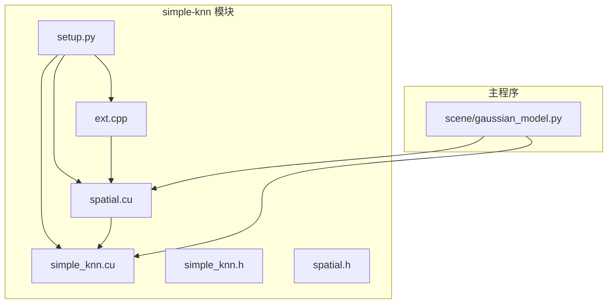
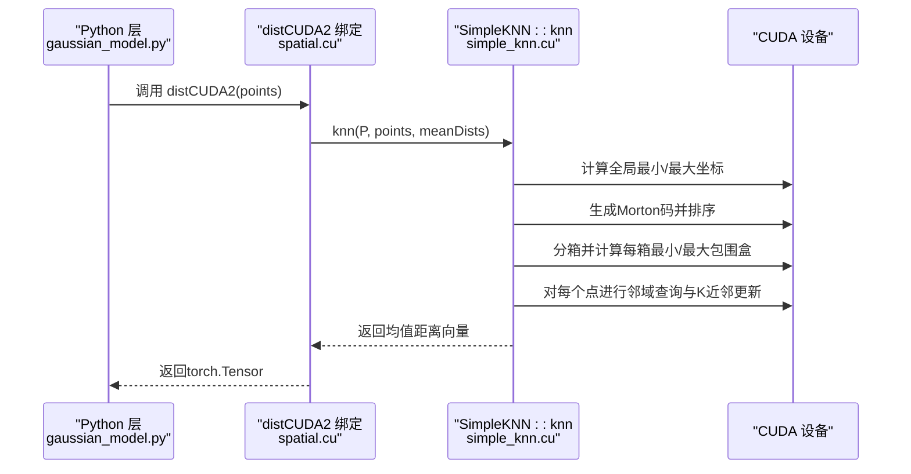
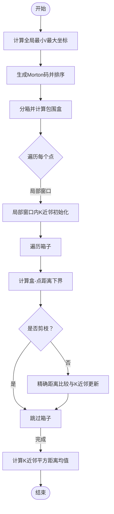
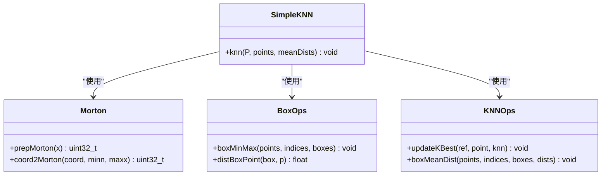
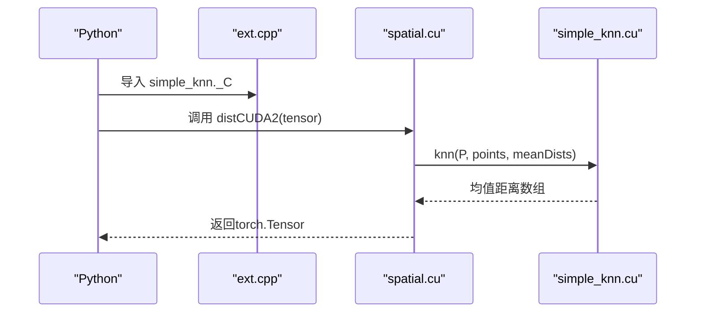
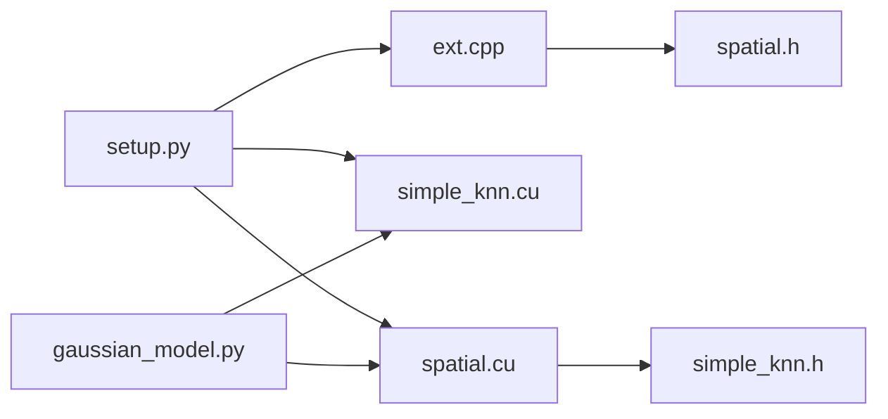

# 简单K近邻搜索

<cite>
**本文引用的文件**
- [simple_knn.cu](file://submodules/simple-knn/simple_knn.cu)
- [spatial.cu](file://submodules/simple-knn/spatial.cu)
- [simple_knn.h](file://submodules/simple-knn/simple_knn.h)
- [spatial.h](file://submodules/simple-knn/spatial.h)
- [ext.cpp](file://submodules/simple-knn/ext.cpp)
- [setup.py](file://submodules/simple-knn/setup.py)
- [gaussian_model.py](file://scene/gaussian_model.py)
- [README.md](file://README.md)
</cite>

## 目录
1. [简介](#简介)
2. [项目结构](#项目结构)
3. [核心组件](#核心组件)
4. [架构总览](#架构总览)
5. [详细组件分析](#详细组件分析)
6. [依赖关系分析](#依赖关系分析)
7. [性能考量](#性能考量)
8. [故障排查指南](#故障排查指南)
9. [结论](#结论)
10. [附录](#附录)

## 简介
本技术文档聚焦于项目中的简单K近邻（KNN）搜索CUDA实现，系统性解析其空间分割策略、邻域查询优化与动态内存管理。文档围绕以下关键文件展开：simple_knn.cu 中的空间索引构建与KNN计算流程、spatial.cu 中的Python绑定与调用入口、以及与主程序在热成像高斯渲染场景中的集成方式。同时给出算法复杂度分析、性能基准建议与参数调优指南，并提供可复现的应用示例路径。

## 项目结构
该模块位于 submodules/simple-knn 下，采用PyTorch C++扩展形式构建，核心由三部分组成：
- CUDA实现：simple_knn.cu（KNN与空间索引）、spatial.cu（Python绑定）
- 头文件：simple_knn.h、spatial.h
- 扩展构建：setup.py（定义编译源与构建器）
- 主程序集成：scene/gaussian_model.py 中通过 simple_knn._C 调用 distCUDA2

图表来源
- [simple_knn.cu:1-221](file://submodules/simple-knn/simple_knn.cu#L1-L221)
- [spatial.cu:1-26](file://submodules/simple-knn/spatial.cu#L1-L26)
- [simple_knn.h:1-21](file://submodules/simple-knn/simple_knn.h#L1-L21)
- [spatial.h:1-14](file://submodules/simple-knn/spatial.h#L1-L14)
- [ext.cpp:1-18](file://submodules/simple-knn/ext.cpp#L1-L18)
- [setup.py:1-36](file://submodules/simple-knn/setup.py#L1-L36)
- [gaussian_model.py:15-214](file://scene/gaussian_model.py#L15-L214)

章节来源
- [simple_knn.cu:1-221](file://submodules/simple-knn/simple_knn.cu#L1-L221)
- [spatial.cu:1-26](file://submodules/simple-knn/spatial.cu#L1-L26)
- [simple_knn.h:1-21](file://submodules/simple-knn/simple_knn.h#L1-L21)
- [spatial.h:1-14](file://submodules/simple-knn/spatial.h#L1-L14)
- [ext.cpp:1-18](file://submodules/simple-knn/ext.cpp#L1-L18)
- [setup.py:1-36](file://submodules/simple-knn/setup.py#L1-L36)
- [gaussian_model.py:15-214](file://scene/gaussian_model.py#L15-L214)

## 核心组件
- SimpleKNN::knn：KNN主流程，负责点云范围计算、Morton码生成与排序、分箱统计、邻域查询与均值距离输出。
- distCUDA2：Python绑定函数，接收PyTorch张量，调用SimpleKNN::knn并返回每个点的均值距离。
- 空间索引与查询：基于Morton码的空间分割，结合分箱最小最大包围盒与盒-点距离下界进行剪枝。
- 动态内存管理：使用CUB与Thrust进行临时存储分配与释放，避免主机端频繁同步。

章节来源
- [simple_knn.cu:185-221](file://submodules/simple-knn/simple_knn.cu#L185-L221)
- [spatial.cu:15-26](file://submodules/simple-knn/spatial.cu#L15-L26)
- [simple_knn.h:15-21](file://submodules/simple-knn/simple_knn.h#L15-L21)
- [spatial.h:12-14](file://submodules/simple-knn/spatial.h#L12-L14)

## 架构总览
从输入点云到KNN均值距离的完整调用链如下：

图表来源
- [spatial.cu:15-26](file://submodules/simple-knn/spatial.cu#L15-L26)
- [simple_knn.cu:185-221](file://submodules/simple-knn/simple_knn.cu#L185-L221)
- [gaussian_model.py:133-135](file://scene/gaussian_model.py#L133-L135)

## 详细组件分析

### SimpleKNN::knn 主流程
- 输入输出
  - 输入：点数 P、设备指针 points（float3）、输出 meanDists（float）
- 关键步骤
  - 全局最小/最大坐标：使用CUB DeviceReduce对点云坐标分量求极值，作为Morton编码的归一化区间。
  - Morton码生成与排序：为每个点计算Morton码，使用CUB Radix Sort对Morton码与原始索引进行配对排序，得到空间有序序列。
  - 分箱与包围盒：按固定箱大小（常量）将排序后的点划分为若干箱，每箱计算最小/最大包围盒。
  - 邻域查询与剪枝：对每个点，先在局部窗口内快速估算K近邻，再利用盒-点距离下界进行箱级剪枝，最后对保留箱内的点进行精确距离比较与K近邻维护。
  - 输出：每个点的K近邻平方距离均值存入 meanDists。
- 并行策略
  - 使用cooperative_groups进行线程组内规约与同步，提升共享内存访问效率。
  - 分箱核函数以块为单位并行，块内共享内存存放局部规约结果。
- 动态内存管理
  - 通过CUB查询临时存储大小并分配，使用Thrust设备向量管理生命周期，确保正确释放。

图表来源
- [simple_knn.cu:185-221](file://submodules/simple-knn/simple_knn.cu#L185-L221)
- [simple_knn.cu:147-183](file://submodules/simple-knn/simple_knn.cu#L147-L183)
- [simple_knn.cu:78-117](file://submodules/simple-knn/simple_knn.cu#L78-L117)
- [simple_knn.cu:119-129](file://submodules/simple-knn/simple_knn.cu#L119-L129)

章节来源
- [simple_knn.cu:185-221](file://submodules/simple-knn/simple_knn.cu#L185-L221)
- [simple_knn.cu:78-117](file://submodules/simple-knn/simple_knn.cu#L78-L117)
- [simple_knn.cu:119-129](file://submodules/simple-knn/simple_knn.cu#L119-L129)
- [simple_knn.cu:147-183](file://submodules/simple-knn/simple_knn.cu#L147-L183)

### 空间索引与查询加速
- Morton码
  - 将三维坐标映射到一维Morton码，用于空间局部性排序，减少后续邻域查询时的跨区域扫描。
  - 提供预处理与坐标到Morton码的转换函数。
- 包围盒与盒-点距离
  - 每个箱子维护最小/最大包围盒，盒-点距离下界用于快速判断是否需要进一步检查箱子内的点。
- 局部窗口优化
  - 对每个点先在排序邻近的小窗口内估算K近邻，降低后续全空间扫描成本。

图表来源
- [simple_knn.cu:45-61](file://submodules/simple-knn/simple_knn.cu#L45-L61)
- [simple_knn.cu:78-117](file://submodules/simple-knn/simple_knn.cu#L78-L117)
- [simple_knn.cu:119-129](file://submodules/simple-knn/simple_knn.cu#L119-L129)
- [simple_knn.cu:131-145](file://submodules/simple-knn/simple_knn.cu#L131-L145)
- [simple_knn.cu:147-183](file://submodules/simple-knn/simple_knn.cu#L147-L183)

章节来源
- [simple_knn.cu:45-61](file://submodules/simple-knn/simple_knn.cu#L45-L61)
- [simple_knn.cu:78-117](file://submodules/simple-knn/simple_knn.cu#L78-L117)
- [simple_knn.cu:119-129](file://submodules/simple-knn/simple_knn.cu#L119-L129)
- [simple_knn.cu:131-145](file://submodules/simple-knn/simple_knn.cu#L131-L145)
- [simple_knn.cu:147-183](file://submodules/simple-knn/simple_knn.cu#L147-L183)

### Python绑定与调用入口
- distCUDA2
  - 接收PyTorch张量，构造全零均值距离张量，调用 SimpleKNN::knn 完成计算后返回结果。
- 扩展注册
  - ext.cpp 使用 pybind11 将 distCUDA2 暴露为 simple_knn._C.distCUDA2，供Python侧直接导入使用。
- 主程序集成
  - scene/gaussian_model.py 在创建高斯模型时调用 distCUDA2，基于点云均值距离初始化尺度参数。

图表来源
- [spatial.cu:15-26](file://submodules/simple-knn/spatial.cu#L15-L26)
- [ext.cpp:15-17](file://submodules/simple-knn/ext.cpp#L15-L17)
- [gaussian_model.py:133-135](file://scene/gaussian_model.py#L133-L135)

章节来源
- [spatial.cu:15-26](file://submodules/simple-knn/spatial.cu#L15-L26)
- [ext.cpp:15-17](file://submodules/simple-knn/ext.cpp#L15-L17)
- [gaussian_model.py:133-135](file://scene/gaussian_model.py#L133-L135)

## 依赖关系分析
- 编译与运行时依赖
  - CUDA Toolkit、CUB、Thrust、PyTorch C++扩展框架、pybind11。
- 模块间耦合
  - simple_knn.cu 依赖头文件与CUB/Thrust；spatial.cu 依赖 simple_knn.h；ext.cpp 依赖 spatial.h 并导出Python接口。
- 外部集成
  - 主程序通过 simple_knn._C 调用 distCUDA2，用于初始化高斯尺度参数。

图表来源
- [setup.py:21-35](file://submodules/simple-knn/setup.py#L21-L35)
- [ext.cpp:12-17](file://submodules/simple-knn/ext.cpp#L12-L17)
- [spatial.cu:12-13](file://submodules/simple-knn/spatial.cu#L12-L13)
- [simple_knn.cu:14-25](file://submodules/simple-knn/simple_knn.cu#L14-L25)
- [gaussian_model.py:15-21](file://scene/gaussian_model.py#L15-L21)

章节来源
- [setup.py:21-35](file://submodules/simple-knn/setup.py#L21-L35)
- [ext.cpp:12-17](file://submodules/simple-knn/ext.cpp#L12-L17)
- [spatial.cu:12-13](file://submodules/simple-knn/spatial.cu#L12-L13)
- [simple_knn.cu:14-25](file://submodules/simple-knn/simple_knn.cu#L14-L25)
- [gaussian_model.py:15-21](file://scene/gaussian_model.py#L15-L21)

## 性能考量
- 算法复杂度
  - 空间索引与排序：O(P log P)，主要消耗来自Radix Sort与一次全局Reduce。
  - 分箱与包围盒：O(P)，线性扫描与共享内存规约。
  - 邻域查询：期望 O(P log P) 到 O(P K) 之间，取决于数据分布与剪枝效果；盒-点距离下界显著减少无效比较次数。
- 并行与内存
  - 使用cooperative_groups与共享内存规约，降低同步开销。
  - 通过CUB查询临时存储大小并一次性分配，避免多次小块分配带来的碎片化。
- 参数调优建议
  - 箱大小（常量）：增大可减少箱数量与剪枝次数，但会增加箱内扫描；减小则相反。可根据点密度与K值权衡。
  - K值：K越大，均值越平滑但计算更重；K越小，响应局部变化但噪声更大。
  - 局部窗口：窗口越大，初始K近邻估计越准，但后续箱级剪枝收益下降。
- 基准测试建议
  - 测试集：不同规模与密度的点云（如合成球面、随机分布、真实场景点云）。
  - 指标：吞吐（点数/秒）、延迟（均值/中位数）、内存占用峰值、剪枝率（被跳过的箱子比例）。
  - 工具：NVIDIA Nsight Systems/Torch Profiler等。

## 故障排查指南
- 编译问题
  - 确认已安装与项目匹配的CUDA Toolkit与PyTorch版本。
  - 若Windows平台报错，检查编译器警告屏蔽设置与环境变量。
- 运行时错误
  - 输入张量非连续或类型不匹配：确保传入的点云为连续的float32张量。
  - 内存不足：适当减小批大小或调整箱大小，观察GPU显存峰值。
  - 结果异常为负或NaN：检查点云数值范围与归一化区间，确保全局最小/最大坐标有效。
- 集成问题
  - simple_knn._C 未找到：确认已成功执行扩展构建并安装模块。
  - 初始化失败：检查主程序中调用 distCUDA2 的输入格式与设备一致性。

章节来源
- [setup.py:16-20](file://submodules/simple-knn/setup.py#L16-L20)
- [spatial.cu:15-26](file://submodules/simple-knn/spatial.cu#L15-L26)
- [gaussian_model.py:133-135](file://scene/gaussian_model.py#L133-L135)

## 结论
该KNN实现通过Morton码与分箱策略实现了高效的邻域查询，结合盒-点距离下界剪枝与局部窗口优化，在保证精度的同时显著降低了计算复杂度。其PyTorch扩展接口与主程序集成简洁清晰，适用于大规模点云的尺度初始化与正则化场景。通过合理调参与基准测试，可在不同硬件与数据分布上获得稳定且高效的性能表现。

## 附录
- 实际应用示例路径
  - 主程序集成：scene/gaussian_model.py 中 create_from_pcd 方法调用 distCUDA2 初始化高斯尺度。
  - 项目背景：README.md 提供了项目概述与运行说明，便于理解模块在热成像高斯渲染中的定位。

章节来源
- [gaussian_model.py:124-147](file://scene/gaussian_model.py#L124-L147)
- [README.md:1-167](file://README.md#L1-L167)