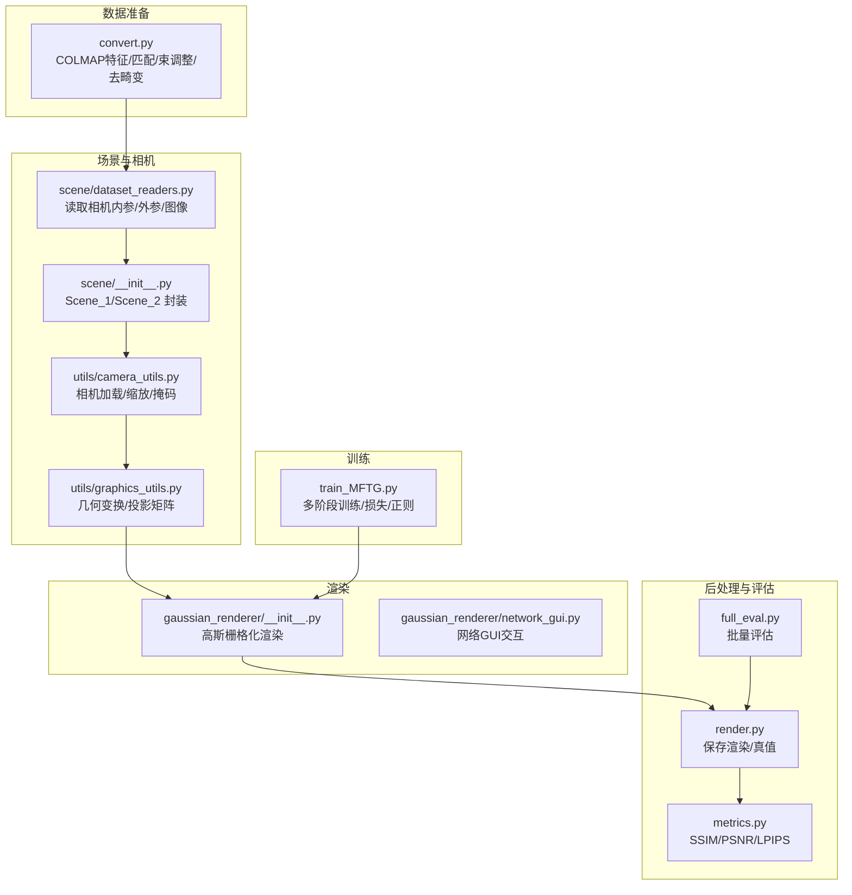
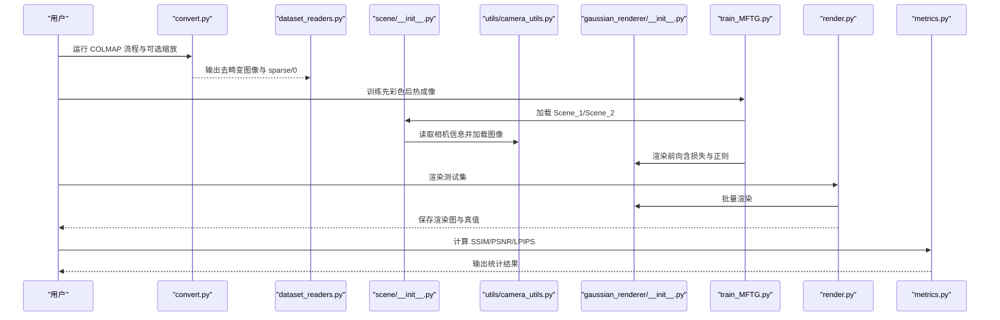
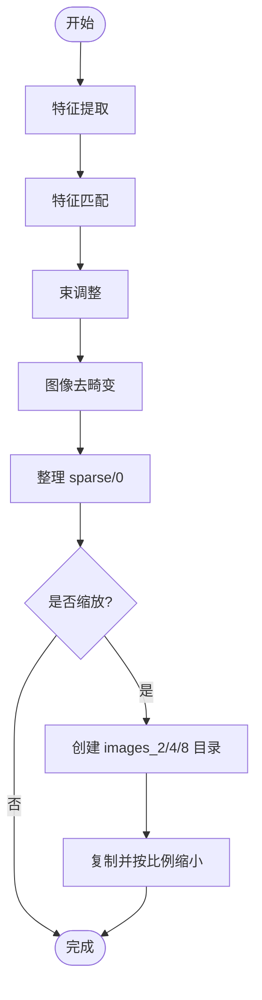
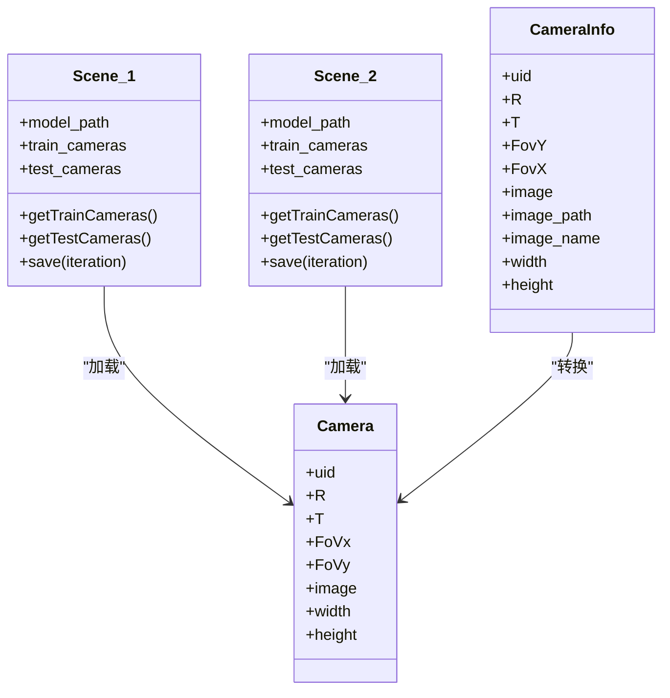
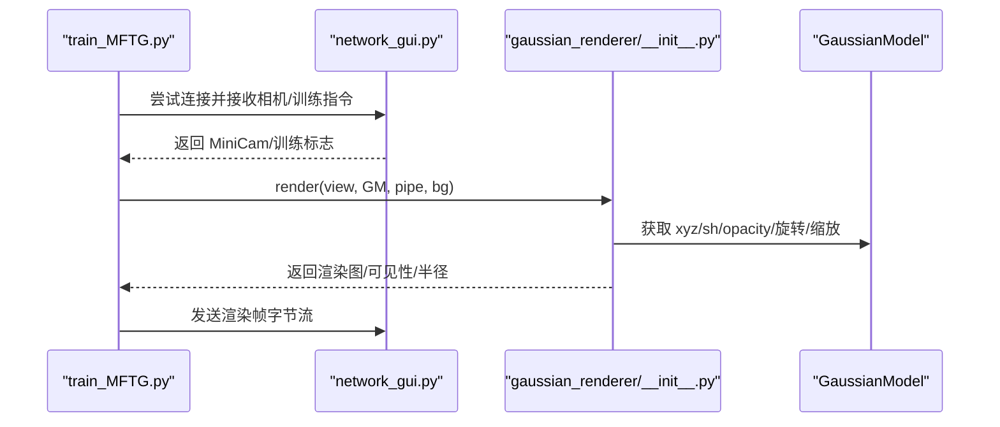
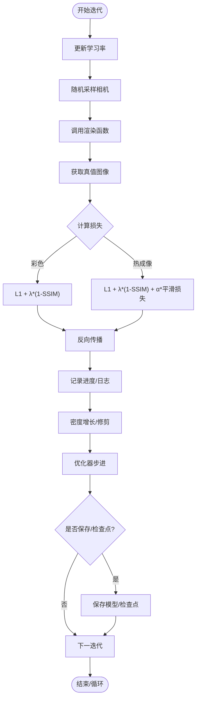
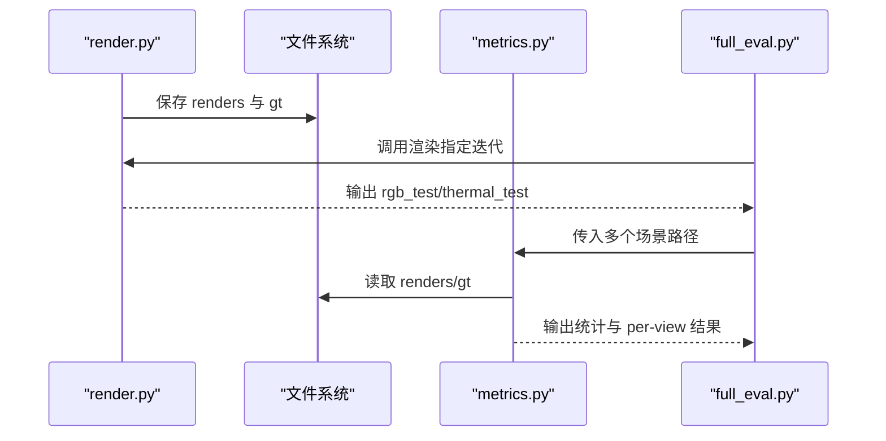
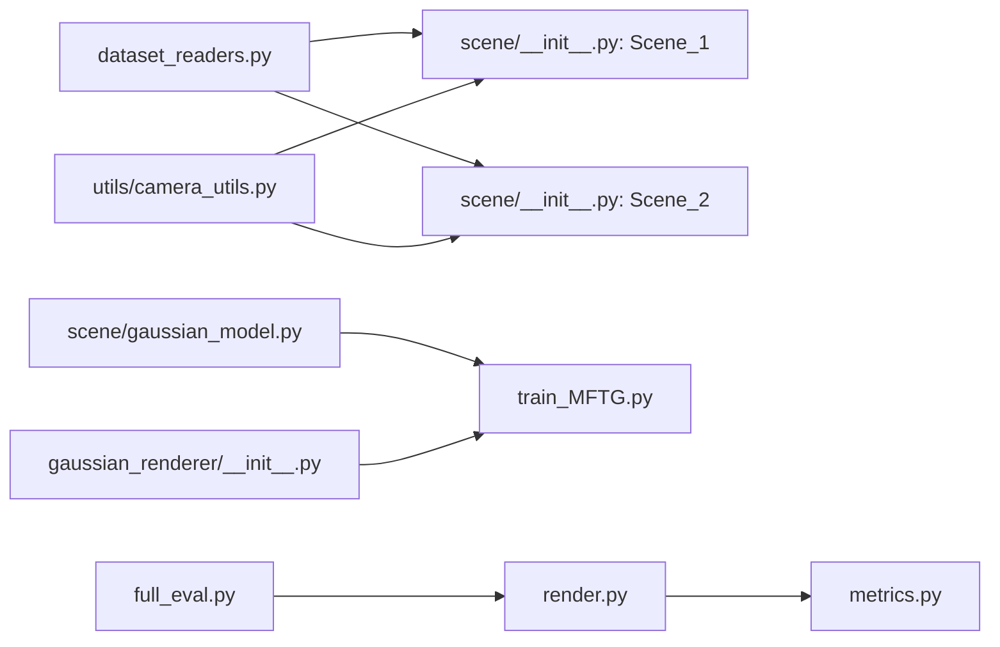

# 图像处理工具

<cite>
**本文引用的文件**
- [README.md](file://README.md)
- [convert.py](file://convert.py)
- [render.py](file://render.py)
- [metrics.py](file://metrics.py)
- [full_eval.py](file://full_eval.py)
- [train_MFTG.py](file://train_MFTG.py)
- [gaussian_renderer/__init__.py](file://gaussian_renderer/__init__.py)
- [gaussian_renderer/network_gui.py](file://gaussian_renderer/network_gui.py)
- [scene/__init__.py](file://scene/__init__.py)
- [scene/dataset_readers.py](file://scene/dataset_readers.py)
- [scene/cameras.py](file://scene/cameras.py)
- [scene/gaussian_model.py](file://scene/gaussian_model.py)
- [utils/image_utils.py](file://utils/image_utils.py)
- [utils/graphics_utils.py](file://utils/graphics_utils.py)
- [utils/camera_utils.py](file://utils/camera_utils.py)
- [utils/general_utils.py](file://utils/general_utils.py)
- [lpipsPyTorch/modules/lpips.py](file://lpipsPyTorch/modules/lpips.py)
</cite>

## 目录
1. [简介](#简介)
2. [项目结构](#项目结构)
3. [核心组件](#核心组件)
4. [架构总览](#架构总览)
5. [详细组件分析](#详细组件分析)
6. [依赖关系分析](#依赖关系分析)
7. [性能考虑](#性能考虑)
8. [故障排查指南](#故障排查指南)
9. [结论](#结论)
10. [附录](#附录)

## 简介
本文件面向 Thermal-Gaussian 图像处理工具，系统梳理其图像预处理、后处理、格式转换与质量评估等流程，重点解释图像归一化、色彩空间转换、噪声处理与图像增强策略，给出参数配置、性能优化与内存管理建议，并展示在数据预处理、渲染结果后处理与质量监控中的实际应用及对多格式的兼容性处理。

## 项目结构
项目围绕“数据准备—训练—渲染—评估”闭环组织，关键模块如下：
- 数据准备与格式转换：convert.py 负责 COLMAP 特征提取、匹配、束调整与图像去畸变；支持可选缩放生成多分辨率图像。
- 场景加载与相机管理：dataset_readers.py 读取 COLMAP/Blender/自定义 JSON，构建 CameraInfo 列表；scene/__init__.py 提供 Scene_1（彩色）与 Scene_2（热成像）两类场景封装。
- 渲染管线：gaussian_renderer/__init__.py 实现基于高斯点云的栅格化渲染；network_gui.py 支持可视化交互。
- 训练与优化：train_MFTG.py 实现多阶段训练（先彩色后热成像），引入平滑正则约束以提升热成像质量。
- 后处理与评估：render.py 保存渲染图与地面真值；metrics.py 计算 SSIM、PSNR、LPIPS 并输出统计结果；full_eval.py 提供批量评估脚本。
- 工具函数：utils/* 提供通用图像度量、图形变换、相机参数转换、张量工具等。

**图表来源**
- [convert.py:1-125](file://convert.py#L1-L125)
- [scene/dataset_readers.py:1-311](file://scene/dataset_readers.py#L1-L311)
- [scene/__init__.py:1-168](file://scene/__init__.py#L1-L168)
- [utils/camera_utils.py:1-83](file://utils/camera_utils.py#L1-L83)
- [utils/graphics_utils.py:1-77](file://utils/graphics_utils.py#L1-L77)
- [gaussian_renderer/__init__.py:1-101](file://gaussian_renderer/__init__.py#L1-L101)
- [gaussian_renderer/network_gui.py:1-86](file://gaussian_renderer/network_gui.py#L1-L86)
- [train_MFTG.py:1-273](file://train_MFTG.py#L1-L273)
- [render.py:1-76](file://render.py#L1-L76)
- [metrics.py:1-148](file://metrics.py#L1-L148)
- [full_eval.py:1-75](file://full_eval.py#L1-L75)

**章节来源**
- [README.md:18-120](file://README.md#L18-L120)
- [convert.py:1-125](file://convert.py#L1-L125)
- [scene/dataset_readers.py:136-181](file://scene/dataset_readers.py#L136-L181)
- [scene/dataset_readers.py:184-230](file://scene/dataset_readers.py#L184-L230)
- [scene/__init__.py:21-94](file://scene/__init__.py#L21-L94)
- [scene/__init__.py:96-168](file://scene/__init__.py#L96-L168)
- [utils/camera_utils.py:19-60](file://utils/camera_utils.py#L19-L60)
- [utils/graphics_utils.py:51-77](file://utils/graphics_utils.py#L51-L77)
- [gaussian_renderer/__init__.py:18-101](file://gaussian_renderer/__init__.py#L18-L101)
- [gaussian_renderer/network_gui.py:26-86](file://gaussian_renderer/network_gui.py#L26-L86)
- [train_MFTG.py:35-163](file://train_MFTG.py#L35-L163)
- [render.py:25-60](file://render.py#L25-L60)
- [metrics.py:24-148](file://metrics.py#L24-L148)
- [full_eval.py:33-75](file://full_eval.py#L33-L75)

## 核心组件
- 数据准备与格式转换
  - COLMAP 流程：特征提取、特征匹配、束调整、图像去畸变与重组织 sparse/0 文件。
  - 可选缩放：按 50%/25%/12.5% 生成多分辨率图像目录，便于不同分辨率训练与评估。
- 场景与相机
  - 两类场景：Scene_1（彩色）与 Scene_2（热成像），均通过 dataset_readers 的回调读取 COLMAP 或 Blender 数据集。
  - 相机加载：根据输入分辨率与目标分辨率计算缩放，支持透明度掩码分离。
- 渲染
  - 高斯点云栅格化渲染，支持 SH 系数到颜色的 Python 端预计算或 CUDA 端计算。
  - 支持调试模式与屏幕空间梯度跟踪，用于后续密度增长与修剪。
- 训练
  - 多阶段训练：先彩色后热成像；热成像阶段引入平滑损失约束，抑制过拟合与伪影。
- 后处理与评估
  - 渲染结果保存为 PNG；评估指标包含 SSIM、PSNR、LPIPS，并输出场景级与逐视图级统计。

**章节来源**
- [convert.py:31-123](file://convert.py#L31-L123)
- [scene/dataset_readers.py:136-181](file://scene/dataset_readers.py#L136-L181)
- [scene/dataset_readers.py:184-230](file://scene/dataset_readers.py#L184-L230)
- [scene/__init__.py:21-94](file://scene/__init__.py#L21-L94)
- [scene/__init__.py:96-168](file://scene/__init__.py#L96-L168)
- [utils/camera_utils.py:19-60](file://utils/camera_utils.py#L19-L60)
- [gaussian_renderer/__init__.py:18-101](file://gaussian_renderer/__init__.py#L18-L101)
- [train_MFTG.py:106-115](file://train_MFTG.py#L106-L115)
- [render.py:25-60](file://render.py#L25-L60)
- [metrics.py:24-148](file://metrics.py#L24-L148)

## 架构总览
下图展示从数据准备到评估的关键调用链路与模块交互。

**图表来源**
- [convert.py:31-123](file://convert.py#L31-L123)
- [scene/dataset_readers.py:136-181](file://scene/dataset_readers.py#L136-L181)
- [scene/__init__.py:21-94](file://scene/__init__.py#L21-L94)
- [utils/camera_utils.py:19-60](file://utils/camera_utils.py#L19-L60)
- [gaussian_renderer/__init__.py:18-101](file://gaussian_renderer/__init__.py#L18-L101)
- [train_MFTG.py:35-163](file://train_MFTG.py#L35-L163)
- [render.py:25-60](file://render.py#L25-L60)
- [metrics.py:24-148](file://metrics.py#L24-L148)

## 详细组件分析

### 数据准备与格式转换（convert.py）
- 功能要点
  - 特征提取、特征匹配、束调整、图像去畸变，确保针孔模型内参与外参一致。
  - 可选 resize：复制原图并生成 1/2、1/4、1/8 分辨率版本，便于多尺度实验。
- 关键参数
  - --source_path/-s：输入根路径（包含 input 原始图像与 sparse/0 输出）。
  - --camera：相机模型（默认 OPENCV）。
  - --colmap_executable、--magick_executable：外部命令路径。
  - --resize：是否生成多分辨率版本。
  - --no_gpu/--skip_matching：GPU 使用与跳过匹配。
- 兼容性
  - 输出遵循 COLMAP 标准 sparse/0 结构，便于后续 Scene_1/Scene_2 读取。
- 性能与内存
  - 大图像自动限制最大宽度至 1600 像素（若未显式指定分辨率），避免显存压力。
  - 缩放使用 ImageMagick 的 mogrify，注意磁盘空间与 I/O 开销。

**图表来源**
- [convert.py:31-123](file://convert.py#L31-L123)

**章节来源**
- [convert.py:18-29](file://convert.py#L18-L29)
- [convert.py:31-123](file://convert.py#L31-L123)
- [README.md:119-120](file://README.md#L119-L120)

### 场景加载与相机管理（dataset_readers.py、scene/__init__.py、utils/camera_utils.py）
- 场景加载
  - Colmap 模式：读取 cameras.bin/images.bin/points3D.*，构造 CameraInfo 列表。
  - Temper 模式：针对热成像目录结构（thermal/train、thermal/test）进行相同流程。
  - Blender 模式：读取 transforms_* JSON，构造虚拟相机序列。
- 相机加载与缩放
  - 根据 args.resolution 与原始尺寸计算目标分辨率；支持 -1 自动限制至 1600 宽度。
  - 若图像为 RGBA，第四通道作为 alpha 掩码分离。
- 几何与投影
  - 提供世界到相机变换、投影矩阵、FOV 与焦距互转等工具函数。

**图表来源**
- [scene/__init__.py:21-94](file://scene/__init__.py#L21-L94)
- [scene/__init__.py:96-168](file://scene/__init__.py#L96-L168)
- [scene/dataset_readers.py:26-44](file://scene/dataset_readers.py#L26-L44)
- [utils/camera_utils.py:19-60](file://utils/camera_utils.py#L19-L60)

**章节来源**
- [scene/dataset_readers.py:68-109](file://scene/dataset_readers.py#L68-L109)
- [scene/dataset_readers.py:136-181](file://scene/dataset_readers.py#L136-L181)
- [scene/dataset_readers.py:184-230](file://scene/dataset_readers.py#L184-L230)
- [scene/__init__.py:21-94](file://scene/__init__.py#L21-L94)
- [scene/__init__.py:96-168](file://scene/__init__.py#L96-L168)
- [utils/camera_utils.py:19-60](file://utils/camera_utils.py#L19-L60)
- [utils/graphics_utils.py:51-77](file://utils/graphics_utils.py#L51-L77)

### 渲染管线（gaussian_renderer/__init__.py、network_gui.py）
- 渲染流程
  - 构建高斯栅格化设置（图像尺寸、视图矩阵、投影矩阵、SH 度等）。
  - 可选择在 Python 端将 SH 系数转 RGB，或由 CUDA 端完成。
  - 返回渲染图、屏幕空间点、可见性过滤与半径。
- 网络 GUI
  - 支持本地 TCP 通信，接收相机参数与训练开关，实时返回渲染帧。
- 参数与优化
  - scaling_modifier：控制尺度缩放，影响渲染锐利度。
  - debug：开启调试模式，便于诊断。

**图表来源**
- [train_MFTG.py:69-83](file://train_MFTG.py#L69-L83)
- [gaussian_renderer/network_gui.py:34-86](file://gaussian_renderer/network_gui.py#L34-L86)
- [gaussian_renderer/__init__.py:18-101](file://gaussian_renderer/__init__.py#L18-L101)
- [scene/gaussian_model.py:95-118](file://scene/gaussian_model.py#L95-L118)

**章节来源**
- [gaussian_renderer/__init__.py:18-101](file://gaussian_renderer/__init__.py#L18-L101)
- [gaussian_renderer/network_gui.py:26-86](file://gaussian_renderer/network_gui.py#L26-L86)
- [scene/gaussian_model.py:95-118](file://scene/gaussian_model.py#L95-L118)

### 训练与优化（train_MFTG.py）
- 多阶段训练
  - 先训练 Scene_1（彩色），再训练 Scene_2（热成像），共享高斯点云参数。
  - 热成像阶段引入平滑损失，抑制噪声与伪影。
- 损失函数
  - L1 与 SSIM 组合；热成像额外加入平滑损失项。
- 密度增长与修剪
  - 基于屏幕空间梯度与半径阈值进行克隆、分裂与修剪，动态控制点云数量。
- 日志与可视化
  - TensorBoard 写入训练损失、PSNR、SSIM、LPIPS 与直方图。

**图表来源**
- [train_MFTG.py:68-163](file://train_MFTG.py#L68-L163)
- [train_MFTG.py:106-115](file://train_MFTG.py#L106-L115)
- [scene/gaussian_model.py:349-401](file://scene/gaussian_model.py#L349-L401)

**章节来源**
- [train_MFTG.py:35-163](file://train_MFTG.py#L35-L163)
- [train_MFTG.py:106-115](file://train_MFTG.py#L106-L115)
- [scene/gaussian_model.py:349-401](file://scene/gaussian_model.py#L349-L401)

### 后处理与质量评估（render.py、metrics.py、full_eval.py）
- 渲染后处理
  - 保存渲染图与对应真值图，命名与索引对齐，便于对比。
- 质量评估
  - 逐场景、逐方法聚合：计算 SSIM、PSNR、LPIPS 的均值与逐视图分布。
  - 输出 results.json 与 per_view.json，支持自动化复现实验。
- 批量评估
  - full_eval.py 支持多数据集批量训练、渲染与评估，串联训练、渲染与指标计算。

**图表来源**
- [render.py:25-60](file://render.py#L25-L60)
- [metrics.py:24-148](file://metrics.py#L24-L148)
- [full_eval.py:33-75](file://full_eval.py#L33-L75)

**章节来源**
- [render.py:25-60](file://render.py#L25-L60)
- [metrics.py:24-148](file://metrics.py#L24-L148)
- [full_eval.py:33-75](file://full_eval.py#L33-L75)

## 依赖关系分析
- 模块耦合
  - scene/__init__.py 依赖 dataset_readers.py 与 utils/camera_utils.py；GaussianModel 在训练中被反复调用。
  - gaussian_renderer/__init__.py 依赖 diff-gaussian-rasterization（CUDA 扩展）与 utils/sh_utils。
  - train_MFTG.py 串联 Scene_1/Scene_2、GaussianModel、gaussian_renderer 与评估工具。
- 外部依赖
  - COLMAP（特征提取/匹配/束调整）、ImageMagick（缩放）、TensorBoard（可选）。
- 潜在环依赖
  - 当前结构清晰，无明显循环导入；渲染与训练通过函数调用解耦。

**图表来源**
- [scene/dataset_readers.py:136-181](file://scene/dataset_readers.py#L136-L181)
- [scene/__init__.py:21-94](file://scene/__init__.py#L21-L94)
- [scene/__init__.py:96-168](file://scene/__init__.py#L96-L168)
- [utils/camera_utils.py:19-60](file://utils/camera_utils.py#L19-L60)
- [scene/gaussian_model.py:95-118](file://scene/gaussian_model.py#L95-L118)
- [gaussian_renderer/__init__.py:18-101](file://gaussian_renderer/__init__.py#L18-L101)
- [train_MFTG.py:35-163](file://train_MFTG.py#L35-L163)
- [render.py:25-60](file://render.py#L25-L60)
- [metrics.py:24-148](file://metrics.py#L24-L148)
- [full_eval.py:33-75](file://full_eval.py#L33-L75)

**章节来源**
- [scene/dataset_readers.py:136-181](file://scene/dataset_readers.py#L136-L181)
- [scene/__init__.py:21-94](file://scene/__init__.py#L21-L94)
- [scene/__init__.py:96-168](file://scene/__init__.py#L96-L168)
- [utils/camera_utils.py:19-60](file://utils/camera_utils.py#L19-L60)
- [gaussian_renderer/__init__.py:18-101](file://gaussian_renderer/__init__.py#L18-L101)
- [train_MFTG.py:35-163](file://train_MFTG.py#L35-L163)
- [render.py:25-60](file://render.py#L25-L60)
- [metrics.py:24-148](file://metrics.py#L24-L148)
- [full_eval.py:33-75](file://full_eval.py#L33-L75)

## 性能考虑
- 输入尺寸与分辨率
  - 默认自动限制最大宽度至 1600 像素；可通过 -r 显式指定更高分辨率，但需关注显存占用。
  - 多分辨率缩放（images_2/4/8）可加速训练与评估，降低内存峰值。
- 渲染与优化
  - 使用 SH 系数在 Python 端预计算颜色可减少 CUDA 侧负担，但会增加 CPU/GPU 传输；可根据硬件权衡。
  - 密度增长与修剪策略在训练早期频繁触发，建议结合数据规模与迭代步长调整阈值。
- I/O 与缓存
  - 批量保存渲染图与评估时，注意磁盘写入带宽；可分批处理或使用更快存储介质。
  - 训练过程定期清空 CUDA 缓存，避免碎片化导致的内存不足。

**章节来源**
- [README.md:119-120](file://README.md#L119-L120)
- [utils/camera_utils.py:22-40](file://utils/camera_utils.py#L22-L40)
- [gaussian_renderer/__init__.py:72-82](file://gaussian_renderer/__init__.py#L72-L82)
- [train_MFTG.py:142-158](file://train_MFTG.py#L142-L158)

## 故障排查指南
- COLMAP 执行失败
  - 检查 --colmap_executable 与 --magick_executable 是否正确；确认环境变量 PATH 包含可执行文件。
  - 特征提取/匹配/束调整返回非零退出码时，查看日志定位问题。
- 图像读取异常
  - 确认输入路径包含正确的 rgb/thermal 子目录与 test/train 划分；sparse/0 下存在 cameras.bin/images.bin/points3D.*。
  - 若图像为 RGBA，第四通道将作为 alpha 掩码使用，确保与预期一致。
- 渲染黑屏或亮度异常
  - 检查背景色设置（white_background）与随机背景开关；确认渲染函数返回值范围在 [0,1]。
  - 网络 GUI 未收到相机参数时不会渲染，检查端口与连接状态。
- 评估指标异常
  - 确保 renders 与 gt 名称一一对应；评估脚本按文件名聚合，不匹配会导致维度错误。
  - GPU 设备设置与 CUDA 张量设备一致性，避免维度不匹配。

**章节来源**
- [convert.py:31-54](file://convert.py#L31-L54)
- [scene/dataset_readers.py:136-181](file://scene/dataset_readers.py#L136-L181)
- [scene/dataset_readers.py:184-230](file://scene/dataset_readers.py#L184-L230)
- [gaussian_renderer/network_gui.py:34-86](file://gaussian_renderer/network_gui.py#L34-L86)
- [metrics.py:24-34](file://metrics.py#L24-L34)

## 结论
Thermal-Gaussian 提供了从数据准备、多模态训练、实时渲染到质量评估的完整流水线。通过 COLMAP 与多分辨率策略实现高效的数据预处理；基于高斯点云的渲染管线支持灵活的颜色与几何优化；多阶段训练与平滑正则显著提升热成像质量；评估体系覆盖多种指标并支持批量自动化。建议在实际部署中结合硬件条件合理设置分辨率与缓存策略，确保稳定高效的运行。

## 附录
- 关键函数与工具
  - 归一化与度量：utils/image_utils.py 提供 MSE/PSNR；utils/general_utils.py 提供张量工具与指数学习率函数。
  - 图形与相机：utils/graphics_utils.py 提供投影矩阵与 FOV 转换；utils/camera_utils.py 提供相机加载与分辨率缩放。
  - LPIPS：metrics.py 通过 lpipsPyTorch 模块计算感知相似度。
- 参数配置建议
  - 训练分辨率：优先使用默认自动限制；大规模数据集可尝试 -r 1 以保留更高分辨率细节。
  - 渲染设置：根据场景复杂度调整 SH 度与密度增长阈值；必要时启用 Python 端 SH->RGB 转换。
  - 评估：统一 renders/gt 命名规范，确保 per-view 统计可复现。

**章节来源**
- [utils/image_utils.py:14-20](file://utils/image_utils.py#L14-L20)
- [utils/general_utils.py:18-62](file://utils/general_utils.py#L18-L62)
- [utils/graphics_utils.py:51-77](file://utils/graphics_utils.py#L51-L77)
- [utils/camera_utils.py:19-60](file://utils/camera_utils.py#L19-L60)
- [metrics.py:17-21](file://metrics.py#L17-L21)