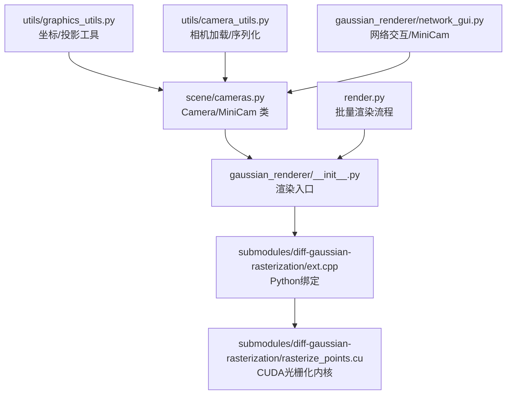
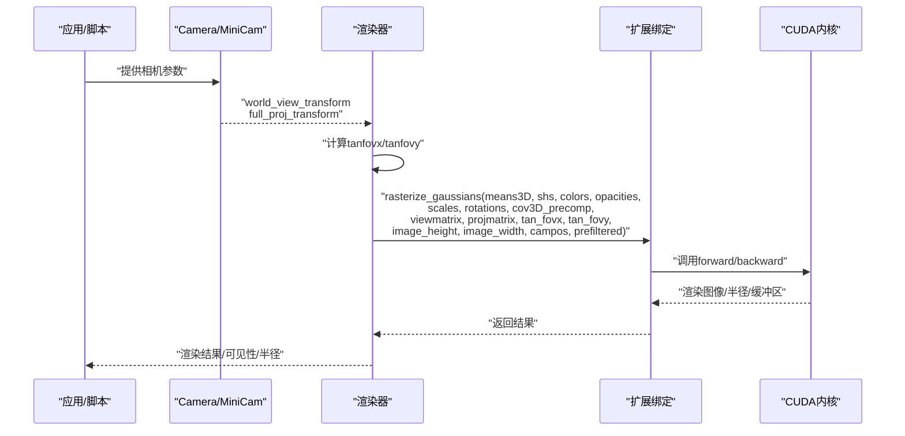
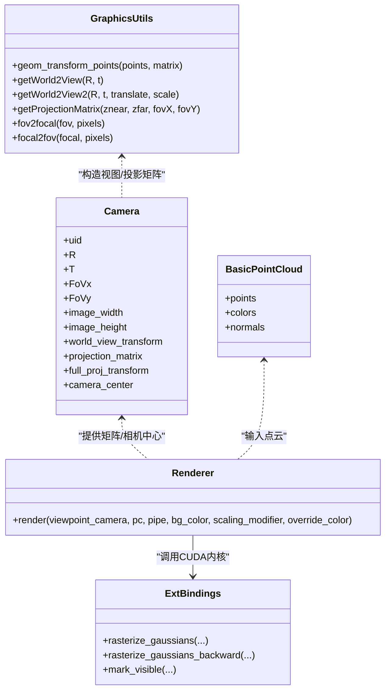

# 图形学工具函数

<cite>
**本文档引用的文件**
- [graphics_utils.py](file://utils/graphics_utils.py)
- [camera_utils.py](file://utils/camera_utils.py)
- [cameras.py](file://scene/cameras.py)
- [general_utils.py](file://utils/general_utils.py)
- [__init__.py（渲染器）](file://gaussian_renderer/__init__.py)
- [network_gui.py](file://gaussian_renderer/network_gui.py)
- [ext.cpp（光栅化扩展）](file://submodules/diff-gaussian-rasterization/ext.cpp)
- [rasterize_points.cu](file://submodules/diff-gaussian-rasterization/rasterize_points.cu)
- [render.py](file://render.py)
</cite>

## 目录
1. [简介](#简介)
2. [项目结构](#项目结构)
3. [核心组件](#核心组件)
4. [架构总览](#架构总览)
5. [详细组件分析](#详细组件分析)
6. [依赖关系分析](#依赖关系分析)
7. [性能考虑](#性能考虑)
8. [故障排查指南](#故障排查指南)
9. [结论](#结论)

## 简介
本文件系统性梳理 Thermal-Gaussian 中与图形学相关的工具函数与管线集成点，重点覆盖以下方面：
- 3D 图形变换：世界到相机变换、齐次坐标处理
- 相机投影：透视投影矩阵构建、视场角与焦距换算
- 视锥体裁剪：可见性标记与屏幕空间半径
- 渲染管线：从相机参数到 CUDA 光栅化器的完整调用链
- 性能优化：CUDA 扩展接口、缓冲区管理与批处理策略

## 项目结构
围绕图形学工具函数的关键模块分布如下：
- 工具层：坐标变换、投影、相机参数辅助
- 场景层：Camera 类封装视图与投影矩阵
- 渲染器层：将几何与着色信息送入 CUDA 光栅化器
- 扩展层：C++/CUDA 绑定，提供高效光栅化内核

**图表来源**
- [graphics_utils.py:22-77](file://utils/graphics_utils.py#L22-L77)
- [cameras.py:17-72](file://scene/cameras.py#L17-L72)
- [camera_utils.py:19-83](file://utils/camera_utils.py#L19-L83)
- [__init__.py（渲染器）:18-101](file://gaussian_renderer/__init__.py#L18-L101)
- [network_gui.py:26-86](file://gaussian_renderer/network_gui.py#L26-L86)
- [ext.cpp（光栅化扩展）:15-19](file://submodules/diff-gaussian-rasterization/ext.cpp#L15-L19)
- [rasterize_points.cu:35-115](file://submodules/diff-gaussian-rasterization/rasterize_points.cu#L35-L115)
- [render.py:25-76](file://render.py#L25-L76)

**章节来源**
- [graphics_utils.py:17-77](file://utils/graphics_utils.py#L17-L77)
- [cameras.py:17-72](file://scene/cameras.py#L17-L72)
- [camera_utils.py:19-83](file://utils/camera_utils.py#L19-L83)
- [__init__.py（渲染器）:18-101](file://gaussian_renderer/__init__.py#L18-L101)
- [network_gui.py:26-86](file://gaussian_renderer/network_gui.py#L26-L86)
- [ext.cpp（光栅化扩展）:15-19](file://submodules/diff-gaussian-rasterization/ext.cpp#L15-L19)
- [rasterize_points.cu:35-115](file://submodules/diff-gaussian-rasterization/rasterize_points.cu#L35-L115)
- [render.py:25-76](file://render.py#L25-L76)

## 核心组件
- 基础点云数据结构：BasicPointCloud
- 几何变换：geom_transform_points（齐次坐标变换）
- 相机姿态：getWorld2View、getWorld2View2（构造视图矩阵）
- 投影矩阵：getProjectionMatrix（透视投影）
- 视场角换算：fov2focal、focal2fov
- 相机类：Camera（封装视图/投影/全变换/相机中心）
- 渲染器：render（设置光栅化参数并调用 CUDA 内核）
- 光栅化扩展：rasterize_gaussians、rasterize_gaussians_backward、mark_visible

**章节来源**
- [graphics_utils.py:17-77](file://utils/graphics_utils.py#L17-L77)
- [cameras.py:17-72](file://scene/cameras.py#L17-L72)
- [__init__.py（渲染器）:18-101](file://gaussian_renderer/__init__.py#L18-L101)
- [ext.cpp（光栅化扩展）:15-19](file://submodules/diff-gaussian-rasterization/ext.cpp#L15-L19)
- [rasterize_points.cu:35-115](file://submodules/diff-gaussian-rasterization/rasterize_points.cu#L35-L115)

## 架构总览
渲染管线自上而下分为四层：输入准备、参数装配、CUDA 光栅化、输出合成。

**图表来源**
- [cameras.py:54-57](file://scene/cameras.py#L54-L57)
- [__init__.py（渲染器）:33-93](file://gaussian_renderer/__init__.py#L33-L93)
- [ext.cpp（光栅化扩展）:15-19](file://submodules/diff-gaussian-rasterization/ext.cpp#L15-L19)
- [rasterize_points.cu:35-115](file://submodules/diff-gaussian-rasterization/rasterize_points.cu#L35-L115)

## 详细组件分析

### 坐标系与几何变换
- 函数：geom_transform_points
  - 功能：对一组3D点进行齐次坐标变换，支持任意仿射/透视变换矩阵
  - 输入：points（N×3）、transf_matrix（4×4）
  - 输出：变换后的3D点（按齐次坐标的第4分量归一化）
  - 复杂度：O(N)
  - 应用：在渲染前对点云或高斯分布进行世界坐标到相机坐标的变换

- 辅助：getWorld2View、getWorld2View2
  - 功能：从旋转R和平移t构造世界到相机的变换矩阵；后者支持平移与缩放参数
  - 返回：4×4 变换矩阵（列主序）

**章节来源**
- [graphics_utils.py:22-50](file://utils/graphics_utils.py#L22-L50)

### 相机投影与视场角换算
- 函数：getProjectionMatrix
  - 功能：构建透视投影矩阵（OpenGL风格）
  - 参数：近平面znear、远平面zfar、水平FoV与垂直FoV
  - 输出：4×4 投影矩阵
  - 注意：该实现采用OpenGL的z范围约定

- 辅助：fov2focal、focal2fov
  - 功能：视场角与焦距之间的换算，基于像素分辨率
  - 应用：将相机内参从角度单位转换为像素单位，便于JSON导出

**章节来源**
- [graphics_utils.py:51-77](file://utils/graphics_utils.py#L51-L77)

### 相机类与视图/投影矩阵装配
- 类：Camera
  - 责任：封装相机的姿态、分辨率、视场角、近远裁剪面，并计算：
    - world_view_transform（视图矩阵）
    - projection_matrix（投影矩阵）
    - full_proj_transform（视图×投影）
    - camera_center（相机在世界坐标中的位置）
  - 设备：所有矩阵在初始化时被移动到CUDA设备

- 类：MiniCam
  - 责任：网络GUI传入的轻量相机描述，包含宽高、FOV、裁剪面以及预置的变换矩阵

**章节来源**
- [cameras.py:17-72](file://scene/cameras.py#L17-L72)

### 渲染器参数装配与调用
- 函数：render（gaussian_renderer.__init__)
  - 步骤：
    1) 计算 tanfovx = tan(FoVx/2)，tanfovy = tan(FoVy/2)
    2) 组装 GaussianRasterizationSettings：图像尺寸、背景色、视图/投影矩阵、相机位置、SH度数等
    3) 选择协方差来源：Python侧预计算或由CUDA侧根据缩放/旋转生成
    4) 选择颜色来源：Python侧SH→RGB或由CUDA侧完成
    5) 调用 rasterizer.forward(...) 进行光栅化
  - 输出：渲染图像、屏幕空间点、可见性过滤器、每个高斯的屏幕半径

**章节来源**
- [__init__.py（渲染器）:18-101](file://gaussian_renderer/__init__.py#L18-L101)

### CUDA 光栅化器接口
- 扩展绑定：ext.cpp
  - 暴漏三个接口：rasterize_gaussians、rasterize_gaussians_backward、mark_visible
- CUDA 实现：rasterize_points.cu
  - 前向：RasterizeGaussiansCUDA
    - 输入：背景、3D均值、颜色/SH、不透明度、尺度/旋转/协方差、视图/投影矩阵、相机位置、图像尺寸、是否prefiltered、调试开关
    - 输出：渲染图像、每个高斯的屏幕半径、几何/分箱/图像缓冲区
  - 反向：RasterizeGaussiansBackwardCUDA
    - 输入：前向输出的中间缓冲区、梯度等
    - 输出：对3D均值、颜色、不透明度、协方差、SH、尺度、旋转等的梯度
  - 可见性：markVisible
    - 输入：3D均值、视图/投影矩阵
    - 输出：布尔掩码，指示每个高斯是否可见

**章节来源**
- [ext.cpp（光栅化扩展）:15-19](file://submodules/diff-gaussian-rasterization/ext.cpp#L15-L19)
- [rasterize_points.cu:35-115](file://submodules/diff-gaussian-rasterization/rasterize_points.cu#L35-L115)
- [rasterize_points.cu:117-196](file://submodules/diff-gaussian-rasterization/rasterize_points.cu#L117-L196)
- [rasterize_points.cu:198-217](file://submodules/diff-gaussian-rasterization/rasterize_points.cu#L198-L217)

### 网络交互与MiniCam
- network_gui.py
  - 通过socket接收来自GUI的相机参数，构造 MiniCam 并返回给渲染循环
  - 对视图矩阵与投影矩阵进行必要的符号调整以适配内部约定

**章节来源**
- [network_gui.py:26-86](file://gaussian_renderer/network_gui.py#L26-L86)

### 批量渲染流程
- render.py
  - 加载两套场景（RGB/热成像），分别构建高斯模型与场景对象
  - 遍历训练/测试集相机，调用 gaussian_renderer.render 获取渲染结果并保存

**章节来源**
- [render.py:25-76](file://render.py#L25-L76)

## 依赖关系分析

**图表来源**
- [graphics_utils.py:17-77](file://utils/graphics_utils.py#L17-L77)
- [cameras.py:17-72](file://scene/cameras.py#L17-L72)
- [__init__.py（渲染器）:18-101](file://gaussian_renderer/__init__.py#L18-L101)
- [ext.cpp（光栅化扩展）:15-19](file://submodules/diff-gaussian-rasterization/ext.cpp#L15-L19)

**章节来源**
- [graphics_utils.py:17-77](file://utils/graphics_utils.py#L17-L77)
- [cameras.py:17-72](file://scene/cameras.py#L17-L72)
- [__init__.py（渲染器）:18-101](file://gaussian_renderer/__init__.py#L18-L101)
- [ext.cpp（光栅化扩展）:15-19](file://submodules/diff-gaussian-rasterization/ext.cpp#L15-L19)

## 性能考虑
- CUDA 扩展绑定
  - 使用 PyTorch 扩展将 C++/CUDA 内核暴露为 Python 接口，避免频繁主机-设备拷贝
  - 前向/反向接口分离，便于训练阶段的梯度回传
- 缓冲区复用
  - CUDA 内核通过可重置的几何/分箱/图像缓冲区减少内存分配开销
- 矩阵运算与设备一致性
  - 所有矩阵在GPU上计算与传递，避免不必要的CPU-GPU往返
- 可见性剔除
  - 通过 mark_visible 快速筛选不可见高斯，减少后续光栅化工作量
- SH/颜色路径选择
  - 在 Python 侧预计算颜色可减少CUDA端计算，但会增加内存带宽；由管道参数控制

[本节为通用性能建议，无需特定文件引用]

## 故障排查指南
- 相机参数异常
  - 症状：渲染出现黑屏或投影畸变
  - 排查：确认 FoVx/FoVy 是否合理；检查 getProjectionMatrix 的 znear/zfar 设置
- 设备不匹配
  - 症状：张量在CPU/GPU之间报错
  - 排查：确保 Camera 初始化时将矩阵移动到 CUDA；渲染器中背景色与中间张量均在GPU
- 焦距/视场角不一致
  - 症状：导出相机参数后视角不一致
  - 排查：使用 fov2focal/focal2fov 时需保证像素尺寸一致
- 可见性问题
  - 症状：某些高斯未被渲染
  - 排查：检查 mark_visible 输出与 radii > 0 的可见性过滤器

**章节来源**
- [cameras.py:32-57](file://scene/cameras.py#L32-L57)
- [__init__.py（渲染器）:95-101](file://gaussian_renderer/__init__.py#L95-L101)
- [rasterize_points.cu:198-217](file://submodules/diff-gaussian-rasterization/rasterize_points.cu#L198-L217)

## 结论
本项目在图形学工具函数层面提供了完整的坐标变换、投影与相机封装能力，并通过 PyTorch 扩展将高斯光栅化高效地集成到训练/渲染流水线中。通过合理选择协方差与颜色的计算路径、利用可见性剔除与缓冲区复用，可在保证质量的同时获得良好的性能表现。