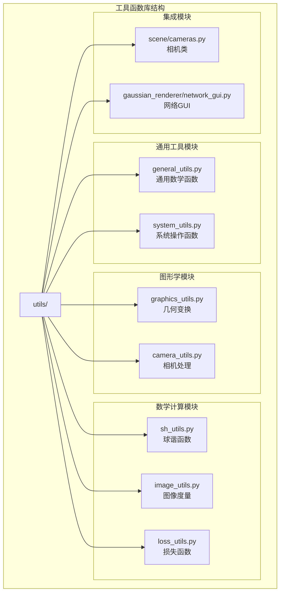
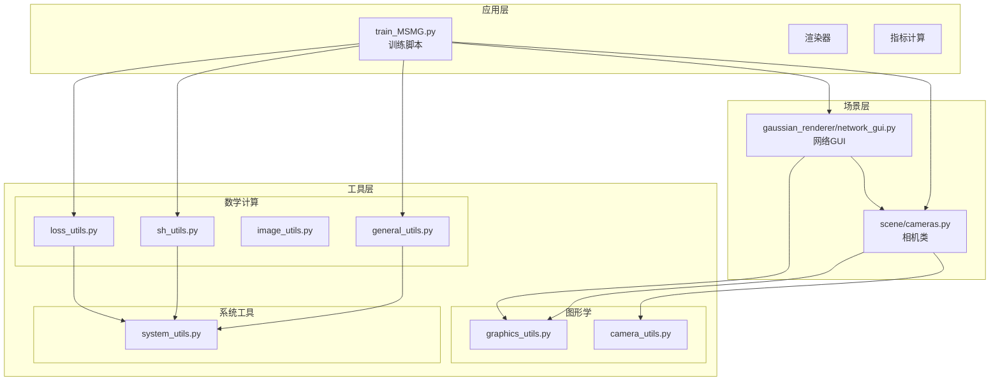
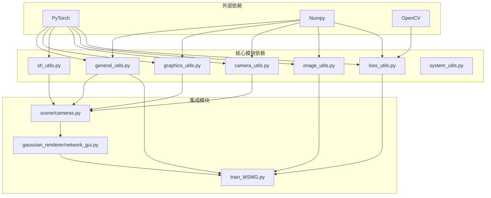

# 工具函数库

<cite>
**本文档引用的文件**
- [general_utils.py](file://utils/general_utils.py)
- [graphics_utils.py](file://utils/graphics_utils.py)
- [sh_utils.py](file://utils/sh_utils.py)
- [camera_utils.py](file://utils/camera_utils.py)
- [image_utils.py](file://utils/image_utils.py)
- [loss_utils.py](file://utils/loss_utils.py)
- [system_utils.py](file://utils/system_utils.py)
- [cameras.py](file://scene/cameras.py)
- [network_gui.py](file://gaussian_renderer/network_gui.py)
- [train_MSMG.py](file://train_MSMG.py)
- [README.md](file://README.md)
</cite>

## 目录
1. [简介](#简介)
2. [项目结构](#项目结构)
3. [核心组件](#核心组件)
4. [架构概览](#架构概览)
5. [详细组件分析](#详细组件分析)
6. [依赖分析](#依赖分析)
7. [性能考虑](#性能考虑)
8. [故障排除指南](#故障排除指南)
9. [结论](#结论)

## 简介

Thermal-Gaussian工具函数库是一个专为热成像3D高斯点云渲染系统设计的辅助函数集合。该库提供了从基础数学运算到复杂图形学计算的完整工具链，支持多模态（RGB和热红外）场景重建和渲染。库中包含通用工具函数、图形学计算、球谐函数处理、相机变换、图像处理和损失计算等模块，为开发者提供了高效的工具集来构建和优化热成像渲染系统。

## 项目结构

工具函数库位于项目的`utils`目录下，采用模块化设计，每个模块专注于特定的功能领域：

**图表来源**
- [general_utils.py:1-134](file://utils/general_utils.py#L1-L134)
- [graphics_utils.py:1-77](file://utils/graphics_utils.py#L1-L77)
- [sh_utils.py:1-118](file://utils/sh_utils.py#L1-L118)
- [camera_utils.py:1-83](file://utils/camera_utils.py#L1-L83)
- [image_utils.py:1-20](file://utils/image_utils.py#L1-L20)
- [loss_utils.py:1-114](file://utils/loss_utils.py#L1-L114)
- [system_utils.py:1-29](file://utils/system_utils.py#L1-L29)

**章节来源**
- [README.md:1-167](file://README.md#L1-L167)

## 核心组件

工具函数库包含以下核心组件：

### 通用工具函数模块
- 数学运算函数：逆sigmoid函数、指数学习率衰减函数
- 矩阵变换函数：旋转矩阵构建、缩放旋转矩阵构建
- 数据处理函数：对角矩阵提取、安全状态设置

### 图形学计算模块
- 几何变换：点云变换、世界坐标系到视图坐标系转换
- 相机投影：透视投影矩阵、视野角度转换
- 坐标系统：相机内外参矩阵

### 球谐函数处理模块
- 球谐函数评估：支持0-4阶球谐函数
- 颜色空间转换：RGB与球谐系数互转
- 多项式计算：预计算的系数常量

### 相机变换模块
- 相机加载：从COLMAP数据加载相机信息
- 相机序列：批量相机处理
- JSON序列化：相机参数导出

### 图像处理模块
- 质量度量：均方误差、峰值信噪比
- 相似性度量：结构相似性指数

### 损失计算模块
- 基础损失：L1损失、L2损失
- 图像相似性：高斯窗口、SSIM计算
- 平滑性约束：邻域平滑损失

**章节来源**
- [general_utils.py:18-134](file://utils/general_utils.py#L18-L134)
- [graphics_utils.py:17-77](file://utils/graphics_utils.py#L17-L77)
- [sh_utils.py:24-118](file://utils/sh_utils.py#L24-L118)
- [camera_utils.py:19-83](file://utils/camera_utils.py#L19-L83)
- [image_utils.py:14-20](file://utils/image_utils.py#L14-L20)
- [loss_utils.py:20-114](file://utils/loss_utils.py#L20-L114)

## 架构概览

工具函数库采用分层架构设计，各模块之间通过明确的接口进行交互：

**图表来源**
- [train_MSMG.py:16-26](file://train_MSMG.py#L16-L26)
- [scene/cameras.py:17-58](file://scene/cameras.py#L17-L58)
- [gaussian_renderer/network_gui.py:16-86](file://gaussian_renderer/network_gui.py#L16-L86)

## 详细组件分析

### 通用工具函数模块

#### 数学运算函数

**inverse_sigmoid函数**
- 功能：计算逆sigmoid函数，用于参数范围映射
- 参数：x (张量) - 输入值，范围(0,1)
- 返回值：张量 - 逆sigmoid结果
- 使用场景：参数初始化、权重调整

**get_expon_lr_func函数**
- 功能：生成指数学习率衰减函数
- 参数：
  - lr_init: 初始学习率
  - lr_final: 最终学习率  
  - lr_delay_steps: 延迟步数
  - lr_delay_mult: 延迟倍数
  - max_steps: 最大步数
- 返回值：函数 - 接受step参数返回当前学习率
- 使用场景：训练过程中的动态学习率调整

#### 矩阵变换函数

**build_rotation函数**
- 功能：从四元数构建旋转矩阵
- 参数：r (张量) - 四元数 [w,x,y,z]
- 返回值：3×3旋转矩阵
- 性能：GPU加速，向量化操作

**build_scaling_rotation函数**
- 功能：结合缩放和平移构建变换矩阵
- 参数：s (缩放向量), r (四元数)
- 返回值：3×3变换矩阵
- 组合使用：先构建旋转矩阵，再与缩放矩阵相乘

**strip_lowerdiag函数**
- 功能：提取对称矩阵的下三角元素
- 参数：L (对称矩阵)
- 返回值：向量 - 包含6个独立元素
- 应用：协方差矩阵压缩存储

**章节来源**
- [general_utils.py:18-134](file://utils/general_utils.py#L18-L134)

### 图形学计算模块

#### 几何变换函数

**geom_transform_points函数**
- 功能：对点云进行几何变换
- 参数：points (N×3), transf_matrix (4×4)
- 返回值：变换后的点云
- 注意：处理齐次坐标和透视除法

**getWorld2View函数**
- 功能：构建世界到视图变换矩阵
- 参数：R (3×3旋转矩阵), t (3维平移向量)
- 返回值：4×4变换矩阵
- 应用：相机姿态表示

**getWorld2View2函数**
- 功能：带平移和缩放的世界到视图变换
- 参数：R,t (相机姿态), translate,scale (额外变换)
- 返回值：4×4变换矩阵
- 扩展：支持相机中心偏移和缩放

#### 投影函数

**getProjectionMatrix函数**
- 功能：构建透视投影矩阵
- 参数：znear,zfar,fovX,fovY
- 返回值：4×4投影矩阵
- 特点：支持任意视野角度

**fov2focal和focal2fov函数**
- 功能：视野角度与焦距相互转换
- 应用：相机内参计算

**章节来源**
- [graphics_utils.py:17-77](file://utils/graphics_utils.py#L17-L77)

### 球谐函数处理模块

#### 系数常量定义

模块预定义了0-4阶球谐函数的归一化系数：
- C0: 0.28209479177387814
- C1: 0.4886025119029199  
- C2到C4: 对应的5个、7个、9个系数

#### eval_sh函数
- 功能：评估球谐函数在指定方向上的值
- 参数：deg (阶数), sh (系数数组), dirs (单位方向向量)
- 支持：0-4阶球谐函数
- 性能：硬编码多项式实现，避免运行时计算

#### RGB与球谐系数转换
- **RGB2SH**: 将RGB颜色转换为球谐系数
- **SH2RGB**: 将球谐系数转换回RGB颜色
- 应用：颜色插值和混合

**章节来源**
- [sh_utils.py:24-118](file://utils/sh_utils.py#L24-L118)

### 相机变换模块

#### 相机加载函数

**loadCam函数**
- 功能：从COLMAP数据加载单个相机
- 参数：args, id, cam_info, resolution_scale
- 返回值：Camera对象
- 处理：图像重采样、遮罩处理、设备分配

**cameraList_from_camInfos函数**
- 功能：批量加载相机列表
- 参数：cam_infos, resolution_scale, args
- 返回值：Camera对象列表

**camera_to_JSON函数**
- 功能：将相机参数序列化为JSON格式
- 输出：位置、旋转矩阵、焦距等参数

#### 相机类设计

**Camera类**
- 继承：nn.Module
- 属性：相机内参、外参、图像尺寸、投影矩阵
- 方法：构造函数中完成矩阵计算和设备分配
- 设计：支持GPU加速和CUDA设备

**章节来源**
- [camera_utils.py:19-83](file://utils/camera_utils.py#L19-L83)
- [scene/cameras.py:17-58](file://scene/cameras.py#L17-L58)

### 图像处理模块

#### 质量度量函数

**mse函数**
- 功能：计算均方误差
- 参数：img1, img2 (图像张量)
- 返回值：每通道的均方误差
- 应用：图像质量评估

**psnr函数**
- 功能：计算峰值信噪比
- 参数：img1, img2 (图像张量)
- 返回值：信噪比(dB)
- 公式：20*log10(1/sqrt(MSE))

#### 相似性度量

**ssim函数**
- 功能：计算结构相似性指数
- 参数：img1, img2 (图像张量), window_size, size_average
- 实现：高斯窗口卷积，鲁棒性参数C1,C2
- 返回值：相似性分数

**章节来源**
- [image_utils.py:14-20](file://utils/image_utils.py#L14-L20)
- [loss_utils.py:20-67](file://utils/loss_utils.py#L20-L67)

### 损失计算模块

#### 基础损失函数

**l1_loss函数**
- 功能：计算L1范数损失
- 参数：network_output, gt (目标)
- 返回值：平均绝对误差
- 特点：对异常值不敏感

**l2_loss函数**
- 功能：计算L2范数损失
- 参数：network_output, gt
- 返回值：平均平方误差
- 特点：梯度平滑，收敛稳定

#### 高级损失函数

**ssim函数**
- 功能：结构相似性指数损失
- 实现：基于高斯窗口的局部统计量
- 参数：window_size (默认11), size_average
- 返回值：1-SSIM分数

**smoothness_loss函数**
- 功能：图像平滑性约束
- 实现：计算相邻像素差异的L1范数
- 参数：image_map (C×H×W)
- 约束：鼓励空间连续性

**generate_adj_neighbors函数**
- 功能：生成邻域像素矩阵
- 参数：image_map, k (4或8邻域)
- 返回值：C×H×W×k的邻域矩阵
- 应用：平滑性约束计算

**章节来源**
- [loss_utils.py:20-114](file://utils/loss_utils.py#L20-L114)

### 系统工具模块

#### 文件系统操作

**mkdir_p函数**
- 功能：递归创建目录
- 参数：folder_path (路径)
- 异常处理：忽略已存在目录错误

**searchForMaxIteration函数**
- 功能：搜索最大迭代次数
- 参数：folder (保存目录)
- 返回值：整数 - 最大迭代编号
- 应用：模型恢复和继续训练

**章节来源**
- [system_utils.py:16-29](file://utils/system_utils.py#L16-L29)

## 依赖分析

工具函数库的依赖关系呈现清晰的层次结构：

**图表来源**
- [general_utils.py:12-16](file://utils/general_utils.py#L12-L16)
- [graphics_utils.py:12-15](file://utils/graphics_utils.py#L12-L15)
- [loss_utils.py:13-18](file://utils/loss_utils.py#L13-L18)
- [scene/cameras.py:12-14](file://scene/cameras.py#L12-L14)

### 模块间耦合分析

**低耦合设计特点**：
- 各模块保持独立功能，减少相互依赖
- 通过明确的函数接口进行通信
- 数据类型标准化（张量、数组）

**关键依赖关系**：
- 所有模块依赖PyTorch进行张量运算
- 图形学模块依赖NumPy进行数值计算
- 损失函数模块可选依赖OpenCV

**章节来源**
- [general_utils.py:12-16](file://utils/general_utils.py#L12-L16)
- [graphics_utils.py:12-15](file://utils/graphics_utils.py#L12-L15)
- [loss_utils.py:13-18](file://utils/loss_utils.py#L13-L18)

## 性能考虑

### GPU加速策略

**CUDA优化**：
- 所有张量运算默认在GPU上执行
- 旋转矩阵构建直接在CUDA设备上完成
- 批量矩阵操作利用向量化优化

**内存管理**：
- 及时释放中间计算结果
- 使用in-place操作减少内存占用
- GPU内存池管理

### 算法复杂度

**时间复杂度**：
- 矩阵变换：O(n) 对于n个点
- 球谐函数评估：O(d²) 对于d阶
- SSIM计算：O(nw²) 对于n像素和w×w窗口

**空间复杂度**：
- 球谐函数系数：O(d²)
- 邻域矩阵：O(C×H×W×k)

### 缓存和预计算

**系数缓存**：
- 球谐函数系数预计算并存储
- 避免重复计算相同参数

**批处理优化**：
- 向量化操作提升吞吐量
- 减少CPU-GPU数据传输

## 故障排除指南

### 常见问题诊断

**CUDA相关错误**：
- 设备不可用：检查GPU驱动和CUDA版本
- 内存不足：降低批量大小或图像分辨率
- 类型不匹配：确保输入张量类型一致

**数值稳定性问题**：
- 除零错误：使用小常数避免除零
- 数值溢出：添加梯度裁剪
- 精度丢失：使用适当的数据类型

**模块导入错误**：
- 依赖缺失：安装缺失的Python包
- 版本冲突：检查兼容性要求
- 路径问题：确认PYTHONPATH设置

### 性能调优建议

**训练阶段优化**：
- 学习率调度：使用指数衰减函数
- 批量大小：根据GPU内存调整
- 数据预处理：提前完成图像重采样

**推理阶段优化**：
- 模型量化：减少内存占用
- 并行处理：利用多核CPU
- 缓存策略：复用中间结果

**章节来源**
- [general_utils.py:112-134](file://utils/general_utils.py#L112-L134)
- [system_utils.py:16-29](file://utils/system_utils.py#L16-L29)

## 结论

Thermal-Gaussian工具函数库提供了完整的3D高斯点云渲染系统所需的工具集。库的设计体现了模块化、高性能和易用性的平衡：

**设计优势**：
- 清晰的模块划分，便于维护和扩展
- GPU原生支持，满足实时渲染需求
- 完善的数学基础，支持复杂的图形学计算

**应用场景**：
- 热成像场景重建
- 多模态图像融合
- 实时渲染和可视化

**未来发展**：
- 支持更多球谐函数阶数
- 增强的相机模型
- 更丰富的损失函数族

该工具库为热成像3D高斯点云渲染提供了坚实的技术基础，开发者可以基于此库快速构建和优化自己的渲染系统。