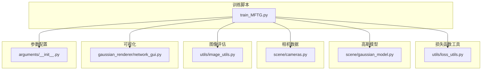
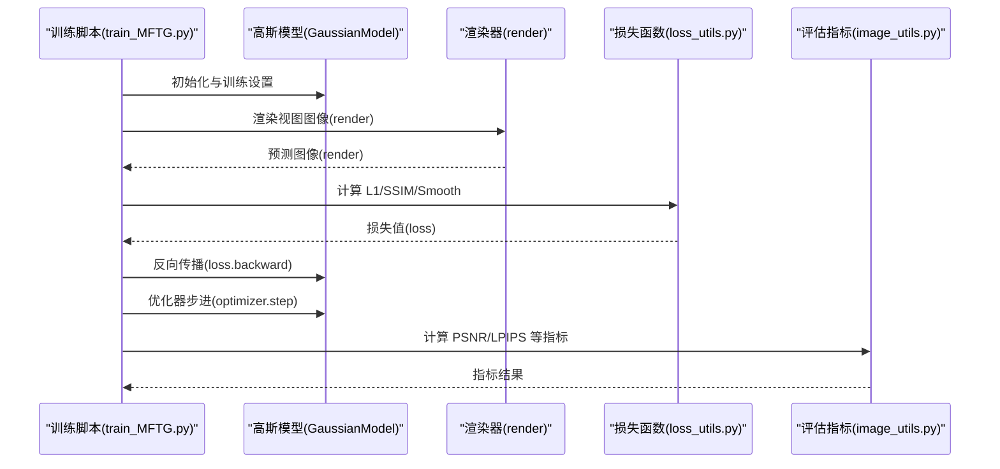
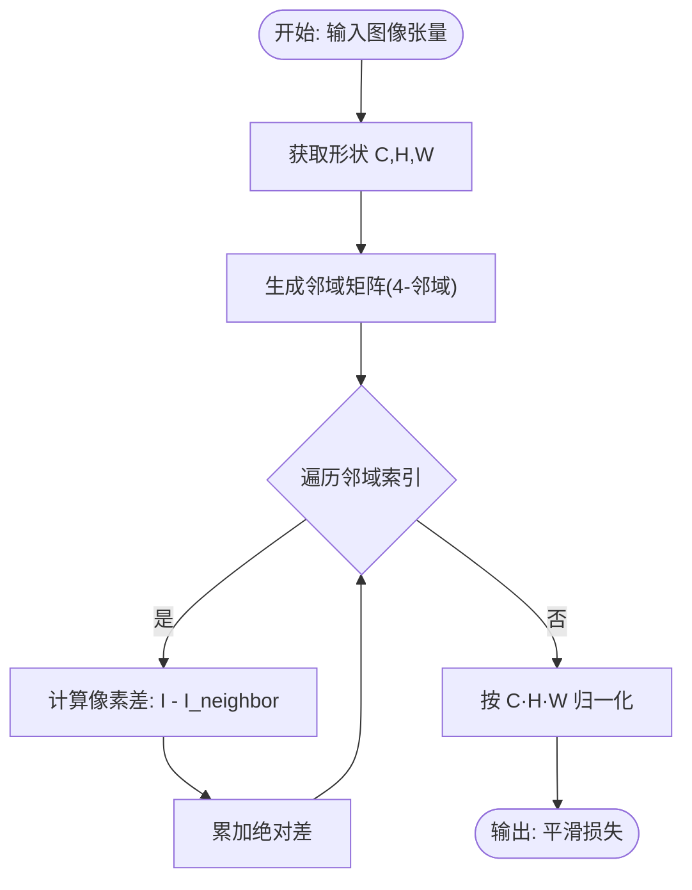
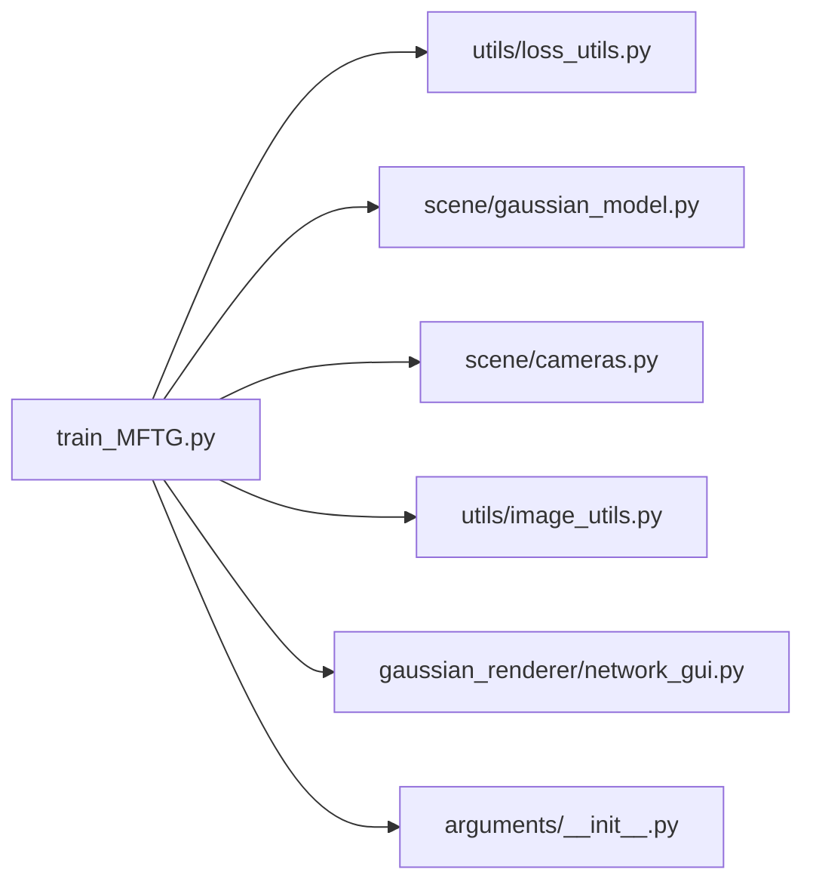

# 损失函数工具

<cite>
**本文引用的文件**
- [loss_utils.py](file://utils/loss_utils.py)
- [train_MFTG.py](file://train_MFTG.py)
- [gaussian_model.py](file://scene/gaussian_model.py)
- [cameras.py](file://scene/cameras.py)
- [image_utils.py](file://utils/image_utils.py)
- [network_gui.py](file://gaussian_renderer/network_gui.py)
- [__init__.py](file://arguments/__init__.py)
- [README.md](file://README.md)
</cite>

## 目录
1. [简介](#简介)
2. [项目结构](#项目结构)
3. [核心组件](#核心组件)
4. [架构总览](#架构总览)
5. [详细组件分析](#详细组件分析)
6. [依赖关系分析](#依赖关系分析)
7. [性能考量](#性能考量)
8. [故障排查指南](#故障排查指南)
9. [结论](#结论)
10. [附录](#附录)

## 简介
本文件系统性梳理 Thermal-Gaussian 损失函数工具，聚焦于训练过程中的损失函数设计与实现，包括均方误差（MSE）、感知相似性（SSIM）以及热红外平滑约束（Smoothness Loss）。文档从数学原理、梯度计算、权重调节策略、动态平衡与收敛性保障等方面进行深入解析，并结合双模态训练、热红外物理特性约束与几何一致性要求，给出损失函数组合与自适应调整机制的应用实例。

## 项目结构
该仓库围绕 3D 高斯点云渲染与优化展开，损失函数工具主要位于 utils/loss_utils.py，并在训练脚本 train_MFTG.py 中被调用；高斯模型参数与优化器在 scene/gaussian_model.py 中定义；相机数据结构在 scene/cameras.py 中定义；评估指标在 utils/image_utils.py 中提供；可视化与交互在 gaussian_renderer/network_gui.py 中实现；超参配置在 arguments/__init__.py 中定义；README.md 提供整体背景与使用说明。



图表来源
- [train_MFTG.py:1-273](file://train_MFTG.py#L1-L273)
- [loss_utils.py:1-114](file://utils/loss_utils.py#L1-L114)
- [gaussian_model.py:1-407](file://scene/gaussian_model.py#L1-L407)
- [cameras.py:1-72](file://scene/cameras.py#L1-L72)
- [image_utils.py:1-20](file://utils/image_utils.py#L1-L20)
- [network_gui.py:1-86](file://gaussian_renderer/network_gui.py#L1-L86)
- [__init__.py:1-113](file://arguments/__init__.py#L1-L113)

章节来源
- [README.md:1-167](file://README.md#L1-L167)
- [train_MFTG.py:1-273](file://train_MFTG.py#L1-L273)
- [arguments/__init__.py:71-90](file://arguments/__init__.py#L71-L90)

## 核心组件
- 均方误差（MSE）与平均绝对误差（MAE）
  - 定义：用于像素级重建误差度量，分别衡量预测图像与真实图像之间的平方差与绝对差。
  - 数学表达：
    - L1 损失：L1 = mean(|I_pred − I_gt|)
    - L2 损失：L2 = mean((I_pred − I_gt)^2)
  - 梯度：对每个像素位置求导，梯度形式分别为 ±sgn(I_pred − I_gt) 与 ±2(I_pred − I_gt)，便于稳定优化。
  - 实现位置：[l1_loss:20-21](file://utils/loss_utils.py#L20-L21)、[l2_loss:23-24](file://utils/loss_utils.py#L23-L24)

- 结构相似性指数（SSIM）
  - 设计原理：通过局部窗口统计两幅图像的一阶与二阶矩，结合常数项 C1/C2 进行归一化，避免亮度与对比度差异带来的误判。
  - 数学表达（简化）：SSIM ≈ (2μ1μ2 + C1)(2σ12 + C2)/[(μ1^2 + μ2^2 + C1)(σ1^2 + σ2^2 + C2)]
  - 梯度：基于窗口卷积与幂次运算的链式法则，对 μ1、μ2、σ1^2、σ2^2、σ12 的梯度进行合成。
  - 实现位置：[ssim:36-66](file://utils/loss_utils.py#L36-L66)

- 热红外平滑约束（Smoothness Loss）
  - 物理动机：热成像具有空间连续性与邻域相关性，平滑约束可抑制噪声与伪影，提升热模态渲染质量。
  - 计算方式：对图像通道逐通道构造 4-邻域或 8-邻域的相邻像素矩阵，计算与中心像素的绝对差之和，再按通道、高度、宽度归一化。
  - 数学表达：Smooth = (1/(C·H·W)) Σ_c Σ_h Σ_w |I_c,h,w − I_neighbor(c,h,w)|，其中 neighbor 表示上下左右或八邻域。
  - 实现位置：[generate_adj_neighbors:68-96](file://utils/loss_utils.py#L68-L96)、[smoothness_loss:98-113](file://utils/loss_utils.py#L98-L113)

- 双模态损失组合与权重调节
  - 组合策略：在颜色模态中采用 L1 + λ_dssim·(1−SSIM)；在热模态中增加平滑约束项：L1 + λ_dssim·(1−SSIM) + α·Smooth。
  - 权重 λ_dssim 与 α 的作用：控制感知保真与几何/物理约束的相对重要性；通过优化器学习率调度与迭代阶段调整实现动态平衡。
  - 实现位置：[训练主循环损失计算:106-114](file://train_MFTG.py#L106-L114)、[优化参数定义:83-83](file://arguments/__init__.py#L83-L83)

章节来源
- [loss_utils.py:20-113](file://utils/loss_utils.py#L20-L113)
- [train_MFTG.py:106-114](file://train_MFTG.py#L106-L114)
- [arguments/__init__.py:83-83](file://arguments/__init__.py#L83-L83)

## 架构总览
下图展示了训练流程中损失函数与模型、渲染器、优化器之间的交互关系。



图表来源
- [train_MFTG.py:103-116](file://train_MFTG.py#L103-L116)
- [loss_utils.py:20-113](file://utils/loss_utils.py#L20-L113)
- [gaussian_model.py:149-176](file://scene/gaussian_model.py#L149-L176)
- [image_utils.py:14-19](file://utils/image_utils.py#L14-L19)

## 详细组件分析

### 均方误差与平均绝对误差
- 实现要点
  - MAE：对像素差取绝对值后取均值，对异常值鲁棒性强，适合初学者与稳健训练。
  - MSE：对像素差取平方后取均值，梯度随误差增大而增大，有利于快速收敛但对异常值敏感。
- 梯度分析
  - MAE：符号函数导数，梯度恒定，有助于稳定训练。
  - MSE：线性导数，误差大时梯度大，可能引发震荡，需配合学习率调度。
- 应用场景
  - 在颜色模态与热模态均可用作基础重建项，通常与感知损失（如 SSIM）联合使用以兼顾像素级与感知级保真。

章节来源
- [loss_utils.py:20-24](file://utils/loss_utils.py#L20-L24)

### 结构相似性指数（SSIM）
- 数学推导要点
  - 局部均值与方差：μ1、μ2、σ1^2、σ2^2、σ12 通过窗口卷积计算。
  - 归一化因子：引入 C1、C2 抑制分母接近零时的数值不稳定。
  - 最终 SSIM：两两配对的分子与分母相乘后归一化。
- 梯度计算
  - 对 μ1、μ2、σ1^2、σ2^2、σ12 的梯度经链式法则合成到输入图像，从而得到 SSIM 的梯度。
- 实践建议
  - 将 1−SSIM 作为感知损失项，与 L1 组合形成“像素级 + 感知级”的双目标标，提升视觉质量。

章节来源
- [loss_utils.py:36-66](file://utils/loss_utils.py#L36-L66)

### 热红外平滑约束（Smoothness Loss）
- 设计动机
  - 热成像具有空间连续性与邻域相关性，平滑约束可抑制噪声与伪影，提升热模态渲染质量。
- 计算流程
  - 构造邻域矩阵：对每个通道生成上下左右或八邻域的相邻像素矩阵。
  - 计算绝对差：对中心像素与其邻域像素逐点取绝对差。
  - 归一化：按通道、高度、宽度求和后除以总像素数。
- 梯度特性
  - 平滑损失对像素差的绝对值求和，梯度为 ±1（按方向），对噪声具有抑制作用。
- 实现细节
  - 4-邻域与 8-邻域两种模式，可通过参数切换；当前实现固定为 4-邻域。



图表来源
- [loss_utils.py:68-113](file://utils/loss_utils.py#L68-L113)

章节来源
- [loss_utils.py:68-113](file://utils/loss_utils.py#L68-L113)

### 双模态训练中的损失组合与自适应调整
- 颜色模态损失
  - L_total = (1 − λ_dssim) · L1 + λ_dssim · (1 − SSIM)
  - 作用：在像素级保真与感知保真之间取得平衡；λ_dssim 控制 SSIM 的权重。
- 热模态损失
  - L_total = (1 − λ_dssim) · L1 + λ_dssim · (1 − SSIM) + α · Smooth
  - 作用：在颜色模态基础上加入热模态的物理约束，α 控制平滑项强度。
- 自适应策略
  - 学习率调度：位置参数学习率按指数衰减函数变化，保证早期快速收敛与后期稳定。
  - 分辨率与密度：迭代过程中逐步提升球谐度上限，增强细节表现。
  - 密集化与修剪：根据梯度统计与可见性过滤进行点云密度调整，间接影响损失分布与收敛稳定性。

```mermaid
sequenceDiagram
participant Iter as "训练迭代"
participant Step as "步骤选择(step)"
participant Color as "颜色损失"
participant Thermal as "热模态损失"
participant Opt as "优化器"
Iter->>Step : 判断 step=1 或 2
alt 颜色模态
Step->>Color : L1 + λ_dssim·(1−SSIM)
Color->>Opt : 反向传播
else 热模态
Step->>Thermal : L1 + λ_dssim·(1−SSIM) + α·Smooth
Thermal->>Opt : 反向传播
end
Opt-->>Iter : 参数更新
```

图表来源
- [train_MFTG.py:106-114](file://train_MFTG.py#L106-L114)
- [gaussian_model.py:169-175](file://scene/gaussian_model.py#L169-L175)

章节来源
- [train_MFTG.py:106-114](file://train_MFTG.py#L106-L114)
- [gaussian_model.py:149-176](file://scene/gaussian_model.py#L149-L176)
- [arguments/__init__.py:83-83](file://arguments/__init__.py#L83-L83)

### 几何一致性与正则化
- 几何一致性
  - 通过高斯点云的协方差激活与旋转归一化，确保点云在不同视角下保持一致的几何分布。
  - 密集化与修剪策略：基于梯度累积与可见性过滤，动态增删点云，维持合理的几何密度。
- 正则化项
  - 平滑约束（热模态）：抑制噪声与伪影，提升热成像质量。
  - 密度与透明度正则：通过透明度重置与密度阈值修剪，防止过拟合与冗余点云。

章节来源
- [gaussian_model.py:26-42](file://scene/gaussian_model.py#L26-L42)
- [gaussian_model.py:389-401](file://scene/gaussian_model.py#L389-L401)

## 依赖关系分析
- 模块耦合
  - train_MFTG.py 依赖 utils/loss_utils.py（L1、SSIM、Smooth）、scene/gaussian_model.py（模型与优化器）、scene/cameras.py（相机数据）、utils/image_utils.py（PSNR 等指标）、gaussian_renderer/network_gui.py（可视化交互）。
  - loss_utils.py 为纯函数模块，不依赖其他训练脚本，具备良好的可移植性。
- 外部依赖
  - PyTorch（自动微分、卷积、归一化）、NumPy（邻域构造）、OpenCV（图像处理，部分模块未直接使用）。
- 循环依赖
  - 未发现循环导入；各模块职责清晰，接口明确。



图表来源
- [train_MFTG.py:16-26](file://train_MFTG.py#L16-L26)
- [loss_utils.py:12-18](file://utils/loss_utils.py#L12-L18)
- [gaussian_model.py:12-22](file://scene/gaussian_model.py#L12-L22)
- [cameras.py:12-15](file://scene/cameras.py#L12-L15)
- [image_utils.py:12-13](file://utils/image_utils.py#L12-L13)
- [network_gui.py:12-16](file://gaussian_renderer/network_gui.py#L12-L16)
- [__init__.py:12-14](file://arguments/__init__.py#L12-L14)

章节来源
- [train_MFTG.py:16-26](file://train_MFTG.py#L16-L26)
- [loss_utils.py:12-18](file://utils/loss_utils.py#L12-L18)
- [gaussian_model.py:12-22](file://scene/gaussian_model.py#L12-L22)
- [cameras.py:12-15](file://scene/cameras.py#L12-L15)
- [image_utils.py:12-13](file://utils/image_utils.py#L12-L13)
- [network_gui.py:12-16](file://gaussian_renderer/network_gui.py#L12-L16)
- [__init__.py:12-14](file://arguments/__init__.py#L12-L14)

## 性能考量
- 计算复杂度
  - L1/L2：O(H·W·C)，逐像素操作，计算开销小。
  - SSIM：包含窗口卷积与多处幂次运算，复杂度近似 O(k·H·W·C)，k 为窗口大小。
  - Smooth：对每个像素构造邻域并求和，复杂度 O(K·H·W·C)，K 为邻域数量（4 或 8）。
- 内存与显存
  - SSIM 与 Smooth 均涉及中间张量的构造与广播，注意批大小与分辨率对显存的影响。
- 优化建议
  - 合理设置 λ_dssim 与 α，避免感知项或平滑项主导导致梯度消失或爆炸。
  - 使用指数学习率调度与密度控制策略，提升收敛稳定性与速度。
  - 在热模态中优先启用平滑约束，以改善热成像质量。

[本节为通用性能讨论，无需特定文件来源]

## 故障排查指南
- SSIM 梯度异常或 NaN
  - 检查输入图像是否归一化至 [0,1] 区间，确保 C1/C2 常数项有效。
  - 检查窗口大小与图像尺寸匹配情况，避免边界填充不足。
  - 参考实现位置：[ssim:36-66](file://utils/loss_utils.py#L36-L66)
- 平滑损失过大或过小
  - 调整 α 权重；若热图像噪声较大，适当降低 α 或先做去噪预处理。
  - 确认邻域构造逻辑与通道维度一致。
  - 参考实现位置：[smoothness_loss:98-113](file://utils/loss_utils.py#L98-L113)
- 收敛缓慢或震荡
  - 降低学习率或检查指数调度参数；关注 λ_dssim 是否过高导致感知项主导。
  - 参考实现位置：[优化参数定义:71-90](file://arguments/__init__.py#L71-L90)、[学习率调度:169-175](file://scene/gaussian_model.py#L169-L175)
- 热模态渲染伪影明显
  - 增强平滑约束强度（提高 α），或检查点云密度与可见性过滤策略。
  - 参考实现位置：[密集化与修剪:389-401](file://scene/gaussian_model.py#L389-L401)

章节来源
- [loss_utils.py:36-66](file://utils/loss_utils.py#L36-L66)
- [loss_utils.py:98-113](file://utils/loss_utils.py#L98-L113)
- [arguments/__init__.py:71-90](file://arguments/__init__.py#L71-L90)
- [gaussian_model.py:169-175](file://scene/gaussian_model.py#L169-L175)
- [gaussian_model.py:389-401](file://scene/gaussian_model.py#L389-L401)

## 结论
本文系统梳理了 Thermal-Gaussian 损失函数工具，明确了 L1、SSIM 与 Smooth 损失的数学原理与实现细节，并给出了在双模态训练、热红外平滑约束与几何一致性方面的组合策略与自适应调整机制。通过合理设置 λ_dssim 与 α，结合指数学习率与密度控制策略，可在颜色与热模态上同时获得高质量的重建与稳定的收敛表现。

[本节为总结性内容，无需特定文件来源]

## 附录
- 关键参数与默认值
  - λ_dssim：0.2（优化参数）
  - 密度控制：从第 500 轮开始，每 100 轮进行一次密集化与修剪
  - 位置学习率：指数衰减，最大步数 30000
- 数据准备与运行
  - 颜色与热模态图像需分别组织在 rgb 与 thermal 目录下，并提供 COLMAP 稀疏重建结果。
  - 运行顺序：训练 → 渲染 → 评估指标计算。

章节来源
- [arguments/__init__.py:71-90](file://arguments/__init__.py#L71-L90)
- [README.md:31-60](file://README.md#L31-L60)
- [README.md:83-89](file://README.md#L83-L89)