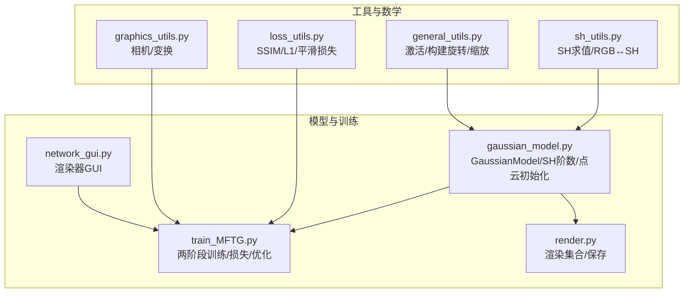
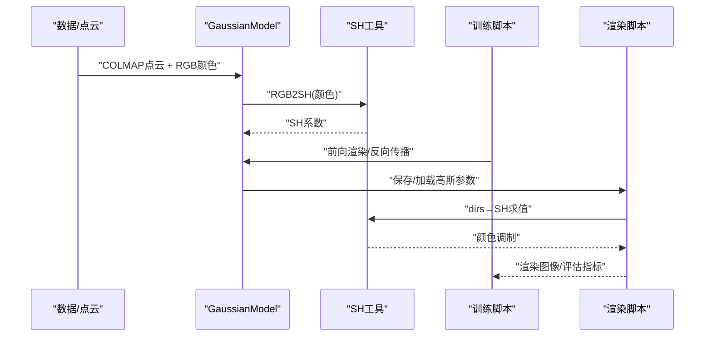
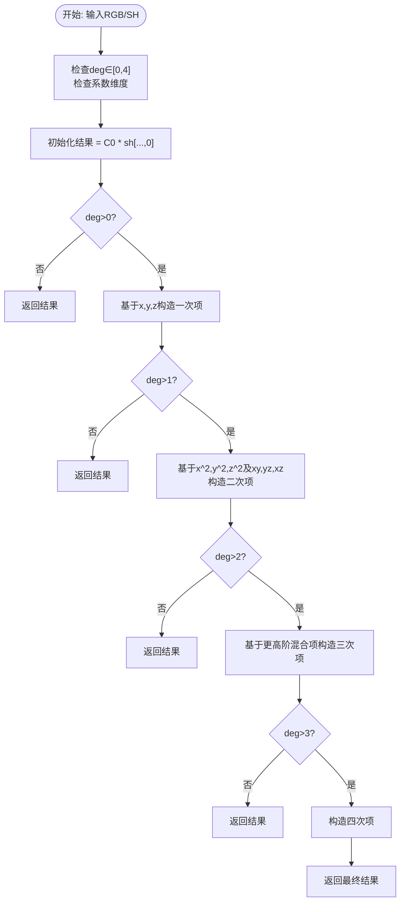
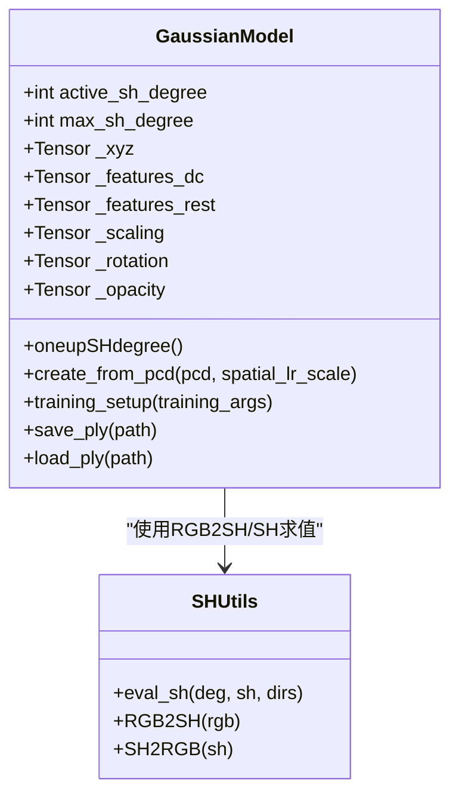
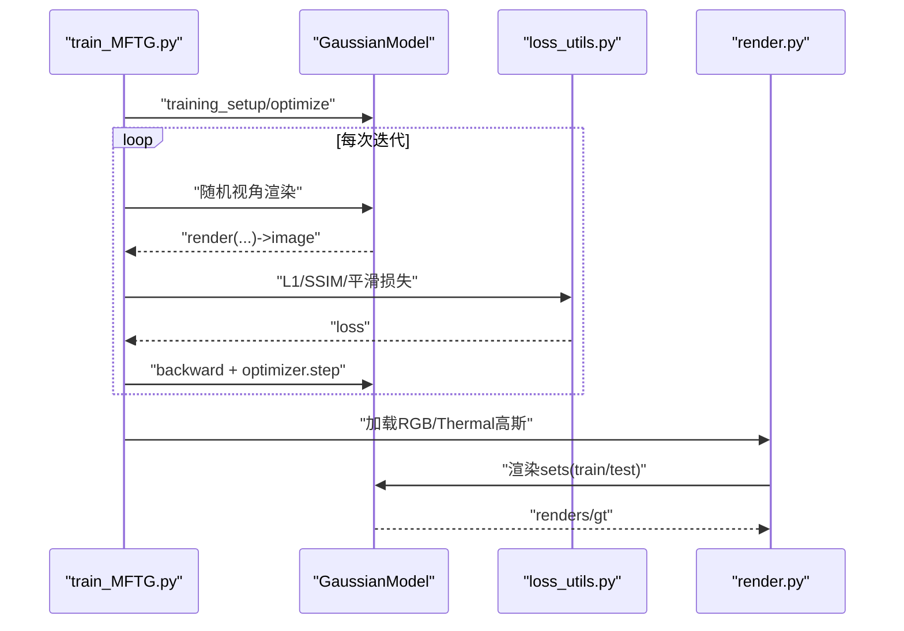
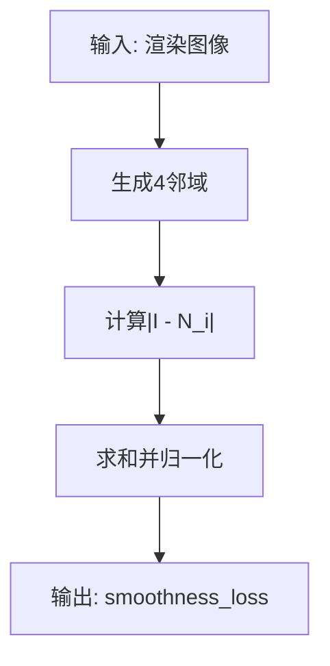
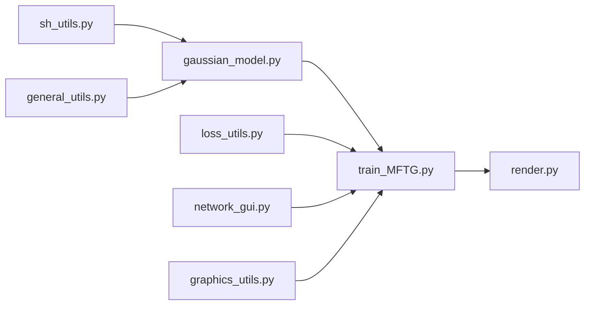

# 球谐函数工具

<cite>
**本文引用的文件**
- [utils/sh_utils.py](file://utils/sh_utils.py)
- [scene/gaussian_model.py](file://scene/gaussian_model.py)
- [utils/loss_utils.py](file://utils/loss_utils.py)
- [MFTG-Technical-Doc.md](file://MFTG-Technical-Doc.md)
- [README.md](file://README.md)
- [render.py](file://render.py)
- [train_MFTG.py](file://train_MFTG.py)
- [gaussian_renderer/network_gui.py](file://gaussian_renderer/network_gui.py)
- [utils/graphics_utils.py](file://utils/graphics_utils.py)
- [utils/general_utils.py](file://utils/general_utils.py)
</cite>

## 目录
1. [简介](#简介)
2. [项目结构](#项目结构)
3. [核心组件](#核心组件)
4. [架构总览](#架构总览)
5. [详细组件分析](#详细组件分析)
6. [依赖关系分析](#依赖关系分析)
7. [性能考量](#性能考量)
8. [故障排查指南](#故障排查指南)
9. [结论](#结论)
10. [附录](#附录)

## 简介
本文件围绕 Thermal-Gaussian 项目中的“球谐函数工具”展开，系统阐述其数学原理、实现细节以及在3D高斯渲染中的应用。重点覆盖以下方面：
- 球谐函数的数学基础与实现：包含系数常数、多项式求值、RGB↔SH变换。
- 在3D高斯模型中的角色：作为颜色表示与渲染的调制因子，参与训练与推理。
- 计算流程：从点云颜色到SH系数、再到渲染时的方向性调制。
- 应用场景：颜色编码、光照近似、热成像（温度场）平滑先验。
- 接口与参数：函数签名、参数范围、数值精度与稳定性建议。
- 与渲染器的集成：如何在渲染管线中使用SH进行颜色合成。

## 项目结构
与球谐函数工具直接相关的代码主要分布在以下模块：
- 数学与工具层：utils/sh_utils.py（SH多项式求值、RGB↔SH转换）
- 3D高斯模型：scene/gaussian_model.py（高斯属性、SH阶数管理、点云初始化）
- 损失与先验：utils/loss_utils.py（SSIM、L1、热成像平滑损失）
- 训练与渲染：train_MFTG.py、render.py（两阶段训练、渲染流程）
- 渲染器GUI：gaussian_renderer/network_gui.py（网络交互）
- 图形与通用工具：utils/graphics_utils.py、utils/general_utils.py

**图表来源**
- [utils/sh_utils.py:24-118](file://utils/sh_utils.py#L24-L118)
- [scene/gaussian_model.py:124-147](file://scene/gaussian_model.py#L124-L147)
- [utils/loss_utils.py:20-114](file://utils/loss_utils.py#L20-L114)
- [train_MFTG.py:35-163](file://train_MFTG.py#L35-L163)
- [render.py:25-59](file://render.py#L25-L59)
- [gaussian_renderer/network_gui.py:26-85](file://gaussian_renderer/network_gui.py#L26-L85)
- [utils/graphics_utils.py:17-77](file://utils/graphics_utils.py#L17-L77)
- [utils/general_utils.py:18-110](file://utils/general_utils.py#L18-L110)

**章节来源**
- [README.md:1-167](file://README.md#L1-L167)
- [MFTG-Technical-Doc.md:1-618](file://MFTG-Technical-Doc.md#L1-L618)

## 核心组件
- 球谐函数工具（sh_utils.py）
  - 提供 SH 求值函数、RGB 与 SH 的双向转换常数与公式。
  - 支持最高 4 阶 SH，按阶数选择对应的多项式组合。
- 3D 高斯模型（gaussian_model.py）
  - 维护高斯的几何与外观参数，包括位置、尺度、旋转、不透明度与 SH 系数。
  - 提供从点云颜色到 SH 系数的初始化流程，并支持动态提升 SH 阶数。
- 损失与先验（loss_utils.py）
  - 提供 L1、SSIM、以及面向热成像的平滑损失，后者用于约束温度场的连续性。
- 训练与渲染（train_MFTG.py、render.py）
  - 两阶段训练：先 RGB，再 Thermal 微调；渲染时根据模态输出对应图像。
- 渲染器 GUI（network_gui.py）
  - 提供网络交互，支持实时渲染与参数调整。

**章节来源**
- [utils/sh_utils.py:24-118](file://utils/sh_utils.py#L24-L118)
- [scene/gaussian_model.py:44-147](file://scene/gaussian_model.py#L44-L147)
- [utils/loss_utils.py:20-114](file://utils/loss_utils.py#L20-L114)
- [train_MFTG.py:35-163](file://train_MFTG.py#L35-L163)
- [render.py:25-59](file://render.py#L25-L59)
- [gaussian_renderer/network_gui.py:26-85](file://gaussian_renderer/network_gui.py#L26-L85)

## 架构总览
球谐函数在 Thermal-Gaussian 中贯穿“数据→模型→渲染→评估”的全流程：
- 数据阶段：COLMAP 点云 + RGB/热图像，RGB 颜色经 RGB2SH 转换为 SH 系数。
- 模型阶段：GaussianModel 维护 SH 系数张量，随训练更新。
- 渲染阶段：对每个高斯，使用单位方向与 SH 系数求值，得到各通道颜色，叠加生成最终图像。
- 评估阶段：使用 L1/SSIM/LPIPS 等指标评估渲染质量；热成像阶段额外加入平滑损失。

**图表来源**
- [scene/gaussian_model.py:124-147](file://scene/gaussian_model.py#L124-L147)
- [utils/sh_utils.py:114-118](file://utils/sh_utils.py#L114-L118)
- [train_MFTG.py:103-114](file://train_MFTG.py#L103-L114)
- [render.py:35-39](file://render.py#L35-L39)

## 详细组件分析

### 球谐函数数学与实现（sh_utils.py）
- 常数与阶数
  - 提供 C0~C4 的归一化球谐常数，用于不同阶次的多项式组合。
  - 支持最高 4 阶，对应 (deg+1)^2=25 个系数。
- SH 求值（eval_sh）
  - 输入：deg（0-4）、SH 系数张量 [..., C, (deg+1)^2]、单位方向 dirs [..., 3]。
  - 输出：[..., C]，即沿方向的强度或颜色分量。
  - 实现要点：按阶次逐步累加多项式项，利用 x,y,z 及其乘积构造齐次多项式。
- RGB↔SH 转换（RGB2SH、SH2RGB）
  - 使用 C0 进行线性缩放和平移，将颜色映射到 SH 空间或还原回颜色。
  - 注意：RGB 通常在 [0,1] 区间，转换后 SH 系数可用于后续求值。

**图表来源**
- [utils/sh_utils.py:57-112](file://utils/sh_utils.py#L57-L112)

**章节来源**
- [utils/sh_utils.py:24-118](file://utils/sh_utils.py#L24-L118)

### 3D 高斯模型与 SH 系数管理（gaussian_model.py）
- 初始化与参数
  - 从点云创建高斯：xyz、颜色（经 RGB2SH 转换为 SH）、尺度、旋转、不透明度。
  - features_dc/ features_rest 分别存储主系数与余项，形状为 (N, C, (deg+1)^2)。
- SH 阶数管理
  - oneupSHdegree：按迭代步长提升活跃 SH 阶数，逐步增加拟合能力。
- 训练设置与优化
  - 提供位置、颜色（DC/Rest）、不透明度、尺度、旋转的学习率与优化器配置。
- 点云与 PLY 文件
  - 支持保存/加载 PLY，其中包含 SH 系数字段，便于跨阶段复用。

**图表来源**
- [scene/gaussian_model.py:44-147](file://scene/gaussian_model.py#L44-L147)
- [utils/sh_utils.py:114-118](file://utils/sh_utils.py#L114-L118)

**章节来源**
- [scene/gaussian_model.py:44-147](file://scene/gaussian_model.py#L44-L147)

### 训练与渲染流程（train_MFTG.py、render.py）
- 两阶段训练
  - Phase 1（RGB）：使用 L1+SSIM 损失训练，输出 RGB 高斯。
  - Phase 2（Thermal）：复用 Phase 1 的高斯，仅微调 SH 系数以适配热图像，加入平滑损失。
- 渲染
  - 每次渲染输出单模态图像（RGB 或 Thermal），由 Scene_1/Scene_2 决定。
  - render.py 分别加载两套高斯，生成对应模态的渲染与 GT 图像。

**图表来源**
- [train_MFTG.py:68-158](file://train_MFTG.py#L68-L158)
- [utils/loss_utils.py:20-114](file://utils/loss_utils.py#L20-L114)
- [render.py:42-59](file://render.py#L42-L59)

**章节来源**
- [train_MFTG.py:35-163](file://train_MFTG.py#L35-L163)
- [render.py:25-59](file://render.py#L25-L59)
- [MFTG-Technical-Doc.md:97-153](file://MFTG-Technical-Doc.md#L97-L153)

### 热成像平滑先验（loss_utils.py）
- 平滑损失（smoothness_loss）
  - 通过 4 邻域（上下左右）计算相邻像素差的绝对值之和，归一化后作为正则项。
  - 在 Thermal 微调阶段显著提升温度场的连续性与真实感。
- 与渲染的结合
  - 在 Phase 2 的损失中加入平滑项，平衡 L1/SSIM 与温度场平滑。

**图表来源**
- [utils/loss_utils.py:68-114](file://utils/loss_utils.py#L68-L114)

**章节来源**
- [utils/loss_utils.py:68-114](file://utils/loss_utils.py#L68-L114)
- [MFTG-Technical-Doc.md:166-179](file://MFTG-Technical-Doc.md#L166-L179)

### 渲染器 GUI 集成（network_gui.py）
- 提供网络端口与消息协议，接收相机参数与渲染请求。
- 支持实时渲染与参数调试，便于训练过程可视化。

**章节来源**
- [gaussian_renderer/network_gui.py:26-85](file://gaussian_renderer/network_gui.py#L26-L85)

## 依赖关系分析
- 模块耦合
  - gaussian_model.py 依赖 sh_utils.py 进行 RGB2SH 与 SH 求值。
  - train_MFTG.py 依赖 loss_utils.py 计算损失，依赖 gaussian_renderer.render 执行渲染。
  - render.py 依赖 scene.Scene_1/Scene_2 与 gaussian_renderer.render。
- 外部依赖
  - PyTorch、NumPy、OpenCV（平滑损失中使用卷积/邻域操作）、TensorBoard（日志）。

**图表来源**
- [utils/sh_utils.py:24-118](file://utils/sh_utils.py#L24-L118)
- [scene/gaussian_model.py:124-147](file://scene/gaussian_model.py#L124-L147)
- [utils/loss_utils.py:20-114](file://utils/loss_utils.py#L20-L114)
- [train_MFTG.py:17-25](file://train_MFTG.py#L17-L25)
- [render.py:13-22](file://render.py#L13-L22)
- [gaussian_renderer/network_gui.py:16-16](file://gaussian_renderer/network_gui.py#L16-L16)
- [utils/graphics_utils.py:17-77](file://utils/graphics_utils.py#L17-L77)
- [utils/general_utils.py:18-110](file://utils/general_utils.py#L18-L110)

**章节来源**
- [train_MFTG.py:17-25](file://train_MFTG.py#L17-L25)
- [render.py:13-22](file://render.py#L13-L22)

## 性能考量
- SH 阶数与复杂度
  - 阶数越高，系数越多，求值计算量越大；可通过 oneupSHdegree 动态提升。
- 渲染效率
  - 使用 CUDA 光栅化器进行高效渲染；合理设置分辨率与批大小。
- 数值稳定性
  - RGB2SH/SH2RGB 使用常数 C0，注意输入 RGB 的范围与数值精度。
  - 平滑损失涉及邻域差分，注意边界处理与归一化。

[本节为通用指导，无需特定文件来源]

## 故障排查指南
- SH 阶数不匹配
  - 确保 SH 系数维度满足 (deg+1)^2；若报错，检查初始化与加载 PLY 的字段数量。
- 渲染质量异常
  - 检查 Phase 2 是否正确继承 Phase 1 的高斯参数；确认优化器是否重新初始化。
- 显存不足
  - 降低分辨率、减少 SH 阶数、减小训练图像数量。
- 平滑损失无效
  - 确认 Thermal 微调阶段启用 smoothness_loss，并检查权重系数。

**章节来源**
- [scene/gaussian_model.py:124-147](file://scene/gaussian_model.py#L124-L147)
- [train_MFTG.py:50-51](file://train_MFTG.py#L50-L51)
- [MFTG-Technical-Doc.md:587-617](file://MFTG-Technical-Doc.md#L587-L617)

## 结论
球谐函数工具在 Thermal-Gaussian 中承担了从颜色到方向性调制的核心桥梁作用。通过 RGB2SH 初始化、SH 求值与渲染合成，以及在 Thermal 微调阶段引入的平滑先验，实现了高质量的多模态渲染。合理的 SH 阶数管理与损失设计，使得模型在 RGB 与 Thermal 之间取得平衡，既保证了几何一致性，又提升了热成像的真实感。

[本节为总结，无需特定文件来源]

## 附录

### 函数接口与参数说明
- eval_sh(deg, sh, dirs)
  - 输入：deg（0-4）、sh（[..., C, (deg+1)^2]）、dirs（[..., 3]）
  - 输出：[..., C]
  - 约束：deg 必须在支持范围内；sh 的最后一维至少为 (deg+1)^2
- RGB2SH(rgb)
  - 输入：rgb（[..., 3]，范围通常为 [0,1]）
  - 输出：sh（[..., 3]，经 C0 缩放与平移）
- SH2RGB(sh)
  - 输入：sh（[..., 3]）
  - 输出：rgb（[..., 3]）

**章节来源**
- [utils/sh_utils.py:57-118](file://utils/sh_utils.py#L57-L118)

### 在3D高斯渲染中的应用示例
- 颜色编码
  - 使用 RGB2SH 将点云颜色编码为 SH 系数，作为 DC/余项的初始值。
- 光照计算
  - 通过 SH 求值在不同方向上合成颜色，近似漫反射光照响应。
- 辐射传输
  - 在 Thermal 微调阶段，利用平滑损失约束温度场的连续性，模拟热传导与扩散。

**章节来源**
- [scene/gaussian_model.py:124-147](file://scene/gaussian_model.py#L124-L147)
- [utils/loss_utils.py:98-114](file://utils/loss_utils.py#L98-L114)
- [MFTG-Technical-Doc.md:133-153](file://MFTG-Technical-Doc.md#L133-L153)