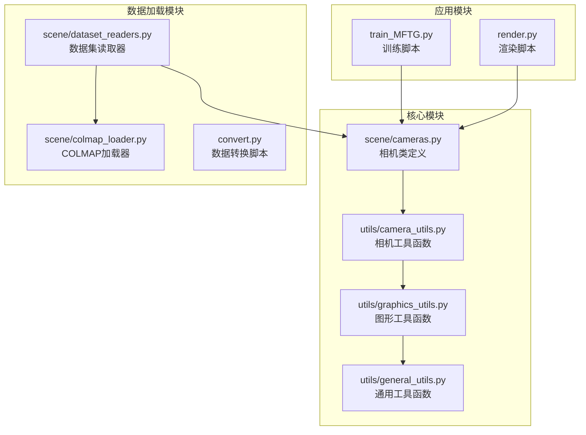
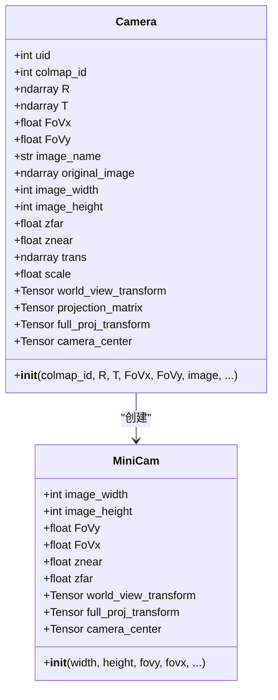
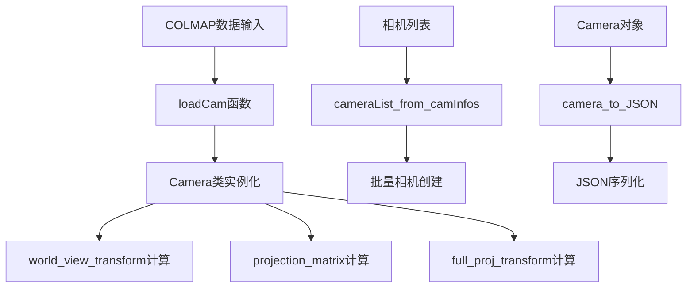
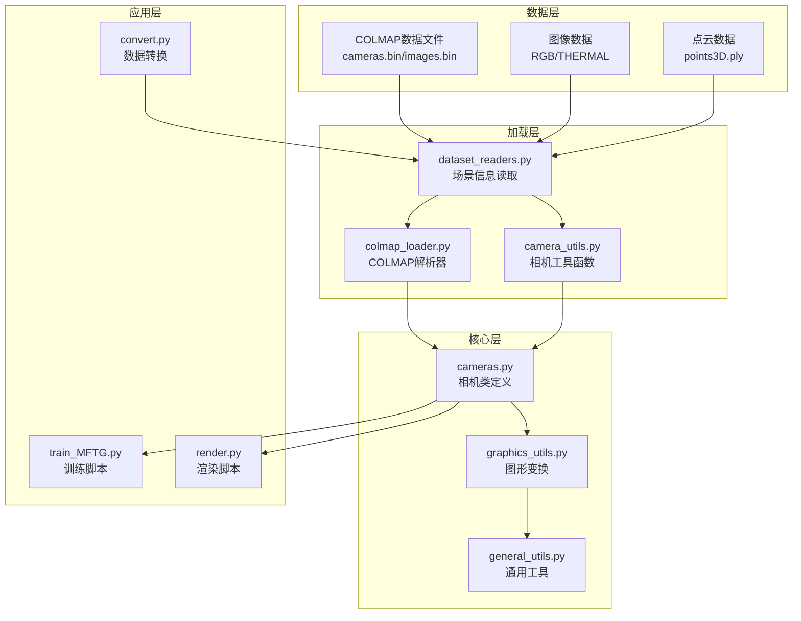
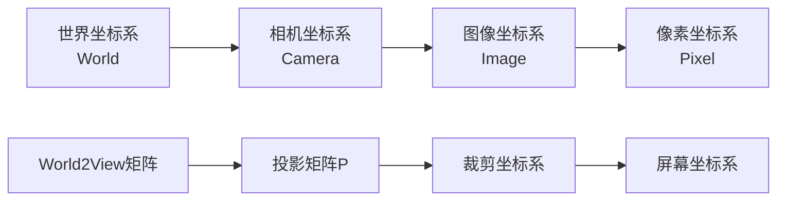
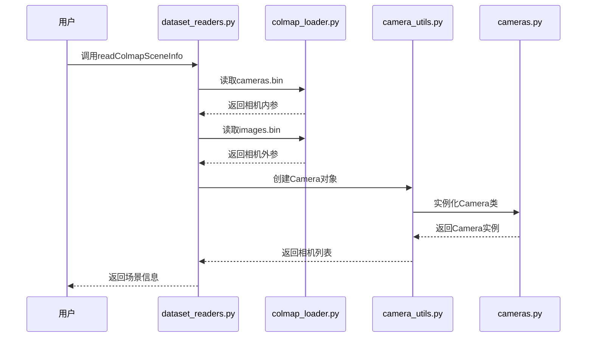
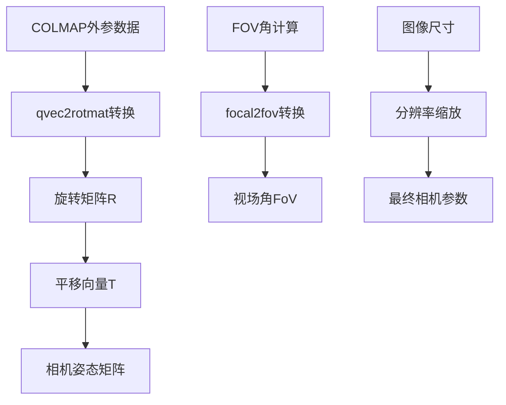
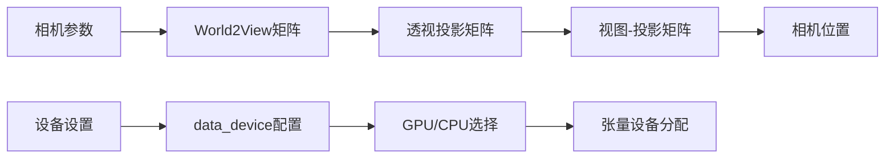
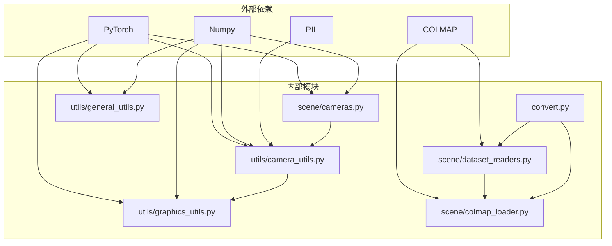

# 相机工具函数

<cite>
**本文档引用的文件**
- [scene/cameras.py](file://scene/cameras.py)
- [utils/camera_utils.py](file://utils/camera_utils.py)
- [utils/graphics_utils.py](file://utils/graphics_utils.py)
- [utils/general_utils.py](file://utils/general_utils.py)
- [scene/dataset_readers.py](file://scene/dataset_readers.py)
- [scene/colmap_loader.py](file://scene/colmap_loader.py)
- [convert.py](file://convert.py)
- [README.md](file://README.md)
- [train_MFTG.py](file://train_MFTG.py)
- [render.py](file://render.py)
</cite>

## 目录
1. [简介](#简介)
2. [项目结构](#项目结构)
3. [核心组件](#核心组件)
4. [架构概览](#架构概览)
5. [详细组件分析](#详细组件分析)
6. [依赖关系分析](#依赖关系分析)
7. [性能考虑](#性能考虑)
8. [故障排除指南](#故障排除指南)
9. [结论](#结论)

## 简介

Thermal-Gaussian项目提供了热成像与彩色图像的三维高斯点阵渲染功能。本文档专注于相机工具函数的详细分析，涵盖相机参数管理、内外参变换、视图矩阵计算等核心功能。该系统基于COLMAP数据集格式，支持多视角重建、相机轨迹优化和视图选择等高级应用。

## 项目结构

该项目采用模块化设计，主要包含以下关键目录和文件：

**图表来源**
- [scene/cameras.py:1-72](file://scene/cameras.py#L1-L72)
- [utils/camera_utils.py:1-83](file://utils/camera_utils.py#L1-L83)
- [utils/graphics_utils.py:1-77](file://utils/graphics_utils.py#L1-L77)

**章节来源**
- [README.md:1-167](file://README.md#L1-L167)

## 核心组件

### 相机类 (Camera)

相机类是整个系统的中心组件，负责管理相机的姿态、内参和投影矩阵。

**图表来源**
- [scene/cameras.py:17-72](file://scene/cameras.py#L17-L72)

### 相机工具函数

相机工具函数提供了从COLMAP数据到内部相机表示的转换能力。

**图表来源**
- [utils/camera_utils.py:19-83](file://utils/camera_utils.py#L19-L83)

**章节来源**
- [scene/cameras.py:17-72](file://scene/cameras.py#L17-L72)
- [utils/camera_utils.py:19-83](file://utils/camera_utils.py#L19-L83)

## 架构概览

系统采用分层架构设计，从底层的COLMAP数据加载到高层的应用接口：

**图表来源**
- [scene/dataset_readers.py:136-181](file://scene/dataset_readers.py#L136-L181)
- [scene/colmap_loader.py:12-41](file://scene/colmap_loader.py#L12-L41)
- [utils/camera_utils.py:12-16](file://utils/camera_utils.py#L12-L16)

## 详细组件分析

### 相机坐标系转换

系统实现了完整的坐标系转换体系，包括世界坐标系、相机坐标系和像素坐标系之间的变换。

#### 坐标系关系

**图表来源**
- [utils/graphics_utils.py:31-77](file://utils/graphics_utils.py#L31-L77)

#### 内外参变换实现

相机类的构造函数展示了完整的变换过程：

1. **世界到相机变换**：通过`getWorld2View2`函数计算
2. **投影矩阵计算**：使用`getProjectionMatrix`函数
3. **完整投影变换**：世界视图变换与投影矩阵的组合

**章节来源**
- [scene/cameras.py:54-57](file://scene/cameras.py#L54-L57)
- [utils/graphics_utils.py:31-77](file://utils/graphics_utils.py#L31-L77)

### COLMAP数据集成

系统支持多种COLMAP数据格式的读取和处理：

**图表来源**
- [scene/dataset_readers.py:136-181](file://scene/dataset_readers.py#L136-L181)
- [scene/colmap_loader.py:180-241](file://scene/colmap_loader.py#L180-L241)
- [utils/camera_utils.py:19-52](file://utils/camera_utils.py#L19-L52)

**章节来源**
- [scene/dataset_readers.py:68-109](file://scene/dataset_readers.py#L68-L109)
- [scene/colmap_loader.py:180-270](file://scene/colmap_loader.py#L180-L270)

### 相机姿态估计

系统提供了相机姿态估计的功能，支持从COLMAP格式的数据中提取相机位姿：

**图表来源**
- [scene/dataset_readers.py:82-96](file://scene/dataset_readers.py#L82-L96)
- [scene/colmap_loader.py:43-66](file://scene/colmap_loader.py#L43-L66)

**章节来源**
- [scene/dataset_readers.py:82-96](file://scene/dataset_readers.py#L82-L96)
- [scene/colmap_loader.py:43-66](file://scene/colmap_loader.py#L43-L66)

### 视图矩阵计算

系统实现了完整的视图矩阵计算流程：

**图表来源**
- [scene/cameras.py:32-57](file://scene/cameras.py#L32-L57)
- [utils/graphics_utils.py:51-71](file://utils/graphics_utils.py#L51-L71)

**章节来源**
- [scene/cameras.py:32-57](file://scene/cameras.py#L32-L57)
- [utils/graphics_utils.py:51-71](file://utils/graphics_utils.py#L51-L71)

## 依赖关系分析

系统各模块之间的依赖关系如下：

**图表来源**
- [scene/cameras.py:12-15](file://scene/cameras.py#L12-L15)
- [utils/camera_utils.py:12-15](file://utils/camera_utils.py#L12-L15)
- [utils/graphics_utils.py:12-15](file://utils/graphics_utils.py#L12-L15)

**章节来源**
- [scene/cameras.py:12-15](file://scene/cameras.py#L12-L15)
- [utils/camera_utils.py:12-15](file://utils/camera_utils.py#L12-L15)
- [utils/graphics_utils.py:12-15](file://utils/graphics_utils.py#L12-L15)

## 性能考虑

### 内存优化策略

1. **设备选择优化**：自动检测CUDA可用性，优先使用GPU加速
2. **张量设备分配**：确保所有张量在正确的设备上分配
3. **批量处理**：支持批量相机创建和处理

### 计算效率优化

1. **矩阵运算优化**：使用向量化操作减少循环开销
2. **内存复用**：重用中间计算结果避免重复分配
3. **条件分支优化**：根据输入类型选择最优处理路径

## 故障排除指南

### 常见问题及解决方案

#### 设备配置问题
- **问题**：自定义设备设置失败
- **解决方案**：系统会自动回退到默认CUDA设备

#### 分辨率处理问题
- **问题**：大尺寸图像处理缓慢
- **解决方案**：系统会自动检测并警告大尺寸输入

#### 数据格式兼容性
- **问题**：COLMAP数据格式不兼容
- **解决方案**：系统仅支持PINHOLE和SIMPLE_PINHOLE模型

**章节来源**
- [scene/cameras.py:32-37](file://scene/cameras.py#L32-L37)
- [utils/camera_utils.py:22-36](file://utils/camera_utils.py#L22-L36)
- [scene/dataset_readers.py:95-96](file://scene/dataset_readers.py#L95-L96)

## 结论

Thermal-Gaussian项目的相机工具函数提供了完整的三维视觉处理能力，包括：

1. **完整的坐标系转换**：支持世界坐标系、相机坐标系和像素坐标系之间的精确转换
2. **COLMAP数据集成**：无缝支持COLMAP标准数据格式
3. **高效的GPU加速**：充分利用CUDA进行大规模矩阵运算
4. **灵活的参数管理**：支持动态调整相机参数和设备配置

这些功能为多视角重建、相机轨迹优化和视图选择等高级应用奠定了坚实基础，特别适用于热成像与彩色图像的联合处理任务。