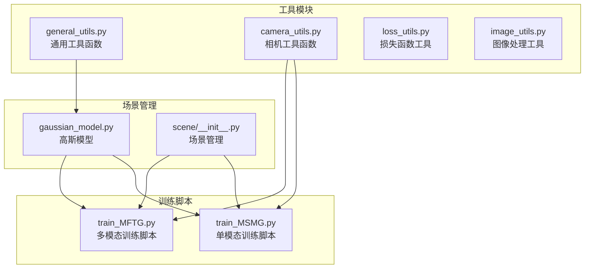
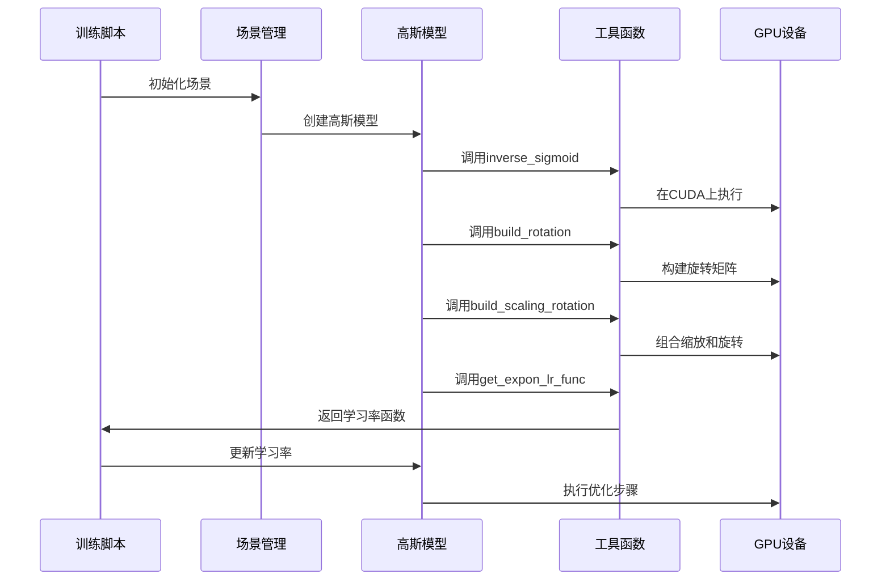
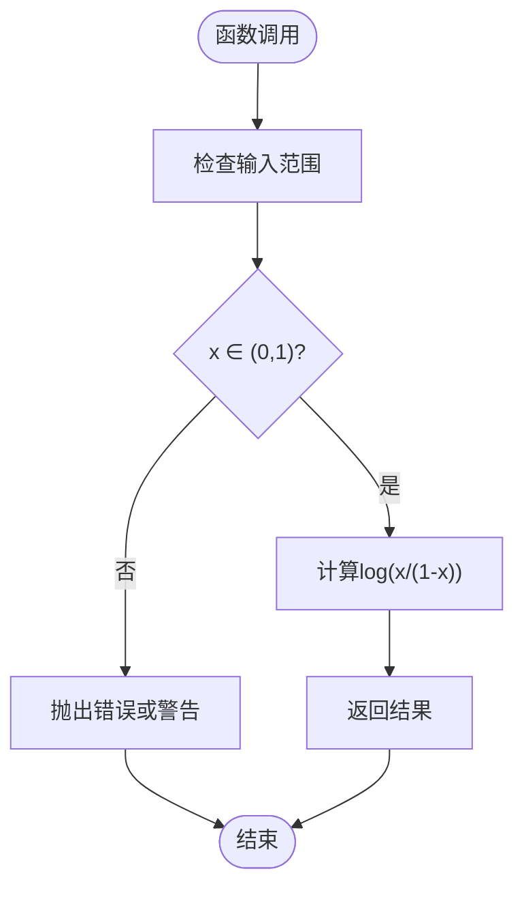
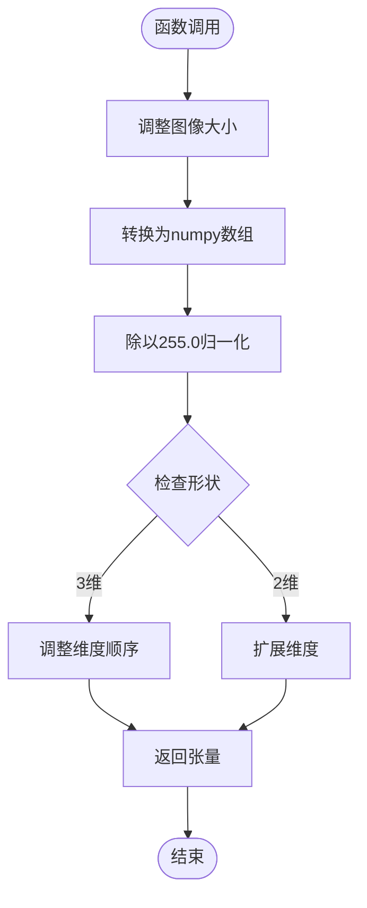
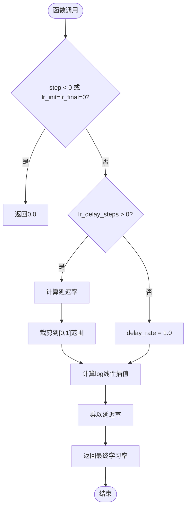
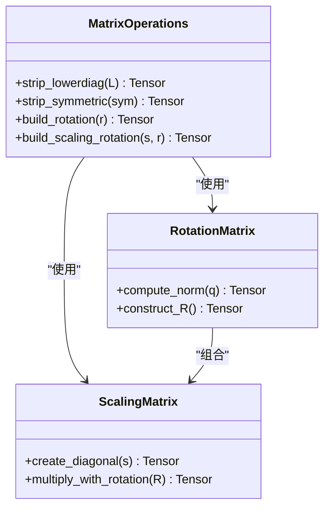
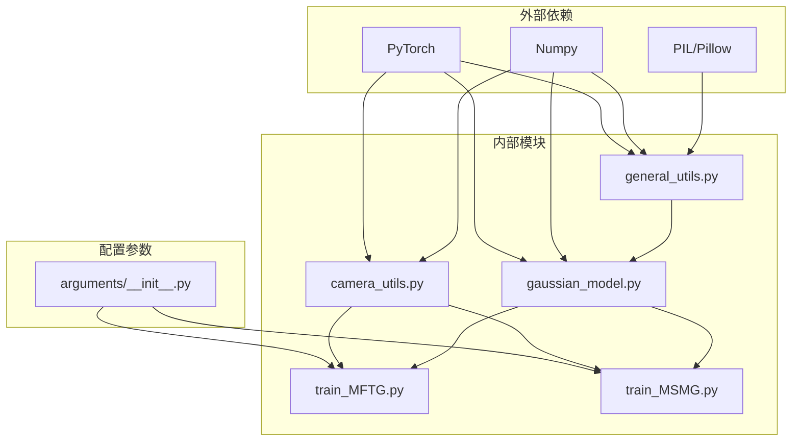
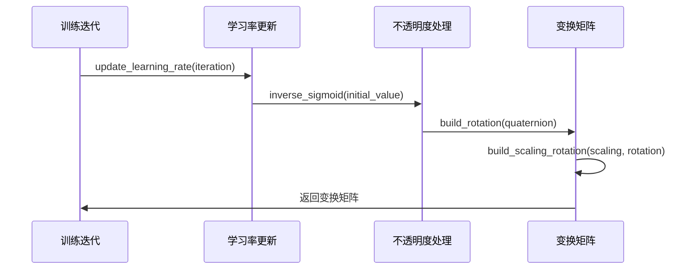

# 通用工具函数

<cite>
**本文档引用的文件**
- [general_utils.py](file://utils/general_utils.py)
- [camera_utils.py](file://utils/camera_utils.py)
- [gaussian_model.py](file://scene/gaussian_model.py)
- [train_MFTG.py](file://train_MFTG.py)
- [train_MSMG.py](file://train_MSMG.py)
- [arguments/__init__.py](file://arguments/__init__.py)
</cite>

## 目录
1. [简介](#简介)
2. [项目结构](#项目结构)
3. [核心组件](#核心组件)
4. [架构概览](#架构概览)
5. [详细组件分析](#详细组件分析)
6. [依赖关系分析](#依赖关系分析)
7. [性能考虑](#性能考虑)
8. [故障排除指南](#故障排除指南)
9. [结论](#结论)

## 简介

本文档详细介绍了Thermal-Gaussian项目中的通用工具函数，这些函数在训练过程中发挥着关键作用。文档涵盖了以下核心函数：

- 数学变换函数：`inverse_sigmoid`
- 图像处理函数：`PILtoTorch`
- 学习率调度函数：`get_expon_lr_func`
- 矩阵操作函数：`strip_lowerdiag`、`strip_symmetric`
- 旋转缩放矩阵构建函数：`build_rotation`、`build_scaling_rotation`

这些函数共同支撑了热成像高斯点云渲染系统的训练和推理过程。

## 项目结构

Thermal-Gaussian项目采用模块化设计，工具函数主要位于`utils`目录下，与训练脚本和场景管理模块协同工作：



**图表来源**
- [general_utils.py:1-134](file://utils/general_utils.py#L1-L134)
- [camera_utils.py:1-83](file://utils/camera_utils.py#L1-L83)
- [gaussian_model.py:1-200](file://scene/gaussian_model.py#L1-L200)

**章节来源**
- [general_utils.py:1-134](file://utils/general_utils.py#L1-L134)
- [camera_utils.py:1-83](file://utils/camera_utils.py#L1-L83)
- [gaussian_model.py:1-200](file://scene/gaussian_model.py#L1-L200)

## 核心组件

### 数学变换函数

#### inverse_sigmoid函数
- **功能**：计算反sigmoid函数，用于将概率值转换为实数域
- **输入参数**：`x` - 概率值（0,1范围）
- **返回值**：`torch.Tensor` - 反sigmoid变换结果
- **使用场景**：初始化不透明度参数，将约束在(0,1)范围内的参数映射到(-∞,+∞)

#### get_expon_lr_func函数
- **功能**：生成指数型学习率衰减函数
- **输入参数**：
  - `lr_init` - 初始学习率
  - `lr_final` - 最终学习率
  - `lr_delay_steps` - 延迟步数
  - `lr_delay_mult` - 延迟倍数
  - `max_steps` - 最大步数
- **返回值**：`function` - 接受步数参数的学习率函数
- **使用场景**：训练过程中的动态学习率调整

### 图像处理函数

#### PILtoTorch函数
- **功能**：将PIL图像转换为PyTorch张量格式
- **输入参数**：
  - `pil_image` - PIL图像对象
  - `resolution` - 输出分辨率元组
- **返回值**：`torch.Tensor` - 形状为(C,H,W)的归一化张量
- **使用场景**：图像预处理和数据加载

### 矩阵操作函数

#### strip_lowerdiag函数
- **功能**：提取对称矩阵的下三角元素
- **输入参数**：`L` - 3×3对称矩阵张量
- **返回值**：`torch.Tensor` - 长度为6的向量
- **使用场景**：协方差矩阵压缩存储

#### strip_symmetric函数
- **功能**：提取对称矩阵元素（调用strip_lowerdiag）
- **输入参数**：`sym` - 对称矩阵
- **返回值**：`torch.Tensor` - 压缩后的向量

### 旋转缩放矩阵构建函数

#### build_rotation函数
- **功能**：从四元数构建旋转矩阵
- **输入参数**：`r` - 四元数张量（形状N×4）
- **返回值**：`torch.Tensor` - 旋转矩阵（形状N×3×3）
- **使用场景**：高斯点云的旋转变换

#### build_scaling_rotation函数
- **功能**：构建缩放-旋转组合矩阵
- **输入参数**：
  - `s` - 缩放因子张量（形状N×3）
  - `r` - 四元数旋转（形状N×4）
- **返回值**：`torch.Tensor` - 组合变换矩阵
- **使用场景**：高斯点云的复合变换

**章节来源**
- [general_utils.py:18-110](file://utils/general_utils.py#L18-L110)

## 架构概览



**图表来源**
- [gaussian_model.py:149-176](file://scene/gaussian_model.py#L149-L176)
- [general_utils.py:29-62](file://utils/general_utils.py#L29-L62)

## 详细组件分析

### 数学变换函数分析

#### inverse_sigmoid实现细节


**图表来源**
- [general_utils.py:18-19](file://utils/general_utils.py#L18-L19)

**使用场景**：
- 初始化不透明度参数：`opacities = inverse_sigmoid(0.1 * torch.ones(...))`
- 参数域变换：将受限参数映射到实数空间

**性能特点**：
- 时间复杂度：O(n)，其中n为元素数量
- 内存效率：直接在GPU上操作，避免CPU-GPU传输
- 数值稳定性：需要确保输入在(0,1)范围内

**章节来源**
- [general_utils.py:18-19](file://utils/general_utils.py#L18-L19)
- [gaussian_model.py:139](file://scene/gaussian_model.py#L139)

### 图像处理函数分析

#### PILtoTorch实现细节


**图表来源**
- [general_utils.py:21-27](file://utils/general_utils.py#L21-L27)

**使用场景**：
- 数据预处理：`resized_image_rgb = PILtoTorch(image, resolution)`
- 批量图像处理：支持不同分辨率的图像统一格式

**性能特点**：
- 内存优化：直接在GPU上进行张量操作
- 类型转换：自动处理PIL到Tensor的数据类型转换
- 维度标准化：统一输出格式(C,H,W)

**章节来源**
- [general_utils.py:21-27](file://utils/general_utils.py#L21-L27)
- [camera_utils.py:41](file://utils/camera_utils.py#L41)

### 学习率调度函数分析

#### get_expon_lr_func实现细节


**图表来源**
- [general_utils.py:47-60](file://utils/general_utils.py#L47-L60)

**使用场景**：
- 动态学习率调整：`lr = self.xyz_scheduler_args(iteration)`
- 训练过程优化：指数衰减策略

**性能特点**：
- 计算效率：纯Python实现，无额外依赖
- 平滑过渡：log-linear插值确保学习率平滑变化
- 延迟机制：可选的初始学习率延迟

**章节来源**
- [general_utils.py:29-62](file://utils/general_utils.py#L29-L62)
- [gaussian_model.py:164-175](file://scene/gaussian_model.py#L164-L175)

### 矩阵操作函数分析

#### 矩阵构建函数实现


**图表来源**
- [general_utils.py:64-110](file://utils/general_utils.py#L64-L110)

**使用场景**：
- 协方差矩阵构建：`covariance = build_scaling_rotation(scaling, rotation)`
- 几何变换：3D点云的旋转和平移

**性能特点**：
- GPU优化：所有计算在CUDA设备上执行
- 向量化操作：支持批量处理多个变换
- 内存局部性：连续内存访问模式

**章节来源**
- [general_utils.py:64-110](file://utils/general_utils.py#L64-L110)
- [gaussian_model.py:27-31](file://scene/gaussian_model.py#L27-L31)

## 依赖关系分析



**图表来源**
- [general_utils.py:12-16](file://utils/general_utils.py#L12-L16)
- [camera_utils.py:12-15](file://utils/camera_utils.py#L12-L15)
- [gaussian_model.py:12-22](file://scene/gaussian_model.py#L12-L22)

**章节来源**
- [general_utils.py:12-16](file://utils/general_utils.py#L12-L16)
- [camera_utils.py:12-15](file://utils/camera_utils.py#L12-L15)
- [gaussian_model.py:12-22](file://scene/gaussian_model.py#L12-L22)

## 性能考虑

### GPU内存优化技巧

1. **设备选择优化**
   - 所有张量操作默认在CUDA设备上执行
   - 避免不必要的CPU-GPU数据传输

2. **内存管理**
   ```python
   # 训练过程中的内存清理
   torch.cuda.empty_cache()
   ```

3. **批处理优化**
   - 支持批量矩阵运算
   - 向量化操作减少循环开销

### 数值稳定性处理

1. **输入验证**
   - `inverse_sigmoid`：确保输入在(0,1)范围内
   - `build_rotation`：对四元数进行归一化

2. **精度控制**
   - 使用适当的浮点精度
   - 避免数值溢出和下溢

### 训练过程中的应用示例

在训练脚本中，这些函数的具体应用：



**图表来源**
- [train_MFTG.py:86](file://train_MFTG.py#L86)
- [train_MSMG.py:83](file://train_MSMG.py#L83)
- [gaussian_model.py:139](file://scene/gaussian_model.py#L139)

**章节来源**
- [train_MFTG.py:86-158](file://train_MFTG.py#L86-L158)
- [train_MSMG.py:83-173](file://train_MSMG.py#L83-L173)
- [gaussian_model.py:139](file://scene/gaussian_model.py#L139)

## 故障排除指南

### 常见问题及解决方案

1. **CUDA内存不足**
   - 使用`torch.cuda.empty_cache()`定期清理内存
   - 检查batch size设置是否过大

2. **数值不稳定**
   - 确保`inverse_sigmoid`输入值在有效范围内
   - 检查四元数归一化是否正确

3. **学习率异常**
   - 验证`get_expon_lr_func`参数设置
   - 检查训练步数配置

### 调试技巧

1. **参数验证**
   ```python
   # 检查张量形状和设备
   print(f"Tensor shape: {tensor.shape}")
   print(f"Device: {tensor.device}")
   ```

2. **性能监控**
   - 使用CUDA事件测量执行时间
   - 监控GPU内存使用情况

**章节来源**
- [train_MFTG.py:195](file://train_MFTG.py#L195)
- [train_MSMG.py:213](file://train_MSMG.py#L213)

## 结论

Thermal-Gaussian项目的通用工具函数展现了良好的工程实践：

1. **模块化设计**：函数职责明确，便于测试和维护
2. **性能优化**：充分利用GPU计算能力和内存管理
3. **数值稳定性**：通过适当的输入验证和归一化处理
4. **可扩展性**：支持批量处理和向量化操作

这些工具函数为热成像高斯点云渲染系统提供了坚实的基础，确保了训练过程的稳定性和效率。通过合理使用这些函数，开发者可以构建高性能的3D重建和渲染应用。