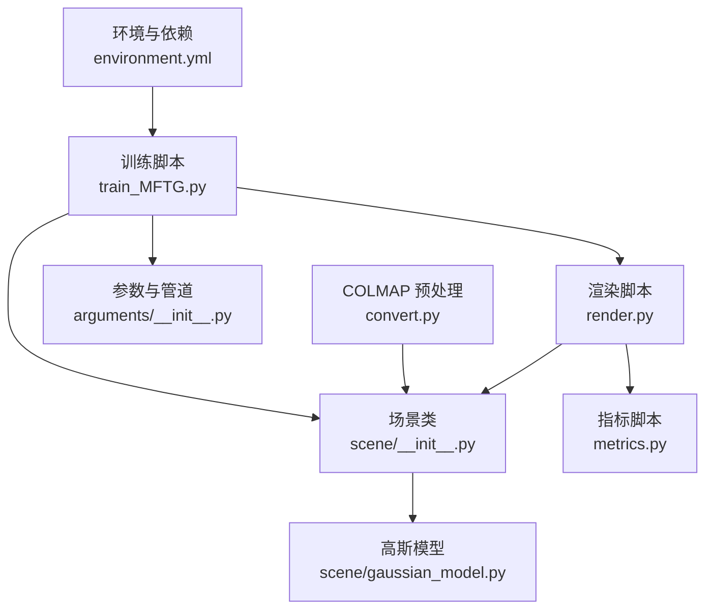
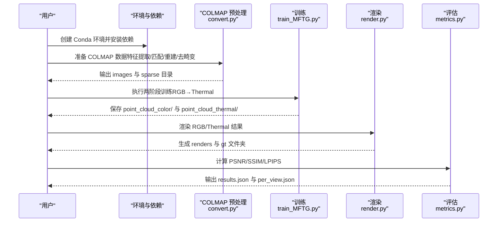
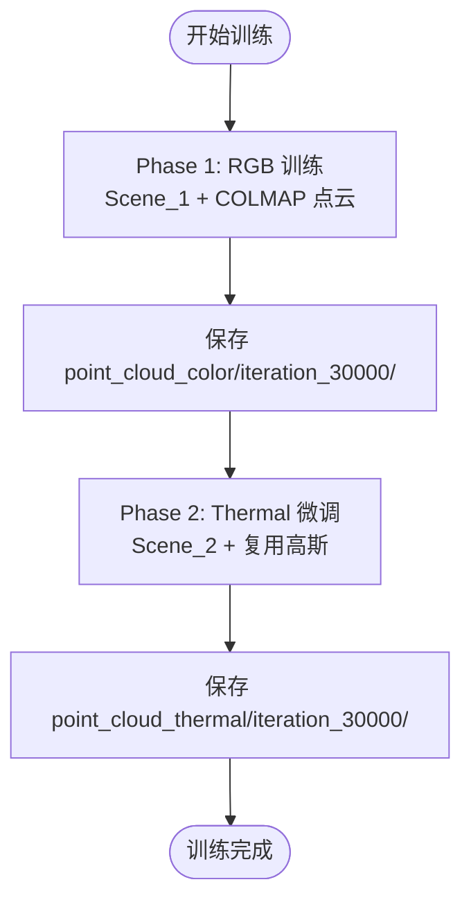
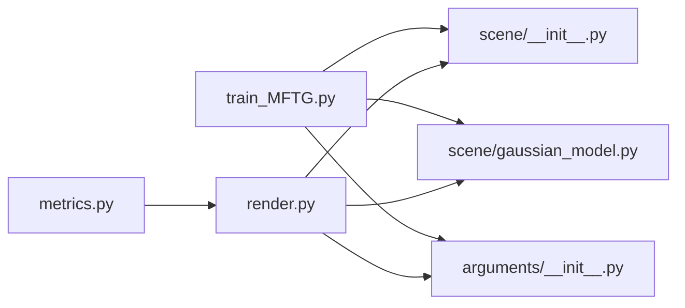

# 快速开始

<cite>
**本文引用的文件列表**

- [README.md](file://README.md)
- [MFTG-Technical-Doc.md](file://MFTG-Technical-Doc.md)
- [environment.yml](file://environment.yml)
- [train_MFTG.py](file://train_MFTG.py)
- [convert.py](file://convert.py)
- [render.py](file://render.py)
- [metrics.py](file://metrics.py)
- [arguments/__init__.py](file://arguments/__init__.py)
- [scene/__init__.py](file://scene/__init__.py)
- [scene/gaussian_model.py](file://scene/gaussian_model.py)
- [utils/image_utils.py](file://utils/image_utils.py)
</cite>

## 目录
1. [简介](#简介)
2. [项目结构](#项目结构)
3. [核心组件](#核心组件)
4. [架构总览](#架构总览)
5. [详细组件解析](#详细组件解析)
6. [依赖关系分析](#依赖关系分析)
7. [性能与资源建议](#性能与资源建议)
8. [常见问题与故障排除](#常见问题与故障排除)
9. [结论](#结论)
10. [附录：完整工作流命令清单](#附录完整工作流命令清单)

## 简介
本指南面向首次接触 Thermal-Gaussian 的用户，帮助你在最短时间内完成环境搭建、数据准备、训练、渲染与评估全流程。项目基于 3D 高斯点云的多模态重建方法，支持 RGB 与热红外（Thermal）双模态联合训练与渲染。你将学会：
- 使用 Conda 创建隔离环境并安装依赖
- 准备 RGBT-Scenes 数据集或自建场景
- 使用 COLMAP 进行稀疏重建与图像去畸变
- 执行两阶段训练（RGB→Thermal 微调）
- 生成渲染结果并进行定量评估

## 项目结构
仓库采用“功能模块化 + 子模块编译”的组织方式：
- 核心脚本：训练、渲染、评估、转换
- 场景与高斯模型：数据加载、相机管理、3D 高斯表示
- 工具与指标：图像处理、损失函数、指标计算
- 子模块：CUDA 光栅化与 KNN 加速（需编译）

图表来源
- [environment.yml:1-17](file://environment.yml#L1-L17)
- [train_MFTG.py:12-273](file://train_MFTG.py#L12-L273)
- [scene/__init__.py:21-168](file://scene/__init__.py#L21-L168)
- [scene/gaussian_model.py:24-407](file://scene/gaussian_model.py#L24-L407)
- [arguments/__init__.py:47-113](file://arguments/__init__.py#L47-L113)
- [render.py:12-76](file://render.py#L12-L76)
- [metrics.py:12-148](file://metrics.py#L12-L148)
- [convert.py:12-125](file://convert.py#L12-L125)

章节来源
- [README.md:18-120](file://README.md#L18-L120)
- [MFTG-Technical-Doc.md:308-450](file://MFTG-Technical-Doc.md#L308-L450)

## 核心组件
- 训练入口：train_MFTG.py 实现两阶段训练（RGB→Thermal），自动保存中间检查点与最终模型
- 场景加载：Scene_1/Scene_2 分别加载 RGB 与 Thermal 数据，统一使用 COLMAP 位姿
- 高斯模型：GaussianModel 表达 3D 高斯点云，支持自适应致密化与剪枝
- 渲染与评估：render.py 生成渲染图与 GT，metrics.py 计算 PSNR/SSIM/LPIPS

章节来源
- [train_MFTG.py:35-273](file://train_MFTG.py#L35-L273)
- [scene/__init__.py:21-168](file://scene/__init__.py#L21-L168)
- [scene/gaussian_model.py:24-407](file://scene/gaussian_model.py#L24-L407)
- [render.py:25-76](file://render.py#L25-L76)
- [metrics.py:36-148](file://metrics.py#L36-L148)

## 架构总览
下图展示了从数据准备到训练、渲染与评估的端到端流程。

图表来源
- [environment.yml:1-17](file://environment.yml#L1-L17)
- [convert.py:31-125](file://convert.py#L31-L125)
- [train_MFTG.py:260-273](file://train_MFTG.py#L260-L273)
- [render.py:42-76](file://render.py#L42-L76)
- [metrics.py:36-148](file://metrics.py#L36-L148)

## 详细组件解析

### 环境与依赖配置
- 使用 Conda 创建隔离环境，安装 Python、PyTorch、CUDA 工具链与常用包
- 子模块 diff-gaussian-rasterization 与 simple-knn 需要本地编译安装
- Windows 用户需设置特定环境变量以兼容构建

章节来源
- [README.md:20-27](file://README.md#L20-L27)
- [MFTG-Technical-Doc.md:310-336](file://MFTG-Technical-Doc.md#L310-L336)
- [environment.yml:1-17](file://environment.yml#L1-L17)

### 数据准备与 COLMAP 预处理
- 官方数据集：从 Google Drive 下载 RGBT-Scenes，解压后满足指定目录结构
- 自建场景：将 RGB 图像放入 input/，热红外图像按同名配对放入 thermal/
- 使用 convert.py 自动执行 COLMAP 特征提取、匹配、SfM 重建与图像去畸变，生成 images 与 sparse 目录
- 将去畸变后的图像分别放入 rgb/train、rgb/test、thermal/train、thermal/test，保留 sparse/0/

章节来源
- [README.md:28-60](file://README.md#L28-L60)
- [README.md:122-152](file://README.md#L122-L152)
- [MFTG-Technical-Doc.md:338-363](file://MFTG-Technical-Doc.md#L338-L363)
- [convert.py:18-125](file://convert.py#L18-L125)

### 训练流程（两阶段：RGB→Thermal）
- 第一阶段（step=1）：使用 Scene_1 加载 COLMAP 位姿与 RGB 图像，初始化高斯并训练
- 第二阶段（step=2）：复用第一阶段高斯，使用 Scene_2 加载 Thermal 图像，**仅微调颜色系数**
- 损失函数：L1 + SSIM 权重组合；第二阶段额外加入热红外平滑损失
- 自适应致密化与剪枝：在指定迭代范围内动态增删高斯点

图表来源
- [train_MFTG.py:39-48](file://train_MFTG.py#L39-L48)
- [train_MFTG.py:106-114](file://train_MFTG.py#L106-L114)
- [MFTG-Technical-Doc.md:113-153](file://MFTG-Technical-Doc.md#L113-L153)

章节来源
- [train_MFTG.py:35-273](file://train_MFTG.py#L35-L273)
- [MFTG-Technical-Doc.md:308-450](file://MFTG-Technical-Doc.md#L308-L450)

### 渲染与评估
- 渲染：分别加载 RGB 与 Thermal 高斯，对训练/测试集生成 renders 与 gt
- 评估：计算 PSNR、SSIM、LPIPS，输出 results.json 与 per_view.json

章节来源
- [render.py:25-76](file://render.py#L25-L76)
- [metrics.py:36-148](file://metrics.py#L36-L148)

### 参数与管道配置
- ModelParams：球谐阶数、输入/输出路径、分辨率、背景等
- OptimizationParams：迭代次数、学习率、密度控制、SSIM 权重等
- PipelineParams：是否启用 Python 实现的 SH/协方差计算、调试开关

章节来源
- [arguments/__init__.py:47-113](file://arguments/__init__.py#L47-L113)

## 依赖关系分析
- 训练脚本依赖场景类与高斯模型，参数由参数组解析
- 渲染脚本依赖场景类与高斯模型，按迭代号加载对应检查点
- 评估脚本读取渲染与 GT 图像，计算指标并持久化

图表来源
- [train_MFTG.py:12-273](file://train_MFTG.py#L12-L273)
- [scene/__init__.py:21-168](file://scene/__init__.py#L21-L168)
- [scene/gaussian_model.py:24-407](file://scene/gaussian_model.py#L24-L407)
- [arguments/__init__.py:47-113](file://arguments/__init__.py#L47-L113)
- [render.py:12-76](file://render.py#L12-L76)
- [metrics.py:12-148](file://metrics.py#L12-L148)

章节来源
- [train_MFTG.py:12-273](file://train_MFTG.py#L12-L273)
- [scene/__init__.py:21-168](file://scene/__init__.py#L21-L168)
- [scene/gaussian_model.py:24-407](file://scene/gaussian_model.py#L24-L407)
- [render.py:12-76](file://render.py#L12-L76)
- [metrics.py:12-148](file://metrics.py#L12-L148)

## 性能与资源建议
- 硬件：建议 NVIDIA 显卡，CUDA 11.6 兼容，≥8GB 显存
- 分辨率：默认自动调整至 1-1.6K 像素范围；可通过参数强制更高分辨率
- 显存紧张时：降低分辨率、减少 SH 阶数、减小训练图像数量

章节来源
- [MFTG-Technical-Doc.md:312-314](file://MFTG-Technical-Doc.md#L312-L314)
- [README.md:119](file://README.md#L119)
- [MFTG-Technical-Doc.md:612-618](file://MFTG-Technical-Doc.md#L612-L618)

## 常见问题与故障排除
- 问：显存不足如何处理？
  - 答：降低分辨率（-r 2/-r 4）、减少 SH 阶数（--sh_degree 1）、使用更小图像
- 问：Phase 2 会破坏 RGB 渲染质量吗？
  - 答：会。两阶段共享同一套 SH 系数，Phase 2 微调会偏向 Thermal，RGB 质量下降
- 问：如何从 checkpoint 恢复训练？
  - 答：可传入 --start_checkpoint，但两个阶段会从同一 checkpoint 开始，建议完整训练
- 问：render.py 如何分别渲染 RGB 与 Thermal？
  - 答：分别加载 RGB/Thermal 高斯，使用标准渲染函数输出对应模态

章节来源
- [MFTG-Technical-Doc.md:579-618](file://MFTG-Technical-Doc.md#L579-L618)

## 结论
通过本指南，你可以快速完成 Thermal-Gaussian 的环境搭建与数据准备，使用两阶段训练获得高质量的 RGB 与 Thermal 渲染结果，并进行定量评估。若需同时高质量渲染 RGB 与 Thermal，可考虑 OMMG 分支（双通道 SH）。

## 附录：完整工作流命令清单
以下为从环境到评估的完整命令序列（请根据实际路径替换）：

- 环境准备
  - 创建并激活 Conda 环境
  - 安装子模块并编译 CUDA 扩展
  - 参考：[README.md:20-27](file://README.md#L20-L27)、[MFTG-Technical-Doc.md:310-336](file://MFTG-Technical-Doc.md#L310-L336)

- 数据准备（官方数据集）
  - 下载 RGBT-Scenes 并解压，确保目录结构符合要求
  - 参考：[README.md:28-60](file://README.md#L28-L60)

- 数据准备（自建场景）
  - 将 RGB 放入 input/，热红外按同名配对放入 thermal/
  - 运行 COLMAP 预处理脚本
  - 将去畸变后的图像放入 rgb/train、rgb/test、thermal/train、thermal/test
  - 参考：[README.md:122-152](file://README.md#L122-L152)、[convert.py:31-125](file://convert.py#L31-L125)

- 训练（MFTG 两阶段）
  - 执行训练脚本，自动完成 Phase 1 与 Phase 2
  - 参考：[README.md:71-89](file://README.md#L71-L89)、[train_MFTG.py:260-273](file://train_MFTG.py#L260-L273)

- 渲染
  - 生成 RGB 与 Thermal 的 renders 与 gt
  - 参考：[README.md:71-89](file://README.md#L71-L89)、[render.py:42-76](file://render.py#L42-L76)

- 评估
  - 计算 PSNR/SSIM/LPIPS 并输出结果文件
  - 参考：[README.md:71-89](file://README.md#L71-L89)、[metrics.py:36-148](file://metrics.py#L36-L148)