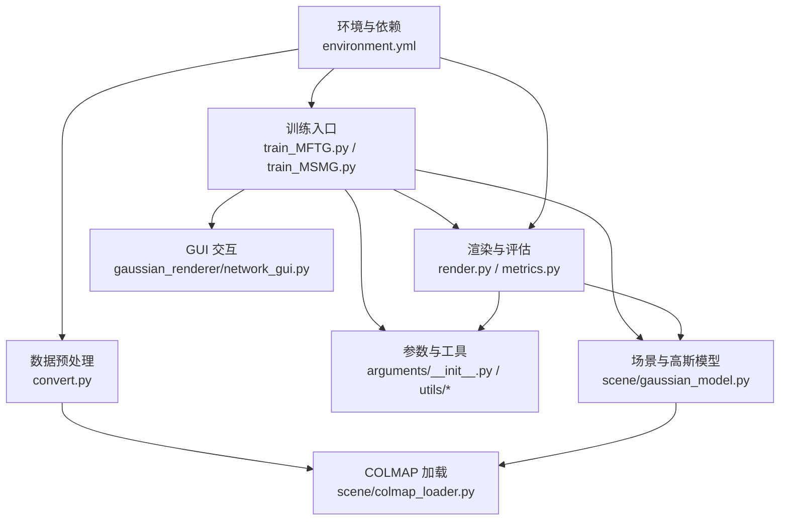
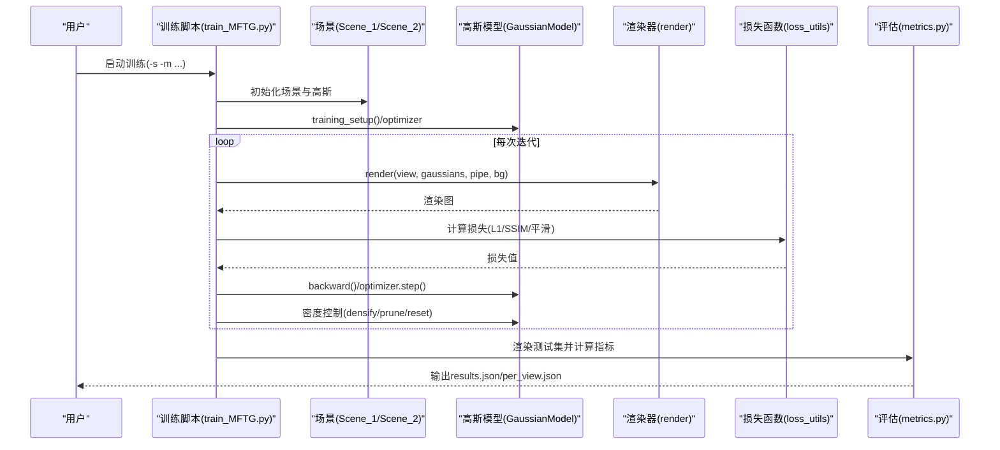
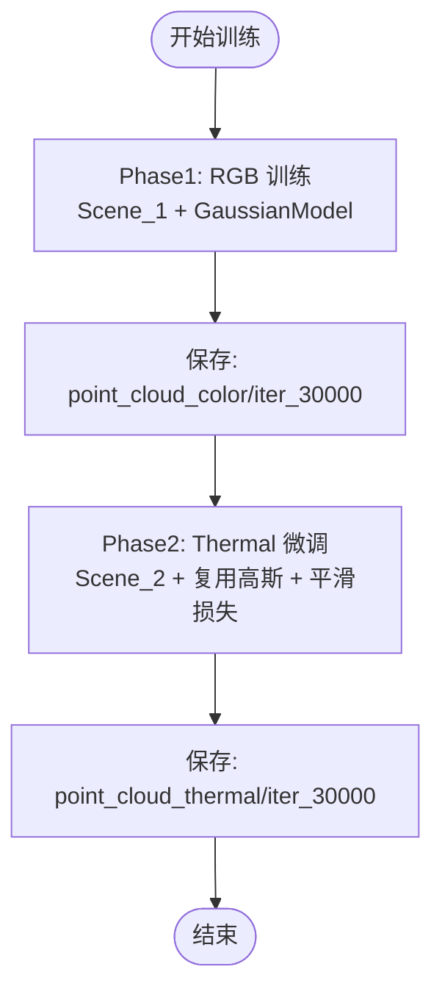
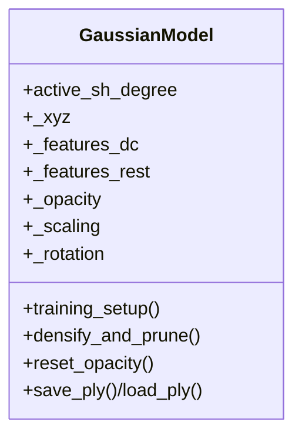
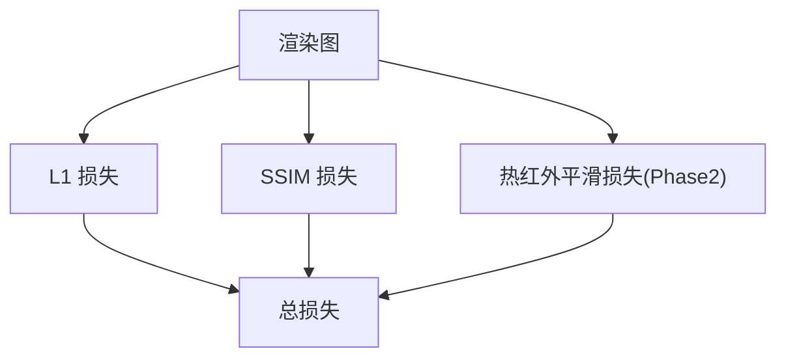
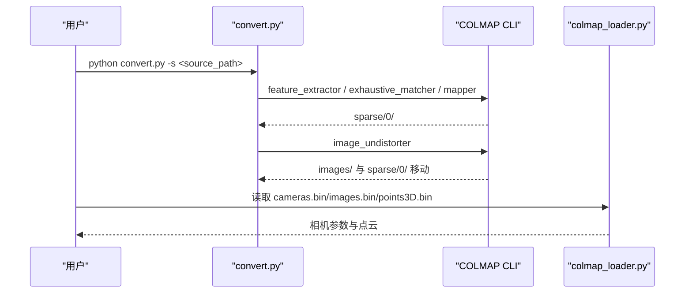
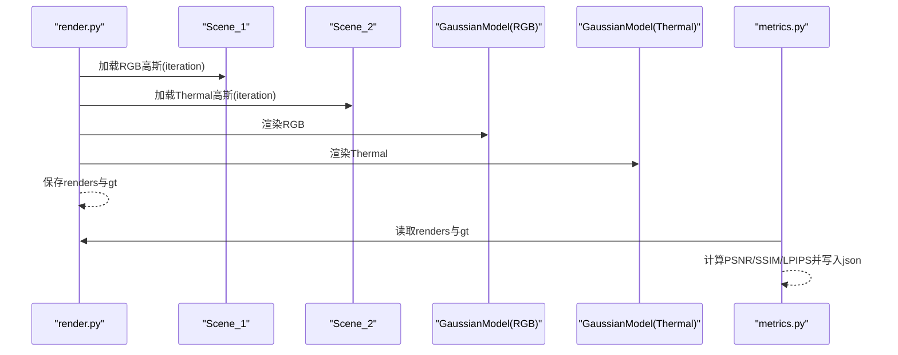
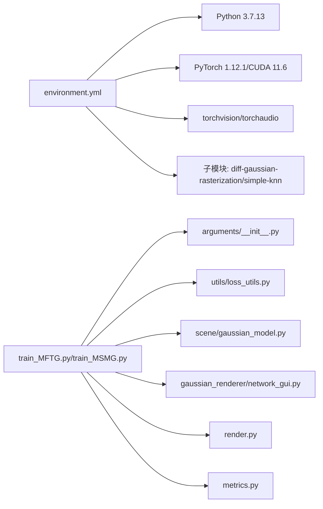

# 故障排除指南

<cite>
**本文引用的文件**
- [README.md](file://README.md)
- [MFTG-Technical-Doc.md](file://MFTG-Technical-Doc.md)
- [environment.yml](file://environment.yml)
- [train_MFTG.py](file://train_MFTG.py)
- [train_MSMG.py](file://train_MSMG.py)
- [arguments/__init__.py](file://arguments/__init__.py)
- [gaussian_renderer/network_gui.py](file://gaussian_renderer/network_gui.py)
- [utils/general_utils.py](file://utils/general_utils.py)
- [utils/loss_utils.py](file://utils/loss_utils.py)
- [scene/gaussian_model.py](file://scene/gaussian_model.py)
- [scene/colmap_loader.py](file://scene/colmap_loader.py)
- [render.py](file://render.py)
- [metrics.py](file://metrics.py)
- [convert.py](file://convert.py)
</cite>

## 目录
1. [简介](#简介)
2. [项目结构](#项目结构)
3. [核心组件](#核心组件)
4. [架构总览](#架构总览)
5. [详细组件分析](#详细组件分析)
6. [依赖关系分析](#依赖关系分析)
7. [性能考虑](#性能考虑)
8. [故障排除指南](#故障排除指南)
9. [结论](#结论)
10. [附录](#附录)

## 简介
本指南面向 Thermal-Gaussian 项目使用者，聚焦于常见问题的诊断与修复，涵盖环境配置、CUDA 编译、显存不足、训练不收敛、数据准备与COLMAP流程、日志与调试工具使用、性能定位与优化建议，并提供系统兼容性检查清单与社区支持资源，帮助快速定位并解决问题。

## 项目结构
项目采用“功能分层 + 子模块”的组织方式：
- 训练入口：train_MFTG.py、train_MSMG.py
- 场景与高斯模型：scene/gaussian_model.py、scene/colmap_loader.py
- 渲染与评估：render.py、metrics.py
- 数据预处理：convert.py
- 参数与通用工具：arguments/__init__.py、utils/general_utils.py、utils/loss_utils.py
- GUI 交互：gaussian_renderer/network_gui.py
- 环境与依赖：environment.yml
- 技术文档：MFTG-Technical-Doc.md

图表来源
- [train_MFTG.py:1-273](file://train_MFTG.py#L1-L273)
- [train_MSMG.py:1-314](file://train_MSMG.py#L1-L314)
- [scene/gaussian_model.py:1-407](file://scene/gaussian_model.py#L1-L407)
- [render.py:1-76](file://render.py#L1-L76)
- [metrics.py:1-148](file://metrics.py#L1-L148)
- [arguments/__init__.py:1-113](file://arguments/__init__.py#L1-L113)
- [gaussian_renderer/network_gui.py:1-86](file://gaussian_renderer/network_gui.py#L1-L86)
- [convert.py:1-125](file://convert.py#L1-L125)
- [scene/colmap_loader.py:1-295](file://scene/colmap_loader.py#L1-L295)
- [environment.yml:1-17](file://environment.yml#L1-L17)

章节来源
- [README.md:18-117](file://README.md#L18-L117)
- [MFTG-Technical-Doc.md:308-450](file://MFTG-Technical-Doc.md#L308-L450)

## 核心组件
- 训练脚本：负责两阶段（MFTG）或多分支（MSMG）训练流程、损失计算、密度控制、检查点与日志记录。
- 场景与高斯模型：封装高斯点云的初始化、优化器、密度增长/剪枝、保存/加载。
- 渲染与评估：分别渲染 RGB/Thermal 图像并计算指标（PSNR/SSIM/LPIPS）。
- 数据预处理：基于 COLMAP 的特征提取、匹配、稀疏重建与去畸变，生成后续训练所需的 sparse/ 与 images/。
- 参数与工具：统一参数解析、学习率调度、损失函数（含热红外平滑损失）、安全状态设置。
- GUI 交互：网络 GUI 支持远程可视化与交互式训练。

章节来源
- [train_MFTG.py:35-273](file://train_MFTG.py#L35-L273)
- [train_MSMG.py:33-314](file://train_MSMG.py#L33-L314)
- [scene/gaussian_model.py:44-407](file://scene/gaussian_model.py#L44-L407)
- [render.py:25-76](file://render.py#L25-L76)
- [metrics.py:36-148](file://metrics.py#L36-L148)
- [arguments/__init__.py:47-113](file://arguments/__init__.py#L47-L113)
- [utils/loss_utils.py:68-114](file://utils/loss_utils.py#L68-L114)
- [gaussian_renderer/network_gui.py:26-86](file://gaussian_renderer/network_gui.py#L26-L86)

## 架构总览
训练与推理流程由训练脚本驱动，通过场景类加载数据与高斯模型，渲染器执行光栅化，损失函数计算误差，优化器更新参数；评估脚本在渲染后计算指标并持久化结果。

图表来源
- [train_MFTG.py:35-273](file://train_MFTG.py#L35-L273)
- [utils/loss_utils.py:20-114](file://utils/loss_utils.py#L20-L114)
- [render.py:25-76](file://render.py#L25-L76)
- [metrics.py:36-148](file://metrics.py#L36-L148)

## 详细组件分析

### 训练脚本（MFTG/MSMG）
- MFTG：两阶段训练，先 RGB 后 Thermal 微调，共享 COLMAP 位姿，Phase2 复用 Phase1 的高斯并引入热红外平滑损失。
- MSMG：并行训练 RGB 与 Thermal，各自独立高斯集合，动态加权融合损失。

图表来源
- [train_MFTG.py:35-273](file://train_MFTG.py#L35-L273)
- [MFTG-Technical-Doc.md:516-575](file://MFTG-Technical-Doc.md#L516-L575)

章节来源
- [train_MFTG.py:35-273](file://train_MFTG.py#L35-L273)
- [train_MSMG.py:33-314](file://train_MSMG.py#L33-L314)
- [MFTG-Technical-Doc.md:516-575](file://MFTG-Technical-Doc.md#L516-L575)

### 高斯模型与优化器
- 初始化：从 COLMAP 点云派生初始参数，设置激活函数与优化器参数组。
- 密度控制：基于梯度与尺度阈值进行 clone/split/prune，周期性重置不透明度。
- 学习率调度：指数衰减学习率应用于位置参数。

图表来源
- [scene/gaussian_model.py:44-407](file://scene/gaussian_model.py#L44-L407)

章节来源
- [scene/gaussian_model.py:149-176](file://scene/gaussian_model.py#L149-L176)
- [scene/gaussian_model.py:389-401](file://scene/gaussian_model.py#L389-L401)

### 损失函数与热红外平滑先验
- L1/SSIM 损失用于 RGB 与 Thermal 的监督信号。
- 热红外平滑损失通过 4 邻域差分约束温度场平滑性，缓解过拟合与噪声。

图表来源
- [utils/loss_utils.py:20-114](file://utils/loss_utils.py#L20-L114)
- [train_MFTG.py:110-114](file://train_MFTG.py#L110-L114)

章节来源
- [utils/loss_utils.py:68-114](file://utils/loss_utils.py#L68-L114)
- [train_MFTG.py:110-114](file://train_MFTG.py#L110-L114)

### 数据加载与 COLMAP 流程
- convert.py 执行特征提取、匹配、映射与去畸变，生成 sparse/ 与 images/。
- colmap_loader 提供相机内参/外参与点云读取，确保 RGB 与 Thermal 共享位姿。

图表来源
- [convert.py:31-125](file://convert.py#L31-L125)
- [scene/colmap_loader.py:83-295](file://scene/colmap_loader.py#L83-L295)

章节来源
- [convert.py:31-125](file://convert.py#L31-L125)
- [scene/colmap_loader.py:83-295](file://scene/colmap_loader.py#L83-L295)

### 渲染与评估
- render.py 分别加载 RGB/Thermal 高斯，渲染并保存 renders 与 ground truth。
- metrics.py 读取 renders 与 gt，计算并汇总指标至 results.json/per_view.json。

图表来源
- [render.py:42-76](file://render.py#L42-L76)
- [metrics.py:36-148](file://metrics.py#L36-L148)

章节来源
- [render.py:25-76](file://render.py#L25-L76)
- [metrics.py:36-148](file://metrics.py#L36-L148)

## 依赖关系分析
- 环境依赖：Python 3.7.13、PyTorch 1.12.1、CUDA 11.6、torchvision、torchaudio、plyfile、tqdm。
- 子模块：diff-gaussian-rasterization 与 simple-knn 作为 CUDA 扩展，需在 submodules 目录下编译安装。
- 训练脚本依赖：参数解析、损失函数、渲染器、高斯模型、系统工具与 TensorBoard（可选）。

图表来源
- [environment.yml:1-17](file://environment.yml#L1-L17)
- [train_MFTG.py:12-31](file://train_MFTG.py#L12-L31)
- [train_MSMG.py:12-31](file://train_MSMG.py#L12-L31)
- [arguments/__init__.py:12-45](file://arguments/__init__.py#L12-L45)
- [utils/loss_utils.py:12-18](file://utils/loss_utils.py#L12-L18)
- [scene/gaussian_model.py:12-22](file://scene/gaussian_model.py#L12-L22)
- [gaussian_renderer/network_gui.py:12-16](file://gaussian_renderer/network_gui.py#L12-L16)
- [render.py:12-23](file://render.py#L12-L23)
- [metrics.py:12-22](file://metrics.py#L12-L22)

章节来源
- [environment.yml:1-17](file://environment.yml#L1-17)
- [README.md:18-117](file://README.md#L18-L117)

## 性能考虑
- 显存占用：MFTG 为两阶段共享几何，显存中等；MSMG 并行两套高斯，显存较高；OMMG（不在当前分支）显存最低。
- 分辨率与球谐阶数：通过 -r 与 --sh_degree 控制输入分辨率与颜色编码复杂度。
- 密度控制：合理设置密度阈值与间隔，避免过度克隆导致显存压力。
- 学习率与优化器：位置参数采用指数衰减，其他参数组固定步长，有助于稳定收敛。

章节来源
- [MFTG-Technical-Doc.md:28-36](file://MFTG-Technical-Doc.md#L28-L36)
- [arguments/__init__.py:71-90](file://arguments/__init__.py#L71-L90)
- [scene/gaussian_model.py:149-176](file://scene/gaussian_model.py#L149-L176)

## 故障排除指南

### 一、环境与依赖问题
- 症状：安装失败、找不到 CUDA、PyTorch 与 CUDA 版本不匹配。
- 排查要点：
  - 确认 conda 环境名称与依赖版本一致（Python 3.7.13、PyTorch 1.12.1、CUDA 11.6）。
  - 子模块需在 submodules 目录下编译安装，确保 C++/CUDA 工具链可用。
  - 若未启用 TensorBoard，训练日志将不会记录到 TensorBoard。
- 修复建议：
  - 使用提供的 environment.yml 创建并激活环境。
  - 在子模块目录执行 pip install . 完成 CUDA 扩展编译。
  - 如需 TensorBoard，安装对应包并确认可用性。

章节来源
- [environment.yml:1-17](file://environment.yml#L1-L17)
- [MFTG-Technical-Doc.md:310-336](file://MFTG-Technical-Doc.md#L310-L336)
- [train_MFTG.py:27-31](file://train_MFTG.py#L27-L31)

### 二、数据准备与 COLMAP 流程问题
- 症状：COLMAP 执行失败、sparse/ 与 images/ 结构不正确、图像未配对。
- 排查要点：
  - convert.py 顺序执行特征提取、匹配、映射与去畸变，任一步失败都会退出。
  - sparse/0/ 目录需存在 cameras.bin、images.bin、points3D.bin。
  - RGB 与 Thermal 训练集需同名图像且共享 COLMAP 位姿。
- 修复建议：
  - 检查 COLMAP 可执行文件路径与 GPU 使用开关。
  - 确保输入目录包含 input/ 原始图像与配准后的 thermal/ 图像。
  - 按技术文档要求整理目录结构，再运行 convert.py。

章节来源
- [convert.py:31-125](file://convert.py#L31-L125)
- [scene/colmap_loader.py:83-295](file://scene/colmap_loader.py#L83-L295)
- [MFTG-Technical-Doc.md:338-363](file://MFTG-Technical-Doc.md#L338-L363)

### 三、CUDA 编译与扩展安装失败
- 症状：导入子模块报错、扩展未安装、构建失败。
- 排查要点：
  - 子模块包含 CUDA 内核，需在支持 CUDA 的环境中编译。
  - 确认环境变量与编译器可用（如 Windows 的 SDK 设置）。
- 修复建议：
  - 在 submodules/diff-gaussian-rasterization 与 simple-knn 目录执行 pip install .。
  - 确保 Python 版本与 PyTorch 构建一致，避免 ABI 不兼容。

章节来源
- [environment.yml:15-17](file://environment.yml#L15-L17)
- [MFTG-Technical-Doc.md:330-336](file://MFTG-Technical-Doc.md#L330-L336)

### 四、显存不足与内存相关问题
- 症状：训练过程中 OOM、渲染失败、进程被杀。
- 排查要点：
  - 高分辨率输入、高球谐阶数、多高斯并行会显著增加显存。
  - 密度增长与密集化操作在迭代中累积显存压力。
- 修复建议：
  - 降低分辨率（-r 2 或 -r 4）、减少 --sh_degree。
  - 使用 OMMG 分支（单套高斯）以降低显存占用。
  - 在评估与中间保存时及时释放缓存（代码中已调用空缓存）。

章节来源
- [MFTG-Technical-Doc.md:612-618](file://MFTG-Technical-Doc.md#L612-L618)
- [train_MFTG.py:195-196](file://train_MFTG.py#L195-L196)
- [train_MSMG.py:213-214](file://train_MSMG.py#L213-L214)

### 五、训练不收敛与数值异常
- 症状：损失震荡、不下降、出现 NaN/Inf。
- 排查要点：
  - 学习率设置不当、密度控制阈值过高或过低。
  - 热红外平滑损失在初期可能抑制收敛，需观察迭代曲线。
  - 检查数据配准与位姿一致性。
- 修复建议：
  - 调整 --iterations、--densify_grad_threshold、--opacity_reset_interval。
  - 启用 detect_anomaly 观察异常梯度来源。
  - 使用 GUI 远程监控训练状态，必要时降低学习率。

章节来源
- [arguments/__init__.py:71-90](file://arguments/__init__.py#L71-L90)
- [train_MFTG.py:88-90](file://train_MFTG.py#L88-L90)
- [train_MFTG.py:249-250](file://train_MFTG.py#L249-L250)
- [gaussian_renderer/network_gui.py:26-86](file://gaussian_renderer/network_gui.py#L26-L86)

### 六、渲染与评估问题
- 症状：渲染结果为空、评估指标缺失、输出目录结构异常。
- 排查要点：
  - 确认加载的 iteration 与高斯保存路径一致。
  - renders 与 gt 目录需一一对应，文件名相同。
- 修复建议：
  - 指定正确的 -m 与 --iteration。
  - 检查渲染与评估脚本的输出目录结构是否符合技术文档。

章节来源
- [render.py:42-76](file://render.py#L42-L76)
- [metrics.py:36-148](file://metrics.py#L36-L148)
- [MFTG-Technical-Doc.md:454-489](file://MFTG-Technical-Doc.md#L454-L489)

### 七、日志分析与调试工具
- 日志与输出：
  - 训练脚本输出迭代进度、损失与评估指标。
  - TensorBoard 可视化训练曲线（若可用）。
- 调试工具：
  - 启用 detect_anomaly 捕捉异常。
  - 使用 GUI 远程连接查看实时渲染与训练状态。
  - 安全状态设置固定随机种子，便于复现实验。

章节来源
- [train_MFTG.py:186-238](file://train_MFTG.py#L186-L238)
- [train_MSMG.py:202-282](file://train_MSMG.py#L202-L282)
- [gaussian_renderer/network_gui.py:26-86](file://gaussian_renderer/network_gui.py#L26-L86)
- [utils/general_utils.py:112-134](file://utils/general_utils.py#L112-L134)

### 八、系统兼容性检查清单
- 硬件：NVIDIA 显卡，CUDA 11.6 兼容，建议 ≥ 8GB 显存。
- 系统：Linux/Windows（WSL2）。
- 软件：Python 3.7.13、PyTorch 1.12.1、CUDA 11.6、torchvision、torchaudio、plyfile、tqdm。
- 子模块：diff-gaussian-rasterization 与 simple-knn 成功编译。
- 数据：RGB 与 Thermal 图像同名配对，COLMAP 位姿共享，sparse/0/ 完整。

章节来源
- [MFTG-Technical-Doc.md:312-314](file://MFTG-Technical-Doc.md#L312-L314)
- [environment.yml:1-17](file://environment.yml#L1-L17)
- [README.md:18-117](file://README.md#L18-L117)

### 九、社区支持与参考资源
- 项目主页与论文链接见 README。
- 技术文档提供完整复现流程与参数说明。
- 若问题仍未解决，可在项目仓库提交 Issue 并附带：
  - 环境信息（Python/PyTorch/CUDA 版本）
  - 训练命令与关键参数
  - 关键日志片段与错误栈
  - 数据结构截图（sparse/ 与 images/）

章节来源
- [README.md:1-167](file://README.md#L1-L167)
- [MFTG-Technical-Doc.md:308-450](file://MFTG-Technical-Doc.md#L308-L450)

## 结论
通过系统化的环境配置、数据准备、CUDA 编译与参数调优，大多数问题可被快速定位与修复。建议优先检查环境与依赖、COLMAP 流程与数据结构，再结合日志与调试工具定位训练与渲染阶段的问题。对于显存紧张场景，优先调整分辨率与球谐阶数，或选择显存更低的分支方案。

## 附录

### 常用命令与参数速查
- 环境与编译
  - 创建环境：conda env create --file environment.yml
  - 编译子模块：cd submodules/diff-gaussian-rasterization && pip install .
  - 编译子模块：cd submodules/simple-knn && pip install .
- 训练
  - MFTG：python train_MFTG.py -s <source_path> -m <model_path>
  - MSMG：python train_MSMG.py -s <source_path> -m <model_path>
- 渲染与评估
  - 渲染：python render.py -m <model_path> [--iteration N]
  - 评估：python metrics.py -m <model_path>
- 参数示例
  - -r 2/-r 4：降低分辨率
  - --sh_degree 1：降低颜色编码复杂度
  - --iterations 30000：调整迭代次数
  - --detect_anomaly：开启异常检测

章节来源
- [MFTG-Technical-Doc.md:365-450](file://MFTG-Technical-Doc.md#L365-L450)
- [README.md:62-117](file://README.md#L62-L117)