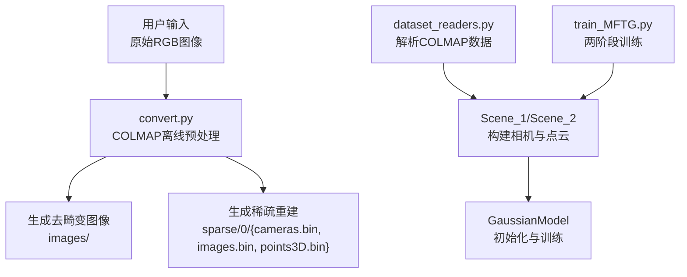
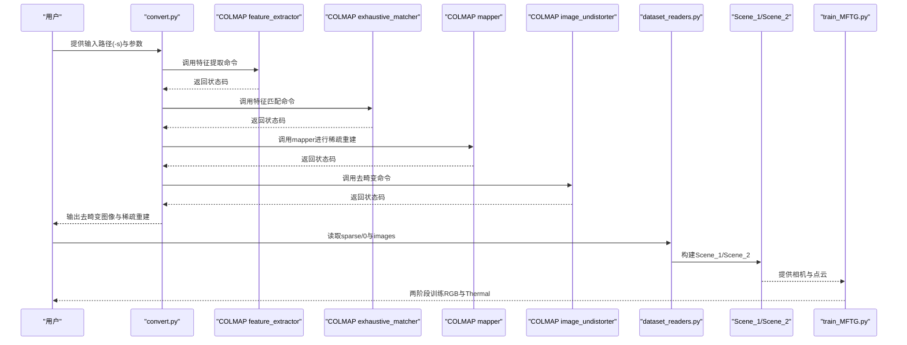
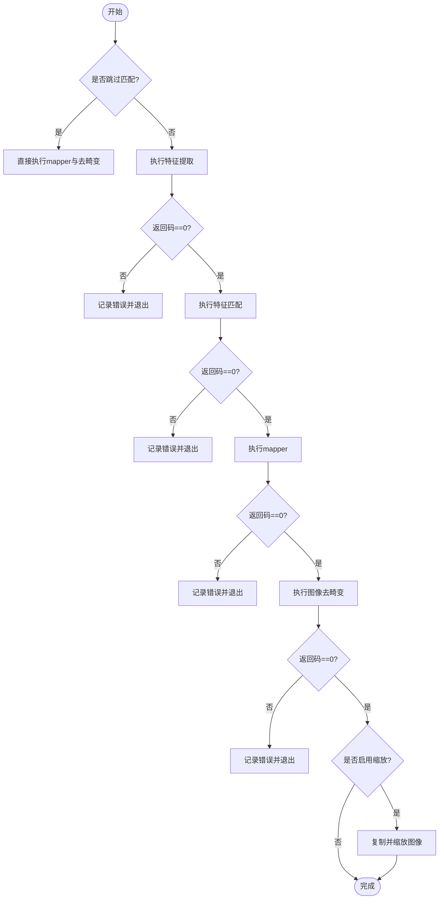
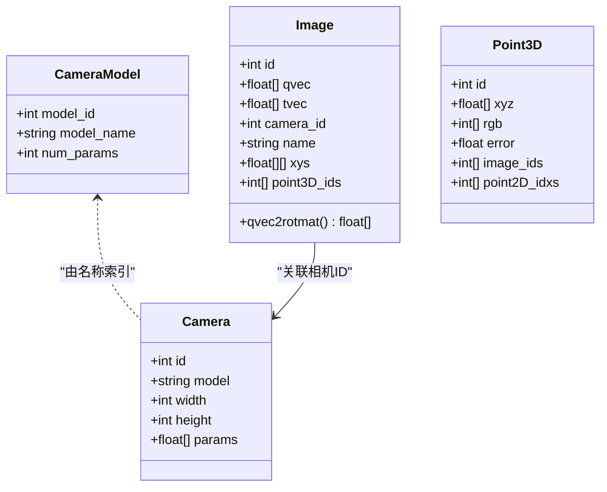
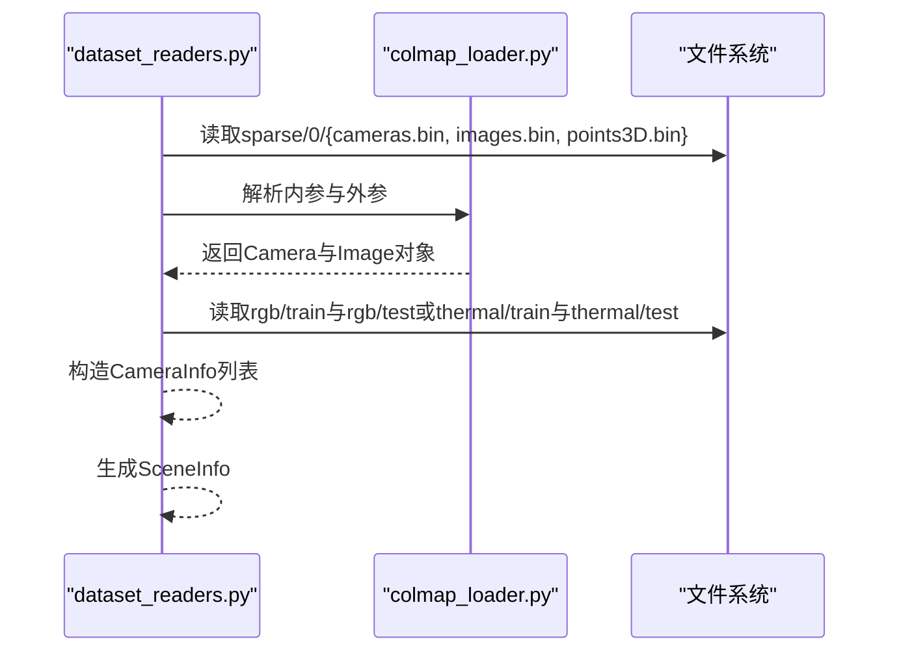
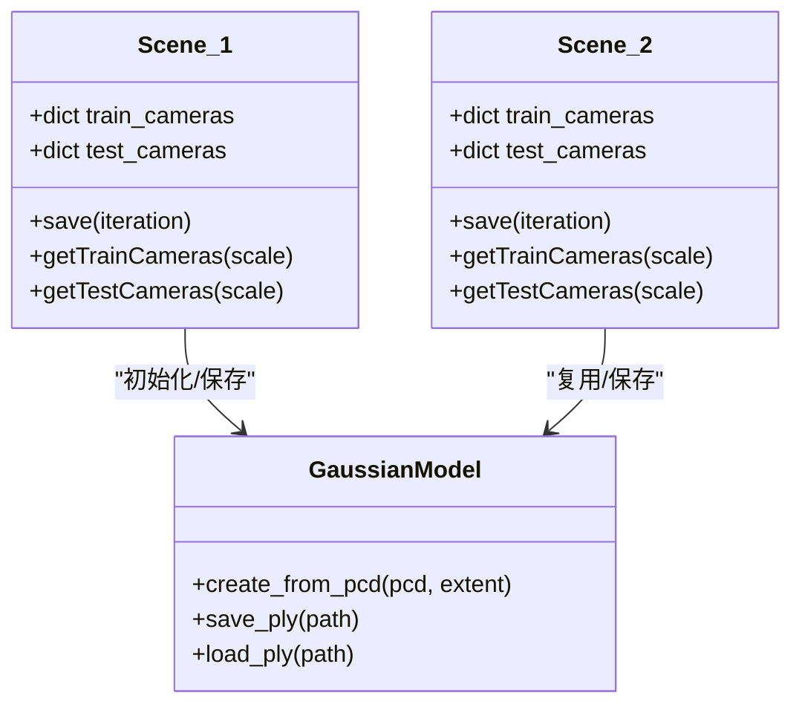
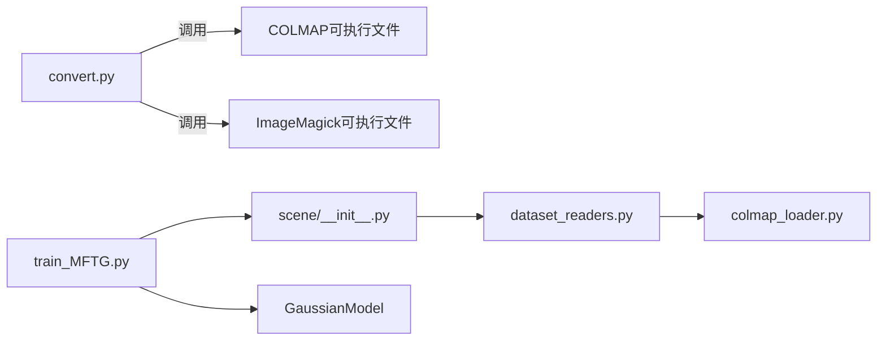

# COLMAP集成

<cite>
**本文引用的文件**
- [convert.py](file://convert.py)
- [scene/colmap_loader.py](file://scene/colmap_loader.py)
- [scene/dataset_readers.py](file://scene/dataset_readers.py)
- [scene/__init__.py](file://scene/__init__.py)
- [MFTG-Technical-Doc.md](file://MFTG-Technical-Doc.md)
- [README.md](file://README.md)
- [environment.yml](file://environment.yml)
- [train_MFTG.py](file://train_MFTG.py)
</cite>

## 目录
1. [简介](#简介)
2. [项目结构](#项目结构)
3. [核心组件](#核心组件)
4. [架构总览](#架构总览)
5. [详细组件分析](#详细组件分析)
6. [依赖关系分析](#依赖关系分析)
7. [性能考虑](#性能考虑)
8. [故障排查指南](#故障排查指南)
9. [结论](#结论)
10. [附录](#附录)

## 简介
本文件系统性阐述 Thermal-Gaussian 项目中 COLMAP 集成模块的设计与实现，重点覆盖以下方面：
- COLMAP 在 Thermal-Gaussian 中的作用与数据流：从特征提取、特征匹配、稀疏重建到相机姿态估计与图像去畸变的完整链路。
- convert.py 脚本如何调用 COLMAP 命令行工具、参数配置与错误处理机制。
- 图像去畸变、相机内参标定与外参估计的数学原理及在项目中的应用。
- COLMAP 配置优化建议、GPU 加速设置与性能调优方法。
- 常见运行问题的诊断与解决方案。

## 项目结构
Thermal-Gaussian 将 COLMAP 集成分为“离线预处理”和“在线数据加载”两大阶段：
- 离线预处理：convert.py 执行 COLMAP 命令，生成去畸变后的图像与稀疏重建结果（sparse/0 下的 cameras.bin、images.bin、points3D.bin）。
- 在线数据加载：dataset_readers.py 与 colmap_loader.py 解析 COLMAP 输出，构建相机内外参与点云，供训练与渲染使用。

图表来源
- [convert.py:34-78](file://convert.py#L34-L78)
- [scene/dataset_readers.py:136-181](file://scene/dataset_readers.py#L136-L181)
- [scene/__init__.py:21-94](file://scene/__init__.py#L21-L94)
- [train_MFTG.py:39-48](file://train_MFTG.py#L39-L48)

章节来源
- [README.md:122-153](file://README.md#L122-L153)
- [MFTG-Technical-Doc.md:39-94](file://MFTG-Technical-Doc.md#L39-L94)

## 核心组件
- convert.py：封装 COLMAP 命令行工具调用，负责特征提取、特征匹配、稀疏重建与图像去畸变；提供 GPU 开关、相机模型选择、Magick 图像缩放等参数。
- scene/colmap_loader.py：解析 COLMAP 输出的二进制/文本格式 cameras.bin、images.bin、points3D.bin，提供相机模型枚举、四元数与旋转矩阵互转、读取函数等。
- scene/dataset_readers.py：基于 colmap_loader 的解析结果，构造 CameraInfo、SceneInfo，读取训练/测试图像，生成相机列表。
- scene/__init__.py：Scene_1（RGB）与 Scene_2（Thermal）两类场景加载器，统一从 COLMAP 稀疏重建结果加载位姿与点云，支持多分辨率相机列表。
- train_MFTG.py：两阶段训练流程，第一阶段用 RGB 图像训练高斯，第二阶段复用几何并微调颜色以适配热红外图像。

章节来源
- [convert.py:18-26](file://convert.py#L18-L26)
- [scene/colmap_loader.py:16-40](file://scene/colmap_loader.py#L16-L40)
- [scene/dataset_readers.py:136-181](file://scene/dataset_readers.py#L136-L181)
- [scene/__init__.py:21-94](file://scene/__init__.py#L21-L94)
- [train_MFTG.py:39-48](file://train_MFTG.py#L39-L48)

## 架构总览
COLMAP 集成在 Thermal-Gaussian 中的端到端流程如下：

图表来源
- [convert.py:34-78](file://convert.py#L34-L78)
- [scene/dataset_readers.py:136-181](file://scene/dataset_readers.py#L136-L181)
- [scene/__init__.py:21-94](file://scene/__init__.py#L21-L94)
- [train_MFTG.py:39-48](file://train_MFTG.py#L39-L48)

## 详细组件分析

### COLMAP 命令行调用与参数配置（convert.py）
- 命令拼装与执行
  - 特征提取：feature_extractor，指定数据库路径、图像路径、单相机模式、相机模型（默认 OPENCV）、是否使用 GPU。
  - 特征匹配：exhaustive_matcher，指定数据库路径、是否使用 GPU。
  - 稀疏重建：mapper，指定数据库、图像路径、输出路径、全局 BA 容差（减小以提升速度）。
  - 图像去畸变：image_undistorter，指定输入图像路径、稀疏重建路径、输出路径与输出类型（COLMAP）。
- 参数与行为
  - --no_gpu：禁用 GPU 加速（use_gpu=0）。
  - --skip_matching：跳过匹配阶段（直接进行 mapper 与去畸变）。
  - --camera：选择相机模型（如 OPENCV）。
  - --colmap_executable：自定义 COLMAP 可执行文件路径。
  - --resize：启用图像缩放（使用 Magick，生成 1/2、1/4、1/8 尺寸）。
  - --magick_executable：自定义 ImageMagick 可执行文件路径。
- 错误处理
  - 每个命令返回非零退出码时记录错误日志并立即退出，避免后续步骤失败传播。

图表来源
- [convert.py:31-124](file://convert.py#L31-L124)

章节来源
- [convert.py:18-26](file://convert.py#L18-L26)
- [convert.py:34-78](file://convert.py#L34-L78)
- [convert.py:90-124](file://convert.py#L90-L124)

### COLMAP 数据解析与相机模型（scene/colmap_loader.py）
- 相机模型枚举与映射：支持 SIMPLE_PINHOLE、PINHOLE、SIMPLE_RADIAL、RADIAL、OPENCV、OPENCV_FISHEYE、FULL_OPENCV、FOV、SIMPLE_RADIAL_FISHEYE、RADIAL_FISHEYE、THIN_PRISM_FISHEYE 等。
- 四元数与旋转矩阵互转：提供 qvec2rotmat 与 rotmat2qvec，用于从 COLMAP 的四元数表示转换为旋转矩阵。
- 文件读取函数：
  - 读取点云：支持 points3D.txt 与 points3D.bin。
  - 读取内参与外参：支持 cameras.txt/cameras.bin 与 images.txt/images.bin。
  - 读取二进制数组：用于读取 COLMAP dense 数据（如深度图）。
- 注意事项
  - 项目默认假设内参为 PINHOLE 模型，解析时会断言模型名称为 PINHOLE。

图表来源
- [scene/colmap_loader.py:16-40](file://scene/colmap_loader.py#L16-L40)
- [scene/colmap_loader.py:68-71](file://scene/colmap_loader.py#L68-L71)
- [scene/colmap_loader.py:83-154](file://scene/colmap_loader.py#L83-L154)
- [scene/colmap_loader.py:156-178](file://scene/colmap_loader.py#L156-L178)
- [scene/colmap_loader.py:180-241](file://scene/colmap_loader.py#L180-L241)
- [scene/colmap_loader.py:244-270](file://scene/colmap_loader.py#L244-L270)

章节来源
- [scene/colmap_loader.py:16-40](file://scene/colmap_loader.py#L16-L40)
- [scene/colmap_loader.py:43-66](file://scene/colmap_loader.py#L43-L66)
- [scene/colmap_loader.py:83-178](file://scene/colmap_loader.py#L83-L178)
- [scene/colmap_loader.py:180-270](file://scene/colmap_loader.py#L180-L270)

### 数据加载与相机列表（scene/dataset_readers.py）
- 读取 COLMAP 相机内外参：优先尝试二进制格式，失败则回退到文本格式。
- 构造 CameraInfo：根据内参模型（SIMPLE_PINHOLE/PINHOLE）计算视场角，拼接图像路径与名称。
- 读取点云：若不存在 .ply，则将 points3D.bin/txt 转换为 .ply。
- 生成 SceneInfo：包含点云、训练/测试相机列表、归一化参数与 .ply 路径。
- 两套场景加载器：
  - Colmap：读取 rgb/train 与 rgb/test。
  - Temper：读取 thermal/train 与 thermal/test，共享同一套 COLMAP 位姿。

图表来源
- [scene/dataset_readers.py:136-181](file://scene/dataset_readers.py#L136-L181)
- [scene/dataset_readers.py:184-230](file://scene/dataset_readers.py#L184-L230)
- [scene/colmap_loader.py:156-178](file://scene/colmap_loader.py#L156-L178)
- [scene/colmap_loader.py:180-241](file://scene/colmap_loader.py#L180-L241)

章节来源
- [scene/dataset_readers.py:68-109](file://scene/dataset_readers.py#L68-L109)
- [scene/dataset_readers.py:136-181](file://scene/dataset_readers.py#L136-L181)
- [scene/dataset_readers.py:184-230](file://scene/dataset_readers.py#L184-L230)

### 场景加载器（Scene_1/Scene_2）
- Scene_1（RGB）：从 COLMAP 稀疏重建加载位姿与点云，初始化高斯模型，保存路径为 point_cloud_color。
- Scene_2（Thermal）：同样从 COLMAP 稀疏重建加载位姿与点云，但复用 Scene_1 的高斯参数，保存路径为 point_cloud_thermal。
- 共享机制：两套场景共享同一套 COLMAP 位姿（images.bin）与点云（points3D.bin），确保热红外图像与 RGB 图像的空间对齐。

图表来源
- [scene/__init__.py:21-94](file://scene/__init__.py#L21-L94)
- [scene/__init__.py:96-168](file://scene/__init__.py#L96-L168)

章节来源
- [scene/__init__.py:21-94](file://scene/__init__.py#L21-L94)
- [scene/__init__.py:96-168](file://scene/__init__.py#L96-L168)

### 两阶段训练与COLMAP集成（train_MFTG.py）
- Phase 1（RGB）：使用 Scene_1 加载 COLMAP 位姿与点云，训练高斯以渲染 RGB 图像。
- Phase 2（Thermal）：使用 Scene_2 加载 COLMAP 位姿与点云，复用 Phase 1 的高斯参数，仅微调颜色以适配热红外图像，并引入热红外平滑损失。
- 关键点：两阶段共享同一套 COLMAP 位姿，热红外图像与 RGB 图像需空间配准。

章节来源
- [train_MFTG.py:39-48](file://train_MFTG.py#L39-L48)
- [train_MFTG.py:106-114](file://train_MFTG.py#L106-L114)
- [MFTG-Technical-Doc.md:113-153](file://MFTG-Technical-Doc.md#L113-L153)

## 依赖关系分析
- convert.py 依赖系统环境中的 COLMAP 与 ImageMagick（Magick）可执行文件，可通过参数指定路径。
- dataset_readers.py 依赖 colmap_loader.py 提供的解析函数与相机模型常量。
- scene/__init__.py 依赖 dataset_readers.py 的场景加载回调字典，按类型选择 Colmap 或 Temper。
- train_MFTG.py 依赖 Scene_1/Scene_2 提供的相机与点云，以及 GaussianModel 的初始化与保存接口。

图表来源
- [convert.py:22-28](file://convert.py#L22-L28)
- [scene/dataset_readers.py:16-17](file://scene/dataset_readers.py#L16-L17)
- [scene/__init__.py:16](file://scene/__init__.py#L16)
- [train_MFTG.py:19](file://train_MFTG.py#L19)

章节来源
- [convert.py:22-28](file://convert.py#L22-L28)
- [scene/dataset_readers.py:16-17](file://scene/dataset_readers.py#L16-L17)
- [scene/__init__.py:16](file://scene/__init__.py#L16)
- [train_MFTG.py:19](file://train_MFTG.py#L19)

## 性能考虑
- GPU 加速
  - feature_extractor 与 exhaustive_matcher 支持 use_gpu 参数，建议在具备 CUDA 的环境中启用 GPU 以显著提升特征提取与匹配速度。
  - 若硬件不支持或驱动异常，可通过 --no_gpu 禁用 GPU。
- 匹配策略
  - exhaustive_matcher 适用于小规模数据集；大规模数据集可考虑其他匹配策略以减少计算开销。
- BA 容差
  - mapper 的全局 BA 容差被调小以加速收敛，适合快速重建；若需要更高精度，可适当增大容差。
- 图像缩放
  - convert.py 支持自动缩放（1/2、1/4、1/8），可在保证质量的前提下降低内存与存储压力。
- 环境依赖
  - 确保安装了正确的 CUDA 版本与 PyTorch，以获得最佳的 GPU 性能。

章节来源
- [convert.py:19-25](file://convert.py#L19-L25)
- [convert.py:40](file://convert.py#L40)
- [convert.py:62](file://convert.py#L62)
- [convert.py:105-121](file://convert.py#L105-L121)
- [environment.yml:7](file://environment.yml#L7)

## 故障排查指南
- COLMAP 命令未找到
  - 现象：执行 convert.py 报错找不到 colmap。
  - 处理：通过 --colmap_executable 指定完整路径，或确保 COLMAP 已加入系统 PATH。
- ImageMagick 未找到
  - 现象：缩放步骤报错。
  - 处理：通过 --magick_executable 指定 magick 路径，或安装 ImageMagick 并加入 PATH。
- 特征提取/匹配/mapper 失败
  - 现象：某一步骤返回非零退出码。
  - 处理：检查输入图像格式与路径、GPU 驱动、磁盘空间与权限；必要时禁用 GPU 或调整相机模型。
- 去畸变失败
  - 现象：image_undistorter 返回错误。
  - 处理：确认 sparse/0/0 下存在有效的重建结果；检查输入图像与稀疏重建路径。
- 内参模型不兼容
  - 现象：解析 cameras.bin 时报错。
  - 处理：确保 COLMAP 使用的相机模型与项目假设一致（PINHOLE），必要时重新运行 COLMAP。
- 热红外与 RGB 未对齐
  - 现象：渲染质量差或几何不一致。
  - 处理：确保热红外图像与 RGB 图像空间配准（像素级对齐），并在 COLMAP 中使用相同的相机位姿。

章节来源
- [convert.py:22-28](file://convert.py#L22-L28)
- [convert.py:41-44](file://convert.py#L41-L44)
- [convert.py:50-53](file://convert.py#L50-L53)
- [convert.py:64-66](file://convert.py#L64-L66)
- [convert.py:75-77](file://convert.py#L75-L77)
- [scene/dataset_readers.py:96](file://scene/dataset_readers.py#L96)
- [MFTG-Technical-Doc.md:69-73](file://MFTG-Technical-Doc.md#L69-L73)

## 结论
Thermal-Gaussian 将 COLMAP 作为稀疏视觉里程计与相机标定的核心工具，通过 convert.py 实现完整的离线预处理流程，并在 dataset_readers.py 与 scene/__init__.py 中高效解析与加载 COLMAP 输出，支撑两阶段训练策略。合理配置 GPU 加速、相机模型与图像缩放，可显著提升整体效率；严格遵循数据配对与空间对齐要求，是获得高质量热红外渲染与 RGB 渲染的关键。

## 附录
- 数据准备与运行示例
  - 自定义数据：将 RGB 图像放入 input/，热红外图像放入 thermal/，运行 convert.py 生成去畸变图像与稀疏重建。
  - 官方数据：下载 RGBT-Scenes 数据集，按 README 规范组织目录结构。
- 环境配置
  - 使用 environment.yml 创建 Conda 环境，确保 CUDA 与 PyTorch 版本匹配。

章节来源
- [README.md:122-153](file://README.md#L122-L153)
- [README.md:18-27](file://README.md#L18-L27)
- [MFTG-Technical-Doc.md:338-363](file://MFTG-Technical-Doc.md#L338-L363)
- [environment.yml:1-17](file://environment.yml#L1-L17)