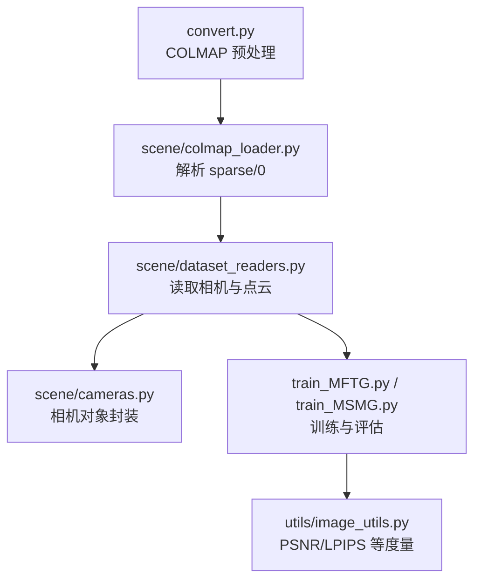
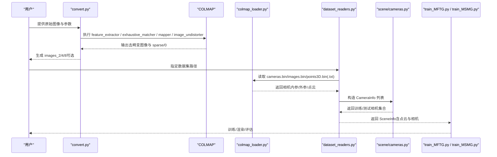
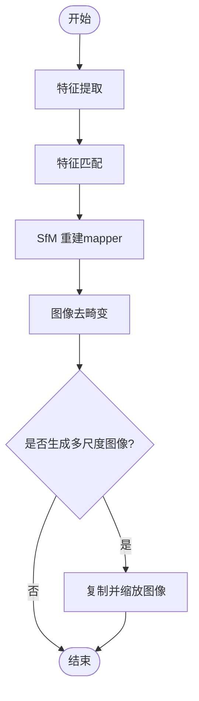
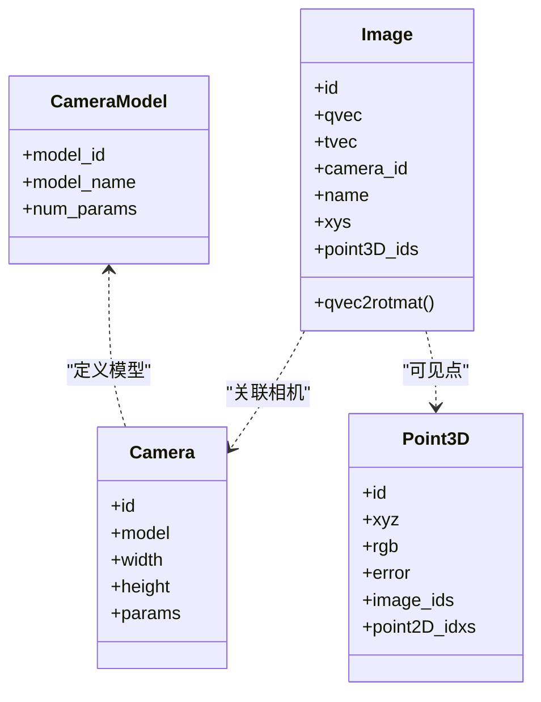
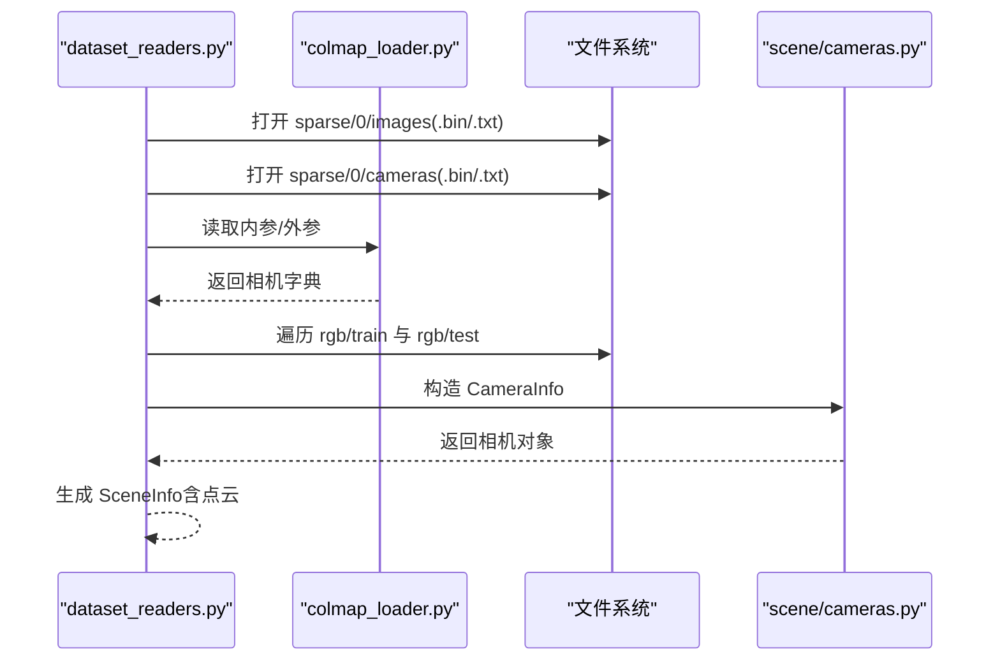
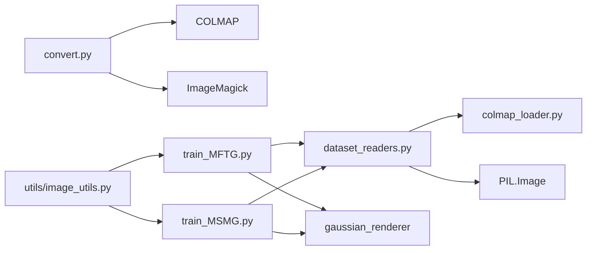

# 数据处理

<cite>
**本文引用的文件**
- [convert.py](file://convert.py)
- [scene/colmap_loader.py](file://scene/colmap_loader.py)
- [scene/dataset_readers.py](file://scene/dataset_readers.py)
- [scene/cameras.py](file://scene/cameras.py)
- [utils/image_utils.py](file://utils/image_utils.py)
- [MFTG-Technical-Doc.md](file://MFTG-Technical-Doc.md)
- [README.md](file://README.md)
- [train_MFTG.py](file://train_MFTG.py)
- [train_MSMG.py](file://train_MSMG.py)
- [environment.yml](file://environment.yml)
</cite>

## 目录
1. [简介](#简介)
2. [项目结构](#项目结构)
3. [核心组件](#核心组件)
4. [架构总览](#架构总览)
5. [详细组件分析](#详细组件分析)
6. [依赖关系分析](#依赖关系分析)
7. [性能考量](#性能考量)
8. [故障排查指南](#故障排查指南)
9. [结论](#结论)
10. [附录](#附录)

## 简介
本文件系统性阐述 Thermal-Gaussian 的数据处理流程，覆盖从原始图像到训练数据的完整预处理管线，包括：
- COLMAP 稀疏重建与相机标定
- 点云生成与去畸变
- 数据格式标准化与图像预处理
- 元数据提取与场景结构组织
- convert.py 脚本功能与使用方法
- 自定义数据集处理指南、数据质量检查与常见问题解决

该流程确保 RGB 与热红外图像在 COLMAP 位姿与点云基础上进行空间对齐，为后续多模态 3D 高斯建模提供高质量输入。

## 项目结构
项目围绕“COLMAP 预处理 + 场景读取 + 训练渲染”的分层设计组织，关键目录与文件如下：
- convert.py：COLMAP 预处理脚本，负责特征提取、匹配、SfM 重建、去畸变与多尺度图像生成
- scene/colmap_loader.py：COLMAP 二进制/文本格式解析器，读取相机内参、外参与点云
- scene/dataset_readers.py：场景读取器，将 COLMAP 数据映射为训练/测试相机列表与点云，并提供 RGB 与热红外两类读取回调
- scene/cameras.py：相机类封装，包含位姿、视野角、投影矩阵等
- utils/image_utils.py：图像度量工具（如 PSNR）
- MFTG-Technical-Doc.md：MFTG 技术文档，详述两阶段训练与数据流
- README.md：项目总体说明与数据准备指引
- train_MFTG.py / train_MSMG.py：训练入口，展示数据加载与损失流程
- environment.yml：环境与依赖声明

图表来源
- [convert.py:1-125](file://convert.py#L1-L125)
- [scene/colmap_loader.py:1-295](file://scene/colmap_loader.py#L1-L295)
- [scene/dataset_readers.py:1-311](file://scene/dataset_readers.py#L1-L311)
- [scene/cameras.py:1-72](file://scene/cameras.py#L1-L72)
- [train_MFTG.py:1-200](file://train_MFTG.py#L1-L200)
- [train_MSMG.py:1-200](file://train_MSMG.py#L1-L200)
- [utils/image_utils.py:1-20](file://utils/image_utils.py#L1-L20)

章节来源
- [README.md:28-61](file://README.md#L28-L61)
- [MFTG-Technical-Doc.md:39-94](file://MFTG-Technical-Doc.md#L39-L94)

## 核心组件
- COLMAP 预处理脚本 convert.py
  - 功能：自动化执行特征提取、特征匹配、SfM 重建、去畸变；可选生成多尺度图像
  - 关键命令：feature_extractor、exhaustive_matcher、mapper、image_undistorter
  - 输出：去畸变后的图像与 sparse/0 下的相机/点云文件
- COLMAP 解析器 colmap_loader.py
  - 功能：读取 cameras.bin/images.bin/points3D.bin 或对应 .txt 文件，解析内参、外参与点云
  - 支持相机模型：PINHOLE/SIMPLE_PINHOLE 等
- 场景读取器 dataset_readers.py
  - 功能：将 COLMAP 数据映射为 CameraInfo/SceneInfo，支持 RGB 与热红外两类读取
  - 提供回调：sceneLoadTypeCallbacks["Colmap"] / ["Temper"] / ["Blender"]
- 相机封装 cameras.py
  - 功能：封装相机位姿、视野角、投影矩阵、世界视图变换等
- 训练入口 train_MFTG.py / train_MSMG.py
  - 功能：两阶段训练（MFTG）或多模态并行训练（MSMG），结合损失函数与密度控制

章节来源
- [convert.py:18-125](file://convert.py#L18-L125)
- [scene/colmap_loader.py:16-241](file://scene/colmap_loader.py#L16-L241)
- [scene/dataset_readers.py:26-181](file://scene/dataset_readers.py#L26-L181)
- [scene/cameras.py:17-58](file://scene/cameras.py#L17-L58)
- [train_MFTG.py:35-163](file://train_MFTG.py#L35-L163)
- [train_MSMG.py:33-179](file://train_MSMG.py#L33-L179)

## 架构总览
下图展示了从原始图像到训练数据的端到端流程，以及训练阶段的数据流与损失设计。

图表来源
- [convert.py:31-79](file://convert.py#L31-L79)
- [scene/colmap_loader.py:137-181](file://scene/colmap_loader.py#L137-L181)
- [scene/dataset_readers.py:136-181](file://scene/dataset_readers.py#L136-L181)
- [scene/cameras.py:17-58](file://scene/cameras.py#L17-L58)
- [train_MFTG.py:35-50](file://train_MFTG.py#L35-L50)
- [train_MSMG.py:33-47](file://train_MSMG.py#L33-L47)

## 详细组件分析

### COLMAP 预处理与去畸变（convert.py）
- 输入：原始图像目录（input）
- 主要步骤：
  - 特征提取：使用指定相机模型（默认 OPENCV）提取 SIFT 特征
  - 特征匹配：穷举匹配
  - SfM 重建：mapper，设置全局 BA 容差以加速收敛
  - 去畸变：将图像与相机参数映射到理想针孔模型
  - 多尺度图像生成：可选生成 1/2、1/4、1/8 尺度图像
- 关键参数：
  - --source_path：数据根目录
  - --camera：相机模型（如 OPENCV）
  - --colmap_executable：COLMAP 可执行文件路径
  - --resize：是否生成多尺度图像
  - --magick_executable：ImageMagick 可执行文件路径
- 错误处理：任一步失败即记录错误并退出

图表来源
- [convert.py:31-79](file://convert.py#L31-L79)
- [convert.py:90-122](file://convert.py#L90-L122)

章节来源
- [convert.py:18-125](file://convert.py#L18-L125)
- [README.md:122-152](file://README.md#L122-L152)

### COLMAP 数据解析（scene/colmap_loader.py）
- 支持格式：二进制与文本
- 读取内容：
  - 相机内参：PINHOLE/SIMPLE_PINHOLE 等
  - 相机外参：四元数旋转与平移
  - 稀疏点云：3D 坐标、颜色与误差
- 关键函数：
  - 读取内参/外参/点云（二进制/文本）
  - 四元数与旋转矩阵互转
  - 二进制数组读取辅助

图表来源
- [scene/colmap_loader.py:16-40](file://scene/colmap_loader.py#L16-L40)
- [scene/colmap_loader.py:68-71](file://scene/colmap_loader.py#L68-L71)
- [scene/colmap_loader.py:83-154](file://scene/colmap_loader.py#L83-L154)
- [scene/colmap_loader.py:156-241](file://scene/colmap_loader.py#L156-L241)

章节来源
- [scene/colmap_loader.py:16-241](file://scene/colmap_loader.py#L16-L241)

### 场景读取与数据格式标准化（scene/dataset_readers.py）
- 数据结构标准化：
  - RGB：rgb/train、rgb/test
  - 热红外：thermal/train、thermal/test
  - COLMAP：sparse/0 下的 cameras.bin/images.bin/points3D.bin(.txt)
- 读取流程：
  - 优先尝试二进制文件，失败回退到文本文件
  - 读取相机内参/外参与图像列表
  - 构造 CameraInfo（位姿、视野角、图像路径等）
  - 生成 SceneInfo（点云、训练/测试相机、归一化参数）
- 回调机制：
  - Colmap：读取 rgb
  - Temper：读取 thermal
  - Blender：读取 transforms.json

图表来源
- [scene/dataset_readers.py:136-181](file://scene/dataset_readers.py#L136-L181)
- [scene/dataset_readers.py:185-230](file://scene/dataset_readers.py#L185-L230)
- [scene/colmap_loader.py:137-181](file://scene/colmap_loader.py#L137-L181)
- [scene/cameras.py:17-58](file://scene/cameras.py#L17-L58)

章节来源
- [scene/dataset_readers.py:26-181](file://scene/dataset_readers.py#L26-L181)
- [scene/dataset_readers.py:185-230](file://scene/dataset_readers.py#L185-L230)
- [README.md:31-60](file://README.md#L31-L60)

### 相机封装与渲染接口（scene/cameras.py）
- 相机对象包含：
  - 位姿（R/T）、视野角（FoVX/FoVy）
  - 投影矩阵与世界视图变换
  - 原始图像张量（归一化）
- 用途：作为渲染器输入，提供渲染所需几何与光学参数

章节来源
- [scene/cameras.py:17-58](file://scene/cameras.py#L17-L58)

### 训练与损失（train_MFTG.py / train_MSMG.py）
- MFTG 两阶段：
  - Phase 1：RGB 训练，初始化高斯并基于 COLMAP 点云
  - Phase 2：热红外微调，复用 Phase 1 的高斯，加入热红外平滑损失
- MSMG 并行：
  - 两套高斯并行训练，动态加权融合损失
- 关键损失：
  - L1 + SSIM 权重融合
  - Phase 2 额外平滑损失（热红外先验）

章节来源
- [train_MFTG.py:35-163](file://train_MFTG.py#L35-L163)
- [train_MSMG.py:33-179](file://train_MSMG.py#L33-L179)
- [MFTG-Technical-Doc.md:111-165](file://MFTG-Technical-Doc.md#L111-L165)

## 依赖关系分析
- convert.py 依赖外部工具：COLMAP 与 ImageMagick（可选）
- dataset_readers.py 依赖 colmap_loader.py 与 PIL
- train_MFTG.py / train_MSMG.py 依赖 gaussian_renderer、scene 模块与 utils
- utils/image_utils.py 提供 PSNR 等度量

图表来源
- [convert.py:27-28](file://convert.py#L27-L28)
- [scene/dataset_readers.py:12-24](file://scene/dataset_readers.py#L12-L24)
- [train_MFTG.py:16-25](file://train_MFTG.py#L16-L25)
- [train_MSMG.py:16-26](file://train_MSMG.py#L16-L26)
- [utils/image_utils.py:12-20](file://utils/image_utils.py#L12-L20)

章节来源
- [convert.py:12-28](file://convert.py#L12-L28)
- [scene/dataset_readers.py:12-24](file://scene/dataset_readers.py#L12-L24)
- [train_MFTG.py:16-25](file://train_MFTG.py#L16-L25)
- [train_MSMG.py:16-26](file://train_MSMG.py#L16-L26)
- [utils/image_utils.py:12-20](file://utils/image_utils.py#L12-L20)

## 性能考量
- COLMAP 计算复杂度与 GPU 使用：
  - 特征提取与匹配支持 GPU（use_gpu），建议在具备 CUDA 的机器上运行
  - 多尺度图像生成会增加磁盘与 I/O 压力，按需启用
- 训练阶段：
  - 两阶段训练（MFTG）显存占用中等，适合大多数消费级 GPU
  - 若显存不足，可降低分辨率或减少 SH 阶数
- 数据规模：
  - 推荐图像分辨率在 1–1.6K 像素范围，超出时可自动调整

章节来源
- [convert.py:29](file://convert.py#L29)
- [MFTG-Technical-Doc.md:310-336](file://MFTG-Technical-Doc.md#L310-L336)
- [README.md:119](file://README.md#L119)

## 故障排查指南
- COLMAP 执行失败
  - 症状：特征提取/匹配/重建/去畸变返回非零退出码
  - 排查：确认 COLMAP 可执行文件路径与 --camera 模型正确；检查输入图像格式与命名
  - 参考：convert.py 中各步骤的错误日志与退出逻辑
- 图像未被读取
  - 症状：训练阶段无有效相机或图像
  - 排查：确认 rgb/thermal 目录结构与图像命名与 COLMAP 输出一致；检查 sparse/0 是否存在
- 点云缺失或为空
  - 症状：SceneInfo 中点云为 None
  - 排查：确认 sparse/0/points3D.bin(.txt) 存在；首次打开会自动转换为 .ply
- 多尺度图像生成失败
  - 症状：resize 步骤报错
  - 排查：确认 ImageMagick 安装与 --magick_executable 路径；检查磁盘空间
- 显存不足
  - 症状：训练过程中 OOM
  - 排查：降低分辨率（-r）、减少 SH 阶数（--sh_degree）、减少训练图像数量

章节来源
- [convert.py:42-44](file://convert.py#L42-L44)
- [convert.py:51-53](file://convert.py#L51-L53)
- [convert.py:65-66](file://convert.py#L65-L66)
- [convert.py:77-78](file://convert.py#L77-L78)
- [convert.py:106-108](file://convert.py#L106-L108)
- [convert.py:114-115](file://convert.py#L114-L115)
- [convert.py:121-122](file://convert.py#L121-L122)
- [scene/dataset_readers.py:164-170](file://scene/dataset_readers.py#L164-L170)
- [MFTG-Technical-Doc.md:612-618](file://MFTG-Technical-Doc.md#L612-L618)

## 结论
本文档系统梳理了 Thermal-Gaussian 的数据处理流程，从 COLMAP 预处理到场景读取与训练，明确了 convert.py 的职责、COLMAP 数据解析与场景标准化、以及两阶段（MFTG）与并行（MSMG）训练的差异。遵循本文档的步骤与排错建议，可高效构建高质量的 RGB 与热红外多模态数据集，支撑后续的 3D 高斯建模与渲染任务。

## 附录
- 环境安装要点
  - 使用 environment.yml 创建 Conda 环境
  - 安装 PyTorch 与 CUDA 11.6 兼容版本
  - 安装 submodules 子模块（diff-gaussian-rasterization、simple-knn）
- 数据集结构参考
  - README 与 MFTG 技术文档提供了标准目录结构与配对要求

章节来源
- [environment.yml:1-17](file://environment.yml#L1-L17)
- [README.md:28-61](file://README.md#L28-L61)
- [MFTG-Technical-Doc.md:41-74](file://MFTG-Technical-Doc.md#L41-L74)