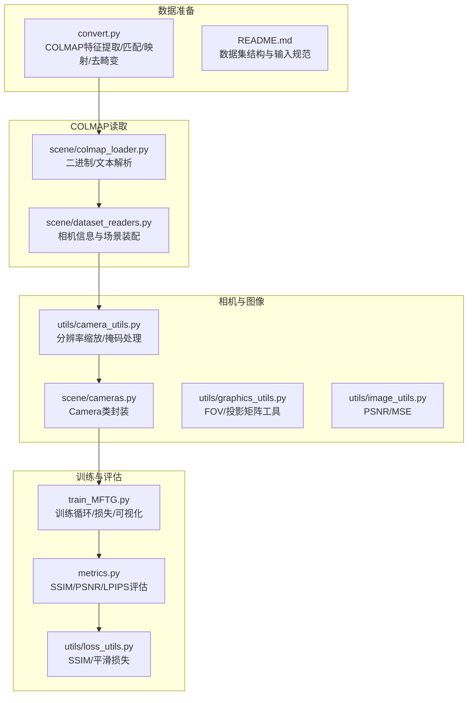
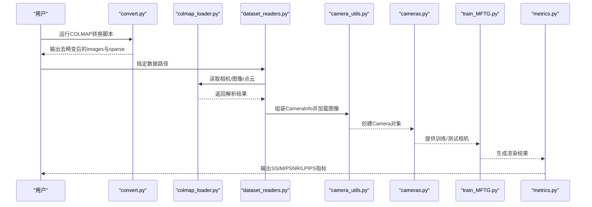
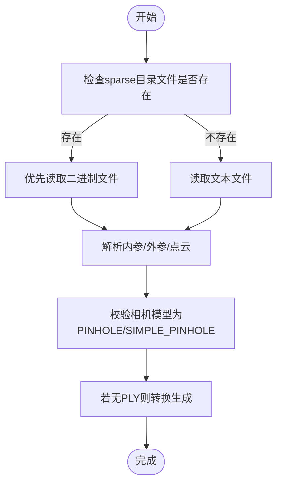
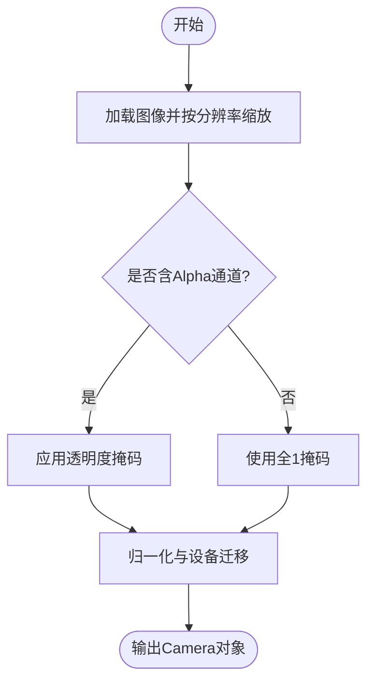
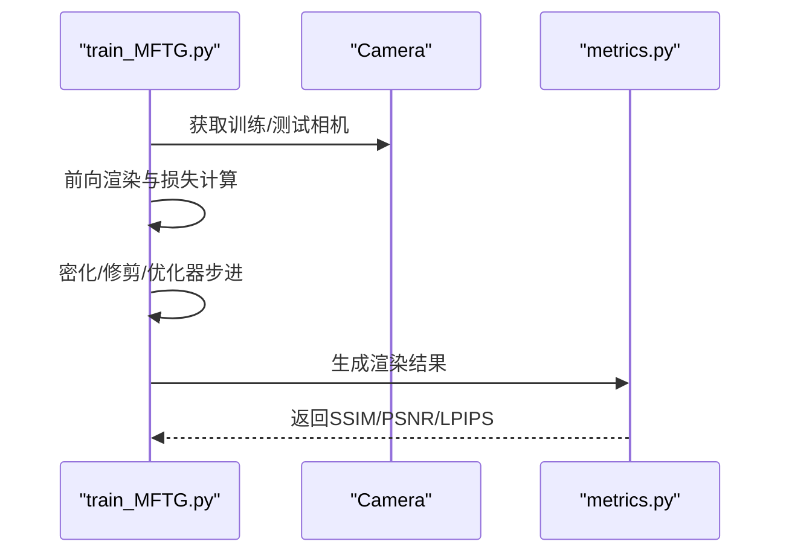

# 数据质量控制

<cite>
**本文引用的文件**
- [README.md](file://README.md)
- [convert.py](file://convert.py)
- [scene/colmap_loader.py](file://scene/colmap_loader.py)
- [scene/dataset_readers.py](file://scene/dataset_readers.py)
- [scene/cameras.py](file://scene/cameras.py)
- [utils/camera_utils.py](file://utils/camera_utils.py)
- [utils/graphics_utils.py](file://utils/graphics_utils.py)
- [utils/image_utils.py](file://utils/image_utils.py)
- [utils/loss_utils.py](file://utils/loss_utils.py)
- [metrics.py](file://metrics.py)
- [train_MFTG.py](file://train_MFTG.py)
</cite>

## 目录
1. [简介](#简介)
2. [项目结构](#项目结构)
3. [核心组件](#核心组件)
4. [架构总览](#架构总览)
5. [详细组件分析](#详细组件分析)
6. [依赖关系分析](#依赖关系分析)
7. [性能考量](#性能考量)
8. [故障排查指南](#故障排查指南)
9. [结论](#结论)
10. [附录](#附录)

## 简介
本指南围绕数据质量控制与验证展开，结合代码库中COLMAP重建、相机标定、图像预处理与渲染训练流程，系统阐述以下内容：
- 数据预处理质量检查点：图像清晰度评估、相机标定精度验证、点云质量分析
- COLMAP重建结果的质量指标（重投影误差、观测数量等）及阈值设定建议
- 数据异常检测方法、缺失数据处理策略与数据完整性验证流程
- 常见数据质量问题识别与处理方案（运动模糊、光照变化、遮挡、纹理缺乏）
- 数据清洗与预处理最佳实践

## 项目结构
该仓库围绕“多模态3D高斯渲染”构建，数据管线主要由COLMAP重建、数据读取与转换、相机参数加载、渲染训练与指标评估组成。下图展示与数据质量控制相关的关键模块与交互关系。

图表来源
- [convert.py:1-125](file://convert.py#L1-L125)
- [README.md:28-60](file://README.md#L28-L60)
- [scene/colmap_loader.py:125-295](file://scene/colmap_loader.py#L125-L295)
- [scene/dataset_readers.py:68-181](file://scene/dataset_readers.py#L68-L181)
- [scene/cameras.py:17-72](file://scene/cameras.py#L17-L72)
- [utils/camera_utils.py:19-60](file://utils/camera_utils.py#L19-L60)
- [utils/graphics_utils.py:31-77](file://utils/graphics_utils.py#L31-L77)
- [utils/image_utils.py:14-19](file://utils/image_utils.py#L14-L19)
- [train_MFTG.py:35-238](file://train_MFTG.py#L35-L238)
- [metrics.py:24-139](file://metrics.py#L24-L139)
- [utils/loss_utils.py:36-114](file://utils/loss_utils.py#L36-L114)

章节来源
- [README.md:28-60](file://README.md#L28-L60)
- [convert.py:31-78](file://convert.py#L31-L78)
- [scene/colmap_loader.py:125-295](file://scene/colmap_loader.py#L125-L295)
- [scene/dataset_readers.py:68-181](file://scene/dataset_readers.py#L68-L181)
- [scene/cameras.py:17-72](file://scene/cameras.py#L17-L72)
- [utils/camera_utils.py:19-60](file://utils/camera_utils.py#L19-L60)
- [utils/graphics_utils.py:31-77](file://utils/graphics_utils.py#L31-L77)
- [utils/image_utils.py:14-19](file://utils/image_utils.py#L14-L19)
- [train_MFTG.py:35-238](file://train_MFTG.py#L35-L238)
- [metrics.py:24-139](file://metrics.py#L24-L139)
- [utils/loss_utils.py:36-114](file://utils/loss_utils.py#L36-L114)

## 核心组件
- COLMAP数据读取与解析：支持二进制与文本格式的相机内参、外参与稀疏点云读取，并进行模型一致性校验（仅支持特定针孔模型）。
- 场景装配与相机信息：从COLMAP输出组装CameraInfo列表，读取图像并计算视场角，同时进行NERF归一化。
- 相机对象封装：将图像、位姿、焦距等封装为Camera对象，建立世界-相机变换与投影矩阵。
- 图像预处理：按分辨率参数调整输入尺寸，自动缩放大图，支持透明度掩码处理。
- 训练与评估：在训练循环中计算L1/SSIM损失，热成像场景引入平滑损失；评估阶段使用SSIM/PSNR/LPIPS衡量渲染质量。

章节来源
- [scene/colmap_loader.py:16-40](file://scene/colmap_loader.py#L16-L40)
- [scene/dataset_readers.py:68-109](file://scene/dataset_readers.py#L68-L109)
- [scene/cameras.py:17-58](file://scene/cameras.py#L17-L58)
- [utils/camera_utils.py:19-52](file://utils/camera_utils.py#L19-L52)
- [train_MFTG.py:106-114](file://train_MFTG.py#L106-L114)
- [metrics.py:67-129](file://metrics.py#L67-L129)

## 架构总览
下图展示从COLMAP到训练评估的数据流，重点标注质量控制节点。

图表来源
- [convert.py:31-78](file://convert.py#L31-L78)
- [scene/colmap_loader.py:125-295](file://scene/colmap_loader.py#L125-L295)
- [scene/dataset_readers.py:136-181](file://scene/dataset_readers.py#L136-L181)
- [utils/camera_utils.py:19-52](file://utils/camera_utils.py#L19-L52)
- [scene/cameras.py:17-58](file://scene/cameras.py#L17-L58)
- [train_MFTG.py:35-238](file://train_MFTG.py#L35-L238)
- [metrics.py:24-139](file://metrics.py#L24-L139)

## 详细组件分析

### COLMAP数据读取与质量检查
- 支持的相机模型：代码明确断言仅支持特定针孔模型，确保后续流程一致性。
- 内参/外参/点云读取：分别实现二进制与文本格式解析，保证不同导出方式的兼容性。
- 质量检查要点：
  - 模型一致性：仅PINHOLE/SIMPLE_PINHOLE被接受，避免非针孔模型导致的几何不一致。
  - 文件完整性：二进制/文本文件存在性检查，失败时回退到另一种格式。
  - 点云可用性：若无PLY则尝试转换，确保后续渲染与评估可用。

图表来源
- [scene/colmap_loader.py:125-295](file://scene/colmap_loader.py#L125-L295)
- [scene/dataset_readers.py:136-181](file://scene/dataset_readers.py#L136-L181)

章节来源
- [scene/colmap_loader.py:16-40](file://scene/colmap_loader.py#L16-L40)
- [scene/colmap_loader.py:156-178](file://scene/colmap_loader.py#L156-L178)
- [scene/colmap_loader.py:180-212](file://scene/colmap_loader.py#L180-L212)
- [scene/colmap_loader.py:215-241](file://scene/colmap_loader.py#L215-L241)
- [scene/colmap_loader.py:244-270](file://scene/colmap_loader.py#L244-L270)
- [scene/dataset_readers.py:136-181](file://scene/dataset_readers.py#L136-L181)

### 相机标定精度验证
- 相机参数来源：从COLMAP读取qvec/tvec与相机内参，转换为旋转矩阵与视场角。
- 精度验证建议：
  - 重投影误差：COLMAP输出包含点云的重投影误差字段，可作为重建精度指标。建议在评估阶段统计平均/中位数与分布，设置阈值（例如均值小于某像素或百分位阈值）。
  - 观测数量：每个3D点的观测数量反映其稳定性与鲁棒性，建议剔除观测数过少的点（如小于阈值）。
  - 相机姿态一致性：通过相邻帧间位姿变化幅度与轨迹离散度评估标定稳定性。

章节来源
- [scene/colmap_loader.py:22-23](file://scene/colmap_loader.py#L22-L23)
- [scene/dataset_readers.py:68-109](file://scene/dataset_readers.py#L68-L109)
- [scene/dataset_readers.py:161-170](file://scene/dataset_readers.py#L161-L170)

### 点云质量分析
- 点云来源：COLMAP稀疏重建输出，支持二进制/文本与PLY转换。
- 质量分析维度：
  - 点云密度：统计有效点数量与分布，评估覆盖范围与细节保留。
  - 几何一致性：通过重投影误差分布判断异常点与离群点。
  - 法向量与颜色：用于渲染前的法向量与颜色一致性检查。

章节来源
- [scene/colmap_loader.py:83-123](file://scene/colmap_loader.py#L83-L123)
- [scene/colmap_loader.py:125-154](file://scene/colmap_loader.py#L125-L154)
- [scene/dataset_readers.py:111-117](file://scene/dataset_readers.py#L111-L117)

### 图像清晰度评估与预处理
- 清晰度评估：
  - 使用PSNR/MSE作为快速指标；SSIM更贴近感知质量。
  - 可扩展至梯度幅值、拉普拉斯方差等频域/空域锐度指标。
- 预处理策略：
  - 自动分辨率缩放：超过阈值宽度自动降采样，避免显存压力。
  - 透明度掩码：支持含Alpha通道图像的掩码处理。
  - 归一化与裁剪：确保张量范围与设备一致性。

图表来源
- [utils/camera_utils.py:19-52](file://utils/camera_utils.py#L19-L52)
- [scene/cameras.py:32-46](file://scene/cameras.py#L32-L46)

章节来源
- [utils/image_utils.py:14-19](file://utils/image_utils.py#L14-L19)
- [utils/camera_utils.py:19-52](file://utils/camera_utils.py#L19-L52)
- [scene/cameras.py:32-46](file://scene/cameras.py#L32-L46)

### 训练与评估中的质量监控
- 损失函数：
  - L1与SSIM组合损失用于颜色图像；热成像场景增加平滑损失以抑制噪声与伪影。
- 指标评估：
  - SSIM/PSNR/LPIPS用于评估渲染质量；支持分场景/方法级聚合与逐视图记录。
- 可视化与日志：
  - TensorBoard写入训练损失、点数统计与样本渲染，便于质量趋势观察。

图表来源
- [train_MFTG.py:106-114](file://train_MFTG.py#L106-L114)
- [train_MFTG.py:186-238](file://train_MFTG.py#L186-L238)
- [metrics.py:67-129](file://metrics.py#L67-L129)
- [utils/loss_utils.py:36-114](file://utils/loss_utils.py#L36-L114)

章节来源
- [train_MFTG.py:106-114](file://train_MFTG.py#L106-L114)
- [train_MFTG.py:186-238](file://train_MFTG.py#L186-L238)
- [metrics.py:67-129](file://metrics.py#L67-L129)
- [utils/loss_utils.py:36-114](file://utils/loss_utils.py#L36-L114)

## 依赖关系分析
- 数据准备依赖COLMAP命令行工具链，convert.py负责特征提取、匹配、映射与去畸变。
- 数据读取依赖COLMAP输出的sparse目录结构，dataset_readers根据路径自动选择二进制或文本格式。
- 相机封装依赖graphics_utils提供的FOV与投影矩阵工具，camera_utils负责图像尺寸与掩码处理。
- 训练与评估依赖metrics与loss_utils，形成闭环的质量反馈。

图表来源
- [convert.py:31-78](file://convert.py#L31-L78)
- [scene/colmap_loader.py:125-295](file://scene/colmap_loader.py#L125-L295)
- [scene/dataset_readers.py:136-181](file://scene/dataset_readers.py#L136-L181)
- [utils/camera_utils.py:19-52](file://utils/camera_utils.py#L19-L52)
- [scene/cameras.py:17-58](file://scene/cameras.py#L17-L58)
- [train_MFTG.py:186-238](file://train_MFTG.py#L186-L238)
- [metrics.py:67-129](file://metrics.py#L67-L129)
- [utils/loss_utils.py:36-114](file://utils/loss_utils.py#L36-L114)

章节来源
- [convert.py:31-78](file://convert.py#L31-L78)
- [scene/colmap_loader.py:125-295](file://scene/colmap_loader.py#L125-L295)
- [scene/dataset_readers.py:136-181](file://scene/dataset_readers.py#L136-L181)
- [utils/camera_utils.py:19-52](file://utils/camera_utils.py#L19-L52)
- [scene/cameras.py:17-58](file://scene/cameras.py#L17-L58)
- [train_MFTG.py:186-238](file://train_MFTG.py#L186-L238)
- [metrics.py:67-129](file://metrics.py#L67-L129)
- [utils/loss_utils.py:36-114](file://utils/loss_utils.py#L36-L114)

## 性能考量
- 输入尺寸控制：当图像宽度超过阈值时自动降采样，减少内存占用与加速训练。
- 批处理与GPU利用：训练与评估均在CUDA上执行，注意批大小与显存上限平衡。
- 指标计算：SSIM/PSNR/LPIPS在GPU上批量计算，建议合理划分测试集以控制评估时间。

章节来源
- [utils/camera_utils.py:22-39](file://utils/camera_utils.py#L22-L39)
- [train_MFTG.py:186-238](file://train_MFTG.py#L186-L238)
- [metrics.py:67-129](file://metrics.py#L67-L129)

## 故障排查指南
- COLMAP文件缺失或格式错误：
  - 现象：读取失败或回退到另一种格式。
  - 处理：确认sparse目录包含cameras.bin/images.bin/points3D.bin或对应txt文件；确保相机模型为PINHOLE/SIMPLE_PINHOLE。
- 图像路径不存在：
  - 现象：相机装配阶段跳过不存在图像。
  - 处理：检查images目录结构与文件名一致性。
- 分辨率过大导致显存不足：
  - 现象：训练卡顿或OOM。
  - 处理：降低分辨率参数或启用自动降采样。
- 热成像平滑损失异常：
  - 现象：热成像训练不稳定。
  - 处理：调整平滑损失权重与阈值，检查输入图像质量。

章节来源
- [scene/dataset_readers.py:102-109](file://scene/dataset_readers.py#L102-L109)
- [utils/camera_utils.py:22-39](file://utils/camera_utils.py#L22-L39)
- [train_MFTG.py:110-114](file://train_MFTG.py#L110-L114)

## 结论
本指南基于代码库的实际实现，梳理了从COLMAP重建到训练评估的完整数据质量控制流程。通过严格的文件格式校验、相机模型约束、图像预处理与多指标评估，能够有效提升重建与渲染质量。建议在实际项目中结合本文阈值建议与最佳实践，持续迭代数据质量控制策略。

## 附录

### 数据质量检查清单
- COLMAP输出完整性：确认sparse目录包含所需文件且格式正确。
- 相机模型一致性：确保仅使用PINHOLE/SIMPLE_PINHOLE。
- 图像可用性：检查图像路径存在与文件名匹配。
- 点云质量：统计重投影误差与观测数量，剔除异常点。
- 渲染质量：关注SSIM/PSNR/LPIPS指标与逐视图分布。

### 常见问题与处理方案
- 运动模糊：提高快门速度或稳定平台；在COLMAP中增加关键帧密度。
- 光照变化：统一拍摄条件或采用归一化预处理；评估阶段关注跨场景一致性。
- 遮挡：补充视角与关键帧；在点云层面剔除低观测点。
- 纹理缺乏：增加纹理丰富区域的拍摄；必要时引入先验约束。

### 最佳实践
- 数据准备阶段：严格遵循README的数据集结构，确保rgb/thermal/test/train组织规范。
- COLMAP配置：使用较小的全局BA容忍度以提升精度；去畸变后统一为针孔模型。
- 预处理：保持图像分辨率在推荐范围内；对透明背景进行掩码处理。
- 训练与评估：定期记录指标并可视化样本，及时发现异常波动。

章节来源
- [README.md:28-60](file://README.md#L28-L60)
- [README.md:119](file://README.md#L119)
- [convert.py:55-62](file://convert.py#L55-L62)
- [scene/dataset_readers.py:136-181](file://scene/dataset_readers.py#L136-L181)
- [metrics.py:67-129](file://metrics.py#L67-L129)