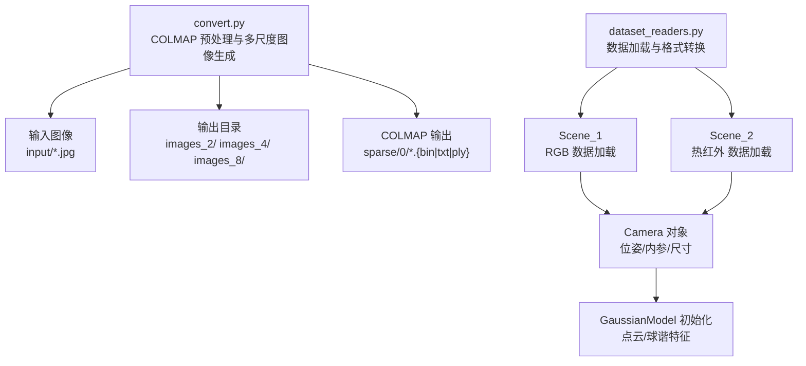
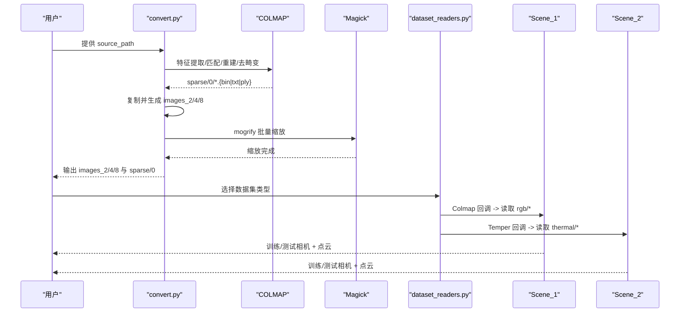
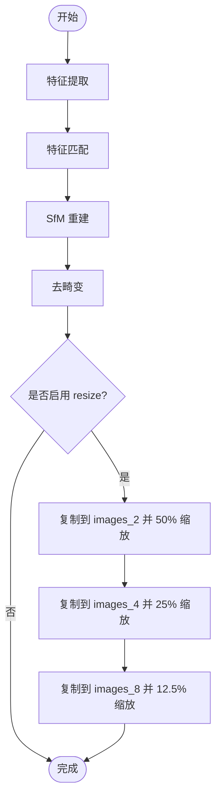
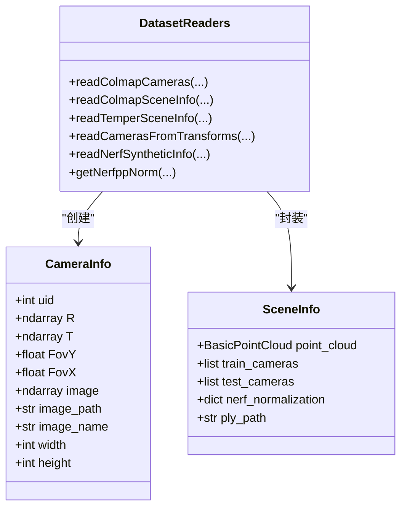
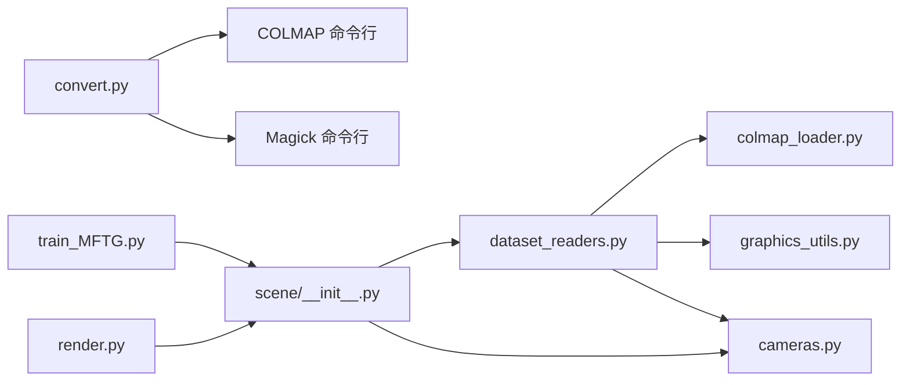

# 数据转换

<cite>
**本文引用的文件列表**
- [convert.py](file://convert.py)
- [dataset_readers.py](file://scene/dataset_readers.py)
- [colmap_loader.py](file://scene/colmap_loader.py)
- [cameras.py](file://scene/cameras.py)
- [__init__.py](file://scene/__init__.py)
- [graphics_utils.py](file://utils/graphics_utils.py)
- [image_utils.py](file://utils/image_utils.py)
- [loss_utils.py](file://utils/loss_utils.py)
- [README.md](file://README.md)
- [MFTG-Technical-Doc.md](file://MFTG-Technical-Doc.md)
- [train_MFTG.py](file://train_MFTG.py)
- [render.py](file://render.py)
</cite>

## 目录
1. [简介](#简介)
2. [项目结构](#项目结构)
3. [核心组件](#核心组件)
4. [架构总览](#架构总览)
5. [详细组件分析](#详细组件分析)
6. [依赖关系分析](#依赖关系分析)
7. [性能考量](#性能考量)
8. [故障排查指南](#故障排查指南)
9. [结论](#结论)
10. [附录](#附录)

## 简介
本技术文档围绕“数据转换系统”展开，聚焦于从原始图像数据到训练数据格式的完整转换流程，涵盖：
- 图像尺寸调整与格式标准化
- 元数据提取与相机位姿解析
- convert.py 脚本中的多尺度图像生成机制（images_2、images_4、images_8）
- Magick 工具在批量缩放中的使用
- dataset_readers.py 中的数据加载器实现，包括不同数据集类型的适配器模式与数据格式转换逻辑
- 自定义数据集格式的支持方法、数据验证规则与转换质量检查机制

本文件旨在帮助开发者快速理解并扩展该数据转换链路，确保多模态（RGB/热红外）场景的一致性与可复现性。

## 项目结构
该项目基于 COLMAP/SfM 与 3D 高斯渲染管线，数据准备阶段主要由 convert.py 执行 COLMAP 预处理与图像多尺度复制，随后由 dataset_readers.py 与 Scene_1/Scene_2 加载器读取 COLMAP 输出与图像目录，构建训练/测试相机集合与点云。

图表来源
- [convert.py:1-125](file://convert.py#L1-L125)
- [dataset_readers.py:136-181](file://scene/dataset_readers.py#L136-L181)
- [dataset_readers.py:184-230](file://scene/dataset_readers.py#L184-L230)
- [scene/__init__.py:21-94](file://scene/__init__.py#L21-L94)
- [scene/__init__.py:96-168](file://scene/__init__.py#L96-L168)

章节来源
- [README.md:28-61](file://README.md#L28-L61)
- [README.md:122-152](file://README.md#L122-L152)

## 核心组件
- convert.py：负责 COLMAP 特征提取、匹配、SfM 重建、去畸变与多尺度图像复制；调用外部工具（colmap、magick）。
- dataset_readers.py：定义 CameraInfo/SceneInfo，读取 COLMAP 内外参与点云，构造 Camera 列表与 Nerf 归一化参数；提供 Colmap/Temper/Blender 三种数据集类型回调。
- colmap_loader.py：解析 COLMAP 文本/二进制格式的 cameras/images/points3D，提供旋转矩阵与四元数互转、邻点读取等工具。
- scene/__init__.py：Scene_1/Scene_2 两类场景加载器，分别对接 RGB 与热红外数据目录，统一管理训练/测试相机与点云加载。
- utils/loss_utils.py：包含 SSIM、L1、平滑损失等，其中平滑损失用于热红外模态的物理先验约束。
- render.py：渲染脚本，分别加载 Scene_1/Scene_2 的高斯模型，生成 RGB 与热红外渲染图与 GT 对比。

章节来源
- [convert.py:18-125](file://convert.py#L18-L125)
- [dataset_readers.py:26-181](file://scene/dataset_readers.py#L26-L181)
- [colmap_loader.py:16-36](file://scene/colmap_loader.py#L16-L36)
- [scene/__init__.py:21-168](file://scene/__init__.py#L21-L168)
- [utils/loss_utils.py:98-114](file://utils/loss_utils.py#L98-L114)
- [render.py:25-76](file://render.py#L25-L76)

## 架构总览
整体数据转换与加载流程如下：

图表来源
- [convert.py:31-122](file://convert.py#L31-L122)
- [dataset_readers.py:307-311](file://scene/dataset_readers.py#L307-L311)
- [scene/__init__.py:43-49](file://scene/__init__.py#L43-L49)
- [scene/__init__.py:118-124](file://scene/__init__.py#L118-L124)

## 详细组件分析

### convert.py：COLMAP 预处理与多尺度图像生成
- COLMAP 预处理流程
  - 特征提取：从 input/ 目录读取图像，使用指定相机模型与 GPU 加速。
  - 特征匹配：穷举匹配数据库中的特征。
  - SfM 重建：mapper，设置全局 BA 容差以加速收敛。
  - 去畸变：将去畸变后的图像输出到根目录，同时将 sparse/ 下的文件移动到 sparse/0。
- 多尺度图像生成
  - 当启用 resize 时，复制 images/ 下的图像到 images_2、images_4、images_8。
  - 使用 magick 的 mogrify 对各层级进行 50%、25%、12.5% 缩放。
- 错误处理
  - 每一步外部命令返回非零码时记录错误并退出，避免后续步骤失败。

图表来源
- [convert.py:31-122](file://convert.py#L31-L122)

章节来源
- [convert.py:18-125](file://convert.py#L18-L125)

### dataset_readers.py：数据加载器与格式转换
- 数据结构
  - CameraInfo：包含位姿 R/T、视场角 FovX/FovY、图像数组与尺寸等。
  - SceneInfo：包含点云、训练/测试相机列表、Nerf 归一化参数与点云路径。
- COLMAP 相机读取
  - 支持 SIMPLE_PINHOLE/PINHOLE 模型，计算 FovX/FovY。
  - 从 images_folder 读取对应图像，构建 CameraInfo 列表。
- 点云读取与存储
  - 优先读取二进制 points3D，否则回退文本格式；首次运行将 points3D.bin/txt 转换为 .ply。
- 场景加载回调
  - Colmap：读取 rgb/train 与 rgb/test。
  - Temper：读取 thermal/train 与 thermal/test，共享 COLMAP 位姿。
  - Blender：读取 transforms_{train,test}.json，生成随机点云（合成数据集）。
- Nerf 归一化
  - 基于相机中心计算平移与半径，用于坐标归一化。

图表来源
- [dataset_readers.py:26-44](file://scene/dataset_readers.py#L26-L44)
- [dataset_readers.py:68-109](file://scene/dataset_readers.py#L68-L109)
- [dataset_readers.py:136-181](file://scene/dataset_readers.py#L136-L181)
- [dataset_readers.py:184-230](file://scene/dataset_readers.py#L184-L230)
- [dataset_readers.py:232-305](file://scene/dataset_readers.py#L232-L305)

章节来源
- [dataset_readers.py:26-181](file://scene/dataset_readers.py#L26-L181)
- [dataset_readers.py:184-305](file://scene/dataset_readers.py#L184-L305)

### colmap_loader.py：COLMAP 文件解析工具
- 相机模型枚举与 ID 映射，支持多种 PINHOLE/OPENCV 系列。
- 四元数与旋转矩阵互转，保证位姿一致性。
- 读取 points3D 的二进制/文本格式，返回坐标、颜色与误差。
- 读取 cameras/images 的二进制/文本格式，返回相机内参与图像外参。

章节来源
- [colmap_loader.py:16-36](file://scene/colmap_loader.py#L16-L36)
- [colmap_loader.py:43-66](file://scene/colmap_loader.py#L43-L66)
- [colmap_loader.py:83-154](file://scene/colmap_loader.py#L83-L154)
- [colmap_loader.py:156-270](file://scene/colmap_loader.py#L156-L270)

### scene/__init__.py：Scene_1/Scene_2 场景加载器
- Scene_1：面向 Colmap 数据集，加载 rgb/*，点云来自 sparse/0/。
- Scene_2：面向 Temper 数据集，加载 thermal/*，共享 COLMAP 位姿。
- 统一管理训练/测试相机集合，支持多分辨率缩放；支持从 checkpoint 加载高斯点云。

章节来源
- [scene/__init__.py:21-94](file://scene/__init__.py#L21-L94)
- [scene/__init__.py:96-168](file://scene/__init__.py#L96-L168)

### cameras.py：相机对象与投影矩阵
- Camera：封装原始图像、位姿、视场角、投影矩阵与相机中心，支持透明度掩码乘法。
- MiniCam：轻量相机对象，便于网络传输与 GUI 交互。

章节来源
- [cameras.py:17-72](file://scene/cameras.py#L17-L72)

### utils/loss_utils.py：损失函数与平滑先验
- SSIM/L1 损失：用于 RGB/热红外渲染与 GT 的比较。
- 平滑损失：对热红外图像施加邻域平滑先验，抑制噪声与不连续。

章节来源
- [utils/loss_utils.py:36-66](file://utils/loss_utils.py#L36-L66)
- [utils/loss_utils.py:98-114](file://utils/loss_utils.py#L98-L114)

### render.py：渲染流程与输出组织
- 分别加载 Scene_1/Scene_2 的高斯模型，生成 RGB 与热红外渲染图与 GT。
- 输出路径按 rgb_train/thermal_train/rgb_test/thermal_test 组织，便于评估。

章节来源
- [render.py:25-76](file://render.py#L25-L76)

## 依赖关系分析
- convert.py 依赖外部工具 colmap 与 magick，内部通过命令行调用执行。
- dataset_readers.py 依赖 colmap_loader 解析 COLMAP 输出，依赖 PIL 读取图像，依赖 utils.graphics_utils 计算相机变换与视场角。
- scene/__init__.py 依赖 dataset_readers 的回调字典，按数据集类型选择加载策略。
- train_MFTG.py 与 render.py 依赖 Scene_1/Scene_2 与 GaussianModel，实现两阶段训练与渲染。

图表来源
- [convert.py:27-28](file://convert.py#L27-L28)
- [dataset_readers.py:16-24](file://scene/dataset_readers.py#L16-L24)
- [scene/__init__.py:16-19](file://scene/__init__.py#L16-L19)

章节来源
- [convert.py:18-125](file://convert.py#L18-L125)
- [dataset_readers.py:16-24](file://scene/dataset_readers.py#L16-L24)
- [scene/__init__.py:16-19](file://scene/__init__.py#L16-L19)

## 性能考量
- COLMAP 预处理
  - 使用 GPU 加速特征提取与匹配可显著缩短耗时；若硬件不支持 GPU，可通过参数禁用。
  - 适当降低 BA 容差可提升收敛速度，但需平衡精度。
- 多尺度图像生成
  - images_2/4/8 为训练提供多分辨率输入，有助于自适应密度控制与内存占用管理。
  - magick 批量缩放为 CPU 密集操作，建议在具备足够 CPU 资源的环境中执行。
- 数据加载
  - Scene_1/Scene_2 支持多分辨率相机集合，训练时按分辨率缩放参数动态选择，减少不必要的内存压力。
- 渲染与评估
  - render.py 分别渲染 RGB 与热红外，输出路径清晰，便于后续 metrics 计算。

[本节为通用性能讨论，无需列出具体文件来源]

## 故障排查指南
- COLMAP 命令失败
  - 现象：特征提取/匹配/重建/去畸变返回非零码。
  - 排查：确认 colmap_executable 路径正确；检查输入图像格式与命名；确保磁盘空间充足。
  - 参考：[convert.py:42-44](file://convert.py#L42-L44)、[convert.py:52-54](file://convert.py#L52-L54)、[convert.py:65-67](file://convert.py#L65-L67)、[convert.py:77-79](file://convert.py#L77-L79)
- Magick 缩放失败
  - 现象：50%/25%/12.5% 缩放返回非零码。
  - 排查：确认 magick_executable 路径；检查 images/ 目录权限；确保图像未损坏。
  - 参考：[convert.py:105-108](file://convert.py#L105-L108)、[convert.py:112-115](file://convert.py#L112-L115)、[convert.py:119-122](file://convert.py#L119-L122)
- 数据集类型识别失败
  - 现象：找不到 sparse 或 transforms_train.json，抛出异常。
  - 排查：确认数据集目录结构与 README 规范一致；检查文件是否存在。
  - 参考：[scene/__init__.py:43-49](file://scene/__init__.py#L43-L49)、[scene/__init__.py:118-124](file://scene/__init__.py#L118-L124)
- 点云转换失败
  - 现象：首次运行无法读取 points3D.bin/txt 或转换 .ply 失败。
  - 排查：确认 sparse/0/ 下存在相应文件；检查权限与磁盘空间。
  - 参考：[dataset_readers.py:164-170](file://scene/dataset_readers.py#L164-L170)
- 渲染路径缺失
  - 现象：render.py 报错找不到输出目录。
  - 排查：确认输出路径存在；检查模型迭代号是否正确。
  - 参考：[render.py:25-40](file://render.py#L25-L40)

章节来源
- [convert.py:31-122](file://convert.py#L31-L122)
- [scene/__init__.py:43-49](file://scene/__init__.py#L43-L49)
- [scene/__init__.py:118-124](file://scene/__init__.py#L118-L124)
- [dataset_readers.py:164-170](file://scene/dataset_readers.py#L164-L170)
- [render.py:25-40](file://render.py#L25-L40)

## 结论
本数据转换系统通过 convert.py 完成 COLMAP 预处理与多尺度图像生成，借助 dataset_readers.py 与 Scene_1/Scene_2 实现对 RGB 与热红外数据集的统一加载与格式转换。系统提供了清晰的目录结构约定、完善的错误处理与可扩展的适配器模式，能够支撑多模态 3D 高斯渲染的训练与评估流程。对于自定义数据集，只需遵循 COLMAP 输出与图像目录规范，即可无缝接入现有加载链路。

[本节为总结性内容，无需列出具体文件来源]

## 附录

### 自定义数据集格式支持方法
- 目录结构
  - 输入图像：input/
  - RGB 图像：rgb/train 与 rgb/test
  - 热红外图像：thermal/train 与 thermal/test
  - COLMAP 输出：sparse/0/{cameras.bin|images.bin|points3D.bin|txt|ply}
- 数据配对
  - rgb/train 与 thermal/train 中的图像需同名；thermal 图像共享 COLMAP 位姿。
- 适配器模式扩展
  - 在 dataset_readers.py 中新增数据集类型回调，参考 readTemperSceneInfo 的实现，按需读取新目录与图像。
  - 在 scene/__init__.py 的 sceneLoadTypeCallbacks 中注册新类型，以便 Scene_1/Scene_2 识别。
- 数据验证规则
  - 检查 sparse/0/ 下是否存在 cameras.bin/images.bin/points3D.bin/txt。
  - 检查 rgb/thermal/train 与 test 目录中的图像数量与命名一致性。
  - 检查图像尺寸与 COLMAP 内参一致。
- 转换质量检查机制
  - 使用 render.py 生成渲染图与 GT 对比，结合 utils/image_utils.py 的 PSNR 与 utils/loss_utils.py 的 SSIM/L1/平滑损失进行质量评估。
  - 参考：[render.py:25-76](file://render.py#L25-L76)、[utils/image_utils.py:14-20](file://utils/image_utils.py#L14-L20)、[utils/loss_utils.py:98-114](file://utils/loss_utils.py#L98-L114)

章节来源
- [README.md:28-61](file://README.md#L28-L61)
- [README.md:122-152](file://README.md#L122-L152)
- [dataset_readers.py:184-230](file://scene/dataset_readers.py#L184-L230)
- [scene/__init__.py:307-311](file://scene/__init__.py#L307-L311)
- [render.py:25-76](file://render.py#L25-L76)
- [utils/image_utils.py:14-20](file://utils/image_utils.py#L14-L20)
- [utils/loss_utils.py:98-114](file://utils/loss_utils.py#L98-L114)