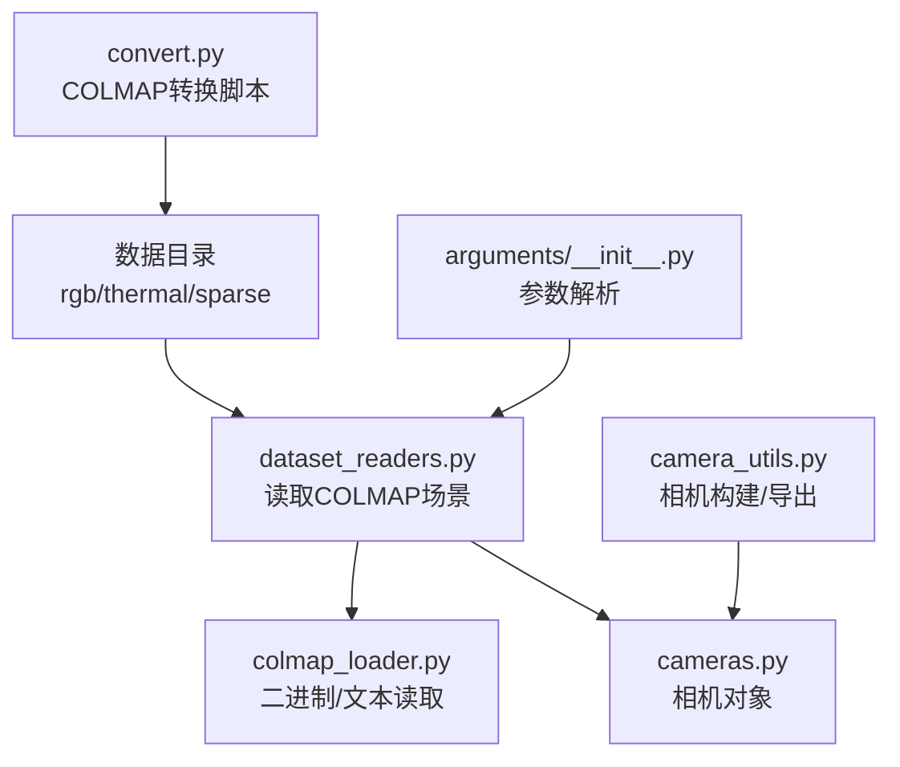
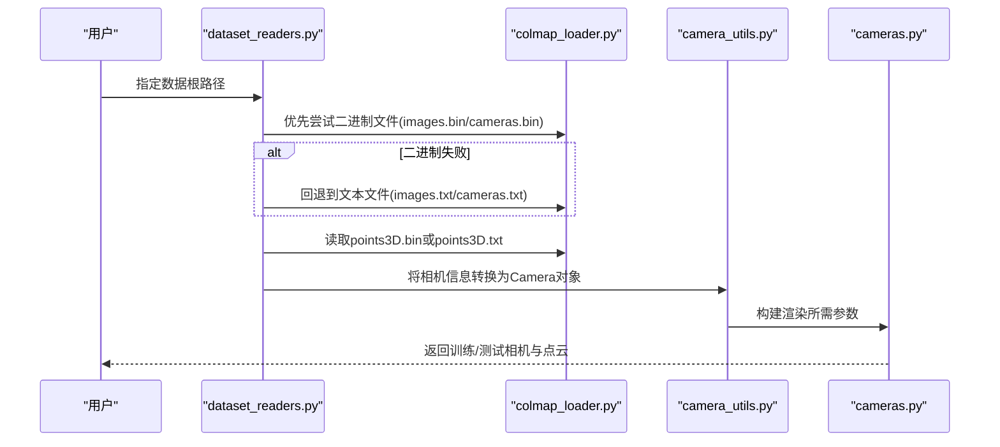
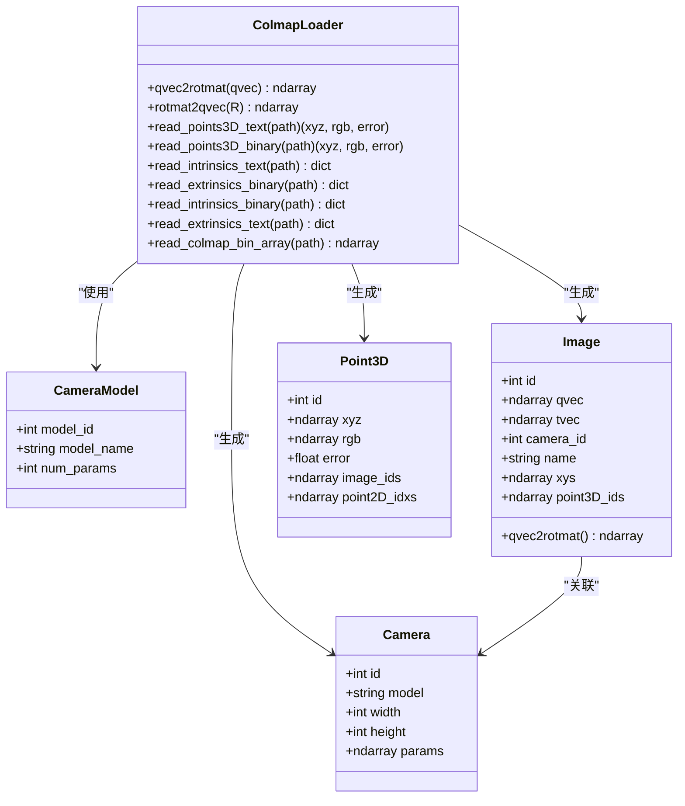
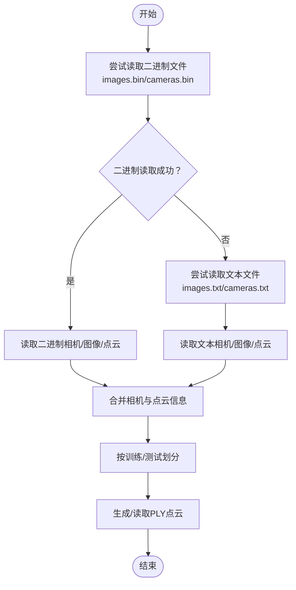
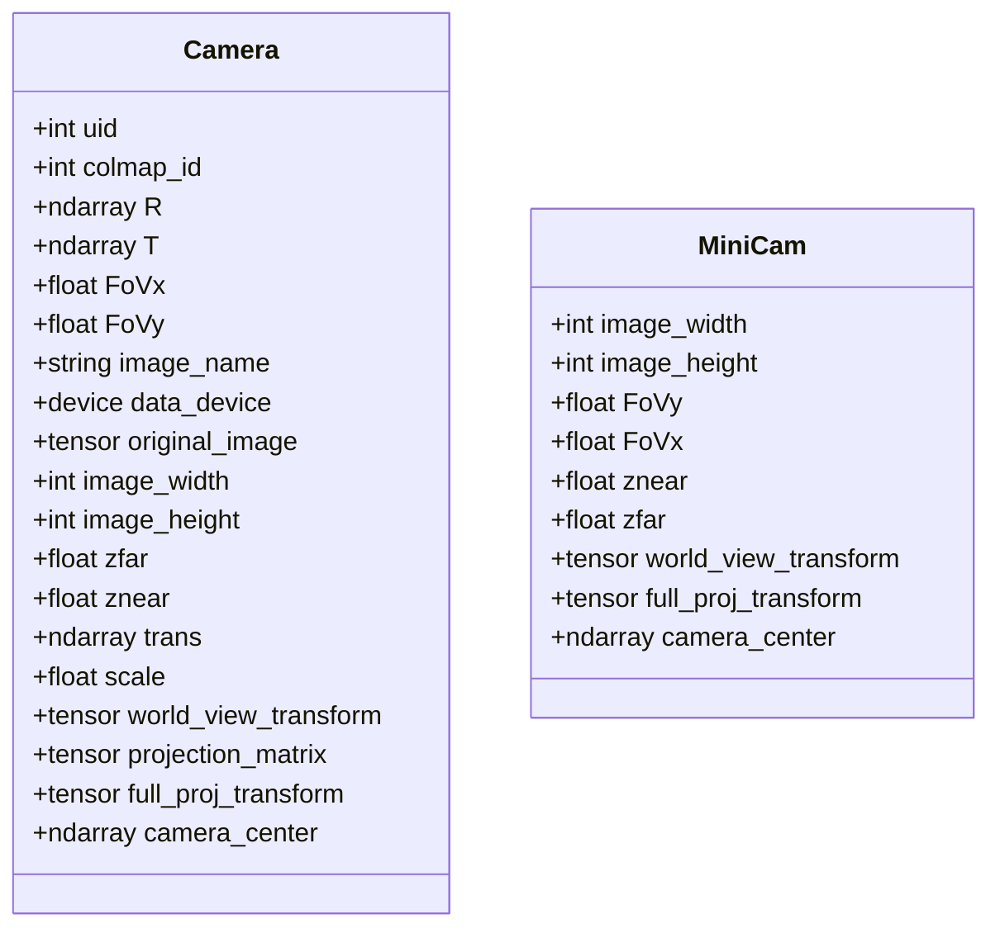
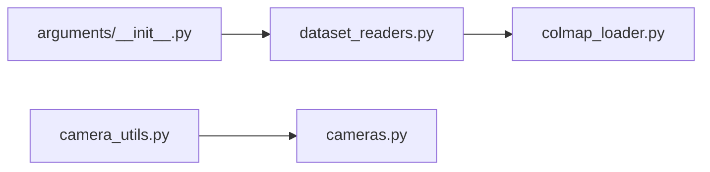

# COLMAP集成模块

<cite>
**本文引用的文件**
- [colmap_loader.py](file://scene/colmap_loader.py)
- [dataset_readers.py](file://scene/dataset_readers.py)
- [cameras.py](file://scene/cameras.py)
- [camera_utils.py](file://utils/camera_utils.py)
- [README.md](file://README.md)
- [convert.py](file://convert.py)
- [arguments/__init__.py](file://arguments/__init__.py)
</cite>

## 目录
1. [简介](#简介)
2. [项目结构](#项目结构)
3. [核心组件](#核心组件)
4. [架构总览](#架构总览)
5. [详细组件分析](#详细组件分析)
6. [依赖关系分析](#依赖关系分析)
7. [性能考量](#性能考量)
8. [故障排查指南](#故障排查指南)
9. [结论](#结论)
10. [附录](#附录)

## 简介
本文件面向开发者，系统化梳理 Thermal-Gaussian 项目中的 COLMAP 集成模块，重点覆盖以下方面：
- 读取 COLMAP 稀疏重建结果（二进制与文本格式）的兼容机制
- 相机内外参数提取流程：四元数到旋转矩阵、焦距与视场角换算
- 图像与 3D 点云的关联机制：2D 特征点与 3D 空间点的匹配
- COLMAP 数据格式详解：images.bin、cameras.bin、points3D.bin 等
- 实际使用示例与常见问题解决方案

该模块基于 3DGS（3D Gaussian Splatting）框架，支持从 COLMAP 输出的稀疏重建中加载相机姿态、内参以及点云，并将其转换为渲染管线可用的数据结构。

## 项目结构
COLMAP 集成主要分布在以下文件中：
- 场景数据读取与转换：scene/dataset_readers.py
- COLMAP 文件读取器：scene/colmap_loader.py
- 相机类与渲染参数：scene/cameras.py
- 相机对象构建与导出：utils/camera_utils.py
- 数据准备与 COLMAP 转换脚本：convert.py
- 参数与命令行：arguments/__init__.py
- 使用说明与数据结构：README.md

图表来源
- [dataset_readers.py:136-181](file://scene/dataset_readers.py#L136-L181)
- [colmap_loader.py:125-154](file://scene/colmap_loader.py#L125-L154)
- [cameras.py:17-58](file://scene/cameras.py#L17-L58)
- [camera_utils.py:19-52](file://utils/camera_utils.py#L19-L52)
- [convert.py:31-88](file://convert.py#L31-L88)
- [arguments/__init__.py:47-62](file://arguments/__init__.py#L47-L62)

章节来源
- [README.md:31-60](file://README.md#L31-L60)
- [dataset_readers.py:136-181](file://scene/dataset_readers.py#L136-L181)

## 核心组件
- COLMAP 文件读取器：提供二进制与文本格式的 cameras.bin/images.bin/points3D.bin 的读取能力；定义相机模型集合与命名元组结构。
- 场景读取器：根据输入路径自动选择二进制或文本格式，读取相机外参、内参与点云，并生成训练/测试相机列表与点云。
- 相机对象：封装渲染所需的位姿、视场角、投影矩阵等参数。
- 相机工具：负责将读取到的相机信息转换为可渲染的 Camera 对象，并支持 JSON 导出。

章节来源
- [colmap_loader.py:16-41](file://scene/colmap_loader.py#L16-L41)
- [dataset_readers.py:68-109](file://scene/dataset_readers.py#L68-L109)
- [cameras.py:17-58](file://scene/cameras.py#L17-L58)
- [camera_utils.py:19-52](file://utils/camera_utils.py#L19-L52)

## 架构总览
COLMAP 集成采用“读取-转换-渲染”的分层架构：
- 输入层：COLMAP 输出的 sparse/0 下的 images.bin/cameras.bin/points3D.bin 或 images.txt/cameras.txt/points3D.txt
- 处理层：二进制/文本读取器解析文件，生成相机与点云数据结构
- 应用层：场景读取器组织训练/测试相机与点云，相机工具构建渲染对象

图表来源
- [dataset_readers.py:136-181](file://scene/dataset_readers.py#L136-L181)
- [colmap_loader.py:125-154](file://scene/colmap_loader.py#L125-L154)
- [camera_utils.py:19-52](file://utils/camera_utils.py#L19-L52)
- [cameras.py:17-58](file://scene/cameras.py#L17-L58)

## 详细组件分析

### COLMAP 文件读取器（colmap_loader.py）
- 相机模型定义：包含多种相机模型（如 SIMPLE_PINHOLE、PINHOLE、OPENCV 等），并建立模型 ID/名称与参数个数的映射。
- 位姿转换：提供四元数到旋转矩阵的转换函数，以及逆向转换。
- 二进制读取：
  - images.bin：读取每张图像的 qvec、tvec、camera_id、点云索引序列等
  - cameras.bin：读取相机 ID、模型名、宽高、参数数组
  - points3D.bin：读取每个点的 xyz、rgb、误差及观测轨迹
- 文本读取：
  - images.txt：逐行解析图像姿态、相机 ID、2D 关键点与 3D 点索引
  - cameras.txt：逐行解析相机模型、宽高与参数
  - points3D.txt：逐行解析点坐标、颜色与误差
- 辅助读取：支持 COLMAP 二进制深度图等其他二进制数组

图表来源
- [colmap_loader.py:16-41](file://scene/colmap_loader.py#L16-L41)
- [colmap_loader.py:43-66](file://scene/colmap_loader.py#L43-L66)
- [colmap_loader.py:83-154](file://scene/colmap_loader.py#L83-L154)
- [colmap_loader.py:180-241](file://scene/colmap_loader.py#L180-L241)
- [colmap_loader.py:273-295](file://scene/colmap_loader.py#L273-L295)

章节来源
- [colmap_loader.py:16-41](file://scene/colmap_loader.py#L16-L41)
- [colmap_loader.py:43-66](file://scene/colmap_loader.py#L43-L66)
- [colmap_loader.py:83-154](file://scene/colmap_loader.py#L83-L154)
- [colmap_loader.py:180-241](file://scene/colmap_loader.py#L180-L241)
- [colmap_loader.py:273-295](file://scene/colmap_loader.py#L273-L295)

### 场景读取器（dataset_readers.py）
- 自动回退策略：优先尝试 sparse/0 下的二进制文件，若失败则回退到文本文件
- 相机读取：通过读取 images.bin/images.txt 获取外参，通过 cameras.bin/cameras.txt 获取内参
- 视场角计算：根据相机模型（SIMPLE_PINHOLE/PINHOLE）将焦距转换为视场角
- 点云处理：优先使用 points3D.bin，否则回退到 points3D.txt；首次访问时生成 .ply 缓存
- 训练/测试划分：分别读取 rgb/train、rgb/test 与 thermal/train、thermal/test 中的图像

图表来源
- [dataset_readers.py:136-181](file://scene/dataset_readers.py#L136-L181)
- [dataset_readers.py:185-230](file://scene/dataset_readers.py#L185-L230)

章节来源
- [dataset_readers.py:68-109](file://scene/dataset_readers.py#L68-L109)
- [dataset_readers.py:136-181](file://scene/dataset_readers.py#L136-L181)
- [dataset_readers.py:185-230](file://scene/dataset_readers.py#L185-L230)

### 相机对象与渲染参数（cameras.py）
- 相机类封装：包含位姿 R/T、视场角 FoVx/FoVy、图像尺寸、设备、投影矩阵等
- 渲染矩阵：构造世界到相机变换与投影矩阵，并计算相机中心
- MiniCam：轻量相机容器，便于在推理阶段传递渲染参数

图表来源
- [cameras.py:17-58](file://scene/cameras.py#L17-L58)
- [cameras.py:59-72](file://scene/cameras.py#L59-L72)

章节来源
- [cameras.py:17-58](file://scene/cameras.py#L17-L58)
- [cameras.py:59-72](file://scene/cameras.py#L59-L72)

### 相机工具（camera_utils.py）
- 相机构建：根据 CameraInfo（由 dataset_readers 生成）创建 Camera 对象，支持分辨率缩放与遮罩处理
- JSON 导出：将相机位姿、尺寸与焦距导出为 JSON 字段，用于可视化或调试

章节来源
- [camera_utils.py:19-52](file://utils/camera_utils.py#L19-L52)
- [camera_utils.py:62-82](file://utils/camera_utils.py#L62-L82)

### 数据准备与 COLMAP 转换（convert.py）
- 功能：自动化执行特征提取、特征匹配、束调（mapper）、图像去畸变与输出重排
- 输出：生成 undistorted 的 images 与 sparse/0 下的 cameras.bin/images.bin/points3D.bin

章节来源
- [convert.py:31-88](file://convert.py#L31-L88)

## 依赖关系分析
- dataset_readers 依赖 colmap_loader 提供的二进制/文本读取函数
- camera_utils 依赖 cameras.Camera 类与 utils.graphics_utils 的焦距/视场角转换函数
- arguments 提供命令行参数，驱动 dataset_readers 的场景加载入口

图表来源
- [dataset_readers.py:16-18](file://scene/dataset_readers.py#L16-L18)
- [camera_utils.py:12-15](file://utils/camera_utils.py#L12-L15)
- [arguments/__init__.py:47-62](file://arguments/__init__.py#L47-L62)

章节来源
- [dataset_readers.py:16-18](file://scene/dataset_readers.py#L16-L18)
- [camera_utils.py:12-15](file://utils/camera_utils.py#L12-L15)
- [arguments/__init__.py:47-62](file://arguments/__init__.py#L47-L62)

## 性能考量
- 二进制文件读取：二进制格式比文本格式更快，建议优先使用 images.bin/cameras.bin/points3D.bin
- 点云缓存：首次访问时将 points3D.bin/txt 转换为 PLY 并缓存，后续直接读取 PLY，避免重复转换开销
- 分辨率缩放：camera_utils 支持按分辨率参数动态调整图像尺寸，降低显存占用
- 批量处理：dataset_readers 对相机列表进行排序，便于稳定训练与评估

## 故障排查指南
- 二进制文件缺失或损坏
  - 现象：读取 images.bin/cameras.bin 抛出异常
  - 解决：回退到 images.txt/cameras.txt；确保 COLMAP 转换步骤完整执行
  - 参考路径：[dataset_readers.py:136-146](file://scene/dataset_readers.py#L136-L146)
- 点云文件不存在
  - 现象：首次访问 sparse/0/points3D.ply 不存在
  - 解决：自动尝试读取 points3D.bin 或 points3D.txt 并生成 PLY
  - 参考路径：[dataset_readers.py:161-170](file://scene/dataset_readers.py#L161-L170)
- 相机模型不支持
  - 现象：读取到非 PINHOLE/SIMPLE_PINHOLE 的相机模型
  - 解决：确保使用 image_undistorter 生成理想针孔内参；或扩展 dataset_readers 的相机模型分支
  - 参考路径：[dataset_readers.py:86-96](file://scene/dataset_readers.py#L86-L96)
- 图像路径不匹配
  - 现象：无法找到 rgb/test 或 thermal/test 下的图像
  - 解决：检查数据目录结构与 images.bin 中的图像名称是否一致
  - 参考路径：[README.md:31-60](file://README.md#L31-L60)
- 分辨率过大导致显存不足
  - 现象：输入图像超过 1600 像素宽度
  - 解决：设置 --resolution 参数或在 convert.py 中进行多级缩放
  - 参考路径：[camera_utils.py:22-39](file://utils/camera_utils.py#L22-L39)

## 结论
本 COLMAP 集成模块提供了对稀疏重建结果的稳健读取与转换能力，支持二进制与文本格式的自动回退、相机内外参数的准确提取、以及图像与点云的关联机制。通过合理的数据结构与工具链，开发者可以高效地将 COLMAP 输出接入 Thermal-Gaussian 的渲染与优化流程。

## 附录

### COLMAP 数据格式说明
- cameras.bin
  - 每个相机记录：相机 ID、模型 ID、宽、高、参数数组
  - 模型 ID 映射到模型名与参数个数，用于后续内参解析
  - 参考路径：[colmap_loader.py:215-241](file://scene/colmap_loader.py#L215-L241)
- images.bin
  - 每个图像记录：图像 ID、四元数姿态、平移向量、相机 ID、图像名（以空字符结尾）、2D 关键点坐标与对应的 3D 点索引
  - 参考路径：[colmap_loader.py:180-212](file://scene/colmap_loader.py#L180-L212)
- points3D.bin
  - 每个点记录：xyz、rgb、误差、观测轨迹长度与轨迹（图像 ID 与关键点索引对）
  - 参考路径：[colmap_loader.py:125-154](file://scene/colmap_loader.py#L125-L154)
- cameras.txt（文本）
  - 每行记录：相机 ID、模型名、宽、高、参数
  - 参考路径：[colmap_loader.py:156-178](file://scene/colmap_loader.py#L156-L178)
- images.txt（文本）
  - 每行记录：图像 ID、四元数、平移、相机 ID、图像名；随后一行记录 2D 关键点与 3D 点索引
  - 参考路径：[colmap_loader.py:244-270](file://scene/colmap_loader.py#L244-L270)
- points3D.txt（文本）
  - 每行记录：点 ID、xyz、rgb、误差；随后若干行记录观测轨迹（图像 ID 与关键点索引）
  - 参考路径：[colmap_loader.py:83-123](file://scene/colmap_loader.py#L83-L123)

### 实际使用示例
- 数据准备
  - 使用 convert.py 运行 COLMAP 流程，生成 undistorted 的 images 与 sparse/0 下的二进制文件
  - 参考路径：[convert.py:31-88](file://convert.py#L31-L88)
- 加载场景
  - 指定数据根路径，自动选择二进制或文本格式，读取相机与点云
  - 参考路径：[dataset_readers.py:136-181](file://scene/dataset_readers.py#L136-L181)
- 训练与渲染
  - 通过 arguments 配置参数，启动训练脚本进行优化
  - 参考路径：[arguments/__init__.py:47-62](file://arguments/__init__.py#L47-L62)