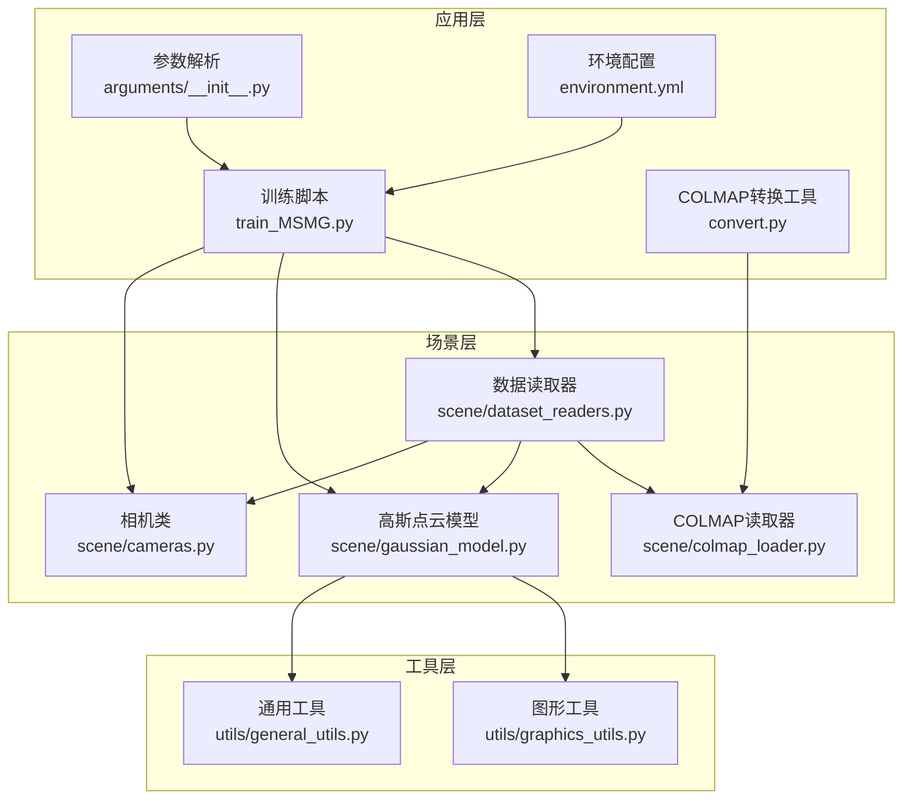
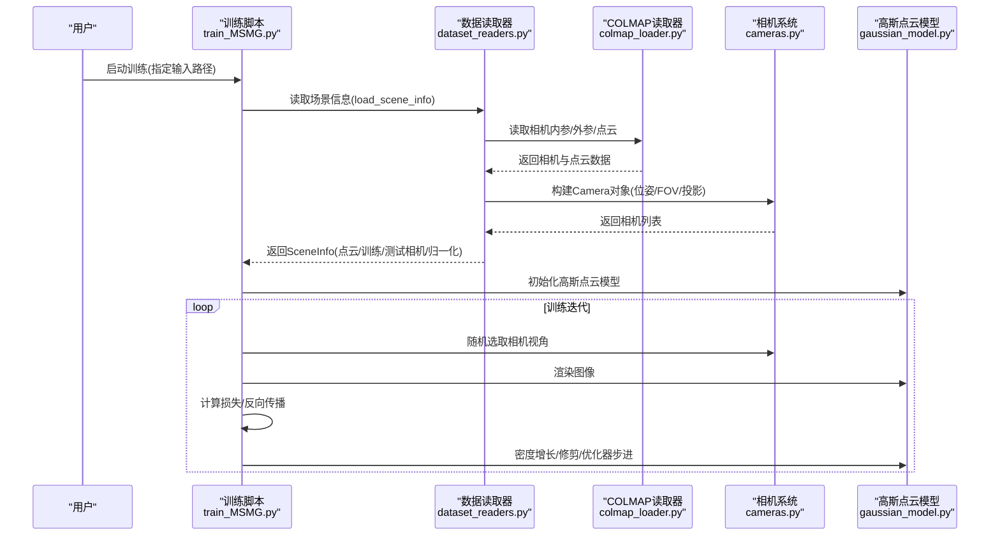
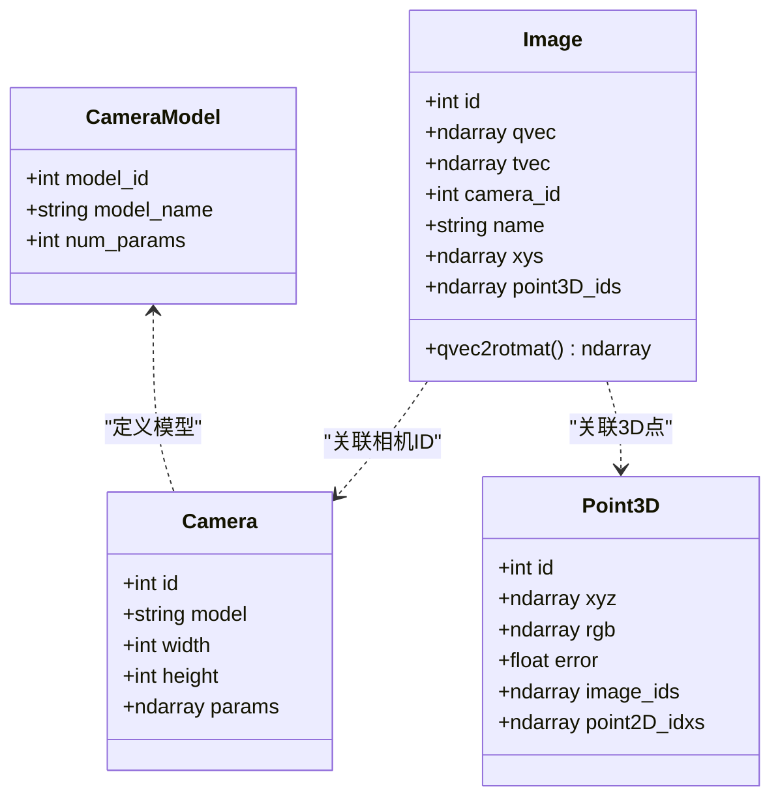
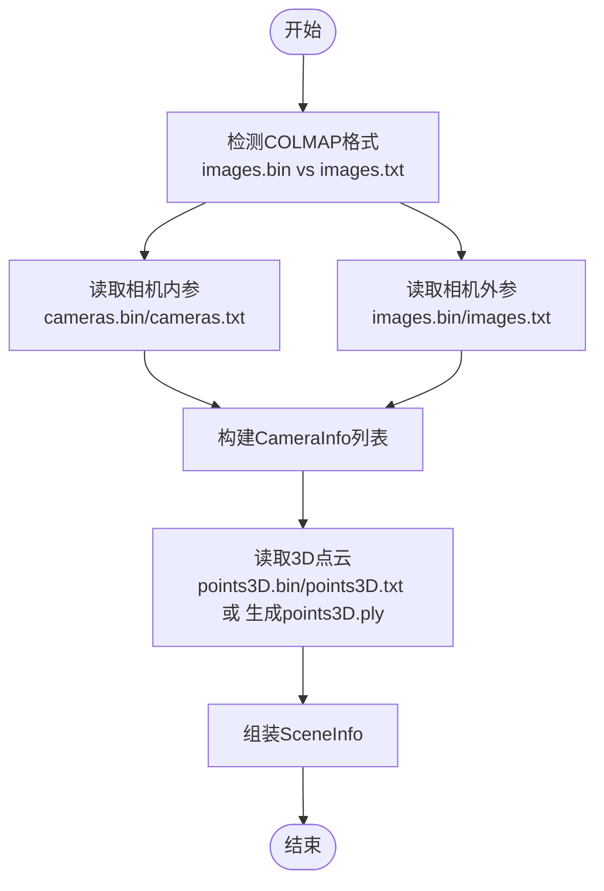
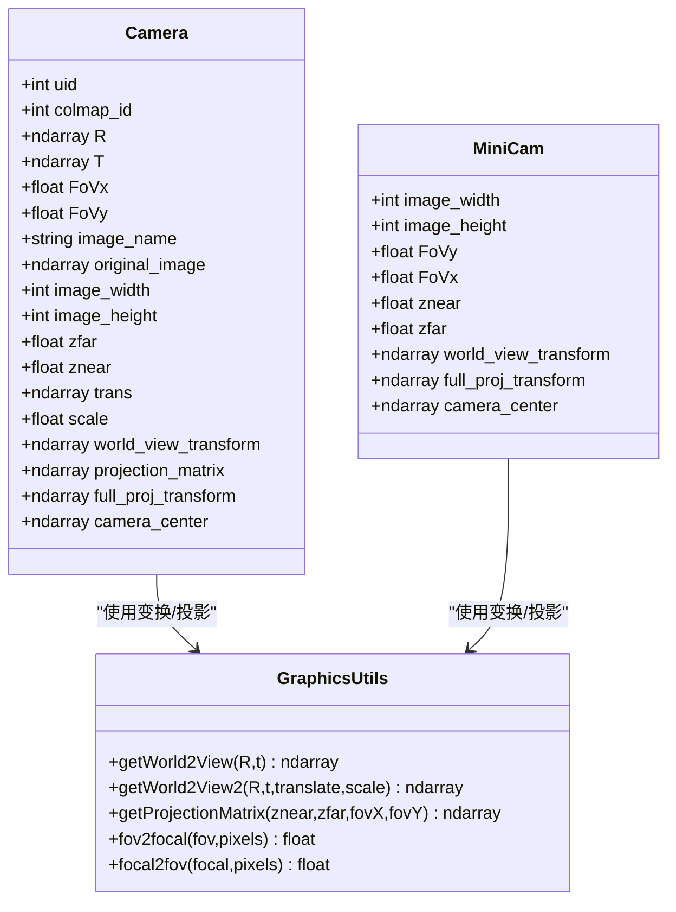
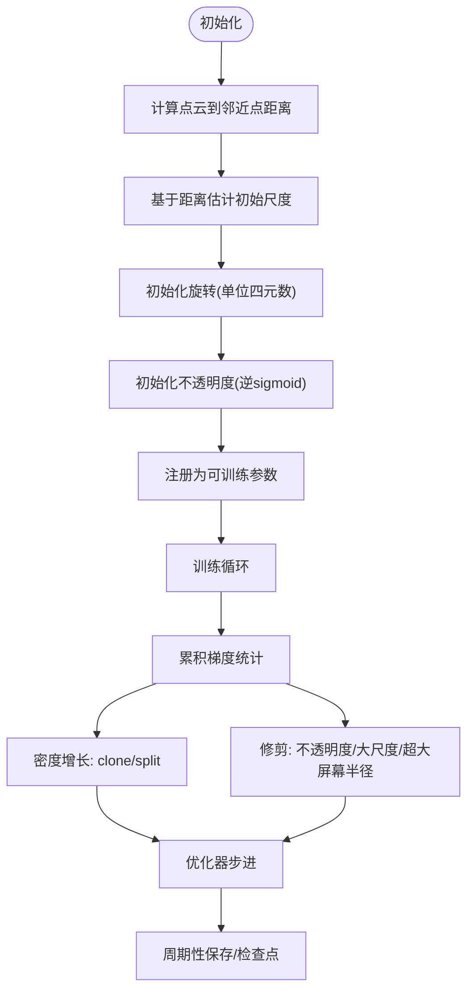
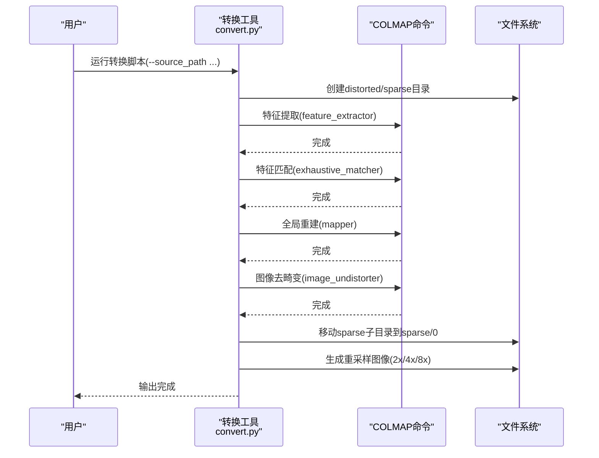
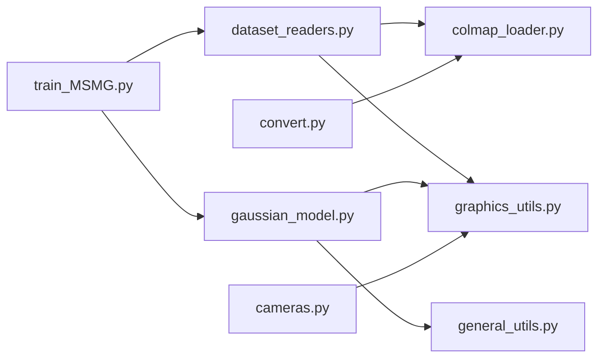

# 场景管理系统

<cite>
**本文档引用的文件**
- [README.md](file://README.md)
- [scene/colmap_loader.py](file://scene/colmap_loader.py)
- [scene/dataset_readers.py](file://scene/dataset_readers.py)
- [scene/cameras.py](file://scene/cameras.py)
- [scene/gaussian_model.py](file://scene/gaussian_model.py)
- [utils/graphics_utils.py](file://utils/graphics_utils.py)
- [utils/general_utils.py](file://utils/general_utils.py)
- [convert.py](file://convert.py)
- [train_MSMG.py](file://train_MSMG.py)
- [arguments/__init__.py](file://arguments/__init__.py)
- [environment.yml](file://environment.yml)
</cite>

## 目录
1. [简介](#简介)
2. [项目结构](#项目结构)
3. [核心组件](#核心组件)
4. [架构总览](#架构总览)
5. [详细组件分析](#详细组件分析)
6. [依赖关系分析](#依赖关系分析)
7. [性能考虑](#性能考虑)
8. [故障排查指南](#故障排查指南)
9. [结论](#结论)
10. [附录](#附录)

## 简介
本项目为“热成像3D高斯点云场景管理系统”，基于3D高斯点云渲染框架，支持从COLMAP稀疏重建结果中读取相机内外参与3D点云，并结合RGB与热成像多模态数据进行联合优化与渲染。系统提供：
- 数据加载器：支持COLMAP二进制/文本格式、NeRF合成数据集、以及温度图像数据集
- 相机系统：内参、外参、畸变模型、视锥体投影矩阵
- 高斯点云模型：可微分的点云表示、密度增长与修剪、优化器与学习率调度
- 数据集格式转换工具：自动COLMAP特征提取、匹配、重建与图像去畸变
- 批量训练与评估：多场景并行训练、可视化与指标计算

## 项目结构
项目采用按功能域划分的目录结构，核心模块如下：
- scene：场景数据与相机抽象、COLMAP读取器、高斯点云模型
- utils：通用图形与数学工具（点云结构、变换、FOV与焦距换算）
- 训练脚本：多版本训练入口（MSMG/MFTG/OMMG），参数解析与训练循环
- 转换工具：COLMAP自动化管线与图像重采样

**图表来源**
- [scene/colmap_loader.py:1-295](file://scene/colmap_loader.py#L1-L295)
- [scene/dataset_readers.py:1-311](file://scene/dataset_readers.py#L1-L311)
- [scene/cameras.py:1-72](file://scene/cameras.py#L1-L72)
- [scene/gaussian_model.py:1-407](file://scene/gaussian_model.py#L1-L407)
- [utils/graphics_utils.py:1-77](file://utils/graphics_utils.py#L1-L77)
- [utils/general_utils.py:1-134](file://utils/general_utils.py#L1-L134)
- [convert.py:1-125](file://convert.py#L1-L125)
- [train_MSMG.py:1-314](file://train_MSMG.py#L1-L314)
- [arguments/__init__.py:1-113](file://arguments/__init__.py#L1-L113)
- [environment.yml:1-17](file://environment.yml#L1-L17)

**章节来源**
- [README.md:1-167](file://README.md#L1-L167)
- [scene/colmap_loader.py:1-295](file://scene/colmap_loader.py#L1-L295)
- [scene/dataset_readers.py:1-311](file://scene/dataset_readers.py#L1-L311)
- [scene/cameras.py:1-72](file://scene/cameras.py#L1-L72)
- [scene/gaussian_model.py:1-407](file://scene/gaussian_model.py#L1-L407)
- [utils/graphics_utils.py:1-77](file://utils/graphics_utils.py#L1-L77)
- [utils/general_utils.py:1-134](file://utils/general_utils.py#L1-L134)
- [convert.py:1-125](file://convert.py#L1-L125)
- [train_MSMG.py:1-314](file://train_MSMG.py#L1-L314)
- [arguments/__init__.py:1-113](file://arguments/__init__.py#L1-L113)
- [environment.yml:1-17](file://environment.yml#L1-L17)

## 核心组件
- COLMAP集成模块：读取稀疏重建结果（相机内参、外参、3D点云），支持二进制与文本格式，兼容多种相机模型
- 数据读取器：统一场景信息（点云、训练/测试相机列表、归一化参数）；支持COLMAP、温度图像、NeRF合成数据集
- 相机系统：封装相机位姿、视图变换、投影矩阵、视锥体参数
- 高斯点云模型：点云参数化、协方差构建、密度增长与修剪、优化器与学习率调度
- 图形工具：基础点云结构、世界到相机变换、投影矩阵、FOV与焦距换算
- 转换工具：COLMAP自动化管线（特征提取、匹配、重建、图像去畸变）、图像重采样

**章节来源**
- [scene/colmap_loader.py:12-41](file://scene/colmap_loader.py#L12-L41)
- [scene/dataset_readers.py:26-44](file://scene/dataset_readers.py#L26-L44)
- [scene/cameras.py:17-58](file://scene/cameras.py#L17-L58)
- [scene/gaussian_model.py:24-59](file://scene/gaussian_model.py#L24-L59)
- [utils/graphics_utils.py:17-21](file://utils/graphics_utils.py#L17-L21)
- [convert.py:18-28](file://convert.py#L18-L28)

## 架构总览
系统以“数据读取器”为中心，向上游COLMAP或NeRF数据源读取，向下对接高斯点云模型与相机系统，训练脚本驱动优化与渲染。

**图表来源**
- [train_MSMG.py:33-179](file://train_MSMG.py#L33-L179)
- [scene/dataset_readers.py:136-181](file://scene/dataset_readers.py#L136-L181)
- [scene/colmap_loader.py:136-241](file://scene/colmap_loader.py#L136-L241)
- [scene/cameras.py:17-58](file://scene/cameras.py#L17-L58)
- [scene/gaussian_model.py:124-148](file://scene/gaussian_model.py#L124-L148)

## 详细组件分析

### COLMAP集成模块
- 支持的相机模型：SIMPLE_PINHOLE、PINHOLE、SIMPLE_RADIAL、RADIAL、OPENCV、OPENCV_FISHEYE、FULL_OPENCV、FOV、SIMPLE_RADIAL_FISHEYE、RADIAL_FISHEYE、THIN_PRISM_FISHEYE
- 读取函数：
  - 内参：二进制/文本读取相机模型、分辨率、参数
  - 外参：二进制/文本读取四元数姿态、平移、图像名、二维点与3D点索引
  - 3D点：二进制/文本读取xyz、颜色、误差
  - 辅助：四元数与旋转矩阵互转
- 数据结构：命名元组Camera、Image、Point3D，以及扩展Image类

**图表来源**
- [scene/colmap_loader.py:16-40](file://scene/colmap_loader.py#L16-L40)
- [scene/colmap_loader.py:68-71](file://scene/colmap_loader.py#L68-L71)

**章节来源**
- [scene/colmap_loader.py:16-41](file://scene/colmap_loader.py#L16-L41)
- [scene/colmap_loader.py:83-154](file://scene/colmap_loader.py#L83-L154)
- [scene/colmap_loader.py:156-270](file://scene/colmap_loader.py#L156-L270)
- [scene/colmap_loader.py:273-295](file://scene/colmap_loader.py#L273-L295)

### 数据读取器与场景信息
- 统一场景信息结构：包含BasicPointCloud、训练/测试相机列表、NERF归一化参数、PLY路径
- COLMAP场景读取：
  - 自动选择二进制或文本格式
  - 读取images.bin/images.txt与cameras.bin/cameras.txt
  - 读取points3D.bin/points3D.txt或生成points3D.ply
  - 构建CameraInfo列表（位姿、FOV、图像路径、尺寸）
- 温度图像场景读取：与COLMAP类似，但读取thermal/train与thermal/test目录
- NeRF合成数据读取：从transforms_train.json/transforms_test.json读取相机位姿，随机生成点云

**图表来源**
- [scene/dataset_readers.py:136-181](file://scene/dataset_readers.py#L136-L181)
- [scene/dataset_readers.py:185-230](file://scene/dataset_readers.py#L185-L230)
- [scene/dataset_readers.py:274-305](file://scene/dataset_readers.py#L274-L305)

**章节来源**
- [scene/dataset_readers.py:26-44](file://scene/dataset_readers.py#L26-L44)
- [scene/dataset_readers.py:68-109](file://scene/dataset_readers.py#L68-L109)
- [scene/dataset_readers.py:136-181](file://scene/dataset_readers.py#L136-L181)
- [scene/dataset_readers.py:185-230](file://scene/dataset_readers.py#L185-L230)
- [scene/dataset_readers.py:274-305](file://scene/dataset_readers.py#L274-L305)

### 相机系统设计
- Camera类：封装位姿、FOV、图像、设备、视图变换、投影矩阵、完整投影矩阵、相机中心
- MiniCam：轻量相机视图，便于渲染管线复用
- 关键数学工具：
  - 世界到相机变换：getWorld2View/getWorld2View2
  - 投影矩阵：getProjectionMatrix（基于FOV）
  - FOV与焦距换算：fov2focal/focal2fov

**图表来源**
- [scene/cameras.py:17-58](file://scene/cameras.py#L17-L58)
- [scene/cameras.py:59-72](file://scene/cameras.py#L59-L72)
- [utils/graphics_utils.py:31-77](file://utils/graphics_utils.py#L31-L77)

**章节来源**
- [scene/cameras.py:17-72](file://scene/cameras.py#L17-L72)
- [utils/graphics_utils.py:31-77](file://utils/graphics_utils.py#L31-L77)

### 高斯点云模型
- 参数化：xyz、DC/余项颜色特征、缩放、旋转（四元数）、不透明度
- 激活函数：指数缩放、sigmoid不透明度、四元数归一化
- 协方差构建：由缩放与旋转矩阵组合
- 初始化：基于Simple-KNN距离估计初始尺度，随机旋转初始化
- 优化：Adam优化器，指数型学习率调度
- 密度增长与修剪：基于梯度与屏幕半径阈值，支持clone/split/prune
- 持久化：PLY保存/加载，属性字段自动生成

**图表来源**
- [scene/gaussian_model.py:124-148](file://scene/gaussian_model.py#L124-L148)
- [scene/gaussian_model.py:349-401](file://scene/gaussian_model.py#L349-L401)
- [scene/gaussian_model.py:191-208](file://scene/gaussian_model.py#L191-L208)

**章节来源**
- [scene/gaussian_model.py:24-59](file://scene/gaussian_model.py#L24-L59)
- [scene/gaussian_model.py:124-148](file://scene/gaussian_model.py#L124-L148)
- [scene/gaussian_model.py:349-401](file://scene/gaussian_model.py#L349-L401)
- [scene/gaussian_model.py:191-208](file://scene/gaussian_model.py#L191-L208)

### 数据集格式转换与批量处理
- COLMAP自动化管线：特征提取、特征匹配、全局束调、图像去畸变
- 图像重采样：生成2x/4x/8x尺寸的图像副本
- 命令行参数：控制GPU使用、跳过匹配、相机模型、输出类型

**图表来源**
- [convert.py:31-78](file://convert.py#L31-L78)
- [convert.py:80-124](file://convert.py#L80-L124)

**章节来源**
- [convert.py:18-28](file://convert.py#L18-L28)
- [convert.py:31-78](file://convert.py#L31-L78)
- [convert.py:80-124](file://convert.py#L80-L124)

### 使用示例与最佳实践
- 数据准备：将RGB与热成像分别放入rgb/train、rgb/test与thermal/train、thermal/test，COLMAP输出放在sparse/0
- 训练命令：指定输入路径与输出路径，依次执行训练、渲染与指标计算
- 最佳实践：
  - 使用COLMAP转换工具确保内参为理想针孔模型
  - 控制输入分辨率在1K~1.6K范围内，必要时通过重采样提升速度
  - 合理设置密度增长阈值与间隔，避免过度点云膨胀
  - 使用TensorBoard记录训练指标，监控收敛情况

**章节来源**
- [README.md:28-117](file://README.md#L28-L117)
- [train_MSMG.py:284-314](file://train_MSMG.py#L284-L314)

## 依赖关系分析
- 训练脚本依赖数据读取器与高斯点云模型
- 数据读取器依赖COLMAP读取器与图形工具
- 相机系统依赖图形工具
- 高斯点云模型依赖通用工具与图形工具
- 转换工具独立运行，依赖COLMAP命令行

**图表来源**
- [train_MSMG.py:18-26](file://train_MSMG.py#L18-L26)
- [scene/dataset_readers.py:16-24](file://scene/dataset_readers.py#L16-L24)
- [scene/gaussian_model.py:14-22](file://scene/gaussian_model.py#L14-L22)
- [scene/cameras.py:15-15](file://scene/cameras.py#L15-L15)
- [convert.py:27-28](file://convert.py#L27-L28)

**章节来源**
- [train_MSMG.py:18-26](file://train_MSMG.py#L18-L26)
- [scene/dataset_readers.py:16-24](file://scene/dataset_readers.py#L16-L24)
- [scene/gaussian_model.py:14-22](file://scene/gaussian_model.py#L14-L22)
- [scene/cameras.py:15-15](file://scene/cameras.py#L15-L15)
- [convert.py:27-28](file://convert.py#L27-L28)

## 性能考虑
- 内存管理：训练过程中定期清空CUDA缓存，避免显存碎片
- 密度增长策略：根据梯度与尺度阈值动态增删点，平衡质量与效率
- 学习率调度：指数型衰减，配合延迟起始，稳定收敛
- 图像重采样：降低输入分辨率显著减少渲染时间
- 设备选择：默认使用CUDA，若自定义设备失败则回退至默认CUDA设备

**章节来源**
- [scene/gaussian_model.py:403-403](file://scene/gaussian_model.py#L403-L403)
- [train_MSMG.py:213-213](file://train_MSMG.py#L213-L213)
- [utils/general_utils.py:29-62](file://utils/general_utils.py#L29-L62)
- [convert.py:90-124](file://convert.py#L90-L124)
- [scene/cameras.py:32-38](file://scene/cameras.py#L32-L38)

## 故障排查指南
- COLMAP格式问题：若images.bin不存在则回退到images.txt；若cameras.bin不存在则回退到cameras.txt
- PLY生成：首次打开场景时自动将points3D.bin/points3D.txt转换为points3D.ply
- 设备错误：自定义设备失败时回退到默认CUDA设备
- 训练中断：检查TensorBoard日志与检查点保存路径，确认迭代次数与保存间隔配置
- 图像尺寸过大：建议重采样至合适分辨率，避免内存不足

**章节来源**
- [scene/dataset_readers.py:142-146](file://scene/dataset_readers.py#L142-L146)
- [scene/dataset_readers.py:164-170](file://scene/dataset_readers.py#L164-L170)
- [scene/cameras.py:32-38](file://scene/cameras.py#L32-L38)
- [train_MSMG.py:175-179](file://train_MSMG.py#L175-L179)
- [convert.py:90-124](file://convert.py#L90-L124)

## 结论
本场景管理系统以COLMAP为核心数据入口，结合高斯点云渲染框架，实现了RGB与热成像多模态场景的高效重建与渲染。通过规范的数据结构、清晰的模块边界与完善的工具链，开发者可以快速配置与扩展系统，满足从数据采集、重建、训练到渲染评估的全流程需求。

## 附录
- 环境配置：使用Conda创建虚拟环境，安装PyTorch与相关依赖
- 参数解析：命令行参数与配置文件合并，支持覆盖与持久化
- 训练脚本：提供多版本训练入口，支持可视化与指标评估

**章节来源**
- [environment.yml:1-17](file://environment.yml#L1-L17)
- [arguments/__init__.py:47-91](file://arguments/__init__.py#L47-L91)
- [train_MSMG.py:284-314](file://train_MSMG.py#L284-L314)