# 数据加载器

<cite>
**本文档引用的文件**
- [dataset_readers.py](file://scene/dataset_readers.py)
- [colmap_loader.py](file://scene/colmap_loader.py)
- [cameras.py](file://scene/cameras.py)
- [gaussian_model.py](file://scene/gaussian_model.py)
- [graphics_utils.py](file://utils/graphics_utils.py)
- [camera_utils.py](file://utils/camera_utils.py)
- [image_utils.py](file://utils/image_utils.py)
- [train_MFTG.py](file://train_MFTG.py)
- [README.md](file://README.md)
- [arguments/__init__.py](file://arguments/__init__.py)
</cite>

## 目录
1. [简介](#简介)
2. [项目结构](#项目结构)
3. [核心组件](#核心组件)
4. [架构概览](#架构概览)
5. [详细组件分析](#详细组件分析)
6. [依赖关系分析](#依赖关系分析)
7. [性能考虑](#性能考虑)
8. [故障排除指南](#故障排除指南)
9. [结论](#结论)
10. [附录](#附录)

## 简介

本文件详细解析 Thermal-Gaussian 项目的数据加载器模块，这是一个基于 3D 高斯点云的多模态场景重建系统。该模块负责从多种数据格式中加载和预处理场景数据，包括 COLMAP 格式的三维重建数据、NeRF 合成数据集，以及专门的温度（热成像）数据集。

数据加载器的核心目标是：
- 统一处理不同格式的输入数据
- 构建标准化的场景信息结构
- 实现高效的图像预处理和归一化
- 支持多模态数据（彩色和热成像）的联合训练

## 项目结构

数据加载器模块主要分布在以下文件中：

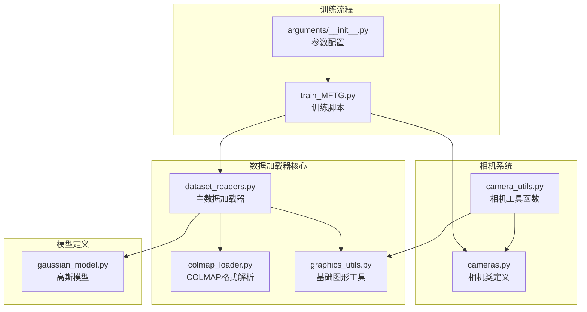

**图表来源**
- [dataset_readers.py:1-311](file://scene/dataset_readers.py#L1-L311)
- [colmap_loader.py:1-295](file://scene/colmap_loader.py#L1-L295)
- [cameras.py:1-72](file://scene/cameras.py#L1-L72)

**章节来源**
- [dataset_readers.py:1-311](file://scene/dataset_readers.py#L1-L311)
- [colmap_loader.py:1-295](file://scene/colmap_loader.py#L1-L295)
- [cameras.py:1-72](file://scene/cameras.py#L1-L72)

## 核心组件

### 数据结构设计

数据加载器采用类型安全的命名元组来表示核心数据结构：

#### CameraInfo 结构体
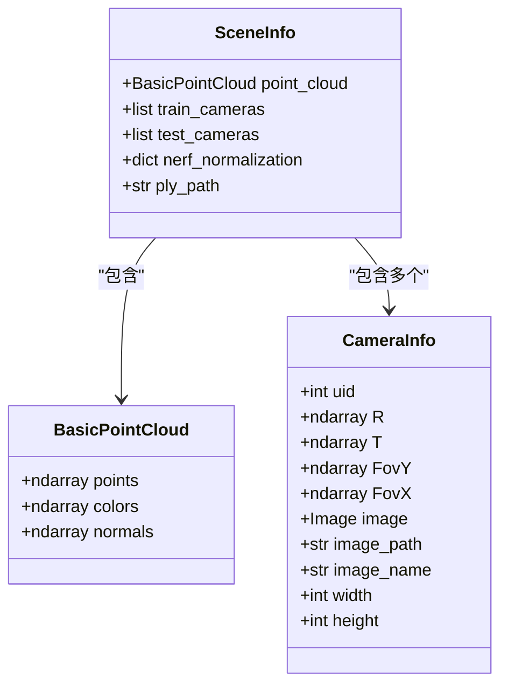

**图表来源**
- [dataset_readers.py:26-44](file://scene/dataset_readers.py#L26-L44)
- [graphics_utils.py:17-21](file://utils/graphics_utils.py#L17-L21)

#### 字段含义说明

**CameraInfo 字段**：
- `uid`: 相机唯一标识符
- `R`: 旋转矩阵（3×3）
- `T`: 平移向量（3×1）
- `FovY/FovX`: 垂直和水平视场角
- `image`: PIL 图像对象
- `image_path/name`: 图像文件路径和名称
- `width/height`: 图像尺寸

**SceneInfo 字段**：
- `point_cloud`: 点云数据结构
- `train_cameras/test_cameras`: 训练和测试相机列表
- `nerf_normalization`: NeRF 归一化参数
- `ply_path`: PLY 文件路径

**章节来源**
- [dataset_readers.py:26-44](file://scene/dataset_readers.py#L26-L44)
- [graphics_utils.py:17-21](file://utils/graphics_utils.py#L17-L21)

## 架构概览

数据加载器采用分层架构设计，支持多种数据格式的统一处理：

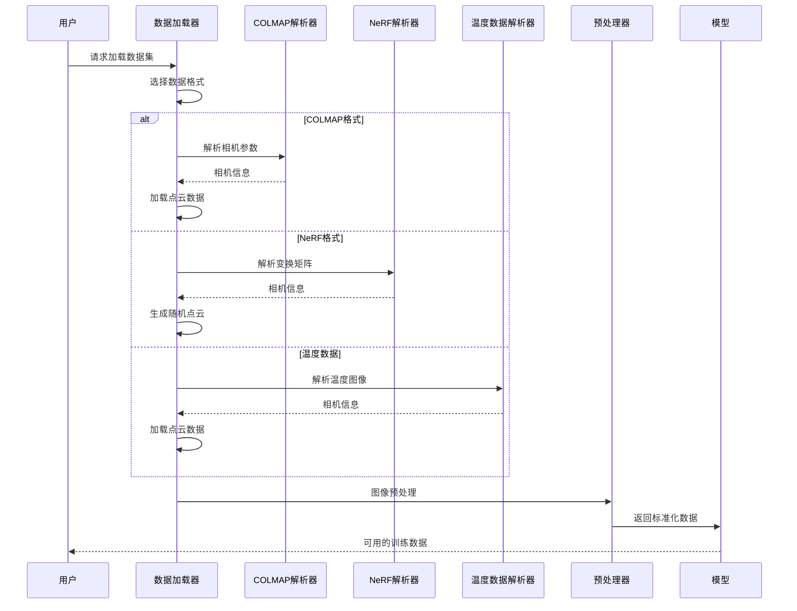

**图表来源**
- [dataset_readers.py:136-181](file://scene/dataset_readers.py#L136-L181)
- [dataset_readers.py:185-230](file://scene/dataset_readers.py#L185-L230)
- [dataset_readers.py:274-305](file://scene/dataset_readers.py#L274-L305)

## 详细组件分析

### COLMAP 数据格式加载器

COLMAP 是该项目支持的主要数据格式，用于处理通过 Structure-from-Motion 重建的三维场景。

#### COLMAP 文件解析流程

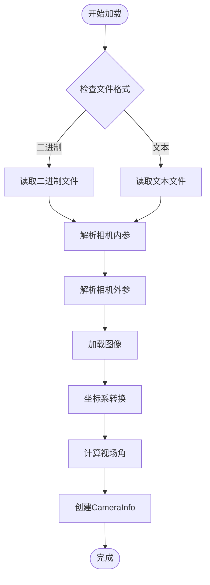

**图表来源**
- [colmap_loader.py:180-212](file://scene/colmap_loader.py#L180-L212)
- [colmap_loader.py:244-270](file://scene/colmap_loader.py#L244-L270)
- [dataset_readers.py:68-109](file://scene/dataset_readers.py#L68-L109)

#### 相机参数转换机制

COLMAP 使用不同的坐标系约定，需要进行坐标系转换：

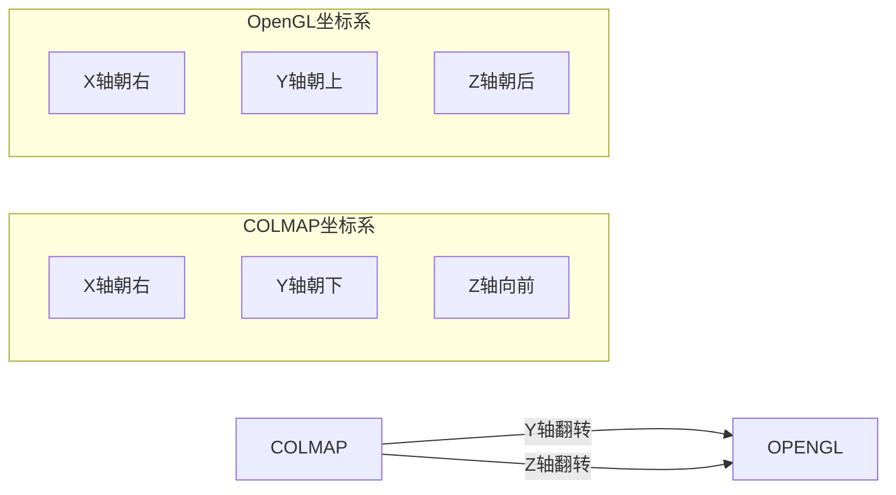

**图表来源**
- [dataset_readers.py:244-246](file://scene/dataset_readers.py#L244-L246)

**章节来源**
- [colmap_loader.py:1-295](file://scene/colmap_loader.py#L1-L295)
- [dataset_readers.py:68-109](file://scene/dataset_readers.py#L68-L109)

### NeRF 合成数据集处理

NeRF 合成数据集提供了标准的相机姿态和场景几何，但没有 COLMAP 的稀疏重建结果。

#### NeRF 数据加载流程

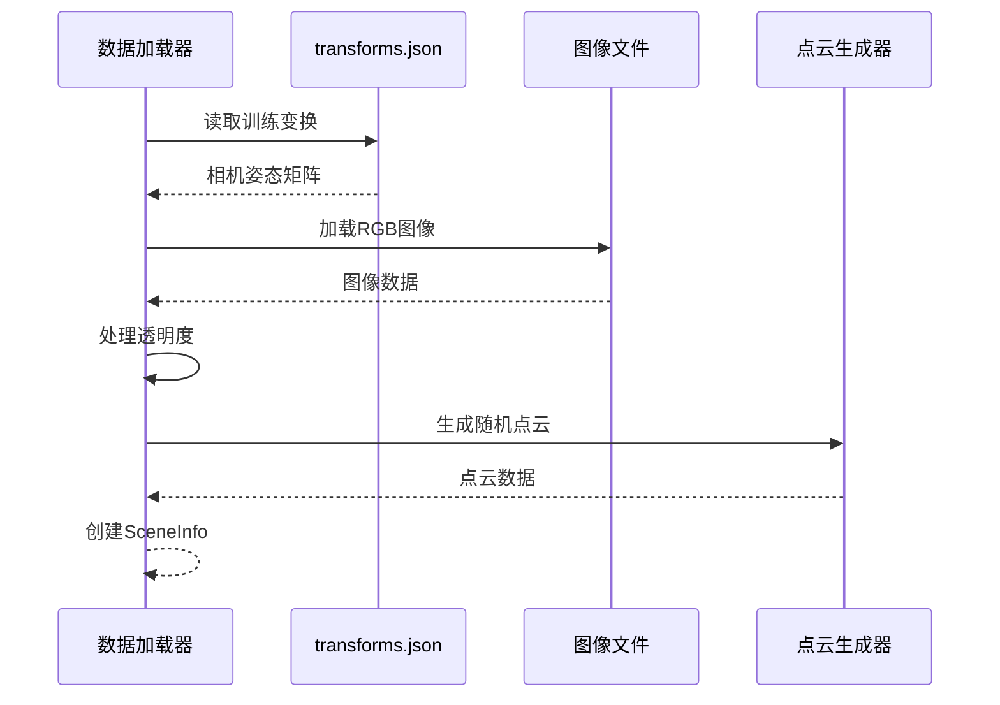

**图表来源**
- [dataset_readers.py:232-272](file://scene/dataset_readers.py#L232-L272)
- [dataset_readers.py:274-305](file://scene/dataset_readers.py#L274-L305)

**章节来源**
- [dataset_readers.py:232-305](file://scene/dataset_readers.py#L232-L305)

### 温度数据集特殊处理

温度数据集是 Thermal-Gaussian 的特色功能，支持彩色和热成像的联合训练。

#### 温度数据加载特性

温度数据集在 COLMAP 结构基础上进行了特殊处理：

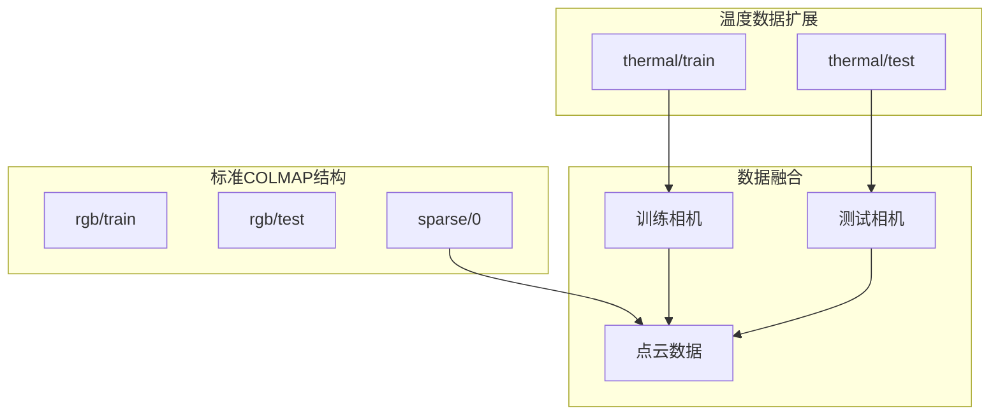

**图表来源**
- [dataset_readers.py:185-230](file://scene/dataset_readers.py#L185-L230)

**章节来源**
- [dataset_readers.py:185-230](file://scene/dataset_readers.py#L185-L230)

### 数据预处理流程

数据预处理是确保输入质量的关键步骤，包括图像归一化、坐标转换和点云构建。

#### 图像预处理管道

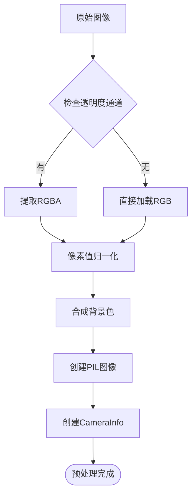

**图表来源**
- [dataset_readers.py:257-263](file://scene/dataset_readers.py#L257-L263)

#### 相机参数转换

相机参数转换涉及多个数学变换：

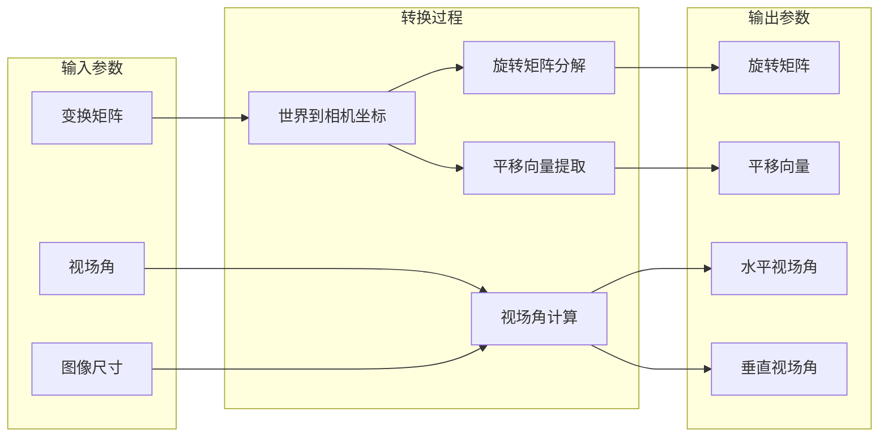

**图表来源**
- [dataset_readers.py:244-267](file://scene/dataset_readers.py#L244-L267)

**章节来源**
- [dataset_readers.py:257-263](file://scene/dataset_readers.py#L257-L263)
- [dataset_readers.py:244-267](file://scene/dataset_readers.py#L244-L267)

### 点云数据结构构建

点云数据结构是整个系统的基础，为高斯散射渲染提供几何信息。

#### BasicPointCloud 结构

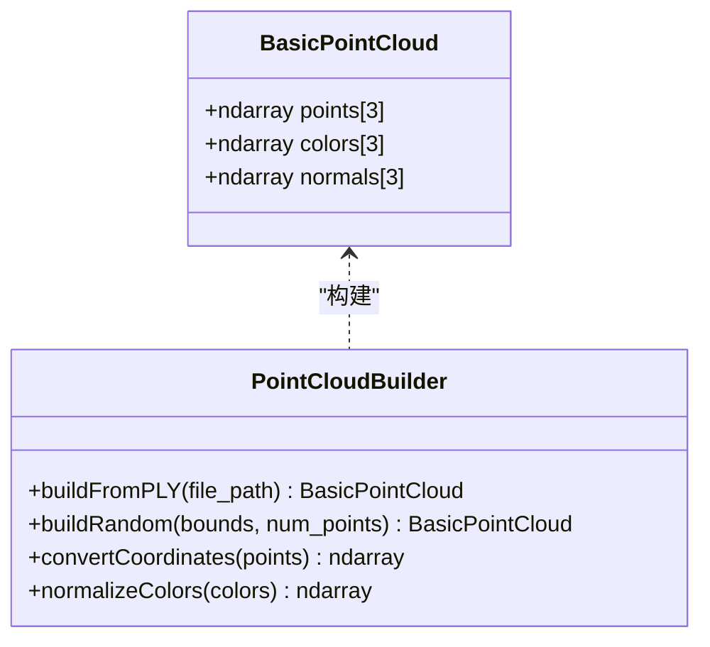

**图表来源**
- [graphics_utils.py:17-21](file://utils/graphics_utils.py#L17-L21)
- [dataset_readers.py:111-117](file://scene/dataset_readers.py#L111-L117)

**章节来源**
- [graphics_utils.py:17-21](file://utils/graphics_utils.py#L17-L21)
- [dataset_readers.py:111-117](file://scene/dataset_readers.py#L111-L117)

## 依赖关系分析

数据加载器模块之间的依赖关系体现了清晰的分层架构：

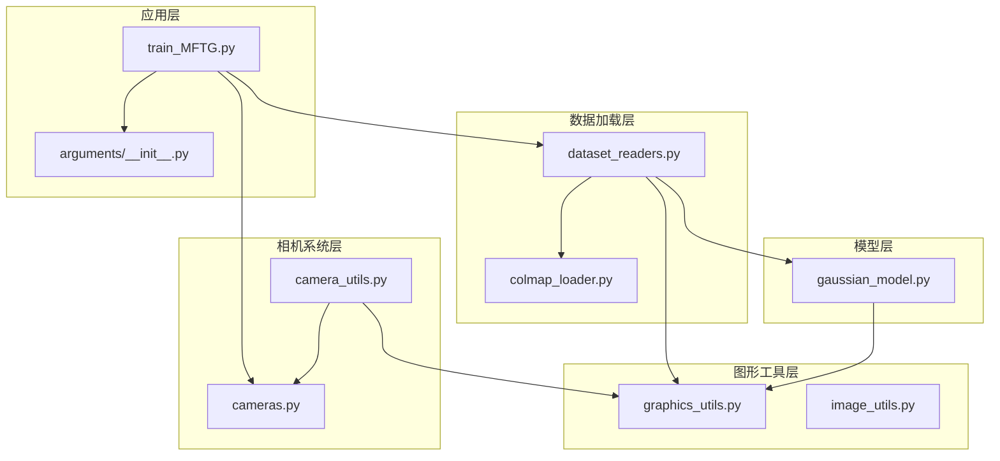

**图表来源**
- [train_MFTG.py:1-200](file://train_MFTG.py#L1-L200)
- [dataset_readers.py:1-311](file://scene/dataset_readers.py#L1-L311)
- [cameras.py:1-72](file://scene/cameras.py#L1-L72)

**章节来源**
- [train_MFTG.py:1-200](file://train_MFTG.py#L1-L200)
- [dataset_readers.py:1-311](file://scene/dataset_readers.py#L1-L311)

## 性能考虑

### 内存优化策略

1. **延迟加载**: 点云数据仅在需要时加载到 GPU 内存
2. **批处理优化**: 相机数据按批次处理，减少内存峰值
3. **数据类型优化**: 使用适当的数值精度减少内存占用

### 计算效率优化

1. **并行处理**: COLMAP 文件解析支持并行读取
2. **缓存机制**: PLY 文件转换结果缓存避免重复计算
3. **分辨率缩放**: 自动调整图像分辨率以平衡质量与性能

### 错误处理机制

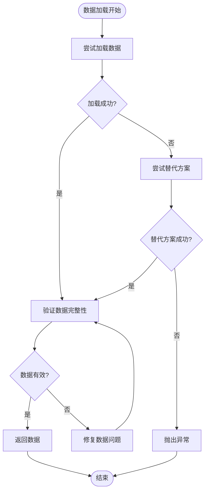

**图表来源**
- [dataset_readers.py:136-181](file://scene/dataset_readers.py#L136-L181)
- [dataset_readers.py:185-230](file://scene/dataset_readers.py#L185-L230)

## 故障排除指南

### 常见问题及解决方案

#### COLMAP 文件格式问题
- **问题**: 无法读取 COLMAP 文件
- **原因**: 文件格式不匹配或损坏
- **解决**: 检查文件扩展名，确认使用正确的解析器

#### 图像加载失败
- **问题**: 图像文件无法加载
- **原因**: 路径错误或文件损坏
- **解决**: 验证图像路径，检查文件完整性

#### 内存不足
- **问题**: 处理大图像时内存溢出
- **原因**: 图像分辨率过高
- **解决**: 使用分辨率参数调整图像大小

#### 坐标系转换错误
- **问题**: 场景显示方向不正确
- **原因**: 坐标系约定不匹配
- **解决**: 检查坐标系转换逻辑

**章节来源**
- [dataset_readers.py:136-181](file://scene/dataset_readers.py#L136-L181)
- [dataset_readers.py:185-230](file://scene/dataset_readers.py#L185-L230)

## 结论

数据加载器模块为 Thermal-Gaussian 提供了强大的多格式数据支持能力。通过精心设计的数据结构和高效的处理流程，该模块能够：

1. **统一数据格式**: 支持 COLMAP、NeRF 和温度数据集等多种格式
2. **保证数据质量**: 实现严格的验证和错误处理机制
3. **优化性能表现**: 采用多种优化策略提升处理效率
4. **扩展性强**: 易于添加新的数据格式支持

该模块的成功实现为多模态场景重建奠定了坚实基础，特别是在彩色和热成像数据的联合处理方面展现了独特优势。

## 附录

### 使用示例

#### 加载 COLMAP 数据集
```bash
python train_MFTG.py -s path/to/colmap_dataset -m output/model
```

#### 加载 NeRF 合成数据集
```bash
python train_MFTG.py -s path/to/nerf_dataset -m output/model
```

#### 加载温度数据集
```bash
python train_MFTG.py -s path/to/thermal_dataset -m output/model
```

### 扩展新数据格式

要添加新的数据格式支持，需要：

1. 在 `dataset_readers.py` 中添加新的解析函数
2. 实现相应的 `SceneInfo` 创建逻辑
3. 更新 `sceneLoadTypeCallbacks` 映射表
4. 添加必要的错误处理和验证逻辑

**章节来源**
- [README.md:62-117](file://README.md#L62-L117)
- [dataset_readers.py:307-311](file://scene/dataset_readers.py#L307-L311)