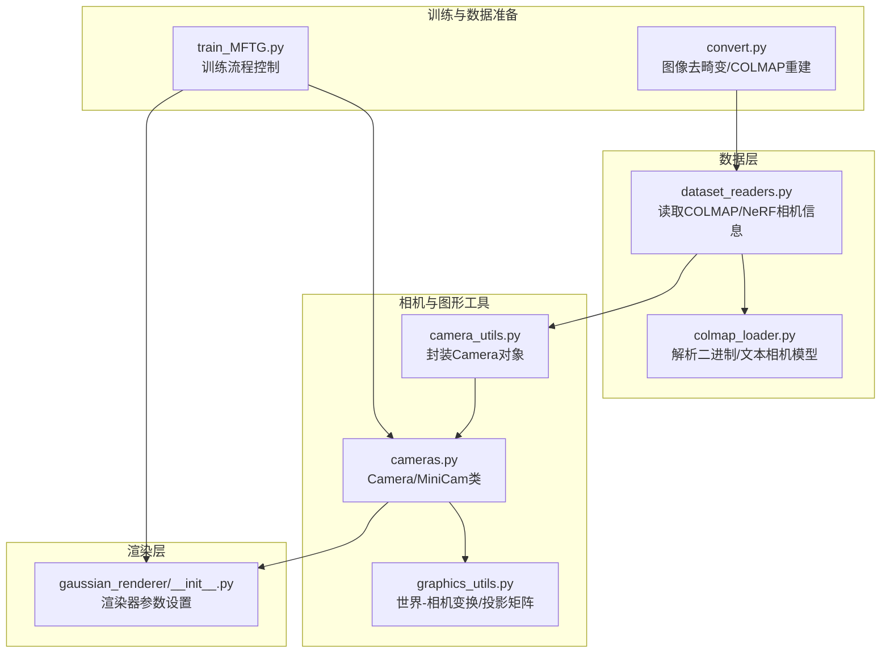
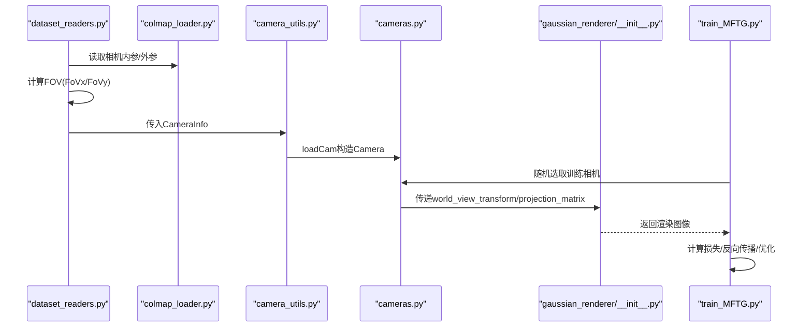
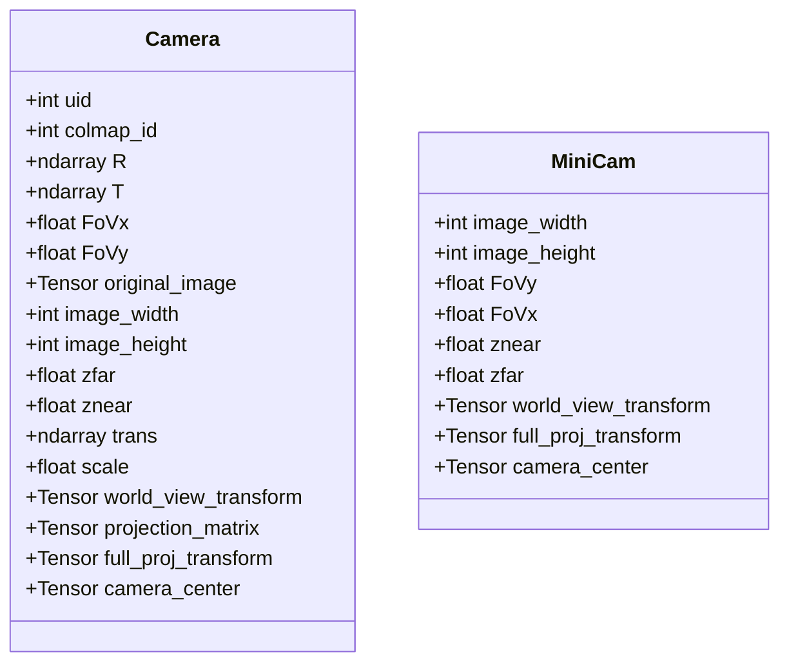
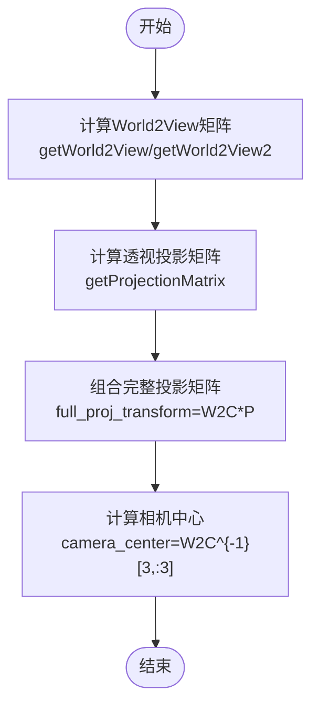
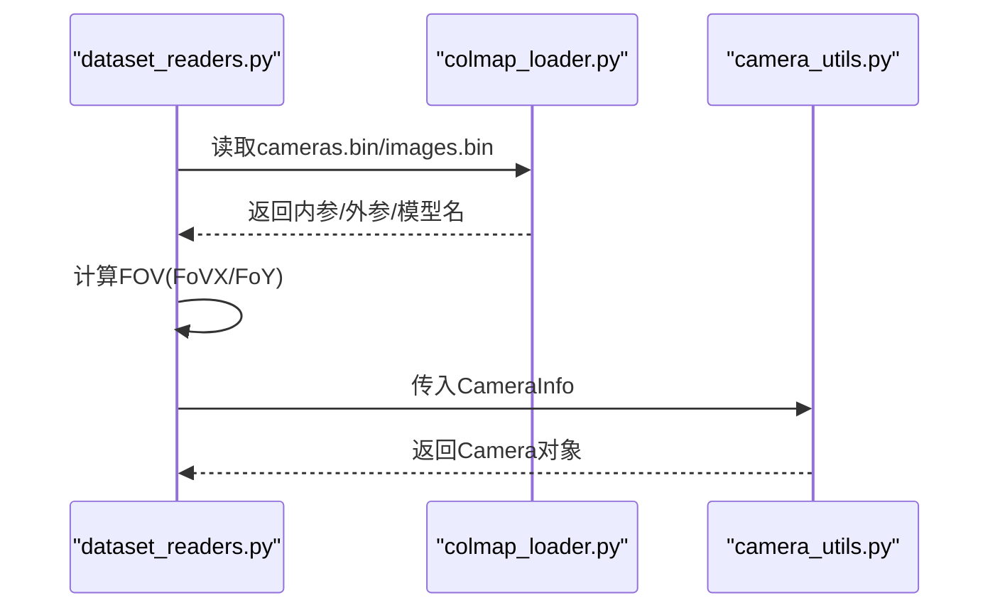
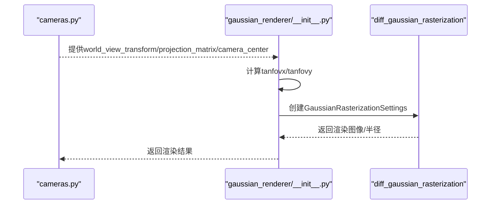
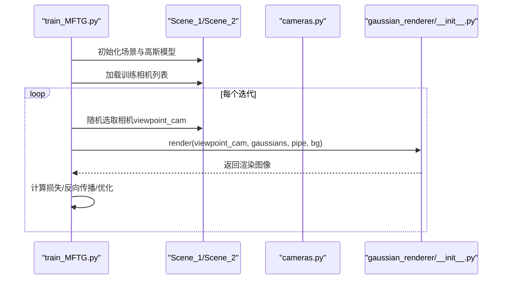
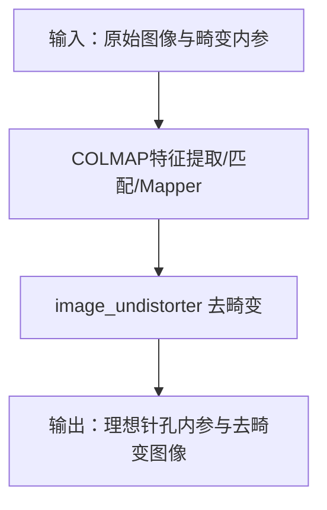
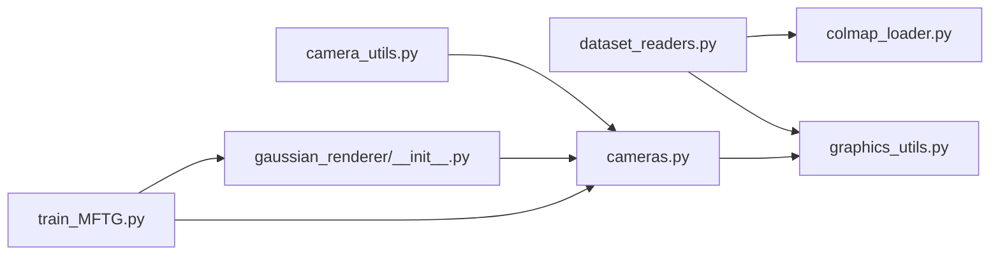

# 相机系统

<cite>
**本文引用的文件**
- [scene/cameras.py](file://scene/cameras.py)
- [utils/graphics_utils.py](file://utils/graphics_utils.py)
- [utils/camera_utils.py](file://utils/camera_utils.py)
- [scene/dataset_readers.py](file://scene/dataset_readers.py)
- [scene/colmap_loader.py](file://scene/colmap_loader.py)
- [gaussian_renderer/__init__.py](file://gaussian_renderer/__init__.py)
- [train_MFTG.py](file://train_MFTG.py)
- [README.md](file://README.md)
- [convert.py](file://convert.py)
</cite>

## 目录
1. [引言](#引言)
2. [项目结构](#项目结构)
3. [核心组件](#核心组件)
4. [架构总览](#架构总览)
5. [详细组件分析](#详细组件分析)
6. [依赖分析](#依赖分析)
7. [性能考虑](#性能考虑)
8. [故障排查指南](#故障排查指南)
9. [结论](#结论)
10. [附录](#附录)

## 引言
本技术文档围绕相机系统进行深入解析，涵盖相机坐标系与世界坐标系的转换、相机内参与外参矩阵的数学原理与实现、视锥体裁剪与透视投影、以及相机姿态表示。同时结合项目中热成像与可见光双模态（RGB）场景的应用，说明相机标定、多视角几何与相机轨迹优化等高级功能，并提供可操作的调试建议与代码定位路径，帮助开发者快速理解与扩展该相机系统。

## 项目结构
该项目以“3D高斯点云渲染”为核心，相机系统贯穿数据读取、相机对象构建、渲染管线参数传递与训练流程控制。关键模块如下：
- 场景与相机：scene/cameras.py 定义相机类与MiniCam；scene/dataset_readers.py 负责从COLMAP或NeRF格式读取相机信息；scene/colmap_loader.py 提供COLMAP二进制/文本文件解析。
- 图形工具：utils/graphics_utils.py 提供世界到相机变换、投影矩阵生成、FOV与焦距互转等基础函数。
- 相机封装与序列化：utils/camera_utils.py 将数据集中的相机信息封装为Camera对象，并支持导出相机参数。
- 渲染集成：gaussian_renderer/__init__.py 使用相机参数配置光栅化设置，驱动渲染。
- 训练流程：train_MFTG.py 控制训练阶段，按步骤分别训练RGB与热成像模态。
- 数据准备：convert.py 提供图像去畸变与COLMAP重建流程，确保使用理想针孔内参。

**图表来源**
- [scene/dataset_readers.py:68-109](file://scene/dataset_readers.py#L68-L109)
- [scene/colmap_loader.py:16-40](file://scene/colmap_loader.py#L16-L40)
- [utils/camera_utils.py:19-52](file://utils/camera_utils.py#L19-L52)
- [scene/cameras.py:17-71](file://scene/cameras.py#L17-L71)
- [utils/graphics_utils.py:31-77](file://utils/graphics_utils.py#L31-L77)
- [gaussian_renderer/__init__.py:18-49](file://gaussian_renderer/__init__.py#L18-L49)
- [train_MFTG.py:35-163](file://train_MFTG.py#L35-L163)
- [convert.py:31-78](file://convert.py#L31-L78)

**章节来源**
- [README.md:13-117](file://README.md#L13-L117)

## 核心组件
- 相机类 Camera：封装相机位姿（R, T）、视野角（FoVx/FoVy）、图像尺寸、近远裁剪面、世界-视图变换、投影矩阵与完整投影变换，以及相机中心。
- MiniCam：轻量相机对象，用于网络GUI交互时传递相机状态。
- 世界-相机变换与投影矩阵：通过 getWorld2View2 与 getProjectionMatrix 构建4x4变换与透视投影矩阵。
- 相机封装与序列化：loadCam 将数据集中的相机信息封装为Camera；camera_to_JSON 导出相机参数（位置、旋转、焦距）。

**章节来源**
- [scene/cameras.py:17-71](file://scene/cameras.py#L17-L71)
- [utils/graphics_utils.py:31-77](file://utils/graphics_utils.py#L31-L77)
- [utils/camera_utils.py:19-82](file://utils/camera_utils.py#L19-L82)

## 架构总览
相机系统在数据读取阶段由 dataset_readers.py 解析COLMAP相机模型，计算FOV并加载图像；随后通过 camera_utils.py 的 loadCam 构造 Camera 对象；渲染阶段由 gaussian_renderer/__init__.py 读取 Camera 的变换与投影参数，配置光栅化设置并执行渲染；训练阶段 train_MFTG.py 按RGB与热成像两步流程交替训练，逐步优化高斯点云以拟合多模态图像。

**图表来源**
- [scene/dataset_readers.py:68-109](file://scene/dataset_readers.py#L68-L109)
- [scene/colmap_loader.py:16-40](file://scene/colmap_loader.py#L16-L40)
- [utils/camera_utils.py:19-52](file://utils/camera_utils.py#L19-L52)
- [scene/cameras.py:17-58](file://scene/cameras.py#L17-L58)
- [gaussian_renderer/__init__.py:18-49](file://gaussian_renderer/__init__.py#L18-L49)
- [train_MFTG.py:92-118](file://train_MFTG.py#L92-L118)

## 详细组件分析

### 相机类与MiniCam
- Camera 类负责：
  - 接收来自数据集的 R（旋转）、T（平移）、FoVx/FoVy、图像与掩码；
  - 基于 getWorld2View2 构建世界到相机的4x4变换矩阵；
  - 基于 getProjectionMatrix 生成透视投影矩阵；
  - 计算完整投影矩阵 full_proj_transform；
  - 计算相机中心 camera_center。
- MiniCam 用于网络GUI交互，保存当前帧的宽高、FOV、裁剪面与变换矩阵。

**图表来源**
- [scene/cameras.py:17-71](file://scene/cameras.py#L17-L71)

**章节来源**
- [scene/cameras.py:17-71](file://scene/cameras.py#L17-L71)

### 世界-相机变换与投影矩阵
- 世界到相机变换（World2View）：
  - getWorld2View 与 getWorld2View2 分别生成标准与带平移/缩放修正的4x4矩阵；
  - getWorld2View2 还会根据 translate 与 scale 对相机中心进行偏移与缩放，再求逆得到最终的W2C矩阵。
- 投影矩阵（Perspective Projection）：
  - getProjectionMatrix 基于znear/zfar与FOV计算正交范围，生成透视投影矩阵P；
  - FOV与焦距互转：fov2focal 与 focal2fov 支持从像素尺寸与角度之间换算。
- 几何变换辅助：
  - geom_transform_points 实现齐次坐标下的点变换与透视除法。

**图表来源**
- [utils/graphics_utils.py:31-77](file://utils/graphics_utils.py#L31-L77)
- [scene/cameras.py:54-57](file://scene/cameras.py#L54-L57)

**章节来源**
- [utils/graphics_utils.py:31-77](file://utils/graphics_utils.py#L31-L77)
- [scene/cameras.py:54-57](file://scene/cameras.py#L54-L57)

### 数据读取与相机封装
- dataset_readers.py：
  - 读取COLMAP相机内参（SIMPLE_PINHOLE/PINHOLE），计算FOV；
  - 读取图像并封装为 CameraInfo；
  - 通过 camera_utils.loadCam 构造 Camera；
  - 提供 getNerfppNorm 用于相机归一化（相机中心聚类与半径估计）。
- colmap_loader.py：
  - 定义相机模型集合与命名映射；
  - 提供 qvec2rotmat/rotmat2qvec 等四元数与旋转矩阵转换；
  - 读取二进制/文本的相机内参、外参与点云文件。
- camera_utils.py：
  - loadCam：按分辨率缩放图像，构造Camera；
  - cameraList_from_camInfos：批量封装；
  - camera_to_JSON：导出相机参数（位置、旋转、焦距）。

**图表来源**
- [scene/dataset_readers.py:68-109](file://scene/dataset_readers.py#L68-L109)
- [scene/colmap_loader.py:16-40](file://scene/colmap_loader.py#L16-L40)
- [utils/camera_utils.py:19-52](file://utils/camera_utils.py#L19-L52)

**章节来源**
- [scene/dataset_readers.py:68-109](file://scene/dataset_readers.py#L68-L109)
- [scene/colmap_loader.py:16-40](file://scene/colmap_loader.py#L16-L40)
- [utils/camera_utils.py:19-82](file://utils/camera_utils.py#L19-L82)

### 渲染集成与视锥体裁剪
- gaussian_renderer/__init__.py：
  - 从 Camera 获取 tan(FOV/2)，构造光栅化设置；
  - 设置视图矩阵（world_view_transform）、投影矩阵（full_proj_transform）与相机中心（campos）；
  - 执行高斯点云光栅化，返回渲染图像、可见性过滤与半径；
  - 视锥体裁剪由投影矩阵与屏幕空间半径共同决定（radii > 0）。

**图表来源**
- [scene/cameras.py:54-57](file://scene/cameras.py#L54-L57)
- [gaussian_renderer/__init__.py:18-49](file://gaussian_renderer/__init__.py#L18-L49)

**章节来源**
- [gaussian_renderer/__init__.py:18-101](file://gaussian_renderer/__init__.py#L18-L101)

### 双模态（RGB与热成像）训练流程
- train_MFTG.py：
  - 先训练RGB模态（step=1），再训练热成像模态（step=2）；
  - 在热成像阶段引入平滑损失项以提升物理一致性；
  - 每轮迭代随机采样相机，渲染图像并与目标图像计算损失，更新高斯点云参数。

**图表来源**
- [train_MFTG.py:35-163](file://train_MFTG.py#L35-L163)
- [scene/cameras.py:17-58](file://scene/cameras.py#L17-L58)
- [gaussian_renderer/__init__.py:18-101](file://gaussian_renderer/__init__.py#L18-L101)

**章节来源**
- [train_MFTG.py:35-163](file://train_MFTG.py#L35-L163)

### 相机畸变与去畸变
- 项目通过 convert.py 调用COLMAP的 image_undistorter 将带有径向/切向畸变的图像与相机内参去畸变，输出理想针孔模型（SIMPLE_PINHOLE/PINHOLE）的稀疏重建结果，供后续读取与训练使用。
- colmap_loader.py 中定义了多种相机模型（含SIMPLE_RADIAL/RADIAL/OPENCV等），但数据读取阶段仅处理PINHOLE/SIMPLE_PINHOLE，其他模型需先经去畸变流程转换。

**图表来源**
- [convert.py:31-78](file://convert.py#L31-L78)
- [scene/colmap_loader.py:24-36](file://scene/colmap_loader.py#L24-L36)

**章节来源**
- [convert.py:31-78](file://convert.py#L31-L78)
- [scene/colmap_loader.py:24-36](file://scene/colmap_loader.py#L24-L36)

## 依赖分析
- 模块耦合关系：
  - dataset_readers.py 依赖 colmap_loader.py 与 graphics_utils.py；
  - camera_utils.py 依赖 PIL/NumPy/Torch 与 graphics_utils；
  - cameras.py 依赖 graphics_utils；
  - gaussian_renderer/__init__.py 依赖 cameras.py 与 diff-gaussian-rasterization；
  - train_MFTG.py 依赖 scene（Scene_1/Scene_2）、gaussian_renderer、utils。
- 外部依赖：
  - COLMAP：用于特征提取、匹配、稀疏重建与图像去畸变；
  - PyTorch：张量运算与CUDA加速；
  - diff-gaussian-rasterization：高斯点云光栅化核心。

**图表来源**
- [scene/dataset_readers.py:16-24](file://scene/dataset_readers.py#L16-L24)
- [utils/camera_utils.py:12-15](file://utils/camera_utils.py#L12-L15)
- [scene/cameras.py:15-15](file://scene/cameras.py#L15-L15)
- [gaussian_renderer/__init__.py:12-16](file://gaussian_renderer/__init__.py#L12-L16)
- [train_MFTG.py:18-26](file://train_MFTG.py#L18-L26)

**章节来源**
- [scene/dataset_readers.py:16-24](file://scene/dataset_readers.py#L16-L24)
- [utils/camera_utils.py:12-15](file://utils/camera_utils.py#L12-L15)
- [scene/cameras.py:15-15](file://scene/cameras.py#L15-L15)
- [gaussian_renderer/__init__.py:12-16](file://gaussian_renderer/__init__.py#L12-L16)
- [train_MFTG.py:18-26](file://train_MFTG.py#L18-L26)

## 性能考虑
- 渲染效率：
  - 使用 tan(FOV/2) 预计算减少每帧重复计算；
  - 通过 full_proj_transform 合并视图与投影，降低GPU端矩阵乘次数。
- 内存与显存：
  - 训练中按需加载图像与掩码，避免不必要的张量复制；
  - 使用视锥体裁剪（radii > 0）剔除不可见高斯，减少光栅化开销。
- 数据读取：
  - COLMAP读取二进制文件比文本更快，优先使用二进制格式；
  - 合理设置分辨率缩放（如images_2/4/8）平衡质量与速度。

[本节为通用性能建议，不直接分析具体文件]

## 故障排查指南
- 设备与CUDA：
  - Camera 构造时若自定义设备失败，会回退到默认CUDA设备；检查设备名称与可用性。
- 图像尺寸与分辨率：
  - 若输入图像过大，自动降采样至约1.6K宽度；可通过参数强制指定分辨率。
- 相机归一化：
  - getNerfppNorm 通过相机中心聚类估计半径与平移，确保场景尺度合理。
- 渲染异常：
  - 检查 world_view_transform 与 projection_matrix 是否正确传递；
  - 确保 tanfovx/tanfovy 与 FOV一致，避免投影异常。
- 去畸变问题：
  - 确认 convert.py 正确调用 image_undistorter 并生成稀疏重建；
  - 若COLMAP模型非PINHOLE/SIMPLE_PINHOLE，需先去畸变转换。

**章节来源**
- [scene/cameras.py:32-38](file://scene/cameras.py#L32-L38)
- [utils/camera_utils.py:22-40](file://utils/camera_utils.py#L22-L40)
- [scene/dataset_readers.py:45-66](file://scene/dataset_readers.py#L45-L66)
- [gaussian_renderer/__init__.py:32-49](file://gaussian_renderer/__init__.py#L32-L49)
- [convert.py:68-78](file://convert.py#L68-L78)

## 结论
该相机系统以清晰的模块划分实现了从数据读取、相机封装、图形变换到渲染与训练的完整链路。其设计遵循标准的3D视觉流程：从COLMAP获取外参与内参，经去畸变后统一为理想针孔模型，再通过世界-相机变换与透视投影进入渲染管线。在双模态（RGB与热成像）场景下，系统通过分阶段训练与针对性损失（如热成像平滑约束）提升了跨模态一致性与渲染质量。开发者可基于现有接口扩展相机模型、优化投影参数与训练策略，以适配更复杂的多视角几何任务。

[本节为总结性内容，不直接分析具体文件]

## 附录
- 关键实现路径参考：
  - 相机类与矩阵计算：[scene/cameras.py:17-58](file://scene/cameras.py#L17-L58)、[utils/graphics_utils.py:31-77](file://utils/graphics_utils.py#L31-L77)
  - 数据读取与封装：[scene/dataset_readers.py:68-109](file://scene/dataset_readers.py#L68-L109)、[utils/camera_utils.py:19-52](file://utils/camera_utils.py#L19-L52)
  - 渲染集成：[gaussian_renderer/__init__.py:18-49](file://gaussian_renderer/__init__.py#L18-L49)
  - 双模态训练：[train_MFTG.py:35-163](file://train_MFTG.py#L35-L163)
  - 去畸变与COLMAP流程：[convert.py:31-78](file://convert.py#L31-L78)、[scene/colmap_loader.py:24-36](file://scene/colmap_loader.py#L24-L36)

[本节为补充索引，不直接分析具体文件]