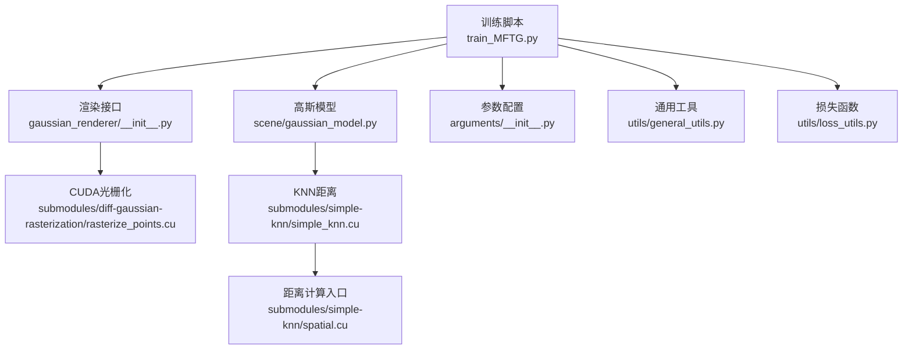
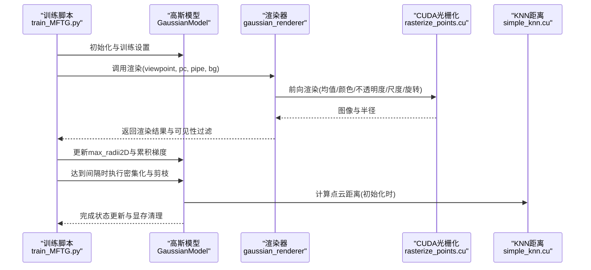
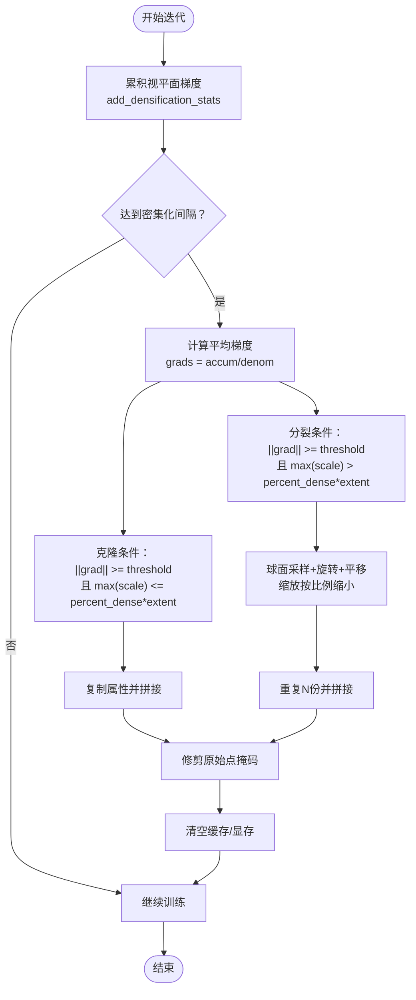
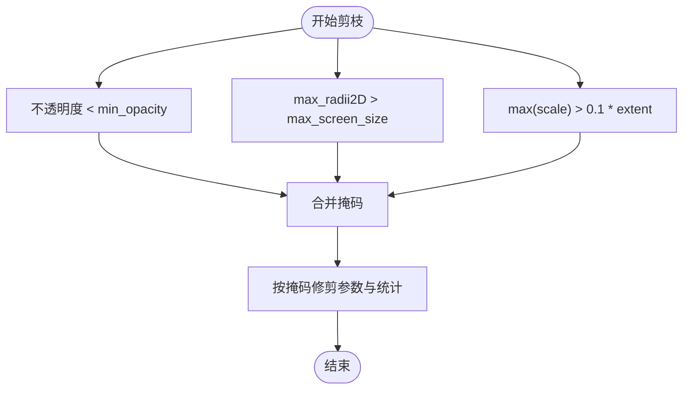
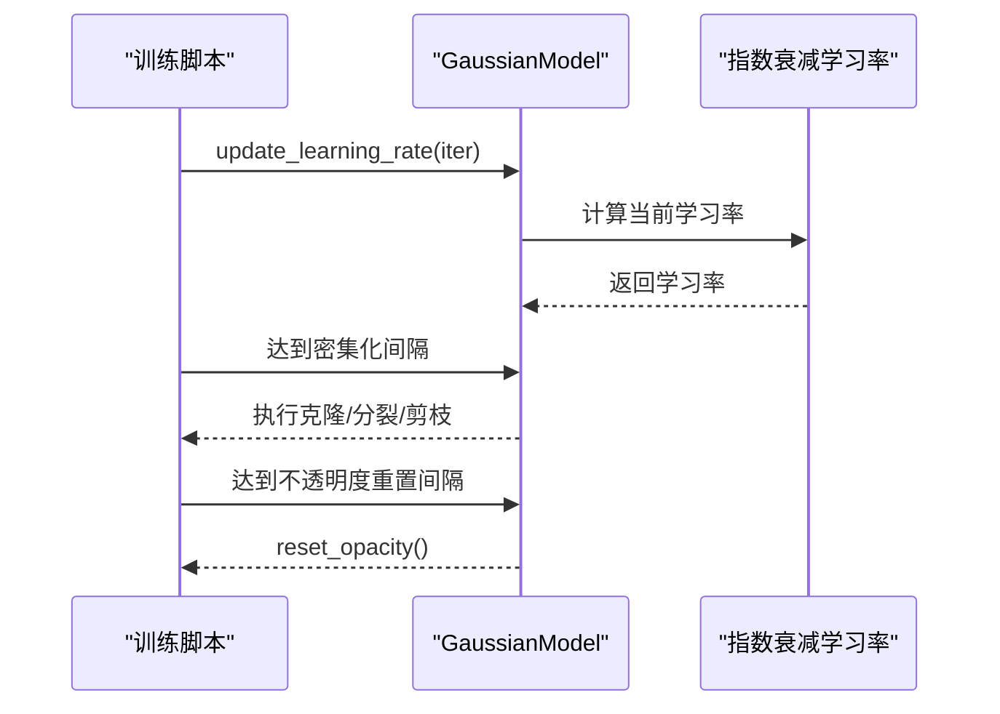
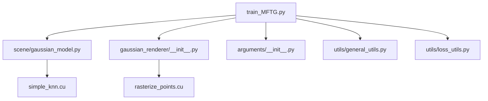

# 密集化与剪枝算法

<cite>
**本文引用的文件**
- [scene/gaussian_model.py](file://scene/gaussian_model.py)
- [train_MFTG.py](file://train_MFTG.py)
- [arguments/__init__.py](file://arguments/__init__.py)
- [gaussian_renderer/__init__.py](file://gaussian_renderer/__init__.py)
- [submodules/diff-gaussian-rasterization/rasterize_points.cu](file://submodules/diff-gaussian-rasterization/rasterize_points.cu)
- [submodules/simple-knn/simple_knn.cu](file://submodules/simple-knn/simple_knn.cu)
- [submodules/simple-knn/spatial.cu](file://submodules/simple-knn/spatial.cu)
- [utils/general_utils.py](file://utils/general_utils.py)
- [utils/loss_utils.py](file://utils/loss_utils.py)
- [README.md](file://README.md)
</cite>

## 目录
1. [引言](#引言)
2. [项目结构](#项目结构)
3. [核心组件](#核心组件)
4. [架构总览](#架构总览)
5. [详细组件分析](#详细组件分析)
6. [依赖关系分析](#依赖关系分析)
7. [性能考量](#性能考量)
8. [故障排查指南](#故障排查指南)
9. [结论](#结论)
10. [附录：参数调优与实践建议](#附录参数调优与实践建议)

## 引言
本技术文档围绕“密集化与剪枝”算法展开，系统解析基于梯度驱动的密集化策略（选择性克隆与分裂）、剪枝条件（不透明度阈值、屏幕空间大小与最大尺度约束）以及与CUDA张量操作的高效实现。同时给出学习率调度与密集化策略的协同机制、训练过程中的动态参数调整方法，并提供参数调优指南与性能优化建议，帮助开发者在不同应用场景中取得更佳的重建质量与效率。

## 项目结构
该项目以3D高斯点云为核心表示，通过可微光栅化CUDA内核进行渲染与反向传播，训练脚本负责迭代优化、密度增长与剪枝，参数配置集中于命令行参数组。关键模块如下：
- 场景与模型：高斯模型类负责参数管理、密集化与剪枝、优化器与学习率调度。
- 渲染管线：Python侧构造光栅化设置，调用CUDA内核完成前向与反向。
- 子模块：CUDA光栅化与KNN工具，支撑密集化与几何预处理。
- 训练流程：多阶段训练脚本，按迭代周期执行密集化与剪枝。



**图表来源**
- [train_MFTG.py:1-273](file://train_MFTG.py#L1-L273)
- [scene/gaussian_model.py:1-407](file://scene/gaussian_model.py#L1-L407)
- [gaussian_renderer/__init__.py:1-101](file://gaussian_renderer/__init__.py#L1-L101)
- [submodules/diff-gaussian-rasterization/rasterize_points.cu:1-217](file://submodules/diff-gaussian-rasterization/rasterize_points.cu#L1-L217)
- [submodules/simple-knn/simple_knn.cu:1-221](file://submodules/simple-knn/simple_knn.cu#L1-L221)
- [submodules/simple-knn/spatial.cu:1-26](file://submodules/simple-knn/spatial.cu#L1-L26)
- [arguments/__init__.py:1-113](file://arguments/__init__.py#L1-L113)
- [utils/general_utils.py:1-134](file://utils/general_utils.py#L1-L134)
- [utils/loss_utils.py:1-113](file://utils/loss_utils.py#L1-L113)

**章节来源**
- [README.md:1-167](file://README.md#L1-L167)
- [train_MFTG.py:1-273](file://train_MFTG.py#L1-L273)
- [scene/gaussian_model.py:1-407](file://scene/gaussian_model.py#L1-L407)

## 核心组件
- 高斯模型（GaussianModel）
  - 状态张量：位置、颜色系数（DC/余项）、缩放、旋转、不透明度。
  - 激活函数：指数缩放、sigmoid不透明度、四元数归一化旋转。
  - 优化器与学习率：Adam优化器，位置学习率采用指数衰减调度。
  - 密集化与剪枝：提供克隆、分裂、剪枝与后缀拼接等核心操作。
- 渲染器（gaussian_renderer）
  - 构造光栅化设置，支持SH到RGB转换或由CUDA内核完成。
  - 返回屏幕空间点用于累积梯度，供密集化统计使用。
- CUDA光栅化（diff-gaussian-rasterization）
  - 前向：输出图像与每个高斯对应的半径；反向：回传均值、协方差、颜色、不透明度等梯度。
- KNN子模块（simple-knn）
  - 提供点云间平均距离计算，用于初始尺度估计与几何预处理。

**章节来源**
- [scene/gaussian_model.py:24-168](file://scene/gaussian_model.py#L24-L168)
- [gaussian_renderer/__init__.py:18-101](file://gaussian_renderer/__init__.py#L18-L101)
- [submodules/diff-gaussian-rasterization/rasterize_points.cu:35-115](file://submodules/diff-gaussian-rasterization/rasterize_points.cu#L35-L115)
- [submodules/simple-knn/spatial.cu:15-26](file://submodules/simple-knn/spatial.cu#L15-L26)

## 架构总览
下图展示从训练循环到光栅化、反向传播再到密集化与剪枝的整体流程。



**图表来源**
- [train_MFTG.py:68-163](file://train_MFTG.py#L68-L163)
- [gaussian_renderer/__init__.py:18-101](file://gaussian_renderer/__init__.py#L18-L101)
- [submodules/diff-gaussian-rasterization/rasterize_points.cu:35-115](file://submodules/diff-gaussian-rasterization/rasterize_points.cu#L35-L115)
- [submodules/simple-knn/simple_knn.cu:185-221](file://submodules/simple-knn/simple_knn.cu#L185-L221)

## 详细组件分析

### 密集化策略：梯度驱动的选择性克隆与分裂
- 梯度阈值设定
  - 使用累积的视平面梯度统计作为密度增长依据，阈值来自优化参数组。
  - 在训练循环中，每步计算梯度并按可见性过滤累加，随后在指定间隔触发密集化。
- 选择性克隆（densify_and_clone）
  - 条件：梯度幅度大于阈值，且当前尺度不超过百分比密度×场景范围。
  - 行为：复制选中点的属性（位置/颜色/不透明度/缩放/旋转），直接拼接到现有参数序列末尾。
- 分裂（densify_and_split）
  - 条件：梯度幅度大于阈值，且当前尺度超过百分比密度×场景范围。
  - 行为：对选中点进行球面采样（正态分布），结合旋转矩阵平移得到新位置；缩放按比例缩小；重复N份后拼接。
- 后缀拼接与修剪
  - 新增点与原点集合拼接后，立即对被选中的原始点应用修剪掩码，避免重复保留。



**图表来源**
- [scene/gaussian_model.py:349-406](file://scene/gaussian_model.py#L349-L406)
- [train_MFTG.py:142-158](file://train_MFTG.py#L142-L158)

**章节来源**
- [scene/gaussian_model.py:349-406](file://scene/gaussian_model.py#L349-L406)
- [train_MFTG.py:142-158](file://train_MFTG.py#L142-L158)

### 剪枝算法：多条件约束
- 不透明度阈值
  - 小于最小不透明度的点被标记为修剪。
- 屏幕空间大小限制
  - 若最大半径超过阈值，或尺度过大，则标记为修剪。
- 最大尺度约束
  - 结合场景范围与百分比密度，控制尺度上限。
- 综合剪枝
  - 将上述条件合并为布尔掩码，统一裁剪参数与辅助统计。



**图表来源**
- [scene/gaussian_model.py:389-401](file://scene/gaussian_model.py#L389-L401)

**章节来源**
- [scene/gaussian_model.py:389-401](file://scene/gaussian_model.py#L389-L401)

### CUDA张量操作与高效实现
- 掩码操作
  - 修剪时对优化器状态与参数张量进行掩码切片，保持动量/二阶矩历史一致。
- 张量拼接
  - 新增点属性与原参数拼接，同时扩展优化器状态的累积张量。
- 状态更新
  - 重置不透明度时，替换对应参数并清零优化器状态。
- 光栅化与反向
  - 前向返回图像与半径；反向回传均值、协方差、颜色、不透明度等梯度，支撑密集化统计。

```mermaid
sequenceDiagram
participant Model as "GaussianModel"
participant Opt as "优化器状态"
participant CUDA as "CUDA内核"
Model->>Opt : _prune_optimizer(mask)<br/>裁剪参数与状态
Model->>Opt : cat_tensors_to_optimizer(dict)<br/>拼接新增参数与状态
Model->>CUDA : RasterizeGaussiansCUDA(...)<br/>前向渲染
CUDA-->>Model : 图像/半径
Model->>Model : add_densification_stats()<br/>累积梯度
Model->>Opt : optimizer.step()/zero_grad()
```

**图表来源**
- [scene/gaussian_model.py:273-327](file://scene/gaussian_model.py#L273-L327)
- [scene/gaussian_model.py:405-406](file://scene/gaussian_model.py#L405-L406)
- [submodules/diff-gaussian-rasterization/rasterize_points.cu:35-115](file://submodules/diff-gaussian-rasterization/rasterize_points.cu#L35-L115)

**章节来源**
- [scene/gaussian_model.py:273-327](file://scene/gaussian_model.py#L273-L327)
- [submodules/diff-gaussian-rasterization/rasterize_points.cu:35-115](file://submodules/diff-gaussian-rasterization/rasterize_points.cu#L35-L115)

### 学习率调度与密集化策略的协调
- 位置学习率指数衰减
  - 位置参数采用指数衰减学习率函数，随迭代步数逐步降低，配合密集化频率与阈值共同控制收敛稳定性。
- 密集化时机
  - 在固定间隔触发，避免过早过晚导致欠拟合或冗余点过多。
- 不透明度重置
  - 定期重置不透明度，防止数值退化，提升稀疏区域的重建能力。



**图表来源**
- [scene/gaussian_model.py:169-176](file://scene/gaussian_model.py#L169-L176)
- [utils/general_utils.py:29-62](file://utils/general_utils.py#L29-L62)
- [train_MFTG.py:148-153](file://train_MFTG.py#L148-L153)

**章节来源**
- [scene/gaussian_model.py:169-176](file://scene/gaussian_model.py#L169-L176)
- [utils/general_utils.py:29-62](file://utils/general_utils.py#L29-L62)
- [train_MFTG.py:148-153](file://train_MFTG.py#L148-L153)

## 依赖关系分析
- 训练脚本依赖高斯模型的密集化与剪枝接口，依赖渲染器生成可见性与半径，依赖参数组提供超参。
- 渲染器依赖CUDA光栅化内核完成前向与反向，依赖SH工具进行颜色转换。
- 高斯模型依赖KNN子模块进行初始尺度估计，依赖通用工具构建旋转/缩放矩阵与激活函数。



**图表来源**
- [train_MFTG.py:1-273](file://train_MFTG.py#L1-L273)
- [scene/gaussian_model.py:1-407](file://scene/gaussian_model.py#L1-L407)
- [gaussian_renderer/__init__.py:1-101](file://gaussian_renderer/__init__.py#L1-L101)
- [submodules/diff-gaussian-rasterization/rasterize_points.cu:1-217](file://submodules/diff-gaussian-rasterization/rasterize_points.cu#L1-L217)
- [submodules/simple-knn/simple_knn.cu:1-221](file://submodules/simple-knn/simple_knn.cu#L1-L221)
- [arguments/__init__.py:1-113](file://arguments/__init__.py#L1-L113)
- [utils/general_utils.py:1-134](file://utils/general_utils.py#L1-L134)
- [utils/loss_utils.py:1-113](file://utils/loss_utils.py#L1-L113)

**章节来源**
- [train_MFTG.py:1-273](file://train_MFTG.py#L1-L273)
- [scene/gaussian_model.py:1-407](file://scene/gaussian_model.py#L1-L407)

## 性能考量
- 显存与带宽
  - 密集化会显著增加点数量，需合理设置密集化间隔与阈值，避免显存溢出。
  - 分裂时的旋转矩阵与正态采样为GPU密集型操作，建议在合适迭代阶段启用。
- 训练稳定性
  - 指数衰减学习率与不透明度重置有助于稳定收敛，减少过拟合风险。
- 渲染效率
  - 可见性过滤与半径统计可减少无效点参与密集化，提高整体效率。
- 热力图/平滑约束
  - 热成像损失包含平滑约束，有助于抑制噪声与伪影，但会增加计算开销。

[本节为通用指导，无需特定文件来源]

## 故障排查指南
- 显存不足
  - 降低密集化间隔或增大阈值；检查是否在密集化后及时执行剪枝。
- 渲染异常或黑屏
  - 检查背景张量是否位于GPU；确认可见性过滤与半径统计正确更新。
- 密集化效果不佳
  - 调整梯度阈值与percent_dense；确保在合适阶段开启分裂。
- 学习率过高导致发散
  - 适当降低位置学习率初始值与衰减目标；延长延迟步数。

**章节来源**
- [scene/gaussian_model.py:389-406](file://scene/gaussian_model.py#L389-L406)
- [train_MFTG.py:142-158](file://train_MFTG.py#L142-L158)

## 结论
本项目通过梯度驱动的密集化策略（克隆与分裂）与多条件剪枝，实现了高质量且高效的3D高斯场景重建。CUDA光栅化与KNN子模块提供了高效的前向渲染与几何预处理支撑。学习率调度与不透明度重置进一步提升了训练稳定性。通过合理的参数调优与性能优化，可在不同模态（可见光/热成像）下取得稳健的重建效果。

[本节为总结，无需特定文件来源]

## 附录：参数调优与实践建议
- 密集化相关
  - densify_grad_threshold：根据场景复杂度与损失变化调整，复杂场景可略低。
  - percent_dense：控制尺度上限，避免过度细分；通常在0.005~0.02之间权衡。
  - densify_from_iter / densify_until_iter：先在早期较低迭代启用，再在中期逐步停止。
  - densification_interval：默认100步，可根据显存与速度调节。
- 剪枝相关
  - min_opacity：默认0.005，过低易保留噪声点，过高可能丢失细节。
  - max_screen_size：热成像场景可适度放宽，避免误剪。
  - opacity_reset_interval：定期重置不透明度，建议3000步左右。
- 学习率与调度
  - position_lr_init / position_lr_final：初始值过高会导致高频细节震荡，需与密集化强度匹配。
  - position_lr_delay_mult / position_lr_max_steps：平滑衰减有助于稳定收敛。
- 数据与损失
  - 热成像损失包含平滑约束，可提升热图像质量，但需平衡计算成本。
  - 多模态训练时，注意两模态损失权重的协调，避免单模态主导。

**章节来源**
- [arguments/__init__.py:71-90](file://arguments/__init__.py#L71-L90)
- [train_MFTG.py:108-114](file://train_MFTG.py#L108-L114)
- [utils/loss_utils.py:98-113](file://utils/loss_utils.py#L98-L113)