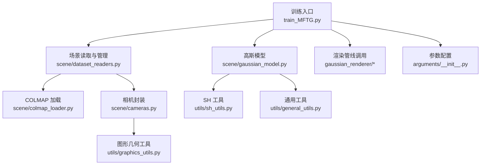
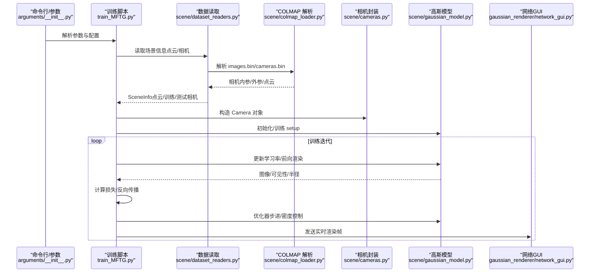
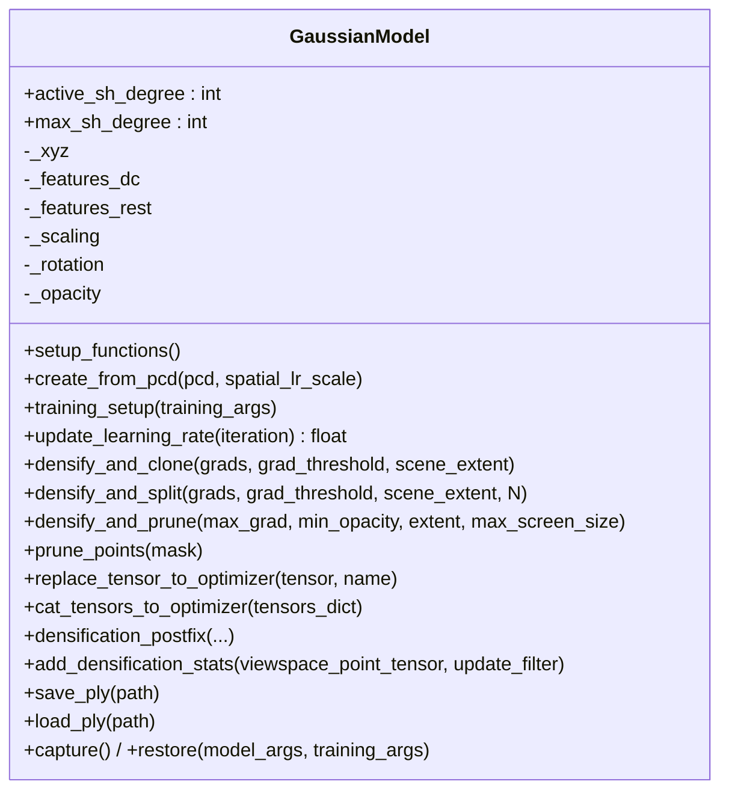
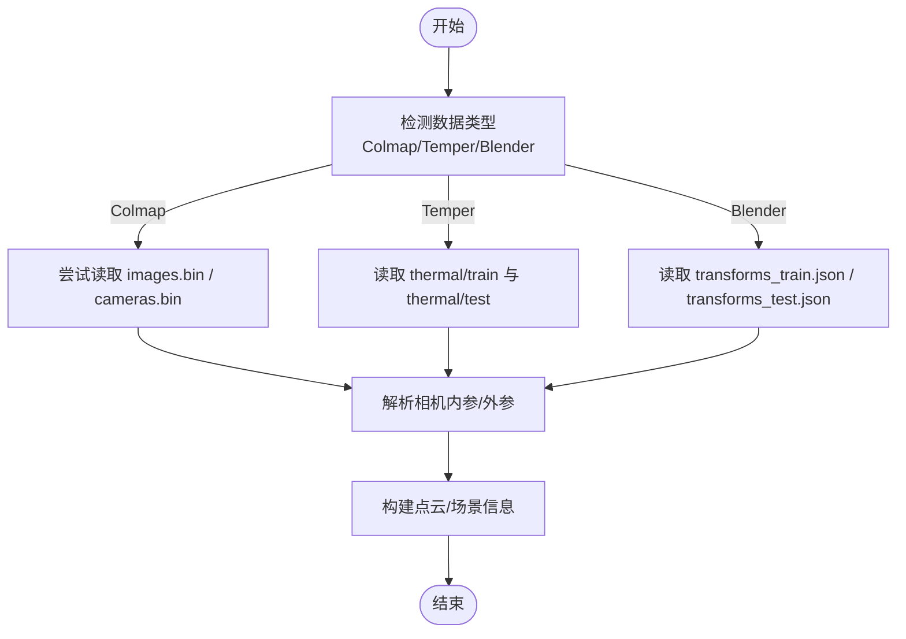
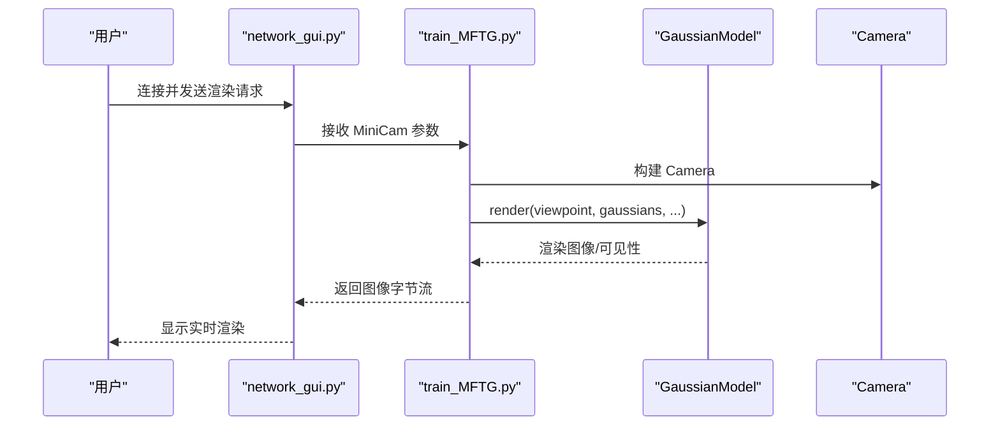
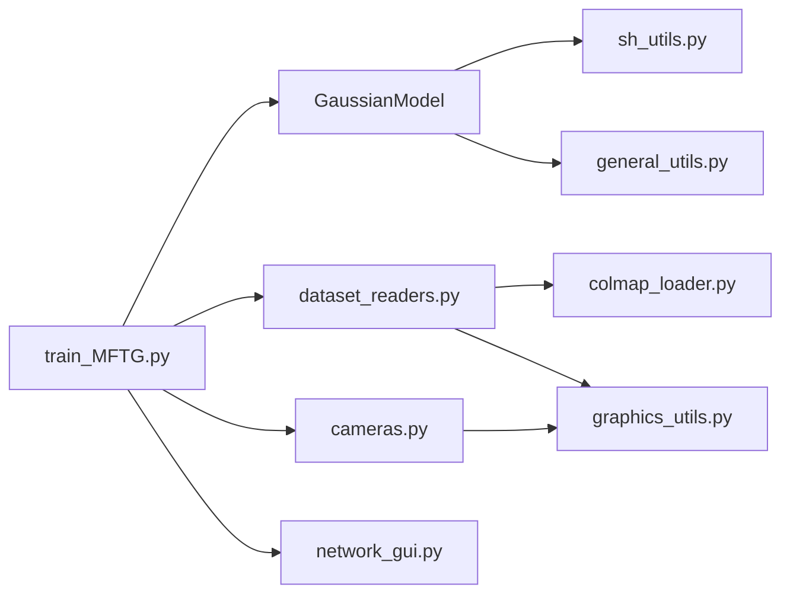

# 核心组件

<cite>
**本文引用的文件**   
- [scene/gaussian_model.py](file://scene/gaussian_model.py)
- [scene/colmap_loader.py](file://scene/colmap_loader.py)
- [scene/dataset_readers.py](file://scene/dataset_readers.py)
- [scene/cameras.py](file://scene/cameras.py)
- [train_MFTG.py](file://train_MFTG.py)
- [gaussian_renderer/network_gui.py](file://gaussian_renderer/network_gui.py)
- [utils/sh_utils.py](file://utils/sh_utils.py)
- [utils/general_utils.py](file://utils/general_utils.py)
- [utils/graphics_utils.py](file://utils/graphics_utils.py)
- [arguments/__init__.py](file://arguments/__init__.py)
- [README.md](file://README.md)
</cite>

## 目录
1. [引言](#引言)
2. [项目结构](#项目结构)
3. [核心组件](#核心组件)
4. [架构总览](#架构总览)
5. [详细组件分析](#详细组件分析)
6. [依赖分析](#依赖分析)
7. [性能考量](#性能考量)
8. [故障排查指南](#故障排查指南)
9. [结论](#结论)
10. [附录](#附录)

## 引言
本文件聚焦于 Thermal-Gaussian 的核心组件，系统性解析以下内容：
- GaussianModel 类：3D 高斯点阵的数学与实现、球谐函数（SH）颜色编码、自适应密度控制（密集化与剪枝）、学习率调度机制。
- 场景管理系统：数据加载器、COLMAP 集成、相机参数管理。
- 训练流程与可视化：点云初始化策略、训练循环、损失函数与正则化、网络 GUI 实时渲染。
- 使用模式与扩展建议：参数配置、多模态（可见光/热成像）训练流程。

## 项目结构
项目采用按功能域分层组织：核心训练脚本位于根目录，场景与渲染逻辑在 scene 与 gaussian_renderer，工具函数在 utils，参数定义在 arguments，子模块通过 git submodule 管理。

图示来源
- [train_MFTG.py:1-273](file://train_MFTG.py#L1-L273)
- [scene/dataset_readers.py:1-311](file://scene/dataset_readers.py#L1-L311)
- [scene/colmap_loader.py:1-295](file://scene/colmap_loader.py#L1-L295)
- [scene/cameras.py:1-72](file://scene/cameras.py#L1-L72)
- [scene/gaussian_model.py:1-407](file://scene/gaussian_model.py#L1-L407)
- [utils/sh_utils.py:1-118](file://utils/sh_utils.py#L1-L118)
- [utils/general_utils.py:1-134](file://utils/general_utils.py#L1-L134)
- [utils/graphics_utils.py:1-77](file://utils/graphics_utils.py#L1-L77)

章节来源
- [README.md:1-167](file://README.md#L1-L167)

## 核心组件
本节从数学与工程实现两个维度，深入剖析 GaussianModel 的关键设计与实现要点。

- 3D 高斯点阵的数学表示
  - 位置（均值）：三维向量参数化，优化时以指数映射约束尺度，保持数值稳定。
  - 协方差：由缩放向量与旋转四元数构造，确保协方差半正定；激活函数保证对称与下三角压缩。
  - 不透明度：Sigmoid 激活，便于学习阈值化与稀疏化。
  - 旋转：四元数归一化，保证正交性与避免万向节锁。

- 球谐函数（Spherical Harmonics, SH）颜色编码
  - RGB 与 SH 系数双向转换：通过常数系数进行线性变换，支持将颜色编码到 SH 空间，再解码回 RGB。
  - 多阶 SH：支持最大阶数可配置，训练中按步长逐步提升活跃阶数，平衡拟合能力与过拟合风险。

- 自适应密度控制
  - 密集化（Clone/Split）：基于梯度阈值与尺度门限选择点，复制或沿主方向加噪声分裂，维持表面细节。
  - 剪枝（Pruning）：基于不透明度阈值与屏幕投影大小，移除冗余点，降低存储与计算开销。
  - 统计累积：在每步累积视平面梯度与出现次数，用于后续密度控制决策。

- 学习率调度机制
  - 位置学习率：指数衰减函数，支持延迟放大与最大步数限制，保证早期稳定与后期收敛。
  - 其他参数：特征、不透明度、缩放、旋转分别设置独立学习率，满足不同变量的优化特性。

章节来源
- [scene/gaussian_model.py:24-407](file://scene/gaussian_model.py#L24-L407)
- [utils/sh_utils.py:114-118](file://utils/sh_utils.py#L114-L118)
- [utils/general_utils.py:29-62](file://utils/general_utils.py#L29-L62)

## 架构总览
下图展示从数据加载到训练与可视化的端到端流程。

图示来源
- [train_MFTG.py:35-163](file://train_MFTG.py#L35-L163)
- [scene/dataset_readers.py:136-181](file://scene/dataset_readers.py#L136-L181)
- [scene/colmap_loader.py:156-241](file://scene/colmap_loader.py#L156-L241)
- [scene/cameras.py:17-58](file://scene/cameras.py#L17-L58)
- [scene/gaussian_model.py:149-176](file://scene/gaussian_model.py#L149-L176)
- [gaussian_renderer/network_gui.py:26-85](file://gaussian_renderer/network_gui.py#L26-L85)

## 详细组件分析

### GaussianModel 类设计与实现
- 关键属性与激活函数
  - 缩放/不透明度/旋转的激活与逆激活，确保参数空间合理与优化稳定。
  - 协方差由缩放矩阵与旋转矩阵组合生成，并进行对称压缩。
- 点云初始化策略
  - 基于输入点云的距离统计估计初始尺度，使用单位主 quaternion 初始化旋转，不透明度经 sigmoid 映射至较小常数。
  - 特征张量按最大 SH 阶构建，DC 分量来自 RGB 转换，其余为零初始化。
- 训练准备与学习率调度
  - 为不同参数组设置独立学习率，Adam 优化器初始化。
  - 位置学习率采用指数衰减函数，支持延迟与最大步数。
- 密集化与剪枝
  - Clone：在低尺度区域复制高梯度点，保持细节。
  - Split：在高尺度区域沿主方向加正态噪声并分裂，增加分辨率。
  - Prune：移除低不透明度与超大屏幕投影点，结合最大半径阈值。
- 可视化与持久化
  - 支持保存/加载 PLY 文件，包含顶点属性与 SH 系数。
  - 提供状态捕获/恢复接口，便于断点续训。

图示来源
- [scene/gaussian_model.py:24-407](file://scene/gaussian_model.py#L24-L407)

章节来源
- [scene/gaussian_model.py:44-148](file://scene/gaussian_model.py#L44-L148)
- [scene/gaussian_model.py:149-176](file://scene/gaussian_model.py#L149-L176)
- [scene/gaussian_model.py:349-407](file://scene/gaussian_model.py#L349-L407)

### 场景管理系统与数据加载
- COLMAP 集成
  - 支持二进制与文本格式的 cameras/images/points3D 文件解析。
  - 提供相机模型枚举与四元数/旋转矩阵互转工具。
- 数据读取器
  - 读取 COLMAP 场景：解析内外参与图像列表，构造 CameraInfo 列表，生成 SceneInfo。
  - 支持温度图像场景读取（Temper 模式），路径约定为 thermal/train 与 thermal/test。
  - NeRF 合成数据读取：从 transforms.json 读取相机姿态，随机生成初始点云。
- 相机参数管理
  - Camera 封装世界到相机变换、投影矩阵与相机中心，MiniCam 用于 GUI 渲染。

图示来源
- [scene/dataset_readers.py:136-181](file://scene/dataset_readers.py#L136-L181)
- [scene/dataset_readers.py:184-230](file://scene/dataset_readers.py#L184-L230)
- [scene/dataset_readers.py:274-305](file://scene/dataset_readers.py#L274-L305)
- [scene/colmap_loader.py:156-241](file://scene/colmap_loader.py#L156-L241)

章节来源
- [scene/colmap_loader.py:16-36](file://scene/colmap_loader.py#L16-L36)
- [scene/colmap_loader.py:43-66](file://scene/colmap_loader.py#L43-L66)
- [scene/dataset_readers.py:68-109](file://scene/dataset_readers.py#L68-L109)
- [scene/cameras.py:17-58](file://scene/cameras.py#L17-L58)

### 训练流程与可视化
- 多阶段训练（MFTG）
  - 颜色图像阶段：标准 L1 + SSIM 损失。
  - 热成像阶段：在颜色损失基础上加入平滑正则项，适配热成像物理特性。
- 密集化与剪枝周期
  - 在指定迭代区间按步长执行，动态调整密度与不透明度。
- 网络 GUI 实时渲染
  - 通过 socket 接收客户端请求，构造 MiniCam 并返回渲染结果，支持训练/渲染切换与参数调节。

图示来源
- [gaussian_renderer/network_gui.py:26-85](file://gaussian_renderer/network_gui.py#L26-L85)
- [train_MFTG.py:68-83](file://train_MFTG.py#L68-L83)
- [train_MFTG.py:103-104](file://train_MFTG.py#L103-L104)

章节来源
- [train_MFTG.py:35-163](file://train_MFTG.py#L35-L163)
- [gaussian_renderer/network_gui.py:57-85](file://gaussian_renderer/network_gui.py#L57-L85)

## 依赖分析
- 内部依赖
  - GaussianModel 依赖 SH 工具进行颜色编码/解码，依赖通用工具进行激活/逆激活与旋转矩阵构造。
  - 数据读取器依赖 COLMAP 解析器与图形几何工具，相机封装依赖投影矩阵与坐标变换。
- 外部依赖
  - PyTorch 作为核心深度学习框架。
  - PLY 文件读写用于点云持久化。
  - TensorBoard（可选）用于训练日志记录。

图示来源
- [scene/gaussian_model.py:12-22](file://scene/gaussian_model.py#L12-L22)
- [utils/sh_utils.py:24-25](file://utils/sh_utils.py#L24-L25)
- [utils/general_utils.py:12-16](file://utils/general_utils.py#L12-L16)
- [scene/dataset_readers.py:16-24](file://scene/dataset_readers.py#L16-L24)
- [utils/graphics_utils.py:12-15](file://utils/graphics_utils.py#L12-L15)
- [scene/cameras.py:12-16](file://scene/cameras.py#L12-L16)
- [train_MFTG.py:17-26](file://train_MFTG.py#L17-L26)
- [gaussian_renderer/network_gui.py:12-16](file://gaussian_renderer/network_gui.py#L12-L16)

章节来源
- [scene/gaussian_model.py:12-22](file://scene/gaussian_model.py#L12-L22)
- [utils/sh_utils.py:24-25](file://utils/sh_utils.py#L24-L25)
- [utils/general_utils.py:12-16](file://utils/general_utils.py#L12-L16)
- [scene/dataset_readers.py:16-24](file://scene/dataset_readers.py#L16-L24)
- [utils/graphics_utils.py:12-15](file://utils/graphics_utils.py#L12-L15)
- [scene/cameras.py:12-16](file://scene/cameras.py#L12-L16)
- [train_MFTG.py:17-26](file://train_MFTG.py#L17-L26)
- [gaussian_renderer/network_gui.py:12-16](file://gaussian_renderer/network_gui.py#L12-L16)

## 性能考量
- 计算复杂度
  - 密集化与剪枝操作与点数规模线性相关，应结合迭代步长与阈值动态调整，避免频繁大规模重排。
  - SH 阶数越高，特征维度越大，训练成本上升，需权衡拟合精度与效率。
- 内存与显存
  - 优化器状态与梯度累积会占用显存，建议在密集化后及时剪枝，控制点数增长。
  - 使用 TensorBoard 记录指标有助于监控显存峰值与吞吐。
- 渲染效率
  - 视锥剔除与可见性过滤减少无效像素处理，配合最大半径阈值可显著降低渲染开销。

## 故障排查指南
- COLMAP 文件格式问题
  - 若二进制文件缺失，自动回退到文本格式；若仍失败，检查 sparse/0 下是否存在 cameras.txt/images.txt。
- 相机内参不匹配
  - 当前解析仅支持 PINHOLE/SIMPLE_PINHOLE 模型；若使用其他模型，需扩展解析分支。
- 点云为空或异常
  - 确认 points3D.ply 是否存在，若不存在将尝试转换；检查 RGB/热成像路径是否正确。
- 训练不稳定
  - 调整位置学习率的延迟倍数与最大步数，降低初始学习率以增强稳定性。
  - 增大不透明度重置间隔或调整密度阈值，缓解过密导致的梯度爆炸。
- GUI 连接失败
  - 确认端口未被占用，客户端与服务端 IP/端口一致；检查网络权限与防火墙设置。

章节来源
- [scene/colmap_loader.py:156-178](file://scene/colmap_loader.py#L156-L178)
- [scene/dataset_readers.py:136-181](file://scene/dataset_readers.py#L136-L181)
- [train_MFTG.py:142-158](file://train_MFTG.py#L142-L158)
- [gaussian_renderer/network_gui.py:26-41](file://gaussian_renderer/network_gui.py#L26-L41)

## 结论
Thermal-Gaussian 的核心在于将 3D 高斯点阵与球谐函数编码相结合，通过自适应密度控制与多模态正则化，在可见光与热成像双模态下实现高效训练与高质量渲染。GaussianModel 提供了完善的参数化、优化与密度管理机制；场景读取器与 COLMAP 集成保障了多源数据的一致接入；训练脚本与网络 GUI 则构成了完整的开发与调试闭环。建议在实际应用中根据数据特性调整密度阈值、学习率与 SH 阶数，并结合可视化工具持续监控训练过程。

## 附录
- 使用模式与参数建议
  - 数据准备：遵循 README 的目录结构，确保 sparse/0 与 rgb/thermal 子目录组织规范。
  - 训练顺序：先训练颜色图像，再微调热成像，利用断点保存与恢复机制衔接两阶段。
  - 参数调优：从默认优化参数出发，依据收敛曲线微调密度间隔、阈值与学习率策略。
- 扩展建议
  - 新增模态：在数据读取器中添加新场景类型回调，统一输出 SceneInfo。
  - 正则化增强：针对热成像的平滑约束可进一步引入邻域一致性损失或物理先验。
  - 渲染加速：结合可见性过滤与多分辨率策略，减少无效像素处理。

章节来源
- [README.md:28-117](file://README.md#L28-L117)
- [scene/dataset_readers.py:307-311](file://scene/dataset_readers.py#L307-L311)
- [arguments/__init__.py:47-91](file://arguments/__init__.py#L47-L91)