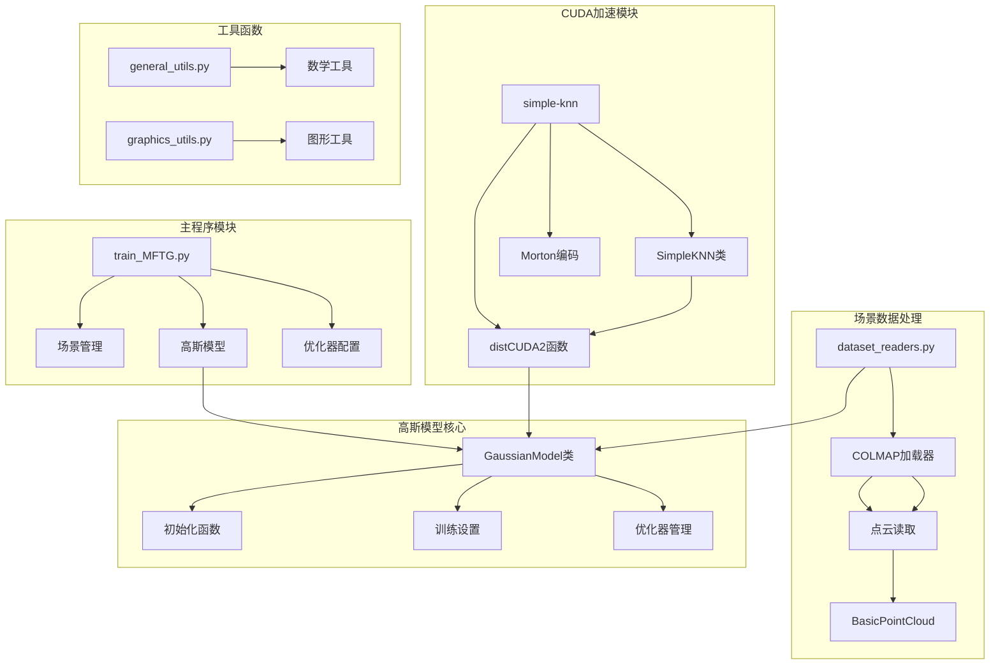
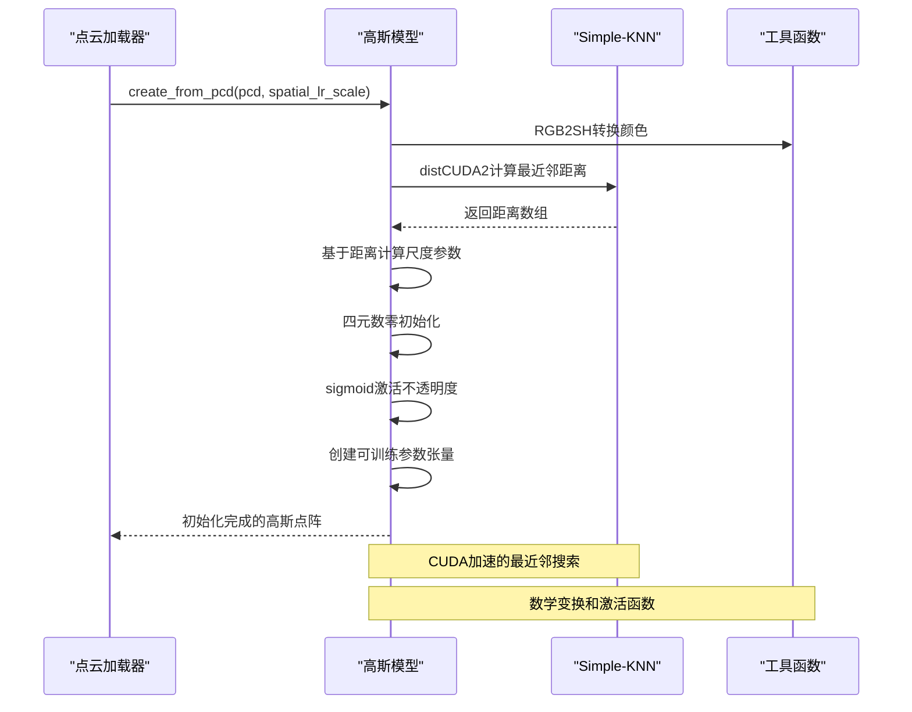
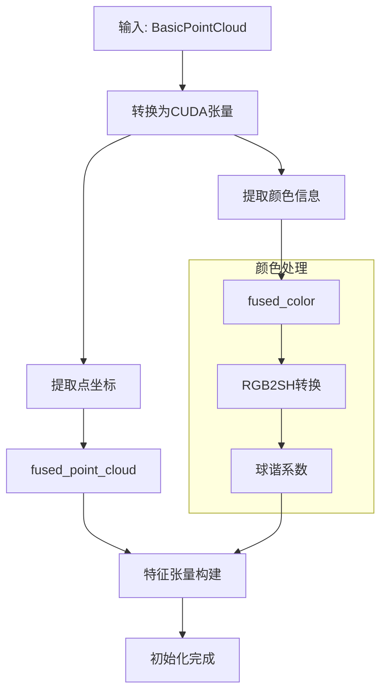
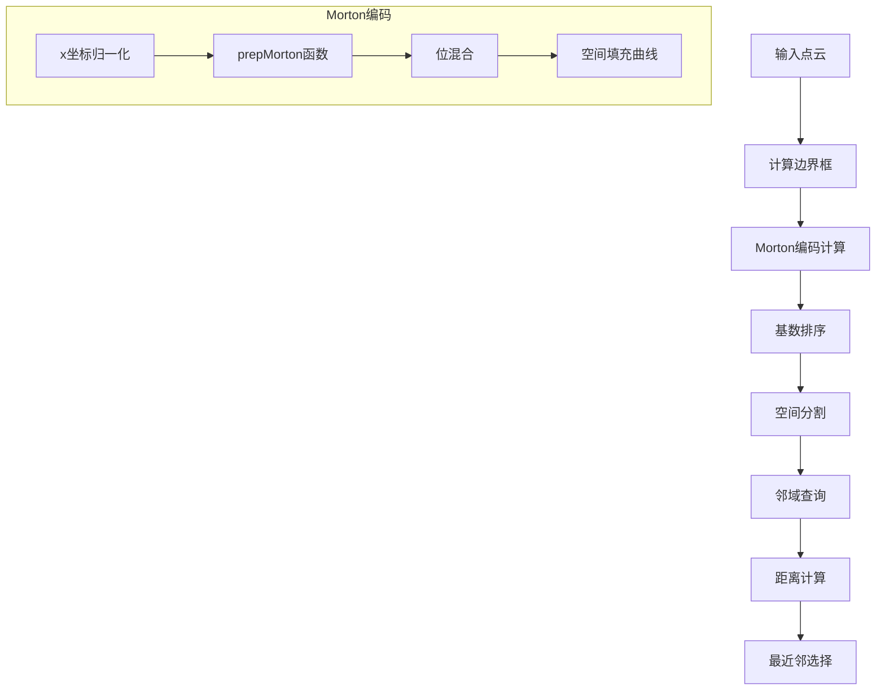
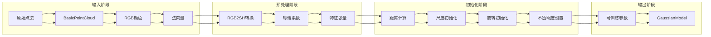
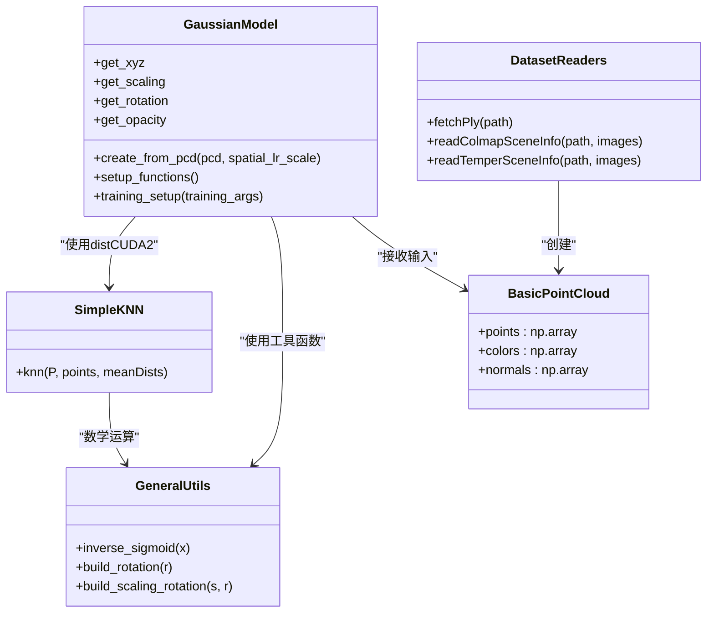

# 点云初始化策略

<cite>
**本文档引用的文件**
- [gaussian_model.py](file://scene/gaussian_model.py)
- [simple_knn.cu](file://submodules/simple-knn/simple_knn.cu)
- [simple_knn.h](file://submodules/simple-knn/simple_knn.h)
- [spatial.cu](file://submodules/simple-knn/spatial.cu)
- [ext.cpp](file://submodules/simple-knn/ext.cpp)
- [general_utils.py](file://utils/general_utils.py)
- [graphics_utils.py](file://utils/graphics_utils.py)
- [dataset_readers.py](file://scene/dataset_readers.py)
- [colmap_loader.py](file://scene/colmap_loader.py)
- [train_MFTG.py](file://train_MFTG.py)
- [arguments/__init__.py](file://arguments/__init__.py)
</cite>

## 目录
1. [简介](#简介)
2. [项目结构](#项目结构)
3. [核心组件](#核心组件)
4. [架构概览](#架构概览)
5. [详细组件分析](#详细组件分析)
6. [依赖关系分析](#依赖关系分析)
7. [性能考虑](#性能考虑)
8. [故障排除指南](#故障排除指南)
9. [结论](#结论)

## 简介

本技术文档深入解析 Thermal-Gaussian 项目中点云初始化策略的完整实现。该系统实现了从稀疏点云到高斯点阵的高效转换，包括点云去重、颜色处理、特征提取等预处理步骤。文档详细说明了基于距离的尺度初始化策略、旋转初始化机制（四元数零初始化和后续优化）、不透明度的启发式设置方法以及 Simple-KNN 最近邻搜索的 CUDA 实现细节。

该项目特别针对热成像应用进行了优化，支持从 COLMAP 稀疏重建结果中提取点云数据，并通过高斯点阵进行高效渲染和训练。

## 项目结构

项目采用模块化架构设计，主要包含以下核心模块：



**图表来源**
- [train_MFTG.py:35-273](file://train_MFTG.py#L35-L273)
- [gaussian_model.py:24-407](file://scene/gaussian_model.py#L24-L407)
- [dataset_readers.py:136-181](file://scene/dataset_readers.py#L136-L181)

**章节来源**
- [train_MFTG.py:1-273](file://train_MFTG.py#L1-L273)
- [gaussian_model.py:1-407](file://scene/gaussian_model.py#L1-L407)

## 核心组件

### 高斯模型初始化系统

高斯模型是整个点云初始化策略的核心组件，负责将稀疏点云转换为可训练的高斯点阵。其初始化过程包含以下关键步骤：

1. **点云数据预处理**：将 BasicPointCloud 转换为 PyTorch 张量
2. **颜色特征提取**：使用 SH2RGB 将 RGB 颜色转换为球谐系数
3. **距离驱动的尺度初始化**：基于最近邻距离计算初始尺度参数
4. **旋转初始化**：使用四元数零初始化并建立优化路径
5. **不透明度设置**：通过 sigmoid 激活函数实现稳定的不透明度建模

### Simple-KNN 最近邻搜索

Simple-KNN 模块提供了高效的 CUDA 实现，用于点云密度估计和邻域查询。该实现采用空间分割和 Morton 编码技术，显著提高了大规模点云的最近邻搜索效率。

**章节来源**
- [gaussian_model.py:124-148](file://scene/gaussian_model.py#L124-L148)
- [simple_knn.cu:185-221](file://submodules/simple-knn/simple_knn.cu#L185-L221)

## 架构概览



**图表来源**
- [gaussian_model.py:124-148](file://scene/gaussian_model.py#L124-L148)
- [simple_knn.cu:185-221](file://submodules/simple-knn/simple_knn.cu#L185-L221)
- [general_utils.py:18-19](file://utils/general_utils.py#L18-L19)

## 详细组件分析

### 点云初始化流程

#### 步骤1：点云数据准备
初始化过程首先将 BasicPointCloud 对象转换为 GPU 张量格式：



**图表来源**
- [gaussian_model.py:126-131](file://scene/gaussian_model.py#L126-L131)

#### 步骤2：距离驱动的尺度初始化
系统使用 Simple-KNN 计算每个点的最近邻距离，然后基于这些距离设置初始尺度参数：

```mermaid
flowchart TD
A[点云坐标] --> B[distCUDA2计算距离]
B --> C[获取最近邻距离]
C --> D[计算log(sqrt(dist2))]
D --> E[重复为3维尺度]
E --> F[初始尺度矩阵]
subgraph "数学公式"
G[尺度 = log(sqrt(dist2))] --> H[对数变换]
H --> I[平方根变换]
I --> J[距离平方]
end
F --> K[尺度激活函数]
K --> L[指数函数]
```

**图表来源**
- [gaussian_model.py:134-135](file://scene/gaussian_model.py#L134-L135)
- [general_utils.py:33-39](file://utils/general_utils.py#L33-L39)

#### 步骤3：旋转初始化机制
旋转初始化采用四元数零初始化策略：

```mermaid
flowchart TD
A[创建四元数张量] --> B[初始化为零]
B --> C[设置第一个元素为1]
C --> D[归一化处理]
D --> E[旋转矩阵计算]
E --> F[使用四元数到旋转矩阵转换]
subgraph "四元数处理"
G[q = [1, 0, 0, 0]] --> H[单位四元数]
H --> I[R = R(q)]
end
F --> J[旋转激活函数]
J --> K[向量归一化]
```

**图表来源**
- [gaussian_model.py:136-137](file://scene/gaussian_model.py#L136-L137)
- [general_utils.py:78-99](file://utils/general_utils.py#L78-L99)

#### 步骤4：不透明度启发式设置
不透明度使用 sigmoid 激活函数进行建模：

```mermaid
flowchart TD
A[输入: 0.1] --> B[inverse_sigmoid函数]
B --> C[计算log(0.1/0.9)]
C --> D[初始不透明度值]
D --> E[sigmoid激活]
E --> F[输出: 0.1]
subgraph "数学原理"
G[y = inverse_sigmoid(x)] --> H[log(x/(1-x))]
H --> I[将概率映射到实数轴]
I --> J[便于优化]
end
F --> K[不透明度激活函数]
K --> L[σ(z) = 1/(1+e^(-z))]
```

**图表来源**
- [gaussian_model.py:139](file://scene/gaussian_model.py#L139)
- [general_utils.py:18-19](file://utils/general_utils.py#L18-L19)

### Simple-KNN CUDA 实现详解

Simple-KNN 模块提供了高效的最近邻搜索算法，采用以下关键技术：

#### 空间分割和 Morton 编码


**图表来源**
- [simple_knn.cu:45-61](file://submodules/simple-knn/simple_knn.cu#L45-L61)
- [simple_knn.cu:185-221](file://submodules/simple-knn/simple_knn.cu#L185-L221)

#### CUDA 内核优化
Simple-KNN 实现了多个专门的 CUDA 内核来处理不同的计算任务：

1. **Morton 编码内核**：将三维坐标转换为一维索引
2. **边界框计算内核**：并行计算点云的最小包围盒
3. **最近邻搜索内核**：使用分箱策略进行高效搜索
4. **距离计算内核**：计算点与点之间的欧几里得距离

**章节来源**
- [simple_knn.cu:63-70](file://submodules/simple-knn/simple_knn.cu#L63-L70)
- [simple_knn.cu:78-117](file://submodules/simple-knn/simple_knn.cu#L78-L117)
- [simple_knn.cu:147-183](file://submodules/simple-knn/simple_knn.cu#L147-L183)

### 数据流和处理逻辑



**图表来源**
- [gaussian_model.py:124-148](file://scene/gaussian_model.py#L124-L148)
- [graphics_utils.py:17-21](file://utils/graphics_utils.py#L17-L21)

**章节来源**
- [gaussian_model.py:124-148](file://scene/gaussian_model.py#L124-L148)
- [graphics_utils.py:17-21](file://utils/graphics_utils.py#L17-L21)

## 依赖关系分析

### 组件耦合关系



**图表来源**
- [gaussian_model.py:24-407](file://scene/gaussian_model.py#L24-L407)
- [simple_knn.h:15-19](file://submodules/simple-knn/simple_knn.h#L15-L19)
- [graphics_utils.py:17-21](file://utils/graphics_utils.py#L17-L21)
- [general_utils.py:18-19](file://utils/general_utils.py#L18-L19)

### 外部依赖和集成点

系统集成了多个外部库和模块：

1. **PyTorch 生态系统**：用于张量计算和神经网络
2. **CUDA 运行时**：提供 GPU 加速计算能力
3. **CUB 库**：CUDA Unbound 库，提供高效的并行算法
4. **COLMAP**：用于稀疏重建和相机参数估计
5. **PIL**：图像处理和颜色空间转换

**章节来源**
- [gaussian_model.py:12-22](file://scene/gaussian_model.py#L12-L22)
- [simple_knn.cu:14-25](file://submodules/simple-knn/simple_knn.cu#L14-L25)

## 性能考虑

### CUDA 优化策略

1. **内存访问模式优化**：通过 Morton 编码确保相邻的空间点在内存中也相邻
2. **并行化策略**：使用 CUDA 线程块和网格结构最大化 GPU 利用率
3. **共享内存使用**：在 boxMinMax 内核中使用共享内存减少全局内存访问
4. **分支优化**：最小化条件分支以提高线程执行效率

### 训练效率优化

1. **学习率调度**：指数衰减的学习率策略
2. **参数特定学习率**：不同参数组使用不同的学习率
3. **梯度累积**：在 densification 过程中累积梯度信息
4. **动态密度调整**：根据场景复杂度自适应调整点云密度

## 故障排除指南

### 常见问题和解决方案

#### 初始化失败
**问题**：点云初始化过程中出现错误
**可能原因**：
- 输入点云为空或格式不正确
- CUDA 设备不可用
- 内存不足

**解决方案**：
1. 验证输入点云的质量和完整性
2. 检查 CUDA 驱动和设备状态
3. 减少点云规模或增加 GPU 内存

#### 训练不稳定
**问题**：训练过程中损失函数波动或发散
**可能原因**：
- 学习率设置不当
- 初始尺度参数不合适
- 不透明度设置问题

**解决方案**：
1. 调整学习率参数
2. 检查尺度初始化的合理性
3. 使用默认的不透明度设置

#### 性能问题
**问题**：初始化或训练速度过慢
**可能原因**：
- 点云规模过大
- CUDA 内核未正确编译
- 内存带宽限制

**解决方案**：
1. 优化点云规模
2. 重新编译 CUDA 扩展
3. 检查 GPU 内存使用情况

**章节来源**
- [gaussian_model.py:149-168](file://scene/gaussian_model.py#L149-L168)
- [train_MFTG.py:142-158](file://train_MFTG.py#L142-L158)

## 结论

 Thermal-Gaussian 项目的点云初始化策略展现了现代三维重建系统的最佳实践。通过精心设计的距离驱动尺度初始化、稳健的旋转和不透明度建模，以及高效的 CUDA 实现，该系统能够处理大规模点云数据并实现高质量的渲染效果。

关键创新点包括：
1. **智能尺度初始化**：基于点云密度的自适应尺度设置
2. **高效的最近邻搜索**：利用空间分割和 Morton 编码的 CUDA 实现
3. **稳健的数值优化**：使用 sigmoid 激活函数和适当的初始化策略
4. **模块化架构设计**：清晰的组件分离和接口定义

该初始化策略为热成像和其他应用提供了坚实的基础，支持进一步的功能扩展和性能优化。