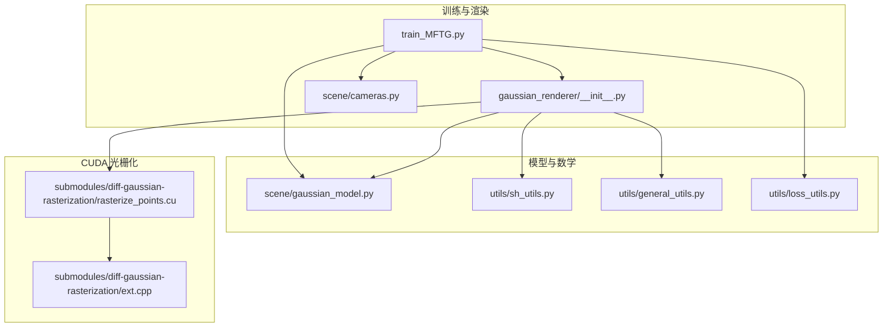
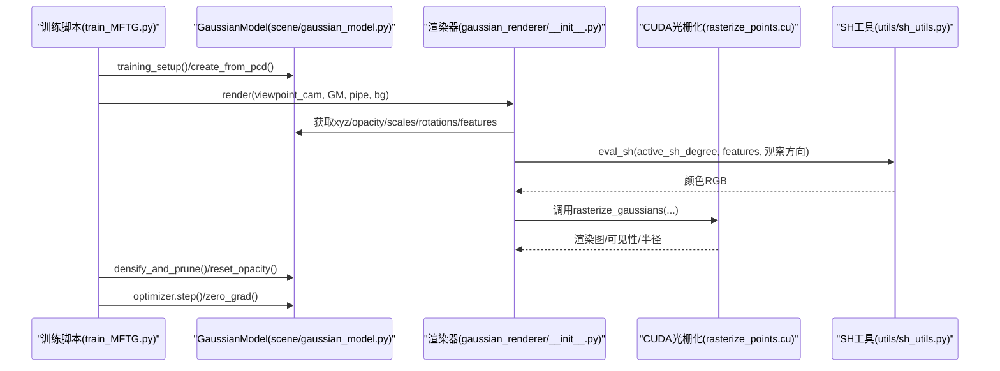
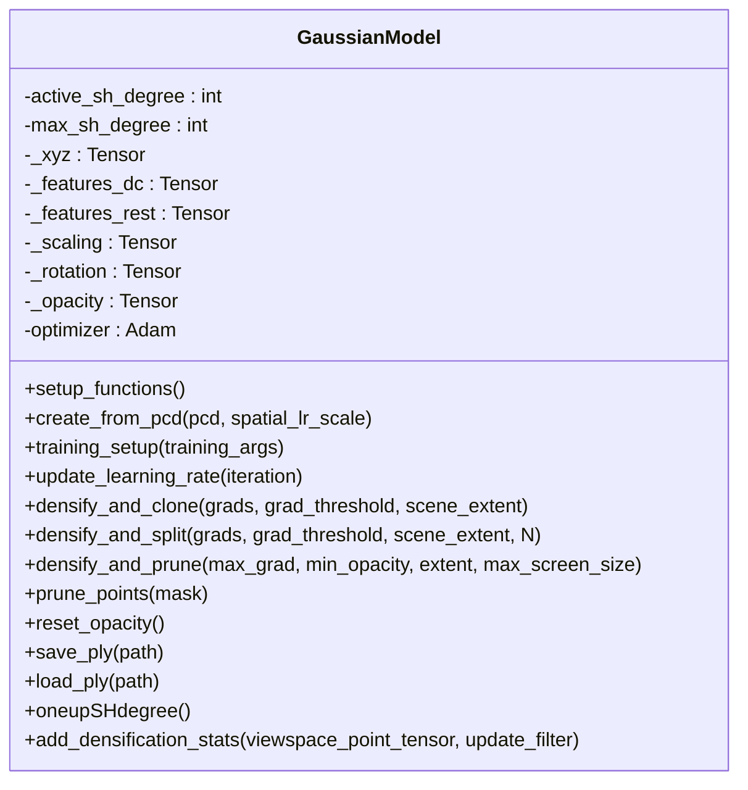
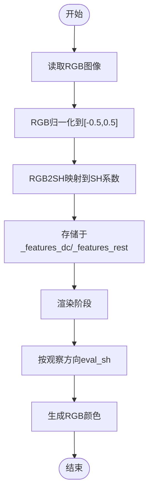
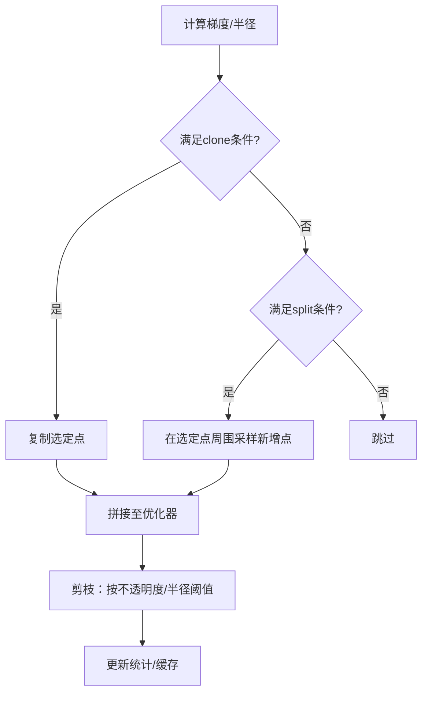
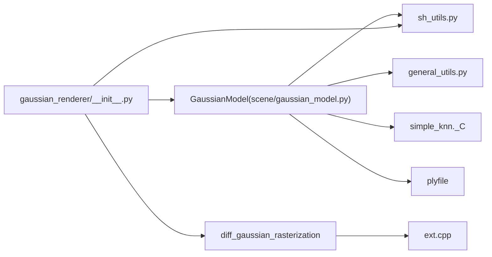

# 高斯模型核心

<cite>
**本文引用的文件列表**
- [scene/gaussian_model.py](file://scene/gaussian_model.py)
- [utils/sh_utils.py](file://utils/sh_utils.py)
- [train_MFTG.py](file://train_MFTG.py)
- [gaussian_renderer/__init__.py](file://gaussian_renderer/__init__.py)
- [submodules/diff-gaussian-rasterization/rasterize_points.cu](file://submodules/diff-gaussian-rasterization/rasterize_points.cu)
- [submodules/diff-gaussian-rasterization/ext.cpp](file://submodules/diff-gaussian-rasterization/ext.cpp)
- [utils/general_utils.py](file://utils/general_utils.py)
- [utils/loss_utils.py](file://utils/loss_utils.py)
- [gaussian_renderer/network_gui.py](file://gaussian_renderer/network_gui.py)
- [scene/cameras.py](file://scene/cameras.py)
- [MFTG-Technical-Doc.md](file://MFTG-Technical-Doc.md)
- [README.md](file://README.md)
- [arguments/__init__.py](file://arguments/__init__.py)
</cite>

## 目录
1. [简介](#简介)
2. [项目结构](#项目结构)
3. [核心组件](#核心组件)
4. [架构总览](#架构总览)
5. [详细组件分析](#详细组件分析)
6. [依赖关系分析](#依赖关系分析)
7. [性能考量](#性能考量)
8. [故障排查指南](#故障排查指南)
9. [结论](#结论)
10. [附录](#附录)

## 简介
本技术文档围绕 ThermalGaussian 项目中的 GaussianModel 类进行系统性解析，重点阐述其在 3D 高斯点阵渲染中的数学表示与实现原理，包括：
- 位置(x,y,z)、颜色特征(F_dc, F_rest)、缩放(scaling)、旋转(rotation)、不透明度(opacity)等核心参数的参数化与激活策略
- 球谐函数(Spherical Harmonics, SH)颜色编码机制，以及 RGB 到 SH 的转换与多阶展开
- 自适应密度控制策略：点云初始化、密集化(densification)、剪枝(pruning)的实现细节
- 参数优化器配置、学习率调度、CUDA 张量操作等关键技术细节
- 提供完整的代码示例路径与使用模式，帮助开发者理解高斯点阵渲染的核心机制

## 项目结构
该项目基于 3D 高斯点阵渲染框架，结合 ThermalGaussian 的两阶段训练策略（MFTG）。核心文件组织如下：
- 场景与模型：scene/gaussian_model.py 定义 GaussianModel 类；scene/cameras.py 定义相机对象
- 渲染管线：gaussian_renderer/__init__.py 实现渲染接口；submodules/diff-gaussian-rasterization 提供 CUDA 光栅化实现
- 数学工具：utils/sh_utils.py 提供 SH 基函数与 RGB↔SH 转换；utils/general_utils.py 提供旋转矩阵、缩放-旋转构建、指数型学习率调度等
- 训练脚本：train_MFTG.py 实现两阶段训练流程；arguments/__init__.py 定义命令行参数
- 损失与可视化：utils/loss_utils.py 提供 L1/SSIM/平滑损失；gaussian_renderer/network_gui.py 提供网络 GUI 交互

图表来源
- [train_MFTG.py:35-163](file://train_MFTG.py#L35-L163)
- [gaussian_renderer/__init__.py:18-101](file://gaussian_renderer/__init__.py#L18-L101)
- [scene/gaussian_model.py:24-407](file://scene/gaussian_model.py#L24-L407)
- [utils/sh_utils.py:57-118](file://utils/sh_utils.py#L57-L118)
- [utils/general_utils.py:78-111](file://utils/general_utils.py#L78-L111)
- [submodules/diff-gaussian-rasterization/rasterize_points.cu:35-115](file://submodules/diff-gaussian-rasterization/rasterize_points.cu#L35-L115)
- [submodules/diff-gaussian-rasterization/ext.cpp:15-19](file://submodules/diff-gaussian-rasterization/ext.cpp#L15-L19)

章节来源
- [README.md:13-167](file://README.md#L13-L167)
- [MFTG-Technical-Doc.md:1-618](file://MFTG-Technical-Doc.md#L1-L618)

## 核心组件
本节聚焦 GaussianModel 类及其关键方法，涵盖参数化、激活函数、优化器配置、密度控制与持久化等。

- 参数化与激活
  - 位置：直接存储为可训练参数，无显式激活
  - 颜色特征：DC（主分量）与余项（rest），以 SH 系数形式存储，训练时通过 SH 基函数合成颜色
  - 缩放：指数激活，确保尺度为正
  - 旋转：四元数归一化激活，保证旋转矩阵正交性
  - 不透明度：Sigmoid 激活，映射到(0,1)区间
- 优化器配置
  - Adam 优化器，按参数组设置不同学习率：xyz、f_dc、f_rest、opacity、scaling、rotation
  - 位置学习率采用指数衰减调度
- 密度控制
  - clone：复制梯度较大的点
  - split：在选定点周围按缩放与旋转采样新增点
  - prune：根据不透明度与屏幕半径阈值剪枝
- 持久化与加载
  - 支持保存/恢复 PLY 文件与优化器状态字典

章节来源
- [scene/gaussian_model.py:44-147](file://scene/gaussian_model.py#L44-L147)
- [scene/gaussian_model.py:149-168](file://scene/gaussian_model.py#L149-L168)
- [scene/gaussian_model.py:291-407](file://scene/gaussian_model.py#L291-L407)

## 架构总览
下图展示从训练脚本到渲染器再到 CUDA 光栅化的整体流程，以及 SH 颜色合成与优化器更新的关键节点。

图表来源
- [train_MFTG.py:68-158](file://train_MFTG.py#L68-L158)
- [gaussian_renderer/__init__.py:18-101](file://gaussian_renderer/__init__.py#L18-L101)
- [submodules/diff-gaussian-rasterization/rasterize_points.cu:35-115](file://submodules/diff-gaussian-rasterization/rasterize_points.cu#L35-L115)
- [utils/sh_utils.py:57-118](file://utils/sh_utils.py#L57-L118)

## 详细组件分析

### GaussianModel 类与参数化
- 参数与属性
  - _xyz：点云位置，形状(N,3)，可训练
  - _features_dc/_features_rest：SH 系数，DC 为主分量，rest 为余项，形状(N, C, (sh_degree+1)^2)，C=3
  - _scaling：缩放参数，形状(N,3)，经指数激活
  - _rotation：四元数，形状(N,4)，经归一化激活
  - _opacity：不透明度，形状(N,1)，经 Sigmoid 激活
- 激活与协方差
  - scaling_activation：指数
  - rotation_activation：四元数归一化
  - opacity_activation：Sigmoid
  - covariance_activation：由缩放与旋转构建协方差矩阵（对称压缩）
- 初始化与加载
  - create_from_pcd：从 COLMAP 点云初始化，RGB 转 SH，缩放按 KNN 距离对数初始化，旋转单位四元数，不透明度 Sigmoid 反函数初始化
  - load_ply/save_ply：PLY 文件读写，包含 xyz、f_dc、f_rest、opacity、scale、rot 等属性
- 优化器与学习率
  - training_setup：按参数组设置学习率，Adam 优化器
  - update_learning_rate：位置学习率指数衰减
- 密度控制
  - densify_and_clone：复制梯度较大且缩放较小的点
  - densify_and_split：在选定点周围按缩放与旋转采样新增点，再剪枝
  - densify_and_prune：综合 clone/split 后剪枝
  - prune_points/cat_tensors_to_optimizer/replace_tensor_to_optimizer：按掩码剪枝并同步优化器状态
  - reset_opacity：将不透明度重置为较小值，避免过饱和
- 可视化统计
  - add_densification_stats：累积视平面梯度与计数，用于密度控制

图表来源
- [scene/gaussian_model.py:24-407](file://scene/gaussian_model.py#L24-L407)

章节来源
- [scene/gaussian_model.py:26-42](file://scene/gaussian_model.py#L26-L42)
- [scene/gaussian_model.py:124-147](file://scene/gaussian_model.py#L124-L147)
- [scene/gaussian_model.py:149-168](file://scene/gaussian_model.py#L149-L168)
- [scene/gaussian_model.py:291-407](file://scene/gaussian_model.py#L291-L407)

### 球谐函数与颜色编码
- SH 基函数
  - 支持最高 4 阶 SH，提供多项式硬编码实现
  - eval_sh：在单位方向上求值，返回对应通道的颜色
- RGB↔SH 转换
  - RGB2SH：将 RGB 归一化到 [-0.5, 0.5] 后按 SH 系数比例变换
  - SH2RGB：将 SH 系数映射回 RGB
- 渲染端颜色合成
  - 若启用 Python 端 SH→RGB，则在渲染前将 SH 系数按观察方向合成颜色；否则由 CUDA 光栅化器直接使用 SH 系数

图表来源
- [utils/sh_utils.py:114-118](file://utils/sh_utils.py#L114-L118)
- [gaussian_renderer/__init__.py:72-82](file://gaussian_renderer/__init__.py#L72-L82)

章节来源
- [utils/sh_utils.py:57-118](file://utils/sh_utils.py#L57-L118)
- [gaussian_renderer/__init__.py:72-82](file://gaussian_renderer/__init__.py#L72-L82)

### 自适应密度控制策略
- 密集化条件
  - clone：梯度范数≥阈值且缩放不超过阈值×场景范围
  - split：梯度范数≥阈值且缩放超过阈值×场景范围
- 新增点策略
  - 在选定点周围按缩放参数采样三维高斯噪声，经旋转矩阵变换后平移到新位置
  - 新缩放参数按当前缩放除以常数因子并取逆激活
- 剪枝策略
  - 基于不透明度阈值与屏幕半径阈值，必要时叠加大尺寸点过滤
- 统计与更新
  - 通过 add_densification_stats 累积视平面梯度，denom 计数，用于后续密度控制

图表来源
- [scene/gaussian_model.py:374-394](file://scene/gaussian_model.py#L374-L394)
- [scene/gaussian_model.py:349-373](file://scene/gaussian_model.py#L349-L373)
- [scene/gaussian_model.py:405-407](file://scene/gaussian_model.py#L405-L407)

章节来源
- [scene/gaussian_model.py:349-394](file://scene/gaussian_model.py#L349-L394)
- [scene/gaussian_model.py:405-407](file://scene/gaussian_model.py#L405-L407)

### 参数优化器配置与学习率调度
- 优化器参数组
  - xyz：位置学习率，随迭代指数衰减
  - f_dc/f_rest：颜色学习率，分别设置为 feature_lr 与 feature_lr/20
  - opacity/scaling/rotation：各自独立学习率
- 学习率调度
  - 位置学习率采用指数型调度函数，支持延迟倍率与最大步数
- 优化循环
  - 每次迭代更新学习率，前向渲染，计算损失，反向传播，优化器步进，清零梯度

章节来源
- [scene/gaussian_model.py:149-168](file://scene/gaussian_model.py#L149-L168)
- [utils/general_utils.py:29-62](file://utils/general_utils.py#L29-L62)
- [train_MFTG.py:86-158](file://train_MFTG.py#L86-L158)

### CUDA 张量操作与光栅化
- 光栅化接口
  - RasterizeGaussiansCUDA：接收背景、均值、颜色、不透明度、缩放、旋转、协方差、视图/投影矩阵、相机中心、SH 系数等，输出渲染图与半径
  - RasterizeGaussiansBackwardCUDA：反向传播，输出各参数梯度
  - markVisible：标记可见点
- 扩展绑定
  - ext.cpp 将上述函数暴露为 Python 扩展接口

章节来源
- [submodules/diff-gaussian-rasterization/rasterize_points.cu:35-196](file://submodules/diff-gaussian-rasterization/rasterize_points.cu#L35-L196)
- [submodules/diff-gaussian-rasterization/ext.cpp:15-19](file://submodules/diff-gaussian-rasterization/ext.cpp#L15-L19)

### 渲染流程与损失函数
- 渲染流程
  - 构建光栅化设置（分辨率、FOV、视图矩阵、投影矩阵、SH 阶数、相机中心）
  - 选择是否预计算协方差或由光栅化器计算
  - 选择是否在 Python 端将 SH 转 RGB 或由 CUDA 光栅化器完成
  - 调用光栅化器，得到渲染图、可见性与半径
- 损失函数
  - L1 与 SSIM 组合损失
  - Phase 2（热红外）增加平滑损失，鼓励温度场平滑

章节来源
- [gaussian_renderer/__init__.py:18-101](file://gaussian_renderer/__init__.py#L18-L101)
- [utils/loss_utils.py:20-114](file://utils/loss_utils.py#L20-L114)
- [train_MFTG.py:106-114](file://train_MFTG.py#L106-L114)

## 依赖关系分析
- 内部依赖
  - GaussianModel 依赖 utils/sh_utils、utils/general_utils、simple-knn（distCUDA2）与 PLY 读写
  - 渲染器依赖 diff-gaussian-rasterization 的 CUDA 扩展
- 外部依赖
  - PyTorch、NumPy、Pillow、OpenCV、TensorBoard（可选）

图表来源
- [scene/gaussian_model.py:12-22](file://scene/gaussian_model.py#L12-L22)
- [gaussian_renderer/__init__.py:12-17](file://gaussian_renderer/__init__.py#L12-L17)
- [submodules/diff-gaussian-rasterization/ext.cpp:12-19](file://submodules/diff-gaussian-rasterization/ext.cpp#L12-L19)

章节来源
- [scene/gaussian_model.py:12-22](file://scene/gaussian_model.py#L12-L22)
- [gaussian_renderer/__init__.py:12-17](file://gaussian_renderer/__init__.py#L12-L17)

## 性能考量
- 显存与吞吐
  - SH 阶数越高，存储与计算成本越大；可通过降低 sh_degree 控制显存
  - 密集化会显著增加点数，需合理设置密度阈值与间隔
- 训练稳定性
  - 位置学习率指数衰减有助于稳定收敛
  - 不透明度重置可避免过饱和导致的数值不稳定
- 渲染效率
  - 协方差预计算可减少光栅化器内部计算开销
  - Python 端 SH→RGB 与 CUDA 端 SH→RGB 的选择影响内存带宽与计算负载

[本节为通用性能讨论，无需特定文件来源]

## 故障排查指南
- 渲染异常或 NaN
  - 检查不透明度是否接近 1 或 0，必要时调用 reset_opacity
  - 检查缩放参数是否过大，导致协方差数值不稳定
- 显存不足
  - 降低分辨率或 SH 阶数
  - 减少密集化间隔或增大密度阈值
- 训练不收敛
  - 检查学习率设置与指数衰减参数
  - 确认相机位姿与投影矩阵正确
- PLY 读写问题
  - 确保属性名称与顺序与构造函数一致

章节来源
- [scene/gaussian_model.py:210-214](file://scene/gaussian_model.py#L210-L214)
- [scene/gaussian_model.py:177-189](file://scene/gaussian_model.py#L177-L189)
- [scene/gaussian_model.py:191-208](file://scene/gaussian_model.py#L191-L208)

## 结论
GaussianModel 类通过参数化的位置、颜色（SH）、缩放、旋转与不透明度，结合指数/归一化/Sigmoid 激活，实现了稳定的 3D 高斯点阵渲染。配合 Python 端 SH→RGB 合成与 CUDA 光栅化，既能高效渲染又能灵活控制密度。两阶段训练策略（MFTG）进一步展示了如何在 RGB 与热红外模态间共享几何与优化参数，实现跨模态的高质量渲染。

[本节为总结性内容，无需特定文件来源]

## 附录
- 关键参数与默认值
  - sh_degree：3（默认）
  - position_lr_init：0.00016
  - feature_lr：0.0025
  - opacity_lr：0.05
  - scaling_lr：0.005
  - rotation_lr：0.001
  - lambda_dssim：0.2
  - densify_grad_threshold：0.0002
  - percent_dense：0.01
- 命令行参数与使用
  - 训练：python train_MFTG.py -s <source_path> -m <model_path>
  - 渲染：python render.py -m <model_path>
  - 评估：python metrics.py -m <model_path>

章节来源
- [arguments/__init__.py:47-91](file://arguments/__init__.py#L47-L91)
- [README.md:64-117](file://README.md#L64-L117)
- [MFTG-Technical-Doc.md:366-450](file://MFTG-Technical-Doc.md#L366-L450)