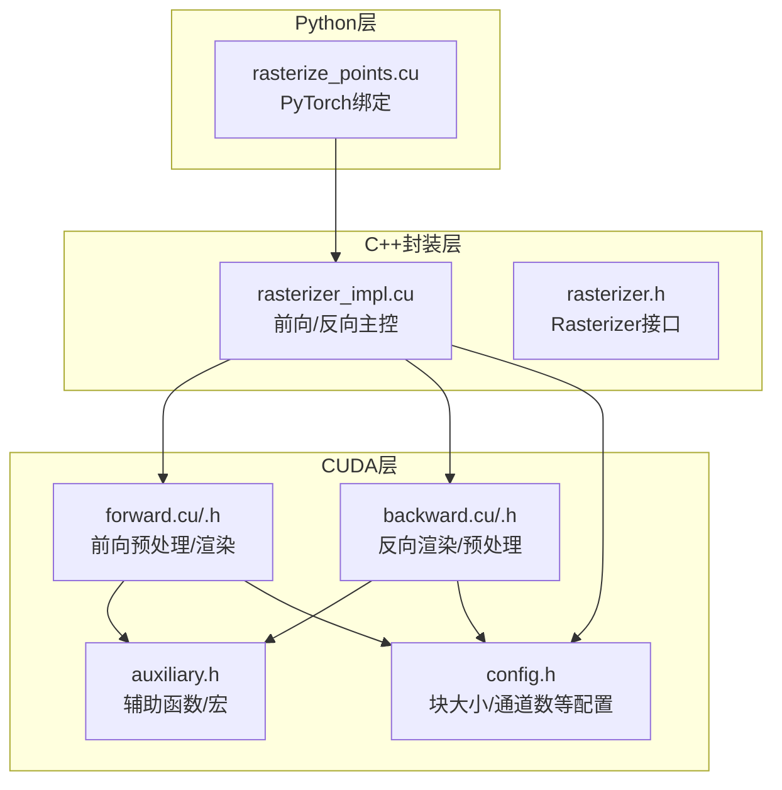
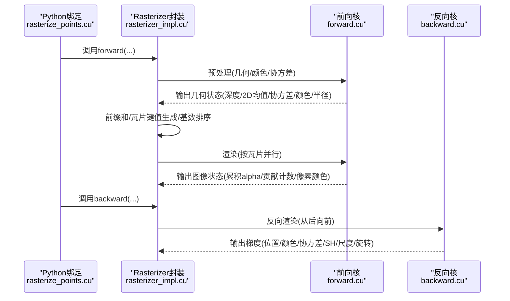
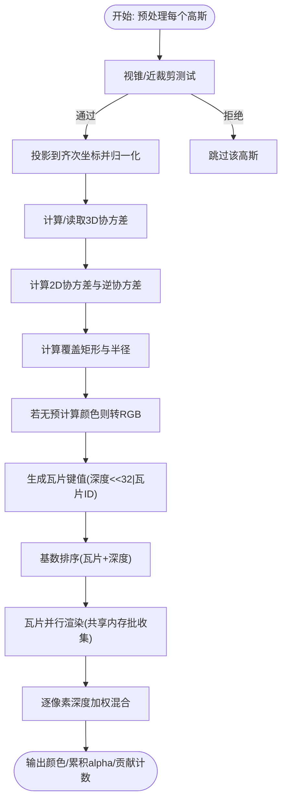
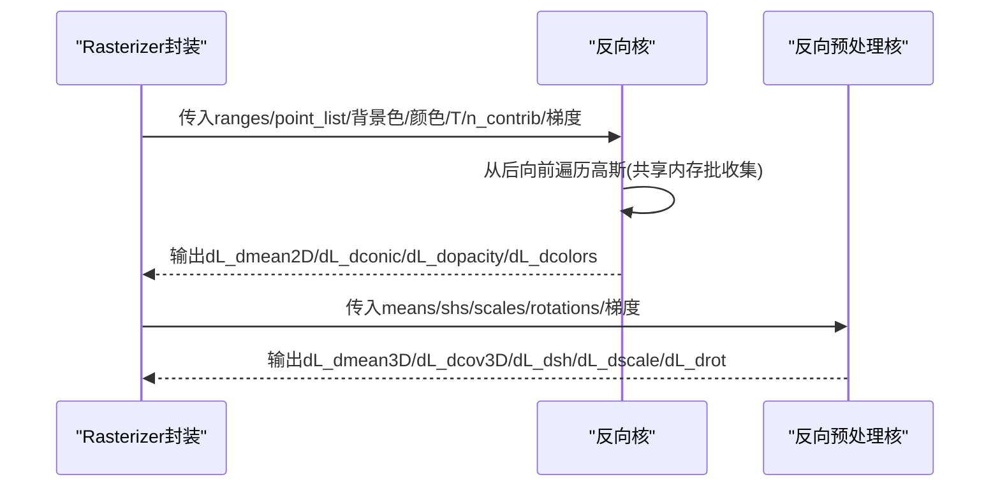
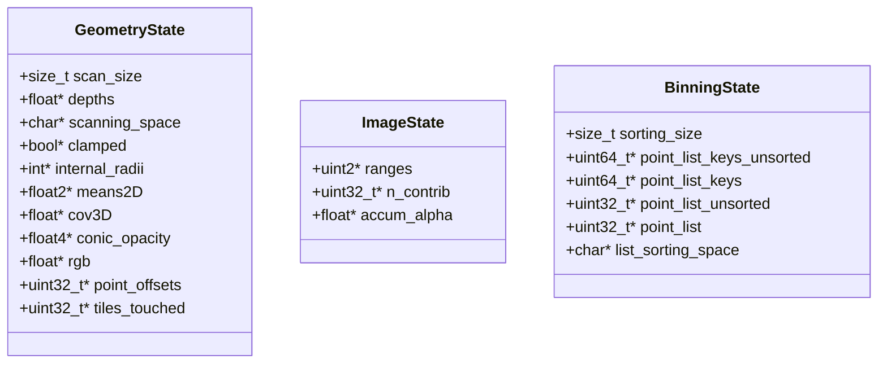
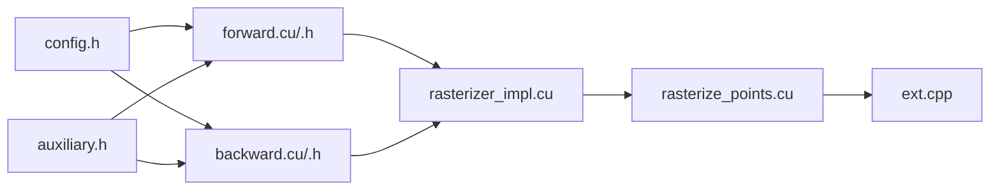

# 光栅化算法

<cite>
**本文引用的文件**
- [rasterizer.h](file://submodules/diff-gaussian-rasterization/cuda_rasterizer/rasterizer.h)
- [rasterizer_impl.h](file://submodules/diff-gaussian-rasterization/cuda_rasterizer/rasterizer_impl.h)
- [rasterizer_impl.cu](file://submodules/diff-gaussian-rasterization/cuda_rasterizer/rasterizer_impl.cu)
- [forward.h](file://submodules/diff-gaussian-rasterization/cuda_rasterizer/forward.h)
- [forward.cu](file://submodules/diff-gaussian-rasterization/cuda_rasterizer/forward.cu)
- [backward.h](file://submodules/diff-gaussian-rasterization/cuda_rasterizer/backward.h)
- [backward.cu](file://submodules/diff-gaussian-rasterization/cuda_rasterizer/backward.cu)
- [auxiliary.h](file://submodules/diff-gaussian-rasterization/cuda_rasterizer/auxiliary.h)
- [config.h](file://submodules/diff-gaussian-rasterization/cuda_rasterizer/config.h)
- [rasterize_points.h](file://submodules/diff-gaussian-rasterization/rasterize_points.h)
- [rasterize_points.cu](file://submodules/diff-gaussian-rasterization/rasterize_points.cu)
- [ext.cpp](file://submodules/diff-gaussian-rasterization/ext.cpp)
- [CMakeLists.txt](file://submodules/diff-gaussian-rasterization/CMakeLists.txt)
- [gaussian_model.py](file://scene/gaussian_model.py)
</cite>

## 目录
1. [引言](#引言)
2. [项目结构](#项目结构)
3. [核心组件](#核心组件)
4. [架构总览](#架构总览)
5. [详细组件分析](#详细组件分析)
6. [依赖关系分析](#依赖关系分析)
7. [性能考量](#性能考量)
8. [故障排查指南](#故障排查指南)
9. [结论](#结论)
10. [附录](#附录)

## 引言
本文件面向Thermal-Gaussian项目中的CUDA光栅化子模块，系统性阐述3D高斯点阵的CUDA光栅化实现，涵盖前向渲染流程、深度与透明度（alpha）混合机制、核心数据结构、CUDA核函数设计与内存访问模式、高斯点的屏幕空间投影与椭圆覆盖计算、以及重叠像素处理策略。同时提供参数配置建议、性能优化技巧与调试方法，并给出算法复杂度分析与可视化图示，帮助读者在工程实践中高效使用与扩展该光栅化器。

## 项目结构
该子模块位于diff-gaussian-rasterization目录下，采用“CUDA内核 + C++封装 + PyTorch绑定”的分层组织方式：
- CUDA层：实现前向/反向光栅化、辅助工具与状态管理
- C++封装层：对外暴露统一的Rasterizer接口，负责缓冲区分配、排序与调度
- Python绑定层：通过PyTorch扩展导出rasterize_gaussians与backward接口

**图表来源**
- [rasterize_points.cu:35-115](file://submodules/diff-gaussian-rasterization/rasterize_points.cu#L35-L115)
- [rasterizer_impl.cu:196-336](file://submodules/diff-gaussian-rasterization/cuda_rasterizer/rasterizer_impl.cu#L196-L336)
- [forward.cu:154-455](file://submodules/diff-gaussian-rasterization/cuda_rasterizer/forward.cu#L154-L455)
- [backward.cu:398-657](file://submodules/diff-gaussian-rasterization/cuda_rasterizer/backward.cu#L398-L657)
- [auxiliary.h:1-175](file://submodules/diff-gaussian-rasterization/cuda_rasterizer/auxiliary.h#L1-L175)
- [config.h:1-19](file://submodules/diff-gaussian-rasterization/cuda_rasterizer/config.h#L1-L19)

**章节来源**
- [rasterize_points.cu:35-115](file://submodules/diff-gaussian-rasterization/rasterize_points.cu#L35-L115)
- [rasterizer_impl.cu:196-336](file://submodules/diff-gaussian-rasterization/cuda_rasterizer/rasterizer_impl.cu#L196-L336)
- [CMakeLists.txt:22-37](file://submodules/diff-gaussian-rasterization/CMakeLists.txt#L22-L37)

## 核心组件
- Rasterizer接口：对外提供markVisible、forward、backward三类静态方法，分别用于可见性标记、前向光栅化与反向传播。
- 几何状态（GeometryState）：存储每个高斯点的深度、是否被裁剪、内部半径、2D均值、3D协方差、逆2D协方差与不透明度打包、颜色、以及覆盖的瓦片数量等。
- 图像状态（ImageState）：记录每像素累计alpha、贡献计数、以及按瓦片划分的贡献范围。
- 排序状态（BinningState）：生成键值对（瓦片ID<<32 | 深度），并进行基数排序以得到按瓦片与深度顺序的高斯列表。
- 前向/反向核：分别完成预处理（投影、协方差计算、颜色转换）、瓦片级渲染（含alpha混合）、以及梯度回传。

**章节来源**
- [rasterizer.h:20-85](file://submodules/diff-gaussian-rasterization/cuda_rasterizer/rasterizer.h#L20-L85)
- [rasterizer_impl.h:29-74](file://submodules/diff-gaussian-rasterization/cuda_rasterizer/rasterizer_impl.h#L29-L74)
- [rasterizer_impl.cu:155-194](file://submodules/diff-gaussian-rasterization/cuda_rasterizer/rasterizer_impl.cu#L155-L194)

## 架构总览
下图展示了从Python调用到CUDA核执行的整体流程，包括缓冲区分配、几何预处理、瓦片键值生成与排序、以及最终的并行瓦片渲染。

**图表来源**
- [rasterize_points.cu:35-115](file://submodules/diff-gaussian-rasterization/rasterize_points.cu#L35-L115)
- [rasterizer_impl.cu:196-336](file://submodules/diff-gaussian-rasterization/cuda_rasterizer/rasterizer_impl.cu#L196-L336)
- [forward.cu:154-455](file://submodules/diff-gaussian-rasterization/cuda_rasterizer/forward.cu#L154-L455)
- [backward.cu:398-657](file://submodules/diff-gaussian-rasterization/cuda_rasterizer/backward.cu#L398-L657)

## 详细组件分析

### 前向渲染流程
- 预处理阶段
  - 近裁剪剔除与视锥测试
  - 3D点投影至齐次坐标并归一化
  - 3D协方差矩阵（可由输入或由尺度/旋转推导）
  - 屏幕空间2D协方差与逆协方差（EWA采样）
  - 计算覆盖矩形与内部半径，生成瓦片覆盖映射
  - 若未提供预计算颜色，则将SH系数转为RGB
- 瓦片渲染阶段
  - 按瓦片网格分配线程块，每块对应一个瓦片
  - 线程块内协作：共享内存批量收集高斯参数
  - 对每个像素，按深度顺序遍历覆盖的高斯，计算高斯权重与alpha
  - 使用乘法递归更新累积alpha与颜色，实现深度加权混合
  - 写回最终颜色与贡献计数

**图表来源**
- [forward.cu:154-256](file://submodules/diff-gaussian-rasterization/cuda_rasterizer/forward.cu#L154-L256)
- [forward.cu:261-374](file://submodules/diff-gaussian-rasterization/cuda_rasterizer/forward.cu#L261-L374)
- [rasterizer_impl.cu:287-333](file://submodules/diff-gaussian-rasterization/cuda_rasterizer/rasterizer_impl.cu#L287-L333)

**章节来源**
- [forward.cu:154-256](file://submodules/diff-gaussian-rasterization/cuda_rasterizer/forward.cu#L154-L256)
- [forward.cu:261-374](file://submodules/diff-gaussian-rasterization/cuda_rasterizer/forward.cu#L261-L374)
- [rasterizer_impl.cu:287-333](file://submodules/diff-gaussian-rasterization/cuda_rasterizer/rasterizer_impl.cu#L287-L333)

### 深度缓冲与alpha混合
- 深度缓冲：通过“瓦片键值”中的深度位实现，排序后同一瓦片内的高斯按深度升序排列，保证先远后近的混合顺序。
- alpha混合：对每个像素，维护累积透明度T，逐个高斯计算alpha并更新T与颜色累加项；当T低于阈值时提前终止，减少无效计算。

**章节来源**
- [rasterizer_impl.cu:300-318](file://submodules/diff-gaussian-rasterization/cuda_rasterizer/rasterizer_impl.cu#L300-L318)
- [forward.cu:330-373](file://submodules/diff-gaussian-rasterization/cuda_rasterizer/forward.cu#L330-L373)

### 反向传播与梯度回传
- 反向渲染：从最后贡献的高斯开始向前遍历，计算颜色与alpha对损失的梯度，回传至各高斯的颜色、2D均值、逆协方差、不透明度。
- 反向预处理：将颜色对SH的梯度回传至SH系数，将协方差对尺度/旋转的梯度回传至尺度与旋转参数；同时考虑2D均值对3D均值的影响。
- 协方差反向：单独的核计算2D协方差的逆（即conic）对损失的梯度，并回传至3D协方差。

**图表来源**
- [backward.cu:398-657](file://submodules/diff-gaussian-rasterization/cuda_rasterizer/backward.cu#L398-L657)
- [rasterizer_impl.cu:388-434](file://submodules/diff-gaussian-rasterization/cuda_rasterizer/rasterizer_impl.cu#L388-L434)

**章节来源**
- [backward.cu:398-657](file://submodules/diff-gaussian-rasterization/cuda_rasterizer/backward.cu#L398-L657)
- [rasterizer_impl.cu:388-434](file://submodules/diff-gaussian-rasterization/cuda_rasterizer/rasterizer_impl.cu#L388-L434)

### 核心数据结构与内存布局
- 几何状态（GeometryState）
  - 深度数组、是否裁剪标记、内部半径、2D均值、3D协方差、逆2D协方差与不透明度打包、颜色、覆盖瓦片数、前缀和扫描空间与偏移
- 图像状态（ImageState）
  - 每像素累积alpha、贡献计数、按瓦片划分的贡献范围
- 排序状态（BinningState）
  - 高斯键值（深度+瓦片ID）、排序后高斯列表、临时排序空间

**图表来源**
- [rasterizer_impl.h:29-74](file://submodules/diff-gaussian-rasterization/cuda_rasterizer/rasterizer_impl.h#L29-L74)

**章节来源**
- [rasterizer_impl.h:29-74](file://submodules/diff-gaussian-rasterization/cuda_rasterizer/rasterizer_impl.h#L29-L74)

### CUDA核函数与内存访问模式
- 预处理核（preprocessCUDA）：每个线程处理一个高斯，进行视锥测试、投影、协方差计算、颜色转换与覆盖矩形生成。
- 渲染核（renderCUDA）：每块对应一个瓦片，线程块内协作，共享内存批量收集高斯参数，逐像素计算高斯权重与alpha，进行深度加权混合。
- 反向核（renderCUDA/BK）：与前向相反方向遍历，计算梯度并原子累加到全局缓冲。
- 辅助函数：变换、投影、方向归一化、视锥测试、ndc到像素坐标映射、矩形覆盖计算等。

**章节来源**
- [forward.cu:154-256](file://submodules/diff-gaussian-rasterization/cuda_rasterizer/forward.cu#L154-L256)
- [forward.cu:261-374](file://submodules/diff-gaussian-rasterization/cuda_rasterizer/forward.cu#L261-L374)
- [backward.cu:398-657](file://submodules/diff-gaussian-rasterization/cuda_rasterizer/backward.cu#L398-L657)
- [auxiliary.h:41-175](file://submodules/diff-gaussian-rasterization/cuda_rasterizer/auxiliary.h#L41-L175)

### 高斯点的屏幕空间投影与椭圆覆盖
- 屏幕空间投影：将3D点经投影矩阵变换后归一化，得到NDC坐标，再映射到像素坐标。
- 椭圆覆盖：基于2D协方差矩阵的特征值与特征向量确定主轴方向与半长轴长度，计算覆盖矩形并映射到瓦片网格。
- 重叠像素处理：通过瓦片键值排序，确保同一瓦片内按深度顺序混合，避免深度错误导致的闪烁与伪影。

**章节来源**
- [forward.cu:74-113](file://submodules/diff-gaussian-rasterization/cuda_rasterizer/forward.cu#L74-L113)
- [forward.cu:225-256](file://submodules/diff-gaussian-rasterization/cuda_rasterizer/forward.cu#L225-L256)
- [auxiliary.h:46-56](file://submodules/diff-gaussian-rasterization/cuda_rasterizer/auxiliary.h#L46-L56)

### 参数配置指南
- NUM_CHANNELS：默认RGB通道数，可通过修改config.h调整。
- BLOCK_X/BLOCK_Y：瓦片块维度，默认16×16，影响每瓦片的线程块大小与共享内存占用。
- 视角参数：tan_fovx/tan_fovy、焦距focal_x/focal_y由图像尺寸与视场角推导。
- 预过滤：prefiltered标志用于控制是否允许某些点被剔除。

**章节来源**
- [config.h:15-19](file://submodules/diff-gaussian-rasterization/cuda_rasterizer/config.h#L15-L19)
- [rasterizer_impl.cu:222-223](file://submodules/diff-gaussian-rasterization/cuda_rasterizer/rasterizer_impl.cu#L222-L223)
- [forward.h:38-48](file://submodules/diff-gaussian-rasterization/cuda_rasterizer/forward.h#L38-L48)

### 性能优化技巧
- 批量共享内存收集：渲染核中使用共享内存批量收集高斯参数，降低全局内存带宽压力。
- 提前终止：当累积alpha低于阈值时停止混合，减少无效像素的计算。
- 瓦片排序：通过键值排序将高斯按瓦片与深度顺序排列，提升缓存局部性与并行效率。
- 块大小选择：根据目标GPU架构与显存带宽调整BLOCK_X/BLOCK_Y，平衡吞吐与占用。
- 预计算颜色：若已知颜色，避免在CUDA侧进行SH到RGB转换，减少计算开销。

**章节来源**
- [forward.cu:294-374](file://submodules/diff-gaussian-rasterization/cuda_rasterizer/forward.cu#L294-L374)
- [rasterizer_impl.cu:287-318](file://submodules/diff-gaussian-rasterization/cuda_rasterizer/rasterizer_impl.cu#L287-L318)

### 调试方法
- 错误检查宏：CHECK_CUDA在调试模式下同步并抛出CUDA错误信息，便于定位问题。
- 视锥测试：in_frustum函数用于剔除不可见点，prefiltered模式下异常会触发断言。
- 可见性标记：提供markVisible接口，快速筛选可见高斯点。

**章节来源**
- [auxiliary.h:166-175](file://submodules/diff-gaussian-rasterization/cuda_rasterizer/auxiliary.h#L166-L175)
- [rasterizer_impl.cu:140-153](file://submodules/diff-gaussian-rasterization/cuda_rasterizer/rasterizer_impl.cu#L140-L153)

## 依赖关系分析
- 外部依赖：GLM数学库、CUB基数排序、PyTorch扩展绑定
- 内部依赖：CUDA核函数依赖auxiliary.h中的数学与几何工具；前向/反向核依赖config.h中的块大小与通道数；rasterizer_impl.cu作为调度中枢协调几何/图像/排序状态

**图表来源**
- [CMakeLists.txt:22-37](file://submodules/diff-gaussian-rasterization/CMakeLists.txt#L22-L37)
- [rasterize_points.cu:21-26](file://submodules/diff-gaussian-rasterization/rasterize_points.cu#L21-L26)
- [ext.cpp:12-19](file://submodules/diff-gaussian-rasterization/ext.cpp#L12-L19)

**章节来源**
- [CMakeLists.txt:22-37](file://submodules/diff-gaussian-rasterization/CMakeLists.txt#L22-L37)
- [rasterize_points.cu:21-26](file://submodules/diff-gaussian-rasterization/rasterize_points.cu#L21-L26)
- [ext.cpp:12-19](file://submodules/diff-gaussian-rasterization/ext.cpp#L12-L19)

## 性能考量
- 时间复杂度
  - 预处理：O(P)，逐点进行视锥测试、投影与协方差计算
  - 排序：O(L log L)，L为瓦片覆盖的高斯实例总数
  - 渲染：O(L)，按瓦片并行，共享内存批收集
- 空间复杂度
  - 几何状态：O(P)
  - 排序状态：O(L)
  - 图像状态：O(W×H)
- 并行度
  - 瓦片级并行，线程块内协作，最大化利用SM资源

[本节为通用性能讨论，无需列出具体文件来源]

## 故障排查指南
- CUDA错误定位：启用debug模式，CHECK_CUDA会在同步后抛出错误信息，结合文件名与行号快速定位
- 视锥剔除异常：prefiltered模式下不应出现被剔除的点，若触发断言需检查输入数据与相机矩阵
- 内存不足：增大块大小或减少通道数，或降低分辨率以缓解显存压力
- 梯度异常：确认颜色/协方差/SH输入格式与维度正确，避免空指针或形状不匹配

**章节来源**
- [auxiliary.h:166-175](file://submodules/diff-gaussian-rasterization/cuda_rasterizer/auxiliary.h#L166-L175)
- [rasterizer_impl.cu:140-153](file://submodules/diff-gaussian-rasterization/cuda_rasterizer/rasterizer_impl.cu#L140-L153)

## 结论
该CUDA光栅化器通过高效的瓦片排序与共享内存批收集，在保证深度加权混合质量的同时实现了良好的并行性能。其模块化设计便于扩展与维护，适合在训练与推理场景中集成到更复杂的神经渲染管线中。

[本节为总结性内容，无需列出具体文件来源]

## 附录
- Python接口定义：rasterize_gaussians、rasterize_gaussians_backward、mark_visible
- 高斯模型与激活函数：在gaussian_model.py中定义了尺度、旋转、不透明度与协方差的激活与优化参数

**章节来源**
- [rasterize_points.h:18-67](file://submodules/diff-gaussian-rasterization/rasterize_points.h#L18-L67)
- [gaussian_model.py:26-42](file://scene/gaussian_model.py#L26-L42)