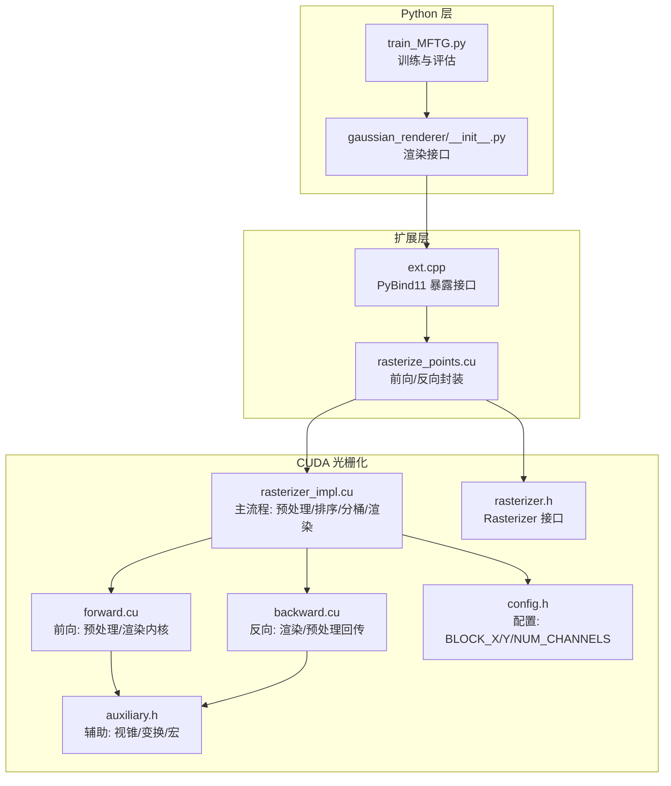
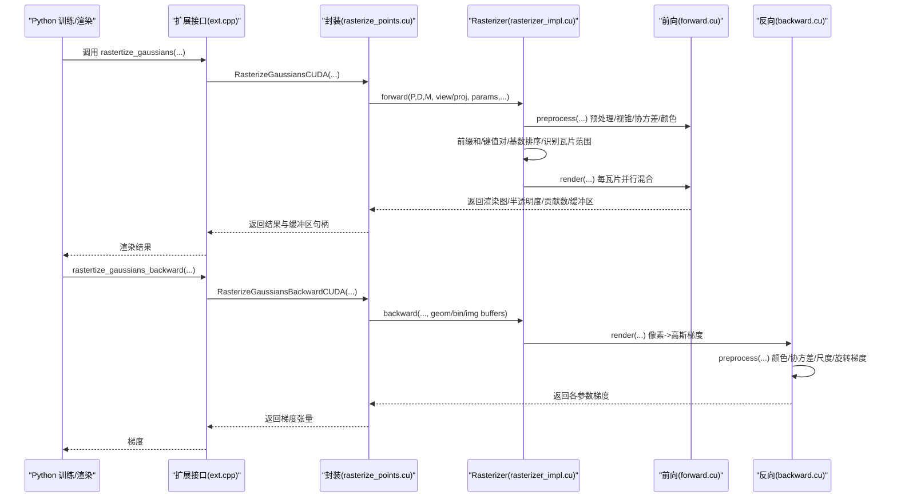
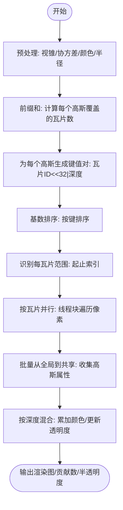
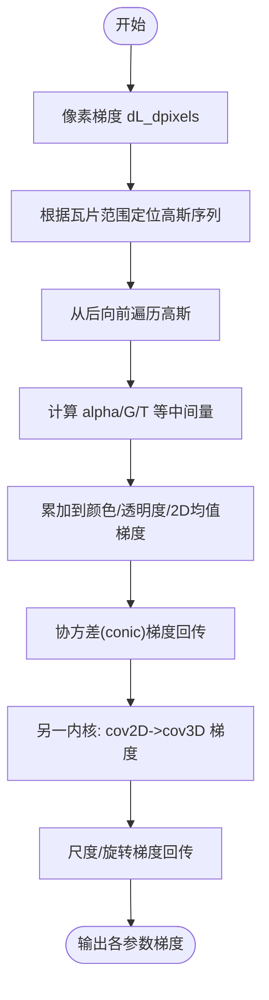
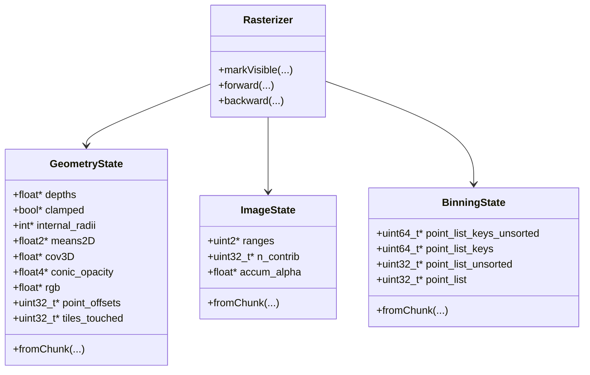
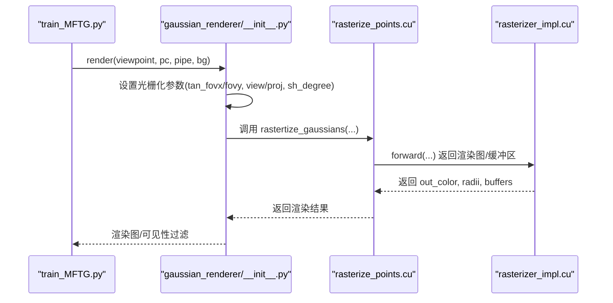
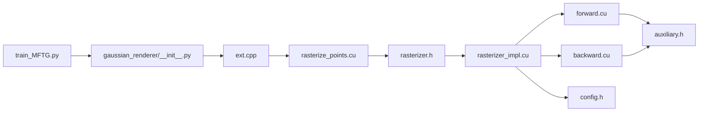

# 性能优化

<cite>
**本文引用的文件**   
- [rasterizer_impl.cu](file://submodules/diff-gaussian-rasterization/cuda_rasterizer/rasterizer_impl.cu)
- [forward.cu](file://submodules/diff-gaussian-rasterization/cuda_rasterizer/forward.cu)
- [backward.cu](file://submodules/diff-gaussian-rasterization/cuda_rasterizer/backward.cu)
- [rasterize_points.cu](file://submodules/diff-gaussian-rasterization/rasterize_points.cu)
- [config.h](file://submodules/diff-gaussian-rasterization/cuda_rasterizer/config.h)
- [rasterizer.h](file://submodules/diff-gaussian-rasterization/cuda_rasterizer/rasterizer.h)
- [auxiliary.h](file://submodules/diff-gaussian-rasterization/cuda_rasterizer/auxiliary.h)
- [ext.cpp](file://submodules/diff-gaussian-rasterization/ext.cpp)
- [train_MFTG.py](file://train_MFTG.py)
- [gaussian_renderer/__init__.py](file://gaussian_renderer/__init__.py)
- [MFTG-Technical-Doc.md](file://MFTG-Technical-Doc.md)
- [README.md](file://README.md)
</cite>

## 目录
1. [引言](#引言)
2. [项目结构](#项目结构)
3. [核心组件](#核心组件)
4. [架构总览](#架构总览)
5. [详细组件分析](#详细组件分析)
6. [依赖关系分析](#依赖关系分析)
7. [性能考量](#性能考量)
8. [故障排查指南](#故障排查指南)
9. [结论](#结论)
10. [附录](#附录)

## 引言
本技术文档聚焦 Thermal-Gaussian 渲染系统中的 CUDA 光栅化性能优化，围绕 Diff-Gaussian-Rasterization 子模块展开，系统性解析以下主题：
- CUDA 光栅化性能瓶颈与优化策略：内存带宽、线程块配置、共享内存使用
- 渲染质量与性能的权衡：分辨率、采样密度、批处理策略
- GPU 资源管理、内存池与异步执行
- 性能基准测试方法、瓶颈分析工具与调优实践
- 具体性能参数配置建议与最佳实践

## 项目结构
Thermal-Gaussian 的渲染管线由 Python 训练脚本驱动，调用 C++/CUDA 扩展进行高效光栅化。核心结构如下：
- 训练入口与渲染接口：Python 调用扩展函数进行前向/反向光栅化
- CUDA 光栅化内核：前向预处理、排序、分桶、渲染；反向梯度回传
- 配置与辅助：线程块大小、通道数、矩阵变换、视锥剔除等

**图表来源**
- [train_MFTG.py:35-163](file://train_MFTG.py#L35-L163)
- [gaussian_renderer/__init__.py:18-100](file://gaussian_renderer/__init__.py#L18-L100)
- [ext.cpp:15-19](file://submodules/diff-gaussian-rasterization/ext.cpp#L15-L19)
- [rasterize_points.cu:35-115](file://submodules/diff-gaussian-rasterization/rasterize_points.cu#L35-L115)
- [rasterizer_impl.cu:198-336](file://submodules/diff-gaussian-rasterization/cuda_rasterizer/rasterizer_impl.cu#L198-L336)
- [forward.cu:155-455](file://submodules/diff-gaussian-rasterization/cuda_rasterizer/forward.cu#L155-L455)
- [backward.cu:398-657](file://submodules/diff-gaussian-rasterization/cuda_rasterizer/backward.cu#L398-L657)
- [auxiliary.h:41-175](file://submodules/diff-gaussian-rasterization/cuda_rasterizer/auxiliary.h#L41-L175)
- [config.h:15-19](file://submodules/diff-gaussian-rasterization/cuda_rasterizer/config.h#L15-L19)
- [rasterizer.h:20-85](file://submodules/diff-gaussian-rasterization/cuda_rasterizer/rasterizer.h#L20-L85)

**章节来源**
- [README.md:1-167](file://README.md#L1-L167)
- [MFTG-Technical-Doc.md:1-618](file://MFTG-Technical-Doc.md#L1-L618)

## 核心组件
- Rasterizer 主类：提供 markVisible、forward、backward 三个关键接口，贯穿预处理、排序、分桶与渲染/回传。
- 前向流水线：预处理（视锥剔除、协方差计算、颜色转换）、前缀和、生成键值对、基数排序、识别每瓦片范围、并行瓦片渲染。
- 反向流水线：像素到高斯的梯度回传、颜色/协方差/尺度/旋转等参数梯度累积。
- 配置与辅助：NUM_CHANNELS、BLOCK_X/Y、ndc2Pix、视锥判断、矩阵变换、原子加等。

**章节来源**
- [rasterizer.h:20-85](file://submodules/diff-gaussian-rasterization/cuda_rasterizer/rasterizer.h#L20-L85)
- [rasterizer_impl.cu:198-336](file://submodules/diff-gaussian-rasterization/cuda_rasterizer/rasterizer_impl.cu#L198-L336)
- [forward.cu:155-455](file://submodules/diff-gaussian-rasterization/cuda_rasterizer/forward.cu#L155-L455)
- [backward.cu:398-657](file://submodules/diff-gaussian-rasterization/cuda_rasterizer/backward.cu#L398-L657)
- [auxiliary.h:41-175](file://submodules/diff-gaussian-rasterization/cuda_rasterizer/auxiliary.h#L41-L175)
- [config.h:15-19](file://submodules/diff-gaussian-rasterization/cuda_rasterizer/config.h#L15-L19)

## 架构总览
CUDA 光栅化采用“瓦片并行”的思路：将屏幕划分为 BLOCK_X×BLOCK_Y 的瓦片，每个线程块负责一个瓦片，线程在瓦片内遍历像素。渲染前对可见高斯进行预处理，生成键值对并排序，按瓦片分段，最后在瓦片粒度上并行混合。

**图表来源**
- [ext.cpp:15-19](file://submodules/diff-gaussian-rasterization/ext.cpp#L15-L19)
- [rasterize_points.cu:35-196](file://submodules/diff-gaussian-rasterization/rasterize_points.cu#L35-L196)
- [rasterizer_impl.cu:198-336](file://submodules/diff-gaussian-rasterization/cuda_rasterizer/rasterizer_impl.cu#L198-L336)
- [forward.cu:376-400](file://submodules/diff-gaussian-rasterization/cuda_rasterizer/forward.cu#L376-L400)
- [backward.cu:624-657](file://submodules/diff-gaussian-rasterization/cuda_rasterizer/backward.cu#L624-L657)

## 详细组件分析

### 前向渲染流水线（预处理→排序→渲染）
- 预处理阶段：对每个高斯执行视锥剔除、投影、协方差矩阵计算、颜色转换（SH→RGB 或外部预设）、半径与覆盖瓦片数统计。
- 排序阶段：为每个高斯生成键值对（瓦片ID<<32|深度），进行基数排序，得到按瓦片与深度有序的列表。
- 瓦片范围识别：扫描排序结果，确定每个瓦片在列表中的起止索引。
- 渲染阶段：每个线程块负责一个瓦片，线程在瓦片内遍历像素，批量从全局内存收集高斯属性到共享内存，按深度顺序混合，累加颜色并更新半透明度。

**图表来源**
- [rasterizer_impl.cu:198-336](file://submodules/diff-gaussian-rasterization/cuda_rasterizer/rasterizer_impl.cu#L198-L336)
- [forward.cu:155-455](file://submodules/diff-gaussian-rasterization/cuda_rasterizer/forward.cu#L155-L455)

**章节来源**
- [rasterizer_impl.cu:198-336](file://submodules/diff-gaussian-rasterization/cuda_rasterizer/rasterizer_impl.cu#L198-L336)
- [forward.cu:155-455](file://submodules/diff-gaussian-rasterization/cuda_rasterizer/forward.cu#L155-L455)

### 反向传播流水线（像素→高斯梯度）
- 像素到高斯：从后向前遍历高斯，计算每个高斯对像素梯度的贡献，累加到对应参数。
- 颜色/协方差/尺度/旋转：通过链式法则与中间变量，回传至均值、颜色、协方差、尺度与旋转参数。
- 注意：协方差的逆（conic）单独计算并回传，随后在另一内核中将梯度映射到 3D 协方差与尺度/旋转。

**图表来源**
- [backward.cu:398-657](file://submodules/diff-gaussian-rasterization/cuda_rasterizer/backward.cu#L398-L657)
- [rasterizer_impl.cu:340-434](file://submodules/diff-gaussian-rasterization/cuda_rasterizer/rasterizer_impl.cu#L340-L434)

**章节来源**
- [backward.cu:398-657](file://submodules/diff-gaussian-rasterization/cuda_rasterizer/backward.cu#L398-L657)
- [rasterizer_impl.cu:340-434](file://submodules/diff-gaussian-rasterization/cuda_rasterizer/rasterizer_impl.cu#L340-L434)

### CUDA 内核与线程组织
- 线程块尺寸：BLOCK_X×BLOCK_Y，默认 16×16，每个线程块对应一个瓦片，线程在瓦片内遍历像素。
- 共享内存：在渲染内核中，线程块使用共享内存批量收集高斯属性（ID、中心、conic_opacity），减少全局访存压力。
- 同步与协作：使用 cooperative_groups 提供的同步与投票机制，确保块内协作与收敛。

**图表来源**
- [rasterizer.h:20-85](file://submodules/diff-gaussian-rasterization/cuda_rasterizer/rasterizer.h#L20-L85)
- [rasterizer_impl.h:29-74](file://submodules/diff-gaussian-rasterization/cuda_rasterizer/rasterizer_impl.h#L29-L74)

**章节来源**
- [config.h:15-19](file://submodules/diff-gaussian-rasterization/cuda_rasterizer/config.h#L15-L19)
- [auxiliary.h:18-19](file://submodules/diff-gaussian-rasterization/cuda_rasterizer/auxiliary.h#L18-L19)
- [forward.cu:261-374](file://submodules/diff-gaussian-rasterization/cuda_rasterizer/forward.cu#L261-L374)

### Python 渲染接口与缓冲区管理
- 渲染接口：根据相机参数与高斯属性，构造光栅化设置，调用扩展函数执行前向/反向。
- 缓冲区：通过函数式分配器动态申请几何/分桶/图像缓冲区，避免重复分配开销。
- 训练循环：在训练脚本中记录 CUDA 事件，统计单次迭代耗时，结合 TensorBoard 进行可视化。

**图表来源**
- [gaussian_renderer/__init__.py:18-100](file://gaussian_renderer/__init__.py#L18-L100)
- [rasterize_points.cu:35-115](file://submodules/diff-gaussian-rasterization/rasterize_points.cu#L35-L115)
- [train_MFTG.py:68-133](file://train_MFTG.py#L68-L133)

**章节来源**
- [gaussian_renderer/__init__.py:18-100](file://gaussian_renderer/__init__.py#L18-L100)
- [rasterize_points.cu:35-115](file://submodules/diff-gaussian-rasterization/rasterize_points.cu#L35-L115)
- [train_MFTG.py:68-133](file://train_MFTG.py#L68-L133)

## 依赖关系分析
- Python 层依赖 PyTorch 与扩展模块，扩展模块依赖 CUDA Runtime 与 CUB 库。
- CUDA 内核依赖辅助头文件提供的数学与几何工具。
- 配置头文件集中定义线程块大小与通道数，影响内存布局与吞吐。

**图表来源**
- [train_MFTG.py:17-104](file://train_MFTG.py#L17-L104)
- [gaussian_renderer/__init__.py:18-100](file://gaussian_renderer/__init__.py#L18-L100)
- [ext.cpp:15-19](file://submodules/diff-gaussian-rasterization/ext.cpp#L15-L19)
- [rasterize_points.cu:35-115](file://submodules/diff-gaussian-rasterization/rasterize_points.cu#L35-L115)
- [rasterizer.h:20-85](file://submodules/diff-gaussian-rasterization/cuda_rasterizer/rasterizer.h#L20-L85)
- [rasterizer_impl.cu:198-336](file://submodules/diff-gaussian-rasterization/cuda_rasterizer/rasterizer_impl.cu#L198-L336)
- [forward.cu:155-455](file://submodules/diff-gaussian-rasterization/cuda_rasterizer/forward.cu#L155-L455)
- [backward.cu:398-657](file://submodules/diff-gaussian-rasterization/cuda_rasterizer/backward.cu#L398-L657)
- [auxiliary.h:41-175](file://submodules/diff-gaussian-rasterization/cuda_rasterizer/auxiliary.h#L41-L175)
- [config.h:15-19](file://submodules/diff-gaussian-rasterization/cuda_rasterizer/config.h#L15-L19)

**章节来源**
- [README.md:1-167](file://README.md#L1-L167)
- [MFTG-Technical-Doc.md:308-386](file://MFTG-Technical-Doc.md#L308-L386)

## 性能考量

### 内存带宽优化
- 全局到共享的批量收集：渲染内核在共享内存中批量缓存高斯属性，减少全局访存次数与带宽占用。
- 键值对排序：使用基数排序，避免比较排序的分支与竞争，提升大规模列表的排序吞吐。
- 前缀和与偏移：通过前缀和计算每个高斯覆盖的瓦片数，减少条件判断与分支。

**章节来源**
- [forward.cu:294-374](file://submodules/diff-gaussian-rasterization/cuda_rasterizer/forward.cu#L294-L374)
- [rasterizer_impl.cu:275-285](file://submodules/diff-gaussian-rasterization/cuda_rasterizer/rasterizer_impl.cu#L275-L285)
- [rasterizer_impl.cu:288-308](file://submodules/diff-gaussian-rasterization/cuda_rasterizer/rasterizer_impl.cu#L288-L308)

### 线程块配置与瓦片并行
- 线程块大小：默认 16×16，适合大多数现代 GPU 的 SM 资源分配；可根据设备 SM 数与寄存器限制调整。
- 瓦片粒度：每个线程块负责一个瓦片，线程在瓦片内遍历像素，平衡负载与共享内存利用率。
- 同步与收敛：使用块内同步与投票机制，确保在像素级混合时的收敛与正确性。

**章节来源**
- [config.h:16-17](file://submodules/diff-gaussian-rasterization/cuda_rasterizer/config.h#L16-L17)
- [forward.cu:261-374](file://submodules/diff-gaussian-rasterization/cuda_rasterizer/forward.cu#L261-L374)

### 共享内存使用
- 渲染内核使用共享内存缓存高斯 ID、中心与 conic_opacity，减少全局访存。
- 预处理阶段也使用共享内存进行局部计算与临时存储，提高吞吐。

**章节来源**
- [forward.cu:294-322](file://submodules/diff-gaussian-rasterization/cuda_rasterizer/forward.cu#L294-L322)
- [forward.cu:428-454](file://submodules/diff-gaussian-rasterization/cuda_rasterizer/forward.cu#L428-L454)

### 渲染质量与性能权衡
- 分辨率调整：降低图像分辨率直接减少瓦片数与像素混合次数，显著提升速度；可通过命令行参数控制。
- 采样密度控制：通过球谐阶数与预计算协方差/颜色的策略，在质量与速度间折中。
- 批处理策略：内核内部以“块内批量收集→像素级混合”的方式，平衡吞吐与延迟。

**章节来源**
- [MFTG-Technical-Doc.md:493-512](file://MFTG-Technical-Doc.md#L493-L512)
- [gaussian_renderer/__init__.py:68-93](file://gaussian_renderer/__init__.py#L68-L93)

### GPU 资源管理与内存池
- 动态缓冲区：通过函数式分配器在 CUDA 设备上动态扩容几何/分桶/图像缓冲区，避免固定内存池的复杂性。
- 缓冲区复用：前向/反向使用相同类型的缓冲区，减少分配与释放开销。
- 异步执行：训练脚本中使用 CUDA Event 记录迭代耗时，便于异步调度与性能分析。

**章节来源**
- [rasterize_points.cu:27-33](file://submodules/diff-gaussian-rasterization/rasterize_points.cu#L27-L33)
- [rasterize_points.cu:73-78](file://submodules/diff-gaussian-rasterization/rasterize_points.cu#L73-L78)
- [train_MFTG.py:60-61](file://train_MFTG.py#L60-L61)
- [train_MFTG.py:118-119](file://train_MFTG.py#L118-L119)

### 性能基准测试与瓶颈分析
- 基准测试：使用 CUDA Event 记录迭代开始/结束，计算平均耗时；结合 TensorBoard 可视化。
- 瓶颈分析：关注预处理、排序、渲染三个阶段的占比；若排序阶段过长，可考虑调整键位宽或减少高斯数量。
- 工具建议：NVIDIA Nsight Systems/Compute、nvprof、PyTorch Profiler。

**章节来源**
- [train_MFTG.py:60-61](file://train_MFTG.py#L60-L61)
- [train_MFTG.py:118-119](file://train_MFTG.py#L118-L119)
- [train_MFTG.py:186-190](file://train_MFTG.py#L186-L190)

### 参数配置与最佳实践
- 线程块大小：优先保持 16×16；若寄存器压力大，可尝试 8×16 或 16×8。
- 通道数：NUM_CHANNELS=3（RGB），若使用灰度或其他通道数需同步修改内核模板参数。
- 视锥剔除：确保相机参数与视场角正确，减少无效高斯进入渲染。
- 预计算策略：若已知协方差/颜色，可传入预计算版本，减少内核内的计算开销。

**章节来源**
- [config.h:15-19](file://submodules/diff-gaussian-rasterization/cuda_rasterizer/config.h#L15-L19)
- [auxiliary.h:139-164](file://submodules/diff-gaussian-rasterization/cuda_rasterization/cuda_rasterizer/auxiliary.h#L139-L164)
- [rasterize_points.cu:43-54](file://submodules/diff-gaussian-rasterization/rasterize_points.cu#L43-L54)
- [rasterize_points.cu:99-103](file://submodules/diff-gaussian-rasterization/rasterize_points.cu#L99-L103)

## 故障排查指南
- CUDA 错误检查：宏 CHECK_CUDA 在调试模式下同步并抛出异常，便于定位错误位置。
- 视锥剔除异常：若开启预过滤但仍出现剔除，检查相机参数与近裁剪面设置。
- 内存不足：降低分辨率、减少 SH 阶数、关闭预计算协方差/颜色，或减少高斯数量。
- 性能退化：检查键值对排序是否过长、共享内存是否溢出、线程块配置是否合理。

**章节来源**
- [auxiliary.h:166-175](file://submodules/diff-gaussian-rasterization/cuda_rasterizer/auxiliary.h#L166-L175)
- [MFTG-Technical-Doc.md:612-618](file://MFTG-Technical-Doc.md#L612-L618)

## 结论
Thermal-Gaussian 的 CUDA 光栅化通过“瓦片并行+共享内存批量收集+基数排序”的组合，实现了高效的多高斯混合渲染。优化重点在于：
- 控制全局访存，利用共享内存缓存
- 合理的线程块配置与瓦片粒度
- 预处理与排序阶段的并行度与负载均衡
- 在质量与性能之间通过分辨率、采样密度与批处理策略进行权衡

## 附录
- 训练与渲染命令示例、数据准备与评估流程详见技术文档与 README。

**章节来源**
- [MFTG-Technical-Doc.md:365-450](file://MFTG-Technical-Doc.md#L365-L450)
- [README.md:62-117](file://README.md#L62-L117)