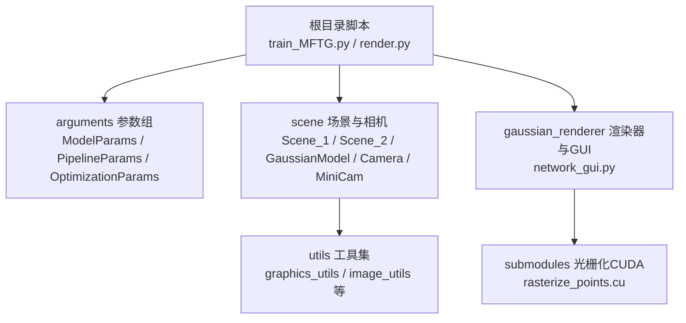
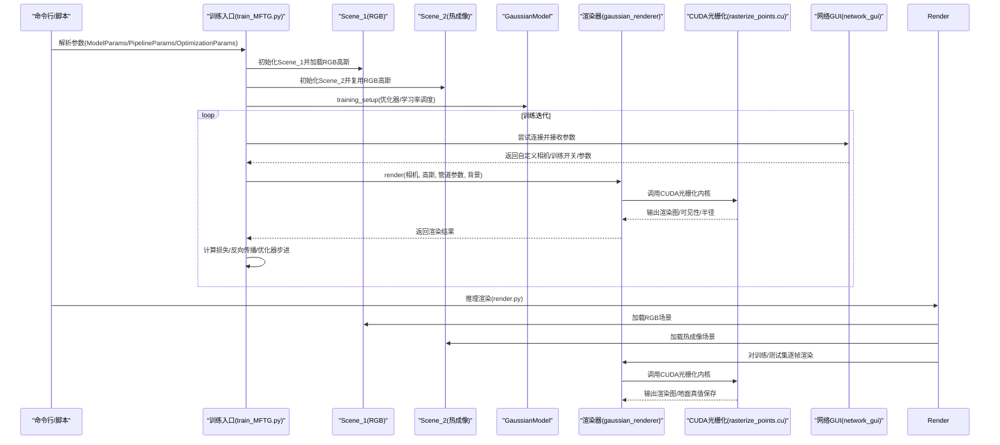
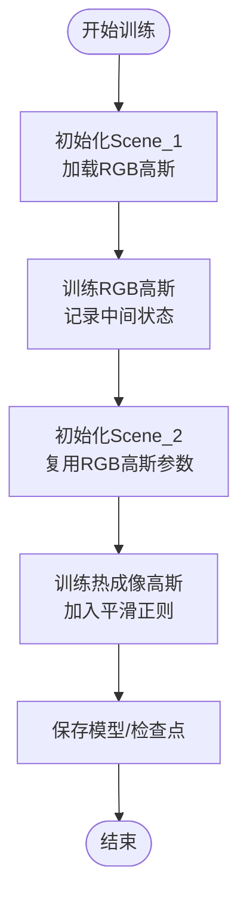
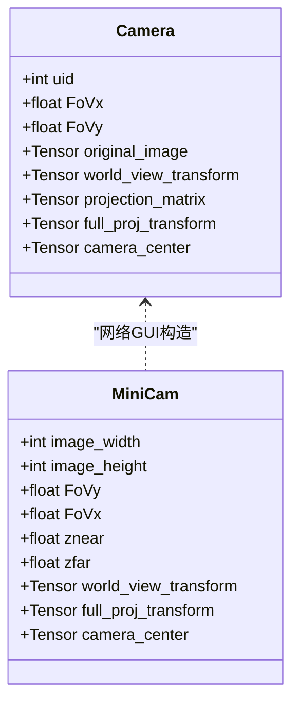
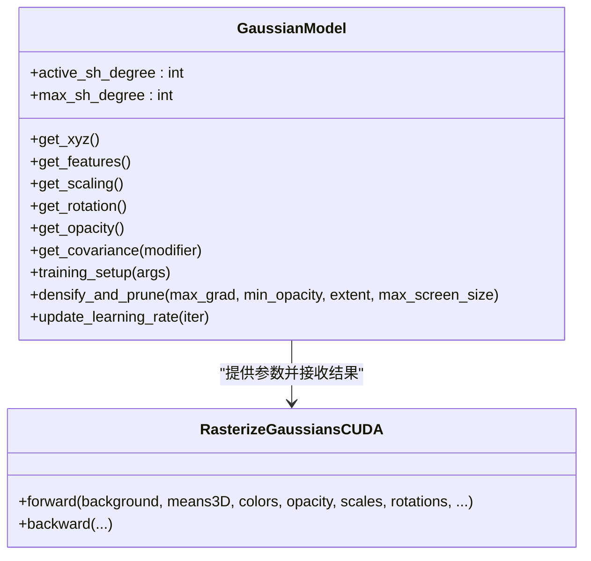
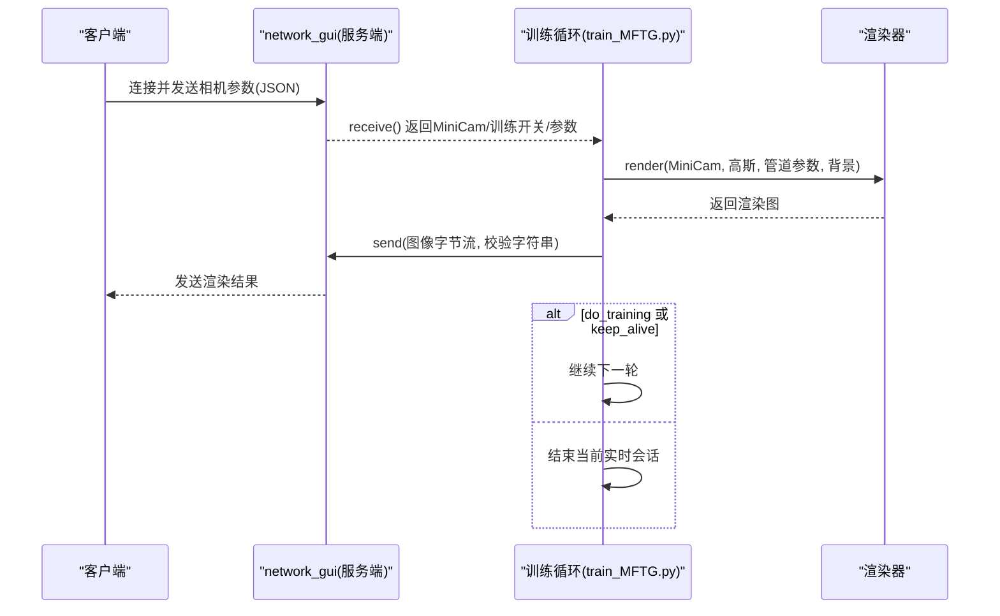
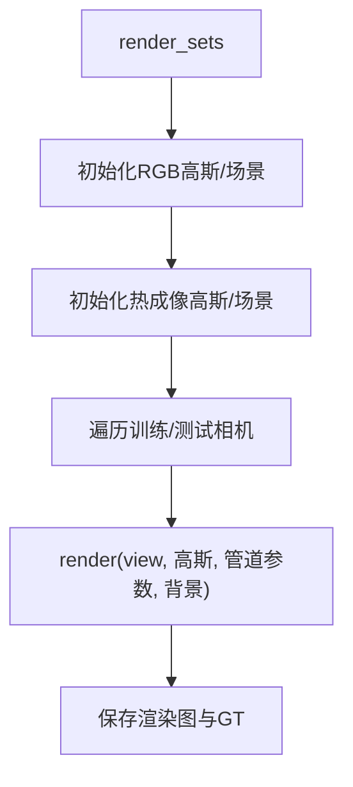
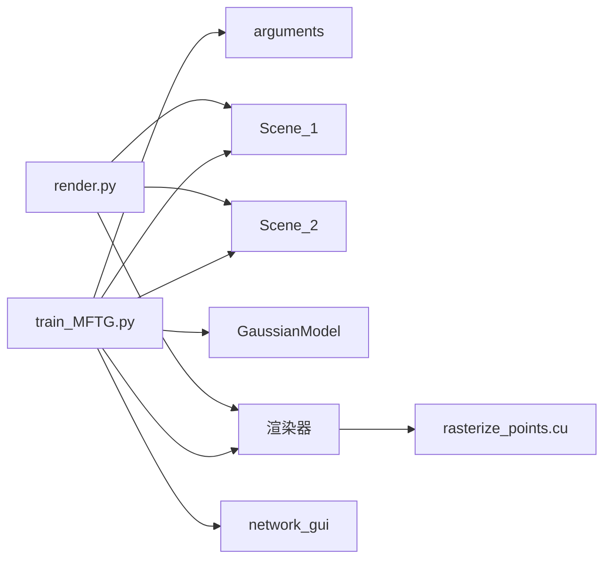

# 渲染管线

<cite>
**本文引用的文件**
- [render.py](file://render.py)
- [train_MFTG.py](file://train_MFTG.py)
- [gaussian_renderer/network_gui.py](file://gaussian_renderer/network_gui.py)
- [scene/cameras.py](file://scene/cameras.py)
- [scene/gaussian_model.py](file://scene/gaussian_model.py)
- [arguments/__init__.py](file://arguments/__init__.py)
- [submodules/diff-gaussian-rasterization/rasterize_points.cu](file://submodules/diff-gaussian-rasterization/rasterize_points.cu)
- [README.md](file://README.md)
</cite>

## 目录
1. [简介](#简介)
2. [项目结构](#项目结构)
3. [核心组件](#核心组件)
4. [架构总览](#架构总览)
5. [详细组件分析](#详细组件分析)
6. [依赖关系分析](#依赖关系分析)
7. [性能考量](#性能考量)
8. [故障排查指南](#故障排查指南)
9. [结论](#结论)
10. [附录](#附录)

## 简介
本技术文档围绕 Thermal-Gaussian 的“多模态微调高斯”（MFTG）渲染管线展开，系统阐述从场景加载到最终图像生成的完整流程，重点覆盖以下方面：
- 双场景管理：Scene_1（RGB 场景）与 Scene_2（热成像场景）的分离与协同训练。
- 相机视图处理：Camera 与 MiniCam 的矩阵变换与投影关系。
- 高斯模型渲染：基于 CUDA 光栅化的高斯点阵渲染器与优化器交互。
- 渲染参数管道（PipelineParams）：渲染质量、采样策略与调试开关。
- 网络 GUI 实时渲染控制：参数调节、可视化反馈与性能监控。
- 渲染流程代码实现分析、参数调优建议与常见问题解决。

## 项目结构
该项目采用模块化组织方式，核心目录与职责如下：
- arguments：参数定义与解析（ModelParams、PipelineParams、OptimizationParams）
- scene：场景与相机、高斯模型（Scene_1、Scene_2、GaussianModel、Camera/MiniCam）
- gaussian_renderer：渲染器与网络 GUI（渲染函数、网络通信）
- submodules：第三方子模块（diff-gaussian-rasterization CUDA 光栅化）
- utils：通用工具（图形、图像、损失等）
- 根目录脚本：训练与渲染入口（train_MFTG.py、render.py）

图表来源
- [train_MFTG.py:35-163](file://train_MFTG.py#L35-L163)
- [render.py:25-60](file://render.py#L25-L60)
- [arguments/__init__.py:47-90](file://arguments/__init__.py#L47-L90)
- [scene/gaussian_model.py:24-148](file://scene/gaussian_model.py#L24-L148)
- [scene/cameras.py:17-72](file://scene/cameras.py#L17-L72)
- [gaussian_renderer/network_gui.py:26-86](file://gaussian_renderer/network_gui.py#L26-L86)
- [submodules/diff-gaussian-rasterization/rasterize_points.cu:35-115](file://submodules/diff-gaussian-rasterization/rasterize_points.cu#L35-L115)

章节来源
- [README.md:13-117](file://README.md#L13-L117)

## 核心组件
- 参数管道（PipelineParams）：控制渲染行为的开关与调试选项，如是否使用 Python 计算 SH、cov3D，以及 debug 模式。
- 高斯模型（GaussianModel）：管理点云属性（位置、颜色、尺度、旋转、不透明度），提供训练优化、密度增长与裁剪、协方差计算等。
- 场景类（Scene_1 / Scene_2）：分别加载 RGB 与热成像数据，维护相机集合与迭代状态。
- 相机（Camera / MiniCam）：提供世界到相机变换、投影矩阵与相机中心。
- 渲染器（gaussian_renderer.render）：调用 CUDA 光栅化内核进行渲染。
- 网络 GUI（network_gui）：通过 TCP 与客户端通信，接收相机参数与训练指令，返回实时渲染结果。

章节来源
- [arguments/__init__.py:64-90](file://arguments/__init__.py#L64-L90)
- [scene/gaussian_model.py:24-148](file://scene/gaussian_model.py#L24-L148)
- [scene/cameras.py:17-72](file://scene/cameras.py#L17-L72)
- [gaussian_renderer/network_gui.py:26-86](file://gaussian_renderer/network_gui.py#L26-L86)

## 架构总览
下图展示 MFTG 渲染管线在训练与推理阶段的关键交互：

图表来源
- [train_MFTG.py:35-163](file://train_MFTG.py#L35-L163)
- [render.py:25-60](file://render.py#L25-L60)
- [gaussian_renderer/network_gui.py:57-86](file://gaussian_renderer/network_gui.py#L57-L86)
- [submodules/diff-gaussian-rasterization/rasterize_points.cu:35-115](file://submodules/diff-gaussian-rasterization/rasterize_points.cu#L35-L115)

## 详细组件分析

### 组件一：双场景管理（Scene_1 与 Scene_2）
- Scene_1：负责 RGB 数据的加载与训练，作为主场景初始化高斯模型。
- Scene_2：复用 Scene_1 的高斯参数，切换为热成像数据进行训练，引入热成像平滑正则项以提升稳定性。
- 关键流程：训练阶段先运行 Scene_1，再运行 Scene_2；推理阶段同时加载两套场景，分别渲染 RGB 与热成像序列。

图表来源
- [train_MFTG.py:39-48](file://train_MFTG.py#L39-L48)
- [train_MFTG.py:100-115](file://train_MFTG.py#L100-L115)

章节来源
- [train_MFTG.py:35-163](file://train_MFTG.py#L35-L163)

### 组件二：相机视图处理（Camera 与 MiniCam）
- Camera：从 COLMAP 数据构建相机位姿与投影矩阵，支持透明度遮罩与设备放置。
- MiniCam：由网络 GUI 解析客户端传入的视图矩阵与投影矩阵，构造临时相机对象供实时渲染使用。
- 重要矩阵：世界到相机变换（world_view_transform）、投影矩阵（projection_matrix）、组合投影（full_proj_transform）。

图表来源
- [scene/cameras.py:17-72](file://scene/cameras.py#L17-L72)
- [gaussian_renderer/network_gui.py:57-86](file://gaussian_renderer/network_gui.py#L57-L86)

章节来源
- [scene/cameras.py:17-72](file://scene/cameras.py#L17-L72)
- [gaussian_renderer/network_gui.py:57-86](file://gaussian_renderer/network_gui.py#L57-L86)

### 组件三：高斯模型渲染（GaussianModel 与 CUDA 光栅化）
- 高斯属性：位置、颜色（球谐系数）、尺度、旋转、不透明度；提供协方差计算与激活函数。
- 训练接口：学习率调度、优化器配置、密度增长与裁剪、前向渲染输出（渲染图、可见性、半径）。
- CUDA 光栅化：接收背景、3D 均值、颜色、不透明度、尺度、旋转、协方差、视图/投影矩阵、相机位置等，输出渲染图像与辅助信息。

图表来源
- [scene/gaussian_model.py:24-148](file://scene/gaussian_model.py#L24-L148)
- [submodules/diff-gaussian-rasterization/rasterize_points.cu:35-115](file://submodules/diff-gaussian-rasterization/rasterize_points.cu#L35-L115)

章节来源
- [scene/gaussian_model.py:117-148](file://scene/gaussian_model.py#L117-L148)
- [submodules/diff-gaussian-rasterization/rasterize_points.cu:35-115](file://submodules/diff-gaussian-rasterization/rasterize_points.cu#L35-L115)

### 组件四：渲染参数管道（PipelineParams）
- 关键字段：convert_SHs_python、compute_cov3D_python、debug。
- 作用：控制是否使用 Python 计算 SH 与协方差，以及开启调试模式；影响渲染性能与可诊断性。

章节来源
- [arguments/__init__.py:64-70](file://arguments/__init__.py#L64-L70)

### 组件五：网络 GUI 实时渲染控制
- 服务器端：绑定本地地址与端口，接受客户端连接，读取 JSON 消息，构造 MiniCam。
- 客户端交互：发送分辨率、FOV、视图矩阵、投影矩阵、训练开关、SH/旋转缩放计算开关、缩放修饰符等。
- 实时反馈：将渲染图像字节流回传给客户端，支持持续训练循环直至断开或 keep_alive 结束。

图表来源
- [gaussian_renderer/network_gui.py:26-86](file://gaussian_renderer/network_gui.py#L26-L86)
- [train_MFTG.py:69-83](file://train_MFTG.py#L69-L83)

章节来源
- [gaussian_renderer/network_gui.py:26-86](file://gaussian_renderer/network_gui.py#L26-L86)
- [train_MFTG.py:69-83](file://train_MFTG.py#L69-L83)

### 组件六：推理渲染（render_sets/render_set）
- 初始化两套高斯模型与场景，分别加载 RGB 与热成像数据。
- 遍历训练/测试集相机，调用渲染器生成图像，并保存渲染图与地面真值。

图表来源
- [render.py:25-60](file://render.py#L25-L60)

章节来源
- [render.py:25-60](file://render.py#L25-L60)

## 依赖关系分析
- 训练入口依赖参数组、场景类、高斯模型与渲染器；渲染入口依赖场景类与渲染器。
- 网络 GUI 依赖 socket 与 JSON，与训练循环形成松耦合的实时交互。
- CUDA 光栅化内核与高斯模型参数强耦合，是渲染性能瓶颈所在。

图表来源
- [train_MFTG.py:35-163](file://train_MFTG.py#L35-L163)
- [render.py:25-60](file://render.py#L25-L60)
- [gaussian_renderer/network_gui.py:26-86](file://gaussian_renderer/network_gui.py#L26-L86)
- [submodules/diff-gaussian-rasterization/rasterize_points.cu:35-115](file://submodules/diff-gaussian-rasterization/rasterize_points.cu#L35-L115)

章节来源
- [train_MFTG.py:35-163](file://train_MFTG.py#L35-L163)
- [render.py:25-60](file://render.py#L25-L60)

## 性能考量
- CUDA 光栅化：内核输入包含大量张量（均值、颜色、尺度、旋转、协方差、视图/投影矩阵），需确保内存连续与设备一致，避免频繁主机-设备拷贝。
- 学习率与密度增长：指数学习率与分层密度增长有助于收敛稳定性；合理设置密度阈值与裁剪策略可减少无效高斯数量。
- 实时渲染：网络 GUI 的持续训练循环中，尽量减少 Python 层开销，必要时启用 CUDA 缓存与批处理。
- 后处理：推理阶段仅保存渲染图与 GT，避免额外 CPU 处理。

## 故障排查指南
- 网络 GUI 连接失败
  - 检查 IP 与端口配置，确认客户端与服务端一致。
  - 确认防火墙未阻断本地回环连接。
  - 查看异常捕获与重连逻辑，确保连接超时设置正确。
- 渲染黑屏或异常
  - 检查背景色与随机背景设置，确认视图矩阵与投影矩阵符号一致性。
  - 核对 PipelineParams 的 debug 开关，必要时开启以输出中间状态。
- 训练不稳定或发散
  - 调整学习率、密度增长阈值与平滑正则权重（热成像路径已引入平滑项）。
  - 检查协方差与激活函数是否一致，确保数值稳定。
- 内存不足
  - 减少每帧相机数量或降低分辨率。
  - 在训练报告中及时释放缓存，避免累积占用。

章节来源
- [gaussian_renderer/network_gui.py:34-42](file://gaussian_renderer/network_gui.py#L34-L42)
- [train_MFTG.py:98-100](file://train_MFTG.py#L98-L100)
- [scene/gaussian_model.py:117-148](file://scene/gaussian_model.py#L117-L148)

## 结论
Thermal-Gaussian 的 MFTG 渲染管线通过双场景管理与高斯模型渲染，实现了 RGB 与热成像的高质量重建与实时交互。参数管道（PipelineParams）提供了灵活的渲染控制，网络 GUI 支持实时参数调节与可视化反馈。结合 CUDA 光栅化与优化策略，系统在质量与效率之间取得良好平衡。建议在实际部署中关注内存与网络延迟，按需调整密度增长与正则项，以获得更稳定的训练与渲染体验。

## 附录
- 常用命令示例（来自项目说明）
  - MFTG 版本训练与评估：先训练，再渲染，最后计算指标。
  - 数据准备：RGB 与热成像分别存放于 rgb 与 thermal 文件夹，COLMAP 输出位于 sparse。
- 参数建议
  - PipelineParams：在调试阶段开启 debug，生产环境关闭以提升性能。
  - OptimizationParams：根据数据规模调整迭代次数、密度增长间隔与阈值。
  - Network GUI：保持默认 IP 与端口，确保客户端与服务端一致。

章节来源
- [README.md:71-117](file://README.md#L71-L117)