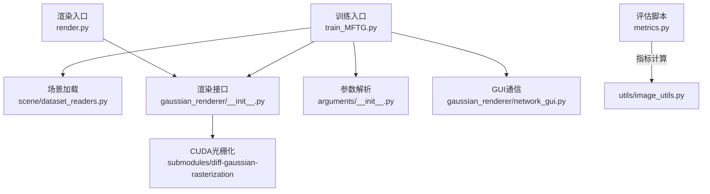
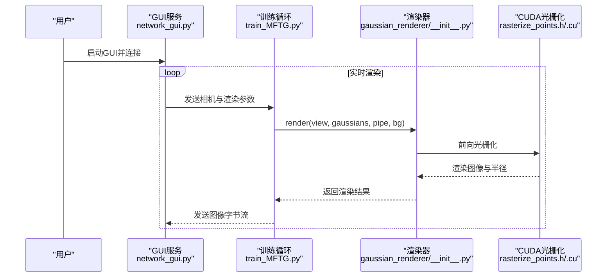
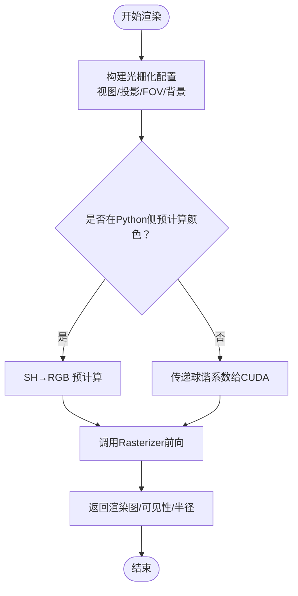
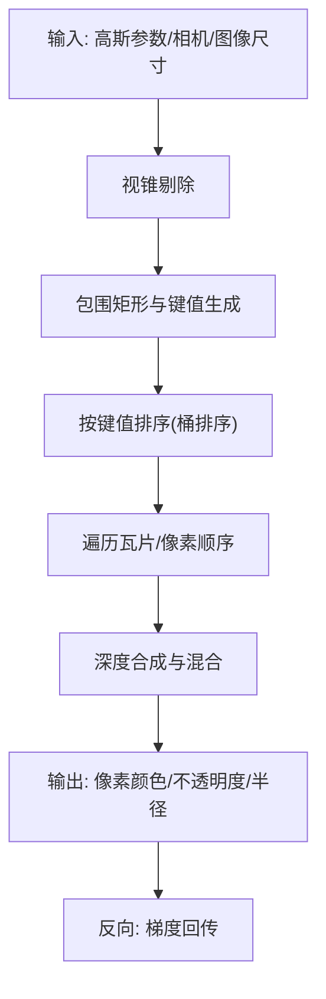
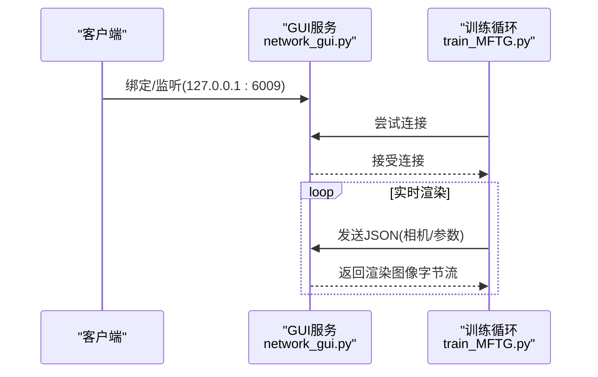
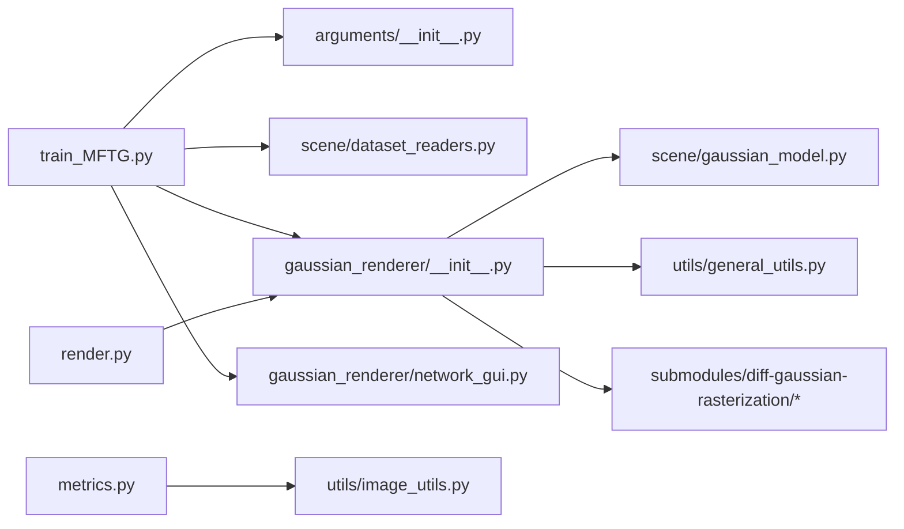

# 渲染系统

<cite>
**本文引用的文件**
- [README.md](file://README.md)
- [MFTG-Technical-Doc.md](file://MFTG-Technical-Doc.md)
- [train_MFTG.py](file://train_MFTG.py)
- [render.py](file://render.py)
- [gaussian_renderer/__init__.py](file://gaussian_renderer/__init__.py)
- [gaussian_renderer/network_gui.py](file://gaussian_renderer/network_gui.py)
- [scene/gaussian_model.py](file://scene/gaussian_model.py)
- [scene/cameras.py](file://scene/cameras.py)
- [scene/dataset_readers.py](file://scene/dataset_readers.py)
- [arguments/__init__.py](file://arguments/__init__.py)
- [utils/general_utils.py](file://utils/general_utils.py)
- [utils/image_utils.py](file://utils/image_utils.py)
- [submodules/diff-gaussian-rasterization/rasterize_points.h](file://submodules/diff-gaussian-rasterization/rasterize_points.h)
- [submodules/diff-gaussian-rasterization/cuda_rasterizer/rasterizer_impl.h](file://submodules/diff-gaussian-rasterization/cuda_rasterizer/rasterizer_impl.h)
- [submodules/diff-gaussian-rasterization/cuda_rasterizer/rasterizer_impl.cu](file://submodules/diff-gaussian-rasterization/cuda_rasterizer/rasterizer_impl.cu)
</cite>

## 目录
1. [引言](#引言)
2. [项目结构](#项目结构)
3. [核心组件](#核心组件)
4. [架构总览](#架构总览)
5. [详细组件分析](#详细组件分析)
6. [依赖关系分析](#依赖关系分析)
7. [性能考虑](#性能考虑)
8. [故障排查指南](#故障排查指南)
9. [结论](#结论)
10. [附录](#附录)

## 引言
本文件面向 Thermal-Gaussian 渲染系统，围绕“3D高斯点阵的光栅化渲染”展开，重点覆盖以下方面：
- 光栅化渲染原理与CUDA加速实现
- 深度缓冲与混合模式处理
- 网络GUI界面功能与使用方法（实时渲染控制、参数调节、可视化反馈）
- 渲染质量优化、内存管理与性能调优策略
- 渲染参数配置、输出格式与质量评估方法

系统基于3D高斯点阵（3DGS）扩展，支持RGB与热红外双模态渲染，并在主分支采用两阶段训练策略（MFTG）：先用RGB训练几何与外观，再用热红外微调颜色以满足热场平滑先验。

章节来源
- [README.md:1-167](file://README.md#L1-L167)

## 项目结构
项目采用模块化组织，核心模块如下：
- 训练与评估脚本：train_MFTG.py、render.py、metrics.py
- 渲染器：gaussian_renderer（Python接口）+ submodules/diff-gaussian-rasterization（CUDA光栅化）
- 场景与数据：scene（相机、点云、数据读取）、arguments（参数解析）
- 工具库：utils（通用工具、图像度量、图形学辅助）
- 技术文档：MFTG-Technical-Doc.md（MFTG算法细节）

图表来源
- [train_MFTG.py:1-273](file://train_MFTG.py#L1-L273)
- [render.py:1-76](file://render.py#L1-L76)
- [gaussian_renderer/__init__.py:18-101](file://gaussian_renderer/__init__.py#L18-L101)
- [scene/dataset_readers.py:136-230](file://scene/dataset_readers.py#L136-L230)
- [arguments/__init__.py:47-113](file://arguments/__init__.py#L47-L113)
- [gaussian_renderer/network_gui.py:26-86](file://gaussian_renderer/network_gui.py#L26-L86)
- [utils/image_utils.py:14-20](file://utils/image_utils.py#L14-L20)

章节来源
- [README.md:18-167](file://README.md#L18-L167)
- [MFTG-Technical-Doc.md:308-451](file://MFTG-Technical-Doc.md#L308-L451)

## 核心组件
- GaussianModel：3D高斯点阵表示与优化器管理，包含位置、尺度、旋转、不透明度、球谐颜色等参数，提供密度控制与点云保存/加载。
- 渲染器（Python）：根据Camera提供的视图矩阵、投影矩阵与球谐阶数，调用CUDA光栅化器进行不同iable光栅化。
- CUDA光栅化器：实现高斯点阵到屏幕空间的可微分光栅化，包含前向/反向前端与CUDA内核。
- Scene与数据读取：支持COLMAP稀疏重建数据与RGB/热红外图像目录结构，生成Camera列表与点云。
- GUI通信：基于TCP Socket的轻量GUI，用于实时交互渲染与参数下发。
- 参数系统：统一的命令行参数解析与合并机制，便于训练/渲染配置。

章节来源
- [scene/gaussian_model.py:24-407](file://scene/gaussian_model.py#L24-L407)
- [gaussian_renderer/__init__.py:18-101](file://gaussian_renderer/__init__.py#L18-L101)
- [submodules/diff-gaussian-rasterization/rasterize_points.h:18-67](file://submodules/diff-gaussian-rasterization/rasterize_points.h#L18-L67)
- [scene/dataset_readers.py:136-230](file://scene/dataset_readers.py#L136-L230)
- [gaussian_renderer/network_gui.py:26-86](file://gaussian_renderer/network_gui.py#L26-L86)
- [arguments/__init__.py:47-113](file://arguments/__init__.py#L47-L113)

## 架构总览
整体流程分为“训练阶段（两阶段）”和“渲染/评估阶段”。训练阶段通过两套Scene分别加载RGB与热红外数据，利用相同COLMAP位姿与点云初始化；渲染阶段分别使用RGB与热红外高斯模型进行独立渲染。

图表来源
- [train_MFTG.py:68-83](file://train_MFTG.py#L68-L83)
- [gaussian_renderer/__init__.py:18-101](file://gaussian_renderer/__init__.py#L18-L101)
- [submodules/diff-gaussian-rasterization/rasterize_points.h:18-67](file://submodules/diff-gaussian-rasterization/rasterize_points.h#L18-L67)

## 详细组件分析

### 3D高斯点阵与渲染器
- 高斯参数与激活
  - 位置、尺度、旋转、不透明度、球谐颜色等均以可训练参数形式存在，使用指数、Sigmoid、归一化等激活函数约束参数范围。
  - 球谐阶数可动态提升，逐步增加颜色建模能力。
- 渲染管线
  - 从Camera构造视图/投影参数，设置光栅化配置（图像尺寸、FOV、相机中心、是否预过滤等）。
  - 可选择在Python侧预计算颜色（SH→RGB），或由CUDA光栅化器内部完成。
  - 调用Rasterizer执行前向光栅化，返回渲染图像、可见性掩码与屏幕空间半径。

图表来源
- [gaussian_renderer/__init__.py:36-93](file://gaussian_renderer/__init__.py#L36-L93)

章节来源
- [scene/gaussian_model.py:26-118](file://scene/gaussian_model.py#L26-L118)
- [gaussian_renderer/__init__.py:18-101](file://gaussian_renderer/__init__.py#L18-L101)

### CUDA加速的光栅化算法实现
- 接口声明
  - 前向：RasterizeGaussiansCUDA，接收背景、3D均值、颜色/不透明度、尺度/旋转或3D协方差、视图/投影矩阵、FOV正切、图像尺寸、球谐系数、相机位置等。
  - 反向：RasterizeGaussiansBackwardCUDA，接收上游梯度与中间缓冲区，输出各参数梯度。
  - 可见性标记：markVisible。
- 内核流程要点
  - 视锥剔除：对每个高斯进行粗略视锥检测，快速标记不可见点。
  - 深度排序与分箱：为每个高斯计算包围矩形，生成键值对（tileID, depth），排序后确定绘制顺序。
  - 前向渲染：按深度顺序合成像素颜色与累积不透明度，实现混合。
  - 反向传播：基于可见性与深度顺序回传梯度至3D均值、尺度、旋转、颜色与不透明度。

图表来源
- [submodules/diff-gaussian-rasterization/rasterize_points.h:18-67](file://submodules/diff-gaussian-rasterization/rasterize_points.h#L18-L67)
- [submodules/diff-gaussian-rasterization/cuda_rasterizer/rasterizer_impl.h:29-74](file://submodules/diff-gaussian-rasterization/cuda_rasterizer/rasterizer_impl.h#L29-L74)
- [submodules/diff-gaussian-rasterization/cuda_rasterizer/rasterizer_impl.cu:196-434](file://submodules/diff-gaussian-rasterization/cuda_rasterizer/rasterizer_impl.cu#L196-L434)

章节来源
- [submodules/diff-gaussian-rasterization/rasterize_points.h:18-67](file://submodules/diff-gaussian-rasterization/rasterize_points.h#L18-L67)
- [submodules/diff-gaussian-rasterization/cuda_rasterizer/rasterizer_impl.h:29-74](file://submodules/diff-gaussian-rasterization/cuda_rasterizer/rasterizer_impl.h#L29-L74)
- [submodules/diff-gaussian-rasterization/cuda_rasterizer/rasterizer_impl.cu:196-434](file://submodules/diff-gaussian-rasterization/cuda_rasterizer/rasterizer_impl.cu#L196-L434)

### 深度缓冲与混合模式
- 深度缓冲
  - 通过“键值对（tileID, depth）”排序实现深度顺序绘制，保证遮挡正确性。
- 混合模式
  - 像素级混合使用累积不透明度与颜色，遵循可微分合成流程，便于端到端优化。
- 可见性与半径
  - 通过半径>0筛选可见高斯，参与后续分裂/剪枝策略。

章节来源
- [submodules/diff-gaussian-rasterization/cuda_rasterizer/rasterizer_impl.cu:68-138](file://submodules/diff-gaussian-rasterization/cuda_rasterizer/rasterizer_impl.cu#L68-L138)
- [gaussian_renderer/__init__.py:95-101](file://gaussian_renderer/__init__.py#L95-L101)

### 网络GUI界面
- 功能
  - TCP服务端监听本地地址，默认端口6009；客户端可通过发送JSON消息下发相机参数与渲染开关。
  - 支持实时渲染预览、训练开关、SH/协方差计算模式切换、缩放修饰符等。
- 控制流
  - 训练循环周期性尝试建立连接，接收消息后调用render()生成图像并通过Socket回传字节流。

图表来源
- [gaussian_renderer/network_gui.py:26-86](file://gaussian_renderer/network_gui.py#L26-L86)
- [train_MFTG.py:68-83](file://train_MFTG.py#L68-L83)

章节来源
- [gaussian_renderer/network_gui.py:26-86](file://gaussian_renderer/network_gui.py#L26-L86)
- [train_MFTG.py:68-83](file://train_MFTG.py#L68-L83)

### 渲染质量优化与密度控制
- 密度控制策略
  - 基于梯度与尺度阈值进行克隆、分裂与剪枝，维持屏幕空间半径与场景范围的平衡。
  - 定期重置不透明度，防止过度聚集。
- 学习率调度
  - 位置参数采用指数衰减学习率，其他参数按组设置学习率。
- 热红外平滑先验
  - 在热红外阶段引入平滑损失，抑制温度场的高频噪声与不连续。

章节来源
- [scene/gaussian_model.py:349-407](file://scene/gaussian_model.py#L349-L407)
- [train_MFTG.py:86-158](file://train_MFTG.py#L86-L158)
- [MFTG-Technical-Doc.md:166-179](file://MFTG-Technical-Doc.md#L166-L179)

### 参数配置与输出格式
- 训练参数
  - 迭代次数、学习率、密度控制间隔与阈值、λ_dssim、随机背景等。
- 渲染参数
  - convert_SHs_python、compute_cov3D_python、debug等管道参数。
- 输出
  - 渲染图像PNG序列、Ground Truth PNG序列、TensorBoard日志、评估指标results.json/per_view.json。
  - 高斯点云PLY文件（含xyz、法向、颜色球谐、不透明度、尺度、旋转）。

章节来源
- [arguments/__init__.py:64-91](file://arguments/__init__.py#L64-L91)
- [render.py:25-60](file://render.py#L25-L60)
- [scene/gaussian_model.py:191-209](file://scene/gaussian_model.py#L191-L209)

### 数据加载与场景结构
- 数据目录
  - RGB/Thermal图像按train/test划分，COLMAP稀疏重建位于sparse/0。
- 场景读取
  - Colmap回调读取相机内外参与点云，Temper回调读取热红外图像并复用COLMAP位姿。
- 相机对象
  - 提供world_view_transform、full_proj_transform、FoV、相机中心等，供渲染器使用。

章节来源
- [MFTG-Technical-Doc.md:41-94](file://MFTG-Technical-Doc.md#L41-L94)
- [scene/dataset_readers.py:136-230](file://scene/dataset_readers.py#L136-L230)
- [scene/cameras.py:17-72](file://scene/cameras.py#L17-L72)

## 依赖关系分析
- 训练脚本依赖参数解析、场景读取、渲染器与CUDA光栅化。
- 渲染器依赖高斯模型与图形学工具（旋转/缩放矩阵构造、SH转换）。
- GUI通信与训练循环耦合，实现交互式实时渲染。
- 评估脚本依赖指标工具（PSNR/SSIM/LPIPS）。

图表来源
- [train_MFTG.py:17-26](file://train_MFTG.py#L17-L26)
- [render.py:13-23](file://render.py#L13-L23)
- [gaussian_renderer/__init__.py:12-17](file://gaussian_renderer/__init__.py#L12-L17)
- [scene/gaussian_model.py:12-24](file://scene/gaussian_model.py#L12-L24)
- [utils/general_utils.py:12-17](file://utils/general_utils.py#L12-L17)
- [gaussian_renderer/network_gui.py:12-16](file://gaussian_renderer/network_gui.py#L12-L16)
- [utils/image_utils.py:12-13](file://utils/image_utils.py#L12-L13)

章节来源
- [train_MFTG.py:17-26](file://train_MFTG.py#L17-L26)
- [render.py:13-23](file://render.py#L13-L23)
- [gaussian_renderer/__init__.py:12-17](file://gaussian_renderer/__init__.py#L12-L17)
- [scene/gaussian_model.py:12-24](file://scene/gaussian_model.py#L12-L24)
- [utils/general_utils.py:12-17](file://utils/general_utils.py#L12-L17)
- [gaussian_renderer/network_gui.py:12-16](file://gaussian_renderer/network_gui.py#L12-L16)
- [utils/image_utils.py:12-13](file://utils/image_utils.py#L12-L13)

## 性能考虑
- CUDA光栅化
  - 使用桶排序与前缀和扫描减少排序开销；按瓦片遍历提高缓存命中。
  - 可通过降低分辨率、减少SH阶数、关闭Python侧颜色预计算等方式降低显存与带宽压力。
- 训练与密度控制
  - 合理设置密度控制间隔与阈值，避免频繁分裂/剪枝导致的GPU/CPU同步开销。
  - 使用指数学习率与定期重置不透明度，稳定收敛。
- GUI交互
  - 仅在需要时开启实时渲染，避免持续传输大图像字节流造成阻塞。
- 内存管理
  - 及时清理临时张量与空闲缓存，避免碎片化与OOM。

章节来源
- [submodules/diff-gaussian-rasterization/cuda_rasterizer/rasterizer_impl.cu:181-194](file://submodules/diff-gaussian-rasterization/cuda_rasterizer/rasterizer_impl.cu#L181-L194)
- [train_MFTG.py:142-158](file://train_MFTG.py#L142-L158)
- [utils/general_utils.py:112-134](file://utils/general_utils.py#L112-L134)

## 故障排查指南
- GUI无法连接
  - 检查端口占用与防火墙；确认训练脚本初始化了GUI监听并成功绑定。
- 渲染黑屏或异常
  - 检查相机位姿与投影矩阵是否正确；确认背景颜色与设备放置在CUDA上。
  - 若启用Python侧颜色预计算，确保SH阶数与方向向量归一化正确。
- 显存不足
  - 降低分辨率或SH阶数；减少训练批大小；关闭不必要的调试与TensorBoard记录。
- 渲染质量差
  - 增加迭代次数与密度控制阈值；在热红外阶段适当增大平滑损失权重。
- 评估指标异常
  - 确认GT图像与渲染图尺寸一致且归一化范围正确；检查评估脚本读取路径。

章节来源
- [gaussian_renderer/network_gui.py:26-86](file://gaussian_renderer/network_gui.py#L26-L86)
- [gaussian_renderer/__init__.py:18-101](file://gaussian_renderer/__init__.py#L18-L101)
- [MFTG-Technical-Doc.md:580-618](file://MFTG-Technical-Doc.md#L580-L618)

## 结论
Thermal-Gaussian在3DGS基础上实现了RGB与热红外双模态渲染，结合两阶段训练策略与CUDA光栅化，兼顾了训练效率与渲染质量。通过合理的密度控制、学习率调度与热红外平滑先验，系统在真实场景中具备良好的泛化能力。GUI提供了便捷的交互式渲染体验，适合开发与演示阶段使用。

## 附录
- 常用命令
  - 训练：python train_MFTG.py -s <source_path> -m <output_path>
  - 渲染：python render.py -m <output_path>
  - 评估：python metrics.py -m <output_path>
- 输出目录
  - 渲染结果：rgb_train/ours_<iter>/renders、thermal_train/ours_<iter>/renders
  - 高斯点云：point_cloud_color/、point_cloud_thermal/
  - 指标：results.json、per_view.json

章节来源
- [README.md:62-118](file://README.md#L62-L118)
- [MFTG-Technical-Doc.md:400-451](file://MFTG-Technical-Doc.md#L400-L451)