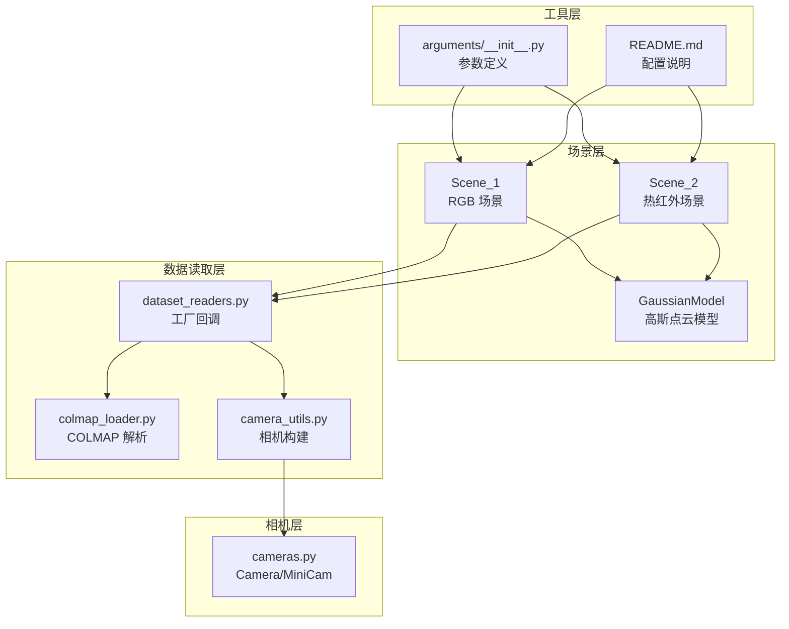
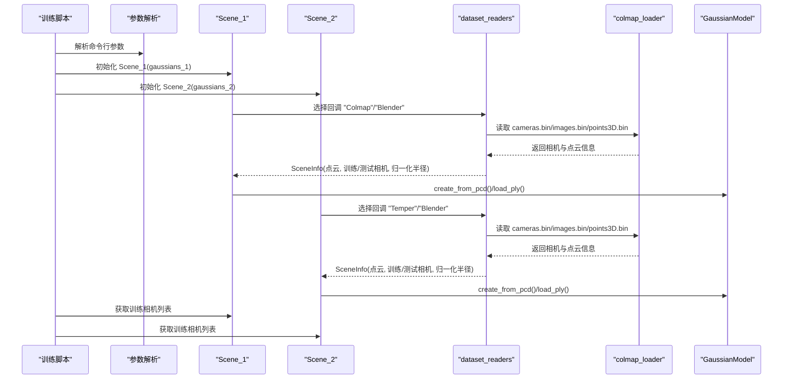
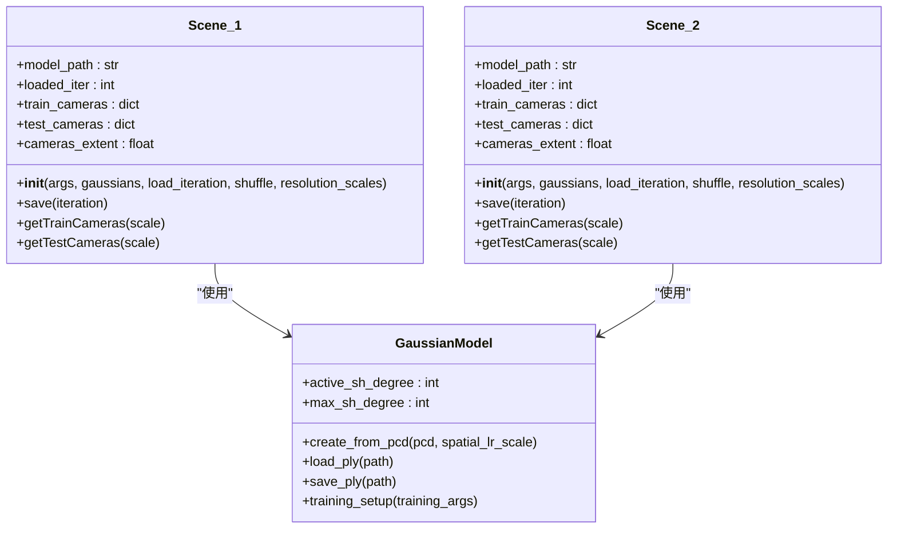
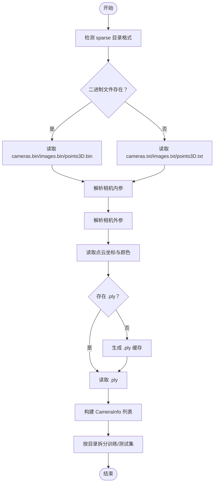
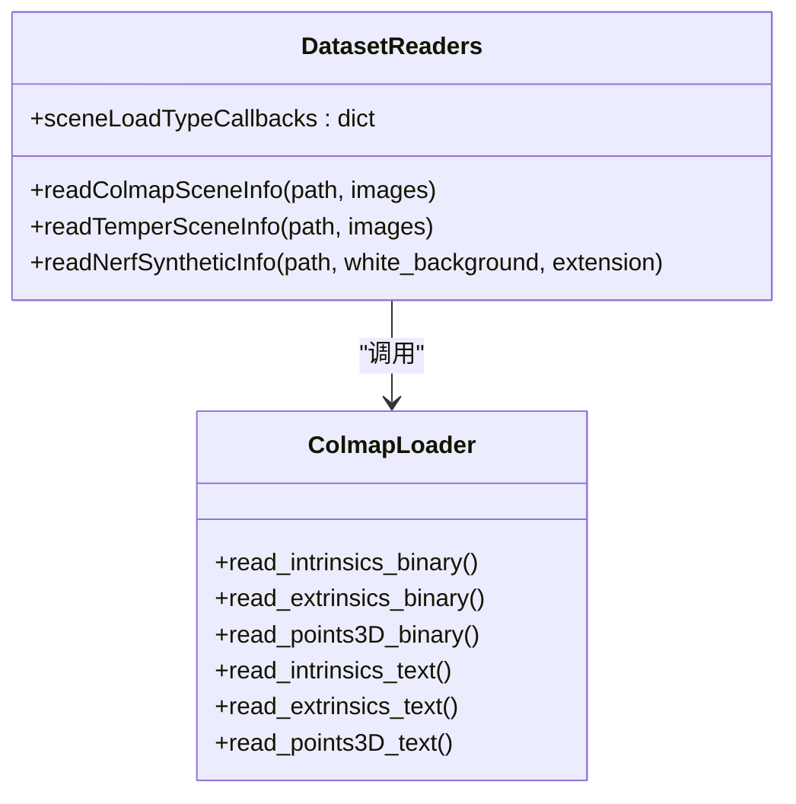
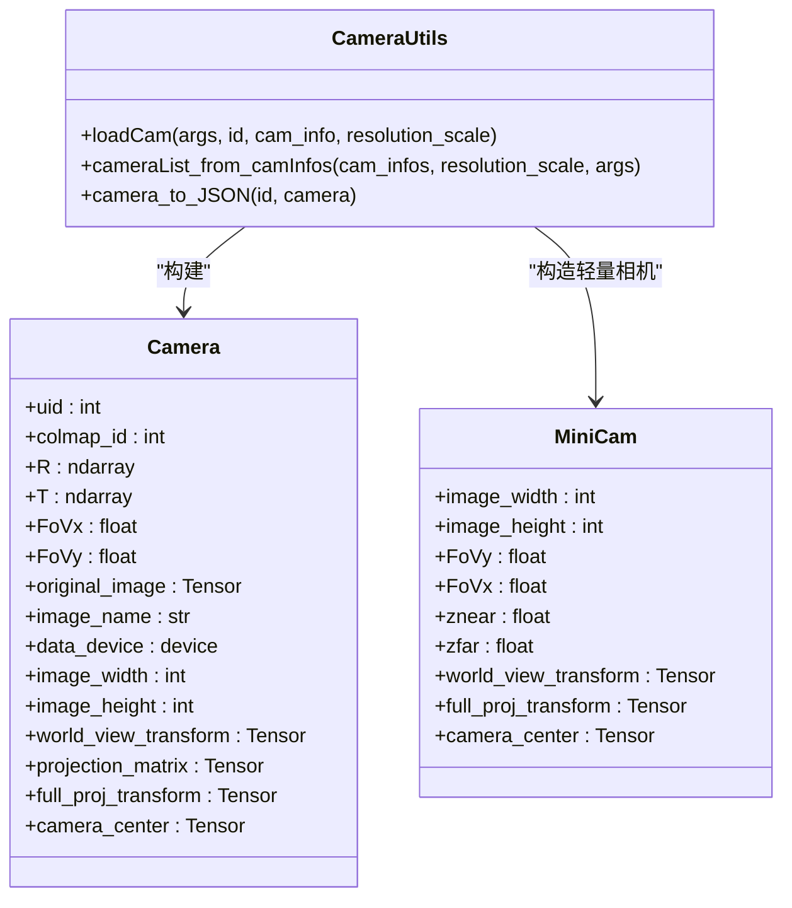
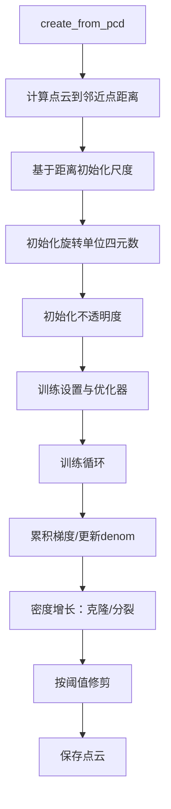
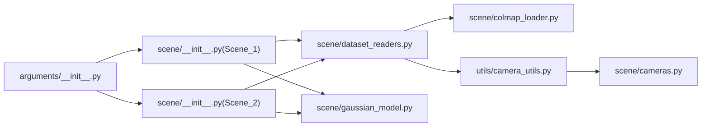

# 场景管理系统

<cite>
**本文档引用的文件**
- [scene/__init__.py](file://scene/__init__.py)
- [scene/cameras.py](file://scene/cameras.py)
- [scene/colmap_loader.py](file://scene/colmap_loader.py)
- [scene/dataset_readers.py](file://scene/dataset_readers.py)
- [scene/gaussian_model.py](file://scene/gaussian_model.py)
- [utils/camera_utils.py](file://utils/camera_utils.py)
- [arguments/__init__.py](file://arguments/__init__.py)
- [README.md](file://README.md)
- [train_MSMG.py](file://train_MSMG.py)
- [convert.py](file://convert.py)
</cite>

## 目录
1. [简介](#简介)
2. [项目结构](#项目结构)
3. [核心组件](#核心组件)
4. [架构总览](#架构总览)
5. [详细组件分析](#详细组件分析)
6. [依赖关系分析](#依赖关系分析)
7. [性能考虑](#性能考虑)
8. [故障排除指南](#故障排除指南)
9. [结论](#结论)
10. [附录](#附录)

## 简介
本文件面向 Thermal-Gaussian 项目的场景管理系统，重点解析双场景架构（Scene_1 和 Scene_2）的设计与实现，涵盖：
- RGB 场景与热红外场景的数据组织方式
- COLMAP 集成流程：稀疏重建结果读取、相机参数提取、点云初始化
- 数据加载器的工厂模式实现，统一多数据格式接口
- 相机类设计：视图矩阵计算、可见性过滤与渲染优化
- 场景配置与数据预处理最佳实践

## 项目结构
场景管理相关代码主要位于 scene/ 目录，配合 utils/ 工具模块与训练入口脚本共同构成完整的双模态场景管线。

图表来源
- [scene/__init__.py:21-168](file://scene/__init__.py#L21-L168)
- [scene/dataset_readers.py:136-311](file://scene/dataset_readers.py#L136-L311)
- [scene/colmap_loader.py:125-295](file://scene/colmap_loader.py#L125-L295)
- [utils/camera_utils.py:19-83](file://utils/camera_utils.py#L19-L83)
- [scene/cameras.py:17-72](file://scene/cameras.py#L17-L72)
- [arguments/__init__.py:47-113](file://arguments/__init__.py#L47-L113)
- [README.md:28-61](file://README.md#L28-L61)

章节来源
- [scene/__init__.py:21-168](file://scene/__init__.py#L21-L168)
- [scene/dataset_readers.py:136-311](file://scene/dataset_readers.py#L136-L311)
- [scene/colmap_loader.py:125-295](file://scene/colmap_loader.py#L125-L295)
- [utils/camera_utils.py:19-83](file://utils/camera_utils.py#L19-L83)
- [scene/cameras.py:17-72](file://scene/cameras.py#L17-L72)
- [arguments/__init__.py:47-113](file://arguments/__init__.py#L47-L113)
- [README.md:28-61](file://README.md#L28-L61)

## 核心组件
- 双场景类：Scene_1（RGB）、Scene_2（热红外），分别负责各自模态的相机加载、点云初始化与保存
- 数据读取工厂：通过回调字典统一支持 Colmap、Temper（热红外）、Blender 数据集
- COLMAP 加载器：解析 cameras.bin/images.bin/points3D.bin 或文本格式，提取内参、外参与点云
- 相机类：封装相机姿态、视图/投影矩阵、裁剪范围等，支持 MiniCam 轻量表示
- 高斯模型：管理点云属性（位置、颜色、尺度、旋转、不透明度）及优化器状态

章节来源
- [scene/__init__.py:21-168](file://scene/__init__.py#L21-L168)
- [scene/dataset_readers.py:307-311](file://scene/dataset_readers.py#L307-L311)
- [scene/colmap_loader.py:125-295](file://scene/colmap_loader.py#L125-L295)
- [scene/cameras.py:17-72](file://scene/cameras.py#L17-L72)
- [scene/gaussian_model.py:24-148](file://scene/gaussian_model.py#L24-L148)

## 架构总览
双场景架构将 RGB 与热红外数据分离到两个独立场景对象中，共享高斯点云模型但拥有各自的相机集合与点云初始化策略。COLMAP 输出作为稀疏重建基础，驱动两套相机参数与点云初始化流程。

图表来源
- [train_MSMG.py:33-50](file://train_MSMG.py#L33-L50)
- [scene/__init__.py:25-84](file://scene/__init__.py#L25-L84)
- [scene/__init__.py:100-159](file://scene/__init__.py#L100-L159)
- [scene/dataset_readers.py:136-181](file://scene/dataset_readers.py#L136-L181)
- [scene/dataset_readers.py:185-230](file://scene/dataset_readers.py#L185-L230)
- [scene/colmap_loader.py:125-295](file://scene/colmap_loader.py#L125-L295)
- [scene/gaussian_model.py:124-148](file://scene/gaussian_model.py#L124-L148)

## 详细组件分析

### 双场景架构设计（Scene_1 与 Scene_2）
- 分离式场景：Scene_1 负责 RGB 模态，Scene_2 负责热红外模态；两者共享高斯点云模型，但分别从不同图像目录加载相机与点云
- 数据源识别：优先检测 sparse 目录是否存在决定使用 COLMAP 数据；若存在 transforms_train.json 则按 Blender 数据集处理
- 点云初始化：首次运行时复制 COLMAP 的 points3D.ply 到模型输出路径，并根据相机集合归一化半径
- 相机加载：按分辨率缩放比例批量构建 Camera 对象，支持随机打乱以提升多分辨率一致性
- 模型保存：分别保存 RGB 与热红外对应的点云目录，迭代号命名

图表来源
- [scene/__init__.py:21-94](file://scene/__init__.py#L21-L94)
- [scene/__init__.py:96-168](file://scene/__init__.py#L96-L168)
- [scene/gaussian_model.py:24-148](file://scene/gaussian_model.py#L24-L148)

章节来源
- [scene/__init__.py:21-94](file://scene/__init__.py#L21-L94)
- [scene/__init__.py:96-168](file://scene/__init__.py#L96-L168)

### COLMAP 集成流程
- 文件探测：优先尝试二进制格式（cameras.bin/images.bin/points3D.bin），失败则回退到文本格式（cameras.txt/images.txt/points3D.txt）
- 内参解析：支持 PINHOLE/SIMPLE_PINHOLE 等模型，提取焦距并转换为 FOV
- 外参解析：四元数转旋转矩阵，结合平移向量形成相机姿态
- 点云读取：从 points3D.bin 或 points3D.txt 中读取三维点与颜色，必要时生成 .ply 缓存
- 相机构建：遍历 images.bin/images.txt，结合内参生成 CameraInfo 列表，排序后拆分为训练/测试集

图表来源
- [scene/colmap_loader.py:125-295](file://scene/colmap_loader.py#L125-L295)
- [scene/dataset_readers.py:136-181](file://scene/dataset_readers.py#L136-L181)
- [scene/dataset_readers.py:185-230](file://scene/dataset_readers.py#L185-L230)

章节来源
- [scene/colmap_loader.py:125-295](file://scene/colmap_loader.py#L125-L295)
- [scene/dataset_readers.py:136-181](file://scene/dataset_readers.py#L136-L181)
- [scene/dataset_readers.py:185-230](file://scene/dataset_readers.py#L185-L230)

### 数据加载器工厂模式
- 回调注册：通过字典将字符串键映射到具体读取函数，支持 "Colmap"、"Temper"、"Blender"
- 统一接口：上层仅需传入数据根路径与图像目录名，即可获得标准化的 SceneInfo（包含点云、训练/测试相机、归一化半径）
- 多格式兼容：COLMAP 与 Blender 均返回相同结构的 SceneInfo，便于后续统一处理

图表来源
- [scene/dataset_readers.py:307-311](file://scene/dataset_readers.py#L307-L311)
- [scene/dataset_readers.py:136-181](file://scene/dataset_readers.py#L136-L181)
- [scene/dataset_readers.py:185-230](file://scene/dataset_readers.py#L185-L230)
- [scene/colmap_loader.py:125-295](file://scene/colmap_loader.py#L125-L295)

章节来源
- [scene/dataset_readers.py:307-311](file://scene/dataset_readers.py#L307-L311)
- [scene/dataset_readers.py:136-181](file://scene/dataset_readers.py#L136-L181)
- [scene/dataset_readers.py:185-230](file://scene/dataset_readers.py#L185-L230)

### 相机类设计
- Camera 类：封装相机 ID、旋转矩阵 R、平移向量 T、水平/垂直视场角、原始图像、遮罩、设备、尺寸、近远裁剪面、平移与缩放参数；计算并缓存世界-视图变换、投影矩阵与完整投影矩阵
- MiniCam：轻量相机表示，用于渲染管线中的快速传递，包含宽高、FOV、裁剪面与变换矩阵
- 相机构建：通过 camera_utils.loadCam 将 CameraInfo 转换为 Camera 实例，支持分辨率缩放与透明度遮罩合成

图表来源
- [scene/cameras.py:17-72](file://scene/cameras.py#L17-L72)
- [utils/camera_utils.py:19-83](file://utils/camera_utils.py#L19-L83)

章节来源
- [scene/cameras.py:17-72](file://scene/cameras.py#L17-L72)
- [utils/camera_utils.py:19-83](file://utils/camera_utils.py#L19-L83)

### 高斯点云模型与渲染优化
- 属性激活：尺度、不透明度采用指数/sigmoid 激活，旋转采用归一化
- 初始化：基于点云距离估计初始尺度，随机旋转初始化，不透明度设为小值
- 优化器：为不同参数组设置学习率与调度策略，支持密度增长与修剪
- 可见性与密度：在每步训练中累积梯度、更新最大 2D 半径、按阈值进行克隆/分裂/修剪

图表来源
- [scene/gaussian_model.py:124-148](file://scene/gaussian_model.py#L124-L148)
- [scene/gaussian_model.py:149-168](file://scene/gaussian_model.py#L149-L168)
- [scene/gaussian_model.py:349-407](file://scene/gaussian_model.py#L349-L407)

章节来源
- [scene/gaussian_model.py:124-148](file://scene/gaussian_model.py#L124-L148)
- [scene/gaussian_model.py:149-168](file://scene/gaussian_model.py#L149-L168)
- [scene/gaussian_model.py:349-407](file://scene/gaussian_model.py#L349-L407)

## 依赖关系分析
- Scene_1/Scene_2 依赖 GaussianModel 进行点云管理
- dataset_readers 提供工厂回调，内部依赖 colmap_loader 读取 COLMAP 数据
- camera_utils 将 CameraInfo 转换为 Camera，依赖 graphics_utils 计算变换矩阵
- arguments 定义训练参数，影响 Scene 初始化与相机分辨率处理

图表来源
- [arguments/__init__.py:47-113](file://arguments/__init__.py#L47-L113)
- [scene/__init__.py:25-84](file://scene/__init__.py#L25-L84)
- [scene/__init__.py:100-159](file://scene/__init__.py#L100-L159)
- [scene/dataset_readers.py:136-181](file://scene/dataset_readers.py#L136-L181)
- [scene/dataset_readers.py:185-230](file://scene/dataset_readers.py#L185-L230)
- [scene/colmap_loader.py:125-295](file://scene/colmap_loader.py#L125-L295)
- [utils/camera_utils.py:19-83](file://utils/camera_utils.py#L19-L83)
- [scene/cameras.py:17-72](file://scene/cameras.py#L17-L72)
- [scene/gaussian_model.py:24-148](file://scene/gaussian_model.py#L24-L148)

章节来源
- [arguments/__init__.py:47-113](file://arguments/__init__.py#L47-L113)
- [scene/__init__.py:25-84](file://scene/__init__.py#L25-L84)
- [scene/__init__.py:100-159](file://scene/__init__.py#L100-L159)
- [scene/dataset_readers.py:136-181](file://scene/dataset_readers.py#L136-L181)
- [scene/dataset_readers.py:185-230](file://scene/dataset_readers.py#L185-L230)
- [scene/colmap_loader.py:125-295](file://scene/colmap_loader.py#L125-L295)
- [utils/camera_utils.py:19-83](file://utils/camera_utils.py#L19-L83)
- [scene/cameras.py:17-72](file://scene/cameras.py#L17-L72)
- [scene/gaussian_model.py:24-148](file://scene/gaussian_model.py#L24-L148)

## 性能考虑
- 多分辨率一致性：训练前对相机列表进行随机打乱，确保不同分辨率下的样本分布一致
- 自动分辨率适配：当输入图像宽度超过阈值时自动降采样，避免显存压力过大
- 渲染优化：通过可见性过滤与最大 2D 半径缓存减少无效点参与渲染
- 密度增长与修剪：在设定迭代区间内动态增删点，保持点云数量可控并提升收敛稳定性

## 故障排除指南
- COLMAP 文件缺失或格式错误
  - 现象：无法读取 cameras.bin/images.bin/points3D.bin 或文本文件
  - 处理：确认 sparse/0 下存在二进制或文本文件；若只有其一，确保对应读取分支可用
  - 参考路径
    - [scene/colmap_loader.py:136-147](file://scene/colmap_loader.py#L136-L147)
    - [scene/dataset_readers.py:136-181](file://scene/dataset_readers.py#L136-L181)
- 图像路径不匹配
  - 现象：找不到对应图像文件
  - 处理：检查 images 目录结构与相机名称是否一致；确保 rgb/thermal 子目录下包含 test/train
  - 参考路径
    - [scene/dataset_readers.py:148-156](file://scene/dataset_readers.py#L148-L156)
    - [scene/dataset_readers.py:197-205](file://scene/dataset_readers.py#L197-L205)
- 点云文件损坏或缺失
  - 现象：.ply 读取失败或不存在
  - 处理：删除旧 .ply，等待自动生成；或手动转换 points3D.bin/txt
  - 参考路径
    - [scene/dataset_readers.py:161-175](file://scene/dataset_readers.py#L161-L175)
    - [scene/dataset_readers.py:210-224](file://scene/dataset_readers.py#L210-L224)
- 设备与显存问题
  - 现象：CUDA 设备不可用或显存不足
  - 处理：检查 data_device 设置；降低分辨率或 batch 大小；确保 GPU 正常
  - 参考路径
    - [scene/cameras.py:32-38](file://scene/cameras.py#L32-L38)
    - [utils/camera_utils.py:19-53](file://utils/camera_utils.py#L19-L53)

章节来源
- [scene/colmap_loader.py:136-147](file://scene/colmap_loader.py#L136-L147)
- [scene/dataset_readers.py:136-181](file://scene/dataset_readers.py#L136-L181)
- [scene/dataset_readers.py:148-156](file://scene/dataset_readers.py#L148-L156)
- [scene/dataset_readers.py:197-205](file://scene/dataset_readers.py#L197-L205)
- [scene/dataset_readers.py:161-175](file://scene/dataset_readers.py#L161-L175)
- [scene/dataset_readers.py:210-224](file://scene/dataset_readers.py#L210-L224)
- [scene/cameras.py:32-38](file://scene/cameras.py#L32-L38)
- [utils/camera_utils.py:19-53](file://utils/camera_utils.py#L19-L53)

## 结论
Thermal-Gaussian 的场景管理系统通过双场景架构实现了 RGB 与热红外模态的解耦与协同：COLMAP 提供统一的稀疏重建基础，工厂模式的数据读取器保证了多数据格式的一致接口，相机类与高斯模型共同支撑高效的渲染与优化。该设计既满足了工程落地需求，也为后续扩展其他模态提供了清晰的扩展点。

## 附录

### 场景配置与数据预处理最佳实践
- 数据目录结构
  - RGB 与热红外分别放置于 rgb/ 与 thermal/ 子目录，每个子目录包含 test/ 与 train/
  - COLMAP 输出位于 sparse/0/ 下，包含 cameras.bin/images.bin/points3D.bin 或对应文本文件
  - 参考路径
    - [README.md:33-60](file://README.md#L33-L60)
- COLMAP 预处理
  - 使用 convert.py 执行特征提取、匹配与映射器，随后图像去畸变并整理 sparse/0
  - 参考路径
    - [convert.py:31-79](file://convert.py#L31-L79)
- 参数建议
  - 分辨率：默认自动适配，必要时通过命令行指定 -r 控制
  - 白背景：可通过参数切换背景，影响合成与损失计算
  - 参考路径
    - [arguments/__init__.py:47-62](file://arguments/__init__.py#L47-L62)
    - [arguments/__init__.py:64-91](file://arguments/__init__.py#L64-L91)

章节来源
- [README.md:33-60](file://README.md#L33-L60)
- [convert.py:31-79](file://convert.py#L31-L79)
- [arguments/__init__.py:47-62](file://arguments/__init__.py#L47-L62)
- [arguments/__init__.py:64-91](file://arguments/__init__.py#L64-L91)