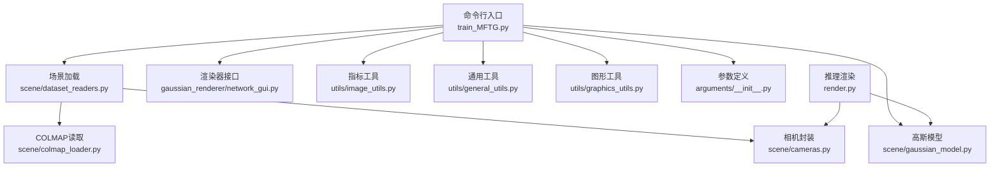
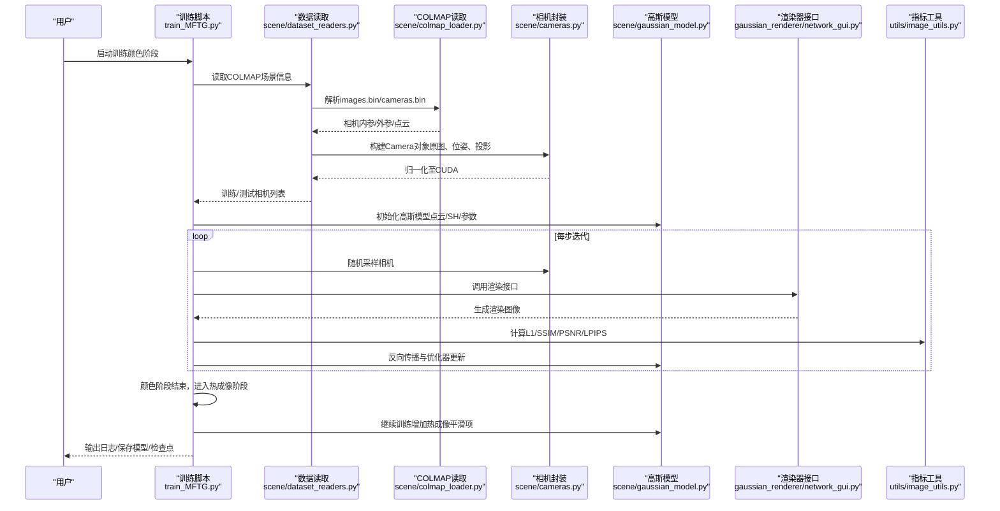
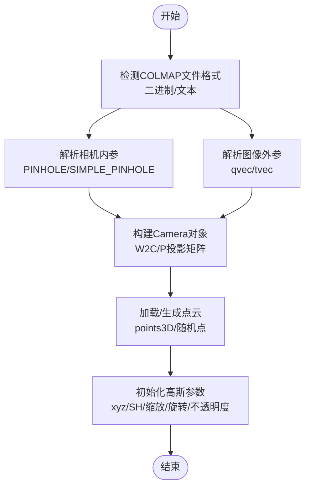
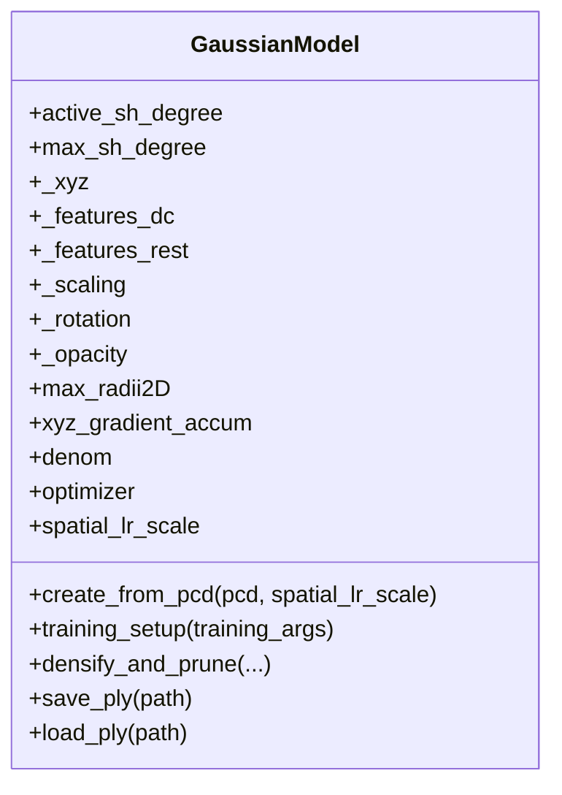
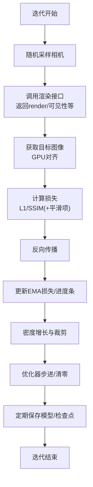
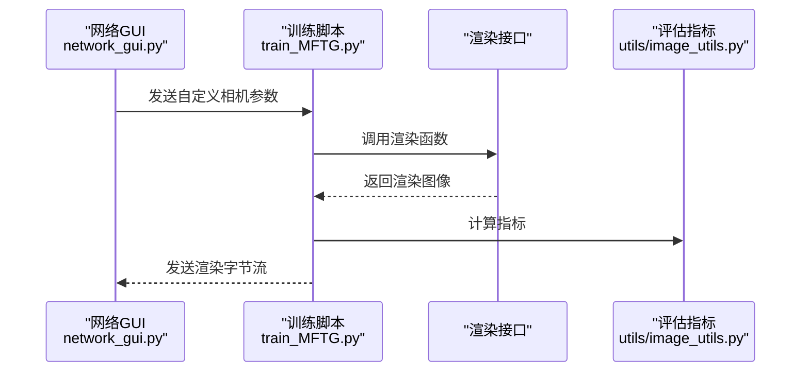
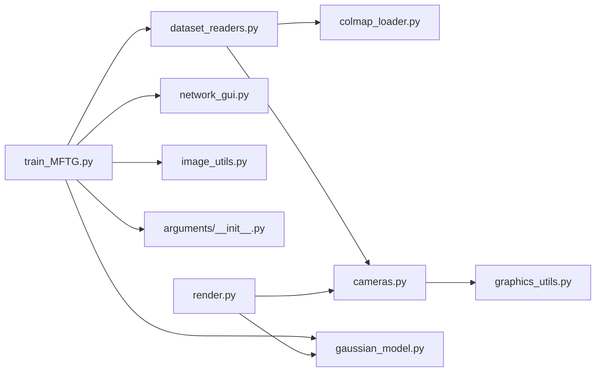

# 数据流架构

<cite>
**本文引用的文件**
- [train_MFTG.py](file://train_MFTG.py)
- [render.py](file://render.py)
- [scene/colmap_loader.py](file://scene/colmap_loader.py)
- [scene/dataset_readers.py](file://scene/dataset_readers.py)
- [scene/cameras.py](file://scene/cameras.py)
- [scene/gaussian_model.py](file://scene/gaussian_model.py)
- [gaussian_renderer/network_gui.py](file://gaussian_renderer/network_gui.py)
- [utils/image_utils.py](file://utils/image_utils.py)
- [utils/general_utils.py](file://utils/general_utils.py)
- [utils/graphics_utils.py](file://utils/graphics_utils.py)
- [arguments/__init__.py](file://arguments/__init__.py)
- [README.md](file://README.md)
</cite>

## 目录
1. [简介](#简介)
2. [项目结构](#项目结构)
3. [核心组件](#核心组件)
4. [架构总览](#架构总览)
5. [详细组件分析](#详细组件分析)
6. [依赖关系分析](#依赖关系分析)
7. [性能考量](#性能考量)
8. [故障排查指南](#故障排查指南)
9. [结论](#结论)
10. [附录](#附录)

## 简介
本文件面向 Thermal-Gaussian 项目的“多模态微调高斯（MFTG）”版本，系统化梳理从原始图像到三维高斯点阵的完整数据流架构。重点覆盖以下方面：
- 数据预处理：COLMAP 稀疏重建结果读取与相机参数解析、图像归一化与张量化、点云初始化
- 模型训练：颜色与热成像双阶段训练、损失函数设计、正则化与密度增长策略
- 渲染与评估：实时渲染管线、网络 GUI 交互、指标计算与可视化
- 数据在模块间传递：张量内存布局、设备迁移（CPU/GPU）、批处理策略
- 验证与错误处理：输入校验、异常捕获、性能监控与调试手段

## 项目结构
项目采用按功能域分层组织：训练脚本、场景加载与相机模型、高斯模型与渲染器、工具库与参数配置等。

图示来源
- [train_MFTG.py:35-163](file://train_MFTG.py#L35-L163)
- [scene/dataset_readers.py:136-181](file://scene/dataset_readers.py#L136-L181)
- [scene/colmap_loader.py:136-181](file://scene/colmap_loader.py#L136-L181)
- [scene/cameras.py:17-58](file://scene/cameras.py#L17-L58)
- [scene/gaussian_model.py:44-148](file://scene/gaussian_model.py#L44-L148)
- [gaussian_renderer/network_gui.py:26-85](file://gaussian_renderer/network_gui.py#L26-L85)
- [utils/image_utils.py:14-20](file://utils/image_utils.py#L14-L20)
- [utils/general_utils.py:21-28](file://utils/general_utils.py#L21-L28)
- [utils/graphics_utils.py:31-77](file://utils/graphics_utils.py#L31-L77)
- [arguments/__init__.py:47-91](file://arguments/__init__.py#L47-L91)
- [render.py:25-60](file://render.py#L25-L60)

章节来源
- [README.md:31-60](file://README.md#L31-L60)
- [train_MFTG.py:240-273](file://train_MFTG.py#L240-L273)
- [render.py:61-76](file://render.py#L61-L76)

## 核心组件
- 训练主循环与阶段切换：颜色图像训练后进行热成像训练，共享高斯模型参数，分别记录日志与保存检查点。
- 场景加载与相机：支持 COLMAP 文本/二进制格式，解析内外参、焦距与视场角，构建 Camera 对象并归一化至 CUDA 设备。
- 高斯模型：管理点云位置、颜色（SH 系数）、尺度、旋转、不透明度等可学习参数，提供优化器配置、密度增长与裁剪、保存/加载 PLY。
- 渲染与评估：通过渲染器接口生成图像，计算 L1/PSNR/SSIM/LPIPS 等指标，支持 TensorBoard 可视化。
- 工具库：图像指标、通用张量操作、几何矩阵与 FOV 转换、PIL 到张量转换等。

章节来源
- [train_MFTG.py:35-163](file://train_MFTG.py#L35-L163)
- [scene/dataset_readers.py:68-109](file://scene/dataset_readers.py#L68-L109)
- [scene/cameras.py:17-58](file://scene/cameras.py#L17-L58)
- [scene/gaussian_model.py:44-148](file://scene/gaussian_model.py#L44-L148)
- [render.py:25-60](file://render.py#L25-L60)
- [utils/image_utils.py:14-20](file://utils/image_utils.py#L14-L20)
- [utils/general_utils.py:21-28](file://utils/general_utils.py#L21-L28)
- [utils/graphics_utils.py:31-77](file://utils/graphics_utils.py#L31-L77)

## 架构总览
下图展示从原始图像到训练完成的关键数据流路径与模块交互。

图示来源
- [train_MFTG.py:35-163](file://train_MFTG.py#L35-L163)
- [scene/dataset_readers.py:136-181](file://scene/dataset_readers.py#L136-L181)
- [scene/colmap_loader.py:136-181](file://scene/colmap_loader.py#L136-L181)
- [scene/cameras.py:17-58](file://scene/cameras.py#L17-L58)
- [scene/gaussian_model.py:124-148](file://scene/gaussian_model.py#L124-L148)
- [gaussian_renderer/network_gui.py:57-85](file://gaussian_renderer/network_gui.py#L57-L85)
- [utils/image_utils.py:14-20](file://utils/image_utils.py#L14-L20)

## 详细组件分析

### 数据预处理与COLMAP稀疏重建
- 输入结构要求：rgb/thermal 子目录下的 train/test 图像，以及 sparse/0 下的 cameras.bin/images.bin/points3D.bin 或文本格式。
- COLMAP 读取：支持二进制与文本两种格式；解析相机模型（PINHOLE/SIMPLE_PINHOLE），提取内外参与点云坐标/颜色。
- 相机封装：将 R/T、FoV、图像尺寸等转换为世界到相机变换与投影矩阵，统一迁移到 CUDA 设备。
- 点云初始化：从 COLMAP 的 points3D 导入或生成随机点云，基于 knn 距离估计初始尺度，设置初始旋转与不透明度。

图示来源
- [scene/dataset_readers.py:136-181](file://scene/dataset_readers.py#L136-L181)
- [scene/colmap_loader.py:136-181](file://scene/colmap_loader.py#L136-L181)
- [scene/cameras.py:17-58](file://scene/cameras.py#L17-L58)
- [scene/gaussian_model.py:124-148](file://scene/gaussian_model.py#L124-L148)

章节来源
- [README.md:31-60](file://README.md#L31-L60)
- [scene/dataset_readers.py:136-181](file://scene/dataset_readers.py#L136-L181)
- [scene/colmap_loader.py:136-181](file://scene/colmap_loader.py#L136-L181)
- [scene/cameras.py:17-58](file://scene/cameras.py#L17-L58)
- [scene/gaussian_model.py:124-148](file://scene/gaussian_model.py#L124-L148)

### 点云初始化与模型参数
- 参数张量布局：xyz、features_dc、features_rest、scaling、rotation、opacity 均以 CUDA 张量形式存储，便于 GPU 加速。
- 初始尺度：使用点云到最近邻距离的对数映射作为初始尺度，避免过小/过大导致的渲染不稳定。
- 初始旋转：单位四元数初始化，保证旋转归一化。
- 不透明度：逆sigmoid 初始值，便于后续优化。

图示来源
- [scene/gaussian_model.py:44-148](file://scene/gaussian_model.py#L44-L148)

章节来源
- [scene/gaussian_model.py:44-148](file://scene/gaussian_model.py#L44-L148)

### 训练流程与损失函数
- 阶段划分：先训练颜色图像，再训练热成像；热成像阶段引入平滑损失项以贴合热成像物理特性。
- 损失函数：L1 与 SSIM 的加权组合；热成像额外加入平滑损失。
- 正则化：密度增长（clone/split）与裁剪（opacity/屏幕半径/尺度阈值）；每步累积梯度统计用于密度增长。
- 优化器：Adam，按参数组设置不同学习率；位置学习率指数衰减。

图示来源
- [train_MFTG.py:68-163](file://train_MFTG.py#L68-L163)
- [utils/image_utils.py:14-20](file://utils/image_utils.py#L14-L20)

章节来源
- [train_MFTG.py:68-163](file://train_MFTG.py#L68-L163)
- [utils/image_utils.py:14-20](file://utils/image_utils.py#L14-L20)

### 渲染与评估
- 实时渲染：通过网络 GUI 接收自定义相机参数，生成渲染图像并回传字节流供前端显示。
- 批处理策略：训练时逐相机迭代，渲染时按视图列表顺序批量保存图像与地面真值。
- 指标计算：L1、PSNR、SSIM、LPIPS，支持 TensorBoard 写入直方图与图像。

图示来源
- [gaussian_renderer/network_gui.py:57-85](file://gaussian_renderer/network_gui.py#L57-L85)
- [train_MFTG.py:68-163](file://train_MFTG.py#L68-L163)
- [utils/image_utils.py:14-20](file://utils/image_utils.py#L14-L20)

章节来源
- [gaussian_renderer/network_gui.py:57-85](file://gaussian_renderer/network_gui.py#L57-L85)
- [train_MFTG.py:68-163](file://train_MFTG.py#L68-L163)
- [utils/image_utils.py:14-20](file://utils/image_utils.py#L14-L20)

### 参数与配置
- 参数分组：模型参数（sh_degree、分辨率、背景）、管道参数（Python 开关、调试开关）、优化参数（迭代次数、学习率、密度增长间隔等）。
- 命令行合并：支持从配置文件与命令行合并参数，便于复现实验。

章节来源
- [arguments/__init__.py:47-91](file://arguments/__init__.py#L47-L91)
- [arguments/__init__.py:92-113](file://arguments/__init__.py#L92-L113)

## 依赖关系分析
- 训练主循环依赖场景读取与相机封装，相机封装依赖图形工具中的矩阵与 FOV 转换。
- 高斯模型依赖简单 KNN 近邻库以估计初始尺度，依赖 SH 工具进行颜色编码。
- 渲染与评估依赖指标工具与 TensorBoard（可选）。
- 参数定义贯穿训练与渲染两端，确保一致性。

图示来源
- [train_MFTG.py:35-163](file://train_MFTG.py#L35-L163)
- [scene/dataset_readers.py:136-181](file://scene/dataset_readers.py#L136-L181)
- [scene/colmap_loader.py:136-181](file://scene/colmap_loader.py#L136-L181)
- [scene/cameras.py:17-58](file://scene/cameras.py#L17-L58)
- [utils/graphics_utils.py:31-77](file://utils/graphics_utils.py#L31-L77)
- [scene/gaussian_model.py:44-148](file://scene/gaussian_model.py#L44-L148)
- [gaussian_renderer/network_gui.py:26-85](file://gaussian_renderer/network_gui.py#L26-L85)
- [utils/image_utils.py:14-20](file://utils/image_utils.py#L14-L20)
- [arguments/__init__.py:47-91](file://arguments/__init__.py#L47-L91)
- [render.py:25-60](file://render.py#L25-L60)

章节来源
- [train_MFTG.py:35-163](file://train_MFTG.py#L35-L163)
- [render.py:25-60](file://render.py#L25-L60)

## 性能考量
- 设备迁移：所有张量与矩阵均在 CUDA 上执行，减少 CPU/GPU 间拷贝；图像在 GPU 上裁剪与归一化。
- 内存布局：特征张量采用连续布局（contiguous）以提升 CUDA 内核效率；点云与 SH 系数按通道展开以便批处理。
- 批处理策略：训练时单相机单步，避免大批次占用显存；渲染时按视图列表顺序保存，降低 I/O 压力。
- 正则化与密度增长：通过密度增长与裁剪控制点数量，平衡质量与速度；指数学习率衰减稳定收敛。
- 可视化与监控：TensorBoard 记录训练损失、迭代耗时与不透明度分布直方图，辅助性能分析。

## 故障排查指南
- 输入数据结构不符：确认 rgb/thermal/train、rgb/thermal/test 与 sparse/0 的存在与命名一致。
- COLMAP 文件格式：若二进制失败，自动回退到文本格式；确保 cameras.txt/images.txt 存在。
- 设备与显存：若自定义设备失败，回退到默认 CUDA；注意高分辨率图像可能触发显存不足。
- 渲染 GUI：若连接失败，检查 IP/端口配置与防火墙；确保渲染循环中捕获异常并重置连接状态。
- 指标异常：PSNR/SSIM 为负值通常由数值误差导致，建议检查归一化与裁剪范围。

章节来源
- [README.md:31-60](file://README.md#L31-L60)
- [scene/cameras.py:32-38](file://scene/cameras.py#L32-L38)
- [gaussian_renderer/network_gui.py:34-42](file://gaussian_renderer/network_gui.py#L34-L42)
- [utils/image_utils.py:14-20](file://utils/image_utils.py#L14-L20)

## 结论
Thermal-Gaussian 的数据流以 COLMAP 稀疏重建为起点，经由相机封装与点云初始化，进入颜色与热成像双阶段训练。训练期间通过密度增长与正则化保持模型稳定性，渲染与评估结合指标工具与可视化平台，形成完整的从数据到结果的流水线。遵循本文的内存布局、设备迁移与批处理策略，可有效提升性能并便于调试。

## 附录
- 关键路径参考
  - 训练主循环与阶段切换：[train_MFTG.py:35-163](file://train_MFTG.py#L35-L163)
  - 场景读取与相机封装：[scene/dataset_readers.py:136-181](file://scene/dataset_readers.py#L136-L181)、[scene/cameras.py:17-58](file://scene/cameras.py#L17-L58)
  - COLMAP 读取：[scene/colmap_loader.py:136-181](file://scene/colmap_loader.py#L136-L181)
  - 高斯模型初始化与优化：[scene/gaussian_model.py:124-148](file://scene/gaussian_model.py#L124-L148)
  - 渲染与评估：[render.py:25-60](file://render.py#L25-L60)、[utils/image_utils.py:14-20](file://utils/image_utils.py#L14-L20)
  - 参数与配置：[arguments/__init__.py:47-91](file://arguments/__init__.py#L47-L91)