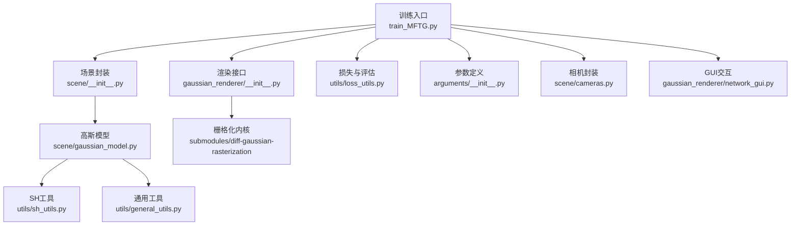
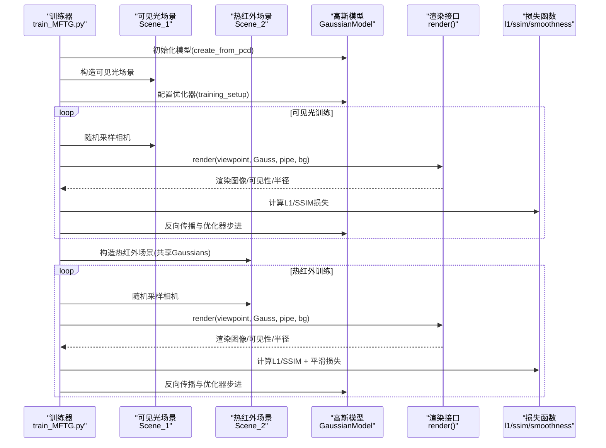
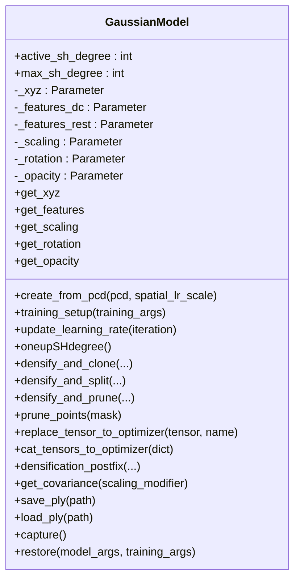
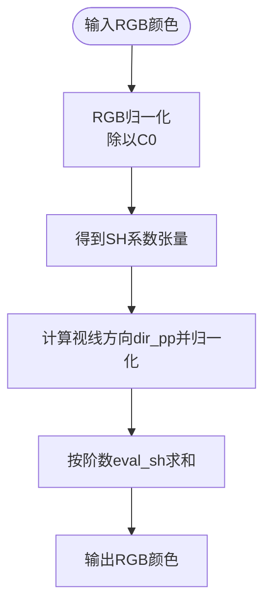
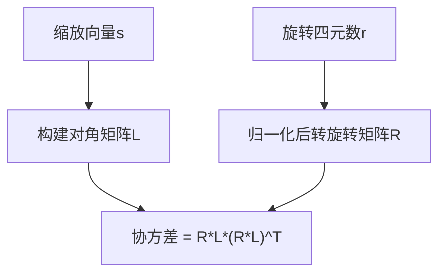
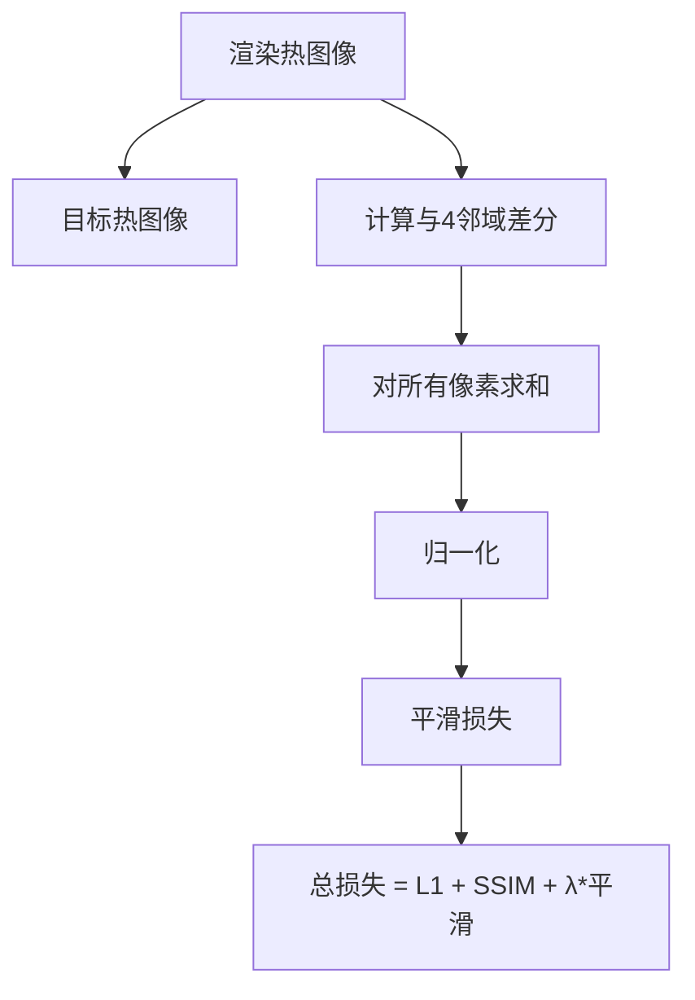
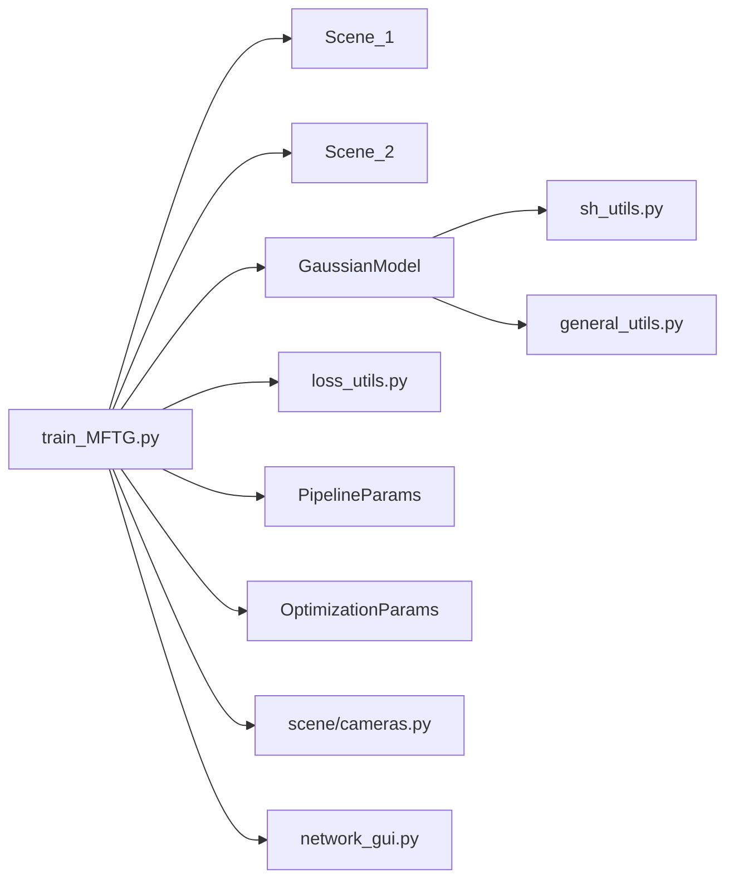

# 核心模型架构

<cite>
**本文引用的文件**
- [scene/gaussian_model.py](file://scene/gaussian_model.py)
- [train_MFTG.py](file://train_MFTG.py)
- [gaussian_renderer/__init__.py](file://gaussian_renderer/__init__.py)
- [utils/sh_utils.py](file://utils/sh_utils.py)
- [utils/loss_utils.py](file://utils/loss_utils.py)
- [utils/general_utils.py](file://utils/general_utils.py)
- [scene/__init__.py](file://scene/__init__.py)
- [scene/cameras.py](file://scene/cameras.py)
- [gaussian_renderer/network_gui.py](file://gaussian_renderer/network_gui.py)
- [arguments/__init__.py](file://arguments/__init__.py)
- [README.md](file://README.md)
</cite>

## 目录
1. [引言](#引言)
2. [项目结构](#项目结构)
3. [核心组件](#核心组件)
4. [架构总览](#架构总览)
5. [详细组件分析](#详细组件分析)
6. [依赖关系分析](#依赖关系分析)
7. [性能考量](#性能考量)
8. [故障排查指南](#故障排查指南)
9. [结论](#结论)
10. [附录](#附录)

## 引言
本文件面向Thermal-Gaussian项目的“多模态微调高斯（MFTG）”版本，系统性梳理其核心模型架构与训练流程。重点围绕3D高斯点阵模型的设计原理与实现细节展开，包括：
- 球谐函数（Spherical Harmonics, SH）颜色编码机制
- 位置与协方差参数化
- 透明度建模
- GaussianModel类的参数初始化策略、优化器配置与密度控制机制
- 双模态正则化在可见光与热红外训练中的差异
- 热红外平滑约束的数学原理与实现方式
- 模型参数更新过程与渲染接口调用方式

## 项目结构
项目采用按功能分层组织：训练脚本负责数据加载、损失计算与优化迭代；场景模块封装相机与点云；渲染模块负责将3D高斯栅格化为2D图像；工具模块提供SH变换、损失函数与通用工具。



图示来源
- [train_MFTG.py:35-163](file://train_MFTG.py#L35-L163)
- [scene/__init__.py:21-168](file://scene/__init__.py#L21-L168)
- [scene/gaussian_model.py:24-407](file://scene/gaussian_model.py#L24-L407)
- [gaussian_renderer/__init__.py:18-101](file://gaussian_renderer/__init__.py#L18-L101)
- [utils/loss_utils.py:1-114](file://utils/loss_utils.py#L1-L114)
- [utils/sh_utils.py:114-118](file://utils/sh_utils.py#L114-L118)
- [utils/general_utils.py:18-111](file://utils/general_utils.py#L18-L111)
- [scene/cameras.py:17-72](file://scene/cameras.py#L17-L72)
- [gaussian_renderer/network_gui.py:26-86](file://gaussian_renderer/network_gui.py#L26-L86)

章节来源
- [README.md:13-98](file://README.md#L13-L98)
- [train_MFTG.py:35-163](file://train_MFTG.py#L35-L163)
- [scene/__init__.py:21-168](file://scene/__init__.py#L21-L168)

## 核心组件
- GaussianModel：3D高斯点阵模型的核心，管理点的位置、颜色（SH）、缩放、旋转、不透明度等参数，提供参数初始化、优化器配置、密度控制（克隆/分裂/修剪）、保存/加载PLY等能力。
- 渲染器render：将3D高斯通过栅格化生成2D图像，支持Python侧SH->RGB转换或由内核完成。
- 场景Scene_1/Scene_2：分别加载可见光与热红外数据集，复用同一GaussianModel实例进行训练。
- 损失函数：L1、SSIM、热红外平滑损失smoothness_loss。
- 参数与管道：OptimizationParams/PipelineParams/ModelParams定义训练超参与渲染管线开关。

章节来源
- [scene/gaussian_model.py:24-407](file://scene/gaussian_model.py#L24-L407)
- [gaussian_renderer/__init__.py:18-101](file://gaussian_renderer/__init__.py#L18-L101)
- [scene/__init__.py:21-168](file://scene/__init__.py#L21-L168)
- [utils/loss_utils.py:1-114](file://utils/loss_utils.py#L1-L114)
- [arguments/__init__.py:47-91](file://arguments/__init__.py#L47-L91)

## 架构总览
下图展示了MFTG训练中可见光与热红外两个阶段的协同：先以Scene_1训练可见光，再以Scene_2共享参数训练热红外；渲染接口在训练与GUI交互中被统一调用。



图示来源
- [train_MFTG.py:35-163](file://train_MFTG.py#L35-L163)
- [scene/__init__.py:21-168](file://scene/__init__.py#L21-L168)
- [gaussian_renderer/__init__.py:18-101](file://gaussian_renderer/__init__.py#L18-L101)
- [utils/loss_utils.py:98-114](file://utils/loss_utils.py#L98-L114)

## 详细组件分析

### GaussianModel类设计与实现
- 参数化与激活
  - 缩放：指数激活，保证正值；逆激活用于初始化与替换参数。
  - 不透明度：Sigmoid激活，范围(0,1)；使用逆Sigmoid进行初始化。
  - 旋转：四元数归一化，确保旋转矩阵正交性。
  - 协方差：通过缩放向量与旋转矩阵构建协方差，保证半正定性。
- 颜色编码（球谐函数）
  - 特征张量包含DC与余项，SH系数在训练中逐步提升阶数。
  - 支持Python侧SH->RGB转换或由栅格化内核完成。
- 参数初始化
  - 基于Simple-KNN估计点云局部尺度，设置初始缩放。
  - 初始旋转设为单位四元数，初始不透明度经逆Sigmoid映射到较小值。
  - PLY导出属性包含xyz、法向、SH系数、不透明度、缩放与旋转。
- 优化器配置
  - 位置学习率采用指数衰减调度；其他参数学习率独立配置。
  - Adam优化器，显式维护各组参数状态，便于后续替换/裁剪。
- 密度控制（克隆/分裂/修剪）
  - 基于梯度阈值与缩放大小选择需要细分的点。
  - 克隆：复制选定点的属性，保持密度稳定。
  - 分裂：在选定点周围按缩放分布采样，引入新点并调整缩放。
  - 修剪：基于不透明度阈值与屏幕半径/缩放阈值进行剔除。
- 保存/加载
  - 支持从PLY导入/导出，兼容SH阶数变化。
  - 捕获/恢复优化器状态，便于断点续训。



图示来源
- [scene/gaussian_model.py:24-407](file://scene/gaussian_model.py#L24-L407)

章节来源
- [scene/gaussian_model.py:26-42](file://scene/gaussian_model.py#L26-L42)
- [scene/gaussian_model.py:124-147](file://scene/gaussian_model.py#L124-L147)
- [scene/gaussian_model.py:149-168](file://scene/gaussian_model.py#L149-L168)
- [scene/gaussian_model.py:374-407](file://scene/gaussian_model.py#L374-L407)
- [scene/gaussian_model.py:191-209](file://scene/gaussian_model.py#L191-L209)
- [scene/gaussian_model.py:215-257](file://scene/gaussian_model.py#L215-L257)

### 球谐函数颜色编码机制
- RGB到SH映射：使用常数项C0将RGB归一化到SH空间，便于与SH特征张量对齐。
- SH->RGB：在Python侧按视线方向dir_pp标准化后，使用eval_sh计算颜色贡献。
- 渲染时可选择在Python侧完成SH->RGB，或由栅格化内核直接处理。



图示来源
- [utils/sh_utils.py:114-118](file://utils/sh_utils.py#L114-L118)
- [gaussian_renderer/__init__.py:72-82](file://gaussian_renderer/__init__.py#L72-L82)

章节来源
- [utils/sh_utils.py:26-112](file://utils/sh_utils.py#L26-L112)
- [gaussian_renderer/__init__.py:72-82](file://gaussian_renderer/__init__.py#L72-L82)

### 位置与协方差参数化
- 位置：直接作为可学习参数，使用指数学习率调度。
- 协方差：由缩放向量与旋转四元数构造，保证半正定性；支持Python侧预计算或内核侧实时计算。
- 旋转：四元数归一化，避免数值不稳定。



图示来源
- [scene/gaussian_model.py:27-31](file://scene/gaussian_model.py#L27-L31)
- [utils/general_utils.py:78-111](file://utils/general_utils.py#L78-L111)

章节来源
- [scene/gaussian_model.py:27-31](file://scene/gaussian_model.py#L27-L31)
- [utils/general_utils.py:78-111](file://utils/general_utils.py#L78-L111)

### 透明度建模
- 使用Sigmoid将不透明度映射至(0,1)，初始值通过逆Sigmoid设置为较小常数，防止过早不透明。
- 提供重置不透明度的方法，将当前不透明度压缩到更小上界，配合优化器状态重置。

章节来源
- [scene/gaussian_model.py:38-39](file://scene/gaussian_model.py#L38-L39)
- [scene/gaussian_model.py:139](file://scene/gaussian_model.py#L139)
- [scene/gaussian_model.py:210-214](file://scene/gaussian_model.py#L210-L214)

### 双模态正则化与热红外平滑约束
- 可见光阶段：L1 + 加权SSIM损失。
- 热红外阶段：在上述基础上增加平滑损失smoothness_loss，鼓励邻域像素一致性，符合热成像的空间连续性物理特性。
- 平滑损失：对4邻域（或8邻域）计算绝对差分之和，归一化后作为正则项。



图示来源
- [train_MFTG.py:110-114](file://train_MFTG.py#L110-L114)
- [utils/loss_utils.py:98-114](file://utils/loss_utils.py#L98-L114)

章节来源
- [train_MFTG.py:110-114](file://train_MFTG.py#L110-L114)
- [utils/loss_utils.py:98-114](file://utils/loss_utils.py#L98-L114)

### 模型参数更新流程与渲染接口调用
- 训练循环要点
  - 学习率调度：仅位置参数按指数函数调整。
  - 密度控制：根据梯度与缩放阈值执行克隆/分裂/修剪。
  - 优化器步进：每步执行一次优化器更新并清零梯度。
- 渲染接口
  - 输入：相机参数、背景色、可选覆盖颜色与缩放修正。
  - 输出：渲染图像、屏幕空间均值梯形、可见性过滤与屏幕半径。
- GUI交互
  - 通过network_gui建立socket连接，接收自定义相机参数并返回渲染结果字节流。

```mermaid
sequenceDiagram
participant Train as "训练循环"
participant Gauss as "GaussianModel"
participant Scene as "Scene_1/Scene_2"
participant Render as "render()"
participant Opt as "优化器"
Train->>Gauss : update_learning_rate(iter)
Train->>Scene : 随机选取相机
Train->>Render : render(viewpoint, Gauss, pipe, bg)
Render-->>Train : render, viewspace_points, visibility_filter, radii
Train->>Train : 计算损失(L1/SSIM或加平滑)
Train->>Opt : 反向传播后optimizer.step()
Train->>Gauss : densify_and_prune(按条件)
```

图示来源
- [train_MFTG.py:86-158](file://train_MFTG.py#L86-L158)
- [gaussian_renderer/__init__.py:18-101](file://gaussian_renderer/__init__.py#L18-L101)

章节来源
- [train_MFTG.py:86-158](file://train_MFTG.py#L86-L158)
- [gaussian_renderer/__init__.py:18-101](file://gaussian_renderer/__init__.py#L18-L101)
- [gaussian_renderer/network_gui.py:26-86](file://gaussian_renderer/network_gui.py#L26-L86)

## 依赖关系分析
- 训练脚本依赖场景封装与高斯模型；渲染接口依赖栅格化内核；损失函数与SH工具为辅助模块。
- 参数定义贯穿训练全流程，影响学习率、正则强度与密度控制策略。
- 相机封装提供视图/投影矩阵与相机中心，供渲染与密度统计使用。



图示来源
- [train_MFTG.py:19-26](file://train_MFTG.py#L19-L26)
- [scene/__init__.py:21-168](file://scene/__init__.py#L21-L168)
- [scene/gaussian_model.py:24-407](file://scene/gaussian_model.py#L24-L407)
- [utils/loss_utils.py:1-114](file://utils/loss_utils.py#L1-L114)
- [utils/sh_utils.py:114-118](file://utils/sh_utils.py#L114-L118)
- [utils/general_utils.py:18-111](file://utils/general_utils.py#L18-L111)
- [scene/cameras.py:17-72](file://scene/cameras.py#L17-L72)
- [gaussian_renderer/network_gui.py:26-86](file://gaussian_renderer/network_gui.py#L26-L86)

章节来源
- [train_MFTG.py:19-26](file://train_MFTG.py#L19-L26)
- [arguments/__init__.py:47-91](file://arguments/__init__.py#L47-L91)

## 性能考量
- 密度控制：通过梯度阈值与缩放阈值动态增删点，平衡渲染质量与点数规模。
- 学习率调度：位置参数采用指数衰减，有助于收敛稳定性与后期精细优化。
- CUDA内核：协方差与SH计算尽量在内核侧完成，减少主机端开销。
- 内存管理：在密度控制后及时释放缓存，避免显存碎片。

## 故障排查指南
- 渲染无响应或黑屏
  - 检查背景张量是否在GPU且形状正确。
  - 确认相机参数（FoV、视图矩阵、投影矩阵）有效。
- 训练不收敛或发散
  - 调整位置学习率与密度控制阈值；检查平滑损失权重是否过大导致欠拟合。
  - 确认优化器状态未被意外重置。
- 显存不足
  - 减少密度控制间隔或增大密度阈值；降低分辨率或批大小。
- GUI无法连接
  - 检查network_gui绑定地址与端口，确认客户端连接逻辑。

章节来源
- [gaussian_renderer/__init__.py:22-23](file://gaussian_renderer/__init__.py#L22-L23)
- [scene/cameras.py:54-57](file://scene/cameras.py#L54-L57)
- [gaussian_renderer/network_gui.py:26-86](file://gaussian_renderer/network_gui.py#L26-L86)

## 结论
Thermal-Gaussian在3DGS基础上引入了双模态训练与热红外平滑正则，实现了RGB与热红外的联合优化。GaussianModel通过SH颜色编码、稳健的协方差参数化与密度控制机制，支撑高质量渲染与高效训练。MFTG方案在保持实时渲染的同时，提升了热成像的连续性与RGB成像质量，并显著降低存储成本。

## 附录
- 关键参数路径
  - 优化参数：[arguments/__init__.py:71-91](file://arguments/__init__.py#L71-L91)
  - 渲染管线参数：[arguments/__init__.py:64-70](file://arguments/__init__.py#L64-L70)
- 训练入口与流程
  - 可见光阶段：[train_MFTG.py:42-48](file://train_MFTG.py#L42-L48)
  - 热红外阶段：[train_MFTG.py:45-48](file://train_MFTG.py#L45-L48)
  - 渲染调用：[train_MFTG.py:103-104](file://train_MFTG.py#L103-L104)
- 场景加载
  - 可见光场景：[scene/__init__.py:21-94](file://scene/__init__.py#L21-L94)
  - 热红外场景：[scene/__init__.py:96-168](file://scene/__init__.py#L96-L168)