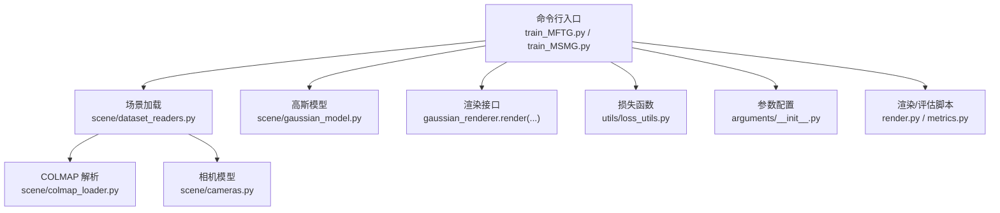
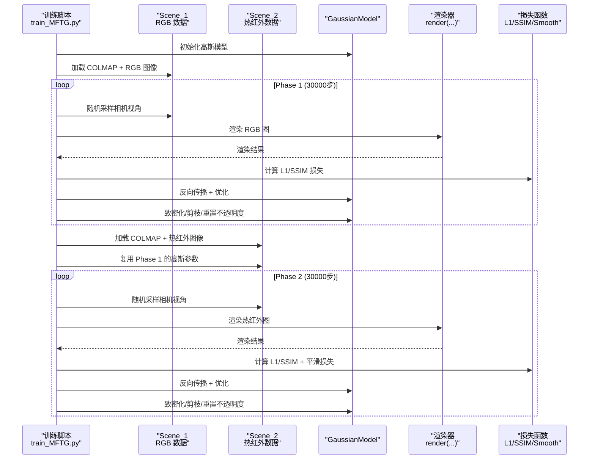
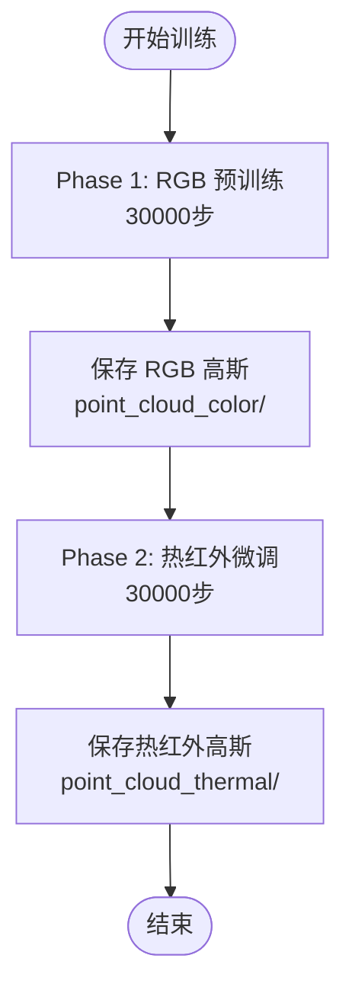
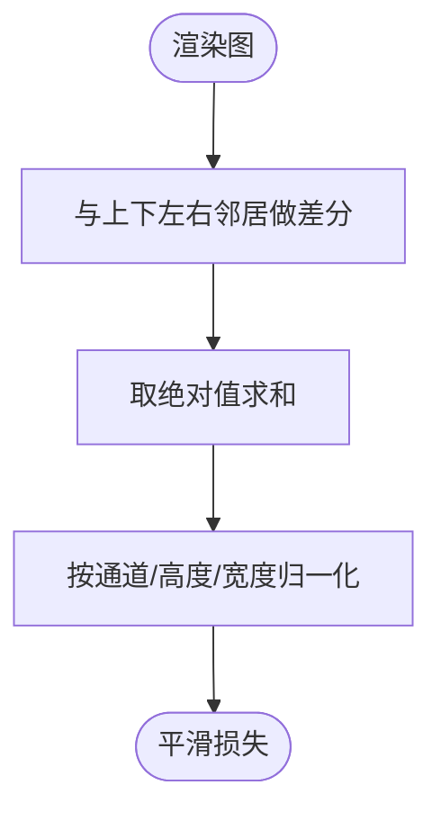
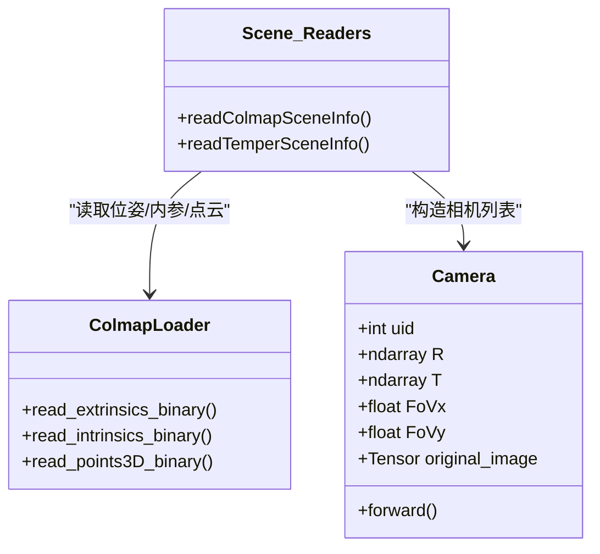
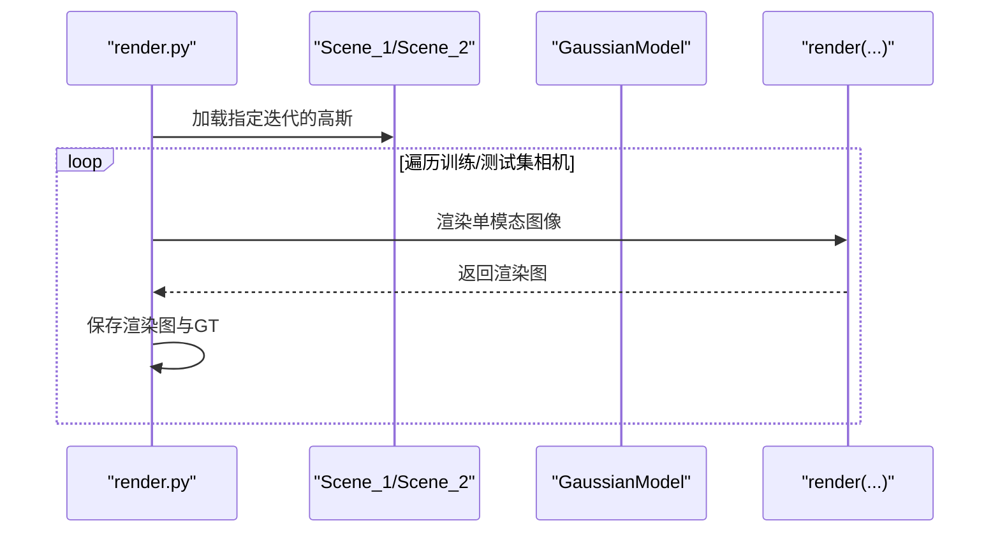
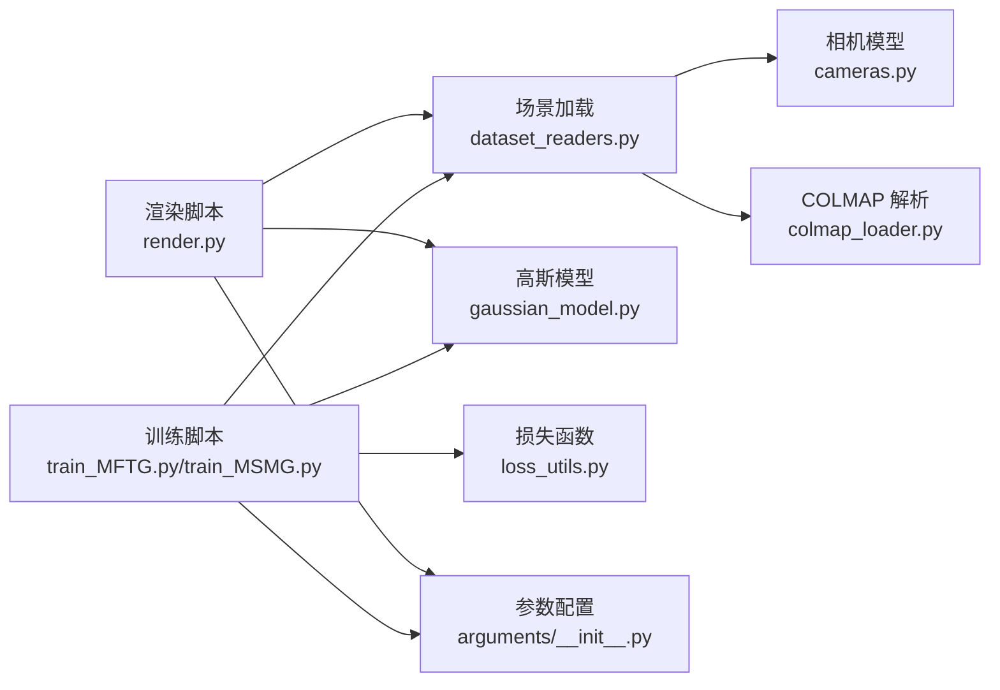

# 系统架构

<cite>
**本文引用的文件**   
- [README.md](file://README.md)
- [MFTG-Technical-Doc.md](file://MFTG-Technical-Doc.md)
- [train_MFTG.py](file://train_MFTG.py)
- [train_MSMG.py](file://train_MSMG.py)
- [render.py](file://render.py)
- [scene/gaussian_model.py](file://scene/gaussian_model.py)
- [scene/cameras.py](file://scene/cameras.py)
- [scene/dataset_readers.py](file://scene/dataset_readers.py)
- [scene/colmap_loader.py](file://scene/colmap_loader.py)
- [utils/loss_utils.py](file://utils/loss_utils.py)
- [arguments/__init__.py](file://arguments/__init__.py)
</cite>

## 目录
1. [引言](#引言)
2. [项目结构](#项目结构)
3. [核心组件](#核心组件)
4. [架构总览](#架构总览)
5. [详细组件分析](#详细组件分析)
6. [依赖分析](#依赖分析)
7. [性能考虑](#性能考虑)
8. [故障排查指南](#故障排查指南)
9. [结论](#结论)
10. [附录](#附录)

## 引言
本文件面向 Thermal-Gaussian 项目，系统性阐述基于 3D 高斯点阵的神经渲染架构与实现。重点覆盖：
- 两阶段训练策略（RGB 预训练 + 热红外微调）的设计理念与技术实现
- 双模态正则化约束机制（L1/SSIM 损失 + 热红外平滑先验）
- 热红外物理特性建模（温度场平滑先验）
- 存储成本优化策略（共享几何、参数复用）
- 核心组件关系、数据流向与模块交互模式

## 项目结构
项目采用“功能分层 + 模块化”的组织方式，核心目录与职责如下：
- arguments：命令行参数与超参数封装
- scene：场景加载、相机模型、COLMAP 数据解析与点云读取
- gaussian_renderer：渲染管线（单模态光栅化）
- utils：损失函数、图像工具、系统工具等
- submodules：CUDA 光栅化与 KNN 实现（第三方子模块）
- 训练脚本：train_MFTG.py（主分支两阶段）、train_MSMG.py（多高斯并行）

**图表来源**
- [train_MFTG.py:35-273](file://train_MFTG.py#L35-L273)
- [train_MSMG.py:33-314](file://train_MSMG.py#L33-L314)
- [scene/dataset_readers.py:136-230](file://scene/dataset_readers.py#L136-L230)
- [scene/colmap_loader.py:12-295](file://scene/colmap_loader.py#L12-L295)
- [scene/cameras.py:17-72](file://scene/cameras.py#L17-L72)
- [scene/gaussian_model.py:24-407](file://scene/gaussian_model.py#L24-L407)
- [utils/loss_utils.py:20-114](file://utils/loss_utils.py#L20-L114)
- [arguments/__init__.py:47-113](file://arguments/__init__.py#L47-L113)
- [render.py:25-76](file://render.py#L25-L76)

**章节来源**
- [README.md:13-167](file://README.md#L13-L167)
- [MFTG-Technical-Doc.md:3-618](file://MFTG-Technical-Doc.md#L3-L618)

## 核心组件
- 高斯模型 GaussianModel：3DGS 的核心表示，包含位置、尺度、旋转、不透明度与球谐颜色特征；支持自适应致密化/剪枝与优化器管理
- 场景 Scene_1/Scene_2：分别加载 RGB 与热红外数据，统一使用 COLMAP 位姿，热红外阶段复用 RGB 阶段的几何
- 相机 Camera：封装位姿、视图/投影矩阵与原始图像
- 渲染器 render：单模态光栅化，输出 RGB 或热红外渲染图
- 损失函数：L1、SSIM、热红外平滑损失 smoothness_loss
- 参数配置：ModelParams/OptimizationParams/PipelineParams

**章节来源**
- [scene/gaussian_model.py:24-407](file://scene/gaussian_model.py#L24-L407)
- [scene/dataset_readers.py:136-230](file://scene/dataset_readers.py#L136-L230)
- [scene/cameras.py:17-72](file://scene/cameras.py#L17-L72)
- [utils/loss_utils.py:20-114](file://utils/loss_utils.py#L20-L114)
- [arguments/__init__.py:47-113](file://arguments/__init__.py#L47-L113)

## 架构总览
两阶段训练策略的核心思想是“先学几何与外观，再学模态特化”。Phase 1 用 RGB 图像训练高斯，得到稳定的几何与颜色表示；Phase 2 复用几何，仅微调颜色以适配热红外。

**图表来源**
- [train_MFTG.py:35-163](file://train_MFTG.py#L35-L163)
- [MFTG-Technical-Doc.md:113-153](file://MFTG-Technical-Doc.md#L113-L153)

## 详细组件分析

### 组件A：两阶段训练流水线（MFTG）
- Phase 1（RGB 预训练）：使用 Scene_1 读取 COLMAP 位姿与 RGB 图像，训练高斯以最小化 L1/SSIM 损失，迭代 30000 步后保存
- Phase 2（热红外微调）：使用 Scene_2 读取热红外图像，复用 Phase 1 的高斯参数，新增热红外平滑损失，迭代 30000 步后保存
- 关键差异：热红外阶段引入平滑先验，优化器状态重置以消除 RGB 阶段动量干扰

**图表来源**
- [train_MFTG.py:267-273](file://train_MFTG.py#L267-L273)
- [MFTG-Technical-Doc.md:113-153](file://MFTG-Technical-Doc.md#L113-L153)

**章节来源**
- [train_MFTG.py:35-163](file://train_MFTG.py#L35-L163)
- [MFTG-Technical-Doc.md:113-153](file://MFTG-Technical-Doc.md#L113-L153)

### 组件B：双模态正则化与热红外物理建模
- 损失函数组合：L1 损失 + SSIM 权重项，在 Phase 2 增加热红外平滑损失，鼓励温度场的空间连续性
- 平滑损失 smoothness_loss：基于 4 邻域差分的 L1 正则，抑制渲染图中剧烈跳变

**图表来源**
- [utils/loss_utils.py:98-114](file://utils/loss_utils.py#L98-L114)

**章节来源**
- [utils/loss_utils.py:20-114](file://utils/loss_utils.py#L20-L114)
- [MFTG-Technical-Doc.md:166-179](file://MFTG-Technical-Doc.md#L166-L179)

### 组件C：数据加载与相机模型
- Scene_1/Scene_2：通过回调函数 sceneLoadTypeCallbacks["Colmap"/"Temper"] 读取 COLMAP 位姿与图像，构建 Camera 列表
- Camera：封装位姿、视图/投影矩阵与原始图像张量，供渲染器使用

**图表来源**
- [scene/cameras.py:17-72](file://scene/cameras.py#L17-L72)
- [scene/dataset_readers.py:136-230](file://scene/dataset_readers.py#L136-L230)
- [scene/colmap_loader.py:12-295](file://scene/colmap_loader.py#L12-L295)

**章节来源**
- [scene/dataset_readers.py:136-230](file://scene/dataset_readers.py#L136-L230)
- [scene/colmap_loader.py:12-295](file://scene/colmap_loader.py#L12-L295)
- [scene/cameras.py:17-72](file://scene/cameras.py#L17-L72)

### 组件D：渲染与评估
- 渲染：分别加载 RGB 与热红外高斯，对训练/测试集相机逐一渲染，保存渲染图与 GT
- 评估：metrics.py 计算 PSNR/SSIM/LPIPS 等指标，并输出到 results.json

**图表来源**
- [render.py:25-76](file://render.py#L25-L76)

**章节来源**
- [render.py:25-76](file://render.py#L25-L76)

### 组件E：参数与超参数
- ModelParams：球谐阶数、输入/输出路径、分辨率、是否白背景等
- OptimizationParams：学习率、密度控制、SSIM 权重、迭代次数等
- PipelineParams：渲染管线开关（如 Python/ CUDA 实现切换）

**章节来源**
- [arguments/__init__.py:47-113](file://arguments/__init__.py#L47-L113)

## 依赖分析
- 训练脚本依赖场景加载与相机模型，共同驱动高斯模型优化
- 渲染脚本依赖两套独立的 Scene（RGB/热红外），分别加载对应高斯进行渲染
- 损失模块独立于渲染器，提供通用损失计算接口
- 参数模块贯穿训练/渲染/评估全流程

**图表来源**
- [train_MFTG.py:12-26](file://train_MFTG.py#L12-L26)
- [train_MSMG.py:12-26](file://train_MSMG.py#L12-L26)
- [render.py:12-23](file://render.py#L12-L23)
- [scene/dataset_readers.py:12-311](file://scene/dataset_readers.py#L12-L311)
- [scene/cameras.py:12-72](file://scene/cameras.py#L12-L72)
- [scene/colmap_loader.py:12-295](file://scene/colmap_loader.py#L12-L295)
- [utils/loss_utils.py:12-114](file://utils/loss_utils.py#L12-L114)
- [arguments/__init__.py:12-113](file://arguments/__init__.py#L12-L113)

**章节来源**
- [train_MFTG.py:12-26](file://train_MFTG.py#L12-L26)
- [train_MSMG.py:12-26](file://train_MSMG.py#L12-L26)
- [render.py:12-23](file://render.py#L12-L23)

## 性能考虑
- 显存占用：MFTG 两阶段训练显存适中，OMMG（单套双通道）最低，MSMG（两套独立）最高
- 训练效率：单模态光栅化器每次输出一种模态，MFTG 通过两次独立渲染实现双模态输出
- 密致化/剪枝：在限定迭代范围内动态调整高斯密度，平衡精度与效率
- 分辨率与 SH 阶数：可通过参数调节以适配不同硬件资源

**章节来源**
- [MFTG-Technical-Doc.md:26-36](file://MFTG-Technical-Doc.md#L26-L36)
- [MFTG-Technical-Doc.md:509-512](file://MFTG-Technical-Doc.md#L509-L512)

## 故障排查指南
- Phase 2 破坏 RGB 渲染质量：由于共享 SH 系数，热红外微调会改变颜色表示，导致 RGB 质量下降，需使用 OMMG 分支以获得双通道
- 优化器状态干扰：Phase 2 需要重新初始化优化器以重置动量，避免前阶段影响
- 显存不足：降低分辨率、减少 SH 阶数或切换到 OMMG 分支
- 数据配对错误：确保 rgb/train 与 thermal/train 同名图像一一对应，且共享 COLMAP 位姿

**章节来源**
- [MFTG-Technical-Doc.md:579-618](file://MFTG-Technical-Doc.md#L579-L618)

## 结论
Thermal-Gaussian 在 3DGS 基础上，通过两阶段训练与热红外平滑先验，实现了 RGB 与热红外双模态高质量渲染。其关键设计在于：
- 共享几何、参数复用，显著降低存储与显存开销
- 两阶段策略在保证 RGB 质量的同时，使热红外渲染具备物理一致性
- 独立的损失模块与清晰的数据加载流程，便于扩展与维护

## 附录
- 输出文件结构：包含高斯点云、渲染结果、评估指标与相机参数等
- 常用命令：训练、渲染、评估与 TensorBoard 可视化

**章节来源**
- [MFTG-Technical-Doc.md:454-490](file://MFTG-Technical-Doc.md#L454-L490)
- [README.md:62-117](file://README.md#L62-L117)