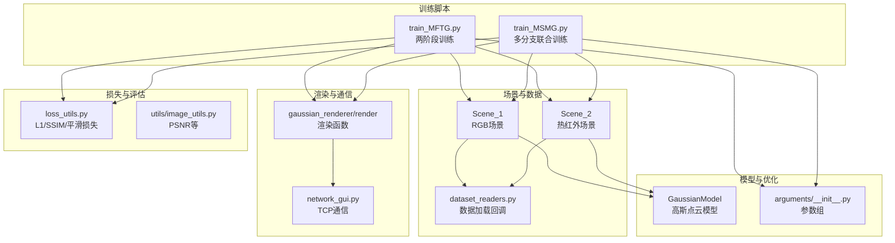
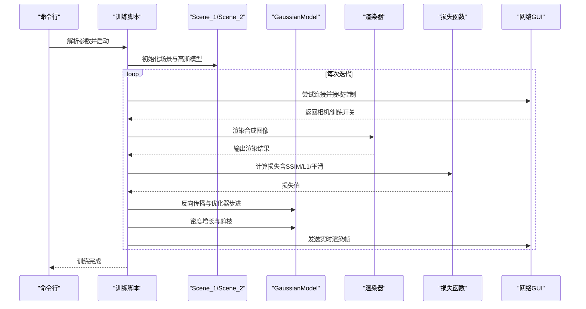
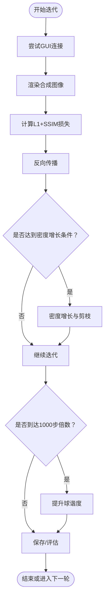
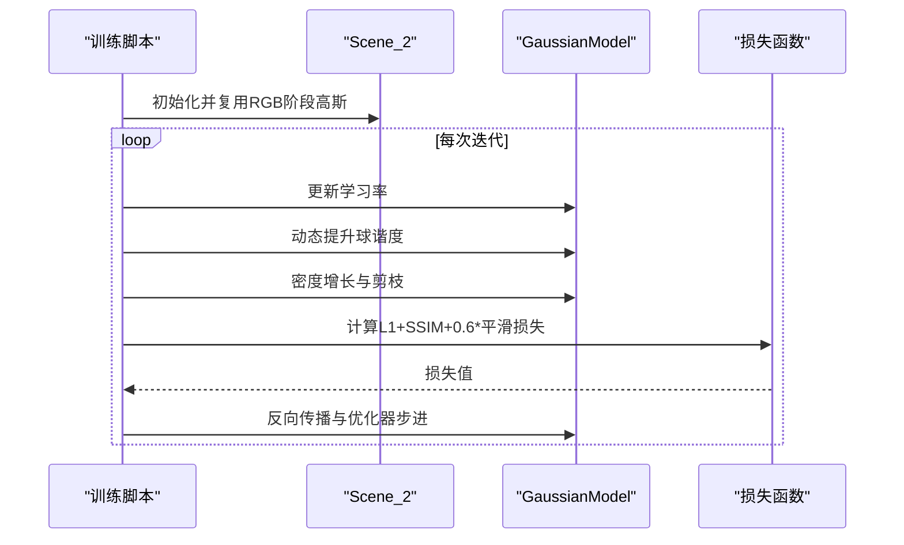
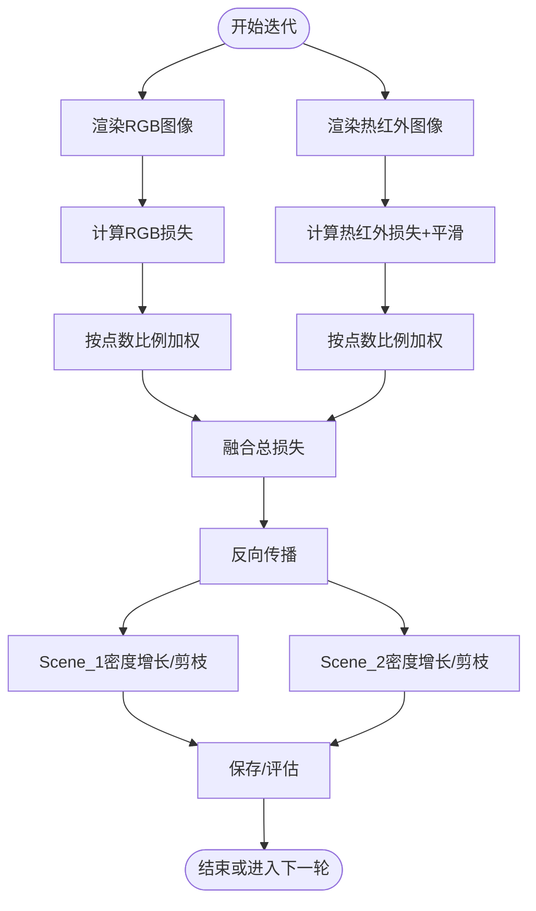
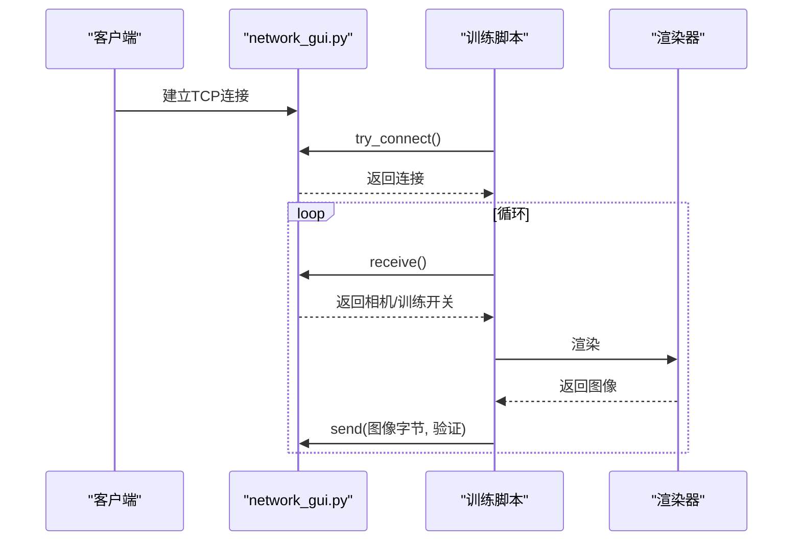
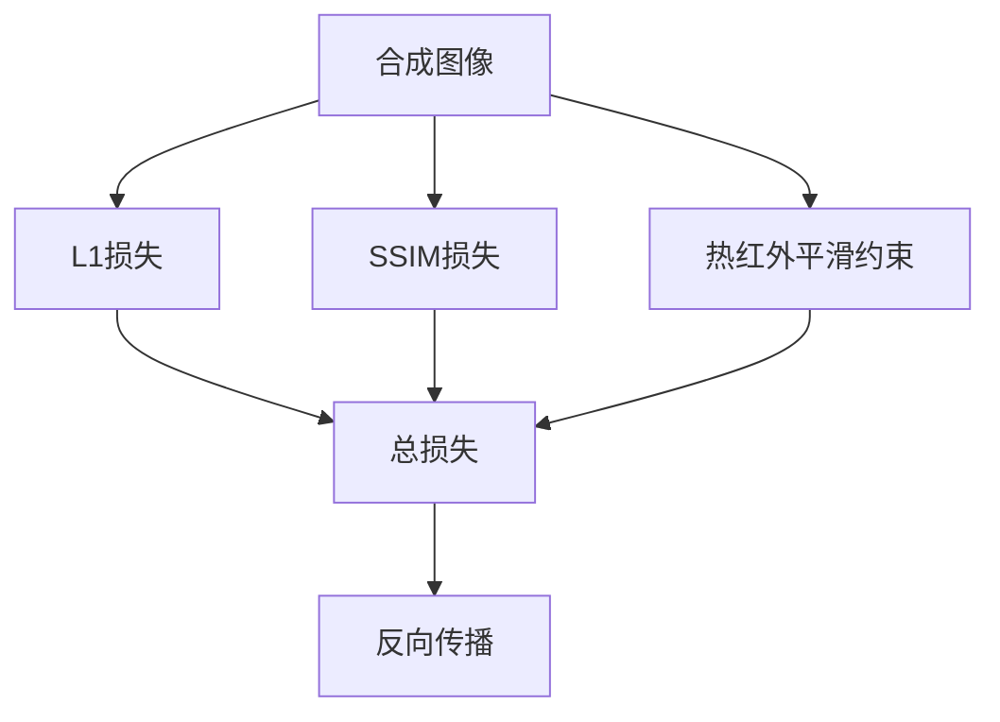
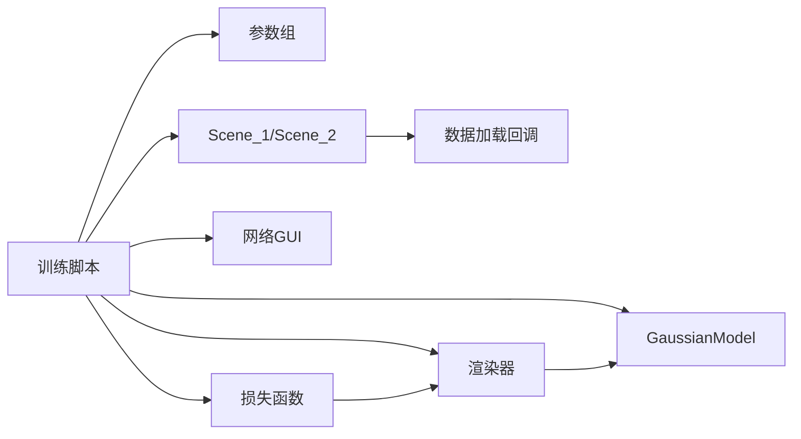

# 训练算法设计

<cite>
**本文引用的文件**
- [train_MFTG.py](file://train_MFTG.py)
- [train_MSMG.py](file://train_MSMG.py)
- [scene/__init__.py](file://scene/__init__.py)
- [scene/gaussian_model.py](file://scene/gaussian_model.py)
- [gaussian_renderer/network_gui.py](file://gaussian_renderer/network_gui.py)
- [utils/loss_utils.py](file://utils/loss_utils.py)
- [arguments/__init__.py](file://arguments/__init__.py)
- [scene/dataset_readers.py](file://scene/dataset_readers.py)
</cite>

## 目录
1. [引言](#引言)
2. [项目结构](#项目结构)
3. [核心组件](#核心组件)
4. [架构总览](#架构总览)
5. [详细组件分析](#详细组件分析)
6. [依赖关系分析](#依赖关系分析)
7. [性能考量](#性能考量)
8. [故障排查指南](#故障排查指南)
9. [结论](#结论)
10. [附录：训练参数配置与优化建议](#附录训练参数配置与优化建议)

## 引言
本文件面向 Thermal-Gaussian 项目的两阶段训练算法，系统性阐述：
- RGB 预训练阶段的目标函数设计、几何参数固定策略与收敛机制
- 热红外微调阶段的损失函数组合（L1 损失、SSIM 损失、热红外平滑约束）及其权重分配
- 训练过程中的动态球谐度提升、密度增长与剪枝策略
- 网络 GUI 通信机制、实时渲染反馈与训练状态监控
- 训练参数配置指南与性能优化建议

## 项目结构
项目采用模块化组织，围绕“场景-模型-渲染器-损失-参数”五大维度展开：
- 训练脚本：两阶段训练分别由独立脚本驱动
- 场景抽象：Scene_1（RGB）与 Scene_2（热红外），共享位姿但分别加载不同模态图像
- 高斯点云模型：统一的高斯表示与优化接口
- 渲染与通信：渲染器与网络 GUI 的 TCP 通信协议
- 损失与评估：L1、SSIM、热红外平滑约束与多指标评估

图表来源
- [train_MFTG.py:35-273](file://train_MFTG.py#L35-L273)
- [train_MSMG.py:33-314](file://train_MSMG.py#L33-L314)
- [scene/__init__.py:21-168](file://scene/__init__.py#L21-L168)
- [scene/dataset_readers.py:184-230](file://scene/dataset_readers.py#L184-L230)
- [scene/gaussian_model.py:24-407](file://scene/gaussian_model.py#L24-L407)
- [gaussian_renderer/network_gui.py:18-86](file://gaussian_renderer/network_gui.py#L18-L86)
- [utils/loss_utils.py:20-114](file://utils/loss_utils.py#L20-L114)
- [arguments/__init__.py:47-90](file://arguments/__init__.py#L47-L90)

章节来源
- [train_MFTG.py:35-273](file://train_MFTG.py#L35-L273)
- [train_MSMG.py:33-314](file://train_MSMG.py#L33-L314)
- [scene/__init__.py:21-168](file://scene/__init__.py#L21-L168)
- [scene/dataset_readers.py:184-230](file://scene/dataset_readers.py#L184-L230)
- [scene/gaussian_model.py:24-407](file://scene/gaussian_model.py#L24-L407)
- [gaussian_renderer/network_gui.py:18-86](file://gaussian_renderer/network_gui.py#L18-L86)
- [utils/loss_utils.py:20-114](file://utils/loss_utils.py#L20-L114)
- [arguments/__init__.py:47-90](file://arguments/__init__.py#L47-L90)

## 核心组件
- 两阶段训练流程（MFTG）
  - 阶段一：RGB 预训练（Scene_1），目标函数包含 L1 与 SSIM；动态提升球谐度至最大值；密度增长与剪枝；热红外平滑约束在阶段二启用
  - 阶段二：热红外微调（Scene_2），在阶段一基础上复用高斯点云，目标函数增加热红外平滑约束权重
- 多分支联合训练（MSMG）
  - 同时维护两套高斯模型，分别对应 RGB 与热红外，按点数比例加权融合总损失
- 高斯模型（GaussianModel）
  - 提供学习率调度、球谐度动态提升、密度增长与剪枝、优化器管理与参数替换/裁剪/拼接等核心能力
- 网络 GUI 通信
  - 基于 TCP 的轻量通信，支持远程渲染与训练控制，客户端可发送相机参数并接收实时渲染结果
- 损失函数
  - L1 损失、SSIM 损失、热红外平滑约束（基于像素邻域差分）

章节来源
- [train_MFTG.py:35-163](file://train_MFTG.py#L35-L163)
- [train_MSMG.py:33-179](file://train_MSMG.py#L33-L179)
- [scene/gaussian_model.py:120-407](file://scene/gaussian_model.py#L120-L407)
- [gaussian_renderer/network_gui.py:26-86](file://gaussian_renderer/network_gui.py#L26-L86)
- [utils/loss_utils.py:20-114](file://utils/loss_utils.py#L20-L114)

## 架构总览
两阶段训练通过统一的训练循环与场景抽象实现解耦：
- 参数组（ModelParams/PipelineParams/OptimizationParams）集中管理训练超参
- 场景类根据数据类型选择不同的数据加载回调，确保 RGB 与热红外使用同一套位姿
- 训练循环中，渲染器输出合成图像，损失函数计算后反向传播，随后执行密度增长与剪枝

图表来源
- [train_MFTG.py:68-163](file://train_MFTG.py#L68-L163)
- [gaussian_renderer/network_gui.py:34-86](file://gaussian_renderer/network_gui.py#L34-L86)
- [utils/loss_utils.py:20-114](file://utils/loss_utils.py#L20-L114)
- [scene/gaussian_model.py:149-407](file://scene/gaussian_model.py#L149-L407)

## 详细组件分析

### RGB 预训练阶段（Scene_1）
- 目标函数设计
  - 使用 L1 与 SSIM 的加权组合，lambda_dssim 作为 SSIM 权重
  - 动态提升球谐度（每 1000 迭代一次），逐步提高颜色表示能力
- 几何参数固定策略
  - 通过优化器参数组设置不同学习率，位置学习率随步数指数衰减，其余参数按固定速率更新
- 收敛机制
  - 通过 EMA 平滑记录损失，定期评估测试集指标（L1/PSNR/SSIM/LPIPS），结合 TensorBoard 记录
  - 在指定迭代处保存检查点与中间模型

图表来源
- [train_MFTG.py:88-154](file://train_MFTG.py#L88-L154)
- [scene/gaussian_model.py:120-176](file://scene/gaussian_model.py#L120-L176)
- [scene/gaussian_model.py:389-401](file://scene/gaussian_model.py#L389-L401)

章节来源
- [train_MFTG.py:35-163](file://train_MFTG.py#L35-L163)
- [scene/gaussian_model.py:120-176](file://scene/gaussian_model.py#L120-L176)
- [scene/gaussian_model.py:389-401](file://scene/gaussian_model.py#L389-L401)

### 热红外微调阶段（Scene_2）
- 损失函数组合
  - 在 RGB 预训练基础上，增加热红外平滑约束项，权重为 0.6
  - 保持 L1 与 SSIM 的加权组合，lambda_dssim 来自优化参数
- 动态球谐度提升
  - 与 RGB 阶段一致，每 1000 步提升一次
- 密度增长与剪枝
  - 基于梯度累积与可见性过滤，按阈值进行克隆、分裂与剪枝，同时重置不透明度

图表来源
- [train_MFTG.py:110-114](file://train_MFTG.py#L110-L114)
- [train_MFTG.py:142-158](file://train_MFTG.py#L142-L158)
- [scene/gaussian_model.py:120-176](file://scene/gaussian_model.py#L120-L176)

章节来源
- [train_MFTG.py:110-114](file://train_MFTG.py#L110-L114)
- [train_MFTG.py:142-158](file://train_MFTG.py#L142-L158)
- [scene/gaussian_model.py:120-176](file://scene/gaussian_model.py#L120-L176)

### 多分支联合训练（MSMG）
- 双模型并行
  - Scene_1 与 Scene_2 分别维护独立的高斯模型，共享位姿
- 损失融合
  - 分别计算 RGB 与热红外损失，按当前两模型点数比例加权融合总损失
  - 热红外损失包含平滑约束项，权重为 0.6
- 优化与评估
  - 双模型分别执行密度增长与剪枝，并保存各自点云

图表来源
- [train_MSMG.py:113-130](file://train_MSMG.py#L113-L130)
- [train_MSMG.py:151-173](file://train_MSMG.py#L151-L173)
- [scene/gaussian_model.py:389-401](file://scene/gaussian_model.py#L389-L401)

章节来源
- [train_MSMG.py:113-130](file://train_MSMG.py#L113-L130)
- [train_MSMG.py:151-173](file://train_MSMG.py#L151-L173)
- [scene/gaussian_model.py:389-401](file://scene/gaussian_model.py#L389-L401)

### 网络 GUI 通信机制
- 服务器端
  - 初始化监听端口，接受客户端连接，解析相机参数，构造 MiniCam
- 客户端交互
  - 发送渲染请求，接收字节流图像与验证字符串
- 实时渲染反馈
  - 在训练循环中，若 GUI 连接可用，持续发送当前视角渲染帧，便于远程监控

图表来源
- [gaussian_renderer/network_gui.py:26-86](file://gaussian_renderer/network_gui.py#L26-L86)
- [train_MFTG.py:69-83](file://train_MFTG.py#L69-L83)
- [train_MSMG.py:62-79](file://train_MSMG.py#L62-L79)

章节来源
- [gaussian_renderer/network_gui.py:26-86](file://gaussian_renderer/network_gui.py#L26-L86)
- [train_MFTG.py:69-83](file://train_MFTG.py#L69-L83)
- [train_MSMG.py:62-79](file://train_MSMG.py#L62-L79)

### 损失函数与评估指标
- L1 损失：像素级绝对误差
- SSIM 损失：结构相似性感知的补损失
- 热红外平滑约束：基于 4 邻域的像素差分绝对值之和，抑制噪声与伪影
- 评估指标：L1、PSNR、SSIM、LPIPS，定期在测试集上计算并记录

图表来源
- [utils/loss_utils.py:20-114](file://utils/loss_utils.py#L20-L114)
- [train_MFTG.py:108-114](file://train_MFTG.py#L108-L114)
- [train_MSMG.py:116-123](file://train_MSMG.py#L116-L123)

章节来源
- [utils/loss_utils.py:20-114](file://utils/loss_utils.py#L20-L114)
- [train_MFTG.py:108-114](file://train_MFTG.py#L108-L114)
- [train_MSMG.py:116-123](file://train_MSMG.py#L116-L123)

## 依赖关系分析
- 训练脚本依赖场景抽象与高斯模型，通过参数组统一配置
- 场景类依赖数据加载回调，区分 RGB 与热红外数据路径
- 渲染器依赖高斯模型参数与管线参数，输出渲染结果
- GUI 通信独立于训练逻辑，仅提供远程渲染与控制

图表来源
- [train_MFTG.py:35-273](file://train_MFTG.py#L35-L273)
- [train_MSMG.py:33-314](file://train_MSMG.py#L33-L314)
- [scene/__init__.py:21-168](file://scene/__init__.py#L21-L168)
- [scene/dataset_readers.py:307-311](file://scene/dataset_readers.py#L307-L311)
- [scene/gaussian_model.py:24-407](file://scene/gaussian_model.py#L24-L407)
- [gaussian_renderer/network_gui.py:18-86](file://gaussian_renderer/network_gui.py#L18-L86)
- [utils/loss_utils.py:20-114](file://utils/loss_utils.py#L20-L114)

章节来源
- [train_MFTG.py:35-273](file://train_MFTG.py#L35-L273)
- [train_MSMG.py:33-314](file://train_MSMG.py#L33-L314)
- [scene/__init__.py:21-168](file://scene/__init__.py#L21-L168)
- [scene/dataset_readers.py:307-311](file://scene/dataset_readers.py#L307-L311)
- [scene/gaussian_model.py:24-407](file://scene/gaussian_model.py#L24-L407)
- [gaussian_renderer/network_gui.py:18-86](file://gaussian_renderer/network_gui.py#L18-L86)
- [utils/loss_utils.py:20-114](file://utils/loss_utils.py#L20-L114)

## 性能考量
- 学习率调度：位置参数采用指数衰减，避免后期震荡；其他参数按固定速率更新，保证稳定性
- 动态球谐度：每 1000 步提升一次，平衡细节与计算开销
- 密度增长与剪枝：基于梯度与屏幕半径阈值，防止冗余点云导致显存与速度下降
- 评估与日志：定期评估测试集并记录 TensorBoard 指标，便于快速定位收敛问题
- GUI 实时反馈：在训练过程中持续发送渲染帧，降低远程调试成本

## 故障排查指南
- GUI 连接失败
  - 检查 IP/端口配置与防火墙设置
  - 确认客户端与服务端版本兼容
- 训练不收敛或发散
  - 调整 lambda_dssim 与学习率参数
  - 检查密度增长阈值与剪枝窗口，避免过度稀疏或过密
- 显存不足
  - 适当降低分辨率缩放或减少迭代次数
  - 调整密度增长间隔与阈值
- 热红外伪影
  - 增大平滑约束权重或调整窗口大小
  - 检查输入图像质量与归一化

章节来源
- [gaussian_renderer/network_gui.py:26-86](file://gaussian_renderer/network_gui.py#L26-L86)
- [train_MFTG.py:142-158](file://train_MFTG.py#L142-L158)
- [train_MSMG.py:151-173](file://train_MSMG.py#L151-L173)
- [utils/loss_utils.py:98-114](file://utils/loss_utils.py#L98-L114)

## 结论
Thermal-Gaussian 的两阶段训练通过 RGB 预训练与热红外微调的协同，实现了跨模态的高效建模。动态球谐度提升、密度增长与剪枝策略有效提升了点云质量与收敛稳定性；网络 GUI 提供了便捷的远程可视化与控制手段。多分支联合训练进一步探索了双模态一致性优化的可能性。建议在实际部署中结合数据特性与硬件资源，精细化调优损失权重与密度控制参数。

## 附录：训练参数配置与优化建议
- 关键参数说明
  - iterations：总迭代步数
  - position_lr_init/final/max_steps：位置学习率初始值、最终值与最大步数
  - feature_lr/opacity_lr/scaling_lr/rotation_lr：特征、不透明度、缩放、旋转的学习率
  - percent_dense/densify_from_iter/densify_until_iter/densify_interval/densify_grad_threshold：密度增长相关
  - opacity_reset_interval：不透明度重置周期
  - lambda_dssim：SSIM 损失权重
  - random_background：随机背景开关
- 优化建议
  - 初期：增大 lambda_dssim 以强化结构一致性；缩短密度增长间隔，快速建立几何骨架
  - 中期：逐步降低 lambda_dssim，引入热红外平滑约束，稳定纹理细节
  - 末期：适度降低学习率，延长不透明度重置周期，提升收敛稳定性
  - 硬件受限：优先降低分辨率缩放与密度增长阈值，再考虑减少迭代步数

章节来源
- [arguments/__init__.py:71-90](file://arguments/__init__.py#L71-L90)
- [train_MFTG.py:35-273](file://train_MFTG.py#L35-L273)
- [train_MSMG.py:33-314](file://train_MSMG.py#L33-L314)