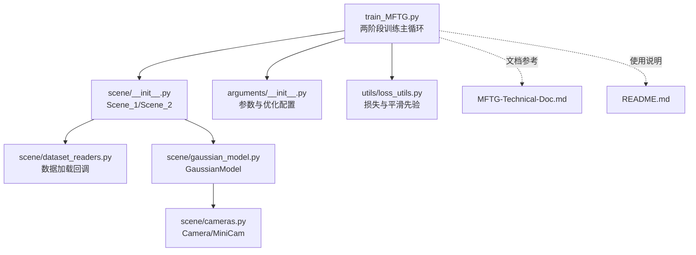
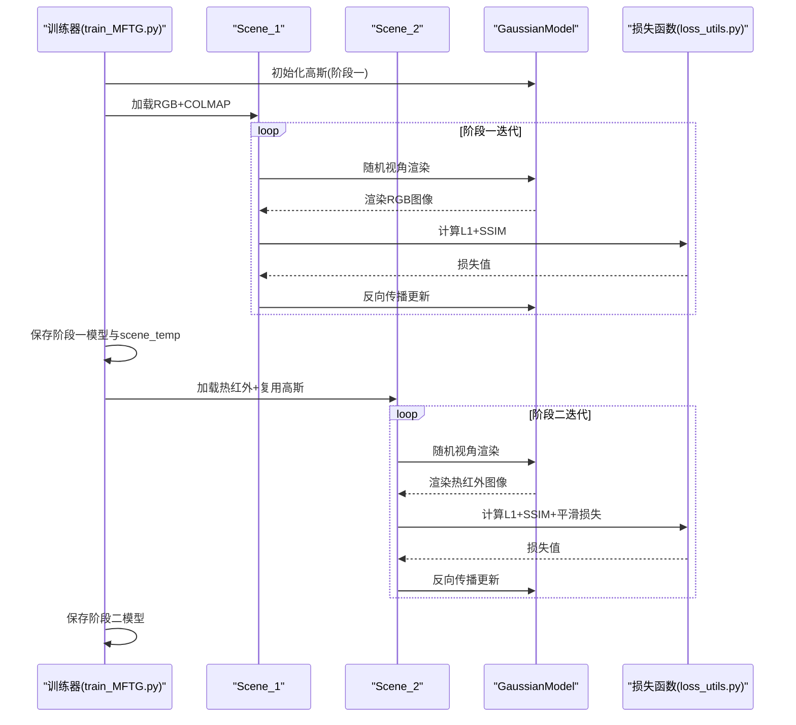
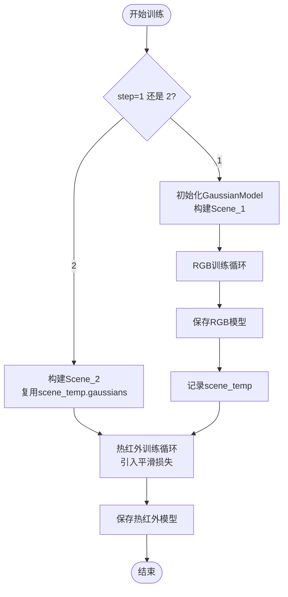
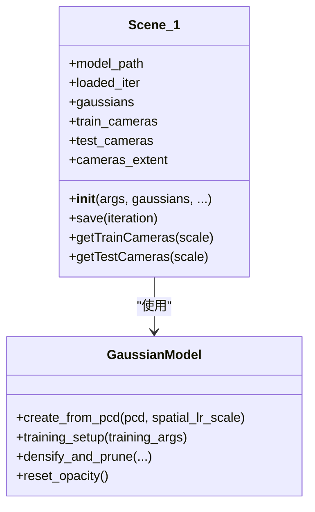
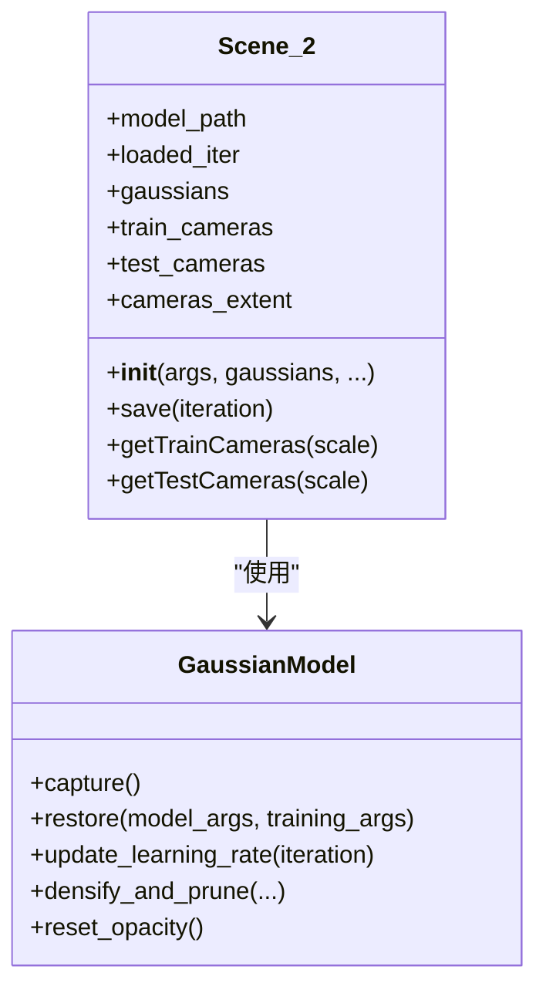
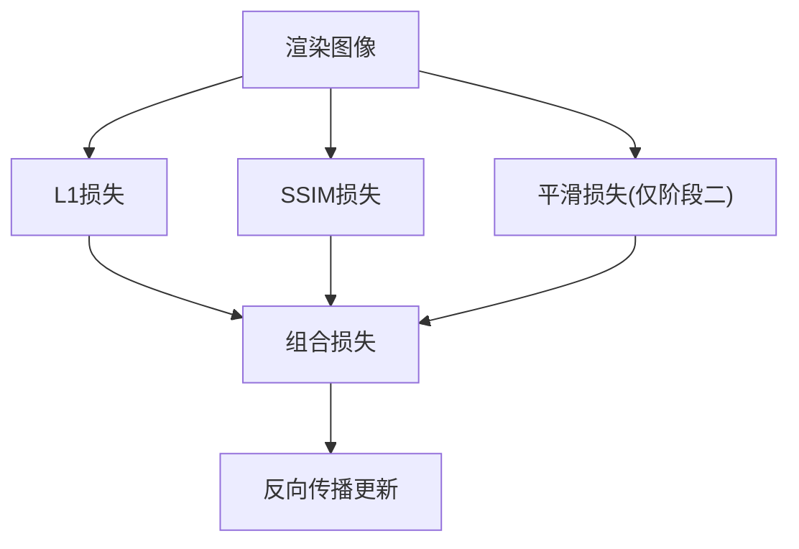
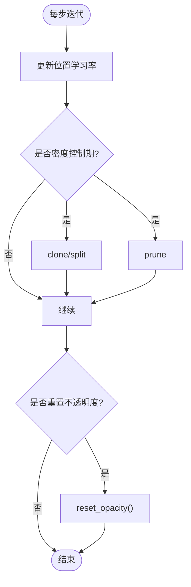
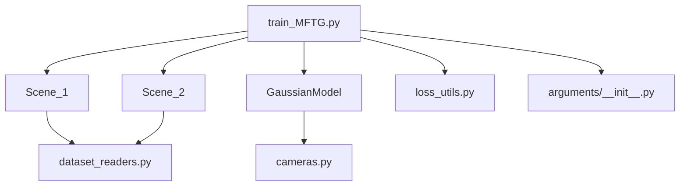

# 两阶段训练策略

<cite>
**本文引用的文件列表**
- [train_MFTG.py](file://train_MFTG.py)
- [scene/__init__.py](file://scene/__init__.py)
- [scene/dataset_readers.py](file://scene/dataset_readers.py)
- [scene/gaussian_model.py](file://scene/gaussian_model.py)
- [scene/cameras.py](file://scene/cameras.py)
- [arguments/__init__.py](file://arguments/__init__.py)
- [utils/loss_utils.py](file://utils/loss_utils.py)
- [MFTG-Technical-Doc.md](file://MFTG-Technical-Doc.md)
- [README.md](file://README.md)
</cite>

## 目录
1. [引言](#引言)
2. [项目结构](#项目结构)
3. [核心组件](#核心组件)
4. [架构概览](#架构概览)
5. [详细组件分析](#详细组件分析)
6. [依赖关系分析](#依赖关系分析)
7. [性能考量](#性能考量)
8. [故障排查指南](#故障排查指南)
9. [结论](#结论)
10. [附录](#附录)

## 引言
本文件系统性阐述 Thermal-Gaussian 的两阶段训练策略（MFTG）。两阶段训练的核心思想是：
- 阶段一（step=1）：仅使用 RGB 图像训练一套 3D 高斯，使高斯掌握场景几何与 RGB 外观；
- 阶段二（step=2）：复用阶段一训练好的高斯（几何、不透明度等已固定），仅微调 SH 颜色系数以适配热红外图像。

该策略通过 step 参数控制训练流程，利用热红外图像的温度平滑先验，在阶段二引入平滑损失，提升热红外渲染质量；同时保持 RGB 渲染能力的稳定性。本文将从系统架构、数据流、处理逻辑、集成点、错误处理与性能特性等方面进行深入解析，并给出优势分析、适用场景与最佳实践建议。

## 项目结构
仓库采用“功能分层 + 模块化”的组织方式：
- 训练入口与主循环：train_MFTG.py
- 场景与数据加载：scene/__init__.py（Scene_1/Scene_2）、scene/dataset_readers.py
- 3D 高斯模型：scene/gaussian_model.py
- 相机与渲染接口：scene/cameras.py
- 参数与优化配置：arguments/__init__.py
- 损失函数与平滑先验：utils/loss_utils.py
- 技术文档与使用说明：MFTG-Technical-Doc.md、README.md

图表来源
- [train_MFTG.py:35-273](file://train_MFTG.py#L35-L273)
- [scene/__init__.py:21-168](file://scene/__init__.py#L21-L168)
- [scene/dataset_readers.py:184-230](file://scene/dataset_readers.py#L184-L230)
- [scene/gaussian_model.py:24-407](file://scene/gaussian_model.py#L24-L407)
- [scene/cameras.py:17-72](file://scene/cameras.py#L17-L72)
- [arguments/__init__.py:47-113](file://arguments/__init__.py#L47-L113)
- [utils/loss_utils.py:20-114](file://utils/loss_utils.py#L20-L114)

章节来源
- [train_MFTG.py:35-273](file://train_MFTG.py#L35-L273)
- [scene/__init__.py:21-168](file://scene/__init__.py#L21-L168)
- [scene/dataset_readers.py:184-230](file://scene/dataset_readers.py#L184-L230)
- [scene/gaussian_model.py:24-407](file://scene/gaussian_model.py#L24-L407)
- [scene/cameras.py:17-72](file://scene/cameras.py#L17-L72)
- [arguments/__init__.py:47-113](file://arguments/__init__.py#L47-L113)
- [utils/loss_utils.py:20-114](file://utils/loss_utils.py#L20-L114)
- [MFTG-Technical-Doc.md:1-618](file://MFTG-Technical-Doc.md#L1-L618)
- [README.md:1-167](file://README.md#L1-L167)

## 核心组件
- 两阶段训练主循环：根据 step 参数选择 Scene_1 或 Scene_2，控制训练流程与损失函数差异。
- Scene_1/Scene_2：分别加载 RGB 与热红外数据，共享 COLMAP 位姿与点云，实现几何参数固定与颜色信息迁移。
- GaussianModel：3D 高斯表示，包含位置、尺度、旋转、不透明度与 SH 颜色系数，支持密度控制与优化器管理。
- 损失函数：L1、SSIM 与热红外平滑损失，阶段二引入平滑先验以约束温度场连续性。
- 参数与优化：学习率调度、密度控制、不透明度重置与优化器参数组。

章节来源
- [train_MFTG.py:35-163](file://train_MFTG.py#L35-L163)
- [scene/__init__.py:21-168](file://scene/__init__.py#L21-L168)
- [scene/gaussian_model.py:24-407](file://scene/gaussian_model.py#L24-L407)
- [utils/loss_utils.py:20-114](file://utils/loss_utils.py#L20-L114)
- [arguments/__init__.py:47-113](file://arguments/__init__.py#L47-L113)

## 架构概览
两阶段训练的总体流程如下：
- 阶段一（step=1）：使用 Scene_1 加载 COLMAP 点云与 RGB 图像，初始化 GaussianModel，训练 30000 次，保存到 point_cloud_color/。
- 阶段二（step=2）：使用 Scene_2 加载热红外图像，复用阶段一的高斯参数，引入平滑损失，再训练 30000 次，保存到 point_cloud_thermal/。

图表来源
- [train_MFTG.py:39-48](file://train_MFTG.py#L39-L48)
- [train_MFTG.py:110-114](file://train_MFTG.py#L110-L114)
- [scene/__init__.py:43-83](file://scene/__init__.py#L43-L83)
- [scene/__init__.py:118-158](file://scene/__init__.py#L118-L158)
- [utils/loss_utils.py:98-114](file://utils/loss_utils.py#L98-L114)

## 详细组件分析

### 两阶段训练控制与切换机制
- step 参数决定当前阶段：step=1 使用 Scene_1，step=2 使用 Scene_2。
- 阶段一结束时保存 scene_temp，用于阶段二复用高斯参数。
- 阶段二通过将 scene_temp.gaussians 赋给 scene.gaussians 实现参数继承。

图表来源
- [train_MFTG.py:39-48](file://train_MFTG.py#L39-L48)
- [train_MFTG.py:138-140](file://train_MFTG.py#L138-L140)
- [train_MFTG.py:110-114](file://train_MFTG.py#L110-L114)

章节来源
- [train_MFTG.py:39-48](file://train_MFTG.py#L39-L48)
- [train_MFTG.py:138-140](file://train_MFTG.py#L138-L140)
- [train_MFTG.py:110-114](file://train_MFTG.py#L110-L114)

### Scene_1：RGB 预训练阶段
- 数据加载：通过 sceneLoadTypeCallbacks["Colmap"] 读取 COLMAP 位姿与 RGB 图像，生成训练/测试相机集合。
- 初始化：若未加载已有模型，则基于 COLMAP 点云初始化 GaussianModel。
- 训练目标：最小化渲染 RGB 与真实 RGB 的 L1 与 SSIM 组合损失，不包含平滑损失。
- 保存路径：point_cloud_color/。

图表来源
- [scene/__init__.py:21-94](file://scene/__init__.py#L21-L94)
- [scene/gaussian_model.py:124-147](file://scene/gaussian_model.py#L124-L147)

章节来源
- [scene/__init__.py:21-94](file://scene/__init__.py#L21-L94)
- [scene/dataset_readers.py:136-181](file://scene/dataset_readers.py#L136-L181)
- [scene/gaussian_model.py:124-147](file://scene/gaussian_model.py#L124-L147)

### Scene_2：热红外微调阶段
- 数据加载：通过 sceneLoadTypeCallbacks["Temper"] 读取 COLMAP 位姿与热红外图像，共享相机位姿。
- 参数继承：直接使用 scene_temp.gaussians，不重新初始化点云。
- 训练目标：在 RGB 阶段基础上，增加热红外平滑损失，使渲染图更符合温度场连续性。
- 保存路径：point_cloud_thermal/。

图表来源
- [scene/__init__.py:96-168](file://scene/__init__.py#L96-L168)
- [scene/gaussian_model.py:61-94](file://scene/gaussian_model.py#L61-L94)

章节来源
- [scene/__init__.py:96-168](file://scene/__init__.py#L96-L168)
- [scene/dataset_readers.py:184-230](file://scene/dataset_readers.py#L184-L230)
- [scene/gaussian_model.py:61-94](file://scene/gaussian_model.py#L61-L94)

### 损失函数与平滑先验
- 阶段一：L1 + SSIM 组合损失，无平滑损失。
- 阶段二：在阶段一基础上增加平滑损失，鼓励温度场的空间连续性。
- 平滑损失通过 generate_adj_neighbors 生成上下左右四个邻域，计算相邻像素差的绝对值之和，归一化后作为正则项。

图表来源
- [train_MFTG.py:110-114](file://train_MFTG.py#L110-L114)
- [utils/loss_utils.py:98-114](file://utils/loss_utils.py#L98-L114)

章节来源
- [train_MFTG.py:110-114](file://train_MFTG.py#L110-L114)
- [utils/loss_utils.py:98-114](file://utils/loss_utils.py#L98-L114)

### 优化器与密度控制
- 优化器参数组：位置、DC/REST 颜色、不透明度、尺度、旋转，分别设置学习率。
- 学习率调度：位置参数按指数衰减，其他参数固定。
- 密度控制：在指定迭代范围内，根据梯度与尺度阈值进行 clone/split/prune，维持高斯密度与可见半径平衡。
- 不透明度重置：定期将不透明度重置为较小值，促进收敛。

图表来源
- [scene/gaussian_model.py:149-176](file://scene/gaussian_model.py#L149-L176)
- [scene/gaussian_model.py:389-401](file://scene/gaussian_model.py#L389-L401)
- [train_MFTG.py:143-158](file://train_MFTG.py#L143-L158)

章节来源
- [scene/gaussian_model.py:149-176](file://scene/gaussian_model.py#L149-L176)
- [scene/gaussian_model.py:389-401](file://scene/gaussian_model.py#L389-L401)
- [train_MFTG.py:143-158](file://train_MFTG.py#L143-L158)

### 参数继承与几何固定策略
- 几何固定：阶段二直接复用阶段一的高斯参数（位置、尺度、旋转、不透明度），不重新初始化点云。
- 颜色迁移：通过微调 SH 颜色系数，使渲染从 RGB 渲染逐步转向热红外渲染。
- 优化器重置：阶段二重新初始化优化器，避免前一阶段动量影响，但保留高斯参数。

章节来源
- [train_MFTG.py:47-48](file://train_MFTG.py#L47-L48)
- [train_MFTG.py:50](file://train_MFTG.py#L50)
- [scene/gaussian_model.py:61-94](file://scene/gaussian_model.py#L61-L94)

## 依赖关系分析
- train_MFTG.py 依赖 Scene_1/Scene_2、GaussianModel、损失函数与参数配置。
- Scene_1/Scene_2 依赖 dataset_readers 的数据加载回调与相机工具。
- GaussianModel 依赖图形与优化工具，提供密度控制与优化器管理。
- loss_utils 提供 L1、SSIM 与平滑损失。

图表来源
- [train_MFTG.py:19-26](file://train_MFTG.py#L19-L26)
- [scene/__init__.py:16-19](file://scene/__init__.py#L16-L19)
- [scene/dataset_readers.py:16-24](file://scene/dataset_readers.py#L16-L24)
- [scene/gaussian_model.py:12-22](file://scene/gaussian_model.py#L12-L22)
- [scene/cameras.py:12-15](file://scene/cameras.py#L12-L15)
- [arguments/__init__.py:12-14](file://arguments/__init__.py#L12-L14)
- [utils/loss_utils.py:12-18](file://utils/loss_utils.py#L12-L18)

章节来源
- [train_MFTG.py:19-26](file://train_MFTG.py#L19-L26)
- [scene/__init__.py:16-19](file://scene/__init__.py#L16-L19)
- [scene/dataset_readers.py:16-24](file://scene/dataset_readers.py#L16-L24)
- [scene/gaussian_model.py:12-22](file://scene/gaussian_model.py#L12-L22)
- [scene/cameras.py:12-15](file://scene/cameras.py#L12-L15)
- [arguments/__init__.py:12-14](file://arguments/__init__.py#L12-L14)
- [utils/loss_utils.py:12-18](file://utils/loss_utils.py#L12-L18)

## 性能考量
- 显存占用：两阶段训练共用一套高斯，显存占用低于并行训练多套高斯的方法。
- 收敛速度：阶段一稳定几何与外观，阶段二快速适配热红外颜色，整体收敛效率较高。
- 计算开销：阶段二引入平滑损失，增加少量计算，但收益显著。
- 分辨率与球谐阶数：可通过参数调整分辨率与 sh_degree 控制显存与精度平衡。

## 故障排查指南
- RGB 渲染质量下降：阶段二会改变 SH 颜色系数，导致 RGB 渲染质量下降。如需同时高质量 RGB 与 Thermal，建议使用 OMMG 分支。
- 优化器动量干扰：阶段二重新初始化优化器，避免前一阶段动量影响，确保热红外优化方向正确。
- 数据配对与空间对齐：热红外图像需与 RGB 图像空间配准，且图像名称需一一对应。
- 分辨率与显存：显存不足时可降低分辨率或减少 sh_degree。

章节来源
- [MFTG-Technical-Doc.md:579-618](file://MFTG-Technical-Doc.md#L579-L618)
- [train_MFTG.py:50](file://train_MFTG.py#L50)
- [scene/dataset_readers.py:69-74](file://scene/dataset_readers.py#L69-L74)

## 结论
两阶段训练策略通过“几何固定 + 颜色迁移 + 热红外平滑先验”实现了高效稳定的 RGB 与热红外联合建模。阶段一奠定几何与外观基础，阶段二在不破坏几何的前提下微调颜色，显著提升热红外渲染质量。该策略在显存占用与训练效率方面具有优势，适用于 RGBT 场景重建与多模态渲染任务。

## 附录
- 两阶段训练优势：
  - 显存占用低：共享高斯参数，避免多套高斯并行训练。
  - 收敛稳定：阶段一先稳态，阶段二再微调，优化方向明确。
  - 物理先验：热红外平滑损失提升温度场连续性。
- 适用场景：
  - RGBT 数据集重建与渲染；
  - 需要热红外连续性约束的应用（如热成像分析）。
- 最佳实践：
  - 确保 COLMAP 位姿与图像配对正确；
  - 合理设置分辨率与 sh_degree；
  - 阶段二启用平滑损失，必要时调整权重；
  - 若需同时高质量 RGB 与 Thermal，考虑 OMMG 分支。