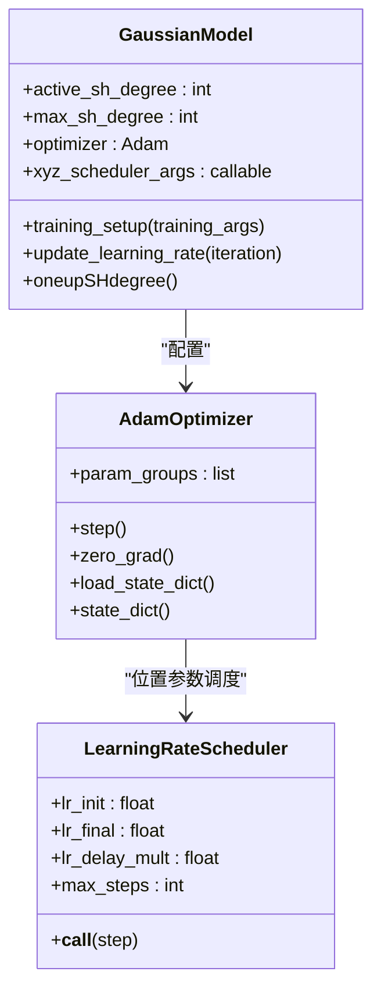
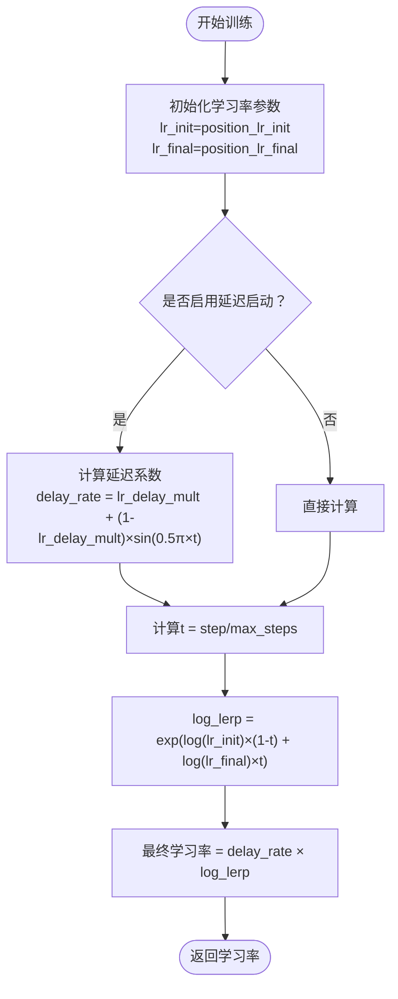
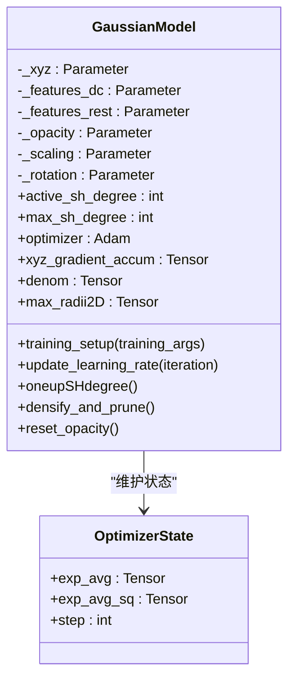
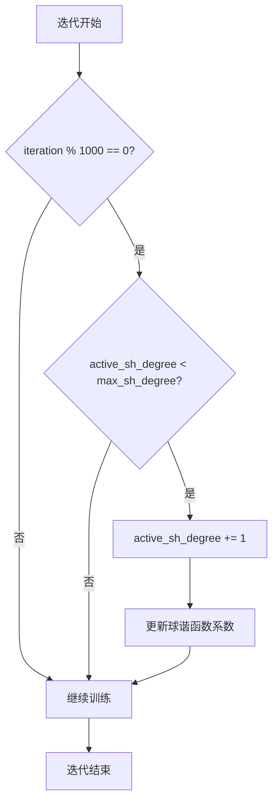
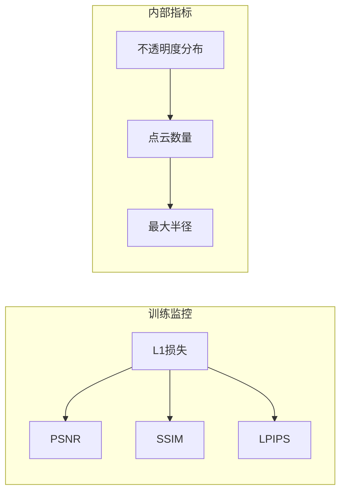
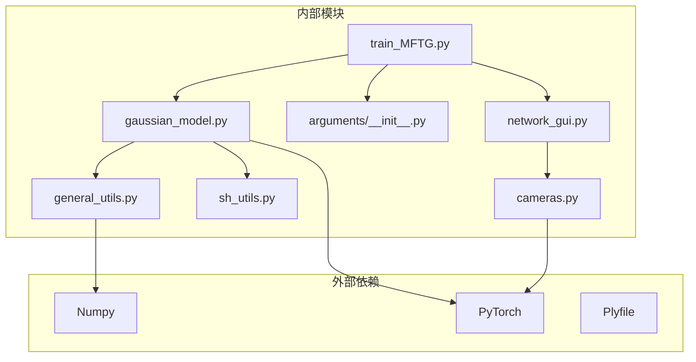
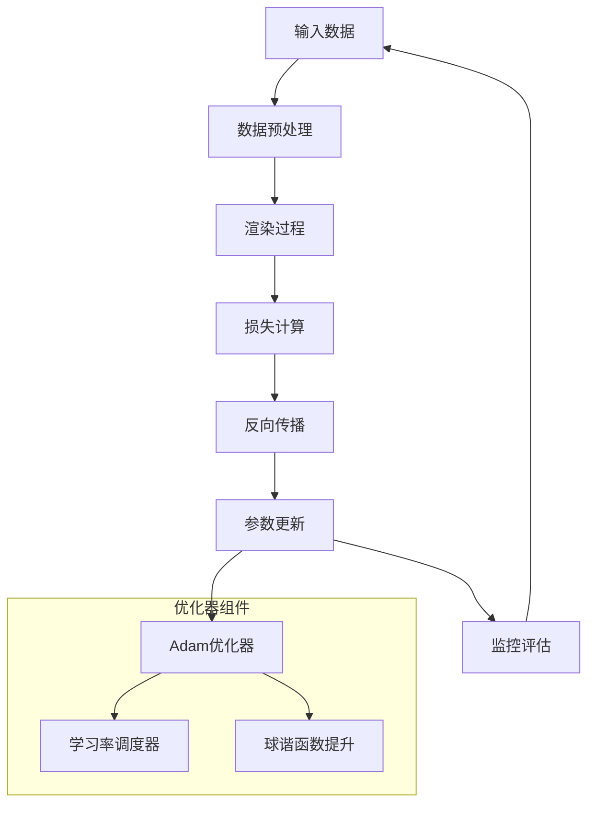
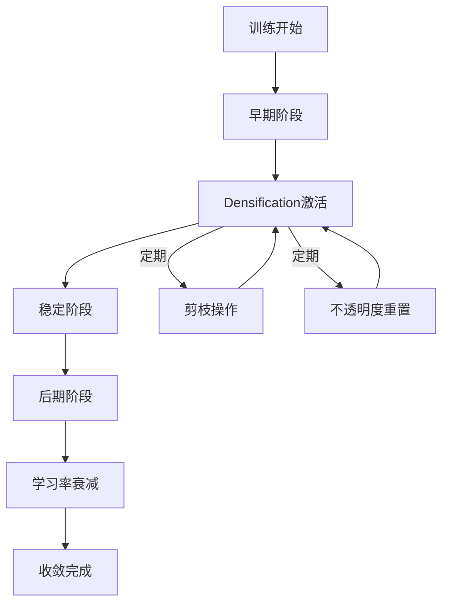

# 优化器与学习率调度

<cite>
**本文档引用的文件**
- [train_MFTG.py](file://train_MFTG.py)
- [gaussian_model.py](file://scene/gaussian_model.py)
- [general_utils.py](file://utils/general_utils.py)
- [sh_utils.py](file://utils/sh_utils.py)
- [arguments/__init__.py](file://arguments/__init__.py)
- [network_gui.py](file://gaussian_renderer/network_gui.py)
- [cameras.py](file://scene/cameras.py)
</cite>

## 目录
1. [简介](#简介)
2. [项目结构](#项目结构)
3. [核心组件](#核心组件)
4. [架构概览](#架构概览)
5. [详细组件分析](#详细组件分析)
6. [依赖关系分析](#依赖关系分析)
7. [性能考虑](#性能考虑)
8. [故障排除指南](#故障排除指南)
9. [结论](#结论)

## 简介

本文档深入解析 Thermal-Gaussian 项目中的优化器配置和学习率调度机制。该系统基于高斯点云表示，使用 Adam 优化器进行端到端训练，并实现了复杂的球谐函数系数逐步提升策略。文档重点涵盖：

- Adam 优化器的参数设置和梯度更新机制
- 学习率随迭代次数变化的调度规则
- 球谐函数系数逐步提升策略（oneupSHdegree）对训练稳定性的影响
- 优化器超参数调优指南和收敛监控方法
- 不同场景下的优化策略建议和性能优化最佳实践

## 项目结构

Thermal-Gaussian 项目采用模块化设计，主要包含以下核心模块：

```mermaid
graph TB
subgraph "训练主程序"
TM[train_MFTG.py<br/>训练主循环"]
AG[arguments/__init__.py<br/>参数配置]
end
subgraph "场景建模"
GM[gaussian_model.py<br/>高斯模型]
CAM[cameras.py<br/>相机系统]
end
subgraph "工具模块"
GU[general_utils.py<br/>通用工具]
SH[sh_utils.py<br/>球谐函数]
NG[network_gui.py<br/>网络GUI]
end
subgraph "损失函数"
LU[utils/loss_utils.py<br/>损失函数]
IU[utils/image_utils.py<br/>图像处理]
end
TM --> GM
TM --> AG
TM --> LU
TM --> IU
GM --> GU
GM --> SH
CAM --> GU
NG --> TM
```

**图表来源**
- [train_MFTG.py:1-273](file://train_MFTG.py#L1-L273)
- [gaussian_model.py:1-407](file://scene/gaussian_model.py#L1-L407)
- [arguments/__init__.py:1-113](file://arguments/__init__.py#L1-L113)

**章节来源**
- [train_MFTG.py:1-273](file://train_MFTG.py#L1-L273)
- [gaussian_model.py:1-407](file://scene/gaussian_model.py#L1-L407)
- [arguments/__init__.py:1-113](file://arguments/__init__.py#L1-L113)

## 核心组件

### Adam 优化器配置

系统使用 PyTorch 的 Adam 优化器，针对不同的参数组设置了专门的学习率：



**图表来源**
- [gaussian_model.py:149-176](file://scene/gaussian_model.py#L149-L176)
- [general_utils.py:29-62](file://utils/general_utils.py#L29-L62)

### 参数组配置

系统为不同类型的参数设置了专门的学习率：

| 参数组 | 学习率 | 作用域 | 默认值 |
|--------|--------|--------|--------|
| xyz | position_lr_init × spatial_lr_scale | 3D位置坐标 | 0.00016 |
| f_dc | feature_lr | 主球谐函数系数 | 0.0025 |
| f_rest | feature_lr / 20.0 | 辅助球谐函数系数 | 0.000125 |
| opacity | opacity_lr | 不透明度 | 0.05 |
| scaling | scaling_lr | 缩放参数 | 0.005 |
| rotation | rotation_lr | 旋转参数 | 0.001 |

**章节来源**
- [gaussian_model.py:154-161](file://scene/gaussian_model.py#L154-L161)
- [arguments/__init__.py:71-90](file://arguments/__init__.py#L71-L90)

## 架构概览

### 训练流程架构

```mermaid
sequenceDiagram
participant TR as 训练循环
participant GM as 高斯模型
participant OPT as 优化器
participant LR as 学习率调度器
TR->>GM : training_setup()
GM->>OPT : 创建Adam优化器
GM->>LR : 初始化指数学习率调度器
loop 每个训练迭代
TR->>GM : update_learning_rate(iteration)
GM->>LR : 计算当前学习率
LR-->>GM : 返回学习率
GM->>OPT : 更新位置参数学习率
TR->>TR : 前向传播
TR->>TR : 计算损失
TR->>TR : 反向传播
TR->>OPT : optimizer.step()
OPT->>OPT : 参数更新
TR->>OPT : optimizer.zero_grad()
TR->>GM : oneupSHdegree() (每1000次迭代)
GM->>GM : 提升球谐函数度数
end
```

**图表来源**
- [train_MFTG.py:68-163](file://train_MFTG.py#L68-L163)
- [gaussian_model.py:169-176](file://scene/gaussian_model.py#L169-L176)

### 学习率调度机制

系统实现了指数型学习率衰减策略，具有延迟启动功能：



**图表来源**
- [general_utils.py:47-60](file://utils/general_utils.py#L47-L60)

**章节来源**
- [train_MFTG.py:86-90](file://train_MFTG.py#L86-L90)
- [gaussian_model.py:169-176](file://scene/gaussian_model.py#L169-L176)
- [general_utils.py:29-62](file://utils/general_utils.py#L29-L62)

## 详细组件分析

### 高斯模型类分析

#### 参数管理机制



**图表来源**
- [gaussian_model.py:44-59](file://scene/gaussian_model.py#L44-L59)
- [gaussian_model.py:258-289](file://scene/gaussian_model.py#L258-L289)

#### 球谐函数系数逐步提升

系统实现了渐进式的球谐函数系数提升策略：



**图表来源**
- [train_MFTG.py:88-90](file://train_MFTG.py#L88-L90)
- [gaussian_model.py:120-122](file://scene/gaussian_model.py#L120-L122)

**章节来源**
- [train_MFTG.py:88-90](file://train_MFTG.py#L88-L90)
- [gaussian_model.py:120-122](file://scene/gaussian_model.py#L120-L122)

### 学习率调度器实现

#### 指数衰减学习率函数

系统使用指数型学习率衰减，具有以下特点：

1. **延迟启动**：通过 `lr_delay_mult` 和 `lr_delay_steps` 实现平滑的初始学习率提升
2. **对数线性插值**：在 `lr_init` 和 `lr_final` 之间进行对数线性插值
3. **连续性**：在整个训练过程中保持学习率的连续变化

#### 学习率参数配置

| 参数 | 含义 | 默认值 | 作用 |
|------|------|--------|------|
| position_lr_init | 初始位置学习率 | 0.00016 | 训练初期的快速收敛 |
| position_lr_final | 最终位置学习率 | 0.0000016 | 训练后期的精细调整 |
| position_lr_delay_mult | 延迟启动倍数 | 0.01 | 初始阶段的最小学习率比例 |
| position_lr_max_steps | 最大步数 | 30,000 | 学习率衰减的总步数 |
| spatial_lr_scale | 空间学习率缩放 | 1.0 | 与空间尺度相关的学习率调整 |

**章节来源**
- [arguments/__init__.py:71-90](file://arguments/__init__.py#L71-L90)
- [gaussian_model.py:164-167](file://scene/gaussian_model.py#L164-L167)
- [general_utils.py:29-62](file://utils/general_utils.py#L29-L62)

### 优化器超参数调优指南

#### 关键超参数及其影响

1. **位置学习率 (position_lr_init)**
   - 影响3D点云位置的收敛速度
   - 过大导致训练不稳定，过小导致收敛缓慢
   - 建议范围：0.00001-0.001

2. **特征学习率 (feature_lr)**
   - 控制颜色和球谐函数系数的学习速度
   - 通常设置为位置学习率的10-50倍
   - 建议范围：0.001-0.01

3. **不透明度学习率 (opacity_lr)**
   - 影响点云透明度的调节速度
   - 建议范围：0.01-0.1

#### 收敛监控指标



**图表来源**
- [train_MFTG.py:186-238](file://train_MFTG.py#L186-L238)

**章节来源**
- [train_MFTG.py:186-238](file://train_MFTG.py#L186-L238)

## 依赖关系分析

### 模块依赖图



**图表来源**
- [train_MFTG.py:12-26](file://train_MFTG.py#L12-L26)
- [gaussian_model.py:12-22](file://scene/gaussian_model.py#L12-L22)

### 数据流分析



**图表来源**
- [train_MFTG.py:107-158](file://train_MFTG.py#L107-L158)
- [gaussian_model.py:149-176](file://scene/gaussian_model.py#L149-L176)

**章节来源**
- [train_MFTG.py:107-158](file://train_MFTG.py#L107-L158)
- [gaussian_model.py:149-176](file://scene/gaussian_model.py#L149-L176)

## 性能考虑

### 训练效率优化

1. **批量处理优化**
   - 使用随机相机采样减少每次迭代的计算量
   - 实现进度条显示提高训练可见性

2. **内存管理**
   - 定期清理CUDA缓存避免内存泄漏
   - 智能的点云密度管理和剪枝策略

3. **学习率策略优化**
   - 渐进式球谐函数提升避免一次性增加过多参数
   - 自适应学习率调整适应不同训练阶段

### 收敛加速技巧



**图表来源**
- [train_MFTG.py:142-154](file://train_MFTG.py#L142-L154)

**章节来源**
- [train_MFTG.py:142-154](file://train_MFTG.py#L142-L154)

## 故障排除指南

### 常见问题及解决方案

#### 训练不稳定

**症状**：损失值大幅波动，训练无法收敛
**可能原因**：
- 学习率过高
- 球谐函数提升过于激进
- 点云密度控制不当

**解决方法**：
1. 降低位置学习率
2. 调整球谐函数提升频率
3. 优化密度控制参数

#### 收敛缓慢

**症状**：训练需要很长时间才能达到合理质量
**可能原因**：
- 学习率过低
- 特征学习率不足
- 网络规模过大

**解决方法**：
1. 适当提高学习率
2. 增加特征学习率
3. 调整网络复杂度

#### 内存不足

**症状**：CUDA内存溢出错误
**可能原因**：
- 点云数量过多
- 球谐函数阶数过高
- 批处理大小不合适

**解决方法**：
1. 减少点云密度阈值
2. 限制最大球谐函数阶数
3. 降低批处理大小

### 调试工具使用

#### TensorBoard监控

系统集成了TensorBoard支持，可以监控：
- 训练损失曲线
- 图像重建质量
- 点云统计信息
- 训练时间统计

#### 网络GUI调试

通过网络GUI可以实时查看：
- 当前渲染结果
- 训练状态
- 参数可视化
- 实时交互调试

**章节来源**
- [train_MFTG.py:186-238](file://train_MFTG.py#L186-L238)
- [network_gui.py:34-84](file://gaussian_renderer/network_gui.py#L34-L84)

## 结论

Thermal-Gaussian 项目展示了现代神经辐射场训练系统的最佳实践。其优化器配置和学习率调度策略具有以下特点：

1. **精细化的参数管理**：针对不同类型参数设置专门的学习率，确保各部分的协调训练
2. **渐进式学习策略**：通过延迟启动和指数衰减实现平滑的训练过程
3. **自适应球谐函数提升**：逐步增加模型复杂度，平衡训练稳定性和表达能力
4. **全面的监控体系**：集成多种评估指标和可视化工具

这些设计为类似项目的优化器配置提供了宝贵的参考，特别是在处理大规模点云和复杂几何表示时的训练稳定性保障方面。