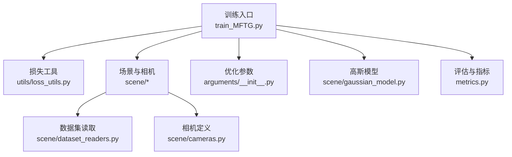
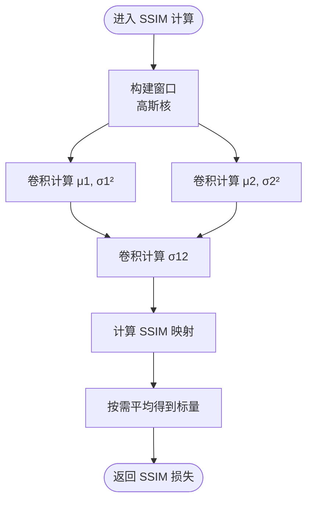
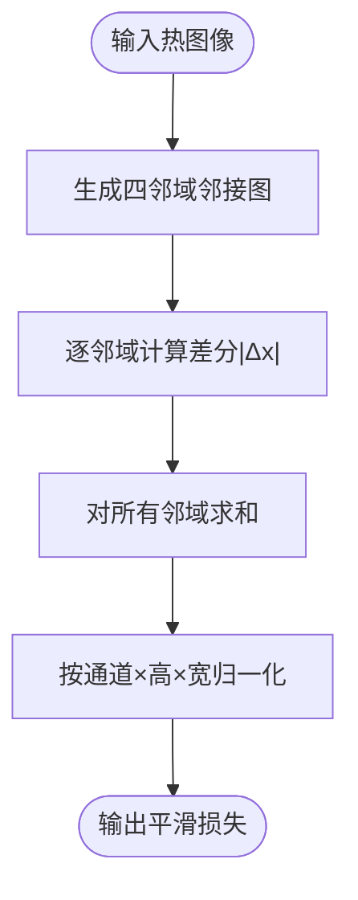
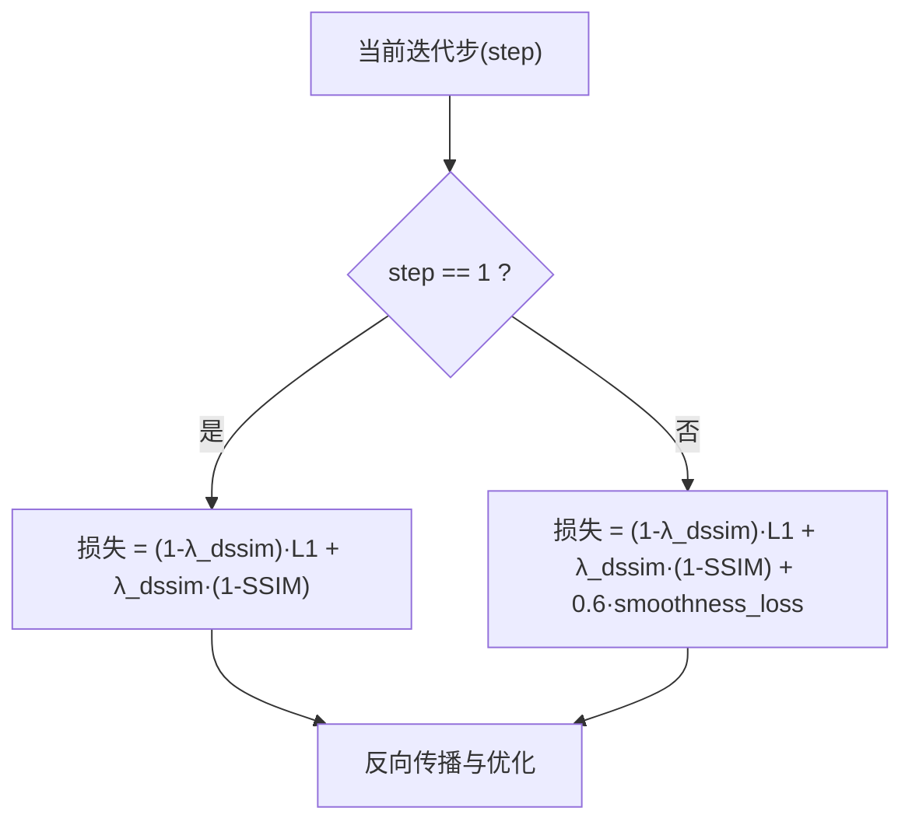
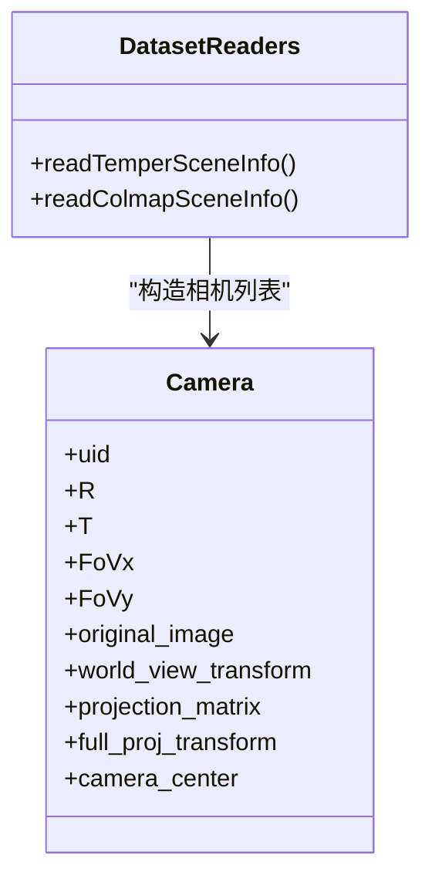
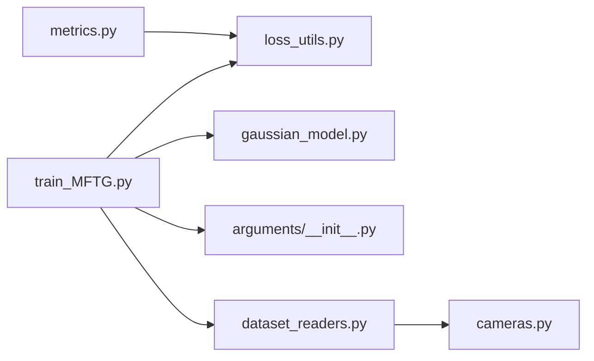

# 损失函数设计

<cite>
**本文引用的文件**
- [loss_utils.py](file://utils/loss_utils.py)
- [train_MFTG.py](file://train_MFTG.py)
- [gaussian_model.py](file://scene/gaussian_model.py)
- [arguments\__init__.py](file://arguments/__init__.py)
- [metrics.py](file://metrics.py)
- [README.md](file://README.md)
- [cameras.py](file://scene/cameras.py)
- [dataset_readers.py](file://scene/dataset_readers.py)
</cite>

## 目录
1. [引言](#引言)
2. [项目结构](#项目结构)
3. [核心组件](#核心组件)
4. [架构总览](#架构总览)
5. [详细组件分析](#详细组件分析)
6. [依赖关系分析](#依赖关系分析)
7. [性能考量](#性能考量)
8. [故障排查指南](#故障排查指南)
9. [结论](#结论)
10. [附录](#附录)

## 引言
本技术文档围绕 Thermal-Gaussian 的损失函数设计展开，系统解析 L1 损失、SSIM 损失与热红外平滑损失（smoothness_loss）的数学原理与实现细节，并阐明其在 RGB 预训练与热红外微调两个阶段中的作用权重与调节机制。重点解释 lambda_dssim 参数对损失函数组合的影响，以及 smoothness_loss 在热成像物理特性建模中的特殊意义。同时提供调优建议、收敛性分析与可视化方法，帮助读者在 RGB 预训练与热红外微调之间取得高质量的多模态渲染结果。

## 项目结构
本项目采用模块化组织方式：训练脚本负责控制两阶段流程与损失计算；损失工具模块提供 L1、SSIM 与平滑损失；场景模块封装相机与数据加载；优化参数通过命令行参数组统一管理；评估脚本用于指标计算与可视化输出。



**图示来源**
- [train_MFTG.py:35-163](file://train_MFTG.py#L35-L163)
- [loss_utils.py:20-113](file://utils/loss_utils.py#L20-L113)
- [gaussian_model.py:149-176](file://scene/gaussian_model.py#L149-L176)
- [arguments\_\_init__.py:71-90](file://arguments/__init__.py#L71-L90)
- [metrics.py:36-139](file://metrics.py#L36-L139)
- [dataset_readers.py:184-230](file://scene/dataset_readers.py#L184-L230)
- [cameras.py:17-58](file://scene/cameras.py#L17-L58)

**章节来源**
- [README.md:13-117](file://README.md#L13-L117)
- [train_MFTG.py:35-163](file://train_MFTG.py#L35-L163)

## 核心组件
- L1 损失：像素级绝对误差均值，强调重建强度一致性，适合 RGB 预训练阶段以稳定收敛。
- SSIM 损失：基于局部窗口统计量的结构相似度，关注纹理与边缘保真，在 RGB 预训练与热红外微调中均提升视觉质量。
- 热红外平滑损失（smoothness_loss）：对灰度热成像的空间邻域差异进行 L1 正则，抑制噪声与伪影，增强热成像的物理合理性。

上述三者在两阶段训练中以可配置权重融合，其中热红外微调阶段引入平滑正则项，显著改善热成像的连续性与稳定性。

**章节来源**
- [loss_utils.py:20-24](file://utils/loss_utils.py#L20-L24)
- [loss_utils.py:36-66](file://utils/loss_utils.py#L36-L66)
- [loss_utils.py:98-113](file://utils/loss_utils.py#L98-L113)
- [train_MFTG.py:108-114](file://train_MFTG.py#L108-L114)

## 架构总览
两阶段训练流程如下：先在 RGB 图像上进行预训练，再在热红外图像上进行微调。损失函数在每个迭代中根据当前阶段动态选择组合形式，并通过优化器更新高斯点参数。

```mermaid
sequenceDiagram
participant Train as "训练循环<br/>train_MFTG.py"
participant Loss as "损失函数<br/>utils/loss_utils.py"
participant Model as "高斯模型<br/>scene/gaussian_model.py"
participant Opt as "优化器<br/>Adam"
Train->>Model : "前向渲染<br/>render()"
Model-->>Train : "合成图像"
Train->>Loss : "计算 L1/SSIM/平滑损失"
Loss-->>Train : "损失值"
Train->>Opt : "反向传播与优化"
Opt-->>Model : "更新参数"
```

**图示来源**
- [train_MFTG.py:103-116](file://train_MFTG.py#L103-L116)
- [loss_utils.py:20-24](file://utils/loss_utils.py#L20-L24)
- [loss_utils.py:36-66](file://utils/loss_utils.py#L36-L66)
- [loss_utils.py:98-113](file://utils/loss_utils.py#L98-L113)
- [gaussian_model.py:149-176](file://scene/gaussian_model.py#L149-L176)

## 详细组件分析

### L1 损失（像素级绝对误差）
- 数学定义：对网络输出与真实图像逐像素取绝对差的均值。
- 特点：对异常值鲁棒，收敛稳定，适合 RGB 预训练阶段快速拟合强度分布。
- 实现要点：使用张量逐元素运算，自动求导链路清晰。

**章节来源**
- [loss_utils.py:20-24](file://utils/loss_utils.py#L20-L24)

### SSIM 损失（结构相似度）
- 数学原理：基于局部均值、方差与协方差构造归一化相似度，窗口平均后作为损失。
- 实现细节：
  - 使用可分离高斯核构建二维窗口；
  - 对输入图像进行卷积计算一阶与二阶矩；
  - 采用常数项避免除零与数值不稳定；
  - 支持通道分组与尺寸平均。
- 应用价值：在 RGB 预训练与热红外微调中均提升纹理与边缘保真度。



**图示来源**
- [loss_utils.py:26-34](file://utils/loss_utils.py#L26-L34)
- [loss_utils.py:46-66](file://utils/loss_utils.py#L46-L66)

**章节来源**
- [loss_utils.py:36-66](file://utils/loss_utils.py#L36-L66)

### 热红外平滑损失（smoothness_loss）
- 物理动机：热成像通常具有空间连续性与平滑性约束，相邻像素间温度变化应有限。
- 实现机制：
  - 生成四邻域（上下左右）邻接图；
  - 对每个通道计算与邻居的像素差绝对值之和；
  - 归一化到通道×高度×宽度，得到全局平滑损失。
- 调节权重：在热红外微调阶段乘以固定系数（代码中为 0.6），平衡亮度与平滑约束。



**图示来源**
- [loss_utils.py:68-96](file://utils/loss_utils.py#L68-L96)
- [loss_utils.py:98-113](file://utils/loss_utils.py#L98-L113)

**章节来源**
- [loss_utils.py:98-113](file://utils/loss_utils.py#L98-L113)

### 两阶段损失组合与权重调节
- RGB 预训练阶段（step=1）：
  - 组合：(1 - λ_dssim) × L1 + λ_dssim × (1 - SSIM)
  - 目标：快速学习颜色空间的亮度与纹理特征。
- 热红外微调阶段（step=2）：
  - 组合：(1 - λ_dssim) × L1 + λ_dssim × (1 - SSIM) + α × smoothness_loss
  - 目标：在保持结构一致的同时，引入空间平滑正则，抑制热成像噪声与伪影。
- 关键参数：
  - λ_dssim：控制 L1 与 SSIM 的相对权重，默认值由优化参数组提供。
  - α：平滑损失的缩放系数（代码中固定为 0.6）。



**图示来源**
- [train_MFTG.py:108-114](file://train_MFTG.py#L108-L114)
- [arguments\_\_init__.py:83](file://arguments/__init__.py#L83)

**章节来源**
- [train_MFTG.py:108-114](file://train_MFTG.py#L108-L114)
- [arguments\_\_init__.py:83](file://arguments/__init__.py#L83)

### 数据加载与场景组织
- 场景读取：支持 COLMAP 与自定义格式，分别从 rgb 与 thermal 子目录加载训练/测试集。
- 相机模型：封装世界坐标到相机坐标的变换矩阵与投影矩阵，供渲染模块使用。
- 训练流程：两阶段分别实例化不同场景对象，共享高斯模型参数以实现迁移。



**图示来源**
- [cameras.py:17-58](file://scene/cameras.py#L17-L58)
- [dataset_readers.py:184-230](file://scene/dataset_readers.py#L184-L230)

**章节来源**
- [dataset_readers.py:184-230](file://scene/dataset_readers.py#L184-L230)
- [cameras.py:17-58](file://scene/cameras.py#L17-L58)

## 依赖关系分析
- 训练脚本依赖损失工具模块与高斯模型，通过参数组注入优化超参。
- 评估脚本复用 SSIM 与 LPIPS 等指标，用于测试集上的客观评价。
- 数据读取模块区分 RGB 与热红外场景，确保两阶段数据路径正确。



**图示来源**
- [train_MFTG.py:16-26](file://train_MFTG.py#L16-L26)
- [metrics.py:17-21](file://metrics.py#L17-L21)
- [arguments\_\_init__.py:71-90](file://arguments/__init__.py#L71-L90)

**章节来源**
- [train_MFTG.py:16-26](file://train_MFTG.py#L16-L26)
- [metrics.py:17-21](file://metrics.py#L17-L21)
- [arguments\_\_init__.py:71-90](file://arguments/__init__.py#L71-L90)

## 性能考量
- 计算复杂度：
  - L1 与 SSIM 均为 O(HW) 的逐像素操作，卷积窗口大小为常数；
  - 平滑损失对每个像素计算固定数量邻域差分，整体仍为 O(HW)，但包含多次数组滚动与求和。
- 内存占用：主要受图像分辨率与通道数影响；邻接图在 GPU 上分配，注意显存上限。
- 收敛策略：
  - RGB 预训练阶段以 L1 为主，λ_dssim 较小可加速收敛；
  - 热红外微调阶段适度增大 λ_dssim，配合平滑正则，提升热成像连续性。
- 可视化：训练日志记录总损失与 L1 损失，测试时记录 SSIM、PSNR、LPIPS 等指标，便于跨阶段对比。

**章节来源**
- [train_MFTG.py:186-238](file://train_MFTG.py#L186-L238)
- [metrics.py:66-129](file://metrics.py#L66-L129)

## 故障排查指南
- 热成像出现噪声或条纹：
  - 提升平滑损失权重（当前代码中为 0.6），或在后续版本中引入自适应权重。
- RGB 预训练收敛缓慢：
  - 适当提高 λ_dssim，使结构信息引导更充分；检查学习率调度是否生效。
- 测试指标不达标：
  - 使用评估脚本对比不同方法与场景的 SSIM、PSNR、LPIPS，定位问题来源。
- 数据路径错误：
  - 确认 rgb 与 thermal 子目录结构与训练/测试划分，确保 Colmap 输出存在。

**章节来源**
- [metrics.py:36-139](file://metrics.py#L36-L139)
- [README.md:28-60](file://README.md#L28-L60)

## 结论
本设计通过 L1、SSIM 与热红外平滑损失的协同，实现了 RGB 预训练与热红外微调的有序过渡。λ_dssim 控制结构信息与像素强度之间的权衡，平滑损失则针对热成像的物理特性施加正则，有效提升渲染质量与稳定性。结合可视化与指标评估，可进一步指导参数调优与收敛分析。

## 附录

### 参数设置建议
- λ_dssim（默认值见优化参数组）：
  - RGB 预训练：可从默认值开始，若纹理模糊可适度提高；
  - 热红外微调：建议在 0.2~0.4 区间搜索，兼顾结构与平滑。
- 平滑损失缩放系数（当前代码固定为 0.6）：
  - 若热成像噪声明显，可尝试增大至 0.8；若过度平滑导致细节丢失，可降至 0.4。
- 其他建议：
  - 密度增长阈值与间隔在两阶段可保持一致，但需根据数据规模调整；
  - 渲染分辨率与窗口大小需与硬件能力匹配，避免内存溢出。

**章节来源**
- [arguments\_\_init__.py:83](file://arguments/__init__.py#L83)
- [train_MFTG.py:108-114](file://train_MFTG.py#L108-L114)