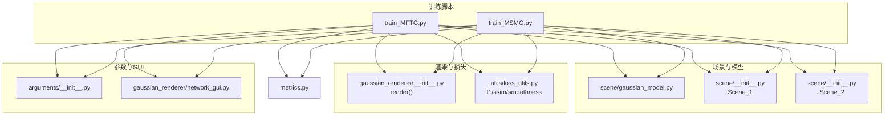
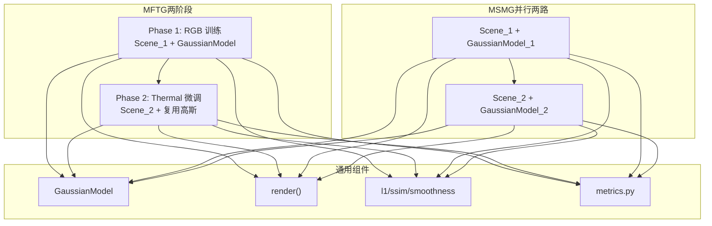
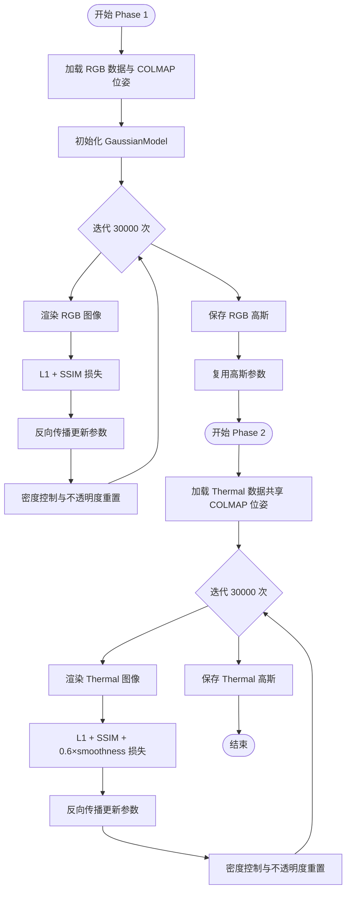
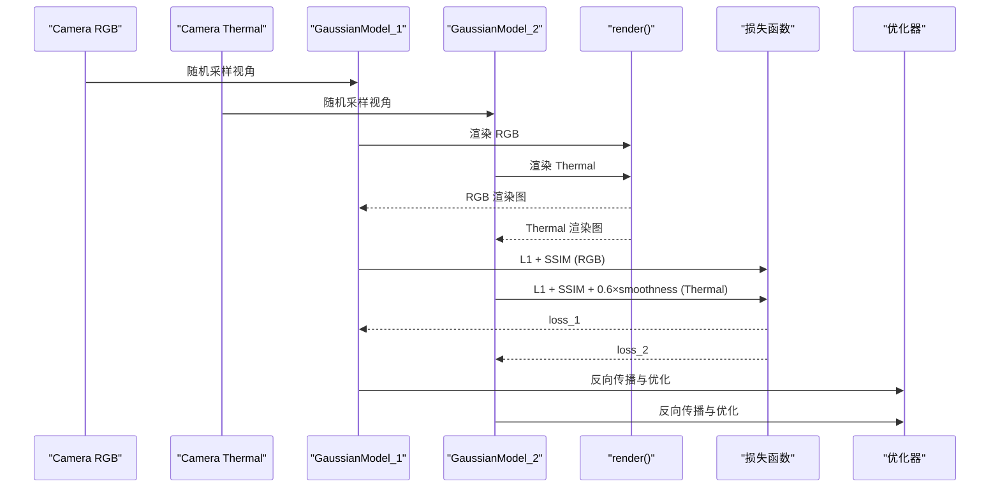
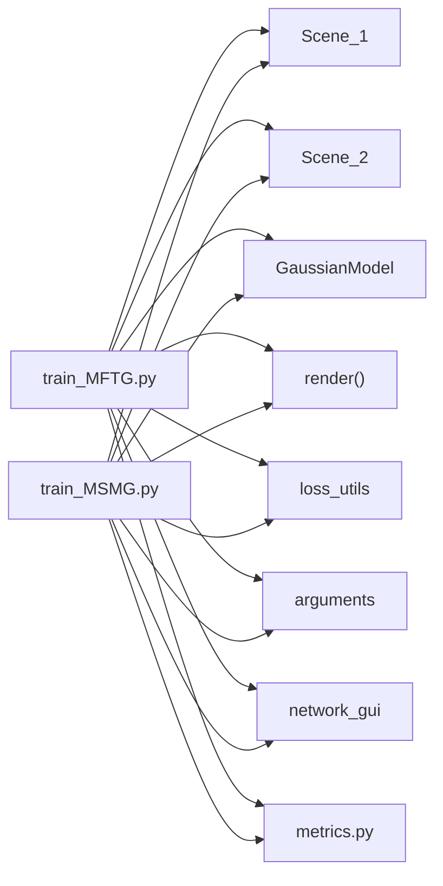

# 算法版本对比

<cite>
**本文引用的文件**
- [train_MFTG.py](file://train_MFTG.py)
- [train_MSMG.py](file://train_MSMG.py)
- [MFTG-Technical-Doc.md](file://MFTG-Technical-Doc.md)
- [README.md](file://README.md)
- [scene/gaussian_model.py](file://scene/gaussian_model.py)
- [scene/__init__.py](file://scene/__init__.py)
- [utils/loss_utils.py](file://utils/loss_utils.py)
- [gaussian_renderer/__init__.py](file://gaussian_renderer/__init__.py)
- [gaussian_renderer/network_gui.py](file://gaussian_renderer/network_gui.py)
- [arguments/__init__.py](file://arguments/__init__.py)
- [metrics.py](file://metrics.py)
</cite>

## 目录
1. [简介](#简介)
2. [项目结构](#项目结构)
3. [核心组件](#核心组件)
4. [架构总览](#架构总览)
5. [详细组件分析](#详细组件分析)
6. [依赖关系分析](#依赖关系分析)
7. [性能考量](#性能考量)
8. [故障排查指南](#故障排查指南)
9. [结论](#结论)
10. [附录](#附录)

## 简介
本文件面向 Thermal-Gaussian 项目中的多算法版本进行系统性对比分析，重点围绕 MFTG（多模态微调高斯）与 MSMG（多单一模态高斯）两大训练范式，从训练策略、损失函数设计、优化机制、适用场景、性能特征与局限性等方面展开，并给出版本选择建议与实践指南。文档同时结合技术文档与源码实现，辅以可视化图示帮助读者快速理解。

## 项目结构
项目采用“脚本驱动 + 场景封装 + 渲染管线 + 损失工具”的分层组织：
- 训练入口：train_MFTG.py、train_MSMG.py
- 场景与模型：scene/gaussian_model.py、scene/__init__.py（Scene_1/Scene_2）
- 渲染器：gaussian_renderer/__init__.py
- 损失与评估：utils/loss_utils.py、metrics.py
- 参数与GUI：arguments/__init__.py、gaussian_renderer/network_gui.py
- 文档与说明：MFTG-Technical-Doc.md、README.md

图表来源
- [train_MFTG.py:1-273](file://train_MFTG.py#L1-L273)
- [train_MSMG.py:1-314](file://train_MSMG.py#L1-L314)
- [scene/gaussian_model.py:1-407](file://scene/gaussian_model.py#L1-L407)
- [scene/__init__.py:1-168](file://scene/__init__.py#L1-L168)
- [gaussian_renderer/__init__.py:1-101](file://gaussian_renderer/__init__.py#L1-L101)
- [utils/loss_utils.py:1-114](file://utils/loss_utils.py#L1-L114)
- [arguments/__init__.py:1-113](file://arguments/__init__.py#L1-L113)
- [gaussian_renderer/network_gui.py:1-86](file://gaussian_renderer/network_gui.py#L1-L86)
- [metrics.py:1-148](file://metrics.py#L1-L148)

章节来源
- [README.md:1-167](file://README.md#L1-L167)
- [MFTG-Technical-Doc.md:1-618](file://MFTG-Technical-Doc.md#L1-L618)

## 核心组件
- GaussianModel：3DGS 核心模型，管理点云、颜色球谐系数、尺度/旋转/不透明度等参数，提供训练设置、密度控制、保存/加载等接口。
- Scene_1/Scene_2：分别加载 RGB 与 Thermal 数据，统一使用 COLMAP 位姿；MFTG 在第二阶段复用 Scene_1 的高斯参数。
- 渲染器 render()：基于高斯光栅化生成单模态图像（RGB 或 Thermal）。
- 损失函数：L1、SSIM、热红外平滑损失 smoothness_loss。
- 训练脚本：MFTG 实现两阶段训练；MSMG 实现两路独立训练。

章节来源
- [scene/gaussian_model.py:24-407](file://scene/gaussian_model.py#L24-L407)
- [scene/__init__.py:21-168](file://scene/__init__.py#L21-L168)
- [gaussian_renderer/__init__.py:18-101](file://gaussian_renderer/__init__.py#L18-L101)
- [utils/loss_utils.py:20-114](file://utils/loss_utils.py#L20-L114)
- [train_MFTG.py:35-273](file://train_MFTG.py#L35-L273)
- [train_MSMG.py:33-314](file://train_MSMG.py#L33-L314)

## 架构总览
两版本均基于相同的 3DGS 渲染与优化框架，差异主要体现在数据加载、损失设计与训练流程上。

图表来源
- [train_MFTG.py:35-273](file://train_MFTG.py#L35-L273)
- [train_MSMG.py:33-314](file://train_MSMG.py#L33-L314)
- [scene/gaussian_model.py:24-407](file://scene/gaussian_model.py#L24-L407)
- [gaussian_renderer/__init__.py:18-101](file://gaussian_renderer/__init__.py#L18-L101)
- [utils/loss_utils.py:20-114](file://utils/loss_utils.py#L20-L114)
- [metrics.py:36-148](file://metrics.py#L36-L148)

## 详细组件分析

### MFTG（多模态微调高斯）
- 训练策略
  - 两阶段：先 RGB 训练（30000 迭代），再 Thermal 微调（30000 迭代）。
  - 第二阶段复用第一阶段训练好的高斯参数，仅微调颜色球谐系数以适配热红外外观。
- 损失函数设计
  - Phase 1：L1 + SSIM 权重融合。
  - Phase 2：在 Phase 1 基础上增加热红外平滑损失项，鼓励温度场平滑。
- 优化机制
  - 自适应密度控制（clone/split/prune）与不透明度重置。
  - 学习率指数衰减与多组参数（位置、颜色、不透明度、尺度、旋转）。
- 适用场景
  - 需要高质量 RGB 与 Thermal 渲染，且希望共享几何结构。
  - 对显存有一定要求，但低于并行两路方案。
- 局限性
  - 同一套 SH 系数难以同时完美拟合两种模态颜色，Phase 2 后 RGB 质量会下降。
  - 两阶段训练时间较长，需完整训练以避免 checkpoint 恢复导致的阶段错配。

图表来源
- [train_MFTG.py:35-273](file://train_MFTG.py#L35-L273)
- [scene/__init__.py:21-168](file://scene/__init__.py#L21-L168)
- [utils/loss_utils.py:98-114](file://utils/loss_utils.py#L98-L114)

章节来源
- [train_MFTG.py:35-273](file://train_MFTG.py#L35-L273)
- [MFTG-Technical-Doc.md:7-165](file://MFTG-Technical-Doc.md#L7-L165)

### MSMG（多单一模态高斯）
- 训练策略
  - 两路独立：Scene_1 与 Scene_2 各自维护一套独立的 GaussianModel。
  - 并行训练 RGB 与 Thermal，各自独立收敛。
- 损失函数设计
  - Phase 1：L1 + SSIM（RGB）。
  - Phase 2：L1 + SSIM + 0.6×smoothness（Thermal）。
  - 通过动态权重融合两路损失，实现联合优化。
- 优化机制
  - 两套高斯分别进行密度控制与不透明度重置。
  - 两套优化器同步更新。
- 适用场景
  - 需要同时高质量拟合 RGB 与 Thermal，且不介意更高的显存占用。
  - 适合追求更快收敛与更强模态表达能力的场景。
- 局限性
  - 显存占用最高，两套高斯参数同时训练。
  - 训练时间较长，两路独立训练。

图表来源
- [train_MSMG.py:33-314](file://train_MSMG.py#L33-L314)
- [gaussian_renderer/__init__.py:18-101](file://gaussian_renderer/__init__.py#L18-L101)
- [utils/loss_utils.py:20-114](file://utils/loss_utils.py#L20-L114)

章节来源
- [train_MSMG.py:33-314](file://train_MSMG.py#L33-L314)

### 模型与数据流对比
- 模型结构
  - MFTG：共享一套 GaussianModel，第二阶段仅微调颜色参数。
  - MSMG：两套独立 GaussianModel，参数完全分离。
- 数据加载
  - 两者均使用 COLMAP 位姿，MFTG 第二阶段复用第一阶段的高斯初始化。
- 渲染与损失
  - 渲染器为单模态输出，MFTG 通过两阶段分别渲染 RGB 与 Thermal；MSMG 两路并行渲染。
  - 损失函数在 Thermal 模态上均引入平滑先验。

章节来源
- [scene/gaussian_model.py:24-407](file://scene/gaussian_model.py#L24-L407)
- [scene/__init__.py:21-168](file://scene/__init__.py#L21-L168)
- [gaussian_renderer/__init__.py:18-101](file://gaussian_renderer/__init__.py#L18-L101)
- [utils/loss_utils.py:98-114](file://utils/loss_utils.py#L98-L114)

## 依赖关系分析
- 训练脚本依赖
  - Scene_1/Scene_2：负责数据加载与相机列表管理。
  - GaussianModel：提供参数管理与优化接口。
  - render()：单模态光栅化渲染。
  - 损失函数：l1、ssim、smoothness。
  - 参数与 GUI：arguments 提供超参数，network_gui 提供交互式训练可视化。
- 评估与指标
  - metrics.py 读取渲染结果与 GT，计算 PSNR、SSIM、LPIPS。

图表来源
- [train_MFTG.py:12-273](file://train_MFTG.py#L12-L273)
- [train_MSMG.py:12-314](file://train_MSMG.py#L12-L314)
- [scene/__init__.py:21-168](file://scene/__init__.py#L21-L168)
- [scene/gaussian_model.py:24-407](file://scene/gaussian_model.py#L24-L407)
- [gaussian_renderer/__init__.py:18-101](file://gaussian_renderer/__init__.py#L18-L101)
- [utils/loss_utils.py:20-114](file://utils/loss_utils.py#L20-L114)
- [arguments/__init__.py:47-113](file://arguments/__init__.py#L47-L113)
- [gaussian_renderer/network_gui.py:26-86](file://gaussian_renderer/network_gui.py#L26-L86)
- [metrics.py:36-148](file://metrics.py#L36-L148)

章节来源
- [train_MFTG.py:12-273](file://train_MFTG.py#L12-L273)
- [train_MSMG.py:12-314](file://train_MSMG.py#L12-L314)

## 性能考量
- 训练时间
  - MFTG：两阶段各 30000 迭代，总时间较长但可顺序执行。
  - MSMG：两路独立训练，总时间与 MFTG 相近，但并行开销与显存占用更高。
- 显存占用
  - MFTG：中等，共享高斯参数，仅第二阶段微调颜色。
  - MSMG：最高，两套高斯参数同时训练。
- 计算效率
  - 两版本均使用相同渲染器与损失函数，计算瓶颈主要来自高斯密度控制与光栅化。
  - MFTG 在第二阶段仅微调颜色，整体计算量略低。
- 评估指标
  - metrics.py 支持 PSNR、SSIM、LPIPS，可用于定量对比两版本在 RGB 与 Thermal 模态上的表现。

章节来源
- [MFTG-Technical-Doc.md:26-36](file://MFTG-Technical-Doc.md#L26-L36)
- [metrics.py:36-148](file://metrics.py#L36-L148)

## 故障排查指南
- 训练中断与恢复
  - MFTG 支持 checkpoint 恢复，但恢复时两个阶段会从同一 checkpoint 开始，可能导致阶段错配，建议完整训练。
- 显存不足
  - 降低分辨率（-r）、减少 SH 阶数（--sh_degree）、使用更小训练图像。
  - 优先选择 MFTG 以降低显存占用。
- 渲染质量
  - 若 RGB 渲染质量下降，考虑使用 MSMG 或 OMMG（若存在）以获得双通道颜色表达。
- GUI 交互
  - network_gui 提供训练可视化，确保端口未被占用，必要时调整 --port。

章节来源
- [MFTG-Technical-Doc.md:587-618](file://MFTG-Technical-Doc.md#L587-L618)
- [gaussian_renderer/network_gui.py:26-86](file://gaussian_renderer/network_gui.py#L26-L86)

## 结论
- 选择建议
  - 需要 RGB 与 Thermal 双模态高质量渲染且显存有限：优先 MFTG。
  - 需要最快收敛与最强模态表达能力且显存充足：选择 MSMG。
  - 需要同时高质量 RGB 与 Thermal：考虑 OMMG（如可用）。
- 技术演进
  - MFTG 通过“先几何后颜色”的两阶段策略，在共享几何的前提下实现热红外平滑先验，提升 Thermal 渲染质量。
  - MSMG 通过并行两路训练，最大化模态拟合能力，但代价是更高的显存与计算成本。

## 附录
- 版本选择速查
  - 显存紧张 + 需要 Thermal 平滑：MFTG
  - 显存充足 + 追求最佳拟合：MSMG
  - 需要双通道颜色表达：OMMG（如可用）
- 常用参数参考
  - iterations：30000（两阶段）
  - lambda_dssim：0.2
  - smooth_loss 系数：0.6（仅 Phase 2）
  - sh_degree：3（默认）

章节来源
- [MFTG-Technical-Doc.md:493-513](file://MFTG-Technical-Doc.md#L493-L513)
- [arguments/__init__.py:71-90](file://arguments/__init__.py#L71-L90)