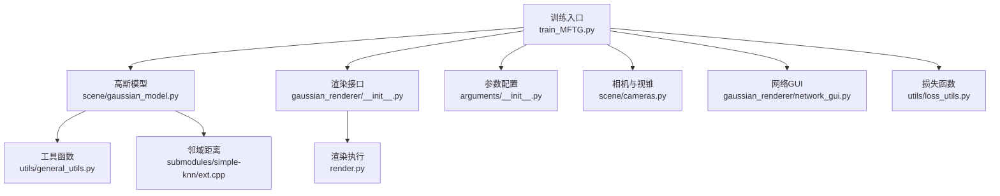
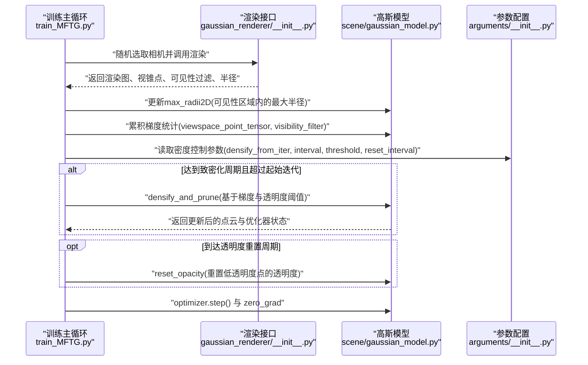
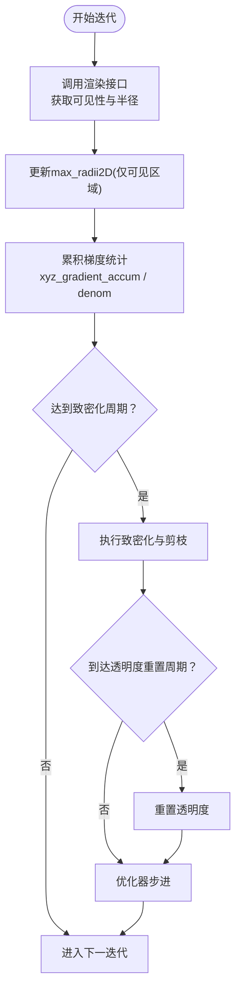
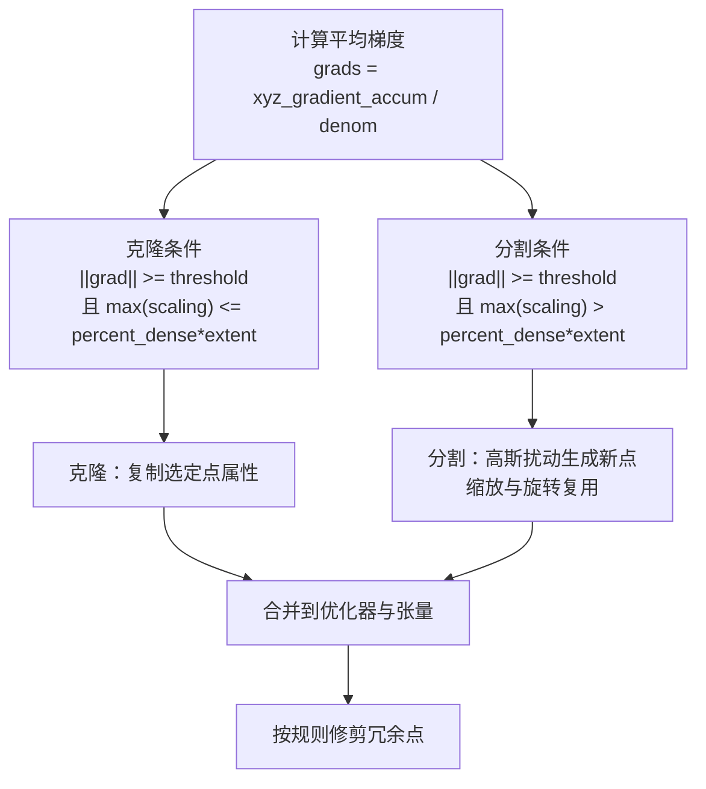
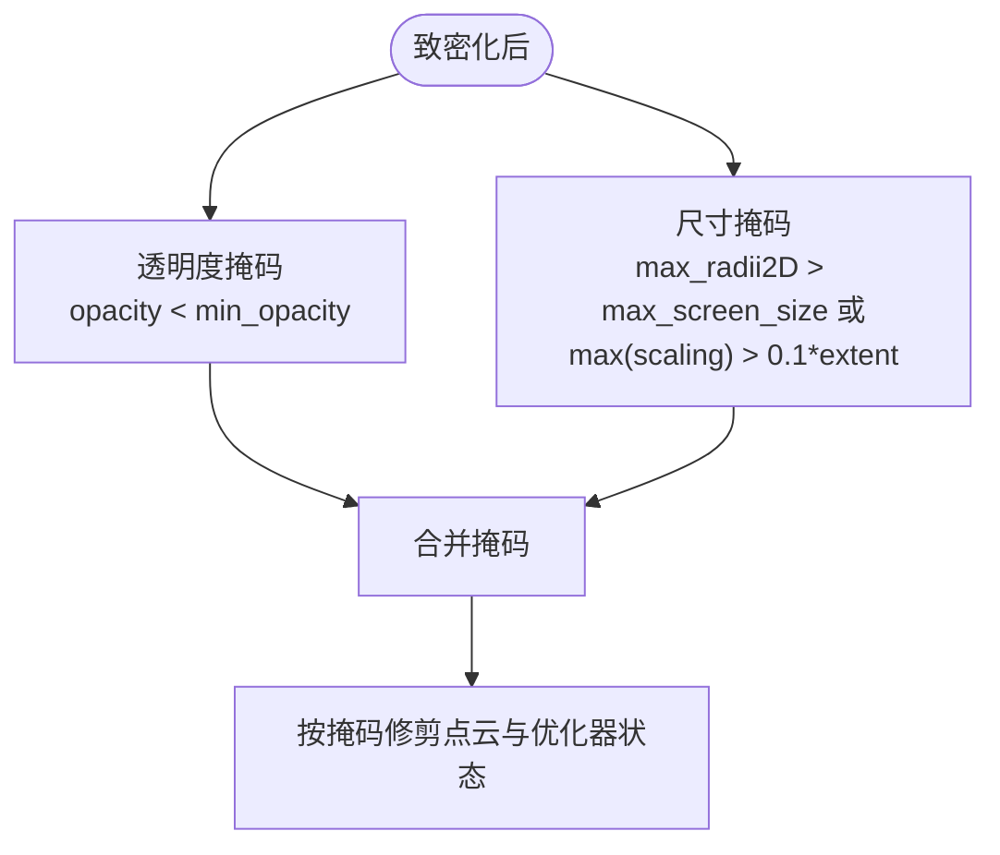
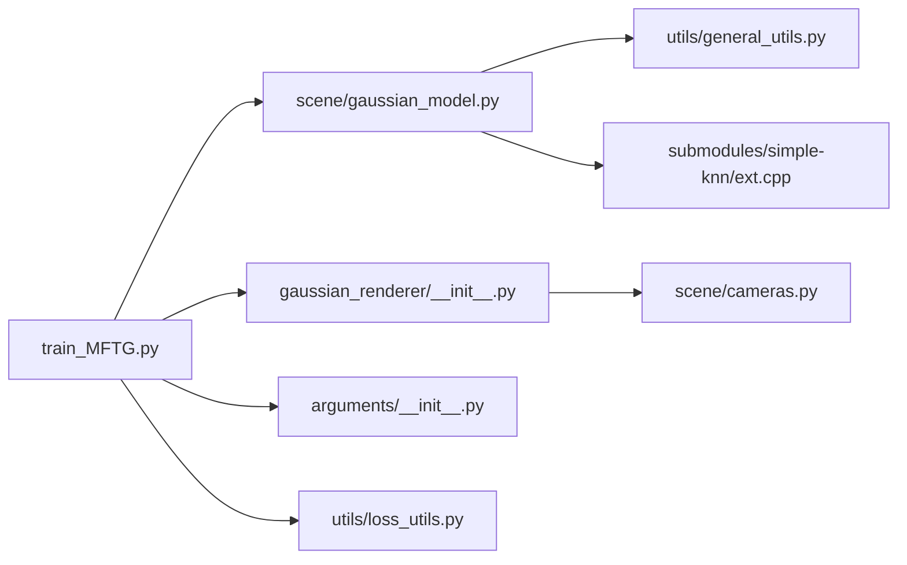

# 致密化与剪枝策略

<cite>
**本文引用的文件**
- [gaussian_renderer/__init__.py](file://gaussian_renderer/__init__.py)
- [gaussian_renderer/network_gui.py](file://gaussian_renderer/network_gui.py)
- [scene/cameras.py](file://scene/cameras.py)
- [scene/gaussian_model.py](file://scene/gaussian_model.py)
- [train_MFTG.py](file://train_MFTG.py)
- [arguments/__init__.py](file://arguments/__init__.py)
- [render.py](file://render.py)
- [utils/general_utils.py](file://utils/general_utils.py)
- [utils/loss_utils.py](file://utils/loss_utils.py)
- [submodules/simple-knn/ext.cpp](file://submodules/simple-knn/ext.cpp)
</cite>

## 目录
1. [引言](#引言)
2. [项目结构](#项目结构)
3. [核心组件](#核心组件)
4. [架构总览](#架构总览)
5. [详细组件分析](#详细组件分析)
6. [依赖分析](#依赖分析)
7. [性能考量](#性能考量)
8. [故障排查指南](#故障排查指南)
9. [结论](#结论)
10. [附录](#附录)

## 引言
本技术文档围绕 Thermal-Gaussian 的致密化（Densification）与剪枝（Pruning）策略展开，系统解析点云密度控制机制、视锥空间点统计、可见性过滤、半径阈值管理、致密化触发条件、梯度统计与密度增长策略、剪枝执行时机与透明度重置、尺寸阈值控制，并给出密度控制参数的调优指南及在不同场景下的最佳实践建议。文档同时分析致密化与剪枝对渲染质量与训练效率的影响，帮助读者在实际应用中取得更高质量与更高效率的训练结果。

## 项目结构
本项目采用“功能模块化+分层组织”的方式组织代码，其中与致密化和剪枝直接相关的核心模块包括：
- 训练入口与主循环：train_MFTG.py
- 高斯模型与密度控制：scene/gaussian_model.py
- 渲染接口与参数传递：gaussian_renderer/__init__.py、render.py
- 参数配置：arguments/__init__.py
- 相机与视锥空间：scene/cameras.py
- 网络GUI交互：gaussian_renderer/network_gui.py
- 工具函数：utils/general_utils.py、utils/loss_utils.py
- 空间邻域计算：submodules/simple-knn/ext.cpp

**图表来源**
- [train_MFTG.py:35-163](file://train_MFTG.py#L35-L163)
- [scene/gaussian_model.py:24-407](file://scene/gaussian_model.py#L24-L407)
- [gaussian_renderer/__init__.py](file://gaussian_renderer/__init__.py)
- [render.py:25-59](file://render.py#L25-L59)
- [arguments/__init__.py:71-90](file://arguments/__init__.py#L71-L90)
- [scene/cameras.py:17-72](file://scene/cameras.py#L17-L72)
- [gaussian_renderer/network_gui.py:26-86](file://gaussian_renderer/network_gui.py#L26-L86)
- [utils/general_utils.py:18-134](file://utils/general_utils.py#L18-L134)
- [utils/loss_utils.py:98-113](file://utils/loss_utils.py#L98-L113)
- [submodules/simple-knn/ext.cpp:12-17](file://submodules/simple-knn/ext.cpp#L12-L17)

**章节来源**
- [train_MFTG.py:35-163](file://train_MFTG.py#L35-L163)
- [scene/gaussian_model.py:24-407](file://scene/gaussian_model.py#L24-L407)
- [gaussian_renderer/__init__.py](file://gaussian_renderer/__init__.py)
- [render.py:25-59](file://render.py#L25-L59)
- [arguments/__init__.py:71-90](file://arguments/__init__.py#L71-L90)
- [scene/cameras.py:17-72](file://scene/cameras.py#L17-L72)
- [gaussian_renderer/network_gui.py:26-86](file://gaussian_renderer/network_gui.py#L26-L86)
- [utils/general_utils.py:18-134](file://utils/general_utils.py#L18-L134)
- [utils/loss_utils.py:98-113](file://utils/loss_utils.py#L98-L113)
- [submodules/simple-knn/ext.cpp:12-17](file://submodules/simple-knn/ext.cpp#L12-L17)

## 核心组件
- 高斯模型（GaussianModel）
  - 负责点云表示、密度统计、致密化与剪枝逻辑、透明度重置、优化器状态维护等。
  - 关键属性与方法：xyz、scaling、rotation、opacity、features、max_radii2D、xyz_gradient_accum、denom；add_densification_stats、densify_and_clone、densify_and_split、densify_and_prune、reset_opacity、prune_points、cat_tensors_to_optimizer、replace_tensor_to_optimizer。
- 训练主循环（train_MFTG.py）
  - 控制迭代流程、可见性与视锥统计、致密化与剪枝触发、透明度重置、优化器步进与保存。
- 渲染接口（gaussian_renderer/__init__.py、render.py）
  - 提供渲染函数与批量渲染流程，输出渲染图、可见性过滤与屏幕半径等信息，供密度控制使用。
- 参数配置（arguments/__init__.py）
  - 定义致密化相关超参数：densify_from_iter、densify_until_iter、densification_interval、densify_grad_threshold、opacity_reset_interval、percent_dense 等。
- 相机与视锥（scene/cameras.py）
  - 提供相机投影矩阵与视锥参数，支撑渲染与可见性判断。
- 工具函数（utils/general_utils.py）
  - 提供逆sigmoid、指数学习率衰减、旋转矩阵构建等基础能力。
- 空间邻域（submodules/simple-knn/ext.cpp）
  - 提供点云最近邻距离计算，用于初始尺度估计与密度阈值判断。

**章节来源**
- [scene/gaussian_model.py:44-407](file://scene/gaussian_model.py#L44-L407)
- [train_MFTG.py:68-163](file://train_MFTG.py#L68-L163)
- [gaussian_renderer/__init__.py](file://gaussian_renderer/__init__.py)
- [render.py:25-59](file://render.py#L25-L59)
- [arguments/__init__.py:71-90](file://arguments/__init__.py#L71-L90)
- [scene/cameras.py:17-72](file://scene/cameras.py#L17-L72)
- [utils/general_utils.py:18-134](file://utils/general_utils.py#L18-L134)
- [submodules/simple-knn/ext.cpp:12-17](file://submodules/simple-knn/ext.cpp#L12-L17)

## 架构总览
下图展示致密化与剪枝在训练主循环中的时序关系与数据流：

**图表来源**
- [train_MFTG.py:142-158](file://train_MFTG.py#L142-L158)
- [scene/gaussian_model.py:389-407](file://scene/gaussian_model.py#L389-L407)
- [arguments/__init__.py:84-88](file://arguments/__init__.py#L84-L88)

**章节来源**
- [train_MFTG.py:142-158](file://train_MFTG.py#L142-L158)
- [scene/gaussian_model.py:389-407](file://scene/gaussian_model.py#L389-L407)
- [arguments/__init__.py:84-88](file://arguments/__init__.py#L84-L88)

## 详细组件分析

### 点云密度控制机制
- 视锥空间点统计
  - 在每次迭代中，利用渲染返回的可见性过滤与屏幕半径，更新每个点在图像平面的最大半径，用于后续剪枝阶段的大尺寸点剔除。
  - 更新逻辑：仅在可见区域内更新 max_radii2D，避免非可见点干扰。
- 可见性过滤
  - 可见性过滤由渲染接口提供，用于限定当前迭代中需要统计与更新的点集合，减少无效计算。
- 半径阈值管理
  - 剪枝阶段结合 max_radii2D 与尺度阈值，剔除过大或过小的点，维持合理的点云密度与渲染稳定性。

**图表来源**
- [train_MFTG.py:142-158](file://train_MFTG.py#L142-L158)
- [scene/gaussian_model.py:149-168](file://scene/gaussian_model.py#L149-L168)

**章节来源**
- [train_MFTG.py:142-158](file://train_MFTG.py#L142-L158)
- [scene/gaussian_model.py:149-168](file://scene/gaussian_model.py#L149-L168)

### 致密化触发条件、梯度统计与密度增长策略
- 触发条件
  - 迭代次数超过 densify_from_iter 且在 densification_interval 的倍数时刻进行。
- 梯度统计
  - 将视锥空间点的梯度在前两维范数上累加，并以 denom 计数，最终得到每点的平均梯度幅值。
- 密度增长策略
  - 克隆策略：选择梯度大于阈值且尺度不超过 percent_dense*scene_extent 的点进行克隆，保持原有属性不变。
  - 分割策略：选择梯度大于阈值且尺度超过 percent_dense*scene_extent 的点进行分割，生成新点并调整尺度与旋转，随后按规则修剪。

**图表来源**
- [scene/gaussian_model.py:374-394](file://scene/gaussian_model.py#L374-L394)
- [scene/gaussian_model.py:349-373](file://scene/gaussian_model.py#L349-L373)

**章节来源**
- [scene/gaussian_model.py:349-394](file://scene/gaussian_model.py#L349-L394)

### 剪枝操作的执行时机、透明度重置与尺寸阈值控制
- 执行时机
  - 在致密化之后统一执行，结合透明度阈值与屏幕尺寸阈值进行综合修剪。
- 透明度重置
  - 在 opacity_reset_interval 的倍数时刻或特定条件下，将过高的透明度重置为较小值，防止点云过度稀疏或不收敛。
- 尺寸阈值控制
  - 结合 max_radii2D 与尺度阈值，剔除过大或过小的点，避免渲染伪影与内存浪费。

**图表来源**
- [scene/gaussian_model.py:389-401](file://scene/gaussian_model.py#L389-L401)

**章节来源**
- [scene/gaussian_model.py:389-401](file://scene/gaussian_model.py#L389-L401)

### 密度控制参数调优指南
- densify_from_iter
  - 设置致密化开始的最早迭代，通常在前数千次内开启，确保初期快速填充关键区域。
- densification_interval
  - 控制致密化的频率，过小会增加计算开销，过大则可能导致局部欠拟合。
- densify_grad_threshold
  - 控制致密化的敏感度，过低易产生过多点，过高则致密化不足。
- opacity_reset_interval
  - 控制透明度重置周期，有助于稳定训练后期的透明度分布，避免过度稀疏。
- percent_dense
  - 与 scene_extent 结合用于判定尺度阈值，影响克隆与分割的边界。

调优建议
- 初学者可从默认值起步，逐步微调 densify_from_iter 与 densification_interval，观察 total_points 与训练损失变化。
- 若出现点云过密导致显存压力增大，可提高 densify_grad_threshold 或降低 percent_dense。
- 若训练后期出现漂移或细节丢失，可缩短 opacity_reset_interval 并适当降低 densify_grad_threshold。

**章节来源**
- [arguments/__init__.py:84-88](file://arguments/__init__.py#L84-L88)
- [train_MFTG.py:148-153](file://train_MFTG.py#L148-L153)

### 不同场景的最佳实践
- 复杂纹理场景
  - 适度降低 densify_grad_threshold，提高 densification_interval，避免过度细分。
- 大场景/远距离观测
  - 提高 densify_from_iter 与 percent_dense，延后致密化并扩大密度阈值，减少远距离噪声点。
- 稳定性优先
  - 缩短 opacity_reset_interval，保持透明度分布稳定，减少训练波动。

[本节为通用建议，无需具体文件引用]

## 依赖分析
- 训练主循环依赖高斯模型提供的密度控制与剪枝接口，依赖渲染接口提供的可见性与半径信息。
- 高斯模型内部依赖工具函数进行激活与矩阵运算，依赖邻域距离计算进行初始尺度估计。
- 参数配置集中定义密度控制超参数，贯穿训练主循环与模型内部逻辑。

**图表来源**
- [train_MFTG.py:35-163](file://train_MFTG.py#L35-L163)
- [scene/gaussian_model.py:24-407](file://scene/gaussian_model.py#L24-L407)
- [gaussian_renderer/__init__.py](file://gaussian_renderer/__init__.py)
- [arguments/__init__.py:71-90](file://arguments/__init__.py#L71-L90)
- [utils/general_utils.py:18-134](file://utils/general_utils.py#L18-L134)
- [submodules/simple-knn/ext.cpp:12-17](file://submodules/simple-knn/ext.cpp#L12-L17)
- [scene/cameras.py:17-72](file://scene/cameras.py#L17-L72)
- [utils/loss_utils.py:98-113](file://utils/loss_utils.py#L98-L113)

**章节来源**
- [train_MFTG.py:35-163](file://train_MFTG.py#L35-L163)
- [scene/gaussian_model.py:24-407](file://scene/gaussian_model.py#L24-L407)
- [gaussian_renderer/__init__.py](file://gaussian_renderer/__init__.py)
- [arguments/__init__.py:71-90](file://arguments/__init__.py#L71-L90)
- [utils/general_utils.py:18-134](file://utils/general_utils.py#L18-L134)
- [submodules/simple-knn/ext.cpp:12-17](file://submodules/simple-knn/ext.cpp#L12-L17)
- [scene/cameras.py:17-72](file://scene/cameras.py#L17-L72)
- [utils/loss_utils.py:98-113](file://utils/loss_utils.py#L98-L113)

## 性能考量
- 计算复杂度
  - 致密化涉及梯度统计与高斯扰动生成，时间复杂度与点数近似线性；剪枝按掩码裁剪，成本较低。
- 显存占用
  - 致密化会显著增加点数，需合理设置 densification_interval 与 densify_grad_threshold；在大场景中提高 percent_dense 可减少远距离噪声点。
- 渲染稳定性
  - 通过 max_radii2D 与尺度阈值控制，避免过大点造成的像素重叠与渲染伪影；透明度重置有助于稳定收敛。

[本节为通用指导，无需具体文件引用]

## 故障排查指南
- 训练不稳定或发散
  - 降低 densify_grad_threshold 或提高 opacity_reset_interval；检查学习率调度是否合适。
- 显存不足
  - 延迟 densify_from_iter、增大 densification_interval、提高 densify_grad_threshold、提高 percent_dense。
- 细节缺失或模糊
  - 减小 densification_interval、降低 densify_grad_threshold；检查相机分辨率与视锥范围。
- 剪枝过度导致细节丢失
  - 放宽透明度与尺寸阈值，适当提高 opacity_reset_interval。

**章节来源**
- [train_MFTG.py:148-153](file://train_MFTG.py#L148-L153)
- [scene/gaussian_model.py:389-401](file://scene/gaussian_model.py#L389-L401)

## 结论
致密化与剪枝策略通过梯度统计、可见性过滤与半径阈值管理，在保证渲染质量的同时有效控制点云规模与训练效率。合理设置 densify_from_iter、densification_interval、densify_grad_threshold 与 opacity_reset_interval，可在不同场景下取得更佳的训练稳定性与重建质量。建议在实践中结合 total_points、训练损失与验证指标进行动态调优。

[本节为总结，无需具体文件引用]

## 附录
- 关键参数速查
  - densify_from_iter：致密化起始迭代
  - densify_until_iter：致密化终止迭代
  - densification_interval：致密化间隔
  - densify_grad_threshold：致密化梯度阈值
  - opacity_reset_interval：透明度重置间隔
  - percent_dense：密度百分比与尺度阈值相关

**章节来源**
- [arguments/__init__.py:84-88](file://arguments/__init__.py#L84-L88)