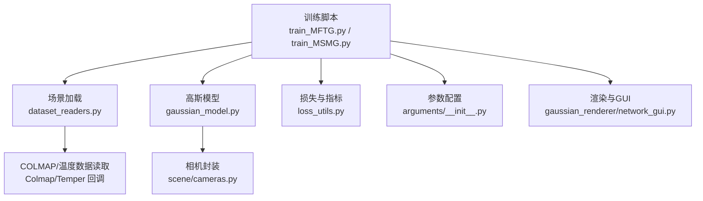
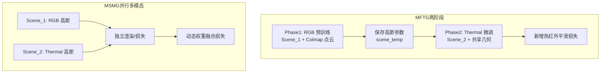
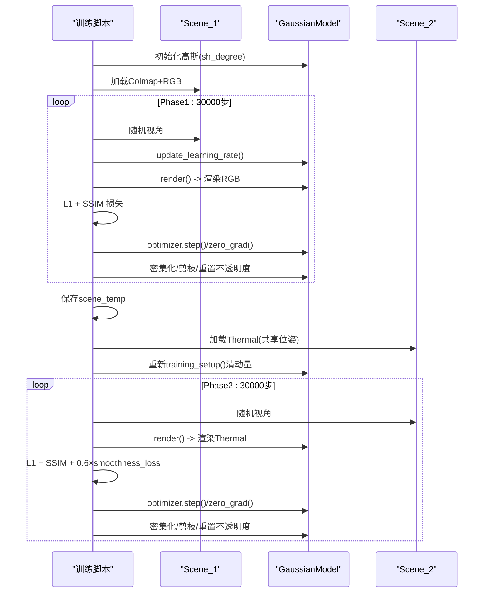
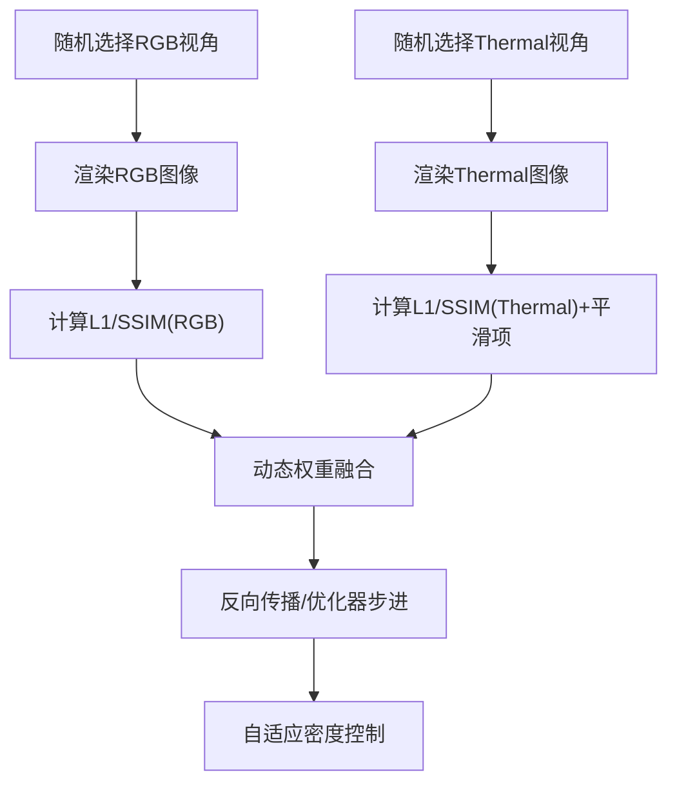
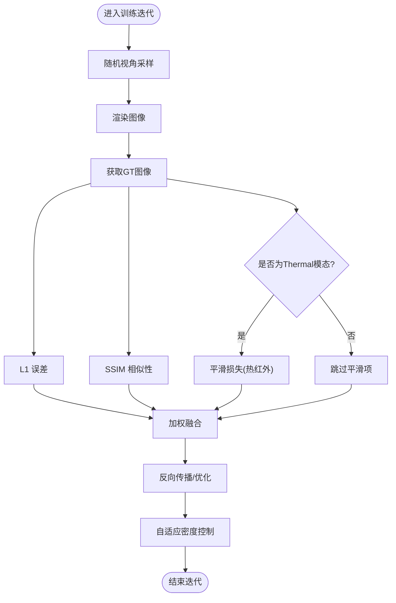
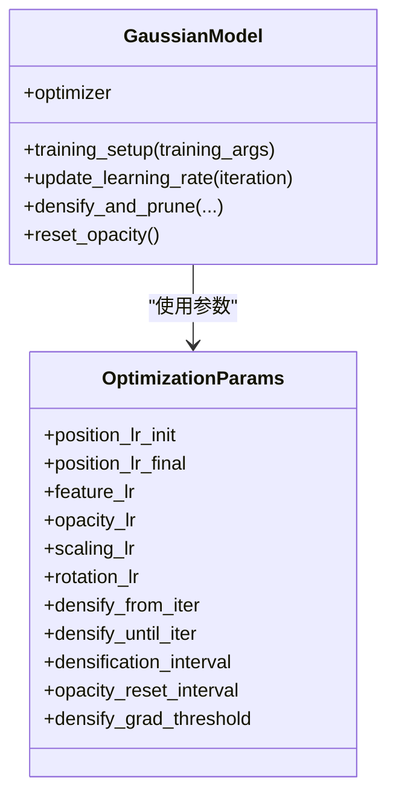
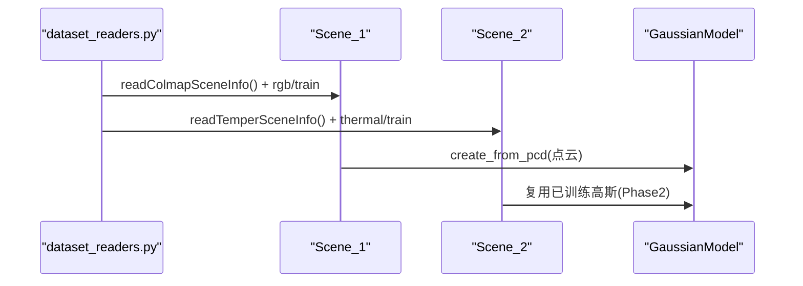
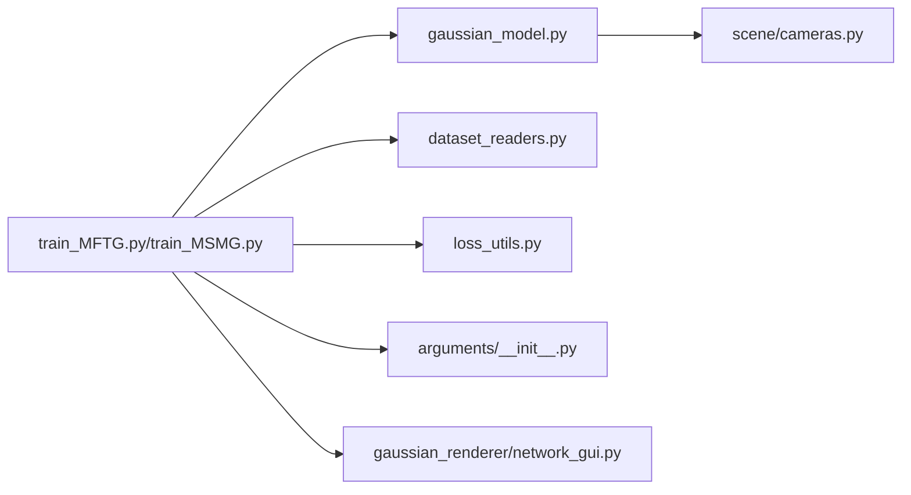

# 训练算法

<cite>
**本文引用的文件**   
- [train_MFTG.py](file://train_MFTG.py)
- [train_MSMG.py](file://train_MSMG.py)
- [MFTG-Technical-Doc.md](file://MFTG-Technical-Doc.md)
- [README.md](file://README.md)
- [gaussian_model.py](file://scene/gaussian_model.py)
- [arguments.py](file://arguments/__init__.py)
- [loss_utils.py](file://utils/loss_utils.py)
- [dataset_readers.py](file://scene/dataset_readers.py)
- [network_gui.py](file://gaussian_renderer/network_gui.py)
- [general_utils.py](file://utils/general_utils.py)
- [cameras.py](file://scene/cameras.py)
</cite>

## 目录
1. [引言](#引言)
2. [项目结构](#项目结构)
3. [核心组件](#核心组件)
4. [架构总览](#架构总览)
5. [详细组件分析](#详细组件分析)
6. [依赖关系分析](#依赖关系分析)
7. [性能考量](#性能考量)
8. [故障排查指南](#故障排查指南)
9. [结论](#结论)
10. [附录](#附录)

## 引言
本技术文档围绕 Thermal-Gaussian 的两阶段训练策略展开，系统阐述 MFTG（多模态微调高斯）与 MSMG（多套单模高斯）两种版本的训练流程、损失函数设计、优化器与学习率调度、收敛控制机制，以及热红外模态特有的平滑正则化约束。文档还提供不同版本的差异对比、参数调优建议、性能监控方法与常见问题诊断，帮助读者在 RGB 与热红外数据上高效复现实验并稳定收敛。

## 项目结构
仓库采用“脚本驱动训练 + 场景/模型/工具模块”的分层组织方式：
- 训练入口：train_MFTG.py、train_MSMG.py
- 场景与数据：scene/gaussian_model.py、scene/dataset_readers.py、scene/cameras.py
- 工具与损失：utils/loss_utils.py、utils/general_utils.py、arguments/__init__.py
- 可视化与GUI：gaussian_renderer/network_gui.py
- 文档与说明：MFTG-Technical-Doc.md、README.md

**图表来源**
- [train_MFTG.py:35-180](file://train_MFTG.py#L35-L180)
- [train_MSMG.py:33-200](file://train_MSMG.py#L33-L200)
- [dataset_readers.py:184-230](file://scene/dataset_readers.py#L184-L230)
- [gaussian_model.py:149-176](file://scene/gaussian_model.py#L149-L176)
- [loss_utils.py:20-114](file://utils/loss_utils.py#L20-L114)
- [arguments.py:71-90](file://arguments/__init__.py#L71-L90)
- [network_gui.py:26-85](file://gaussian_renderer/network_gui.py#L26-L85)

**章节来源**
- [README.md:62-117](file://README.md#L62-L117)
- [MFTG-Technical-Doc.md:308-451](file://MFTG-Technical-Doc.md#L308-L451)

## 核心组件
- 训练脚本
  - MFTG：两阶段训练，先 RGB 预训练再热红外微调；微调阶段引入热红外平滑损失。
  - MSMG：两套独立高斯并行训练，RGB 与 Thermal 各自损失加权融合。
- 高斯模型 GaussianModel
  - 标准 3DGS 参数集合（位置、颜色球谐、缩放、旋转、不透明度），支持自适应密度控制与学习率调度。
- 场景与数据
  - Colmap/Temper 数据加载回调，统一相机接口 Camera，支持训练/测试集划分。
- 损失与正则
  - L1、SSIM、热红外平滑损失 smoothness_loss；动态权重融合与固定权重组合。
- 参数与优化
  - 六组参数组（xyz、f_dc、f_rest、opacity、scaling、rotation）及指数型学习率衰减。

**章节来源**
- [train_MFTG.py:35-180](file://train_MFTG.py#L35-L180)
- [train_MSMG.py:33-179](file://train_MSMG.py#L33-L179)
- [gaussian_model.py:149-176](file://scene/gaussian_model.py#L149-L176)
- [loss_utils.py:98-114](file://utils/loss_utils.py#L98-L114)
- [arguments.py:71-90](file://arguments/__init__.py#L71-L90)

## 架构总览
两阶段训练（MFTG）与并行多模态（MSMG）在数据流、损失设计与收敛控制上存在显著差异。下图展示两类版本的核心流程与关键差异。

**图表来源**
- [train_MFTG.py:39-48](file://train_MFTG.py#L39-L48)
- [train_MFTG.py:110-115](file://train_MFTG.py#L110-L115)
- [train_MSMG.py:36-41](file://train_MSMG.py#L36-L41)
- [train_MSMG.py:125-129](file://train_MSMG.py#L125-L129)

## 详细组件分析

### MFTG：两阶段训练策略
- Phase 1（RGB 预训练）
  - 使用 Scene_1 加载 Colmap 点云与 RGB 图像，初始化高斯并进行标准 L1+SSIM 损失训练。
  - 迭代至 30000 次后保存高斯并缓存 scene_temp。
- Phase 2（Thermal 微调）
  - 使用 Scene_2 加载 Thermal 图像，复用 Phase 1 的高斯参数（几何、不透明度等固定）。
  - 损失在 Phase 1 基础上增加热红外平滑损失项，鼓励温度场平滑。
  - 重新初始化优化器（Adam 动量清零），避免 Phase 1 动量干扰 Phase 2。

**图表来源**
- [train_MFTG.py:39-48](file://train_MFTG.py#L39-L48)
- [train_MFTG.py:83-84](file://train_MFTG.py#L83-L84)
- [train_MFTG.py:106-115](file://train_MFTG.py#L106-L115)
- [train_MFTG.py:155-158](file://train_MFTG.py#L155-L158)

**章节来源**
- [train_MFTG.py:35-180](file://train_MFTG.py#L35-L180)
- [MFTG-Technical-Doc.md:113-154](file://MFTG-Technical-Doc.md#L113-L154)

### MSMG：并行多模态训练
- 双高斯并行：Scene_1 与 Scene_2 各自维护一套高斯，分别渲染 RGB 与 Thermal。
- 损失融合：基于当前高斯数量的动态权重对两路损失进行加权融合，保证两模态均衡更新。
- 优化：两套高斯分别执行密集化/剪枝与优化器步进。

**图表来源**
- [train_MSMG.py:91-111](file://train_MSMG.py#L91-L111)
- [train_MSMG.py:113-130](file://train_MSMG.py#L113-L130)
- [train_MSMG.py:168-174](file://train_MSMG.py#L168-L174)

**章节来源**
- [train_MSMG.py:33-179](file://train_MSMG.py#L33-L179)

### 损失函数与正则化
- L1 与 SSIM：通用像素级监督，提升重建保真度。
- 热红外平滑损失：对渲染图的 4 邻域差分求绝对值累加，抑制温度场噪声与突变，契合热红外物理特性。
- 多模态融合：MSMG 采用基于高斯数量的动态权重，MFTG 在 Phase 2 显式加入平滑正则。

**图表来源**
- [loss_utils.py:98-114](file://utils/loss_utils.py#L98-L114)
- [train_MFTG.py:110-115](file://train_MFTG.py#L110-L115)
- [train_MSMG.py:123-129](file://train_MSMG.py#L123-L129)

**章节来源**
- [loss_utils.py:20-114](file://utils/loss_utils.py#L20-L114)
- [MFTG-Technical-Doc.md:166-179](file://MFTG-Technical-Doc.md#L166-L179)

### 优化器与学习率调度
- 六组参数组：位置、主频带、余频带、不透明度、缩放、旋转，分别赋予不同初始学习率。
- 指数型学习率衰减：位置参数采用指数衰减，其余参数按固定策略更新。
- 收敛控制：自适应密度控制（clone/split/prune）、周期性不透明度重置、按迭代区间启用/停止密集化。

**图表来源**
- [gaussian_model.py:149-176](file://scene/gaussian_model.py#L149-L176)
- [arguments.py:71-90](file://arguments/__init__.py#L71-L90)

**章节来源**
- [gaussian_model.py:149-176](file://scene/gaussian_model.py#L149-L176)
- [arguments.py:71-90](file://arguments/__init__.py#L71-L90)

### 数据加载与场景差异
- Colmap 回调：Scene_1 使用 Colmap 数据加载 RGB 图像与点云；Scene_2 使用 Temper 回调加载 Thermal 图像，共享 COLMAP 位姿。
- 相机封装：Camera 统一存储位姿、视野角、投影矩阵与原始图像，MiniCam 用于 GUI 实时渲染。

**图表来源**
- [dataset_readers.py:184-230](file://scene/dataset_readers.py#L184-L230)
- [train_MFTG.py:39-48](file://train_MFTG.py#L39-L48)

**章节来源**
- [dataset_readers.py:184-230](file://scene/dataset_readers.py#L184-L230)
- [cameras.py:17-72](file://scene/cameras.py#L17-L72)

## 依赖关系分析
- 训练脚本依赖高斯模型与场景加载模块，通过参数组统一优化配置。
- 损失模块提供通用指标与热红外平滑损失，被训练脚本按需调用。
- GUI 通过网络接口接收实时相机参数并返回渲染结果，辅助训练可视化。

**图表来源**
- [train_MFTG.py:16-26](file://train_MFTG.py#L16-L26)
- [train_MSMG.py:16-26](file://train_MSMG.py#L16-L26)
- [gaussian_model.py:149-176](file://scene/gaussian_model.py#L149-L176)
- [arguments.py:71-90](file://arguments/__init__.py#L71-L90)
- [loss_utils.py:20-114](file://utils/loss_utils.py#L20-L114)
- [network_gui.py:26-85](file://gaussian_renderer/network_gui.py#L26-L85)

**章节来源**
- [train_MFTG.py:16-26](file://train_MFTG.py#L16-L26)
- [train_MSMG.py:16-26](file://train_MSMG.py#L16-L26)

## 性能考量
- 显存与速度
  - MFTG：两阶段复用几何，显存占用中等；Phase 2 重新初始化优化器，避免动量干扰。
  - MSMG：两套高斯并行，显存占用较高；通过动态权重融合平衡两模态。
- 分辨率与球谐阶数
  - 降低分辨率或减小 sh_degree 可缓解显存压力。
- 密集化与剪枝
  - 合理设置密集化起止迭代与梯度阈值，有助于稳定收敛与减少冗余点。

[本节为通用指导，无需特定文件引用]

## 故障排查指南
- Phase 2 RGB 渲染质量下降
  - 现象：由于共享 SH 系数，Phase 2 微调会改变颜色表示，导致 RGB 质量下降。
  - 解决：若需同时高质量 RGB/Thermal，建议使用 OMMG 分支（双通道 SH）。
- 从 checkpoint 恢复
  - 限制：checkpoint 恢复会同时恢复两个阶段，可能不符合预期。
  - 建议：完整训练，避免中途打断。
- 显存不足
  - 建议：降低分辨率、减小 sh_degree、减少训练图像数量，或考虑 OMMG 分支。

**章节来源**
- [MFTG-Technical-Doc.md:579-618](file://MFTG-Technical-Doc.md#L579-L618)

## 结论
- MFTG 通过“RGB 预训练 + Thermal 微调”的两阶段策略，在复用几何的前提下，利用热红外平滑正则提升 Thermal 渲染质量，适合资源受限或追求稳定收敛的场景。
- MSMG 通过并行多模态训练与动态权重融合，兼顾两模态学习，适合追求更高灵活性与潜在更强的双模态表达能力。
- 两种版本均依赖标准 3DGS 的高斯参数体系与自适应密度控制，结合 L1/SSIM 与热红外平滑损失，形成稳健的训练闭环。

[本节为总结性内容，无需特定文件引用]

## 附录

### 版本差异与适用场景
- MSMG：两套独立高斯并行训练，适合追求双模态均衡表达与更强泛化能力。
- MFTG：两阶段策略，显存占用中等，适合快速上线与稳定复现。
- OMMG：双通道 SH 的单套高斯，显存占用最低，适合严格资源约束场景。

**章节来源**
- [MFTG-Technical-Doc.md:26-36](file://MFTG-Technical-Doc.md#L26-L36)
- [README.md:95-97](file://README.md#L95-L97)

### 训练参数速查
- 迭代次数：每阶段 30000（默认）
- 学习率：位置（指数衰减）、颜色（固定）、不透明度、缩放、旋转（固定）
- 密集化：起止迭代、间隔、梯度阈值、不透明度重置间隔
- 热红外平滑损失权重：0.6（仅 Phase 2）

**章节来源**
- [arguments.py:71-90](file://arguments/__init__.py#L71-L90)
- [MFTG-Technical-Doc.md:493-513](file://MFTG-Technical-Doc.md#L493-L513)