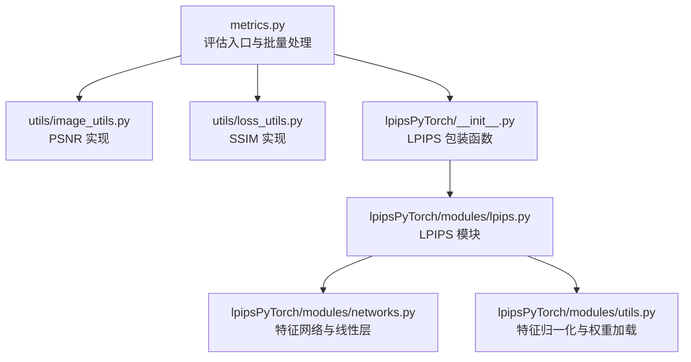
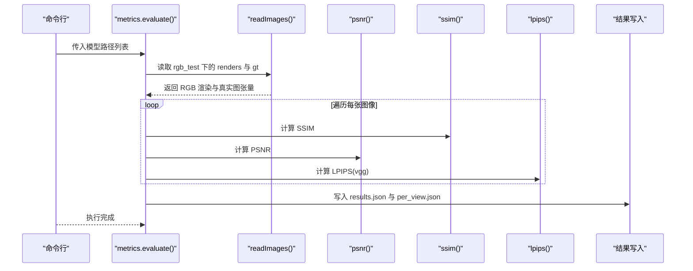
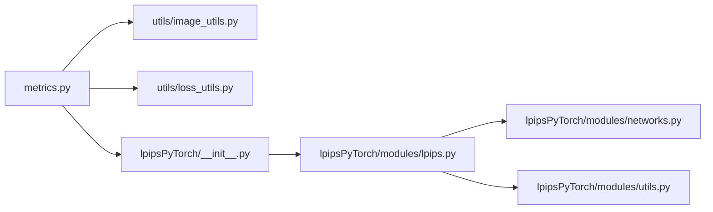

# 图像质量评估指标

<cite>
**本文引用的文件**
- [metrics.py](file://metrics.py)
- [utils/image_utils.py](file://utils/image_utils.py)
- [utils/loss_utils.py](file://utils/loss_utils.py)
- [lpipsPyTorch/modules/lpips.py](file://lpipsPyTorch/modules/lpips.py)
- [lpipsPyTorch/modules/networks.py](file://lpipsPyTorch/modules/networks.py)
- [lpipsPyTorch/modules/utils.py](file://lpipsPyTorch/modules/utils.py)
- [lpipsPyTorch/__init__.py](file://lpipsPyTorch/__init__.py)
- [README.md](file://README.md)
- [MFTG-Technical-Doc.md](file://MFTG-Technical-Doc.md)
- [full_eval.py](file://full_eval.py)
</cite>

## 目录
1. [简介](#简介)
2. [项目结构](#项目结构)
3. [核心组件](#核心组件)
4. [架构总览](#架构总览)
5. [详细组件分析](#详细组件分析)
6. [依赖关系分析](#依赖关系分析)
7. [性能考量](#性能考量)
8. [故障排查指南](#故障排查指南)
9. [结论](#结论)
10. [附录](#附录)

## 简介
本技术文档围绕 Thermal-Gaussian 项目中的图像质量评估指标展开，系统阐述 PSNR（峰值信噪比）、SSIM（结构相似性指数）与 LPIPS（感知图像相似性）三大客观指标的数学原理、实现细节与在 RGB 图像与热红外图像评估中的应用差异。文档还提供指标值的物理意义、阈值判断标准、性能基准线以及代码实现层面的数值计算优化与批量处理策略，帮助读者在实际工程中正确选择与使用这些指标。

## 项目结构
该项目基于 3D 高斯点阵渲染框架，提供多模态（RGB 与热红外）的训练、渲染与评估流程。评估指标的计算集中在 metrics.py 中，借助 utils/image_utils.py 提供的 PSNR 实现、utils/loss_utils.py 提供的 SSIM 实现，以及 lpipsPyTorch 提供的感知相似性计算模块。

图表来源
- [metrics.py:36-139](file://metrics.py#L36-L139)
- [utils/image_utils.py:17-19](file://utils/image_utils.py#L17-L19)
- [utils/loss_utils.py:36-66](file://utils/loss_utils.py#L36-L66)
- [lpipsPyTorch/__init__.py:6-21](file://lpipsPyTorch/__init__.py#L6-L21)
- [lpipsPyTorch/modules/lpips.py:8-36](file://lpipsPyTorch/modules/lpips.py#L8-L36)
- [lpipsPyTorch/modules/networks.py:12-96](file://lpipsPyTorch/modules/networks.py#L12-L96)
- [lpipsPyTorch/modules/utils.py:6-30](file://lpipsPyTorch/modules/utils.py#L6-L30)

章节来源
- [metrics.py:24-148](file://metrics.py#L24-L148)
- [README.md:13-117](file://README.md#L13-L117)
- [MFTG-Technical-Doc.md:420-428](file://MFTG-Technical-Doc.md#L420-L428)

## 核心组件
- PSNR（峰值信噪比）
  - 数学定义：衡量均方误差的倒数，常用于像素级差异分析。在本项目中，PSNR 通过对两个张量的像素差平方求均值得到 MSE，再通过对数变换得到分贝值。
  - 实现要点：使用张量形状重塑与均值操作，确保批维度与通道维度的正确聚合；在评估脚本中直接调用以获得每张图像的 PSNR 值。
- SSIM（结构相似性指数）
  - 数学定义：综合亮度、对比度与结构信息的相似性度量，窗口化计算，避免全局统计误差。在本项目中，SSIM 通过构建高斯窗口进行局部统计，结合常数项 C1/C2 稳定性因子，最终返回图像间的结构相似性分数。
  - 实现要点：窗口大小、设备迁移与 dtype 对齐；在评估脚本中对 RGB 与热红外图像分别计算，得到每张图像的 SSIM 值。
- LPIPS（感知图像相似性）
  - 数学定义：基于预训练 CNN 特征的感知相似性度量，通过特征空间的距离衡量图像差异，更贴近人类视觉感知。
  - 实现要点：支持 alex、squeeze、vgg 等网络类型；通过线性层对各层特征差异进行加权求和，并在评估脚本中统一使用 vgg 网络类型。

章节来源
- [utils/image_utils.py:17-19](file://utils/image_utils.py#L17-L19)
- [utils/loss_utils.py:36-66](file://utils/loss_utils.py#L36-L66)
- [lpipsPyTorch/modules/lpips.py:8-36](file://lpipsPyTorch/modules/lpips.py#L8-L36)
- [lpipsPyTorch/modules/networks.py:12-96](file://lpipsPyTorch/modules/networks.py#L12-L96)
- [lpipsPyTorch/modules/utils.py:6-30](file://lpipsPyTorch/modules/utils.py#L6-L30)

## 架构总览
评估流程从命令行接收多个模型路径，遍历每个场景与方法，分别读取 RGB 与热红外的渲染图与真实图，依次计算 PSNR、SSIM 与 LPIPS，并输出整体平均值与逐视角明细。

图表来源
- [metrics.py:36-139](file://metrics.py#L36-L139)
- [utils/image_utils.py:17-19](file://utils/image_utils.py#L17-L19)
- [utils/loss_utils.py:36-66](file://utils/loss_utils.py#L36-L66)
- [lpipsPyTorch/__init__.py:6-21](file://lpipsPyTorch/__init__.py#L6-L21)

## 详细组件分析

### PSNR（峰值信噪比）
- 数学原理
  - PSNR 定义为 10·log10(max²/I MSE)，其中 max 为像素最大值（此处假设为 1.0），MSE 为像素差平方的均值。PSNR 值越高，表示重建图像越接近真实图像，噪声越小。
- 实现细节
  - 在 utils/image_utils.py 中，PSNR 通过将两个张量按批维度展平并计算均值，随后取平方根与对数，得到分贝值。该实现适合批量张量输入，便于在评估脚本中对整批图像进行快速计算。
- 应用差异（RGB vs 热红外）
  - RGB 图像通常具有更高的动态范围与色彩信息，PSNR 更敏感于亮度与颜色的细微差异；热红外图像的温度分布相对平滑，PSNR 可能受温度量化与传感器噪声影响较大。在评估脚本中，两者分别计算并输出各自的平均值与逐视角明细，便于对比分析。
- 物理意义与阈值
  - PSNR 的单位为 dB，一般认为：
    - > 30 dB：图像质量优秀
    - 25–30 dB：图像质量良好
    - 20–25 dB：图像质量一般
    - < 20 dB：图像质量较差
  - 注意：不同数据集与相机响应可能影响绝对阈值，需结合具体场景设定基准线。

章节来源
- [utils/image_utils.py:17-19](file://utils/image_utils.py#L17-L19)
- [metrics.py:69-93](file://metrics.py#L69-L93)
- [metrics.py:104-129](file://metrics.py#L104-L129)

### SSIM（结构相似性指数）
- 数学原理
  - SSIM 通过计算两幅图像的亮度、对比度与结构相似性三个方面的乘积，窗口化统计避免了全局统计误差。公式包含常数项 C1、C2 以提升稳定性。
- 实现细节
  - 在 utils/loss_utils.py 中，SSIM 通过构建高斯窗口、卷积计算局部均值与方差，进而得到 SSIM 映射并返回平均值。实现考虑了设备迁移与 dtype 对齐，确保在 GPU 上高效运行。
- 应用差异（RGB vs 热红外）
  - RGB 图像包含丰富的边缘与纹理结构，SSIM 对结构信息的敏感度更高；热红外图像结构相对简单且温度分布平滑，SSIM 可能对温度边界与热点区域更敏感。评估脚本对两类图像分别计算，便于比较结构保持能力。
- 物理意义与阈值
  - SSIM 值域为 [0,1]，越接近 1 表示结构相似性越好。一般认为：
    - > 0.95：结构保持极佳
    - 0.90–0.95：结构保持良好
    - 0.80–0.90：结构保持一般
    - < 0.80：结构保持较差
  - 注意：窗口大小与常数项的选择会影响结果，需在评估脚本中保持一致。

章节来源
- [utils/loss_utils.py:36-66](file://utils/loss_utils.py#L36-L66)
- [metrics.py:69-93](file://metrics.py#L69-L93)
- [metrics.py:104-129](file://metrics.py#L104-L129)

### LPIPS（感知图像相似性）
- 数学原理
  - LPIPS 基于预训练 CNN 的特征表示，计算两幅图像在特征空间中的距离，通过线性层对各层特征差异进行加权求和，从而得到更贴近人类感知的相似性度量。
- 实现细节
  - 在 lpipsPyTorch/modules/lpips.py 中，LPIPS 模块封装了特征网络与线性层，前向传播计算特征差异并求和；在 lpipsPyTorch/modules/networks.py 中，支持 alex、squeeze、vgg 等网络类型；权重通过 lpipsPyTorch/modules/utils.py 从远程仓库下载并重命名键值。
  - 在评估脚本中，统一使用 vgg 网络类型进行 LPIPS 计算，保证跨图像的一致性。
- 应用差异（RGB vs 热红外）
  - LPIPS 对感知层面的差异更敏感，能够捕捉到 RGB 与热红外图像在外观与结构上的细微差异。评估脚本对两类图像分别计算，便于比较感知相似度。
- 物理意义与阈值
  - LPIPS 值越小表示感知相似度越高。一般认为：
    - < 0.1：感知差异很小
    - 0.1–0.2：感知差异较小
    - 0.2–0.3：感知差异中等
    - > 0.3：感知差异较大
  - 注意：不同网络类型（alex/squeeze/vgg）的阈值存在差异，需在同一网络类型下进行比较。

章节来源
- [lpipsPyTorch/modules/lpips.py:8-36](file://lpipsPyTorch/modules/lpips.py#L8-L36)
- [lpipsPyTorch/modules/networks.py:12-96](file://lpipsPyTorch/modules/networks.py#L12-L96)
- [lpipsPyTorch/modules/utils.py:6-30](file://lpipsPyTorch/modules/utils.py#L6-L30)
- [lpipsPyTorch/__init__.py:6-21](file://lpipsPyTorch/__init__.py#L6-L21)
- [metrics.py:78-78](file://metrics.py#L78-L78)
- [metrics.py:114-114](file://metrics.py#L114-L114)

### 评估脚本与批量处理策略
- 输入组织
  - 评估脚本按场景与方法遍历 rgb_test 与 thermal_test 目录，分别读取 renders 与 gt 文件夹中的图像，使用 PyTorch 张量进行批处理。
- 批量计算
  - 对每张图像依次计算 SSIM、PSNR 与 LPIPS，使用 tqdm 进度条显示处理进度；最后输出整体平均值与逐视角明细，并写入 results.json 与 per_view.json。
- 设备与内存
  - 评估脚本将张量移动至 CUDA 设备，充分利用 GPU 并行加速；在计算 LPIPS 时，模块内部也会根据输入设备创建对应设备的模型实例。

章节来源
- [metrics.py:24-148](file://metrics.py#L24-L148)
- [full_eval.py:70-75](file://full_eval.py#L70-L75)

## 依赖关系分析
- 指标实现依赖关系
  - metrics.py 依赖 utils/image_utils.py（PSNR）、utils/loss_utils.py（SSIM）、lpipsPyTorch（LPIPS）。
  - LPIPS 模块进一步依赖 lpipsPyTorch/modules/networks.py（特征网络）与 lpipsPyTorch/modules/utils.py（特征归一化与权重加载）。
- 评估流程依赖关系
  - 评估脚本通过命令行参数接收模型路径，调用评估函数；评估函数内部组织数据读取与指标计算，并输出 JSON 结果。

图表来源
- [metrics.py:17-21](file://metrics.py#L17-L21)
- [lpipsPyTorch/__init__.py:3-3](file://lpipsPyTorch/__init__.py#L3-L3)
- [lpipsPyTorch/modules/lpips.py:4-5](file://lpipsPyTorch/modules/lpips.py#L4-L5)

章节来源
- [metrics.py:17-21](file://metrics.py#L17-L21)
- [lpipsPyTorch/__init__.py:3-3](file://lpipsPyTorch/__init__.py#L3-L3)
- [lpipsPyTorch/modules/lpips.py:4-5](file://lpipsPyTorch/modules/lpips.py#L4-L5)

## 性能考量
- 计算效率
  - PSNR 与 SSIM 均为纯张量运算，适合 GPU 并行；LPIPS 通过预训练网络与线性层实现，计算开销较大，建议在批处理时尽量减少网络切换与重复初始化。
- 内存管理
  - 评估脚本将图像张量移动至 CUDA 设备，避免频繁的 CPU/GPU 数据传输；LPIPS 模块在初始化时会下载权重并加载到对应设备，建议在批量评估前预热设备。
- 批处理策略
  - 使用 PyTorch 张量进行批处理，减少 Python 循环开销；在评估脚本中通过 tqdm 提供进度反馈，便于监控长时间运行任务。

[本节为通用性能指导，无需特定文件来源]

## 故障排查指南
- 设备与库版本
  - 确保 PyTorch 与 CUDA 版本兼容；若出现 LPIPS 权重下载失败，检查网络连接与代理设置。
- 输入格式
  - 确保 renders 与 gt 文件夹中的图像名称一一对应；评估脚本按文件名顺序读取，名称不匹配会导致错误。
- 输出路径
  - 评估脚本会在每个场景目录生成 results.json 与 per_view.json，确认输出权限与磁盘空间充足。
- 指标异常
  - 若 PSNR 或 SSIM 出现 NaN 或 Inf，检查输入图像是否为有效张量（如非零尺寸、合法像素值范围）；LPIPS 异常可能与网络类型或权重加载有关。

章节来源
- [metrics.py:133-139](file://metrics.py#L133-L139)
- [lpipsPyTorch/modules/utils.py:11-30](file://lpipsPyTorch/modules/utils.py#L11-L30)

## 结论
本项目在 Thermal-Gaussian 框架下提供了完整的 RGB 与热红外图像质量评估流程，涵盖 PSNR、SSIM 与 LPIPS 三大指标。通过统一的数据读取、批处理与结果输出机制，评估脚本能够高效地对多场景、多方法的渲染结果进行对比分析。在实际应用中，应结合具体数据集与任务需求，合理选择与解释指标阈值，并注意不同模态在像素级差异、结构保持与感知相似度方面的差异表现。

[本节为总结性内容，无需特定文件来源]

## 附录
- 指标阈值参考
  - PSNR（dB）：> 30 优秀；25–30 良好；20–25 一般；< 20 较差
  - SSIM（0–1）：> 0.95 极佳；0.90–0.95 良好；0.80–0.90 一般；< 0.80 较差
  - LPIPS（0–1）：< 0.1 很小；0.1–0.2 小；0.2–0.3 中等；> 0.3 较大
- 评估流程建议
  - 在相同网络类型与窗口参数下进行指标比较；对 RGB 与热红外分别建立基准线；定期检查输出 JSON 文件以验证评估完整性。

[本节为补充信息，无需特定文件来源]