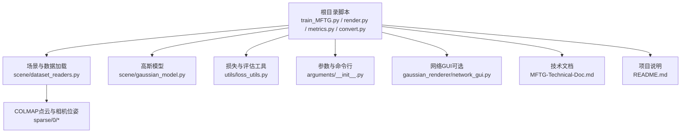
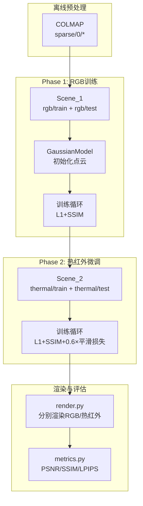
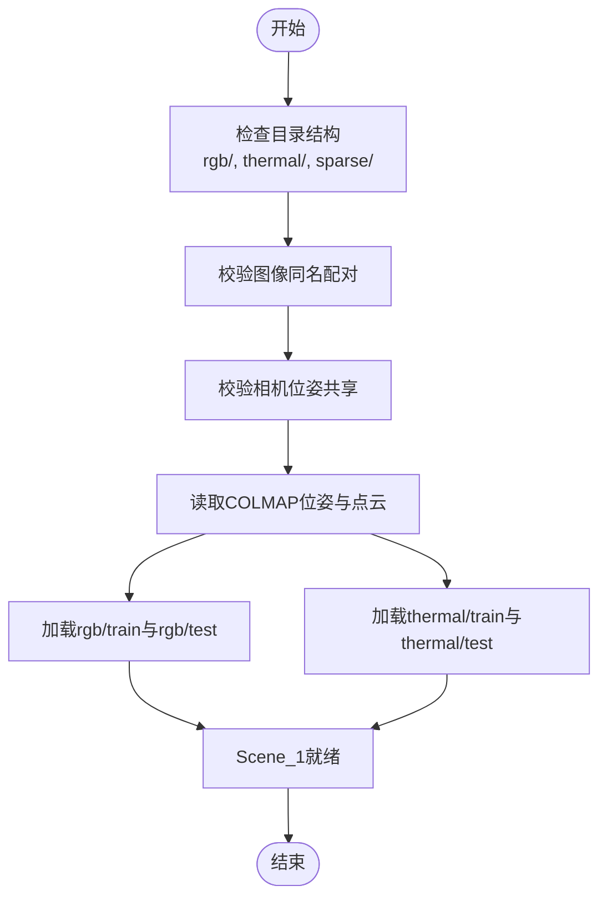
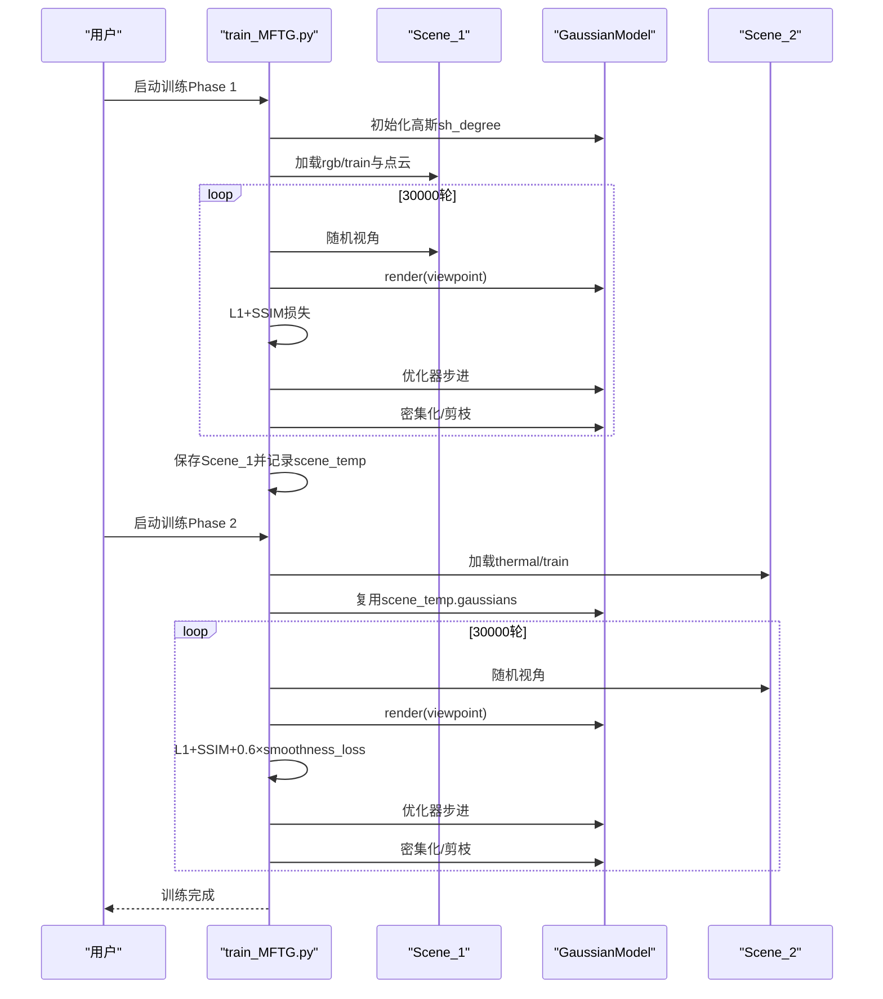
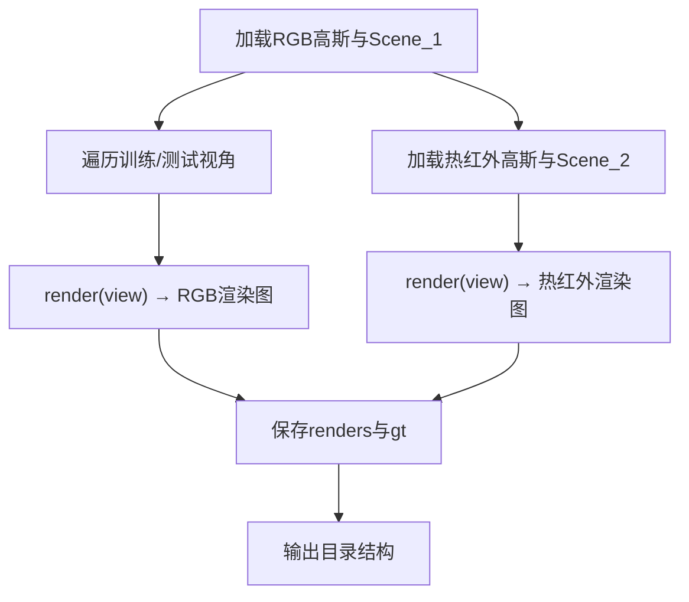
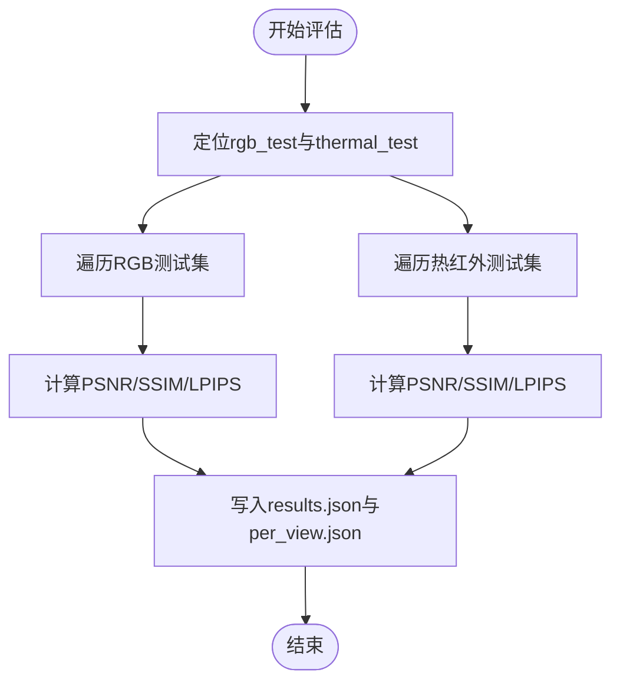
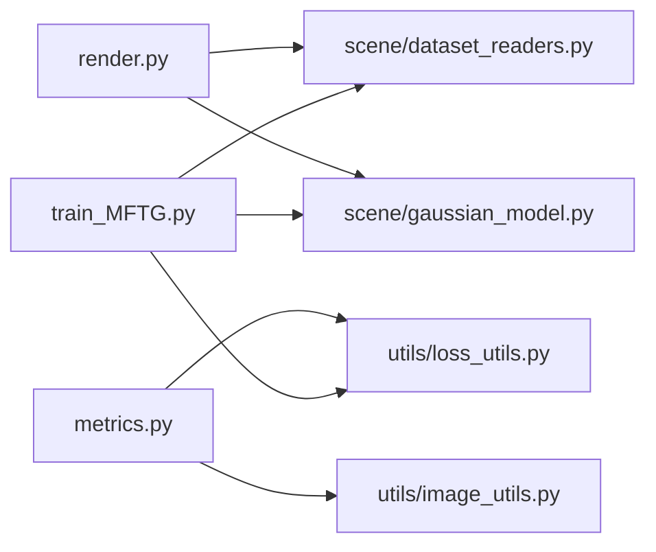

# 多模态评估体系

<cite>
**本文引用的文件**
- [README.md](file://README.md)
- [MFTG-Technical-Doc.md](file://MFTG-Technical-Doc.md)
- [train_MFTG.py](file://train_MFTG.py)
- [metrics.py](file://metrics.py)
- [render.py](file://render.py)
- [scene/gaussian_model.py](file://scene/gaussian_model.py)
- [scene/dataset_readers.py](file://scene/dataset_readers.py)
- [utils/loss_utils.py](file://utils/loss_utils.py)
- [convert.py](file://convert.py)
- [arguments/__init__.py](file://arguments/__init__.py)
- [gaussian_renderer/network_gui.py](file://gaussian_renderer/network_gui.py)
</cite>

## 目录
1. [引言](#引言)
2. [项目结构](#项目结构)
3. [核心组件](#核心组件)
4. [架构总览](#架构总览)
5. [详细组件分析](#详细组件分析)
6. [依赖关系分析](#依赖关系分析)
7. [性能考量](#性能考量)
8. [故障排查指南](#故障排查指南)
9. [结论](#结论)
10. [附录](#附录)

## 引言
本文件面向“Thermal-Gaussian多模态评估体系”，围绕RGB图像与热红外图像的联合评估展开，系统阐述模态间一致性检验、跨模态相似度分析与多传感器融合质量评估的方法论与实现细节。文档基于仓库中的MFTG（多模态微调高斯）方案，聚焦于两阶段训练流程、数据集组织结构、评估指标计算、渲染与可视化输出，并给出评估报告模板、统计分析方法与可视化技巧，帮助读者在相同数据格式与流程约束下开展可复现的多模态评估。

## 项目结构
仓库采用功能分层组织：训练与评估脚本位于根目录；场景加载与高斯模型定义在scene与utils子模块；渲染与指标计算分别由render.py与metrics.py负责；convert.py用于COLMAP预处理；MFTG技术文档提供算法与流程的深入说明；README提供总体介绍与运行示例。

图表来源
- [train_MFTG.py:1-273](file://train_MFTG.py#L1-L273)
- [render.py:1-76](file://render.py#L1-L76)
- [metrics.py:1-148](file://metrics.py#L1-L148)
- [convert.py:1-125](file://convert.py#L1-L125)
- [scene/dataset_readers.py:1-311](file://scene/dataset_readers.py#L1-L311)
- [scene/gaussian_model.py:1-407](file://scene/gaussian_model.py#L1-L407)
- [utils/loss_utils.py:1-114](file://utils/loss_utils.py#L1-L114)
- [arguments/__init__.py:1-113](file://arguments/__init__.py#L1-L113)
- [gaussian_renderer/network_gui.py:1-86](file://gaussian_renderer/network_gui.py#L1-L86)
- [MFTG-Technical-Doc.md:1-618](file://MFTG-Technical-Doc.md#L1-L618)
- [README.md:1-167](file://README.md#L1-L167)

章节来源
- [README.md:18-120](file://README.md#L18-L120)
- [MFTG-Technical-Doc.md:39-94](file://MFTG-Technical-Doc.md#L39-L94)

## 核心组件
- 训练与评估流水线
  - 训练：两阶段训练（RGB→热红外微调），分别加载RGB与热红外场景，共享COLMAP位姿与点云，热红外阶段引入平滑损失。
  - 渲染：分别对RGB高斯与热红外高斯进行渲染，生成renders与gt目录。
  - 评估：计算PSNR、SSIM、LPIPS，输出results.json与per_view.json。
- 场景与数据加载
  - Colmap场景读取：统一读取相机内外参与点云，分别从rgb/train、thermal/train加载图像。
  - 温度场景读取：与Colmap一致，但图像来自thermal目录。
- 高斯模型
  - 标准3DGS高斯集合，包含位置、尺度、旋转、不透明度与球谐颜色系数；热红外微调阶段共享RGB阶段的颜色参数，仅更新颜色以适配温度场。
- 损失与评估
  - L1与SSIM组合损失；热红外阶段增加平滑损失；评估指标基于torchvision与lpips库。

章节来源
- [train_MFTG.py:35-163](file://train_MFTG.py#L35-L163)
- [render.py:42-59](file://render.py#L42-L59)
- [metrics.py:36-139](file://metrics.py#L36-L139)
- [scene/dataset_readers.py:136-230](file://scene/dataset_readers.py#L136-L230)
- [scene/gaussian_model.py:44-148](file://scene/gaussian_model.py#L44-L148)
- [utils/loss_utils.py:20-114](file://utils/loss_utils.py#L20-L114)

## 架构总览
下图展示了MFTG在主分支下的整体数据流与处理链路：COLMAP离线预处理生成点云与位姿；Phase 1仅用RGB训练高斯；Phase 2复用高斯，仅微调颜色以适配热红外；渲染与评估分别在两阶段后独立执行。

图表来源
- [MFTG-Technical-Doc.md:185-223](file://MFTG-Technical-Doc.md#L185-L223)
- [train_MFTG.py:39-48](file://train_MFTG.py#L39-L48)
- [scene/dataset_readers.py:136-230](file://scene/dataset_readers.py#L136-L230)
- [render.py:42-59](file://render.py#L42-L59)
- [metrics.py:36-139](file://metrics.py#L36-L139)

## 详细组件分析

### 数据集组织与加载
- 目录结构
  - 输入：input/（原始RGB）
  - 训练/测试：rgb/train、rgb/test、thermal/train、thermal/test
  - COLMAP输出：sparse/0/cameras.bin、images.bin、points3D.bin
- 数据配对与注册
  - RGB与热红外图像需同名配对；热红外共享RGB的相机位姿；建议像素级空间配准或MSX融合。
- 场景加载
  - Colmap场景：从sparse/0读取位姿与点云，分别从rgb/train与thermal/train加载图像。
  - 温度场景：与Colmap一致，图像来自thermal目录。

图表来源
- [README.md:28-60](file://README.md#L28-L60)
- [MFTG-Technical-Doc.md:41-74](file://MFTG-Technical-Doc.md#L41-L74)
- [scene/dataset_readers.py:136-230](file://scene/dataset_readers.py#L136-L230)

章节来源
- [README.md:28-60](file://README.md#L28-L60)
- [MFTG-Technical-Doc.md:41-74](file://MFTG-Technical-Doc.md#L41-L74)
- [scene/dataset_readers.py:136-230](file://scene/dataset_readers.py#L136-L230)

### 两阶段训练流程
- Phase 1（RGB）：使用Colmap点云初始化高斯，随机视角渲染RGB，L1+SSIM损失，自适应密度控制。
- Phase 2（热红外）：复用Phase 1高斯，仅微调颜色以适配热红外；引入0.6×平滑损失，鼓励温度场平滑过渡。
- 关键差异：Scene_1/Scene_2分别加载rgb与thermal；热红外阶段添加平滑损失；保存路径与TensorBoard标签区分。

图表来源
- [MFTG-Technical-Doc.md:113-153](file://MFTG-Technical-Doc.md#L113-L153)
- [train_MFTG.py:39-48](file://train_MFTG.py#L39-L48)
- [train_MFTG.py:106-158](file://train_MFTG.py#L106-L158)

章节来源
- [MFTG-Technical-Doc.md:113-153](file://MFTG-Technical-Doc.md#L113-L153)
- [train_MFTG.py:39-48](file://train_MFTG.py#L39-L48)
- [train_MFTG.py:106-158](file://train_MFTG.py#L106-L158)

### 渲染与可视化
- 渲染流程：分别加载Scene_1（RGB高斯）与Scene_2（热红外高斯），对训练/测试集视角调用render函数，输出renders与gt两张图。
- 输出目录：rgb_train/ours_*/renders与gt、thermal_train/ours_*/renders与gt，以及对应rgb_test与thermal_test。

图表来源
- [render.py:42-59](file://render.py#L42-L59)
- [MFTG-Technical-Doc.md:454-489](file://MFTG-Technical-Doc.md#L454-L489)

章节来源
- [render.py:42-59](file://render.py#L42-L59)
- [MFTG-Technical-Doc.md:454-489](file://MFTG-Technical-Doc.md#L454-L489)

### 评估指标与统计分析
- 指标计算：PSNR、SSIM、LPIPS，分别在rgb_test与thermal_test目录下计算平均值与逐视角明细。
- 输出文件：results.json（场景级均值）、per_view.json（逐视角明细）。
- 统计方法：均值、标准差、分位数；可扩展至跨场景对比与显著性检验。

图表来源
- [metrics.py:36-139](file://metrics.py#L36-L139)

章节来源
- [metrics.py:36-139](file://metrics.py#L36-L139)

### 模态一致性与跨模态相似度
- 模态一致性检验：通过热红外平滑损失约束温度场连续性；通过SSIM与LPIPS衡量跨模态相似度。
- 跨模态相似度：LPIPS作为感知相似度指标；SSIM衡量结构相似性；PSNR衡量峰值信噪比。
- 多传感器融合质量：基于渲染图与GT的误差指标，结合温度场平滑先验，评估融合后温度保真度。

章节来源
- [utils/loss_utils.py:98-114](file://utils/loss_utils.py#L98-L114)
- [metrics.py:75-114](file://metrics.py#L75-L114)

### 温度一致性与热特征保真度
- 温度一致性：利用平滑损失抑制温度场噪声与异常跳变，提升温度一致性。
- 热特征保真度：通过L1与SSIM衡量热红外渲染图与GT的像素级与结构级保真度；LPIPS提供感知一致性。

章节来源
- [MFTG-Technical-Doc.md:166-179](file://MFTG-Technical-Doc.md#L166-L179)
- [utils/loss_utils.py:98-114](file://utils/loss_utils.py#L98-L114)

### 多模态配准精度验证
- 配准要求：RGB与热红外图像需同名且共享COLMAP位姿；建议像素级对齐或MSX融合。
- 验证方法：对比渲染图与GT的空间一致性，结合评估指标变化判断配准质量。

章节来源
- [MFTG-Technical-Doc.md:69-74](file://MFTG-Technical-Doc.md#L69-L74)
- [README.md:31-60](file://README.md#L31-L60)

### 评估报告模板与可视化技巧
- 报告模板建议字段
  - 基本信息：场景名称、数据集版本、相机位姿来源、COLMAP版本、训练参数。
  - 指标汇总：RGB与热红外的PSNR、SSIM、LPIPS均值与标准差。
  - 视角级明细：per_view.json中的逐视角指标，便于定位异常视角。
  - 可视化：renders与gt对比图、温度场平滑性示例、误差热力图。
- 可视化技巧
  - renders与gt并排对比，突出结构与纹理差异。
  - 使用灰度或伪彩映射展示热红外渲染图，标注典型区域。
  - 统计直方图与箱线图展示指标分布，辅助异常检测。

章节来源
- [metrics.py:133-139](file://metrics.py#L133-L139)
- [MFTG-Technical-Doc.md:454-489](file://MFTG-Technical-Doc.md#L454-L489)

## 依赖关系分析
- 组件耦合
  - train_MFTG.py依赖scene/dataset_readers.py（场景加载）、scene/gaussian_model.py（高斯模型）、utils/loss_utils.py（损失函数）。
  - render.py依赖scene/gaussian_model.py与gaussian_renderer（渲染器）。
  - metrics.py依赖utils/image_utils（PSNR）与utils/loss_utils（SSIM/LPIPS）。
- 外部依赖
  - COLMAP用于SfM重建与位姿估计；OpenCV/Pillow用于图像处理；TensorBoard用于日志可视化（可选）。

图表来源
- [train_MFTG.py:19-26](file://train_MFTG.py#L19-L26)
- [render.py:13-23](file://render.py#L13-L23)
- [metrics.py:17-21](file://metrics.py#L17-L21)

章节来源
- [train_MFTG.py:19-26](file://train_MFTG.py#L19-L26)
- [render.py:13-23](file://render.py#L13-L23)
- [metrics.py:17-21](file://metrics.py#L17-L21)

## 性能考量
- 显存与速度
  - MFTG两阶段训练分别加载RGB与热红外高斯，显存占用中等；若显存紧张，可降低分辨率或减少SH阶数。
- 收敛与稳定性
  - Phase 2引入平滑损失有助于稳定热红外训练；合理设置密度控制与不透明度重置周期可避免过拟合。
- 可视化与调试
  - TensorBoard可用于训练曲线监控；network_gui支持交互式渲染（可选）。

章节来源
- [MFTG-Technical-Doc.md:580-618](file://MFTG-Technical-Doc.md#L580-L618)
- [gaussian_renderer/network_gui.py:26-86](file://gaussian_renderer/network_gui.py#L26-L86)

## 故障排查指南
- 数据准备
  - 确认目录结构与图像同名配对；确保COLMAP输出的sparse/0存在且包含cameras.bin、images.bin、points3D.bin。
- 训练问题
  - 若Phase 2导致RGB质量下降属预期；如需同时高质量渲染RGB与热红外，考虑OMMG分支。
  - 优化器状态重置：Phase 2前需重新初始化优化器以避免动量干扰。
- 渲染与评估
  - 确认render.py加载了正确的迭代与高斯；评估前确保renders与gt目录存在且命名一致。
- 显存不足
  - 降低分辨率、减少SH阶数、减小训练图像数量；必要时切换至OMMG分支。

章节来源
- [MFTG-Technical-Doc.md:579-618](file://MFTG-Technical-Doc.md#L579-L618)
- [README.md:119-120](file://README.md#L119-L120)

## 结论
本评估体系以MFTG为核心，提供RGB与热红外图像的联合评估框架：通过COLMAP位姿与点云实现多传感器空间对齐，两阶段训练分别优化RGB外观与热红外温度场，结合平滑损失与多指标评估，形成可复现、可对比的多模态质量评测流程。配合标准化的报告模板与可视化技巧，可支撑后续研究的基准化比较与工程落地。

## 附录
- COLMAP预处理
  - convert.py自动化执行特征提取、匹配、Mapper与图像去畸变，输出统一的sparse/0目录。
- 参数与命令行
  - arguments模块集中管理模型、管道与优化参数；命令行参数可通过-cfg_args恢复。

章节来源
- [convert.py:31-78](file://convert.py#L31-L78)
- [arguments/__init__.py:47-91](file://arguments/__init__.py#L47-L91)