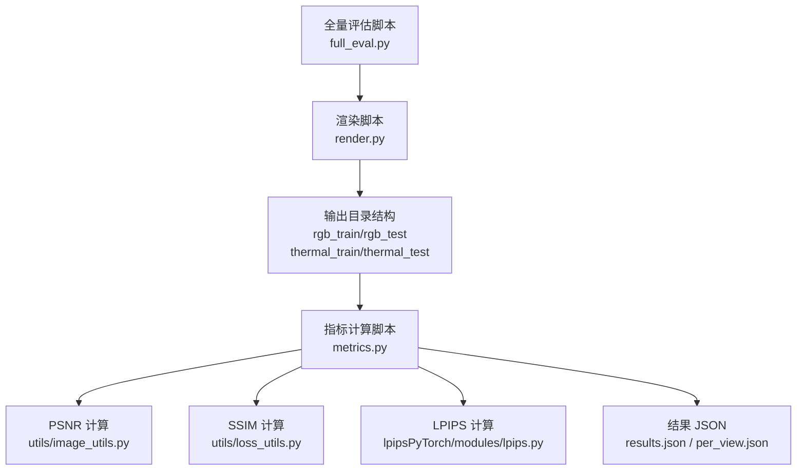
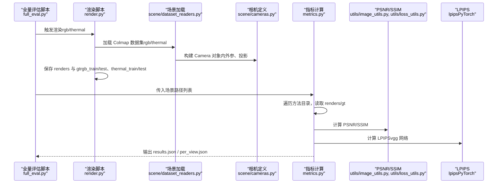
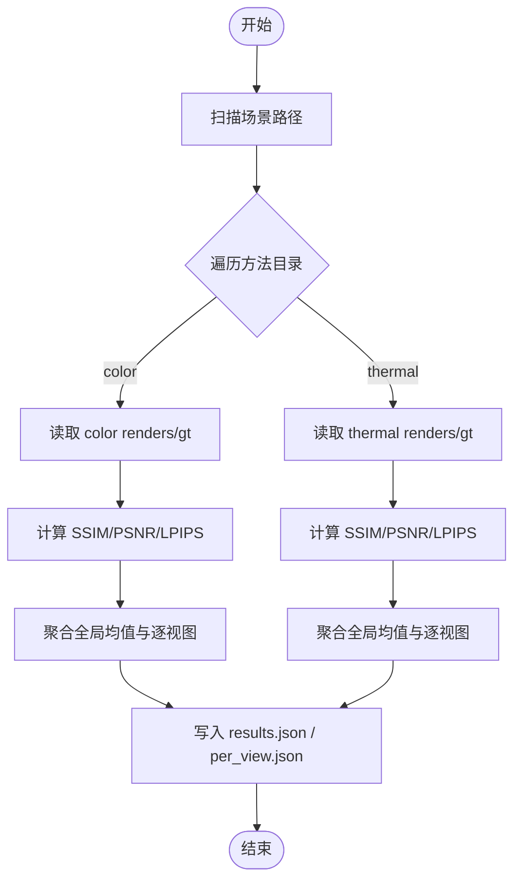
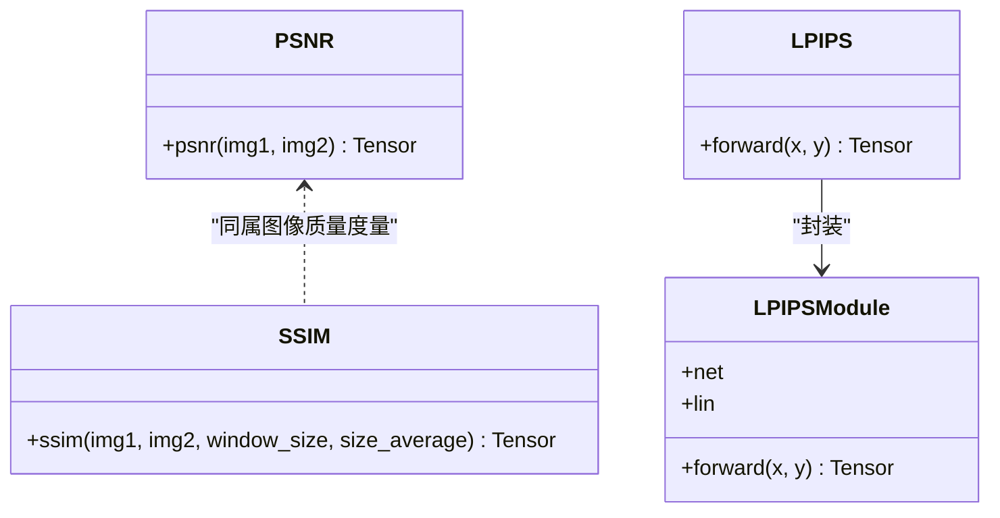
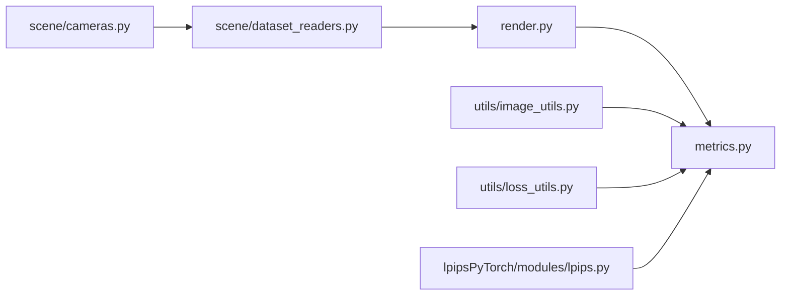

# 评估指标

<cite>
**本文引用的文件**
- [metrics.py](file://metrics.py)
- [full_eval.py](file://full_eval.py)
- [render.py](file://render.py)
- [README.md](file://README.md)
- [utils/image_utils.py](file://utils/image_utils.py)
- [utils/loss_utils.py](file://utils/loss_utils.py)
- [lpipsPyTorch/modules/lpips.py](file://lpipsPyTorch/modules/lpips.py)
- [lpipsPyTorch/__init__.py](file://lpipsPyTorch/__init__.py)
- [scene/dataset_readers.py](file://scene/dataset_readers.py)
- [scene/cameras.py](file://scene/cameras.py)
- [scene/gaussian_model.py](file://scene/gaussian_model.py)
</cite>

## 目录
1. [简介](#简介)
2. [项目结构](#项目结构)
3. [核心组件](#核心组件)
4. [架构总览](#架构总览)
5. [详细组件分析](#详细组件分析)
6. [依赖关系分析](#依赖关系分析)
7. [性能考量](#性能考量)
8. [故障排查指南](#故障排查指南)
9. [结论](#结论)
10. [附录](#附录)

## 简介
本文件面向 Thermal-Gaussian 多模态评估系统，围绕客观评价指标（PSNR、SSIM、LPIPS）与热红外图像评估的特殊性，系统梳理从渲染到指标计算、统计分析与结果可视化的完整流程。文档同时给出评估报告生成、跨模型对比分析与调试建议，帮助读者快速上手并深入理解评估体系。

## 项目结构
评估相关的关键模块分布如下：
- 渲染阶段：render.py 负责生成 rgb 与 thermal 的渲染图与对应 GT，输出至统一目录结构
- 指标计算：metrics.py 遍历指定场景路径，按方法名组织 color 与 thermal 的 renders 与 gt，调用 utils 中的 PSNR、SSIM 与 LPIPS 计算器
- 图像度量工具：utils/image_utils.py 提供 PSNR；utils/loss_utils.py 提供 SSIM；lpipsPyTorch 提供 LPIPS
- 场景加载：scene/dataset_readers.py 支持 rgb 与 thermal 的 Colmap 数据集读取；scene/cameras.py 定义相机参数与投影矩阵
- 全流程脚本：full_eval.py 提供训练、渲染、指标计算的一键化执行流程

图表来源
- [full_eval.py:39-75](file://full_eval.py#L39-L75)
- [render.py:25-60](file://render.py#L25-L60)
- [metrics.py:36-148](file://metrics.py#L36-L148)
- [utils/image_utils.py:17-19](file://utils/image_utils.py#L17-L19)
- [utils/loss_utils.py:36-66](file://utils/loss_utils.py#L36-L66)
- [lpipsPyTorch/modules/lpips.py:8-37](file://lpipsPyTorch/modules/lpips.py#L8-L37)

章节来源
- [README.md:62-117](file://README.md#L62-L117)
- [full_eval.py:20-75](file://full_eval.py#L20-L75)
- [render.py:25-60](file://render.py#L25-L60)
- [metrics.py:24-148](file://metrics.py#L24-L148)

## 核心组件
- 渲染与数据组织
  - render.py 会为 rgb 与 thermal 分别构建场景对象，按 train/test 划分输出 renders 与 gt，形成标准目录结构
- 指标计算管线
  - metrics.py 读取 renders 与 gt，逐张计算 SSIM、PSNR、LPIPS，汇总全局均值与逐视图明细
- 度量函数实现
  - PSNR：基于均方误差的对数变换
  - SSIM：基于局部窗口的亮度、对比度与结构相似性联合评分
  - LPIPS：基于预训练特征网络与线性层的感知相似性度量

章节来源
- [render.py:25-60](file://render.py#L25-L60)
- [metrics.py:36-148](file://metrics.py#L36-L148)
- [utils/image_utils.py:17-19](file://utils/image_utils.py#L17-L19)
- [utils/loss_utils.py:36-66](file://utils/loss_utils.py#L36-L66)
- [lpipsPyTorch/modules/lpips.py:8-37](file://lpipsPyTorch/modules/lpips.py#L8-L37)

## 架构总览
下图展示从渲染到指标计算的整体流程与模块交互：

图表来源
- [full_eval.py:39-75](file://full_eval.py#L39-L75)
- [render.py:25-60](file://render.py#L25-L60)
- [scene/dataset_readers.py:136-230](file://scene/dataset_readers.py#L136-L230)
- [scene/cameras.py:17-58](file://scene/cameras.py#L17-L58)
- [metrics.py:36-148](file://metrics.py#L36-L148)
- [utils/image_utils.py:17-19](file://utils/image_utils.py#L17-L19)
- [utils/loss_utils.py:36-66](file://utils/loss_utils.py#L36-L66)
- [lpipsPyTorch/modules/lpips.py:8-37](file://lpipsPyTorch/modules/lpips.py#L8-L37)

## 详细组件分析

### 组件A：指标计算与结果组织（metrics.py）
- 功能要点
  - 遍历每个场景目录，分别处理 rgb_test 与 thermal_test 下的方法集合
  - 读取 renders 与 gt，计算 SSIM、PSNR、LPIPS，并记录逐视图得分
  - 将全局均值与逐视图明细写入 results.json 与 per_view.json
- 关键流程
  - 目录扫描与图像读取
  - 指标批量计算与均值统计
  - 结果序列化输出

图表来源
- [metrics.py:36-148](file://metrics.py#L36-L148)

章节来源
- [metrics.py:24-148](file://metrics.py#L24-L148)

### 组件B：渲染与数据准备（render.py）
- 功能要点
  - 为 rgb 与 thermal 场景分别实例化高斯模型与场景对象
  - 按 train/test 划分渲染 renders 与保存 gt
  - 输出目录结构包含 rgb_train/rgb_test 与 thermal_train/thermal_test
- 使用建议
  - 确保输入数据满足 README 的目录规范（rgb/thermal/test/train 与 sparse）

章节来源
- [render.py:25-60](file://render.py#L25-L60)
- [README.md:28-61](file://README.md#L28-L61)

### 组件C：度量函数实现
- PSNR（utils/image_utils.py）
  - 基于均方误差的对数变换，衡量像素级重建误差
- SSIM（utils/loss_utils.py）
  - 使用高斯窗口在局部窗口内计算亮度、对比度与结构相似性，避免单像素噪声影响
- LPIPS（lpipsPyTorch/modules/lpips.py）
  - 基于预训练特征网络（如 vgg）提取特征，经线性层加权后计算特征域距离

图表来源
- [utils/image_utils.py:17-19](file://utils/image_utils.py#L17-L19)
- [utils/loss_utils.py:36-66](file://utils/loss_utils.py#L36-L66)
- [lpipsPyTorch/modules/lpips.py:8-37](file://lpipsPyTorch/modules/lpips.py#L8-L37)

章节来源
- [utils/image_utils.py:17-19](file://utils/image_utils.py#L17-L19)
- [utils/loss_utils.py:36-66](file://utils/loss_utils.py#L36-L66)
- [lpipsPyTorch/modules/lpips.py:8-37](file://lpipsPyTorch/modules/lpips.py#L8-L37)

### 组件D：场景与相机（scene/dataset_readers.py, scene/cameras.py）
- 场景加载
  - 支持 rgb 与 thermal 的 Colmap 数据集读取，分别返回 train/test 相机集合
- 相机定义
  - Camera 类维护内外参与投影矩阵，支持透明遮罩与缩放平移

章节来源
- [scene/dataset_readers.py:136-230](file://scene/dataset_readers.py#L136-L230)
- [scene/cameras.py:17-58](file://scene/cameras.py#L17-L58)

### 组件E：评估流程与全量脚本（full_eval.py）
- 流程
  - 可选择跳过训练/渲染/指标计算，按需组合执行
  - 自动拼接命令行参数并调用 train.py、render.py、metrics.py
- 使用建议
  - 在已有训练模型基础上仅运行渲染与指标计算时，设置相应开关

章节来源
- [full_eval.py:20-75](file://full_eval.py#L20-L75)

## 依赖关系分析
- 指标计算对渲染输出的依赖
  - metrics.py 依赖 render.py 生成的 renders 与 gt 目录结构
- 指标计算对工具函数的依赖
  - PSNR/SSIM/LPIPS 分别来自 utils 与 lpipsPyTorch
- 场景加载对数据格式的依赖
  - dataset_readers.py 依赖 Colmap 的 sparse 文件与 rgb/thermal 子目录

图表来源
- [render.py:25-60](file://render.py#L25-L60)
- [metrics.py:36-148](file://metrics.py#L36-L148)
- [scene/dataset_readers.py:136-230](file://scene/dataset_readers.py#L136-L230)
- [scene/cameras.py:17-58](file://scene/cameras.py#L17-L58)
- [utils/image_utils.py:17-19](file://utils/image_utils.py#L17-L19)
- [utils/loss_utils.py:36-66](file://utils/loss_utils.py#L36-L66)
- [lpipsPyTorch/modules/lpips.py:8-37](file://lpipsPyTorch/modules/lpips.py#L8-L37)

章节来源
- [metrics.py:36-148](file://metrics.py#L36-L148)
- [render.py:25-60](file://render.py#L25-L60)
- [scene/dataset_readers.py:136-230](file://scene/dataset_readers.py#L136-L230)

## 性能考量
- 计算复杂度
  - PSNR：O(HW) 每像素计算，整体 O(NHW)，N 为图像数量
  - SSIM：窗口滑动卷积近似 O(K·NHW)，K 为窗口大小
  - LPIPS：特征前向传播 O(N·feat_cost)，受网络深度与通道数影响
- 并行与批处理
  - metrics.py 已采用 GPU 张量批处理与 tqdm 进度条，建议确保输入图像尺寸一致以提升吞吐
- 内存占用
  - 大分辨率输入建议在渲染前控制分辨率，遵循 README 的建议

## 故障排查指南
- 目录结构不匹配
  - 症状：metrics.py 无法读取 renders/gt 或报错
  - 排查：确认 rgb_test/thermal_test 下存在方法目录，且每个方法包含 renders 与 gt 子目录
- 设备与显存问题
  - 症状：GPU 内存不足或设备不兼容
  - 排查：检查 torch.cuda 是否可用，必要时降低输入分辨率或批大小
- 指标计算异常
  - 症状：SSIM/PSNR/LPIPS 返回 NaN/Inf
  - 排查：检查输入图像是否归一化至 [0,1]，确保 renders 与 gt 尺寸一致
- 全流程执行失败
  - 症状：render.py 或 metrics.py 报错
  - 排查：核对 README 的运行顺序与参数，确认已正确生成 renders 与 gt

章节来源
- [README.md:62-117](file://README.md#L62-L117)
- [metrics.py:137-139](file://metrics.py#L137-L139)

## 结论
Thermal-Gaussian 的评估体系以标准化的渲染输出为基础，结合 PSNR、SSIM、LPIPS 三类指标，覆盖像素级误差、感知结构与语义相似性，适用于 RGB 与热红外双模态的综合评估。通过全量脚本可一键完成训练、渲染与指标计算，便于开展大规模对比实验与结果复现。

## 附录
- 评估报告生成
  - 指标计算完成后，results.json 提供全局均值，per_view.json 提供逐视图明细，可用于进一步统计分析与可视化
- 性能对比分析
  - 建议按场景与方法维度对比均值与方差，结合 per_view.json 进行异常样本识别
- 调试工具使用
  - 使用 tqdm 进度条观察计算进度；若出现异常，可逐步注释指标计算分支定位问题