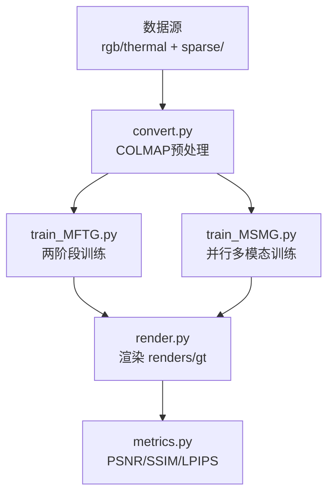
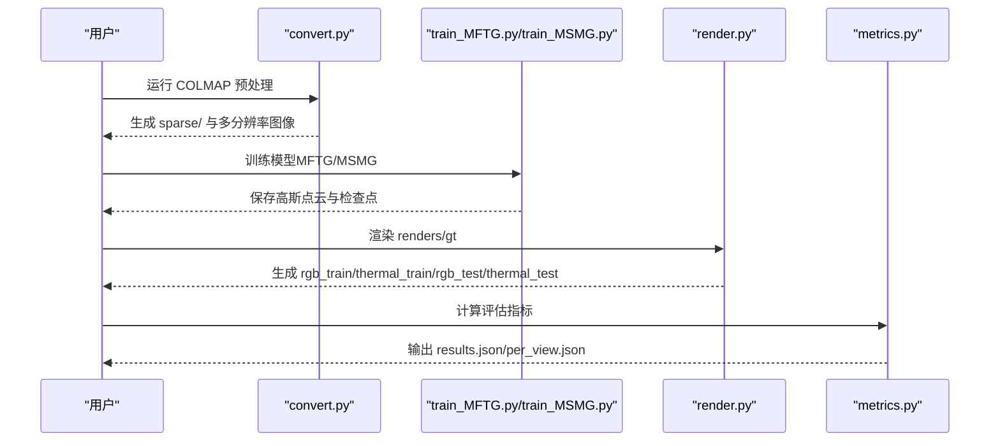
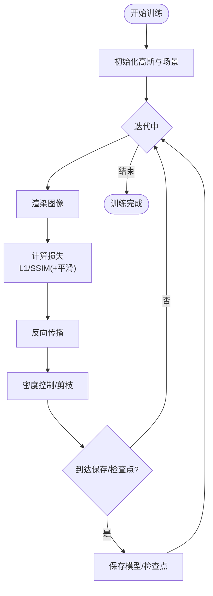
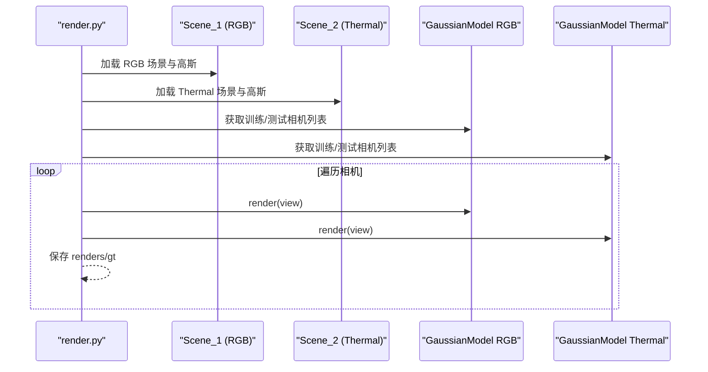
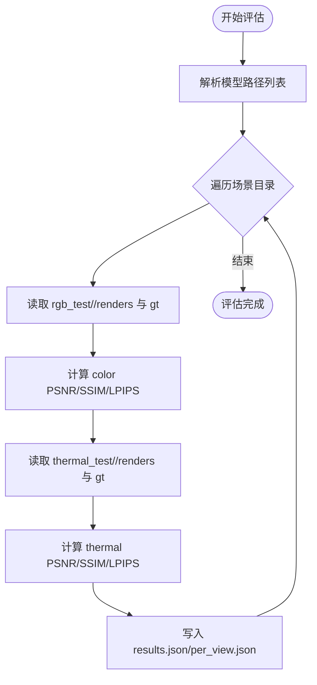
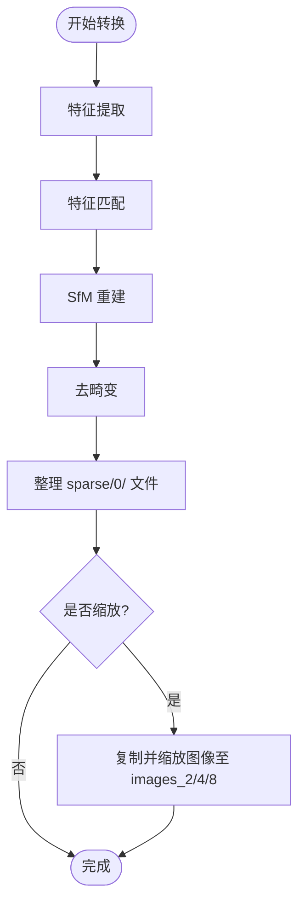
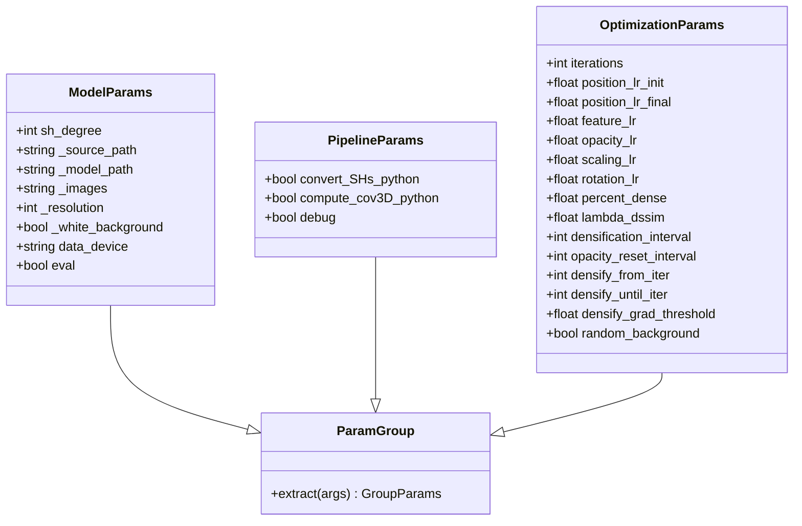
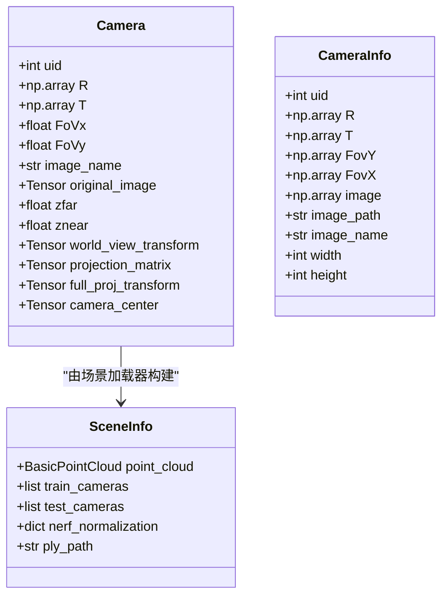
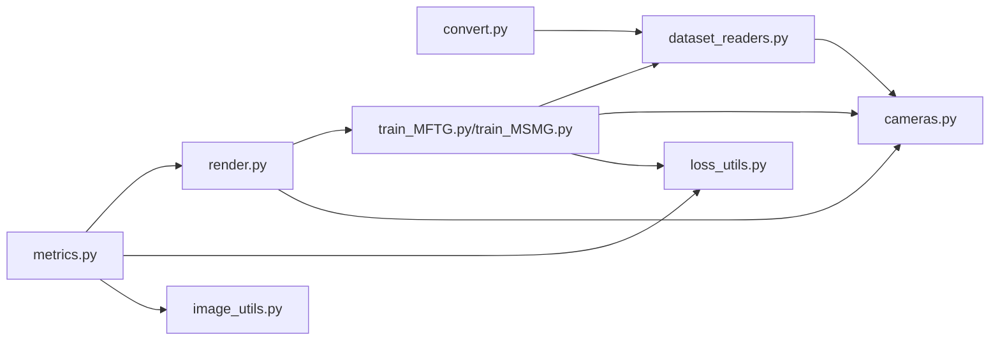

# 评估流程与工具

<cite>
**本文引用的文件**
- [README.md](file://README.md)
- [MFTG-Technical-Doc.md](file://MFTG-Technical-Doc.md)
- [train_MFTG.py](file://train_MFTG.py)
- [train_MSMG.py](file://train_MSMG.py)
- [render.py](file://render.py)
- [metrics.py](file://metrics.py)
- [convert.py](file://convert.py)
- [arguments/__init__.py](file://arguments/__init__.py)
- [scene/dataset_readers.py](file://scene/dataset_readers.py)
- [scene/cameras.py](file://scene/cameras.py)
- [utils/loss_utils.py](file://utils/loss_utils.py)
- [utils/image_utils.py](file://utils/image_utils.py)
</cite>

## 目录
1. [简介](#简介)
2. [项目结构](#项目结构)
3. [核心组件](#核心组件)
4. [架构总览](#架构总览)
5. [详细组件分析](#详细组件分析)
6. [依赖关系分析](#依赖关系分析)
7. [性能考量](#性能考量)
8. [故障排查指南](#故障排查指南)
9. [结论](#结论)
10. [附录](#附录)

## 简介
本指南面向 Thermal-Gaussian 的评估流程与工具，围绕训练、渲染与评估三个阶段，系统讲解：
- 评估脚本的使用方法与命令行参数
- 批量处理流程与数据组织结构
- 渲染结果与评估输出的文件格式
- 数据读取、预处理与后处理步骤
- 评估报告生成、结果统计分析与性能对比工具
- 常见问题排查、错误处理机制与调试技巧

## 项目结构
项目采用“多版本训练 + 渲染 + 评估”的流水线设计，核心文件与职责如下：
- 训练脚本：train_MFTG.py（两阶段微调）、train_MSMG.py（并行多模态）
- 渲染脚本：render.py（生成 renders 与 gt）
- 评估脚本：metrics.py（计算 PSNR/SSIM/LPIPS 并输出 JSON）
- 数据转换：convert.py（COLMAP 预处理与图像缩放）
- 参数与管线：arguments/__init__.py
- 场景与相机：scene/dataset_readers.py、scene/cameras.py
- 损失与指标：utils/loss_utils.py、utils/image_utils.py

图表来源
- [convert.py:1-125](file://convert.py#L1-L125)
- [train_MFTG.py:1-273](file://train_MFTG.py#L1-L273)
- [train_MSMG.py:1-314](file://train_MSMG.py#L1-L314)
- [render.py:1-76](file://render.py#L1-L76)
- [metrics.py:1-148](file://metrics.py#L1-L148)

章节来源
- [README.md:28-117](file://README.md#L28-L117)
- [MFTG-Technical-Doc.md:454-489](file://MFTG-Technical-Doc.md#L454-L489)

## 核心组件
- 训练脚本（MFTG/MSMG）：负责模型初始化、损失计算、优化与保存；MFTG 采用两阶段策略，MSMG 并行训练两套高斯。
- 渲染脚本：按训练/测试划分，生成 renders 与 gt 两张图像，便于后续评估。
- 评估脚本：遍历 rgb_test 与 thermal_test 下的方法目录，计算指标并输出 results.json 与 per_view.json。
- 数据转换：convert.py 调用 COLMAP 完成特征提取、匹配、SfM 重建与去畸变，并按倍率生成多分辨率图像。
- 参数与管线：arguments 提供统一的参数解析与合并逻辑，确保命令行与配置文件一致。
- 场景与相机：dataset_readers 负责 COLMAP 位姿与图像读取，cameras 定义相机对象与投影矩阵。
- 指标工具：loss_utils 提供 SSIM、L1、平滑损失；image_utils 提供 PSNR。

章节来源
- [train_MFTG.py:35-273](file://train_MFTG.py#L35-L273)
- [train_MSMG.py:33-314](file://train_MSMG.py#L33-L314)
- [render.py:25-76](file://render.py#L25-L76)
- [metrics.py:24-148](file://metrics.py#L24-L148)
- [convert.py:18-125](file://convert.py#L18-L125)
- [arguments/__init__.py:47-113](file://arguments/__init__.py#L47-L113)
- [scene/dataset_readers.py:68-311](file://scene/dataset_readers.py#L68-L311)
- [scene/cameras.py:17-72](file://scene/cameras.py#L17-L72)
- [utils/loss_utils.py:20-114](file://utils/loss_utils.py#L20-L114)
- [utils/image_utils.py:14-20](file://utils/image_utils.py#L14-L20)

## 架构总览
整体流程从数据准备开始，经由训练得到两套高斯模型，再通过渲染生成 renders 与 gt，最后由评估脚本计算指标并输出 JSON 报告。

图表来源
- [convert.py:31-125](file://convert.py#L31-L125)
- [train_MFTG.py:240-273](file://train_MFTG.py#L240-L273)
- [train_MSMG.py:284-314](file://train_MSMG.py#L284-L314)
- [render.py:42-76](file://render.py#L42-L76)
- [metrics.py:36-148](file://metrics.py#L36-L148)

## 详细组件分析

### 训练脚本（MFTG/MSMG）
- MFTG 两阶段策略：先用 RGB 图像训练一套高斯，再复用该高斯微调 Thermal 图像，引入热红外平滑损失。
- MSMG 并行策略：同时训练两套高斯，动态融合损失，适合追求双模态一致性且显存充足的情况。
- 关键流程：随机视角采样、渲染、损失计算（L1/SSIM/平滑）、自适应密度控制、保存与检查点。

图表来源
- [train_MFTG.py:68-163](file://train_MFTG.py#L68-L163)
- [train_MSMG.py:113-179](file://train_MSMG.py#L113-L179)

章节来源
- [train_MFTG.py:35-273](file://train_MFTG.py#L35-L273)
- [train_MSMG.py:33-314](file://train_MSMG.py#L33-L314)
- [MFTG-Technical-Doc.md:111-165](file://MFTG-Technical-Doc.md#L111-L165)

### 渲染脚本（render.py）
- 作用：按训练/测试划分，分别加载 RGB 与 Thermal 的高斯模型，生成 renders 与 gt，并按索引命名保存。
- 输出目录：rgb_train/thermal_train/rgb_test/thermal_test 下的 ours_<iter>/renders 与 ours_<iter>/gt。
- 支持跳过训练或测试集，便于快速评估特定集合。

图表来源
- [render.py:25-76](file://render.py#L25-L76)

章节来源
- [render.py:25-76](file://render.py#L25-L76)
- [MFTG-Technical-Doc.md:400-428](file://MFTG-Technical-Doc.md#L400-L428)

### 评估脚本（metrics.py）
- 输入：多个模型路径（每个路径包含 rgb_test 与 thermal_test）。
- 读取规则：遍历 rgb_test/thermal_test 下的方法目录，读取 renders 与 gt，计算 PSNR/SSIM/LPIPS。
- 输出：results.json（全局均值）、per_view.json（逐视角明细）。
- 设备：默认使用 CUDA 设备 0。

图表来源
- [metrics.py:36-148](file://metrics.py#L36-L148)

章节来源
- [metrics.py:24-148](file://metrics.py#L24-L148)
- [MFTG-Technical-Doc.md:419-428](file://MFTG-Technical-Doc.md#L419-L428)

### 数据转换（convert.py）
- 功能：COLMAP 特征提取、特征匹配、SfM 重建、去畸变；可选图像缩放生成多分辨率。
- 关键步骤：feature_extractor → exhaustive_matcher → mapper → image_undistorter。
- 输出：sparse/0/ 下的相机内参/外参与点云；按倍率生成 images_2/4/8。

图表来源
- [convert.py:31-125](file://convert.py#L31-L125)

章节来源
- [convert.py:18-125](file://convert.py#L18-L125)
- [README.md:122-152](file://README.md#L122-L152)

### 参数与管线（arguments）
- ModelParams：定义数据加载参数（source_path、model_path、images、resolution、white_background 等）。
- PipelineParams：定义渲染管线参数（SH/协方差计算开关、debug）。
- OptimizationParams：定义优化超参数（迭代次数、学习率、密度控制、SSIM 权重等）。
- get_combined_args：合并命令行与配置文件参数，优先命令行。

图表来源
- [arguments/__init__.py:47-113](file://arguments/__init__.py#L47-L113)

章节来源
- [arguments/__init__.py:47-113](file://arguments/__init__.py#L47-L113)

### 场景与相机（dataset_readers/cameras）
- dataset_readers：读取 COLMAP 位姿与图像，构建 CameraInfo 列表；支持 Colmap/Temper/Blender 三种加载类型。
- cameras：定义 Camera 类，封装位姿、投影矩阵、相机中心等；MiniCam 用于快速投影。

图表来源
- [scene/cameras.py:17-72](file://scene/cameras.py#L17-L72)
- [scene/dataset_readers.py:26-44](file://scene/dataset_readers.py#L26-L44)

章节来源
- [scene/dataset_readers.py:68-311](file://scene/dataset_readers.py#L68-L311)
- [scene/cameras.py:17-72](file://scene/cameras.py#L17-L72)

### 指标工具（loss_utils/image_utils）
- loss_utils：提供 L1、L2、SSIM、平滑损失（smoothness_loss）等。
- image_utils：提供 PSNR 计算。

章节来源
- [utils/loss_utils.py:20-114](file://utils/loss_utils.py#L20-L114)
- [utils/image_utils.py:14-20](file://utils/image_utils.py#L14-L20)

## 依赖关系分析
- 训练脚本依赖场景加载器与相机定义，渲染脚本依赖训练产出的高斯点云与管线参数。
- 评估脚本依赖渲染产出的 renders 与 gt 目录结构。
- convert.py 依赖 COLMAP 与图像处理工具链。

图表来源
- [convert.py:18-125](file://convert.py#L18-L125)
- [scene/dataset_readers.py:68-311](file://scene/dataset_readers.py#L68-L311)
- [scene/cameras.py:17-72](file://scene/cameras.py#L17-L72)
- [train_MFTG.py:16-26](file://train_MFTG.py#L16-L26)
- [train_MSMG.py:16-26](file://train_MSMG.py#L16-L26)
- [render.py:13-23](file://render.py#L13-L23)
- [metrics.py:17-22](file://metrics.py#L17-L22)
- [utils/loss_utils.py:12-18](file://utils/loss_utils.py#L12-L18)
- [utils/image_utils.py:12-19](file://utils/image_utils.py#L12-L19)

章节来源
- [README.md:62-117](file://README.md#L62-L117)

## 性能考量
- 显存与分辨率：可通过 -r 参数调整分辨率，降低显存占用；在高分辨率场景下建议使用 -r 2 或 -r 4。
- 迭代次数与检查点：合理设置 --test_iterations 与 --save_iterations，平衡评估频率与磁盘 IO。
- 并行与多模态：MSMG 并行训练两套高斯，适合追求双模态一致性；MFTG 两阶段微调，显存占用较低但 RGB 质量可能下降。
- 平滑损失：MFTG 在 Thermal 阶段引入平滑损失，有助于提升热红外图像的物理合理性。

章节来源
- [MFTG-Technical-Doc.md:514-516](file://MFTG-Technical-Doc.md#L514-L516)
- [MFTG-Technical-Doc.md:612-618](file://MFTG-Technical-Doc.md#L612-L618)

## 故障排查指南
- 渲染结果为空或全黑
  - 检查模型路径与迭代号是否正确；确认 render.py 的 --iteration 与保存的迭代一致。
  - 确认 rgb_train/thermal_train/rgb_test/thermal_test 目录结构完整。
- 评估报错或指标缺失
  - 确保 renders 与 gt 数量一致且命名顺序相同；检查 results.json 写入权限。
  - 若出现异常，评估脚本会捕获并提示无法计算该模型的指标。
- COLMAP 预处理失败
  - 检查 COLMAP 可执行文件路径与图像格式；确保输入目录包含 input/ 与 sparse/0/。
- 训练中断恢复
  - 使用 --start_checkpoint 指定检查点；注意 MFTG 两阶段恢复的特殊性，建议完整训练。
- 显存不足
  - 降低分辨率（-r 2/4）、减少 SH 阶数（--sh_degree 1）、减小训练图像数量。

章节来源
- [render.py:61-76](file://render.py#L61-L76)
- [metrics.py:133-139](file://metrics.py#L133-L139)
- [convert.py:31-78](file://convert.py#L31-L78)
- [MFTG-Technical-Doc.md:603-611](file://MFTG-Technical-Doc.md#L603-L611)
- [MFTG-Technical-Doc.md:612-618](file://MFTG-Technical-Doc.md#L612-L618)

## 结论
本指南系统梳理了 Thermal-Gaussian 的评估流程与工具，覆盖从数据准备、训练、渲染到评估的完整链路。MFTG 的两阶段策略在显存与效率上更具优势，而 MSMG 的并行多模态训练适合追求更高一致性与稳定性的场景。通过规范的数据组织与命令行参数配置，可高效完成批量评估与结果统计分析。

## 附录

### 命令行参数速查
- 训练（MFTG/MSMG）
  - -s/--source_path：数据集根目录（必填）
  - -m/--model_path：输出路径（可选，默认 output 下随机名）
  - --iterations：每阶段/每套迭代次数
  - --test_iterations/save_iterations：评估与保存检查点迭代
  - --sh_degree：球谐阶数
  - -r/--resolution：分辨率缩放
  - --white_background：白色背景
  - --eval：训练中评估
  - --port：GUI 端口
  - --start_checkpoint：断点恢复
- 渲染
  - -m/--model_path：模型路径
  - --iteration：渲染迭代（默认 -1 表示最新）
  - --skip_train/--skip_test：跳过训练/测试集
  - --quiet：静默模式
- 评估
  - -m/--model_paths：模型路径列表（可传多个）

章节来源
- [arguments/__init__.py:47-113](file://arguments/__init__.py#L47-L113)
- [README.md:64-69](file://README.md#L64-L69)
- [MFTG-Technical-Doc.md:387-400](file://MFTG-Technical-Doc.md#L387-L400)

### 数据与输出文件格式
- 数据组织
  - rgb/train、rgb/test：RGB 训练/测试图像
  - thermal/train、thermal/test：热红外训练/测试图像
  - sparse/0/：COLMAP 输出的相机内参/外参/点云
- 渲染输出
  - rgb_train/ours_<iter>/renders、gt
  - thermal_train/ours_<iter>/renders、gt
  - 同理 rgb_test/thermal_test
- 评估输出
  - results.json：各方法的全局指标均值
  - per_view.json：各方法的逐视角指标

章节来源
- [README.md:31-60](file://README.md#L31-L60)
- [MFTG-Technical-Doc.md:454-489](file://MFTG-Technical-Doc.md#L454-L489)