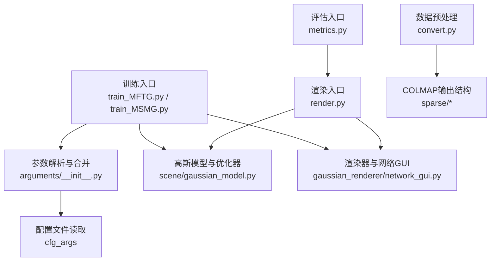
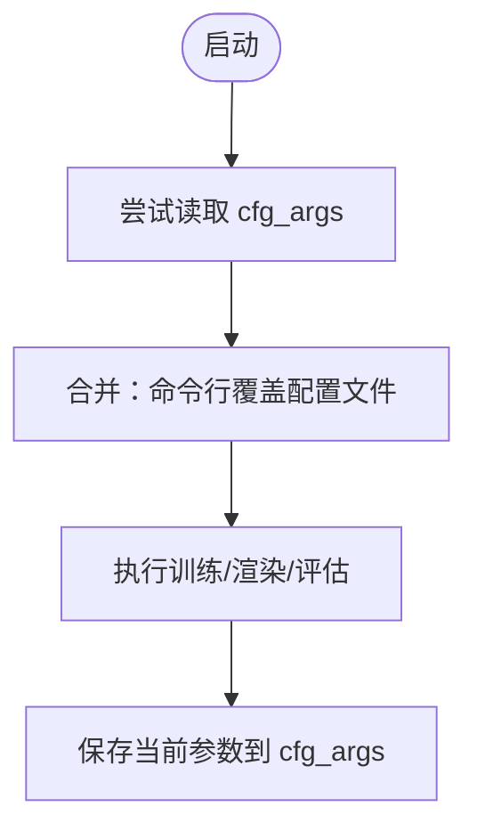

# 配置参考

<cite>
**本文引用的文件列表**
- [README.md](file://README.md)
- [environment.yml](file://environment.yml)
- [train_MFTG.py](file://train_MFTG.py)
- [train_MSMG.py](file://train_MSMG.py)
- [render.py](file://render.py)
- [metrics.py](file://metrics.py)
- [arguments/__init__.py](file://arguments/__init__.py)
- [gaussian_renderer/network_gui.py](file://gaussian_renderer/network_gui.py)
- [convert.py](file://convert.py)
- [scene/cameras.py](file://scene/cameras.py)
- [scene/gaussian_model.py](file://scene/gaussian_model.py)
</cite>

## 目录
1. [简介](#简介)
2. [项目结构与配置入口](#项目结构与配置入口)
3. [命令行参数总览](#命令行参数总览)
4. [模型加载与管道参数](#模型加载与管道参数)
5. [优化超参数](#优化超参数)
6. [训练脚本参数详解](#训练脚本参数详解)
7. [渲染与评估参数详解](#渲染与评估参数详解)
8. [配置文件优先级与覆盖机制](#配置文件优先级与覆盖机制)
9. [环境与硬件配置](#环境与硬件配置)
10. [使用场景与推荐配置模板](#使用场景与推荐配置模板)
11. [性能优化与最佳实践](#性能优化与最佳实践)
12. [故障排查](#故障排查)
13. [结论](#结论)

## 简介
本文件为 Thermal-Gaussian 项目的配置参考文档，面向使用者与研究者，系统梳理命令行参数、配置文件优先级、环境与硬件要求、以及不同使用场景下的推荐配置模板与调优建议。内容基于仓库中的训练、渲染、评估与参数定义脚本进行归纳总结，并辅以架构图与流程图帮助理解。

## 项目结构与配置入口
- 训练入口（多模态）：train_MFTG.py
- 训练入口（单模态对比）：train_MSMG.py
- 渲染入口：render.py
- 评估入口：metrics.py
- 参数定义与合并：arguments/__init__.py
- 网络GUI通信：gaussian_renderer/network_gui.py
- 数据预处理（COLMAP转换）：convert.py
- 场景与相机：scene/cameras.py
- 高斯模型与优化器：scene/gaussian_model.py
- 环境依赖：environment.yml
- 使用说明与示例：README.md

图表来源
- [train_MFTG.py:240-273](file://train_MFTG.py#L240-L273)
- [train_MSMG.py:284-314](file://train_MSMG.py#L284-L314)
- [arguments/__init__.py:92-113](file://arguments/__init__.py#L92-L113)
- [render.py:61-76](file://render.py#L61-L76)
- [metrics.py:140-148](file://metrics.py#L140-L148)
- [gaussian_renderer/network_gui.py:26-86](file://gaussian_renderer/network_gui.py#L26-L86)
- [convert.py:18-26](file://convert.py#L18-L26)

章节来源
- [README.md:62-117](file://README.md#L62-L117)
- [train_MFTG.py:240-273](file://train_MFTG.py#L240-L273)
- [train_MSMG.py:284-314](file://train_MSMG.py#L284-L314)
- [render.py:61-76](file://render.py#L61-L76)
- [metrics.py:140-148](file://metrics.py#L140-L148)
- [arguments/__init__.py:92-113](file://arguments/__init__.py#L92-L113)
- [gaussian_renderer/network_gui.py:26-86](file://gaussian_renderer/network_gui.py#L26-L86)
- [convert.py:18-26](file://convert.py#L18-L26)

## 命令行参数总览
以下为各脚本的核心命令行参数汇总（按功能分组），具体含义与默认值见后续章节。

- 通用参数
  - -s/--source_path：输入数据根目录（必填）
  - -m/--model_path：模型输出目录（可选；未指定时自动生成）
  - --images：图像子目录名，默认 images
  - --resolution：分辨率缩放因子，默认 -1（自动）
  - --white_background：背景模式（布尔），默认 False
  - --eval：评估模式（布尔），默认 True
  - --data_device：数据设备，默认 cuda

- 管道参数
  - --convert_SHs_python：Python 中计算 SH（布尔），默认 False
  - --compute_cov3D_python：Python 中计算协方差（布尔），默认 False
  - --debug：调试模式（布尔），默认 False

- 优化参数
  - --iterations：训练迭代数，默认 30000
  - --position_lr_init：初始位置学习率，默认 0.00016
  - --position_lr_final：最终位置学习率，默认 0.0000016
  - --position_lr_delay_mult：学习率延迟系数，默认 0.01
  - --position_lr_max_steps：最大学习步数，默认 30000
  - --feature_lr：特征学习率，默认 0.0025
  - --opacity_lr：不透明度学习率，默认 0.05
  - --scaling_lr：缩放学习率，默认 0.005
  - --rotation_lr：旋转学习率，默认 0.001
  - --percent_dense：密度阈值比例，默认 0.01
  - --lambda_dssim：SSIM 权重，默认 0.2
  - --densification_interval：致密化间隔，默认 100
  - --opacity_reset_interval：不透明度重置间隔，默认 3000
  - --densify_from_iter：开始致密化迭代，默认 500
  - --densify_until_iter：停止致密化迭代，默认 15000
  - --densify_grad_threshold：致密化梯度阈值，默认 0.0002
  - --random_background：随机背景（布尔），默认 False

- 训练脚本特有参数
  - --ip/--port：GUI 服务器地址与端口，默认 127.0.0.1:6009
  - --debug_from：从某迭代开始启用调试，默认 -1
  - --detect_anomaly：异常检测（布尔），默认 False
  - --test_iterations：测试评估迭代点，默认 [7000, 30000]
  - --save_iterations：保存模型迭代点，默认 [7000, 30000]
  - --checkpoint_iterations：断点保存迭代点，默认 []
  - --start_checkpoint：起始断点路径（字符串），默认 None
  - --quiet：静默模式（布尔），默认 False

- 渲染脚本特有参数
  - --iteration：渲染特定迭代，默认 -1（最新）
  - --skip_train/--skip_test：跳过训练或测试集渲染（布尔）
  - --quiet：静默模式（布尔），默认 False

- 评估脚本特有参数
  - --model_paths/-m：评估的模型路径列表（必填）

章节来源
- [arguments/__init__.py:47-91](file://arguments/__init__.py#L47-L91)
- [train_MFTG.py:246-255](file://train_MFTG.py#L246-L255)
- [train_MSMG.py:290-299](file://train_MSMG.py#L290-L299)
- [render.py:63-70](file://render.py#L63-L70)
- [metrics.py:145-147](file://metrics.py#L145-L147)

## 模型加载与管道参数
- 模型加载参数（ModelParams）
  - sh_degree：球谐函数最高阶，默认 3
  - source_path：输入数据根目录（必填）
  - model_path：模型输出目录（可选）
  - images：图像子目录名，默认 images
  - resolution：分辨率缩放因子，默认 -1
  - white_background：背景模式（布尔），默认 False
  - data_device：数据设备，默认 cuda
  - eval：评估模式（布尔），默认 True

- 管道参数（PipelineParams）
  - convert_SHs_python：Python 中计算 SH（布尔），默认 False
  - compute_cov3D_python：Python 中计算协方差（布尔），默认 False
  - debug：调试模式（布尔），默认 False

章节来源
- [arguments/__init__.py:47-70](file://arguments/__init__.py#L47-L70)

## 优化超参数
- 迭代与学习率
  - iterations：训练总迭代数，默认 30000
  - position_lr_init：初始位置学习率，默认 0.00016
  - position_lr_final：最终位置学习率，默认 0.0000016
  - position_lr_delay_mult：学习率延迟系数，默认 0.01
  - position_lr_max_steps：最大学习步数，默认 30000

- 特征与属性学习率
  - feature_lr：特征学习率，默认 0.0025
  - opacity_lr：不透明度学习率，默认 0.05
  - scaling_lr：缩放学习率，默认 0.005
  - rotation_lr：旋转学习率，默认 0.001

- 致密化与优化策略
  - percent_dense：密度阈值比例，默认 0.01
  - lambda_dssim：SSIM 权重，默认 0.2
  - densification_interval：致密化间隔，默认 100
  - opacity_reset_interval：不透明度重置间隔，默认 3000
  - densify_from_iter：开始致密化迭代，默认 500
  - densify_until_iter：停止致密化迭代，默认 15000
  - densify_grad_threshold：致密化梯度阈值，默认 0.0002
  - random_background：随机背景（布尔），默认 False

章节来源
- [arguments/__init__.py:71-90](file://arguments/__init__.py#L71-L90)

## 训练脚本参数详解
- 入口脚本
  - train_MFTG.py：多阶段训练（颜色→热成像），支持 GUI 交互与断点续训
  - train_MSMG.py：双分支单模态训练（颜色与热成像分别训练）

- 关键参数与行为
  - GUI 服务器：--ip/--port（默认 127.0.0.1:6009），用于实时渲染预览
  - 测试与保存：--test_iterations/--save_iterations（默认 [7000, 30000]），支持断点保存 --checkpoint_iterations 与 --start_checkpoint
  - 调试：--debug_from 控制何时启用调试模式
  - 异常检测：--detect_anomaly 开启 PyTorch autograd 异常检测
  - 输出目录：若未指定 -m，则在 ./output/ 下生成唯一子目录并记录 cfg_args

- 多模态训练流程（MFTG）
  - 颜色阶段：先训练颜色分支，记录中间状态
  - 热成像阶段：复用颜色阶段高斯点，加入平滑正则项进行热成像优化
  - 损失函数：包含 L1、SSIM 与热成像平滑损失（热成像阶段）

- 单模态对比（MSMG）
  - 双分支独立训练，热成像损失包含平滑正则项
  - 通过权重动态平衡两个分支的总损失

章节来源
- [train_MFTG.py:246-273](file://train_MFTG.py#L246-L273)
- [train_MSMG.py:290-314](file://train_MSMG.py#L290-L314)
- [gaussian_renderer/network_gui.py:26-86](file://gaussian_renderer/network_gui.py#L26-L86)

## 渲染与评估参数详解
- 渲染入口（render.py）
  - -s/--source_path：输入数据根目录（必填）
  - -m/--model_path：模型输出目录（必填）
  - --iteration：渲染特定迭代（默认 -1 表示最新）
  - --skip_train/--skip_test：跳过训练或测试集渲染
  - --quiet：静默模式

- 评估入口（metrics.py）
  - --model_paths/-m：评估的模型路径列表（必填）
  - 自动读取 rgb_test 与 thermal_test 下的 renders 与 gt，计算 SSIM、PSNR、LPIPS

- 数据组织约定
  - 渲染结果按 rgb_train/thermal_train/rgb_test/thermal_test 子目录组织，每个子目录下包含 ours_<iteration>/renders 与 ours_<iteration>/gt

章节来源
- [render.py:63-76](file://render.py#L63-L76)
- [metrics.py:140-148](file://metrics.py#L140-L148)

## 配置文件优先级与覆盖机制
- 配置文件位置与命名
  - 训练脚本会在输出目录写入 cfg_args 文件，记录本次运行的参数快照
  - 合并逻辑会尝试从模型路径读取 cfg_args，作为默认参数源

- 参数合并规则
  - 命令行参数优先于配置文件参数
  - 合并过程采用“非空覆盖”策略：仅当命令行参数非空时才覆盖配置文件中的对应项

- 实现要点
  - get_combined_args 会尝试读取 cfg_args 并与命令行参数合并
  - 若未找到配置文件，将回退到命令行参数

图表来源
- [arguments/__init__.py:92-113](file://arguments/__init__.py#L92-L113)

章节来源
- [arguments/__init__.py:92-113](file://arguments/__init__.py#L92-L113)

## 环境与硬件配置
- 环境与依赖
  - Python 3.7.13
  - PyTorch 1.12.1 + torchvision 0.13.1 + torchaudio 0.12.1
  - CUDA Toolkit 11.6
  - 其他依赖：plyfile=0.8.1、tqdm、pip 安装子模块（diff-gaussian-rasterization、simple-knn）

- 硬件建议
  - GPU：建议使用具备足够显存的现代 GPU（如 RTX 4090/3090 或同等性能）
  - 内存：至少 16GB RAM（根据数据规模可能更高）
  - 存储：确保输出目录有充足空间（模型与日志）

- 环境安装步骤
  - Windows：设置环境变量后使用 conda 创建环境
  - Linux/macOS：遵循 conda 环境文件进行安装

章节来源
- [environment.yml:1-17](file://environment.yml#L1-L17)
- [README.md:18-27](file://README.md#L18-L27)

## 使用场景与推荐配置模板
- 场景一：快速上手（单次训练+渲染+评估）
  - 训练：python train_MFTG.py -s <数据路径> -m <输出路径>
  - 渲染：python render.py -m <输出路径> --iteration 30000
  - 评估：python metrics.py -m "<输出路径>"

- 场景二：多阶段训练（颜色→热成像）
  - 使用 MFTG 的两阶段训练流程，热成像阶段自动引入平滑正则

- 场景三：单模态对比实验
  - 使用 MSMG 进行颜色与热成像的独立训练，便于对比分析

- 场景四：大规模数据集评估
  - 使用 metrics.py 对多个模型路径批量评估，输出 JSON 结果

章节来源
- [README.md:71-117](file://README.md#L71-L117)
- [train_MFTG.py:267-273](file://train_MFTG.py#L267-L273)
- [train_MSMG.py:309-314](file://train_MSMG.py#L309-L314)
- [metrics.py:140-148](file://metrics.py#L140-L148)

## 性能优化与最佳实践
- 分辨率与输入尺寸
  - 默认目标分辨率范围为 1–1.6K 像素；若输入超过 1600 像素，将自动调整
  - 如需强制使用更高分辨率，可通过参数控制

- 致密化与优化
  - 合理设置 densify_from_iter、densify_until_iter 与 densify_grad_threshold
  - 适当提高 opacity_reset_interval 可减少频繁重置带来的抖动

- 学习率调度
  - position_lr_init 与 position_lr_final 的组合影响收敛速度与稳定性
  - 在长序列训练中，保持合理的衰减曲线有助于稳定

- 渲染与评估
  - 使用 --skip_train/--skip_test 控制渲染范围，加速评估
  - 将 --iteration 设为关键评估点（如 7000、30000）以节省时间

- GUI 实时预览
  - 通过 --ip/--port 启动 GUI 服务，实时观察渲染效果并进行交互式训练

章节来源
- [README.md:119-120](file://README.md#L119-L120)
- [arguments/__init__.py:71-90](file://arguments/__init__.py#L71-L90)
- [gaussian_renderer/network_gui.py:26-86](file://gaussian_renderer/network_gui.py#L26-L86)

## 故障排查
- 环境问题
  - CUDA 版本不匹配：请确认与 PyTorch 匹配的 CUDA Toolkit 版本
  - 依赖缺失：确保 conda 环境已正确创建且子模块已安装

- 训练问题
  - 显存不足：降低分辨率、减少迭代或致密化阈值
  - 收敛异常：检查学习率与正则项权重，适当增大随机背景概率

- 渲染与评估问题
  - 输出目录为空：确认 -m 与 --iteration 设置正确
  - 评估失败：确保 rgb_test/thermal_test 下存在 renders 与 gt 子目录

- GUI 连接问题
  - 端口占用：修改 --port 或关闭冲突进程
  - 网络权限：确保本地回环地址可用

章节来源
- [environment.yml:1-17](file://environment.yml#L1-L17)
- [gaussian_renderer/network_gui.py:26-86](file://gaussian_renderer/network_gui.py#L26-L86)
- [render.py:25-60](file://render.py#L25-L60)
- [metrics.py:36-139](file://metrics.py#L36-L139)

## 结论
本配置参考文档系统梳理了 Thermal-Gaussian 的命令行参数、参数合并机制、环境与硬件要求、以及典型使用场景的推荐配置与调优策略。建议在实际使用中结合数据规模与硬件条件，逐步调整致密化与学习率策略，并利用 GUI 实时预览与评估工具进行迭代优化。