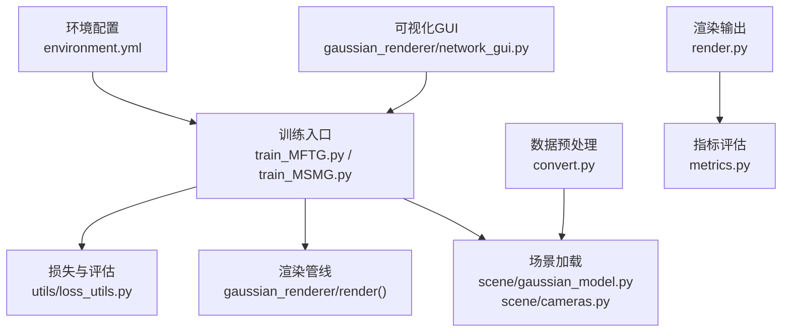
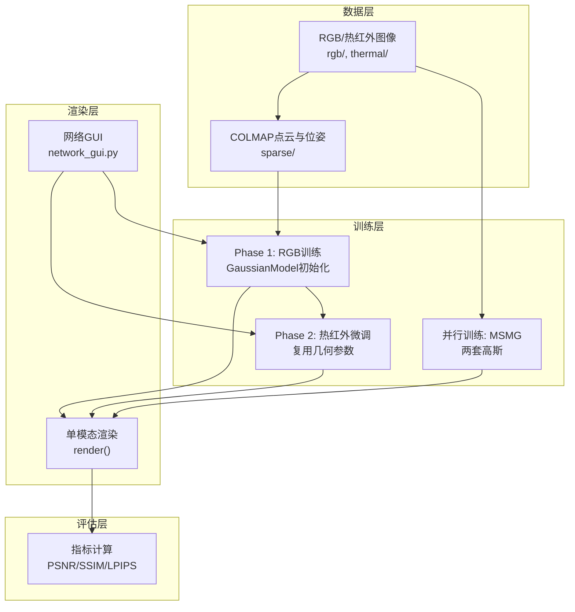
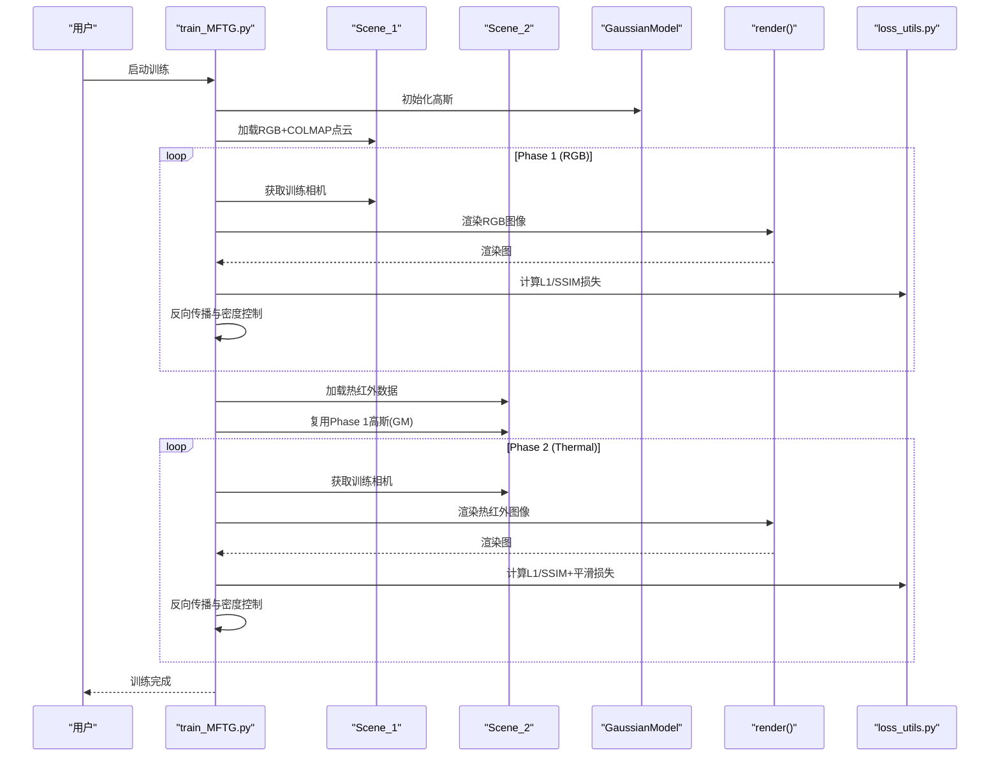
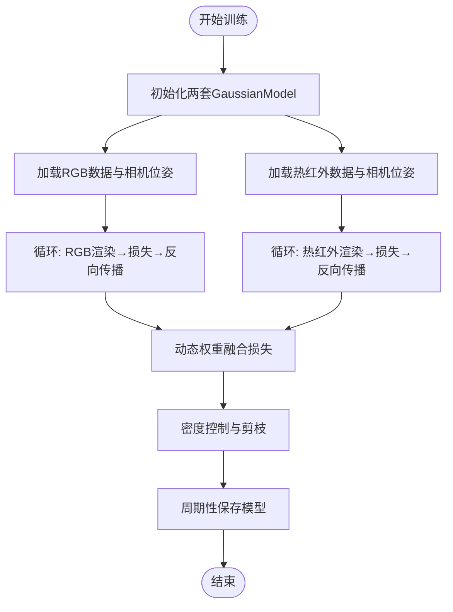
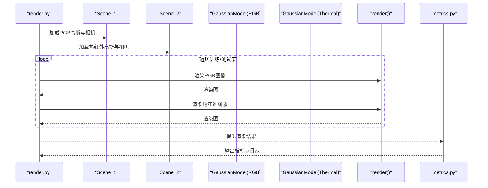
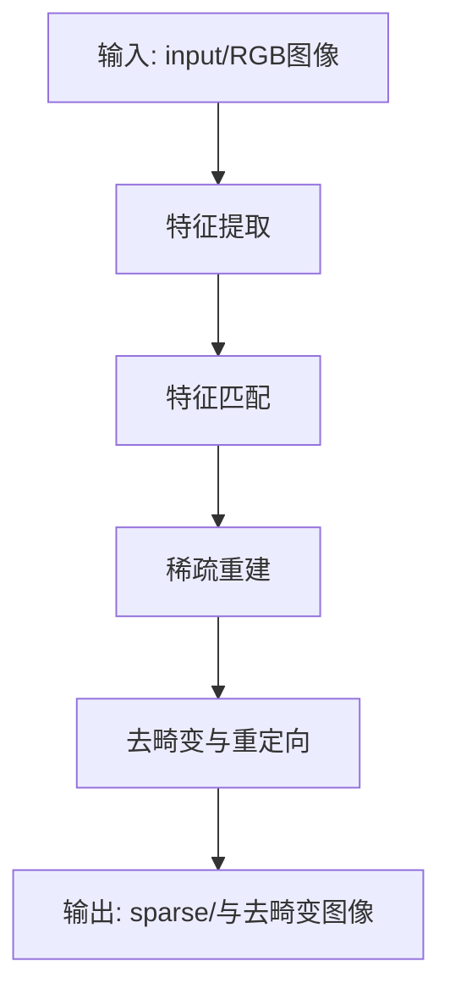
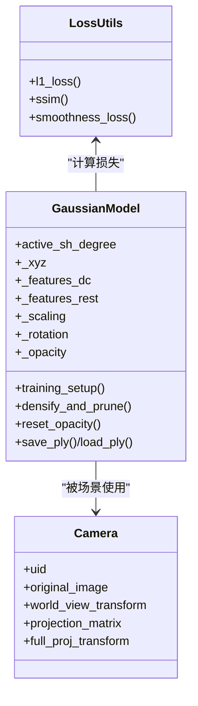
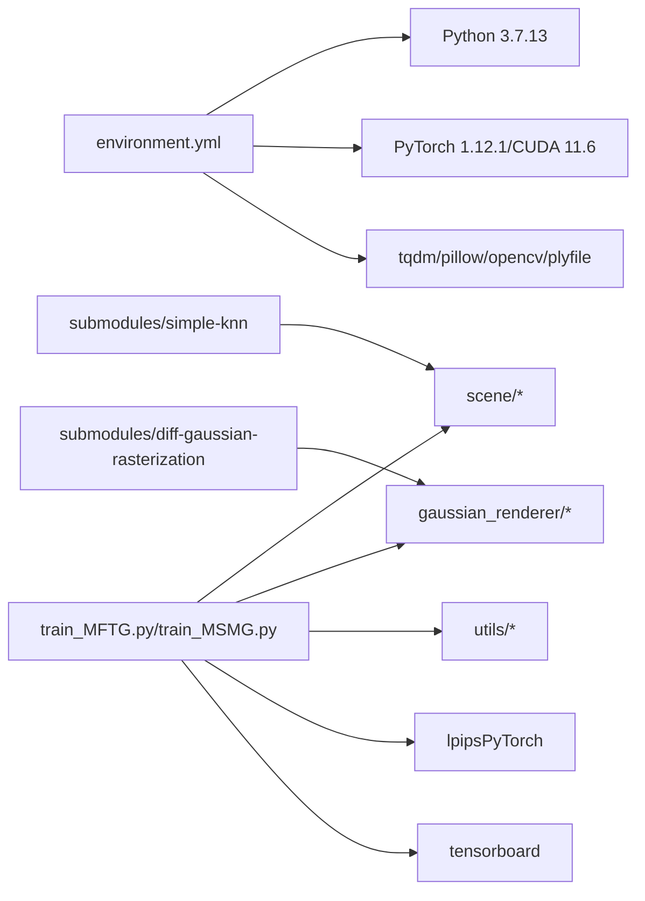

# 项目概述

<cite>
**本文档引用的文件**
- [README.md](file://README.md)
- [MFTG-Technical-Doc.md](file://MFTG-Technical-Doc.md)
- [train_MFTG.py](file://train_MFTG.py)
- [train_MSMG.py](file://train_MSMG.py)
- [render.py](file://render.py)
- [metrics.py](file://metrics.py)
- [convert.py](file://convert.py)
- [scene/gaussian_model.py](file://scene/gaussian_model.py)
- [scene/cameras.py](file://scene/cameras.py)
- [utils/loss_utils.py](file://utils/loss_utils.py)
- [gaussian_renderer/network_gui.py](file://gaussian_renderer/network_gui.py)
- [environment.yml](file://environment.yml)
</cite>

## 目录
1. [简介](#简介)
2. [项目结构](#项目结构)
3. [核心组件](#核心组件)
4. [架构总览](#架构总览)
5. [详细组件分析](#详细组件分析)
6. [依赖关系分析](#依赖关系分析)
7. [性能考量](#性能考量)
8. [故障排查指南](#故障排查指南)
9. [结论](#结论)
10. [附录](#附录)

## 简介
ThermalGaussian 是首个基于3D高斯点阵（3D Gaussian Splatting, 3DGS）的热成像三维重建与渲染系统，能够同时高质量地渲染RGB与热红外（热成像）图像。项目提出双模态（RGB+热红外）三维重建能力、两阶段训练策略（先RGB后热红外微调）、热红外平滑正则约束，并贡献了真实世界采集的RGBT-Scenes数据集。相比传统NeRF方法，ThermalGaussian具备训练速度快、推理实时、存储成本低等优势，在军事监视与安防领域具有重要应用价值。

- 论文与数据集：[论文链接](https://arxiv.org/abs/2409.07200)，[数据集下载](https://drive.google.com/drive/folders/1A6kdIjDe7kw-iKQkzjHNw0wgk_3V7hcp?usp=sharing)
- 项目主页：https://thermalgaussian.github.io/

**章节来源**
- [README.md:1-167](file://README.md#L1-L167)

## 项目结构
项目采用模块化组织，围绕训练脚本、场景加载、渲染管线、损失函数与评估工具展开，同时包含COLMAP预处理与可视化GUI。

**图表来源**
- [train_MFTG.py:1-273](file://train_MFTG.py#L1-L273)
- [train_MSMG.py:1-314](file://train_MSMG.py#L1-L314)
- [scene/gaussian_model.py:1-407](file://scene/gaussian_model.py#L1-L407)
- [scene/cameras.py:1-72](file://scene/cameras.py#L1-L72)
- [utils/loss_utils.py:1-114](file://utils/loss_utils.py#L1-L114)
- [render.py:1-76](file://render.py#L1-L76)
- [metrics.py:1-148](file://metrics.py#L1-L148)
- [convert.py:1-125](file://convert.py#L1-L125)
- [gaussian_renderer/network_gui.py:1-86](file://gaussian_renderer/network_gui.py#L1-L86)
- [environment.yml:1-17](file://environment.yml#L1-L17)

**章节来源**
- [README.md:18-167](file://README.md#L18-L167)

## 核心组件
- 训练脚本
  - MFTG两阶段训练：先RGB训练几何与外观，再热红外微调颜色参数，共享几何结构，显著降低存储成本。
  - MSMG多模态并行训练：两套独立高斯分别优化RGB与热红外，适合对比与不同需求。
- 场景与模型
  - GaussianModel：标准3DGS高斯点阵，包含位置、尺度、旋转、不透明度与球谐颜色系数。
  - Camera：封装相机位姿、内外参与投影矩阵。
- 渲染与评估
  - 渲染：单次渲染输出单一模态（RGB或热红外）。
  - 评估：PSNR、SSIM、LPIPS指标，支持训练过程可视化与TensorBoard日志。
- 数据预处理
  - COLMAP管线：特征提取、匹配、稀疏重建、去畸变，生成共享位姿与点云。
- 可视化GUI
  - 实时交互式渲染与训练监控，支持远程连接。

**章节来源**
- [MFTG-Technical-Doc.md:7-490](file://MFTG-Technical-Doc.md#L7-L490)
- [train_MFTG.py:35-273](file://train_MFTG.py#L35-L273)
- [train_MSMG.py:33-314](file://train_MSMG.py#L33-L314)
- [scene/gaussian_model.py:24-407](file://scene/gaussian_model.py#L24-L407)
- [scene/cameras.py:17-72](file://scene/cameras.py#L17-L72)
- [utils/loss_utils.py:20-114](file://utils/loss_utils.py#L20-L114)
- [render.py:25-76](file://render.py#L25-L76)
- [metrics.py:36-148](file://metrics.py#L36-L148)
- [convert.py:31-125](file://convert.py#L31-L125)
- [gaussian_renderer/network_gui.py:26-86](file://gaussian_renderer/network_gui.py#L26-L86)

## 架构总览
ThermalGaussian整体架构由“数据预处理—训练—渲染—评估”闭环构成，MFTG版本采用两阶段策略，共享几何、分离颜色；MSMG版本并行训练两套高斯，便于对比与多场景验证。

**图表来源**
- [MFTG-Technical-Doc.md:11-490](file://MFTG-Technical-Doc.md#L11-L490)
- [train_MFTG.py:35-273](file://train_MFTG.py#L35-L273)
- [train_MSMG.py:33-314](file://train_MSMG.py#L33-L314)
- [render.py:25-76](file://render.py#L25-L76)
- [metrics.py:36-148](file://metrics.py#L36-L148)
- [gaussian_renderer/network_gui.py:26-86](file://gaussian_renderer/network_gui.py#L26-L86)

## 详细组件分析

### 训练流程（MFTG两阶段）
- Phase 1（RGB训练）：使用COLMAP点云初始化高斯，仅用RGB图像监督，学习几何与RGB外观。
- Phase 2（热红外微调）：复用Phase 1的高斯参数，仅微调颜色（SH系数）以适配热红外图像，并加入热红外平滑损失，提升温度场连续性。
- 关键差异：
  - 数据加载：Scene_1读取rgb/，Scene_2读取thermal/，共享COLMAP位姿。
  - 损失函数：Phase 2增加平滑损失项，权重为0.6。
  - 保存路径：分别保存于point_cloud_color/与point_cloud_thermal/。

**图表来源**
- [train_MFTG.py:35-163](file://train_MFTG.py#L35-L163)
- [MFTG-Technical-Doc.md:113-153](file://MFTG-Technical-Doc.md#L113-L153)
- [utils/loss_utils.py:98-114](file://utils/loss_utils.py#L98-L114)

**章节来源**
- [MFTG-Technical-Doc.md:113-153](file://MFTG-Technical-Doc.md#L113-L153)
- [train_MFTG.py:35-163](file://train_MFTG.py#L35-L163)

### 训练流程（MSMG并行）
- 两套独立高斯分别训练RGB与热红外，共享密度控制策略，损失函数动态加权融合，适合探索不同模态的优化平衡。

**图表来源**
- [train_MSMG.py:33-179](file://train_MSMG.py#L33-L179)

**章节来源**
- [train_MSMG.py:33-179](file://train_MSMG.py#L33-L179)

### 渲染与评估
- 渲染：分别加载RGB与热红外高斯，调用标准渲染函数输出单模态图像，保存渲染图与GT。
- 评估：计算PSNR、SSIM、LPIPS，输出results.json与per_view.json，支持TensorBoard可视化。

**图表来源**
- [render.py:25-76](file://render.py#L25-L76)
- [metrics.py:36-148](file://metrics.py#L36-L148)

**章节来源**
- [render.py:25-76](file://render.py#L25-L76)
- [metrics.py:36-148](file://metrics.py#L36-L148)

### 数据预处理（COLMAP）
- convert.py自动化执行特征提取、匹配、稀疏重建与去畸变，生成COLMAP点云与共享位姿，便于后续训练与渲染。

**图表来源**
- [convert.py:31-125](file://convert.py#L31-L125)

**章节来源**
- [convert.py:31-125](file://convert.py#L31-L125)

### 模型与损失函数
- GaussianModel：包含位置、尺度、旋转、不透明度与球谐颜色系数，支持密度控制与优化器管理。
- 损失函数：L1、SSIM与热红外平滑损失（4邻域差分绝对值之和），平滑损失权重0.6用于抑制温度场噪声与突变。

**图表来源**
- [scene/gaussian_model.py:24-407](file://scene/gaussian_model.py#L24-L407)
- [scene/cameras.py:17-72](file://scene/cameras.py#L17-L72)
- [utils/loss_utils.py:20-114](file://utils/loss_utils.py#L20-L114)

**章节来源**
- [scene/gaussian_model.py:24-407](file://scene/gaussian_model.py#L24-L407)
- [utils/loss_utils.py:20-114](file://utils/loss_utils.py#L20-L114)

## 依赖关系分析
- 环境依赖：Python 3.7.13、PyTorch 1.12.1、CUDA 11.6、tqdm、pillow、opencv、plyfile等。
- 子模块：diff-gaussian-rasterization与simple-knn需编译安装。
- 训练脚本依赖：scene模块（GaussianModel、Camera）、gaussian_renderer（render）、utils（loss_utils、image_utils、general_utils）、lpipsPyTorch、tensorboard。

**图表来源**
- [environment.yml:1-17](file://environment.yml#L1-L17)
- [train_MFTG.py:12-26](file://train_MFTG.py#L12-L26)
- [train_MSMG.py:12-26](file://train_MSMG.py#L12-L26)

**章节来源**
- [environment.yml:1-17](file://environment.yml#L1-L17)
- [train_MFTG.py:12-26](file://train_MFTG.py#L12-L26)
- [train_MSMG.py:12-26](file://train_MSMG.py#L12-L26)

## 性能考量
- 训练速度：3DGS相较NeRF具备更快的训练速度与实时渲染能力，适合大规模场景与快速迭代。
- 存储成本：MFTG通过两阶段共享几何参数，显著降低模型存储开销（据项目描述减少约90%）。
- 显存占用：MFTG中等、MSMG较高、OMMG（未在主分支展示）最低（参考技术文档对比表）。
- 渲染质量：热红外平滑损失有效抑制温度场噪声，提升连续性与视觉一致性。
- 分辨率与资源：可通过分辨率缩放与SH阶数调整平衡质量与显存占用。

**章节来源**
- [MFTG-Technical-Doc.md:26-36](file://MFTG-Technical-Doc.md#L26-L36)
- [MFTG-Technical-Doc.md:612-618](file://MFTG-Technical-Doc.md#L612-L618)
- [README.md:9-167](file://README.md#L9-L167)

## 故障排查指南
- Phase 2是否破坏RGB质量？
  - 是的，Phase 2会微调SH颜色系数以适配热红外，导致RGB渲染质量下降。若需同时高质量渲染RGB与热红外，建议使用OMMG（双通道SH，不在主分支中详述）。
- 为什么Phase 2需要重新training_setup？
  - 重新初始化优化器（Adam动量重置）避免前阶段动量干扰，但高斯参数仍继承自Phase 1。
- render.py如何分别渲染RGB与热红外？
  - 分别加载RGB高斯与热红外高斯，调用标准render()函数，输出对应模态图像。
- 如何从checkpoint恢复训练？
  - 支持从指定checkpoint恢复，但两个Phase会从同一checkpoint开始，可能不符合预期，建议完整训练。
- 显存不足怎么办？
  - 降低分辨率（-r 2或4）、减小SH阶数（--sh_degree 1）、使用更小训练图像，或考虑OMMG分支（单套高斯，显存更低）。

**章节来源**
- [MFTG-Technical-Doc.md:579-618](file://MFTG-Technical-Doc.md#L579-L618)

## 结论
ThermalGaussian以3DGS为基础，提出双模态三维重建与渲染方案，结合两阶段训练策略与热红外平滑正则，实现了高质量、低存储成本、实时渲染的热成像三维重建系统。其在军事监视与安防领域的应用前景广阔，尤其适用于夜间与复杂环境下的目标识别与跟踪任务。项目提供了完整的数据集、训练与评估流程，便于研究者复现实验并进一步拓展至更多模态与场景。

## 附录
- 论文引用格式
  - Lu, Rongfeng, et al. “ThermalGaussian: Thermal 3D Gaussian Splatting.” arXiv preprint arXiv:2409.07200 (2024).
- 数据集
  - RGBT-Scenes：由手持热红外相机采集的真实世界RGB+热红外场景数据集，提供下载链接与目录结构示例。
- 项目主页
  - https://thermalgaussian.github.io/

**章节来源**
- [README.md:154-167](file://README.md#L154-L167)
- [README.md:28-60](file://README.md#L28-L60)